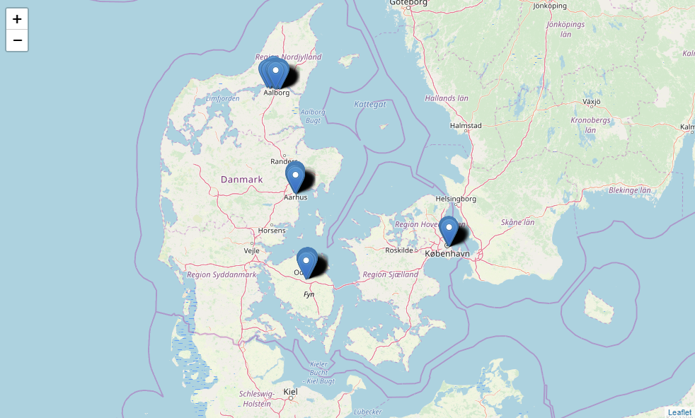
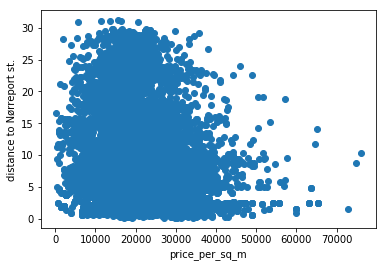
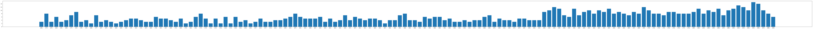
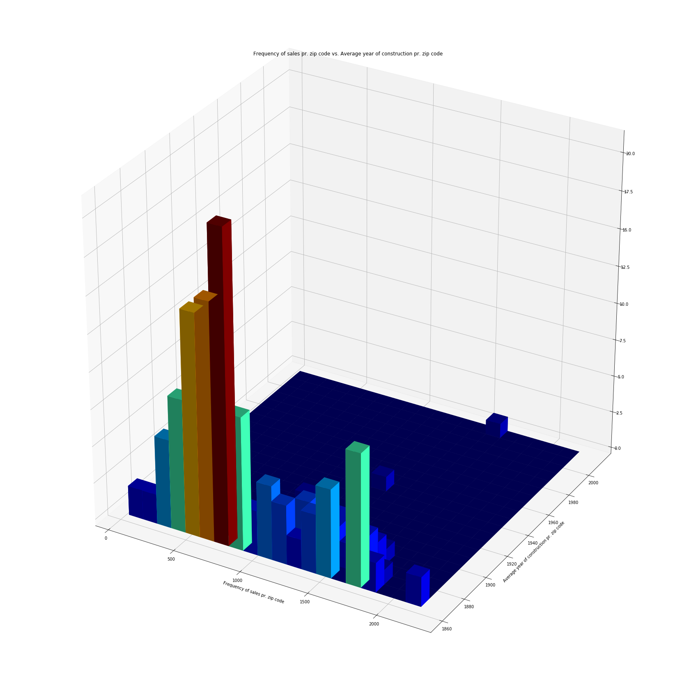

# Assignment 3: Data Visualisation

Gruppe Dangerous Memory: Jake, Christian, Alexander

https://github.com/datsoftlyngby/soft2019fall-bi-teaching-material/tree/master/week37/assignment_3

## Tasks

**1. Create a plot with the help of Basemap, on which you plot sales records for 2015 which are not farther away than 50km from Copenhagen city center (lat: 55.676111, lon: 12.568333)**


```python
# import 
import zipfile
import pandas as pd
import os.path
import datetime
from tqdm import tqdm
#os.environ["PROJ_LIB"] = "C:\\Users\\awha\\Anaconda3\\Library\\share" # might be needed in windows10
from mpl_toolkits.basemap import Basemap
import matplotlib.pyplot as plt
import folium
```

Using the dataset form the [previous assignment](https://github.com/Business-Intelligence-Dangerous-Memory/Assignment_2) (containing lan, lot and sales dates as proper datetime objects), unzipped from osm_export.zip to osm_export.csv (if not already extracted):


```python
if not os.path.isfile("osm_export.csv"):
    with zipfile.ZipFile("osm_export.zip", 'r') as zip_ref:
        zip_ref.extractall()
```

Import the extracted .csv file as a pandas dataframe as df_data:  


```python
df_data = pd.read_csv('osm_export.csv')
```

Using a [mask](https://pandas.pydata.org/pandas-docs/stable/reference/api/pandas.DataFrame.mask.html) to specify sales records from 2015:


```python
start_2015 = datetime.datetime(2015, 1, 1)
end_2015 = datetime.datetime(2015, 12, 31)
mask = (pd.to_datetime(df_data['sell_date']) > start_2015) & (pd.to_datetime(df_data['sell_date']) <= end_2015)
df_data_2015 = df_data.loc[mask]
```

Using the following function to compute the [Haversine Distance](https://en.wikipedia.org/wiki/Haversine_formula) from the location of each location in the dataset to the [Copenhagen city center](https://www.latlong.net/place/copenhagen-denmark-4775.html):


```python
import math
def haversine_distance(origin, destination):

    lat_orig, lon_orig = origin
    lat_dest, lon_dest = destination
    radius = 6371

    dlat = math.radians(lat_dest-lat_orig)
    dlon = math.radians(lon_dest-lon_orig)
    a = (math.sin(dlat / 2) * math.sin(dlat / 2) + math.cos(math.radians(lat_orig)) 
        * math.cos(math.radians(lat_dest)) * math.sin(dlon / 2) * math.sin(dlon / 2))
    c = 2 * math.atan2(math.sqrt(a), math.sqrt(1 - a))
    d = radius * c

    return d
```


```python
#Copenhagen city center (lat=55.676098, lon=12.568337)
tqdm.pandas(desc="Creating haversine distance to Copenhagen city center")
df_not_nan = df_data.dropna().copy()
list_df = df_not_nan.apply(lambda y : haversine_distance(tuple([55.676098,12.568337]), tuple([y['lat'], y['lon']])), axis=1)
```

Add the list of haversine distance to Copenhagen city center to the dataframe as a new column:


```python
df_not_nan['hav_dis_cph_50'] = list_df
```

Create a new dataframe containing locations where the haversine is <= 50km from Copenhagen city center:


```python
df_50_km = df_not_nan[(df_not_nan['hav_dis_cph_50'] <= 50)].copy()
```

Plot this data using Basemap: 


```python
fig = plt.figure(figsize = (10,10))

map = Basemap(
    lat_0=55.676098, 
    lon_0= 12.568337, 
    llcrnrlon=11.5, 
    llcrnrlat=55,
    urcrnrlon=13, 
    urcrnrlat=56.5)

x, y = map(df_50_km['lon'].tolist(), df_50_km['lat'].tolist())
map.scatter(x, y)
plt.show()
```


**2. Use folium to plot the locations of the 1992 housing sales for the city centers of Copenhagen (zip code 1000-1499), Odense (zip code 5000), Aarhus (zip code 8000), and Aalborg (zip code 9000), see Assignment 2 onto a map.**

Load dataset from csv files, clean NaN values, define folium map start area & zoom level over Denmark, combine a list of the dataframes & concatonate them into 1 dataframe.

for each location in the dataframe, add a marker to the folium map by its lan & lon values, and add address + zip_code as popup marker value.


```python
df_cph = pd.read_csv('year-1992_zip-1050-1499.csv')
df_odense = pd.read_csv('year-1992_zip-5000.csv')
df_aarhus = pd.read_csv('year-1992_zip-8000.csv')
df_aalborg = pd.read_csv('year-1992_zip-9000.csv')

df_cph = df_cph.dropna()
df_odense = df_odense.dropna()
df_aarhus = df_aarhus.dropna()
df_aalborg = df_aalborg.dropna()


m = folium.Map([56,11], zoom_start=7)

all_list = [df_cph, df_odense, df_aarhus, df_aalborg]
df_all = pd.concat(all_list)
for index, row in df_all.iterrows():
    folium.Marker(location=[row['lat'], row['lon']], popup=row['address'] + " " + row['zip_code']).add_to(m)

```





**3. Create a 2D plot, which compares prices per square meter (on the x-axis) and distance to Nørreport st. (y-axis) for all housing on Sjæland for the year 2005 and where the zip code is lower than 3000 and the price per square meter is lower than 80000Dkk. Describe in words what you can read out of the plot. Formulate a hypothesis on how the values on the two axis might be related.**

Define a mask for 2005 and filter the data into df_data_2005 dataframe.

Define a mask for < 80k square meter price and filter the data into df_data_2005_80k dataframe.

Add a new column to the dataframe, containing the zip code only.

Define a mask for < 3k zip code and filter the data into df_data_2005_80k_3k dataframe.


```python
start_2005 = datetime.datetime(2005, 1, 1)
end_2005 = datetime.datetime(2005, 12, 31)
mask_2005 = (pd.to_datetime(df_data['sell_date']) > start_2005) & (pd.to_datetime(df_data['sell_date']) <= end_2005)
df_data_2005 = df_not_nan.loc[mask_2005].copy()

mask_80k = (df_data['price_per_sq_m'] < 80000)
df_data_2005_80k = df_data_2005.loc[mask_80k].copy()

zip_3k = df_data_2005_80k['zip_code'].str.split(" ", n = 1, expand = True) 
df_data_2005_80k['zip'] = zip_3k[0]

mask_3k = (df_data_2005_80k['zip'].astype(int) < 3000)
df_data_2005_80k_3k = df_data_2005_80k.loc[mask_3k].copy()
```

Using Haversine Distance function from the location of each location in the dataset to [Nørreport station](https://latitude.to/articles-by-country/dk/denmark/39321/norreport-station) to create a list and add it to the dataframe:


```python
#lat/lon nørreport st: 55.6833306 12.569664388
#tqdm.pandas(desc="Creating haversine distance to Nørreport st.")
list_hav_norreport = df_data_2005_80k_3k.apply(lambda y : haversine_distance(tuple([55.6833306,12.569664388]), tuple([y['lat'], y['lon']])), axis=1)
df_data_2005_80k_3k['hav_dis_norreport'] = list_hav_norreport
```

Plot the data: Price per square meter (on the x-axis) and distance to Nørreport st. (y-axis):


```python
plt.scatter(df_data_2005_80k_3k['price_per_sq_m'],df_data_2005_80k_3k['hav_dis_norreport'])
plt.ylabel('distance to Nørreport st.')
plt.xlabel('price_per_sq_m')
plt.show()
```





The plot above might indicate that the price per square meter of a location is related to the distance to Nørreport st.; 
**The closer the distance, the higher the price.** 

**4. Create a histogram (bar plot), which visualizes the frequency of house trades per zip code area corresponding to the entire dataset of housing sale records.**

The plot below is generated by first viewing above 1500 zipcodes only (non-administrative zipcodes), and plotting the occurance (frequency) as a large bar chart for each zip code.


```python
df_groupby_zip = df_data_2005_80k_3k.copy()
mask = (df_data_2005_80k_3k['zip'].astype(int) > 1500)
df_groupby_zip = df_groupby_zip.loc[mask].groupby(["zip"])
df_groupby_zip['zip_code'].count().plot(kind = 'bar', figsize=(150,5))
```


    <matplotlib.axes._subplots.AxesSubplot at 0x1769d59e780>


**5. Create a cumulatve histogram, which visualizes the frequency of house trades per zip code area corresponding to the entire dataset of housing sale records and the vertical bars are colored to the frequency of rooms per sales record. That is, a plot similar to the following, where single rooms are in the bottom and two room frequencies on top, etc. See, http://matplotlib.org/1.3.0/examples/pylab\_examples/histogram\_demo\_extended.html for example.**


As we understood the task, we would have liked to create a bar plot showing zipcodes on the X-axis, and number of rooms on the Y-axis (as we have done below). Each bar should then be colored room number aswell, as to be able to view what slice of the bar is 1 room, 2 room etc. 

We tried, unsuccesfully to find a solution of how to "stack the room numbers" in a bar chart for each zip code, so we unded up just showing the cummulated room numbers for each zipcode instead:


```python
df_groupby_zip = df_data_2005_80k_3k.copy()
mask = (df_data_2005_80k_3k['zip'].astype(int) > 1500)
df_groupby_zip = df_groupby_zip.loc[mask]

a = df_groupby_zip['zip']
b = df_groupby_zip['no_rooms']

fig, ax = plt.subplots(figsize=(150,5)) 
plt.bar(a,b)
```


    <BarContainer object of 12800 artists>





**6. Now, you create a 3D histogram, in which you plot the frequency of house trades per zip code area as a 'layer' for every in the dataset, see http://matplotlib.org/examples/mplot3d/index.html for an example.**

****7. Freestyle Create a plot, which visualizes a fact hidden in the housing sales data, which you want to highlight to business people.**

Similar to task 5, we had some issues 1) understanding what exactly was the task at hand from the description, and 2) what data exactly was to be plotted in a 3D histogram. Therefore, task 6 possibly ended up as a solution attempt of task 6 - hence the grouping of task 6 & 7

The idea was to visually investigate, if there was some (hidden) information related to the Average year of construction and frequency of sale pr. zip code.

We tried to wing a solution, as shown below - but are not totally sure if the graph shows what we think it shows; 
To plot the "Frequency of sales pr. zip code vs. Average year of construction pr. zip code" as a 3d plot as a 3d histogram:


```python
# used https://stackoverflow.com/a/51624315 as inspiration/solution
from matplotlib import cm

datadf = df_data_2005_80k_3k.copy()

mask = (datadf['zip'].astype(int) > 1500)

# X: Frequency of sales pr. zip code
freq_pr_zip_df = datadf.loc[mask].groupby(["zip"])['zip_code'].count()

# Y: AVG YAR_OF_CONSTRUCTION pr. zip code
avg_year_of_construction = datadf.loc[mask].groupby(["zip"])['year_of_construction'].mean()

#######

x = np.array(freq_pr_zip_df)
y = np.array(avg_year_of_construction)

fig = plt.figure(figsize=(30, 30))
ax = fig.add_subplot(111, projection='3d')

hist, xedges, yedges = np.histogram2d(x, y, bins=(20,20))
xpos, ypos = np.meshgrid(xedges[:-1]+xedges[1:], yedges[:-1]+yedges[1:])

xpos = xpos.flatten()/2.
ypos = ypos.flatten()/2.
zpos = np.zeros_like (xpos)

dx = xedges [1] - xedges [0]
dy = yedges [1] - yedges [0]
dz = hist.flatten()

cmap = cm.get_cmap('jet') # Get desired colormap - you can change this!
max_height = np.max(dz)   # get range of colorbars so we can normalize
min_height = np.min(dz)
# scale each z to [0,1], and get their rgb values
rgba = [cmap((k-min_height)/max_height) for k in dz] 

ax.bar3d(xpos, ypos, zpos, dx, dy, dz, color=rgba, zsort='average')
plt.title("Frequency of sales pr. zip code vs. Average year of construction pr. zip code")
plt.xlabel("Frequency of sales pr. zip code")
plt.ylabel("Average year of construction pr. zip code")
plt.show()
```





The graph could indicate that generally, older houses are sold less frequently (?)
