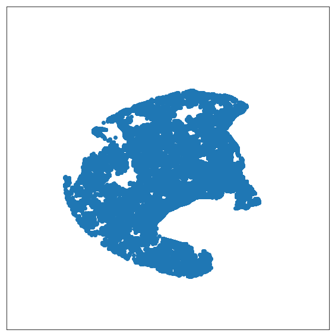

# Assignment 3: Data Visualisation

Gruppe Dangerous Memory: Jake, Christian, Alexander

https://github.com/datsoftlyngby/soft2019fall-bi-teaching-material/tree/master/week37/assignment_3

## Tasks

**1. Create a plot with the help of Basemap, on which you plot sales records for 2015 which are not farther away than 50km from Copenhagen city center (lat: 55.676111, lon: 12.568333)**


```python
# import 
import zipfile
import pandas as pd
import os.path
import datetime
from tqdm import tqdm
#os.environ["PROJ_LIB"] = "C:\\Users\\awha\\Anaconda3\\Library\\share" # might be needed in windows10
from mpl_toolkits.basemap import Basemap
import matplotlib.pyplot as plt
import folium
```

Using the dataset form the [previous assignment](https://github.com/Business-Intelligence-Dangerous-Memory/Assignment_2) (containing lan, lot and sales dates as proper datetime objects), unzipped from osm_export.zip to osm_export.csv (if not already extracted):


```python
if not os.path.isfile("osm_export.csv"):
    with zipfile.ZipFile("osm_export.zip", 'r') as zip_ref:
        zip_ref.extractall()
```

Import the extracted .csv file as a pandas dataframe as df_data:  


```python
df_data = pd.read_csv('osm_export.csv')
```

Using a [mask](https://pandas.pydata.org/pandas-docs/stable/reference/api/pandas.DataFrame.mask.html) to specify sales records from 2015:


```python
start_2015 = datetime.datetime(2015, 1, 1)
end_2015 = datetime.datetime(2015, 12, 31)
mask = (pd.to_datetime(df_data['sell_date']) > start_2015) & (pd.to_datetime(df_data['sell_date']) <= end_2015)
df_data_2015 = df_data.loc[mask]
```

Using the following function to compute the [Haversine Distance](https://en.wikipedia.org/wiki/Haversine_formula) from the location of each location in the dataset to the [Copenhagen city center](https://www.latlong.net/place/copenhagen-denmark-4775.html):


```python
import math
def haversine_distance(origin, destination):

    lat_orig, lon_orig = origin
    lat_dest, lon_dest = destination
    radius = 6371

    dlat = math.radians(lat_dest-lat_orig)
    dlon = math.radians(lon_dest-lon_orig)
    a = (math.sin(dlat / 2) * math.sin(dlat / 2) + math.cos(math.radians(lat_orig)) 
        * math.cos(math.radians(lat_dest)) * math.sin(dlon / 2) * math.sin(dlon / 2))
    c = 2 * math.atan2(math.sqrt(a), math.sqrt(1 - a))
    d = radius * c

    return d
```


```python
#Copenhagen city center (lat=55.676098, lon=12.568337)
tqdm.pandas(desc="Creating haversine distance to Copenhagen city center")
df_not_nan = df_data.dropna().copy()
list_df = df_not_nan.apply(lambda y : haversine_distance(tuple([55.676098,12.568337]), tuple([y['lat'], y['lon']])), axis=1)
```

Add the list of haversine distance to Copenhagen city center to the dataframe as a new column:


```python
df_not_nan['hav_dis_cph_50'] = list_df
```

Create a new dataframe containing locations where the haversine is <= 50km from Copenhagen city center:


```python
df_50_km = df_not_nan[(df_not_nan['hav_dis_cph_50'] <= 50)].copy()
```

Plot this data using Basemap: 


```python
fig = plt.figure(figsize = (10,10))

map = Basemap(
    lat_0=55.676098, 
    lon_0= 12.568337, 
    llcrnrlon=11.5, 
    llcrnrlat=55,
    urcrnrlon=13, 
    urcrnrlat=56.5)

x, y = map(df_50_km['lon'].tolist(), df_50_km['lat'].tolist())
map.scatter(x, y)
plt.show()
```





**2. Use folium to plot the locations of the 1992 housing sales for the city centers of Copenhagen (zip code 1000-1499), Odense (zip code 5000), Aarhus (zip code 8000), and Aalborg (zip code 9000), see Assignment 2 onto a map.**

Load dataset from csv files, clean NaN values, define folium map start area & zoom level over Denmark, combine a list of the dataframes & concatonate them into 1 dataframe.

for each location in the dataframe, add a marker to the folium map by its lan & lon values, and add address + zip_code as popup marker value.


```python
df_cph = pd.read_csv('year-1992_zip-1050-1499.csv')
df_odense = pd.read_csv('year-1992_zip-5000.csv')
df_aarhus = pd.read_csv('year-1992_zip-8000.csv')
df_aalborg = pd.read_csv('year-1992_zip-9000.csv')

df_cph = df_cph.dropna()
df_odense = df_odense.dropna()
df_aarhus = df_aarhus.dropna()
df_aalborg = df_aalborg.dropna()


m = folium.Map([56,11], zoom_start=7)

all_list = [df_cph, df_odense, df_aarhus, df_aalborg]
df_all = pd.concat(all_list)
for index, row in df_all.iterrows():
    folium.Marker(location=[row['lat'], row['lon']], popup=row['address'] + " " + row['zip_code']).add_to(m)

m
```


<div style="width:100%;"><div style="position:relative;width:100%;height:0;padding-bottom:60%;"><iframe src="data:text/html;charset=utf-8;base64,PCFET0NUWVBFIGh0bWw+CjxoZWFkPiAgICAKICAgIDxtZXRhIGh0dHAtZXF1aXY9ImNvbnRlbnQtdHlwZSIgY29udGVudD0idGV4dC9odG1sOyBjaGFyc2V0PVVURi04IiAvPgogICAgPHNjcmlwdD5MX1BSRUZFUl9DQU5WQVM9ZmFsc2U7IExfTk9fVE9VQ0g9ZmFsc2U7IExfRElTQUJMRV8zRD1mYWxzZTs8L3NjcmlwdD4KICAgIDxzY3JpcHQgc3JjPSJodHRwczovL2Nkbi5qc2RlbGl2ci5uZXQvbnBtL2xlYWZsZXRAMS4yLjAvZGlzdC9sZWFmbGV0LmpzIj48L3NjcmlwdD4KICAgIDxzY3JpcHQgc3JjPSJodHRwczovL2FqYXguZ29vZ2xlYXBpcy5jb20vYWpheC9saWJzL2pxdWVyeS8xLjExLjEvanF1ZXJ5Lm1pbi5qcyI+PC9zY3JpcHQ+CiAgICA8c2NyaXB0IHNyYz0iaHR0cHM6Ly9tYXhjZG4uYm9vdHN0cmFwY2RuLmNvbS9ib290c3RyYXAvMy4yLjAvanMvYm9vdHN0cmFwLm1pbi5qcyI+PC9zY3JpcHQ+CiAgICA8c2NyaXB0IHNyYz0iaHR0cHM6Ly9jZG5qcy5jbG91ZGZsYXJlLmNvbS9hamF4L2xpYnMvTGVhZmxldC5hd2Vzb21lLW1hcmtlcnMvMi4wLjIvbGVhZmxldC5hd2Vzb21lLW1hcmtlcnMuanMiPjwvc2NyaXB0PgogICAgPGxpbmsgcmVsPSJzdHlsZXNoZWV0IiBocmVmPSJodHRwczovL2Nkbi5qc2RlbGl2ci5uZXQvbnBtL2xlYWZsZXRAMS4yLjAvZGlzdC9sZWFmbGV0LmNzcyIvPgogICAgPGxpbmsgcmVsPSJzdHlsZXNoZWV0IiBocmVmPSJodHRwczovL21heGNkbi5ib290c3RyYXBjZG4uY29tL2Jvb3RzdHJhcC8zLjIuMC9jc3MvYm9vdHN0cmFwLm1pbi5jc3MiLz4KICAgIDxsaW5rIHJlbD0ic3R5bGVzaGVldCIgaHJlZj0iaHR0cHM6Ly9tYXhjZG4uYm9vdHN0cmFwY2RuLmNvbS9ib290c3RyYXAvMy4yLjAvY3NzL2Jvb3RzdHJhcC10aGVtZS5taW4uY3NzIi8+CiAgICA8bGluayByZWw9InN0eWxlc2hlZXQiIGhyZWY9Imh0dHBzOi8vbWF4Y2RuLmJvb3RzdHJhcGNkbi5jb20vZm9udC1hd2Vzb21lLzQuNi4zL2Nzcy9mb250LWF3ZXNvbWUubWluLmNzcyIvPgogICAgPGxpbmsgcmVsPSJzdHlsZXNoZWV0IiBocmVmPSJodHRwczovL2NkbmpzLmNsb3VkZmxhcmUuY29tL2FqYXgvbGlicy9MZWFmbGV0LmF3ZXNvbWUtbWFya2Vycy8yLjAuMi9sZWFmbGV0LmF3ZXNvbWUtbWFya2Vycy5jc3MiLz4KICAgIDxsaW5rIHJlbD0ic3R5bGVzaGVldCIgaHJlZj0iaHR0cHM6Ly9yYXdnaXQuY29tL3B5dGhvbi12aXN1YWxpemF0aW9uL2ZvbGl1bS9tYXN0ZXIvZm9saXVtL3RlbXBsYXRlcy9sZWFmbGV0LmF3ZXNvbWUucm90YXRlLmNzcyIvPgogICAgPHN0eWxlPmh0bWwsIGJvZHkge3dpZHRoOiAxMDAlO2hlaWdodDogMTAwJTttYXJnaW46IDA7cGFkZGluZzogMDt9PC9zdHlsZT4KICAgIDxzdHlsZT4jbWFwIHtwb3NpdGlvbjphYnNvbHV0ZTt0b3A6MDtib3R0b206MDtyaWdodDowO2xlZnQ6MDt9PC9zdHlsZT4KICAgIAogICAgPHN0eWxlPiNtYXBfNjA1NmMyY2FiZWRhNDIxMGIzOTYwOTVmODRmNjFhYWQgewogICAgICAgIHBvc2l0aW9uOiByZWxhdGl2ZTsKICAgICAgICB3aWR0aDogMTAwLjAlOwogICAgICAgIGhlaWdodDogMTAwLjAlOwogICAgICAgIGxlZnQ6IDAuMCU7CiAgICAgICAgdG9wOiAwLjAlOwogICAgICAgIH0KICAgIDwvc3R5bGU+CjwvaGVhZD4KPGJvZHk+ICAgIAogICAgCiAgICA8ZGl2IGNsYXNzPSJmb2xpdW0tbWFwIiBpZD0ibWFwXzYwNTZjMmNhYmVkYTQyMTBiMzk2MDk1Zjg0ZjYxYWFkIiA+PC9kaXY+CjwvYm9keT4KPHNjcmlwdD4gICAgCiAgICAKICAgIAogICAgICAgIHZhciBib3VuZHMgPSBudWxsOwogICAgCgogICAgdmFyIG1hcF82MDU2YzJjYWJlZGE0MjEwYjM5NjA5NWY4NGY2MWFhZCA9IEwubWFwKAogICAgICAgICdtYXBfNjA1NmMyY2FiZWRhNDIxMGIzOTYwOTVmODRmNjFhYWQnLCB7CiAgICAgICAgY2VudGVyOiBbNTYsIDExXSwKICAgICAgICB6b29tOiA3LAogICAgICAgIG1heEJvdW5kczogYm91bmRzLAogICAgICAgIGxheWVyczogW10sCiAgICAgICAgd29ybGRDb3B5SnVtcDogZmFsc2UsCiAgICAgICAgY3JzOiBMLkNSUy5FUFNHMzg1NywKICAgICAgICB6b29tQ29udHJvbDogdHJ1ZSwKICAgICAgICB9KTsKCiAgICAKICAgIAogICAgdmFyIHRpbGVfbGF5ZXJfYzM5OGNlYWUzNDRlNDU4MDhiNmY3MDE5NWYwMjVhZTQgPSBMLnRpbGVMYXllcigKICAgICAgICAnaHR0cHM6Ly97c30udGlsZS5vcGVuc3RyZWV0bWFwLm9yZy97en0ve3h9L3t5fS5wbmcnLAogICAgICAgIHsKICAgICAgICAiYXR0cmlidXRpb24iOiBudWxsLAogICAgICAgICJkZXRlY3RSZXRpbmEiOiBmYWxzZSwKICAgICAgICAibWF4TmF0aXZlWm9vbSI6IDE4LAogICAgICAgICJtYXhab29tIjogMTgsCiAgICAgICAgIm1pblpvb20iOiAwLAogICAgICAgICJub1dyYXAiOiBmYWxzZSwKICAgICAgICAic3ViZG9tYWlucyI6ICJhYmMiCn0pLmFkZFRvKG1hcF82MDU2YzJjYWJlZGE0MjEwYjM5NjA5NWY4NGY2MWFhZCk7CiAgICAKICAgICAgICB2YXIgbWFya2VyX2JlODFlYmE5NmMwNDRhMTM4NDgzNzY3NGUwNzVmNjYyID0gTC5tYXJrZXIoCiAgICAgICAgICAgIFs1NS42ODA5MTcsIDEyLjU4ODI4NF0sCiAgICAgICAgICAgIHsKICAgICAgICAgICAgICAgIGljb246IG5ldyBMLkljb24uRGVmYXVsdCgpCiAgICAgICAgICAgICAgICB9CiAgICAgICAgICAgICkuYWRkVG8obWFwXzYwNTZjMmNhYmVkYTQyMTBiMzk2MDk1Zjg0ZjYxYWFkKTsKICAgICAgICAKICAgIAogICAgICAgICAgICB2YXIgcG9wdXBfYmU4Yzg0MjFlNzVmNDAzOGFiZjA0NDY5MjMyMzI1YTMgPSBMLnBvcHVwKHttYXhXaWR0aDogJzMwMCcKICAgICAgICAgICAgCiAgICAgICAgICAgIH0pOwoKICAgICAgICAgICAgCiAgICAgICAgICAgICAgICB2YXIgaHRtbF80YzA1MDM4MTM5NDI0NGNjYWFlOTZjY2EyYTAzYmEwOSA9ICQoJzxkaXYgaWQ9Imh0bWxfNGMwNTAzODEzOTQyNDRjY2FhZTk2Y2NhMmEwM2JhMDkiIHN0eWxlPSJ3aWR0aDogMTAwLjAlOyBoZWlnaHQ6IDEwMC4wJTsiPlN0b3JlIFN0cmFuZHN0csOmZGUgNiwgMiAxMjU1IEvDuGJlbmhhdm4gSzwvZGl2PicpWzBdOwogICAgICAgICAgICAgICAgcG9wdXBfYmU4Yzg0MjFlNzVmNDAzOGFiZjA0NDY5MjMyMzI1YTMuc2V0Q29udGVudChodG1sXzRjMDUwMzgxMzk0MjQ0Y2NhYWU5NmNjYTJhMDNiYTA5KTsKICAgICAgICAgICAgCgogICAgICAgICAgICBtYXJrZXJfYmU4MWViYTk2YzA0NGExMzg0ODM3Njc0ZTA3NWY2NjIuYmluZFBvcHVwKHBvcHVwX2JlOGM4NDIxZTc1ZjQwMzhhYmYwNDQ2OTIzMjMyNWEzKQogICAgICAgICAgICA7CgogICAgICAgICAgICAKICAgICAgICAKICAgIAogICAgICAgIHZhciBtYXJrZXJfM2MzMWNlNzk0Zjk2NDlhYjlkZThjZGRkMGE2NDQ4ZDIgPSBMLm1hcmtlcigKICAgICAgICAgICAgWzU1LjY3MzQyNSwgMTIuNTkxNzYyXSwKICAgICAgICAgICAgewogICAgICAgICAgICAgICAgaWNvbjogbmV3IEwuSWNvbi5EZWZhdWx0KCkKICAgICAgICAgICAgICAgIH0KICAgICAgICAgICAgKS5hZGRUbyhtYXBfNjA1NmMyY2FiZWRhNDIxMGIzOTYwOTVmODRmNjFhYWQpOwogICAgICAgIAogICAgCiAgICAgICAgICAgIHZhciBwb3B1cF85MWI0MTdhMjM2Y2Q0NTI5YTk3MDY2NjY5MjQwNzdhOSA9IEwucG9wdXAoe21heFdpZHRoOiAnMzAwJwogICAgICAgICAgICAKICAgICAgICAgICAgfSk7CgogICAgICAgICAgICAKICAgICAgICAgICAgICAgIHZhciBodG1sX2FiNDliNTgzN2Q1ZjQyODQ5ZTkyNzBlZTkzZjkwMGNmID0gJCgnPGRpdiBpZD0iaHRtbF9hYjQ5YjU4MzdkNWY0Mjg0OWU5MjcwZWU5M2Y5MDBjZiIgc3R5bGU9IndpZHRoOiAxMDAuMCU7IGhlaWdodDogMTAwLjAlOyI+T3ZlcmdhZGVuIE5lZGVuIFZhbmRldCAzOSwgMi4gVEggMTQxNCBLw7hiZW5oYXZuIEs8L2Rpdj4nKVswXTsKICAgICAgICAgICAgICAgIHBvcHVwXzkxYjQxN2EyMzZjZDQ1MjlhOTcwNjY2NjkyNDA3N2E5LnNldENvbnRlbnQoaHRtbF9hYjQ5YjU4MzdkNWY0Mjg0OWU5MjcwZWU5M2Y5MDBjZik7CiAgICAgICAgICAgIAoKICAgICAgICAgICAgbWFya2VyXzNjMzFjZTc5NGY5NjQ5YWI5ZGU4Y2RkZDBhNjQ0OGQyLmJpbmRQb3B1cChwb3B1cF85MWI0MTdhMjM2Y2Q0NTI5YTk3MDY2NjY5MjQwNzdhOSkKICAgICAgICAgICAgOwoKICAgICAgICAgICAgCiAgICAgICAgCiAgICAKICAgICAgICB2YXIgbWFya2VyX2Q5MDg4NWNlYzE3ODRlYTk5ZjFkOGRhMjk5NTVlN2MxID0gTC5tYXJrZXIoCiAgICAgICAgICAgIFs1NS42ODk1MzEsIDEyLjU3MTgzM10sCiAgICAgICAgICAgIHsKICAgICAgICAgICAgICAgIGljb246IG5ldyBMLkljb24uRGVmYXVsdCgpCiAgICAgICAgICAgICAgICB9CiAgICAgICAgICAgICkuYWRkVG8obWFwXzYwNTZjMmNhYmVkYTQyMTBiMzk2MDk1Zjg0ZjYxYWFkKTsKICAgICAgICAKICAgIAogICAgICAgICAgICB2YXIgcG9wdXBfZTA1NzI5MzFiZGQ5NGVlYTgzMWI1ZTVhODFlZWNhNDEgPSBMLnBvcHVwKHttYXhXaWR0aDogJzMwMCcKICAgICAgICAgICAgCiAgICAgICAgICAgIH0pOwoKICAgICAgICAgICAgCiAgICAgICAgICAgICAgICB2YXIgaHRtbF8zYmY0NjBjZTAwNGU0M2ZlYjliY2ZkYjVmOGMxOTQ4NCA9ICQoJzxkaXYgaWQ9Imh0bWxfM2JmNDYwY2UwMDRlNDNmZWI5YmNmZGI1ZjhjMTk0ODQiIHN0eWxlPSJ3aWR0aDogMTAwLjAlOyBoZWlnaHQ6IDEwMC4wJTsiPk9sZSBTdWhycyBHYWRlIDE0LCAzLiBUViAxMzU0IEvDuGJlbmhhdm4gSzwvZGl2PicpWzBdOwogICAgICAgICAgICAgICAgcG9wdXBfZTA1NzI5MzFiZGQ5NGVlYTgzMWI1ZTVhODFlZWNhNDEuc2V0Q29udGVudChodG1sXzNiZjQ2MGNlMDA0ZTQzZmViOWJjZmRiNWY4YzE5NDg0KTsKICAgICAgICAgICAgCgogICAgICAgICAgICBtYXJrZXJfZDkwODg1Y2VjMTc4NGVhOTlmMWQ4ZGEyOTk1NWU3YzEuYmluZFBvcHVwKHBvcHVwX2UwNTcyOTMxYmRkOTRlZWE4MzFiNWU1YTgxZWVjYTQxKQogICAgICAgICAgICA7CgogICAgICAgICAgICAKICAgICAgICAKICAgIAogICAgICAgIHZhciBtYXJrZXJfZTE3NzE1M2Q1MDFiNGVmMThiMzg0OWQ2NjdlNzY0YWMgPSBMLm1hcmtlcigKICAgICAgICAgICAgWzU1LjY3NTQ0MTAwMDAwMDAwNiwgMTIuNTk4Mjg5XSwKICAgICAgICAgICAgewogICAgICAgICAgICAgICAgaWNvbjogbmV3IEwuSWNvbi5EZWZhdWx0KCkKICAgICAgICAgICAgICAgIH0KICAgICAgICAgICAgKS5hZGRUbyhtYXBfNjA1NmMyY2FiZWRhNDIxMGIzOTYwOTVmODRmNjFhYWQpOwogICAgICAgIAogICAgCiAgICAgICAgICAgIHZhciBwb3B1cF80YmJhNzQ4ZTUwY2E0YjJlYjI4NmJjMjY3MDg4YzRkYyA9IEwucG9wdXAoe21heFdpZHRoOiAnMzAwJwogICAgICAgICAgICAKICAgICAgICAgICAgfSk7CgogICAgICAgICAgICAKICAgICAgICAgICAgICAgIHZhciBodG1sXzdkMmFkOTBlYjY5ZjQxZjY5ZTM4ZmQ1MzNmNmQzZGZjID0gJCgnPGRpdiBpZD0iaHRtbF83ZDJhZDkwZWI2OWY0MWY2OWUzOGZkNTMzZjZkM2RmYyIgc3R5bGU9IndpZHRoOiAxMDAuMCU7IGhlaWdodDogMTAwLjAlOyI+QnVybWVpc3RlcnNnYWRlIDksIDUuIFRWIDE0MjkgS8O4YmVuaGF2biBLPC9kaXY+JylbMF07CiAgICAgICAgICAgICAgICBwb3B1cF80YmJhNzQ4ZTUwY2E0YjJlYjI4NmJjMjY3MDg4YzRkYy5zZXRDb250ZW50KGh0bWxfN2QyYWQ5MGViNjlmNDFmNjllMzhmZDUzM2Y2ZDNkZmMpOwogICAgICAgICAgICAKCiAgICAgICAgICAgIG1hcmtlcl9lMTc3MTUzZDUwMWI0ZWYxOGIzODQ5ZDY2N2U3NjRhYy5iaW5kUG9wdXAocG9wdXBfNGJiYTc0OGU1MGNhNGIyZWIyODZiYzI2NzA4OGM0ZGMpCiAgICAgICAgICAgIDsKCiAgICAgICAgICAgIAogICAgICAgIAogICAgCiAgICAgICAgdmFyIG1hcmtlcl8wYjhmMGY5OTY2MDI0YTg0OGNiZWM2NWQ4ZDhiYjlkOCA9IEwubWFya2VyKAogICAgICAgICAgICBbNTUuNjg3MDAzMDAwMDAwMDA0LCAxMi41OTAyNjhdLAogICAgICAgICAgICB7CiAgICAgICAgICAgICAgICBpY29uOiBuZXcgTC5JY29uLkRlZmF1bHQoKQogICAgICAgICAgICAgICAgfQogICAgICAgICAgICApLmFkZFRvKG1hcF82MDU2YzJjYWJlZGE0MjEwYjM5NjA5NWY4NGY2MWFhZCk7CiAgICAgICAgCiAgICAKICAgICAgICAgICAgdmFyIHBvcHVwXzM1MDU3YmIwNzVjMDRhMDQ4MjZjZjlkNDM4NWZhN2IyID0gTC5wb3B1cCh7bWF4V2lkdGg6ICczMDAnCiAgICAgICAgICAgIAogICAgICAgICAgICB9KTsKCiAgICAgICAgICAgIAogICAgICAgICAgICAgICAgdmFyIGh0bWxfZjg5ODAzY2M4NDExNDlkMzljMGI5NGFkOGIwYmEzNGIgPSAkKCc8ZGl2IGlkPSJodG1sX2Y4OTgwM2NjODQxMTQ5ZDM5YzBiOTRhZDhiMGJhMzRiIiBzdHlsZT0id2lkdGg6IDEwMC4wJTsgaGVpZ2h0OiAxMDAuMCU7Ij5TdG9yZSBLb25nZW5zZ2FkZSAxMTBBLCAzLiBUSCAxMjY0IEvDuGJlbmhhdm4gSzwvZGl2PicpWzBdOwogICAgICAgICAgICAgICAgcG9wdXBfMzUwNTdiYjA3NWMwNGEwNDgyNmNmOWQ0Mzg1ZmE3YjIuc2V0Q29udGVudChodG1sX2Y4OTgwM2NjODQxMTQ5ZDM5YzBiOTRhZDhiMGJhMzRiKTsKICAgICAgICAgICAgCgogICAgICAgICAgICBtYXJrZXJfMGI4ZjBmOTk2NjAyNGE4NDhjYmVjNjVkOGQ4YmI5ZDguYmluZFBvcHVwKHBvcHVwXzM1MDU3YmIwNzVjMDRhMDQ4MjZjZjlkNDM4NWZhN2IyKQogICAgICAgICAgICA7CgogICAgICAgICAgICAKICAgICAgICAKICAgIAogICAgICAgIHZhciBtYXJrZXJfNGFjNmY0OTkyYzBmNGI3NmIzNzU2NmE1N2M3NGRhZDggPSBMLm1hcmtlcigKICAgICAgICAgICAgWzU1LjY4NTIwMywgMTIuNTg0MzMzXSwKICAgICAgICAgICAgewogICAgICAgICAgICAgICAgaWNvbjogbmV3IEwuSWNvbi5EZWZhdWx0KCkKICAgICAgICAgICAgICAgIH0KICAgICAgICAgICAgKS5hZGRUbyhtYXBfNjA1NmMyY2FiZWRhNDIxMGIzOTYwOTVmODRmNjFhYWQpOwogICAgICAgIAogICAgCiAgICAgICAgICAgIHZhciBwb3B1cF82OTVlYjAwYTNlN2I0MTFlODYwNjIyODZiMWYwNGI0OCA9IEwucG9wdXAoe21heFdpZHRoOiAnMzAwJwogICAgICAgICAgICAKICAgICAgICAgICAgfSk7CgogICAgICAgICAgICAKICAgICAgICAgICAgICAgIHZhciBodG1sX2MxNDhmYzJkNTM2MjQzY2M4M2Y3MGYyZjM3MTFlMmVkID0gJCgnPGRpdiBpZD0iaHRtbF9jMTQ4ZmMyZDUzNjI0M2NjODNmNzBmMmYzNzExZTJlZCIgc3R5bGU9IndpZHRoOiAxMDAuMCU7IGhlaWdodDogMTAwLjAlOyI+QWRlbGdhZGUgNDcsIDMuIE1GIDEzMDQgS8O4YmVuaGF2biBLPC9kaXY+JylbMF07CiAgICAgICAgICAgICAgICBwb3B1cF82OTVlYjAwYTNlN2I0MTFlODYwNjIyODZiMWYwNGI0OC5zZXRDb250ZW50KGh0bWxfYzE0OGZjMmQ1MzYyNDNjYzgzZjcwZjJmMzcxMWUyZWQpOwogICAgICAgICAgICAKCiAgICAgICAgICAgIG1hcmtlcl80YWM2ZjQ5OTJjMGY0Yjc2YjM3NTY2YTU3Yzc0ZGFkOC5iaW5kUG9wdXAocG9wdXBfNjk1ZWIwMGEzZTdiNDExZTg2MDYyMjg2YjFmMDRiNDgpCiAgICAgICAgICAgIDsKCiAgICAgICAgICAgIAogICAgICAgIAogICAgCiAgICAgICAgdmFyIG1hcmtlcl81NjAxM2QxMDYxNjI0ZjMxYjQzYzRlYWM3MmQ0MDViNiA9IEwubWFya2VyKAogICAgICAgICAgICBbNTUuNjg1NjE0LCAxMi41ODQ1MTJdLAogICAgICAgICAgICB7CiAgICAgICAgICAgICAgICBpY29uOiBuZXcgTC5JY29uLkRlZmF1bHQoKQogICAgICAgICAgICAgICAgfQogICAgICAgICAgICApLmFkZFRvKG1hcF82MDU2YzJjYWJlZGE0MjEwYjM5NjA5NWY4NGY2MWFhZCk7CiAgICAgICAgCiAgICAKICAgICAgICAgICAgdmFyIHBvcHVwXzQ2OTkwNTA0NWVkZDRhNDg4MWNmNTJhOGQyNjlmNjQ0ID0gTC5wb3B1cCh7bWF4V2lkdGg6ICczMDAnCiAgICAgICAgICAgIAogICAgICAgICAgICB9KTsKCiAgICAgICAgICAgIAogICAgICAgICAgICAgICAgdmFyIGh0bWxfZThkOGIwZGJhOTIzNDNlNDk4NDAxYmE4MmE0ZDI4ZDYgPSAkKCc8ZGl2IGlkPSJodG1sX2U4ZDhiMGRiYTkyMzQzZTQ5ODQwMWJhODJhNGQyOGQ2IiBzdHlsZT0id2lkdGg6IDEwMC4wJTsgaGVpZ2h0OiAxMDAuMCU7Ij5Tw7hsdmdhZGUgMTUsIDEuIFRWIDEzMDcgS8O4YmVuaGF2biBLPC9kaXY+JylbMF07CiAgICAgICAgICAgICAgICBwb3B1cF80Njk5MDUwNDVlZGQ0YTQ4ODFjZjUyYThkMjY5ZjY0NC5zZXRDb250ZW50KGh0bWxfZThkOGIwZGJhOTIzNDNlNDk4NDAxYmE4MmE0ZDI4ZDYpOwogICAgICAgICAgICAKCiAgICAgICAgICAgIG1hcmtlcl81NjAxM2QxMDYxNjI0ZjMxYjQzYzRlYWM3MmQ0MDViNi5iaW5kUG9wdXAocG9wdXBfNDY5OTA1MDQ1ZWRkNGE0ODgxY2Y1MmE4ZDI2OWY2NDQpCiAgICAgICAgICAgIDsKCiAgICAgICAgICAgIAogICAgICAgIAogICAgCiAgICAgICAgdmFyIG1hcmtlcl81MTgzM2I2MWRhYzQ0NmU0YTljMWQzMmFmYzVkNWZiOSA9IEwubWFya2VyKAogICAgICAgICAgICBbNTUuNjc3NjA5OTk5OTk5OTk0LCAxMi41NzY2OTkwMDAwMDAwMDFdLAogICAgICAgICAgICB7CiAgICAgICAgICAgICAgICBpY29uOiBuZXcgTC5JY29uLkRlZmF1bHQoKQogICAgICAgICAgICAgICAgfQogICAgICAgICAgICApLmFkZFRvKG1hcF82MDU2YzJjYWJlZGE0MjEwYjM5NjA5NWY4NGY2MWFhZCk7CiAgICAgICAgCiAgICAKICAgICAgICAgICAgdmFyIHBvcHVwXzJkMTI3YTEyNGJmZDQ2ZDc4ZDZlZGZmMDZjMDU2NzU0ID0gTC5wb3B1cCh7bWF4V2lkdGg6ICczMDAnCiAgICAgICAgICAgIAogICAgICAgICAgICB9KTsKCiAgICAgICAgICAgIAogICAgICAgICAgICAgICAgdmFyIGh0bWxfOGVmYTZmN2ViZTYyNDNhYmE4ZDIwMDM5ZTI5MmNhODkgPSAkKCc8ZGl2IGlkPSJodG1sXzhlZmE2ZjdlYmU2MjQzYWJhOGQyMDAzOWUyOTJjYTg5IiBzdHlsZT0id2lkdGg6IDEwMC4wJTsgaGVpZ2h0OiAxMDAuMCU7Ij5Lb21wYWduaXN0csOmZGUgMywgU1QuIDIgMTIwOCBLw7hiZW5oYXZuIEs8L2Rpdj4nKVswXTsKICAgICAgICAgICAgICAgIHBvcHVwXzJkMTI3YTEyNGJmZDQ2ZDc4ZDZlZGZmMDZjMDU2NzU0LnNldENvbnRlbnQoaHRtbF84ZWZhNmY3ZWJlNjI0M2FiYThkMjAwMzllMjkyY2E4OSk7CiAgICAgICAgICAgIAoKICAgICAgICAgICAgbWFya2VyXzUxODMzYjYxZGFjNDQ2ZTRhOWMxZDMyYWZjNWQ1ZmI5LmJpbmRQb3B1cChwb3B1cF8yZDEyN2ExMjRiZmQ0NmQ3OGQ2ZWRmZjA2YzA1Njc1NCkKICAgICAgICAgICAgOwoKICAgICAgICAgICAgCiAgICAgICAgCiAgICAKICAgICAgICB2YXIgbWFya2VyX2M3N2YxN2EzOTFjMjRkMGI5NDcyZmEwNTNkOWMwODMxID0gTC5tYXJrZXIoCiAgICAgICAgICAgIFs1NS42NzMwNTg5OTk5OTk5OTUsIDEyLjU5MzUxMV0sCiAgICAgICAgICAgIHsKICAgICAgICAgICAgICAgIGljb246IG5ldyBMLkljb24uRGVmYXVsdCgpCiAgICAgICAgICAgICAgICB9CiAgICAgICAgICAgICkuYWRkVG8obWFwXzYwNTZjMmNhYmVkYTQyMTBiMzk2MDk1Zjg0ZjYxYWFkKTsKICAgICAgICAKICAgIAogICAgICAgICAgICB2YXIgcG9wdXBfMzJjOWE5N2ZkYzdhNGUwMTk2YjM3YTY2MGQ2OTJiNWYgPSBMLnBvcHVwKHttYXhXaWR0aDogJzMwMCcKICAgICAgICAgICAgCiAgICAgICAgICAgIH0pOwoKICAgICAgICAgICAgCiAgICAgICAgICAgICAgICB2YXIgaHRtbF84NGEzMjI0YWRiZGM0ZDg1OTE3ZjQ2N2EwNDczYTVjZSA9ICQoJzxkaXYgaWQ9Imh0bWxfODRhMzIyNGFkYmRjNGQ4NTkxN2Y0NjdhMDQ3M2E1Y2UiIHN0eWxlPSJ3aWR0aDogMTAwLjAlOyBoZWlnaHQ6IDEwMC4wJTsiPkRyb25uaW5nZW5zZ2FkZSA1OSwgMi4gVFYgMTQyMCBLw7hiZW5oYXZuIEs8L2Rpdj4nKVswXTsKICAgICAgICAgICAgICAgIHBvcHVwXzMyYzlhOTdmZGM3YTRlMDE5NmIzN2E2NjBkNjkyYjVmLnNldENvbnRlbnQoaHRtbF84NGEzMjI0YWRiZGM0ZDg1OTE3ZjQ2N2EwNDczYTVjZSk7CiAgICAgICAgICAgIAoKICAgICAgICAgICAgbWFya2VyX2M3N2YxN2EzOTFjMjRkMGI5NDcyZmEwNTNkOWMwODMxLmJpbmRQb3B1cChwb3B1cF8zMmM5YTk3ZmRjN2E0ZTAxOTZiMzdhNjYwZDY5MmI1ZikKICAgICAgICAgICAgOwoKICAgICAgICAgICAgCiAgICAgICAgCiAgICAKICAgICAgICB2YXIgbWFya2VyX2MzMGNjOGJhMzViNzQ1OTk5NDk1MTk0YjU2NjZjN2ZmID0gTC5tYXJrZXIoCiAgICAgICAgICAgIFs1NS42ODY0ODcsIDEyLjU4MjQ5NF0sCiAgICAgICAgICAgIHsKICAgICAgICAgICAgICAgIGljb246IG5ldyBMLkljb24uRGVmYXVsdCgpCiAgICAgICAgICAgICAgICB9CiAgICAgICAgICAgICkuYWRkVG8obWFwXzYwNTZjMmNhYmVkYTQyMTBiMzk2MDk1Zjg0ZjYxYWFkKTsKICAgICAgICAKICAgIAogICAgICAgICAgICB2YXIgcG9wdXBfM2I2MWZhMGFmYWNjNDI2NGJjMmMxYzJlMzlkNjRjNjAgPSBMLnBvcHVwKHttYXhXaWR0aDogJzMwMCcKICAgICAgICAgICAgCiAgICAgICAgICAgIH0pOwoKICAgICAgICAgICAgCiAgICAgICAgICAgICAgICB2YXIgaHRtbF82OTk2NjRkZTMwZTQ0ZDk2ODQwYjRhMjRlNGZiZGNjYiA9ICQoJzxkaXYgaWQ9Imh0bWxfNjk5NjY0ZGUzMGU0NGQ5Njg0MGI0YTI0ZTRmYmRjY2IiIHN0eWxlPSJ3aWR0aDogMTAwLjAlOyBoZWlnaHQ6IDEwMC4wJTsiPlPDuGx2Z2FkZSAyMiwgU1QuIFRIIDEzMDcgS8O4YmVuaGF2biBLPC9kaXY+JylbMF07CiAgICAgICAgICAgICAgICBwb3B1cF8zYjYxZmEwYWZhY2M0MjY0YmMyYzFjMmUzOWQ2NGM2MC5zZXRDb250ZW50KGh0bWxfNjk5NjY0ZGUzMGU0NGQ5Njg0MGI0YTI0ZTRmYmRjY2IpOwogICAgICAgICAgICAKCiAgICAgICAgICAgIG1hcmtlcl9jMzBjYzhiYTM1Yjc0NTk5OTQ5NTE5NGI1NjY2YzdmZi5iaW5kUG9wdXAocG9wdXBfM2I2MWZhMGFmYWNjNDI2NGJjMmMxYzJlMzlkNjRjNjApCiAgICAgICAgICAgIDsKCiAgICAgICAgICAgIAogICAgICAgIAogICAgCiAgICAgICAgdmFyIG1hcmtlcl81NWZlMmY2MDMwNWU0NGE3YjFkYjliNmZkNWI5NjM0YiA9IEwubWFya2VyKAogICAgICAgICAgICBbNTUuNjg4MTIyLCAxMi41ODUxNjddLAogICAgICAgICAgICB7CiAgICAgICAgICAgICAgICBpY29uOiBuZXcgTC5JY29uLkRlZmF1bHQoKQogICAgICAgICAgICAgICAgfQogICAgICAgICAgICApLmFkZFRvKG1hcF82MDU2YzJjYWJlZGE0MjEwYjM5NjA5NWY4NGY2MWFhZCk7CiAgICAgICAgCiAgICAKICAgICAgICAgICAgdmFyIHBvcHVwX2Q3MTZiZGE5OWMzMzQ4OTJhMWRlMjliMzJjODdjODMzID0gTC5wb3B1cCh7bWF4V2lkdGg6ICczMDAnCiAgICAgICAgICAgIAogICAgICAgICAgICB9KTsKCiAgICAgICAgICAgIAogICAgICAgICAgICAgICAgdmFyIGh0bWxfNWFhNzBkMTUzYjNjNDVkZjg3YThlZTljNmVjOWRkNDIgPSAkKCc8ZGl2IGlkPSJodG1sXzVhYTcwZDE1M2IzYzQ1ZGY4N2E4ZWU5YzZlYzlkZDQyIiBzdHlsZT0id2lkdGg6IDEwMC4wJTsgaGVpZ2h0OiAxMDAuMCU7Ij5Lcm9ucHJpbnNlc3NlZ2FkZSA0OSwgMSAxMzA2IEvDuGJlbmhhdm4gSzwvZGl2PicpWzBdOwogICAgICAgICAgICAgICAgcG9wdXBfZDcxNmJkYTk5YzMzNDg5MmExZGUyOWIzMmM4N2M4MzMuc2V0Q29udGVudChodG1sXzVhYTcwZDE1M2IzYzQ1ZGY4N2E4ZWU5YzZlYzlkZDQyKTsKICAgICAgICAgICAgCgogICAgICAgICAgICBtYXJrZXJfNTVmZTJmNjAzMDVlNDRhN2IxZGI5YjZmZDViOTYzNGIuYmluZFBvcHVwKHBvcHVwX2Q3MTZiZGE5OWMzMzQ4OTJhMWRlMjliMzJjODdjODMzKQogICAgICAgICAgICA7CgogICAgICAgICAgICAKICAgICAgICAKICAgIAogICAgICAgIHZhciBtYXJrZXJfNjdiMDFlZjU3M2E1NDYxYTg4YmJjMjA1MTZmNjZkMDUgPSBMLm1hcmtlcigKICAgICAgICAgICAgWzU1LjY4ODMxODk5OTk5OTk5LCAxMi41OTE2MTZdLAogICAgICAgICAgICB7CiAgICAgICAgICAgICAgICBpY29uOiBuZXcgTC5JY29uLkRlZmF1bHQoKQogICAgICAgICAgICAgICAgfQogICAgICAgICAgICApLmFkZFRvKG1hcF82MDU2YzJjYWJlZGE0MjEwYjM5NjA5NWY4NGY2MWFhZCk7CiAgICAgICAgCiAgICAKICAgICAgICAgICAgdmFyIHBvcHVwXzQ4YjMxYWZiN2IzNTRiNmU4MDI3Nzg1YmU0Njc0YTc5ID0gTC5wb3B1cCh7bWF4V2lkdGg6ICczMDAnCiAgICAgICAgICAgIAogICAgICAgICAgICB9KTsKCiAgICAgICAgICAgIAogICAgICAgICAgICAgICAgdmFyIGh0bWxfODNmMzYyYTRjMmQ5NDIwNmExMGVlMjIzMGIxNDAyM2YgPSAkKCc8ZGl2IGlkPSJodG1sXzgzZjM2MmE0YzJkOTQyMDZhMTBlZTIyMzBiMTQwMjNmIiBzdHlsZT0id2lkdGg6IDEwMC4wJTsgaGVpZ2h0OiAxMDAuMCU7Ij5HcsO4bm5pbmdlbiA3LCAxLiBUViAxMjcwIEvDuGJlbmhhdm4gSzwvZGl2PicpWzBdOwogICAgICAgICAgICAgICAgcG9wdXBfNDhiMzFhZmI3YjM1NGI2ZTgwMjc3ODViZTQ2NzRhNzkuc2V0Q29udGVudChodG1sXzgzZjM2MmE0YzJkOTQyMDZhMTBlZTIyMzBiMTQwMjNmKTsKICAgICAgICAgICAgCgogICAgICAgICAgICBtYXJrZXJfNjdiMDFlZjU3M2E1NDYxYTg4YmJjMjA1MTZmNjZkMDUuYmluZFBvcHVwKHBvcHVwXzQ4YjMxYWZiN2IzNTRiNmU4MDI3Nzg1YmU0Njc0YTc5KQogICAgICAgICAgICA7CgogICAgICAgICAgICAKICAgICAgICAKICAgIAogICAgICAgIHZhciBtYXJrZXJfNmYzZjQ5OWY0OTVhNGRmYmFjZGM0YjZlYjk2ZTQyNjUgPSBMLm1hcmtlcigKICAgICAgICAgICAgWzU1LjY3ODg5MywgMTIuNTcwMDM0XSwKICAgICAgICAgICAgewogICAgICAgICAgICAgICAgaWNvbjogbmV3IEwuSWNvbi5EZWZhdWx0KCkKICAgICAgICAgICAgICAgIH0KICAgICAgICAgICAgKS5hZGRUbyhtYXBfNjA1NmMyY2FiZWRhNDIxMGIzOTYwOTVmODRmNjFhYWQpOwogICAgICAgIAogICAgCiAgICAgICAgICAgIHZhciBwb3B1cF9lMDAxYmI2YWY3ODc0N2MyYWQwNTVlNmYzZDRlOTg4YyA9IEwucG9wdXAoe21heFdpZHRoOiAnMzAwJwogICAgICAgICAgICAKICAgICAgICAgICAgfSk7CgogICAgICAgICAgICAKICAgICAgICAgICAgICAgIHZhciBodG1sX2NkNTg5YWM4NTVmMzQ4MmY4NTUxNGUxNzIyYTNiODMzID0gJCgnPGRpdiBpZD0iaHRtbF9jZDU4OWFjODU1ZjM0ODJmODU1MTRlMTcyMmEzYjgzMyIgc3R5bGU9IndpZHRoOiAxMDAuMCU7IGhlaWdodDogMTAwLjAlOyI+U3R1ZGllc3Ryw6ZkZSAxMiwgMy4gVEggMTQ1NSBLw7hiZW5oYXZuIEs8L2Rpdj4nKVswXTsKICAgICAgICAgICAgICAgIHBvcHVwX2UwMDFiYjZhZjc4NzQ3YzJhZDA1NWU2ZjNkNGU5ODhjLnNldENvbnRlbnQoaHRtbF9jZDU4OWFjODU1ZjM0ODJmODU1MTRlMTcyMmEzYjgzMyk7CiAgICAgICAgICAgIAoKICAgICAgICAgICAgbWFya2VyXzZmM2Y0OTlmNDk1YTRkZmJhY2RjNGI2ZWI5NmU0MjY1LmJpbmRQb3B1cChwb3B1cF9lMDAxYmI2YWY3ODc0N2MyYWQwNTVlNmYzZDRlOTg4YykKICAgICAgICAgICAgOwoKICAgICAgICAgICAgCiAgICAgICAgCiAgICAKICAgICAgICB2YXIgbWFya2VyXzcyM2UyYmI4MTk4ZjQzNDM5MjRjNTBhNGYzNDYxMDYzID0gTC5tYXJrZXIoCiAgICAgICAgICAgIFs1NS42NzQzNTIsIDEyLjU5MjMzOV0sCiAgICAgICAgICAgIHsKICAgICAgICAgICAgICAgIGljb246IG5ldyBMLkljb24uRGVmYXVsdCgpCiAgICAgICAgICAgICAgICB9CiAgICAgICAgICAgICkuYWRkVG8obWFwXzYwNTZjMmNhYmVkYTQyMTBiMzk2MDk1Zjg0ZjYxYWFkKTsKICAgICAgICAKICAgIAogICAgICAgICAgICB2YXIgcG9wdXBfMWY2OTkxNDZhMzYyNDExN2FlYmYwOTg0ODZhNTE1NjYgPSBMLnBvcHVwKHttYXhXaWR0aDogJzMwMCcKICAgICAgICAgICAgCiAgICAgICAgICAgIH0pOwoKICAgICAgICAgICAgCiAgICAgICAgICAgICAgICB2YXIgaHRtbF8xNDY2ZDE2MGQzNTM0NmUwYWI5N2E0Y2NlMzU2MmU2OCA9ICQoJzxkaXYgaWQ9Imh0bWxfMTQ2NmQxNjBkMzUzNDZlMGFiOTdhNGNjZTM1NjJlNjgiIHN0eWxlPSJ3aWR0aDogMTAwLjAlOyBoZWlnaHQ6IDEwMC4wJTsiPldpbGRlcnNnYWRlIDYwQiwgMS4gVFYgMTQwOCBLw7hiZW5oYXZuIEs8L2Rpdj4nKVswXTsKICAgICAgICAgICAgICAgIHBvcHVwXzFmNjk5MTQ2YTM2MjQxMTdhZWJmMDk4NDg2YTUxNTY2LnNldENvbnRlbnQoaHRtbF8xNDY2ZDE2MGQzNTM0NmUwYWI5N2E0Y2NlMzU2MmU2OCk7CiAgICAgICAgICAgIAoKICAgICAgICAgICAgbWFya2VyXzcyM2UyYmI4MTk4ZjQzNDM5MjRjNTBhNGYzNDYxMDYzLmJpbmRQb3B1cChwb3B1cF8xZjY5OTE0NmEzNjI0MTE3YWViZjA5ODQ4NmE1MTU2NikKICAgICAgICAgICAgOwoKICAgICAgICAgICAgCiAgICAgICAgCiAgICAKICAgICAgICB2YXIgbWFya2VyX2E1MWYzOWE5ZDI4ZDRjOWY4ZjZkNDY4MDlkNGZhYmY3ID0gTC5tYXJrZXIoCiAgICAgICAgICAgIFs1NS42ODI5NDEwMDAwMDAwMSwgMTIuNTc2MDczXSwKICAgICAgICAgICAgewogICAgICAgICAgICAgICAgaWNvbjogbmV3IEwuSWNvbi5EZWZhdWx0KCkKICAgICAgICAgICAgICAgIH0KICAgICAgICAgICAgKS5hZGRUbyhtYXBfNjA1NmMyY2FiZWRhNDIxMGIzOTYwOTVmODRmNjFhYWQpOwogICAgICAgIAogICAgCiAgICAgICAgICAgIHZhciBwb3B1cF83NGJkNzEyMzU5ODA0OWUxODBlODk5NWNmMzUwYzRiMiA9IEwucG9wdXAoe21heFdpZHRoOiAnMzAwJwogICAgICAgICAgICAKICAgICAgICAgICAgfSk7CgogICAgICAgICAgICAKICAgICAgICAgICAgICAgIHZhciBodG1sXzI1NmVlOTA5NjJkZTQ0NzRiZmNkOTc5ODI4MzFjYmU3ID0gJCgnPGRpdiBpZD0iaHRtbF8yNTZlZTkwOTYyZGU0NDc0YmZjZDk3OTgyODMxY2JlNyIgc3R5bGU9IndpZHRoOiAxMDAuMCU7IGhlaWdodDogMTAwLjAlOyI+SGF1c2VyIFBsYWRzIDE4LCA0IDExMjcgS8O4YmVuaGF2biBLPC9kaXY+JylbMF07CiAgICAgICAgICAgICAgICBwb3B1cF83NGJkNzEyMzU5ODA0OWUxODBlODk5NWNmMzUwYzRiMi5zZXRDb250ZW50KGh0bWxfMjU2ZWU5MDk2MmRlNDQ3NGJmY2Q5Nzk4MjgzMWNiZTcpOwogICAgICAgICAgICAKCiAgICAgICAgICAgIG1hcmtlcl9hNTFmMzlhOWQyOGQ0YzlmOGY2ZDQ2ODA5ZDRmYWJmNy5iaW5kUG9wdXAocG9wdXBfNzRiZDcxMjM1OTgwNDllMTgwZTg5OTVjZjM1MGM0YjIpCiAgICAgICAgICAgIDsKCiAgICAgICAgICAgIAogICAgICAgIAogICAgCiAgICAgICAgdmFyIG1hcmtlcl8yMjU1ZDc5ZWYyYjQ0NWVhODFkNjIzOTM4ZWNmMDNhZiA9IEwubWFya2VyKAogICAgICAgICAgICBbNTUuNjc2ODgzLCAxMi41ODkzNTZdLAogICAgICAgICAgICB7CiAgICAgICAgICAgICAgICBpY29uOiBuZXcgTC5JY29uLkRlZmF1bHQoKQogICAgICAgICAgICAgICAgfQogICAgICAgICAgICApLmFkZFRvKG1hcF82MDU2YzJjYWJlZGE0MjEwYjM5NjA5NWY4NGY2MWFhZCk7CiAgICAgICAgCiAgICAKICAgICAgICAgICAgdmFyIHBvcHVwX2RlMjcyMjNmM2I5YjQ4OWM4MGUxMjA0ODQ5NmI4Mjc0ID0gTC5wb3B1cCh7bWF4V2lkdGg6ICczMDAnCiAgICAgICAgICAgIAogICAgICAgICAgICB9KTsKCiAgICAgICAgICAgIAogICAgICAgICAgICAgICAgdmFyIGh0bWxfMDMzNTU5NjBlMDA4NDUxOGI5ZjgyOTkxZmI3OWU1NjYgPSAkKCc8ZGl2IGlkPSJodG1sXzAzMzU1OTYwZTAwODQ1MThiOWY4Mjk5MWZiNzllNTY2IiBzdHlsZT0id2lkdGg6IDEwMC4wJTsgaGVpZ2h0OiAxMDAuMCU7Ij5IYXZuZWdhZGUgMzMsIDIuIFRIIDEwNTggS8O4YmVuaGF2biBLPC9kaXY+JylbMF07CiAgICAgICAgICAgICAgICBwb3B1cF9kZTI3MjIzZjNiOWI0ODljODBlMTIwNDg0OTZiODI3NC5zZXRDb250ZW50KGh0bWxfMDMzNTU5NjBlMDA4NDUxOGI5ZjgyOTkxZmI3OWU1NjYpOwogICAgICAgICAgICAKCiAgICAgICAgICAgIG1hcmtlcl8yMjU1ZDc5ZWYyYjQ0NWVhODFkNjIzOTM4ZWNmMDNhZi5iaW5kUG9wdXAocG9wdXBfZGUyNzIyM2YzYjliNDg5YzgwZTEyMDQ4NDk2YjgyNzQpCiAgICAgICAgICAgIDsKCiAgICAgICAgICAgIAogICAgICAgIAogICAgCiAgICAgICAgdmFyIG1hcmtlcl9lM2IxZjUzNmRlYzU0MmQyODljODJmZjhkOTRiOGEwNSA9IEwubWFya2VyKAogICAgICAgICAgICBbNTUuNjcxNzQsIDEyLjU5NTAzNTAwMDAwMDAwMV0sCiAgICAgICAgICAgIHsKICAgICAgICAgICAgICAgIGljb246IG5ldyBMLkljb24uRGVmYXVsdCgpCiAgICAgICAgICAgICAgICB9CiAgICAgICAgICAgICkuYWRkVG8obWFwXzYwNTZjMmNhYmVkYTQyMTBiMzk2MDk1Zjg0ZjYxYWFkKTsKICAgICAgICAKICAgIAogICAgICAgICAgICB2YXIgcG9wdXBfMTk3MGY0NjEyYjA2NDJkOTg0ZWNiZTRhNGQwZmUzYzggPSBMLnBvcHVwKHttYXhXaWR0aDogJzMwMCcKICAgICAgICAgICAgCiAgICAgICAgICAgIH0pOwoKICAgICAgICAgICAgCiAgICAgICAgICAgICAgICB2YXIgaHRtbF84MTU0NmJjNWZhODc0ODNhYjUzYmI2NTI0OTM1MGUxZSA9ICQoJzxkaXYgaWQ9Imh0bWxfODE1NDZiYzVmYTg3NDgzYWI1M2JiNjUyNDkzNTBlMWUiIHN0eWxlPSJ3aWR0aDogMTAwLjAlOyBoZWlnaHQ6IDEwMC4wJTsiPlZlZCBWb2xkZW4gMTIsIDIuIFRWIDE0MjUgS8O4YmVuaGF2biBLPC9kaXY+JylbMF07CiAgICAgICAgICAgICAgICBwb3B1cF8xOTcwZjQ2MTJiMDY0MmQ5ODRlY2JlNGE0ZDBmZTNjOC5zZXRDb250ZW50KGh0bWxfODE1NDZiYzVmYTg3NDgzYWI1M2JiNjUyNDkzNTBlMWUpOwogICAgICAgICAgICAKCiAgICAgICAgICAgIG1hcmtlcl9lM2IxZjUzNmRlYzU0MmQyODljODJmZjhkOTRiOGEwNS5iaW5kUG9wdXAocG9wdXBfMTk3MGY0NjEyYjA2NDJkOTg0ZWNiZTRhNGQwZmUzYzgpCiAgICAgICAgICAgIDsKCiAgICAgICAgICAgIAogICAgICAgIAogICAgCiAgICAgICAgdmFyIG1hcmtlcl85M2U3M2UyNzBhMzQ0N2MwYTgzZmVkNjMwNWQxZDBlZSA9IEwubWFya2VyKAogICAgICAgICAgICBbNTUuNjg3NTc4LCAxMi41OTM1MTE5OTk5OTk5OTldLAogICAgICAgICAgICB7CiAgICAgICAgICAgICAgICBpY29uOiBuZXcgTC5JY29uLkRlZmF1bHQoKQogICAgICAgICAgICAgICAgfQogICAgICAgICAgICApLmFkZFRvKG1hcF82MDU2YzJjYWJlZGE0MjEwYjM5NjA5NWY4NGY2MWFhZCk7CiAgICAgICAgCiAgICAKICAgICAgICAgICAgdmFyIHBvcHVwX2RjNTFiZTU1NDkwODQ1NDFhZjcyYWZjZDc2ZTY4MTIxID0gTC5wb3B1cCh7bWF4V2lkdGg6ICczMDAnCiAgICAgICAgICAgIAogICAgICAgICAgICB9KTsKCiAgICAgICAgICAgIAogICAgICAgICAgICAgICAgdmFyIGh0bWxfMmE1N2U4OTVkMTkzNDUyZDkxYzE3ZTk5MzdhODU3OGYgPSAkKCc8ZGl2IGlkPSJodG1sXzJhNTdlODk1ZDE5MzQ1MmQ5MWMxN2U5OTM3YTg1NzhmIiBzdHlsZT0id2lkdGg6IDEwMC4wJTsgaGVpZ2h0OiAxMDAuMCU7Ij5Fc3BsYW5hZGVuIDI0LCAzLiBUViAxMjYzIEvDuGJlbmhhdm4gSzwvZGl2PicpWzBdOwogICAgICAgICAgICAgICAgcG9wdXBfZGM1MWJlNTU0OTA4NDU0MWFmNzJhZmNkNzZlNjgxMjEuc2V0Q29udGVudChodG1sXzJhNTdlODk1ZDE5MzQ1MmQ5MWMxN2U5OTM3YTg1NzhmKTsKICAgICAgICAgICAgCgogICAgICAgICAgICBtYXJrZXJfOTNlNzNlMjcwYTM0NDdjMGE4M2ZlZDYzMDVkMWQwZWUuYmluZFBvcHVwKHBvcHVwX2RjNTFiZTU1NDkwODQ1NDFhZjcyYWZjZDc2ZTY4MTIxKQogICAgICAgICAgICA7CgogICAgICAgICAgICAKICAgICAgICAKICAgIAogICAgICAgIHZhciBtYXJrZXJfZWNjMTRkMzMzYzAwNGU5MzhhYjg0ZWU0YmE1YTUwZWMgPSBMLm1hcmtlcigKICAgICAgICAgICAgWzU1LjY4NzU3OCwgMTIuNTkzNTExOTk5OTk5OTk5XSwKICAgICAgICAgICAgewogICAgICAgICAgICAgICAgaWNvbjogbmV3IEwuSWNvbi5EZWZhdWx0KCkKICAgICAgICAgICAgICAgIH0KICAgICAgICAgICAgKS5hZGRUbyhtYXBfNjA1NmMyY2FiZWRhNDIxMGIzOTYwOTVmODRmNjFhYWQpOwogICAgICAgIAogICAgCiAgICAgICAgICAgIHZhciBwb3B1cF9mZjdhZDc3M2RlNTU0NjZiOTViNDMyOTc1OGM3NTEwZiA9IEwucG9wdXAoe21heFdpZHRoOiAnMzAwJwogICAgICAgICAgICAKICAgICAgICAgICAgfSk7CgogICAgICAgICAgICAKICAgICAgICAgICAgICAgIHZhciBodG1sXzU2NWY5Mjk0ODIyOTRmMWE5NDY2YjgyOTZhOTljZTA1ID0gJCgnPGRpdiBpZD0iaHRtbF81NjVmOTI5NDgyMjk0ZjFhOTQ2NmI4Mjk2YTk5Y2UwNSIgc3R5bGU9IndpZHRoOiAxMDAuMCU7IGhlaWdodDogMTAwLjAlOyI+RXNwbGFuYWRlbiAyNCwgNC4gVFYgMTI2MyBLw7hiZW5oYXZuIEs8L2Rpdj4nKVswXTsKICAgICAgICAgICAgICAgIHBvcHVwX2ZmN2FkNzczZGU1NTQ2NmI5NWI0MzI5NzU4Yzc1MTBmLnNldENvbnRlbnQoaHRtbF81NjVmOTI5NDgyMjk0ZjFhOTQ2NmI4Mjk2YTk5Y2UwNSk7CiAgICAgICAgICAgIAoKICAgICAgICAgICAgbWFya2VyX2VjYzE0ZDMzM2MwMDRlOTM4YWI4NGVlNGJhNWE1MGVjLmJpbmRQb3B1cChwb3B1cF9mZjdhZDc3M2RlNTU0NjZiOTViNDMyOTc1OGM3NTEwZikKICAgICAgICAgICAgOwoKICAgICAgICAgICAgCiAgICAgICAgCiAgICAKICAgICAgICB2YXIgbWFya2VyXzlmMWRhOWUwZTg5ODQ4NzRhN2RlZjk5ZmUwOGI4MzYwID0gTC5tYXJrZXIoCiAgICAgICAgICAgIFs1NS42NzIwMTk5OTk5OTk5OTYsIDEyLjU5NDA1M10sCiAgICAgICAgICAgIHsKICAgICAgICAgICAgICAgIGljb246IG5ldyBMLkljb24uRGVmYXVsdCgpCiAgICAgICAgICAgICAgICB9CiAgICAgICAgICAgICkuYWRkVG8obWFwXzYwNTZjMmNhYmVkYTQyMTBiMzk2MDk1Zjg0ZjYxYWFkKTsKICAgICAgICAKICAgIAogICAgICAgICAgICB2YXIgcG9wdXBfYmFhNmI4ODU3NzdkNDU2MDkyZThkMGNmZjRiYTcyNTggPSBMLnBvcHVwKHttYXhXaWR0aDogJzMwMCcKICAgICAgICAgICAgCiAgICAgICAgICAgIH0pOwoKICAgICAgICAgICAgCiAgICAgICAgICAgICAgICB2YXIgaHRtbF9lZGZiZjVlNWU2YTg0YWRjYjZlMTE5MzVlODJkYjZhYSA9ICQoJzxkaXYgaWQ9Imh0bWxfZWRmYmY1ZTVlNmE4NGFkY2I2ZTExOTM1ZTgyZGI2YWEiIHN0eWxlPSJ3aWR0aDogMTAwLjAlOyBoZWlnaHQ6IDEwMC4wJTsiPlZlZCBWb2xkZW4gOCwgNS4gVEggMTQyNSBLw7hiZW5oYXZuIEs8L2Rpdj4nKVswXTsKICAgICAgICAgICAgICAgIHBvcHVwX2JhYTZiODg1Nzc3ZDQ1NjA5MmU4ZDBjZmY0YmE3MjU4LnNldENvbnRlbnQoaHRtbF9lZGZiZjVlNWU2YTg0YWRjYjZlMTE5MzVlODJkYjZhYSk7CiAgICAgICAgICAgIAoKICAgICAgICAgICAgbWFya2VyXzlmMWRhOWUwZTg5ODQ4NzRhN2RlZjk5ZmUwOGI4MzYwLmJpbmRQb3B1cChwb3B1cF9iYWE2Yjg4NTc3N2Q0NTYwOTJlOGQwY2ZmNGJhNzI1OCkKICAgICAgICAgICAgOwoKICAgICAgICAgICAgCiAgICAgICAgCiAgICAKICAgICAgICB2YXIgbWFya2VyXzhmYzcxZTRhMjRjMjQxMDJhMmE5MjQ2ZjE1MjU0MDE2ID0gTC5tYXJrZXIoCiAgICAgICAgICAgIFs1NS42NzA2ODE5OTk5OTk5OSwgMTIuNTg5NjE5XSwKICAgICAgICAgICAgewogICAgICAgICAgICAgICAgaWNvbjogbmV3IEwuSWNvbi5EZWZhdWx0KCkKICAgICAgICAgICAgICAgIH0KICAgICAgICAgICAgKS5hZGRUbyhtYXBfNjA1NmMyY2FiZWRhNDIxMGIzOTYwOTVmODRmNjFhYWQpOwogICAgICAgIAogICAgCiAgICAgICAgICAgIHZhciBwb3B1cF83ZWFjZWM2OGFmNTM0YWIzYmFhNTE0YTFkNjk5MTJiMSA9IEwucG9wdXAoe21heFdpZHRoOiAnMzAwJwogICAgICAgICAgICAKICAgICAgICAgICAgfSk7CgogICAgICAgICAgICAKICAgICAgICAgICAgICAgIHZhciBodG1sXzZlNjNhZmEzM2UyOTRiMWI4YjgyYjlkOGU0YWJlZGMxID0gJCgnPGRpdiBpZD0iaHRtbF82ZTYzYWZhMzNlMjk0YjFiOGI4MmI5ZDhlNGFiZWRjMSIgc3R5bGU9IndpZHRoOiAxMDAuMCU7IGhlaWdodDogMTAwLjAlOyI+RHJvbm5pbmdlbnNnYWRlIDEzLCBTVCAxNDIwIEvDuGJlbmhhdm4gSzwvZGl2PicpWzBdOwogICAgICAgICAgICAgICAgcG9wdXBfN2VhY2VjNjhhZjUzNGFiM2JhYTUxNGExZDY5OTEyYjEuc2V0Q29udGVudChodG1sXzZlNjNhZmEzM2UyOTRiMWI4YjgyYjlkOGU0YWJlZGMxKTsKICAgICAgICAgICAgCgogICAgICAgICAgICBtYXJrZXJfOGZjNzFlNGEyNGMyNDEwMmEyYTkyNDZmMTUyNTQwMTYuYmluZFBvcHVwKHBvcHVwXzdlYWNlYzY4YWY1MzRhYjNiYWE1MTRhMWQ2OTkxMmIxKQogICAgICAgICAgICA7CgogICAgICAgICAgICAKICAgICAgICAKICAgIAogICAgICAgIHZhciBtYXJrZXJfZTUzYTI0ODI1Yjc4NGI2OTkwZTYzNWFkMjI5MTJiZjkgPSBMLm1hcmtlcigKICAgICAgICAgICAgWzU1LjY4OTc5MjAwMDAwMDAwNCwgMTIuNTcxMjYxXSwKICAgICAgICAgICAgewogICAgICAgICAgICAgICAgaWNvbjogbmV3IEwuSWNvbi5EZWZhdWx0KCkKICAgICAgICAgICAgICAgIH0KICAgICAgICAgICAgKS5hZGRUbyhtYXBfNjA1NmMyY2FiZWRhNDIxMGIzOTYwOTVmODRmNjFhYWQpOwogICAgICAgIAogICAgCiAgICAgICAgICAgIHZhciBwb3B1cF80MjlmNTE2MmY5Mzc0OWIzYTQ2YTY0NzJjNmQ2MjYzZSA9IEwucG9wdXAoe21heFdpZHRoOiAnMzAwJwogICAgICAgICAgICAKICAgICAgICAgICAgfSk7CgogICAgICAgICAgICAKICAgICAgICAgICAgICAgIHZhciBodG1sXzRjNjU4YTkwMDNlMTQ0ODk4NDYwMjQzMjEzZjUwYTE3ID0gJCgnPGRpdiBpZD0iaHRtbF80YzY1OGE5MDAzZTE0NDg5ODQ2MDI0MzIxM2Y1MGExNyIgc3R5bGU9IndpZHRoOiAxMDAuMCU7IGhlaWdodDogMTAwLjAlOyI+T2xlIFN1aHJzIEdhZGUgMTgsIDMuIFRWIDEzNTQgS8O4YmVuaGF2biBLPC9kaXY+JylbMF07CiAgICAgICAgICAgICAgICBwb3B1cF80MjlmNTE2MmY5Mzc0OWIzYTQ2YTY0NzJjNmQ2MjYzZS5zZXRDb250ZW50KGh0bWxfNGM2NThhOTAwM2UxNDQ4OTg0NjAyNDMyMTNmNTBhMTcpOwogICAgICAgICAgICAKCiAgICAgICAgICAgIG1hcmtlcl9lNTNhMjQ4MjViNzg0YjY5OTBlNjM1YWQyMjkxMmJmOS5iaW5kUG9wdXAocG9wdXBfNDI5ZjUxNjJmOTM3NDliM2E0NmE2NDcyYzZkNjI2M2UpCiAgICAgICAgICAgIDsKCiAgICAgICAgICAgIAogICAgICAgIAogICAgCiAgICAgICAgdmFyIG1hcmtlcl83NjcyNWM2MWE5OTA0NDgxYWEwY2FlZWRhNzQ1YzI5ZCA9IEwubWFya2VyKAogICAgICAgICAgICBbNTUuNjcwMDY4MDAwMDAwMDEsIDEyLjU4NzY2NF0sCiAgICAgICAgICAgIHsKICAgICAgICAgICAgICAgIGljb246IG5ldyBMLkljb24uRGVmYXVsdCgpCiAgICAgICAgICAgICAgICB9CiAgICAgICAgICAgICkuYWRkVG8obWFwXzYwNTZjMmNhYmVkYTQyMTBiMzk2MDk1Zjg0ZjYxYWFkKTsKICAgICAgICAKICAgIAogICAgICAgICAgICB2YXIgcG9wdXBfM2FkNDc1NTY4ZmY5NGI5NThjZGE1YjZhZTNjYjQxM2MgPSBMLnBvcHVwKHttYXhXaWR0aDogJzMwMCcKICAgICAgICAgICAgCiAgICAgICAgICAgIH0pOwoKICAgICAgICAgICAgCiAgICAgICAgICAgICAgICB2YXIgaHRtbF9mZmI0MWQxYWIxMDE0ODk1OTg1YzFlMjhlOWM2YjZlOCA9ICQoJzxkaXYgaWQ9Imh0bWxfZmZiNDFkMWFiMTAxNDg5NTk4NWMxZTI4ZTljNmI2ZTgiIHN0eWxlPSJ3aWR0aDogMTAwLjAlOyBoZWlnaHQ6IDEwMC4wJTsiPkNocmlzdGlhbnNoYXZucyBWb2xkZ2FkZSAxLCBTVC4gVEggMTQyNCBLw7hiZW5oYXZuIEs8L2Rpdj4nKVswXTsKICAgICAgICAgICAgICAgIHBvcHVwXzNhZDQ3NTU2OGZmOTRiOTU4Y2RhNWI2YWUzY2I0MTNjLnNldENvbnRlbnQoaHRtbF9mZmI0MWQxYWIxMDE0ODk1OTg1YzFlMjhlOWM2YjZlOCk7CiAgICAgICAgICAgIAoKICAgICAgICAgICAgbWFya2VyXzc2NzI1YzYxYTk5MDQ0ODFhYTBjYWVlZGE3NDVjMjlkLmJpbmRQb3B1cChwb3B1cF8zYWQ0NzU1NjhmZjk0Yjk1OGNkYTViNmFlM2NiNDEzYykKICAgICAgICAgICAgOwoKICAgICAgICAgICAgCiAgICAgICAgCiAgICAKICAgICAgICB2YXIgbWFya2VyXzY0MjdiMDIxMzkxOTRmNWJhMjEwOTY3MjdlNjU0MDA3ID0gTC5tYXJrZXIoCiAgICAgICAgICAgIFs1NS42ODg1MTQsIDEyLjU5MDU4Nl0sCiAgICAgICAgICAgIHsKICAgICAgICAgICAgICAgIGljb246IG5ldyBMLkljb24uRGVmYXVsdCgpCiAgICAgICAgICAgICAgICB9CiAgICAgICAgICAgICkuYWRkVG8obWFwXzYwNTZjMmNhYmVkYTQyMTBiMzk2MDk1Zjg0ZjYxYWFkKTsKICAgICAgICAKICAgIAogICAgICAgICAgICB2YXIgcG9wdXBfMTY5NTQ0NTk2NjFkNGM0YzllMGI0YjZkNGM3ODRlMjUgPSBMLnBvcHVwKHttYXhXaWR0aDogJzMwMCcKICAgICAgICAgICAgCiAgICAgICAgICAgIH0pOwoKICAgICAgICAgICAgCiAgICAgICAgICAgICAgICB2YXIgaHRtbF81Yjg4Yzc2NjRlZTU0NzhjODgxMTkyYjUxOGMyYzRlZSA9ICQoJzxkaXYgaWQ9Imh0bWxfNWI4OGM3NjY0ZWU1NDc4Yzg4MTE5MmI1MThjMmM0ZWUiIHN0eWxlPSJ3aWR0aDogMTAwLjAlOyBoZWlnaHQ6IDEwMC4wJTsiPkhhbW1lcmVuc2dhZGUgMywgNS4gVEggMTI2NyBLw7hiZW5oYXZuIEs8L2Rpdj4nKVswXTsKICAgICAgICAgICAgICAgIHBvcHVwXzE2OTU0NDU5NjYxZDRjNGM5ZTBiNGI2ZDRjNzg0ZTI1LnNldENvbnRlbnQoaHRtbF81Yjg4Yzc2NjRlZTU0NzhjODgxMTkyYjUxOGMyYzRlZSk7CiAgICAgICAgICAgIAoKICAgICAgICAgICAgbWFya2VyXzY0MjdiMDIxMzkxOTRmNWJhMjEwOTY3MjdlNjU0MDA3LmJpbmRQb3B1cChwb3B1cF8xNjk1NDQ1OTY2MWQ0YzRjOWUwYjRiNmQ0Yzc4NGUyNSkKICAgICAgICAgICAgOwoKICAgICAgICAgICAgCiAgICAgICAgCiAgICAKICAgICAgICB2YXIgbWFya2VyX2I1NWQ2MmViZWE4YTRiOGRiMzUxMzAwZDUzOGE3ZjA4ID0gTC5tYXJrZXIoCiAgICAgICAgICAgIFs1NS42ODc1MjkwMDAwMDAwMDUsIDEyLjU5MDQxNV0sCiAgICAgICAgICAgIHsKICAgICAgICAgICAgICAgIGljb246IG5ldyBMLkljb24uRGVmYXVsdCgpCiAgICAgICAgICAgICAgICB9CiAgICAgICAgICAgICkuYWRkVG8obWFwXzYwNTZjMmNhYmVkYTQyMTBiMzk2MDk1Zjg0ZjYxYWFkKTsKICAgICAgICAKICAgIAogICAgICAgICAgICB2YXIgcG9wdXBfYzNiYmZlMTI1ZDExNDFkOTllNzA1MWQ5M2FhMDkwZjkgPSBMLnBvcHVwKHttYXhXaWR0aDogJzMwMCcKICAgICAgICAgICAgCiAgICAgICAgICAgIH0pOwoKICAgICAgICAgICAgCiAgICAgICAgICAgICAgICB2YXIgaHRtbF82NTZiMzg5ZDQ2OTQ0YmQyYmVlY2Q2ZGQ0ZDA3YjI2ZCA9ICQoJzxkaXYgaWQ9Imh0bWxfNjU2YjM4OWQ0Njk0NGJkMmJlZWNkNmRkNGQwN2IyNmQiIHN0eWxlPSJ3aWR0aDogMTAwLjAlOyBoZWlnaHQ6IDEwMC4wJTsiPlN0b3JlIEtvbmdlbnNnYWRlIDExNiwgMy4gVFYgMTI2NCBLw7hiZW5oYXZuIEs8L2Rpdj4nKVswXTsKICAgICAgICAgICAgICAgIHBvcHVwX2MzYmJmZTEyNWQxMTQxZDk5ZTcwNTFkOTNhYTA5MGY5LnNldENvbnRlbnQoaHRtbF82NTZiMzg5ZDQ2OTQ0YmQyYmVlY2Q2ZGQ0ZDA3YjI2ZCk7CiAgICAgICAgICAgIAoKICAgICAgICAgICAgbWFya2VyX2I1NWQ2MmViZWE4YTRiOGRiMzUxMzAwZDUzOGE3ZjA4LmJpbmRQb3B1cChwb3B1cF9jM2JiZmUxMjVkMTE0MWQ5OWU3MDUxZDkzYWEwOTBmOSkKICAgICAgICAgICAgOwoKICAgICAgICAgICAgCiAgICAgICAgCiAgICAKICAgICAgICB2YXIgbWFya2VyX2ZkYmUzYjQ2YTIwZjRiZDA4MDgyMWY2MzBlMjNmN2EwID0gTC5tYXJrZXIoCiAgICAgICAgICAgIFs1NS42NzkwNTYsIDEyLjU2OTk1ODk5OTk5OTk5OV0sCiAgICAgICAgICAgIHsKICAgICAgICAgICAgICAgIGljb246IG5ldyBMLkljb24uRGVmYXVsdCgpCiAgICAgICAgICAgICAgICB9CiAgICAgICAgICAgICkuYWRkVG8obWFwXzYwNTZjMmNhYmVkYTQyMTBiMzk2MDk1Zjg0ZjYxYWFkKTsKICAgICAgICAKICAgIAogICAgICAgICAgICB2YXIgcG9wdXBfMDUyMDNjMWQyNTc1NDYwNmJlMTdmNGViOWM0MzRlNDAgPSBMLnBvcHVwKHttYXhXaWR0aDogJzMwMCcKICAgICAgICAgICAgCiAgICAgICAgICAgIH0pOwoKICAgICAgICAgICAgCiAgICAgICAgICAgICAgICB2YXIgaHRtbF80ZjkyM2Y1NDMzMDI0YjU5OWIxNjAyMWUwNzc2MWJlMSA9ICQoJzxkaXYgaWQ9Imh0bWxfNGY5MjNmNTQzMzAyNGI1OTliMTYwMjFlMDc3NjFiZTEiIHN0eWxlPSJ3aWR0aDogMTAwLjAlOyBoZWlnaHQ6IDEwMC4wJTsiPlN0dWRpZXN0csOmZGUgMTJBLCA0IDE0NTUgS8O4YmVuaGF2biBLPC9kaXY+JylbMF07CiAgICAgICAgICAgICAgICBwb3B1cF8wNTIwM2MxZDI1NzU0NjA2YmUxN2Y0ZWI5YzQzNGU0MC5zZXRDb250ZW50KGh0bWxfNGY5MjNmNTQzMzAyNGI1OTliMTYwMjFlMDc3NjFiZTEpOwogICAgICAgICAgICAKCiAgICAgICAgICAgIG1hcmtlcl9mZGJlM2I0NmEyMGY0YmQwODA4MjFmNjMwZTIzZjdhMC5iaW5kUG9wdXAocG9wdXBfMDUyMDNjMWQyNTc1NDYwNmJlMTdmNGViOWM0MzRlNDApCiAgICAgICAgICAgIDsKCiAgICAgICAgICAgIAogICAgICAgIAogICAgCiAgICAgICAgdmFyIG1hcmtlcl82ZjJhZTIwMzAxYTE0NzA5ODVlZDBhZWQyNzNiZWFlMiA9IEwubWFya2VyKAogICAgICAgICAgICBbNTUuNjc4MTczLCAxMi41Nzg0MjldLAogICAgICAgICAgICB7CiAgICAgICAgICAgICAgICBpY29uOiBuZXcgTC5JY29uLkRlZmF1bHQoKQogICAgICAgICAgICAgICAgfQogICAgICAgICAgICApLmFkZFRvKG1hcF82MDU2YzJjYWJlZGE0MjEwYjM5NjA5NWY4NGY2MWFhZCk7CiAgICAgICAgCiAgICAKICAgICAgICAgICAgdmFyIHBvcHVwXzk5MTU2YzQxZjg2ZjRiNGY5NGQwYzhlNzdkZThhYzRkID0gTC5wb3B1cCh7bWF4V2lkdGg6ICczMDAnCiAgICAgICAgICAgIAogICAgICAgICAgICB9KTsKCiAgICAgICAgICAgIAogICAgICAgICAgICAgICAgdmFyIGh0bWxfNDk3OWUyNDY4MmRmNGQwN2I3ZTgwMWJkMWE3OTk5M2EgPSAkKCc8ZGl2IGlkPSJodG1sXzQ5NzllMjQ2ODJkZjRkMDdiN2U4MDFiZDFhNzk5OTNhIiBzdHlsZT0id2lkdGg6IDEwMC4wJTsgaGVpZ2h0OiAxMDAuMCU7Ij5Mw6ZkZXJzdHLDpmRlIDcsIDEgMTIwMSBLw7hiZW5oYXZuIEs8L2Rpdj4nKVswXTsKICAgICAgICAgICAgICAgIHBvcHVwXzk5MTU2YzQxZjg2ZjRiNGY5NGQwYzhlNzdkZThhYzRkLnNldENvbnRlbnQoaHRtbF80OTc5ZTI0NjgyZGY0ZDA3YjdlODAxYmQxYTc5OTkzYSk7CiAgICAgICAgICAgIAoKICAgICAgICAgICAgbWFya2VyXzZmMmFlMjAzMDFhMTQ3MDk4NWVkMGFlZDI3M2JlYWUyLmJpbmRQb3B1cChwb3B1cF85OTE1NmM0MWY4NmY0YjRmOTRkMGM4ZTc3ZGU4YWM0ZCkKICAgICAgICAgICAgOwoKICAgICAgICAgICAgCiAgICAgICAgCiAgICAKICAgICAgICB2YXIgbWFya2VyXzc0ZjFjZDI0OGU4MjRmZTA4ZTM4NzlmYzEwMWY3NmEzID0gTC5tYXJrZXIoCiAgICAgICAgICAgIFs1NS42ODQ3MzgsIDEyLjU4ODY5XSwKICAgICAgICAgICAgewogICAgICAgICAgICAgICAgaWNvbjogbmV3IEwuSWNvbi5EZWZhdWx0KCkKICAgICAgICAgICAgICAgIH0KICAgICAgICAgICAgKS5hZGRUbyhtYXBfNjA1NmMyY2FiZWRhNDIxMGIzOTYwOTVmODRmNjFhYWQpOwogICAgICAgIAogICAgCiAgICAgICAgICAgIHZhciBwb3B1cF81MGFkZGRiYjEwNzQ0YTQ1OWYwNzY3N2Y0NTZkYjc3ZSA9IEwucG9wdXAoe21heFdpZHRoOiAnMzAwJwogICAgICAgICAgICAKICAgICAgICAgICAgfSk7CgogICAgICAgICAgICAKICAgICAgICAgICAgICAgIHZhciBodG1sXzdlNTAxODFkMzA0YjRjZjlhYjJjZTliMWU0NjRmNzI4ID0gJCgnPGRpdiBpZD0iaHRtbF83ZTUwMTgxZDMwNGI0Y2Y5YWIyY2U5YjFlNDY0ZjcyOCIgc3R5bGU9IndpZHRoOiAxMDAuMCU7IGhlaWdodDogMTAwLjAlOyI+RnJlZGVyaWtzZ2FkZSA2LCA0LiBUSCAxMjY1IEvDuGJlbmhhdm4gSzwvZGl2PicpWzBdOwogICAgICAgICAgICAgICAgcG9wdXBfNTBhZGRkYmIxMDc0NGE0NTlmMDc2NzdmNDU2ZGI3N2Uuc2V0Q29udGVudChodG1sXzdlNTAxODFkMzA0YjRjZjlhYjJjZTliMWU0NjRmNzI4KTsKICAgICAgICAgICAgCgogICAgICAgICAgICBtYXJrZXJfNzRmMWNkMjQ4ZTgyNGZlMDhlMzg3OWZjMTAxZjc2YTMuYmluZFBvcHVwKHBvcHVwXzUwYWRkZGJiMTA3NDRhNDU5ZjA3Njc3ZjQ1NmRiNzdlKQogICAgICAgICAgICA7CgogICAgICAgICAgICAKICAgICAgICAKICAgIAogICAgICAgIHZhciBtYXJrZXJfZTIyNDBmM2VhNGIyNDk5NGI4NjllNmEwM2E5MGZiNjYgPSBMLm1hcmtlcigKICAgICAgICAgICAgWzU1LjY4NTc1NTAwMDAwMDAxLCAxMi41OTY5OTJdLAogICAgICAgICAgICB7CiAgICAgICAgICAgICAgICBpY29uOiBuZXcgTC5JY29uLkRlZmF1bHQoKQogICAgICAgICAgICAgICAgfQogICAgICAgICAgICApLmFkZFRvKG1hcF82MDU2YzJjYWJlZGE0MjEwYjM5NjA5NWY4NGY2MWFhZCk7CiAgICAgICAgCiAgICAKICAgICAgICAgICAgdmFyIHBvcHVwXzFkMDJjMjA1OTQ5YTRiMjFiOTUwZDk0ZTYxNDQwNTNhID0gTC5wb3B1cCh7bWF4V2lkdGg6ICczMDAnCiAgICAgICAgICAgIAogICAgICAgICAgICB9KTsKCiAgICAgICAgICAgIAogICAgICAgICAgICAgICAgdmFyIGh0bWxfYzMxODFlNTQwOGI5NGY1YzljZDM0Njg2NzZkMDQ1NDEgPSAkKCc8ZGl2IGlkPSJodG1sX2MzMTgxZTU0MDhiOTRmNWM5Y2QzNDY4Njc2ZDA0NTQxIiBzdHlsZT0id2lkdGg6IDEwMC4wJTsgaGVpZ2h0OiAxMDAuMCU7Ij5Ub2xkYm9kZ2FkZSAzOEMsIDMuIE1GIDEyNTMgS8O4YmVuaGF2biBLPC9kaXY+JylbMF07CiAgICAgICAgICAgICAgICBwb3B1cF8xZDAyYzIwNTk0OWE0YjIxYjk1MGQ5NGU2MTQ0MDUzYS5zZXRDb250ZW50KGh0bWxfYzMxODFlNTQwOGI5NGY1YzljZDM0Njg2NzZkMDQ1NDEpOwogICAgICAgICAgICAKCiAgICAgICAgICAgIG1hcmtlcl9lMjI0MGYzZWE0YjI0OTk0Yjg2OWU2YTAzYTkwZmI2Ni5iaW5kUG9wdXAocG9wdXBfMWQwMmMyMDU5NDlhNGIyMWI5NTBkOTRlNjE0NDA1M2EpCiAgICAgICAgICAgIDsKCiAgICAgICAgICAgIAogICAgICAgIAogICAgCiAgICAgICAgdmFyIG1hcmtlcl9iYTc3Njk5OTYxYjc0YzM4OTIzYjUwYjliYTcwOGJmNiA9IEwubWFya2VyKAogICAgICAgICAgICBbNTUuNjgxNTgzOTk5OTk5OTk0LCAxMi41NzgyNTZdLAogICAgICAgICAgICB7CiAgICAgICAgICAgICAgICBpY29uOiBuZXcgTC5JY29uLkRlZmF1bHQoKQogICAgICAgICAgICAgICAgfQogICAgICAgICAgICApLmFkZFRvKG1hcF82MDU2YzJjYWJlZGE0MjEwYjM5NjA5NWY4NGY2MWFhZCk7CiAgICAgICAgCiAgICAKICAgICAgICAgICAgdmFyIHBvcHVwX2E4M2MyMzBmNDI5ODRmZGU5Y2RkMmE3NjljODBiZjBmID0gTC5wb3B1cCh7bWF4V2lkdGg6ICczMDAnCiAgICAgICAgICAgIAogICAgICAgICAgICB9KTsKCiAgICAgICAgICAgIAogICAgICAgICAgICAgICAgdmFyIGh0bWxfZmQ2OTBmZGM1ZWNmNGNiMGFmMjAyNWNkZjRiOWE2OWQgPSAkKCc8ZGl2IGlkPSJodG1sX2ZkNjkwZmRjNWVjZjRjYjBhZjIwMjVjZGY0YjlhNjlkIiBzdHlsZT0id2lkdGg6IDEwMC4wJTsgaGVpZ2h0OiAxMDAuMCU7Ij5QaWxlc3Ryw6ZkZSA1NSwgNC4gVEggMTExMiBLw7hiZW5oYXZuIEs8L2Rpdj4nKVswXTsKICAgICAgICAgICAgICAgIHBvcHVwX2E4M2MyMzBmNDI5ODRmZGU5Y2RkMmE3NjljODBiZjBmLnNldENvbnRlbnQoaHRtbF9mZDY5MGZkYzVlY2Y0Y2IwYWYyMDI1Y2RmNGI5YTY5ZCk7CiAgICAgICAgICAgIAoKICAgICAgICAgICAgbWFya2VyX2JhNzc2OTk5NjFiNzRjMzg5MjNiNTBiOWJhNzA4YmY2LmJpbmRQb3B1cChwb3B1cF9hODNjMjMwZjQyOTg0ZmRlOWNkZDJhNzY5YzgwYmYwZikKICAgICAgICAgICAgOwoKICAgICAgICAgICAgCiAgICAgICAgCiAgICAKICAgICAgICB2YXIgbWFya2VyXzA0NTM3OGNlZGZmOTQ2YmE5NDg0Zjg1NDViODA4MmEyID0gTC5tYXJrZXIoCiAgICAgICAgICAgIFs1NS42ODUwNTI1MDAwMDAwMDUsIDEyLjU4NjUxMThdLAogICAgICAgICAgICB7CiAgICAgICAgICAgICAgICBpY29uOiBuZXcgTC5JY29uLkRlZmF1bHQoKQogICAgICAgICAgICAgICAgfQogICAgICAgICAgICApLmFkZFRvKG1hcF82MDU2YzJjYWJlZGE0MjEwYjM5NjA5NWY4NGY2MWFhZCk7CiAgICAgICAgCiAgICAKICAgICAgICAgICAgdmFyIHBvcHVwXzAyOGU4ZWJjNDMwNjRiNzBhNjJmMzhkMjFlZTA5YzYzID0gTC5wb3B1cCh7bWF4V2lkdGg6ICczMDAnCiAgICAgICAgICAgIAogICAgICAgICAgICB9KTsKCiAgICAgICAgICAgIAogICAgICAgICAgICAgICAgdmFyIGh0bWxfM2QyMTkxOWI2MjMyNGU1NmIyMjBjZTFjYmEzODY2ZGQgPSAkKCc8ZGl2IGlkPSJodG1sXzNkMjE5MTliNjIzMjRlNTZiMjIwY2UxY2JhMzg2NmRkIiBzdHlsZT0id2lkdGg6IDEwMC4wJTsgaGVpZ2h0OiAxMDAuMCU7Ij5Cb3JnZXJnYWRlIDI2LCA0LiA2IDEzMDAgS8O4YmVuaGF2biBLPC9kaXY+JylbMF07CiAgICAgICAgICAgICAgICBwb3B1cF8wMjhlOGViYzQzMDY0YjcwYTYyZjM4ZDIxZWUwOWM2My5zZXRDb250ZW50KGh0bWxfM2QyMTkxOWI2MjMyNGU1NmIyMjBjZTFjYmEzODY2ZGQpOwogICAgICAgICAgICAKCiAgICAgICAgICAgIG1hcmtlcl8wNDUzNzhjZWRmZjk0NmJhOTQ4NGY4NTQ1YjgwODJhMi5iaW5kUG9wdXAocG9wdXBfMDI4ZThlYmM0MzA2NGI3MGE2MmYzOGQyMWVlMDljNjMpCiAgICAgICAgICAgIDsKCiAgICAgICAgICAgIAogICAgICAgIAogICAgCiAgICAgICAgdmFyIG1hcmtlcl82MDE1NjJlOWI1M2E0YzMzYTAxN2MzYjhkYjc3ZTU1YyA9IEwubWFya2VyKAogICAgICAgICAgICBbNTUuNjc1MzYyLCAxMi41OTI3MTM5OTk5OTk5OTldLAogICAgICAgICAgICB7CiAgICAgICAgICAgICAgICBpY29uOiBuZXcgTC5JY29uLkRlZmF1bHQoKQogICAgICAgICAgICAgICAgfQogICAgICAgICAgICApLmFkZFRvKG1hcF82MDU2YzJjYWJlZGE0MjEwYjM5NjA5NWY4NGY2MWFhZCk7CiAgICAgICAgCiAgICAKICAgICAgICAgICAgdmFyIHBvcHVwX2I4NjJjMjhhYWE0OTQ5ZDc4ZmE5OGEyMzg0Yzg3OWI1ID0gTC5wb3B1cCh7bWF4V2lkdGg6ICczMDAnCiAgICAgICAgICAgIAogICAgICAgICAgICB9KTsKCiAgICAgICAgICAgIAogICAgICAgICAgICAgICAgdmFyIGh0bWxfMWY0YjliOTg5ZDZlNGEwZThiMTc5YjdiZjU4MTMzMjAgPSAkKCc8ZGl2IGlkPSJodG1sXzFmNGI5Yjk4OWQ2ZTRhMGU4YjE3OWI3YmY1ODEzMzIwIiBzdHlsZT0id2lkdGg6IDEwMC4wJTsgaGVpZ2h0OiAxMDAuMCU7Ij5DaHJpc3RpYW5zaGF2bnMgS2FuYWwgNCwgNSAxNDA2IEvDuGJlbmhhdm4gSzwvZGl2PicpWzBdOwogICAgICAgICAgICAgICAgcG9wdXBfYjg2MmMyOGFhYTQ5NDlkNzhmYTk4YTIzODRjODc5YjUuc2V0Q29udGVudChodG1sXzFmNGI5Yjk4OWQ2ZTRhMGU4YjE3OWI3YmY1ODEzMzIwKTsKICAgICAgICAgICAgCgogICAgICAgICAgICBtYXJrZXJfNjAxNTYyZTliNTNhNGMzM2EwMTdjM2I4ZGI3N2U1NWMuYmluZFBvcHVwKHBvcHVwX2I4NjJjMjhhYWE0OTQ5ZDc4ZmE5OGEyMzg0Yzg3OWI1KQogICAgICAgICAgICA7CgogICAgICAgICAgICAKICAgICAgICAKICAgIAogICAgICAgIHZhciBtYXJrZXJfMDg0MTQ0MTFiN2UwNDM3ZjllYTgzNjYwZDI0ZDdjYWMgPSBMLm1hcmtlcigKICAgICAgICAgICAgWzU1LjY4MzYxNCwgMTIuNTY1NDYxXSwKICAgICAgICAgICAgewogICAgICAgICAgICAgICAgaWNvbjogbmV3IEwuSWNvbi5EZWZhdWx0KCkKICAgICAgICAgICAgICAgIH0KICAgICAgICAgICAgKS5hZGRUbyhtYXBfNjA1NmMyY2FiZWRhNDIxMGIzOTYwOTVmODRmNjFhYWQpOwogICAgICAgIAogICAgCiAgICAgICAgICAgIHZhciBwb3B1cF83ZGM3NjFiNDA1NjU0M2Q1OTA0OTljYzhkOWE3YjlmOSA9IEwucG9wdXAoe21heFdpZHRoOiAnMzAwJwogICAgICAgICAgICAKICAgICAgICAgICAgfSk7CgogICAgICAgICAgICAKICAgICAgICAgICAgICAgIHZhciBodG1sX2VhNDg2MDExODA4NzQ1MWJiMjI3YzIyZmJjNTlkZTdlID0gJCgnPGRpdiBpZD0iaHRtbF9lYTQ4NjAxMTgwODc0NTFiYjIyN2MyMmZiYzU5ZGU3ZSIgc3R5bGU9IndpZHRoOiAxMDAuMCU7IGhlaWdodDogMTAwLjAlOyI+TmFuc2Vuc2dhZGUgNjQsIDQuIFRWIDEzNjYgS8O4YmVuaGF2biBLPC9kaXY+JylbMF07CiAgICAgICAgICAgICAgICBwb3B1cF83ZGM3NjFiNDA1NjU0M2Q1OTA0OTljYzhkOWE3YjlmOS5zZXRDb250ZW50KGh0bWxfZWE0ODYwMTE4MDg3NDUxYmIyMjdjMjJmYmM1OWRlN2UpOwogICAgICAgICAgICAKCiAgICAgICAgICAgIG1hcmtlcl8wODQxNDQxMWI3ZTA0MzdmOWVhODM2NjBkMjRkN2NhYy5iaW5kUG9wdXAocG9wdXBfN2RjNzYxYjQwNTY1NDNkNTkwNDk5Y2M4ZDlhN2I5ZjkpCiAgICAgICAgICAgIDsKCiAgICAgICAgICAgIAogICAgICAgIAogICAgCiAgICAgICAgdmFyIG1hcmtlcl9kMDJjNjM4M2M2MWE0MzEwOTQ1YWFlMzAwY2NmNDY1NyA9IEwubWFya2VyKAogICAgICAgICAgICBbNTUuNjcxNjM0OTk5OTk5OTk1LCAxMi41OTUyMzVdLAogICAgICAgICAgICB7CiAgICAgICAgICAgICAgICBpY29uOiBuZXcgTC5JY29uLkRlZmF1bHQoKQogICAgICAgICAgICAgICAgfQogICAgICAgICAgICApLmFkZFRvKG1hcF82MDU2YzJjYWJlZGE0MjEwYjM5NjA5NWY4NGY2MWFhZCk7CiAgICAgICAgCiAgICAKICAgICAgICAgICAgdmFyIHBvcHVwX2E4MzNkYmQ4MjZiMzRmNDFhOGY0YzM0NTZiYjM0YmIwID0gTC5wb3B1cCh7bWF4V2lkdGg6ICczMDAnCiAgICAgICAgICAgIAogICAgICAgICAgICB9KTsKCiAgICAgICAgICAgIAogICAgICAgICAgICAgICAgdmFyIGh0bWxfMDgwNmJiOTFjZjc5NDc3YmFiOThmNTY4MGExNGQ0NmMgPSAkKCc8ZGl2IGlkPSJodG1sXzA4MDZiYjkxY2Y3OTQ3N2JhYjk4ZjU2ODBhMTRkNDZjIiBzdHlsZT0id2lkdGg6IDEwMC4wJTsgaGVpZ2h0OiAxMDAuMCU7Ij5WZWQgVm9sZGVuIDEzLCA1LiBUSCAxNDI1IEvDuGJlbmhhdm4gSzwvZGl2PicpWzBdOwogICAgICAgICAgICAgICAgcG9wdXBfYTgzM2RiZDgyNmIzNGY0MWE4ZjRjMzQ1NmJiMzRiYjAuc2V0Q29udGVudChodG1sXzA4MDZiYjkxY2Y3OTQ3N2JhYjk4ZjU2ODBhMTRkNDZjKTsKICAgICAgICAgICAgCgogICAgICAgICAgICBtYXJrZXJfZDAyYzYzODNjNjFhNDMxMDk0NWFhZTMwMGNjZjQ2NTcuYmluZFBvcHVwKHBvcHVwX2E4MzNkYmQ4MjZiMzRmNDFhOGY0YzM0NTZiYjM0YmIwKQogICAgICAgICAgICA7CgogICAgICAgICAgICAKICAgICAgICAKICAgIAogICAgICAgIHZhciBtYXJrZXJfZjMwYzI5YjI3ZDljNGFlNWIzZmU1MjM2ZmNhY2ViMWYgPSBMLm1hcmtlcigKICAgICAgICAgICAgWzU1LjY3OTI2MiwgMTIuNTkxNDg5XSwKICAgICAgICAgICAgewogICAgICAgICAgICAgICAgaWNvbjogbmV3IEwuSWNvbi5EZWZhdWx0KCkKICAgICAgICAgICAgICAgIH0KICAgICAgICAgICAgKS5hZGRUbyhtYXBfNjA1NmMyY2FiZWRhNDIxMGIzOTYwOTVmODRmNjFhYWQpOwogICAgICAgIAogICAgCiAgICAgICAgICAgIHZhciBwb3B1cF9mYTMxNjg0NmE1ZGI0NzY0YjUzNmFkNmQzM2YzOWY4ZCA9IEwucG9wdXAoe21heFdpZHRoOiAnMzAwJwogICAgICAgICAgICAKICAgICAgICAgICAgfSk7CgogICAgICAgICAgICAKICAgICAgICAgICAgICAgIHZhciBodG1sX2NjMGMzNzE4OWJkNDQ2NDRhZmYzYjM1YjA5N2FiMGQ3ID0gJCgnPGRpdiBpZD0iaHRtbF9jYzBjMzcxODliZDQ0NjQ0YWZmM2IzNWIwOTdhYjBkNyIgc3R5bGU9IndpZHRoOiAxMDAuMCU7IGhlaWdodDogMTAwLjAlOyI+TnloYXZuIDM4LCAxLiBUViAxMDUxIEvDuGJlbmhhdm4gSzwvZGl2PicpWzBdOwogICAgICAgICAgICAgICAgcG9wdXBfZmEzMTY4NDZhNWRiNDc2NGI1MzZhZDZkMzNmMzlmOGQuc2V0Q29udGVudChodG1sX2NjMGMzNzE4OWJkNDQ2NDRhZmYzYjM1YjA5N2FiMGQ3KTsKICAgICAgICAgICAgCgogICAgICAgICAgICBtYXJrZXJfZjMwYzI5YjI3ZDljNGFlNWIzZmU1MjM2ZmNhY2ViMWYuYmluZFBvcHVwKHBvcHVwX2ZhMzE2ODQ2YTVkYjQ3NjRiNTM2YWQ2ZDMzZjM5ZjhkKQogICAgICAgICAgICA7CgogICAgICAgICAgICAKICAgICAgICAKICAgIAogICAgICAgIHZhciBtYXJrZXJfMzU2YzI4Zjg2YzljNDliOGE4Y2IzNTk5YTMzYWM2ZjkgPSBMLm1hcmtlcigKICAgICAgICAgICAgWzU1LjY3NjA0NDk5OTk5OTk5NSwgMTIuNTk4NDIzXSwKICAgICAgICAgICAgewogICAgICAgICAgICAgICAgaWNvbjogbmV3IEwuSWNvbi5EZWZhdWx0KCkKICAgICAgICAgICAgICAgIH0KICAgICAgICAgICAgKS5hZGRUbyhtYXBfNjA1NmMyY2FiZWRhNDIxMGIzOTYwOTVmODRmNjFhYWQpOwogICAgICAgIAogICAgCiAgICAgICAgICAgIHZhciBwb3B1cF84OTFkYjA3NGQ0ZTk0MWMzYmNhMGYyNDdiNzIwYzEzZSA9IEwucG9wdXAoe21heFdpZHRoOiAnMzAwJwogICAgICAgICAgICAKICAgICAgICAgICAgfSk7CgogICAgICAgICAgICAKICAgICAgICAgICAgICAgIHZhciBodG1sXzI4ZTVkNTJmMTQ1ZjQyYWI5YTk2MWVjOTJiZTUwZWM0ID0gJCgnPGRpdiBpZD0iaHRtbF8yOGU1ZDUyZjE0NWY0MmFiOWE5NjFlYzkyYmU1MGVjNCIgc3R5bGU9IndpZHRoOiAxMDAuMCU7IGhlaWdodDogMTAwLjAlOyI+QW5kcmVhcyBCasO4cm5zIEdhZGUgMjIsIDMuIFRWIDE0MjggS8O4YmVuaGF2biBLPC9kaXY+JylbMF07CiAgICAgICAgICAgICAgICBwb3B1cF84OTFkYjA3NGQ0ZTk0MWMzYmNhMGYyNDdiNzIwYzEzZS5zZXRDb250ZW50KGh0bWxfMjhlNWQ1MmYxNDVmNDJhYjlhOTYxZWM5MmJlNTBlYzQpOwogICAgICAgICAgICAKCiAgICAgICAgICAgIG1hcmtlcl8zNTZjMjhmODZjOWM0OWI4YThjYjM1OTlhMzNhYzZmOS5iaW5kUG9wdXAocG9wdXBfODkxZGIwNzRkNGU5NDFjM2JjYTBmMjQ3YjcyMGMxM2UpCiAgICAgICAgICAgIDsKCiAgICAgICAgICAgIAogICAgICAgIAogICAgCiAgICAgICAgdmFyIG1hcmtlcl85NjlhYzdkYzQzNzY0YmFhOWM5NDgxOGYxNjUxZTM1NiA9IEwubWFya2VyKAogICAgICAgICAgICBbNTUuNjg0NzM4LCAxMi41ODg2OV0sCiAgICAgICAgICAgIHsKICAgICAgICAgICAgICAgIGljb246IG5ldyBMLkljb24uRGVmYXVsdCgpCiAgICAgICAgICAgICAgICB9CiAgICAgICAgICAgICkuYWRkVG8obWFwXzYwNTZjMmNhYmVkYTQyMTBiMzk2MDk1Zjg0ZjYxYWFkKTsKICAgICAgICAKICAgIAogICAgICAgICAgICB2YXIgcG9wdXBfN2Q3ZmMzMmY5ZDJjNDZmYmJkYWM0ZDQzNThmNjExNWMgPSBMLnBvcHVwKHttYXhXaWR0aDogJzMwMCcKICAgICAgICAgICAgCiAgICAgICAgICAgIH0pOwoKICAgICAgICAgICAgCiAgICAgICAgICAgICAgICB2YXIgaHRtbF82ZTRiYzllMGU3NTU0ZjMxYmVjNzU1MzYzMGM4YTE2MiA9ICQoJzxkaXYgaWQ9Imh0bWxfNmU0YmM5ZTBlNzU1NGYzMWJlYzc1NTM2MzBjOGExNjIiIHN0eWxlPSJ3aWR0aDogMTAwLjAlOyBoZWlnaHQ6IDEwMC4wJTsiPkZyZWRlcmlrc2dhZGUgNiwgU1QuIFRIIDEyNjUgS8O4YmVuaGF2biBLPC9kaXY+JylbMF07CiAgICAgICAgICAgICAgICBwb3B1cF83ZDdmYzMyZjlkMmM0NmZiYmRhYzRkNDM1OGY2MTE1Yy5zZXRDb250ZW50KGh0bWxfNmU0YmM5ZTBlNzU1NGYzMWJlYzc1NTM2MzBjOGExNjIpOwogICAgICAgICAgICAKCiAgICAgICAgICAgIG1hcmtlcl85NjlhYzdkYzQzNzY0YmFhOWM5NDgxOGYxNjUxZTM1Ni5iaW5kUG9wdXAocG9wdXBfN2Q3ZmMzMmY5ZDJjNDZmYmJkYWM0ZDQzNThmNjExNWMpCiAgICAgICAgICAgIDsKCiAgICAgICAgICAgIAogICAgICAgIAogICAgCiAgICAgICAgdmFyIG1hcmtlcl83OWM2M2M3MWU5OTU0ZmNjOWNlYzM1MjUyNzY3YjZiZSA9IEwubWFya2VyKAogICAgICAgICAgICBbNTUuNjg2ODUxMDAwMDAwMDA0LCAxMi41ODExNjhdLAogICAgICAgICAgICB7CiAgICAgICAgICAgICAgICBpY29uOiBuZXcgTC5JY29uLkRlZmF1bHQoKQogICAgICAgICAgICAgICAgfQogICAgICAgICAgICApLmFkZFRvKG1hcF82MDU2YzJjYWJlZGE0MjEwYjM5NjA5NWY4NGY2MWFhZCk7CiAgICAgICAgCiAgICAKICAgICAgICAgICAgdmFyIHBvcHVwX2VlZmZlMGI5NmQ0MjQ5ZDY5MGE3YjMwYjE2YzNkYWEzID0gTC5wb3B1cCh7bWF4V2lkdGg6ICczMDAnCiAgICAgICAgICAgIAogICAgICAgICAgICB9KTsKCiAgICAgICAgICAgIAogICAgICAgICAgICAgICAgdmFyIGh0bWxfOWU2NTI1ZDExODExNDE1MmE0MzU5YjQ3YTc4OTdiZGQgPSAkKCc8ZGl2IGlkPSJodG1sXzllNjUyNWQxMTgxMTQxNTJhNDM1OWI0N2E3ODk3YmRkIiBzdHlsZT0id2lkdGg6IDEwMC4wJTsgaGVpZ2h0OiAxMDAuMCU7Ij5Tw7hsdmdhZGUgMzIsIFNUIDEzMDcgS8O4YmVuaGF2biBLPC9kaXY+JylbMF07CiAgICAgICAgICAgICAgICBwb3B1cF9lZWZmZTBiOTZkNDI0OWQ2OTBhN2IzMGIxNmMzZGFhMy5zZXRDb250ZW50KGh0bWxfOWU2NTI1ZDExODExNDE1MmE0MzU5YjQ3YTc4OTdiZGQpOwogICAgICAgICAgICAKCiAgICAgICAgICAgIG1hcmtlcl83OWM2M2M3MWU5OTU0ZmNjOWNlYzM1MjUyNzY3YjZiZS5iaW5kUG9wdXAocG9wdXBfZWVmZmUwYjk2ZDQyNDlkNjkwYTdiMzBiMTZjM2RhYTMpCiAgICAgICAgICAgIDsKCiAgICAgICAgICAgIAogICAgICAgIAogICAgCiAgICAgICAgdmFyIG1hcmtlcl81YTc1ZjIxZGM2YzE0NWRlOGE3NmNkMGI2N2YyYjhjYyA9IEwubWFya2VyKAogICAgICAgICAgICBbNTUuNjczNDgzOTk5OTk5OTk1LCAxMi41OTEwMzldLAogICAgICAgICAgICB7CiAgICAgICAgICAgICAgICBpY29uOiBuZXcgTC5JY29uLkRlZmF1bHQoKQogICAgICAgICAgICAgICAgfQogICAgICAgICAgICApLmFkZFRvKG1hcF82MDU2YzJjYWJlZGE0MjEwYjM5NjA5NWY4NGY2MWFhZCk7CiAgICAgICAgCiAgICAKICAgICAgICAgICAgdmFyIHBvcHVwX2JiNzMzNDFiMzBiZTQ2YTViMDUzMDE4NWI4Mzg4NmM3ID0gTC5wb3B1cCh7bWF4V2lkdGg6ICczMDAnCiAgICAgICAgICAgIAogICAgICAgICAgICB9KTsKCiAgICAgICAgICAgIAogICAgICAgICAgICAgICAgdmFyIGh0bWxfMjUyMWY4MmM2MWFlNDY5ZTgwYzRhNGUzNjViZGE4MTUgPSAkKCc8ZGl2IGlkPSJodG1sXzI1MjFmODJjNjFhZTQ2OWU4MGM0YTRlMzY1YmRhODE1IiBzdHlsZT0id2lkdGg6IDEwMC4wJTsgaGVpZ2h0OiAxMDAuMCU7Ij5XaWxkZXJzZ2FkZSA0NkEsIDEgMTQwOCBLw7hiZW5oYXZuIEs8L2Rpdj4nKVswXTsKICAgICAgICAgICAgICAgIHBvcHVwX2JiNzMzNDFiMzBiZTQ2YTViMDUzMDE4NWI4Mzg4NmM3LnNldENvbnRlbnQoaHRtbF8yNTIxZjgyYzYxYWU0NjllODBjNGE0ZTM2NWJkYTgxNSk7CiAgICAgICAgICAgIAoKICAgICAgICAgICAgbWFya2VyXzVhNzVmMjFkYzZjMTQ1ZGU4YTc2Y2QwYjY3ZjJiOGNjLmJpbmRQb3B1cChwb3B1cF9iYjczMzQxYjMwYmU0NmE1YjA1MzAxODViODM4ODZjNykKICAgICAgICAgICAgOwoKICAgICAgICAgICAgCiAgICAgICAgCiAgICAKICAgICAgICB2YXIgbWFya2VyXzdiNzZmZGU1YWRlNTQ0Y2NhMzkwM2RiMjdiMjhhZDI0ID0gTC5tYXJrZXIoCiAgICAgICAgICAgIFs1NS40MTE4NzcwMDAwMDAwMDQsIDEwLjM5Mjg1XSwKICAgICAgICAgICAgewogICAgICAgICAgICAgICAgaWNvbjogbmV3IEwuSWNvbi5EZWZhdWx0KCkKICAgICAgICAgICAgICAgIH0KICAgICAgICAgICAgKS5hZGRUbyhtYXBfNjA1NmMyY2FiZWRhNDIxMGIzOTYwOTVmODRmNjFhYWQpOwogICAgICAgIAogICAgCiAgICAgICAgICAgIHZhciBwb3B1cF85ZmRmYTk0Y2Y0YTI0Y2JkYTk2ZDdmYmRkMzVmZGNmMCA9IEwucG9wdXAoe21heFdpZHRoOiAnMzAwJwogICAgICAgICAgICAKICAgICAgICAgICAgfSk7CgogICAgICAgICAgICAKICAgICAgICAgICAgICAgIHZhciBodG1sX2Y5YmQ5MDJhZDJkODQ2ZjViYWE5MGU4YzVhMWM2MGU5ID0gJCgnPGRpdiBpZD0iaHRtbF9mOWJkOTAyYWQyZDg0NmY1YmFhOTBlOGM1YTFjNjBlOSIgc3R5bGU9IndpZHRoOiAxMDAuMCU7IGhlaWdodDogMTAwLjAlOyI+QsO4Z2ViamVyZ3ZlaiAxMiA1MDAwIE9kZW5zZSBDPC9kaXY+JylbMF07CiAgICAgICAgICAgICAgICBwb3B1cF85ZmRmYTk0Y2Y0YTI0Y2JkYTk2ZDdmYmRkMzVmZGNmMC5zZXRDb250ZW50KGh0bWxfZjliZDkwMmFkMmQ4NDZmNWJhYTkwZThjNWExYzYwZTkpOwogICAgICAgICAgICAKCiAgICAgICAgICAgIG1hcmtlcl83Yjc2ZmRlNWFkZTU0NGNjYTM5MDNkYjI3YjI4YWQyNC5iaW5kUG9wdXAocG9wdXBfOWZkZmE5NGNmNGEyNGNiZGE5NmQ3ZmJkZDM1ZmRjZjApCiAgICAgICAgICAgIDsKCiAgICAgICAgICAgIAogICAgICAgIAogICAgCiAgICAgICAgdmFyIG1hcmtlcl8wYmE3ZmRmZGQ3ZjY0ODlhYmI5ZWY5NWExOGVlMDdmNyA9IEwubWFya2VyKAogICAgICAgICAgICBbNTUuNDE2Mzc3MDAwMDAwMDA0LCAxMC4zOTMzNjc5OTk5OTk5OTldLAogICAgICAgICAgICB7CiAgICAgICAgICAgICAgICBpY29uOiBuZXcgTC5JY29uLkRlZmF1bHQoKQogICAgICAgICAgICAgICAgfQogICAgICAgICAgICApLmFkZFRvKG1hcF82MDU2YzJjYWJlZGE0MjEwYjM5NjA5NWY4NGY2MWFhZCk7CiAgICAgICAgCiAgICAKICAgICAgICAgICAgdmFyIHBvcHVwXzE5M2FkOGZkMDlkNjQxMTBhZjQ4YmFkYTg4MjIzNGYzID0gTC5wb3B1cCh7bWF4V2lkdGg6ICczMDAnCiAgICAgICAgICAgIAogICAgICAgICAgICB9KTsKCiAgICAgICAgICAgIAogICAgICAgICAgICAgICAgdmFyIGh0bWxfMGE3NzBhOTJlZGJlNGNkYjhlYmI2YjE0MDFkY2RjMDIgPSAkKCc8ZGl2IGlkPSJodG1sXzBhNzcwYTkyZWRiZTRjZGI4ZWJiNmIxNDAxZGNkYzAyIiBzdHlsZT0id2lkdGg6IDEwMC4wJTsgaGVpZ2h0OiAxMDAuMCU7Ij5XaW5kZWxzdmVqIDM3IDUwMDAgT2RlbnNlIEM8L2Rpdj4nKVswXTsKICAgICAgICAgICAgICAgIHBvcHVwXzE5M2FkOGZkMDlkNjQxMTBhZjQ4YmFkYTg4MjIzNGYzLnNldENvbnRlbnQoaHRtbF8wYTc3MGE5MmVkYmU0Y2RiOGViYjZiMTQwMWRjZGMwMik7CiAgICAgICAgICAgIAoKICAgICAgICAgICAgbWFya2VyXzBiYTdmZGZkZDdmNjQ4OWFiYjllZjk1YTE4ZWUwN2Y3LmJpbmRQb3B1cChwb3B1cF8xOTNhZDhmZDA5ZDY0MTEwYWY0OGJhZGE4ODIyMzRmMykKICAgICAgICAgICAgOwoKICAgICAgICAgICAgCiAgICAgICAgCiAgICAKICAgICAgICB2YXIgbWFya2VyXzFiN2ZlNTg0ZmNiMjRmNjA4N2JkNzM0YTgwNmMzZjQ2ID0gTC5tYXJrZXIoCiAgICAgICAgICAgIFs1NS40MTg5NiwgMTAuMzk4MjIzXSwKICAgICAgICAgICAgewogICAgICAgICAgICAgICAgaWNvbjogbmV3IEwuSWNvbi5EZWZhdWx0KCkKICAgICAgICAgICAgICAgIH0KICAgICAgICAgICAgKS5hZGRUbyhtYXBfNjA1NmMyY2FiZWRhNDIxMGIzOTYwOTVmODRmNjFhYWQpOwogICAgICAgIAogICAgCiAgICAgICAgICAgIHZhciBwb3B1cF8yY2Q5NmU3Yzg4MmU0ZDVlOTdmMzg3OTJhNmI3MGVkNSA9IEwucG9wdXAoe21heFdpZHRoOiAnMzAwJwogICAgICAgICAgICAKICAgICAgICAgICAgfSk7CgogICAgICAgICAgICAKICAgICAgICAgICAgICAgIHZhciBodG1sX2I1YTZjNmYyOGI3MjQ1OTliMGZmMTE5Y2QwMjVkZjIxID0gJCgnPGRpdiBpZD0iaHRtbF9iNWE2YzZmMjhiNzI0NTk5YjBmZjExOWNkMDI1ZGYyMSIgc3R5bGU9IndpZHRoOiAxMDAuMCU7IGhlaWdodDogMTAwLjAlOyI+RHJlasO4Z2FkZSAyMSA1MDAwIE9kZW5zZSBDPC9kaXY+JylbMF07CiAgICAgICAgICAgICAgICBwb3B1cF8yY2Q5NmU3Yzg4MmU0ZDVlOTdmMzg3OTJhNmI3MGVkNS5zZXRDb250ZW50KGh0bWxfYjVhNmM2ZjI4YjcyNDU5OWIwZmYxMTljZDAyNWRmMjEpOwogICAgICAgICAgICAKCiAgICAgICAgICAgIG1hcmtlcl8xYjdmZTU4NGZjYjI0ZjYwODdiZDczNGE4MDZjM2Y0Ni5iaW5kUG9wdXAocG9wdXBfMmNkOTZlN2M4ODJlNGQ1ZTk3ZjM4NzkyYTZiNzBlZDUpCiAgICAgICAgICAgIDsKCiAgICAgICAgICAgIAogICAgICAgIAogICAgCiAgICAgICAgdmFyIG1hcmtlcl8yNGZmOTY0MTIxZTU0MWE3YTI5MzM0YWI4MWY3OWNkOSA9IEwubWFya2VyKAogICAgICAgICAgICBbNTUuNDEwMDMxOTk5OTk5OTk0LCAxMC40MTc4MjddLAogICAgICAgICAgICB7CiAgICAgICAgICAgICAgICBpY29uOiBuZXcgTC5JY29uLkRlZmF1bHQoKQogICAgICAgICAgICAgICAgfQogICAgICAgICAgICApLmFkZFRvKG1hcF82MDU2YzJjYWJlZGE0MjEwYjM5NjA5NWY4NGY2MWFhZCk7CiAgICAgICAgCiAgICAKICAgICAgICAgICAgdmFyIHBvcHVwXzg4YmM5ZTc1ZGVkYTQ3MjdiYWM3MGY5ZDNkMDM1OGNiID0gTC5wb3B1cCh7bWF4V2lkdGg6ICczMDAnCiAgICAgICAgICAgIAogICAgICAgICAgICB9KTsKCiAgICAgICAgICAgIAogICAgICAgICAgICAgICAgdmFyIGh0bWxfMDBiMjY1MmI3ZWMwNDZiM2I3OWVkZjVmNzQ2M2JjZDQgPSAkKCc8ZGl2IGlkPSJodG1sXzAwYjI2NTJiN2VjMDQ2YjNiNzllZGY1Zjc0NjNiY2Q0IiBzdHlsZT0id2lkdGg6IDEwMC4wJTsgaGVpZ2h0OiAxMDAuMCU7Ij5WZW5kZXJzdmVqIDI5IDUwMDAgT2RlbnNlIEM8L2Rpdj4nKVswXTsKICAgICAgICAgICAgICAgIHBvcHVwXzg4YmM5ZTc1ZGVkYTQ3MjdiYWM3MGY5ZDNkMDM1OGNiLnNldENvbnRlbnQoaHRtbF8wMGIyNjUyYjdlYzA0NmIzYjc5ZWRmNWY3NDYzYmNkNCk7CiAgICAgICAgICAgIAoKICAgICAgICAgICAgbWFya2VyXzI0ZmY5NjQxMjFlNTQxYTdhMjkzMzRhYjgxZjc5Y2Q5LmJpbmRQb3B1cChwb3B1cF84OGJjOWU3NWRlZGE0NzI3YmFjNzBmOWQzZDAzNThjYikKICAgICAgICAgICAgOwoKICAgICAgICAgICAgCiAgICAgICAgCiAgICAKICAgICAgICB2YXIgbWFya2VyXzY2Yjg1YmQyNDNiYjQ3ZmY4MDQ2YjZjZWFkOTNiZDk4ID0gTC5tYXJrZXIoCiAgICAgICAgICAgIFs1NS40MTE5OTksIDEwLjM5MzQ0N10sCiAgICAgICAgICAgIHsKICAgICAgICAgICAgICAgIGljb246IG5ldyBMLkljb24uRGVmYXVsdCgpCiAgICAgICAgICAgICAgICB9CiAgICAgICAgICAgICkuYWRkVG8obWFwXzYwNTZjMmNhYmVkYTQyMTBiMzk2MDk1Zjg0ZjYxYWFkKTsKICAgICAgICAKICAgIAogICAgICAgICAgICB2YXIgcG9wdXBfNTZiMTkyY2EyNmU1NDhkM2JlNTU0ZDk5ZDdjYzQ1NzAgPSBMLnBvcHVwKHttYXhXaWR0aDogJzMwMCcKICAgICAgICAgICAgCiAgICAgICAgICAgIH0pOwoKICAgICAgICAgICAgCiAgICAgICAgICAgICAgICB2YXIgaHRtbF81N2ZjOGEwYWY4ODk0Y2Q5ODIwMjI2YmViMzU4NTYxYyA9ICQoJzxkaXYgaWQ9Imh0bWxfNTdmYzhhMGFmODg5NGNkOTgyMDIyNmJlYjM1ODU2MWMiIHN0eWxlPSJ3aWR0aDogMTAwLjAlOyBoZWlnaHQ6IDEwMC4wJTsiPkLDuGdlYmplcmd2ZWogNSA1MDAwIE9kZW5zZSBDPC9kaXY+JylbMF07CiAgICAgICAgICAgICAgICBwb3B1cF81NmIxOTJjYTI2ZTU0OGQzYmU1NTRkOTlkN2NjNDU3MC5zZXRDb250ZW50KGh0bWxfNTdmYzhhMGFmODg5NGNkOTgyMDIyNmJlYjM1ODU2MWMpOwogICAgICAgICAgICAKCiAgICAgICAgICAgIG1hcmtlcl82NmI4NWJkMjQzYmI0N2ZmODA0NmI2Y2VhZDkzYmQ5OC5iaW5kUG9wdXAocG9wdXBfNTZiMTkyY2EyNmU1NDhkM2JlNTU0ZDk5ZDdjYzQ1NzApCiAgICAgICAgICAgIDsKCiAgICAgICAgICAgIAogICAgICAgIAogICAgCiAgICAgICAgdmFyIG1hcmtlcl81MDg4ZDNiMjNiODI0MDk3ODQ0ODM3OTM0YzhlOTFhYiA9IEwubWFya2VyKAogICAgICAgICAgICBbNTUuMzk3NjQzLCAxMC4zNzgzODZdLAogICAgICAgICAgICB7CiAgICAgICAgICAgICAgICBpY29uOiBuZXcgTC5JY29uLkRlZmF1bHQoKQogICAgICAgICAgICAgICAgfQogICAgICAgICAgICApLmFkZFRvKG1hcF82MDU2YzJjYWJlZGE0MjEwYjM5NjA5NWY4NGY2MWFhZCk7CiAgICAgICAgCiAgICAKICAgICAgICAgICAgdmFyIHBvcHVwXzEyY2FmNzZmMzc1NDQ3MGU5M2U1MGE1ODEwM2U2MTE5ID0gTC5wb3B1cCh7bWF4V2lkdGg6ICczMDAnCiAgICAgICAgICAgIAogICAgICAgICAgICB9KTsKCiAgICAgICAgICAgIAogICAgICAgICAgICAgICAgdmFyIGh0bWxfZGM4ZjYzNzlmM2M0NDhiMGI2ZDVmNzIyMmFjOGMyOGQgPSAkKCc8ZGl2IGlkPSJodG1sX2RjOGY2Mzc5ZjNjNDQ4YjBiNmQ1ZjcyMjJhYzhjMjhkIiBzdHlsZT0id2lkdGg6IDEwMC4wJTsgaGVpZ2h0OiAxMDAuMCU7Ij5Ecm9ubmluZ2Vuc2dhZGUgNkIgNTAwMCBPZGVuc2UgQzwvZGl2PicpWzBdOwogICAgICAgICAgICAgICAgcG9wdXBfMTJjYWY3NmYzNzU0NDcwZTkzZTUwYTU4MTAzZTYxMTkuc2V0Q29udGVudChodG1sX2RjOGY2Mzc5ZjNjNDQ4YjBiNmQ1ZjcyMjJhYzhjMjhkKTsKICAgICAgICAgICAgCgogICAgICAgICAgICBtYXJrZXJfNTA4OGQzYjIzYjgyNDA5Nzg0NDgzNzkzNGM4ZTkxYWIuYmluZFBvcHVwKHBvcHVwXzEyY2FmNzZmMzc1NDQ3MGU5M2U1MGE1ODEwM2U2MTE5KQogICAgICAgICAgICA7CgogICAgICAgICAgICAKICAgICAgICAKICAgIAogICAgICAgIHZhciBtYXJrZXJfZmRhZGY2ZjAzMTIwNDQ3MjllYjU4MWRiNmZhNDEyZjggPSBMLm1hcmtlcigKICAgICAgICAgICAgWzU1LjQwODY3OCwgMTAuNDA4OTA1XSwKICAgICAgICAgICAgewogICAgICAgICAgICAgICAgaWNvbjogbmV3IEwuSWNvbi5EZWZhdWx0KCkKICAgICAgICAgICAgICAgIH0KICAgICAgICAgICAgKS5hZGRUbyhtYXBfNjA1NmMyY2FiZWRhNDIxMGIzOTYwOTVmODRmNjFhYWQpOwogICAgICAgIAogICAgCiAgICAgICAgICAgIHZhciBwb3B1cF8wODM1NGQ3ODJlNDM0YjEzYWU5YTMzNWY4ZTViNmI0OCA9IEwucG9wdXAoe21heFdpZHRoOiAnMzAwJwogICAgICAgICAgICAKICAgICAgICAgICAgfSk7CgogICAgICAgICAgICAKICAgICAgICAgICAgICAgIHZhciBodG1sXzk2OGZjOTlkZWVkOTQyMDE4ZDg2ZWE5YzRhNjViZTg2ID0gJCgnPGRpdiBpZD0iaHRtbF85NjhmYzk5ZGVlZDk0MjAxOGQ4NmVhOWM0YTY1YmU4NiIgc3R5bGU9IndpZHRoOiAxMDAuMCU7IGhlaWdodDogMTAwLjAlOyI+SXNnw6VyZHN2ZWogMTkgNTAwMCBPZGVuc2UgQzwvZGl2PicpWzBdOwogICAgICAgICAgICAgICAgcG9wdXBfMDgzNTRkNzgyZTQzNGIxM2FlOWEzMzVmOGU1YjZiNDguc2V0Q29udGVudChodG1sXzk2OGZjOTlkZWVkOTQyMDE4ZDg2ZWE5YzRhNjViZTg2KTsKICAgICAgICAgICAgCgogICAgICAgICAgICBtYXJrZXJfZmRhZGY2ZjAzMTIwNDQ3MjllYjU4MWRiNmZhNDEyZjguYmluZFBvcHVwKHBvcHVwXzA4MzU0ZDc4MmU0MzRiMTNhZTlhMzM1ZjhlNWI2YjQ4KQogICAgICAgICAgICA7CgogICAgICAgICAgICAKICAgICAgICAKICAgIAogICAgICAgIHZhciBtYXJrZXJfMmE5YjVhMGU5ZTc4NGMyNWJlZjdmMDQ0MTMwNDRlNDQgPSBMLm1hcmtlcigKICAgICAgICAgICAgWzU1LjQwMTg0NDk5OTk5OTk5NCwgMTAuMzY0MDVdLAogICAgICAgICAgICB7CiAgICAgICAgICAgICAgICBpY29uOiBuZXcgTC5JY29uLkRlZmF1bHQoKQogICAgICAgICAgICAgICAgfQogICAgICAgICAgICApLmFkZFRvKG1hcF82MDU2YzJjYWJlZGE0MjEwYjM5NjA5NWY4NGY2MWFhZCk7CiAgICAgICAgCiAgICAKICAgICAgICAgICAgdmFyIHBvcHVwXzdkZGVhYjQyYmU4YTQ3ZTJiMWRhNjk0ZjcwNDg5ODE5ID0gTC5wb3B1cCh7bWF4V2lkdGg6ICczMDAnCiAgICAgICAgICAgIAogICAgICAgICAgICB9KTsKCiAgICAgICAgICAgIAogICAgICAgICAgICAgICAgdmFyIGh0bWxfZjU1YjllODI2MjE0NGZmYWI2N2QxZDEzNDU0MjNjMDggPSAkKCc8ZGl2IGlkPSJodG1sX2Y1NWI5ZTgyNjIxNDRmZmFiNjdkMWQxMzQ1NDIzYzA4IiBzdHlsZT0id2lkdGg6IDEwMC4wJTsgaGVpZ2h0OiAxMDAuMCU7Ij5OeSBLb25nZXZlaiAyNCA1MDAwIE9kZW5zZSBDPC9kaXY+JylbMF07CiAgICAgICAgICAgICAgICBwb3B1cF83ZGRlYWI0MmJlOGE0N2UyYjFkYTY5NGY3MDQ4OTgxOS5zZXRDb250ZW50KGh0bWxfZjU1YjllODI2MjE0NGZmYWI2N2QxZDEzNDU0MjNjMDgpOwogICAgICAgICAgICAKCiAgICAgICAgICAgIG1hcmtlcl8yYTliNWEwZTllNzg0YzI1YmVmN2YwNDQxMzA0NGU0NC5iaW5kUG9wdXAocG9wdXBfN2RkZWFiNDJiZThhNDdlMmIxZGE2OTRmNzA0ODk4MTkpCiAgICAgICAgICAgIDsKCiAgICAgICAgICAgIAogICAgICAgIAogICAgCiAgICAgICAgdmFyIG1hcmtlcl9jYThjMjQ3ZmFjZDM0MDhhYTlmMjU3MzM0NjhkY2E3MCA9IEwubWFya2VyKAogICAgICAgICAgICBbNTUuNDA3OTQsIDEwLjM5NjMyNF0sCiAgICAgICAgICAgIHsKICAgICAgICAgICAgICAgIGljb246IG5ldyBMLkljb24uRGVmYXVsdCgpCiAgICAgICAgICAgICAgICB9CiAgICAgICAgICAgICkuYWRkVG8obWFwXzYwNTZjMmNhYmVkYTQyMTBiMzk2MDk1Zjg0ZjYxYWFkKTsKICAgICAgICAKICAgIAogICAgICAgICAgICB2YXIgcG9wdXBfN2E3NDkyYzFkNDI1NDJkYzk0NWNhODJhYTc4ODRjZWQgPSBMLnBvcHVwKHttYXhXaWR0aDogJzMwMCcKICAgICAgICAgICAgCiAgICAgICAgICAgIH0pOwoKICAgICAgICAgICAgCiAgICAgICAgICAgICAgICB2YXIgaHRtbF9iMzY3MTU2YmQzYzc0YTlmOTRkYmEzYmI5NjM2ZGZjMSA9ICQoJzxkaXYgaWQ9Imh0bWxfYjM2NzE1NmJkM2M3NGE5Zjk0ZGJhM2JiOTYzNmRmYzEiIHN0eWxlPSJ3aWR0aDogMTAwLjAlOyBoZWlnaHQ6IDEwMC4wJTsiPlNvcGhpZSBCcmV1bXMgVmVqIDEyIDUwMDAgT2RlbnNlIEM8L2Rpdj4nKVswXTsKICAgICAgICAgICAgICAgIHBvcHVwXzdhNzQ5MmMxZDQyNTQyZGM5NDVjYTgyYWE3ODg0Y2VkLnNldENvbnRlbnQoaHRtbF9iMzY3MTU2YmQzYzc0YTlmOTRkYmEzYmI5NjM2ZGZjMSk7CiAgICAgICAgICAgIAoKICAgICAgICAgICAgbWFya2VyX2NhOGMyNDdmYWNkMzQwOGFhOWYyNTczMzQ2OGRjYTcwLmJpbmRQb3B1cChwb3B1cF83YTc0OTJjMWQ0MjU0MmRjOTQ1Y2E4MmFhNzg4NGNlZCkKICAgICAgICAgICAgOwoKICAgICAgICAgICAgCiAgICAgICAgCiAgICAKICAgICAgICB2YXIgbWFya2VyXzdkYzVlYTg4ZGFhNzRmYmU5Y2RhNDhmZDIxNzNkOTJkID0gTC5tYXJrZXIoCiAgICAgICAgICAgIFs1NS4zOTc4NTIsIDEwLjQwNTQ3Nl0sCiAgICAgICAgICAgIHsKICAgICAgICAgICAgICAgIGljb246IG5ldyBMLkljb24uRGVmYXVsdCgpCiAgICAgICAgICAgICAgICB9CiAgICAgICAgICAgICkuYWRkVG8obWFwXzYwNTZjMmNhYmVkYTQyMTBiMzk2MDk1Zjg0ZjYxYWFkKTsKICAgICAgICAKICAgIAogICAgICAgICAgICB2YXIgcG9wdXBfNjhiNGM3OGIwOWRkNDIzY2JjOTljZTY3MjMwMmYyYTQgPSBMLnBvcHVwKHttYXhXaWR0aDogJzMwMCcKICAgICAgICAgICAgCiAgICAgICAgICAgIH0pOwoKICAgICAgICAgICAgCiAgICAgICAgICAgICAgICB2YXIgaHRtbF82OThmOTViZmViOTk0MTNjOGNkZjc2NzA2ZGM2ZjcwZiA9ICQoJzxkaXYgaWQ9Imh0bWxfNjk4Zjk1YmZlYjk5NDEzYzhjZGY3NjcwNmRjNmY3MGYiIHN0eWxlPSJ3aWR0aDogMTAwLjAlOyBoZWlnaHQ6IDEwMC4wJTsiPlBhbG5hdG9rZXN2ZWogMTcgNTAwMCBPZGVuc2UgQzwvZGl2PicpWzBdOwogICAgICAgICAgICAgICAgcG9wdXBfNjhiNGM3OGIwOWRkNDIzY2JjOTljZTY3MjMwMmYyYTQuc2V0Q29udGVudChodG1sXzY5OGY5NWJmZWI5OTQxM2M4Y2RmNzY3MDZkYzZmNzBmKTsKICAgICAgICAgICAgCgogICAgICAgICAgICBtYXJrZXJfN2RjNWVhODhkYWE3NGZiZTljZGE0OGZkMjE3M2Q5MmQuYmluZFBvcHVwKHBvcHVwXzY4YjRjNzhiMDlkZDQyM2NiYzk5Y2U2NzIzMDJmMmE0KQogICAgICAgICAgICA7CgogICAgICAgICAgICAKICAgICAgICAKICAgIAogICAgICAgIHZhciBtYXJrZXJfMzczNWQyNjA1ZWRjNDA4MmIxNDRiMGVmM2VmNGQwNmYgPSBMLm1hcmtlcigKICAgICAgICAgICAgWzU1LjQwMjEsIDEwLjM2ODQwMl0sCiAgICAgICAgICAgIHsKICAgICAgICAgICAgICAgIGljb246IG5ldyBMLkljb24uRGVmYXVsdCgpCiAgICAgICAgICAgICAgICB9CiAgICAgICAgICAgICkuYWRkVG8obWFwXzYwNTZjMmNhYmVkYTQyMTBiMzk2MDk1Zjg0ZjYxYWFkKTsKICAgICAgICAKICAgIAogICAgICAgICAgICB2YXIgcG9wdXBfOTEwOGJlOTY2Y2E3NGNjOTkyOGViYjZiYzM2MWEyNDUgPSBMLnBvcHVwKHttYXhXaWR0aDogJzMwMCcKICAgICAgICAgICAgCiAgICAgICAgICAgIH0pOwoKICAgICAgICAgICAgCiAgICAgICAgICAgICAgICB2YXIgaHRtbF9kZTRjYmZiZTdhMjA0OWMwYmMzZjM0MjA3NThhNmRmOCA9ICQoJzxkaXYgaWQ9Imh0bWxfZGU0Y2JmYmU3YTIwNDljMGJjM2YzNDIwNzU4YTZkZjgiIHN0eWxlPSJ3aWR0aDogMTAwLjAlOyBoZWlnaHQ6IDEwMC4wJTsiPsOFbMO4a2tlIEFsbMOpIDE1IDUwMDAgT2RlbnNlIEM8L2Rpdj4nKVswXTsKICAgICAgICAgICAgICAgIHBvcHVwXzkxMDhiZTk2NmNhNzRjYzk5MjhlYmI2YmMzNjFhMjQ1LnNldENvbnRlbnQoaHRtbF9kZTRjYmZiZTdhMjA0OWMwYmMzZjM0MjA3NThhNmRmOCk7CiAgICAgICAgICAgIAoKICAgICAgICAgICAgbWFya2VyXzM3MzVkMjYwNWVkYzQwODJiMTQ0YjBlZjNlZjRkMDZmLmJpbmRQb3B1cChwb3B1cF85MTA4YmU5NjZjYTc0Y2M5OTI4ZWJiNmJjMzYxYTI0NSkKICAgICAgICAgICAgOwoKICAgICAgICAgICAgCiAgICAgICAgCiAgICAKICAgICAgICB2YXIgbWFya2VyX2FjZWQ0YjY1ZWE3NzQ0MzhhYmE3YzBkMmE3OGNiMjFlID0gTC5tYXJrZXIoCiAgICAgICAgICAgIFs1NS40MTgxNjUsIDEwLjM5NTU5M10sCiAgICAgICAgICAgIHsKICAgICAgICAgICAgICAgIGljb246IG5ldyBMLkljb24uRGVmYXVsdCgpCiAgICAgICAgICAgICAgICB9CiAgICAgICAgICAgICkuYWRkVG8obWFwXzYwNTZjMmNhYmVkYTQyMTBiMzk2MDk1Zjg0ZjYxYWFkKTsKICAgICAgICAKICAgIAogICAgICAgICAgICB2YXIgcG9wdXBfMzVjZGQ2YzQyOWIyNDNhZTlmZmQxOWExYTczYWFlYzkgPSBMLnBvcHVwKHttYXhXaWR0aDogJzMwMCcKICAgICAgICAgICAgCiAgICAgICAgICAgIH0pOwoKICAgICAgICAgICAgCiAgICAgICAgICAgICAgICB2YXIgaHRtbF8yYWZiMDNhZmMzZDU0M2E0YjY3ZGY5YzM0YWJmNWIxYiA9ICQoJzxkaXYgaWQ9Imh0bWxfMmFmYjAzYWZjM2Q1NDNhNGI2N2RmOWMzNGFiZjViMWIiIHN0eWxlPSJ3aWR0aDogMTAwLjAlOyBoZWlnaHQ6IDEwMC4wJTsiPldpbmRlbHN2ZWogNjcgNTAwMCBPZGVuc2UgQzwvZGl2PicpWzBdOwogICAgICAgICAgICAgICAgcG9wdXBfMzVjZGQ2YzQyOWIyNDNhZTlmZmQxOWExYTczYWFlYzkuc2V0Q29udGVudChodG1sXzJhZmIwM2FmYzNkNTQzYTRiNjdkZjljMzRhYmY1YjFiKTsKICAgICAgICAgICAgCgogICAgICAgICAgICBtYXJrZXJfYWNlZDRiNjVlYTc3NDQzOGFiYTdjMGQyYTc4Y2IyMWUuYmluZFBvcHVwKHBvcHVwXzM1Y2RkNmM0MjliMjQzYWU5ZmZkMTlhMWE3M2FhZWM5KQogICAgICAgICAgICA7CgogICAgICAgICAgICAKICAgICAgICAKICAgIAogICAgICAgIHZhciBtYXJrZXJfNTFjNGMzNThhMGNmNDNiZGE3MWZkMjg2NDJiOGRjZDkgPSBMLm1hcmtlcigKICAgICAgICAgICAgWzU1LjQxNzEzMTAwMDAwMDAwNSwgMTAuNDA0NTg5OTk5OTk5OTk5XSwKICAgICAgICAgICAgewogICAgICAgICAgICAgICAgaWNvbjogbmV3IEwuSWNvbi5EZWZhdWx0KCkKICAgICAgICAgICAgICAgIH0KICAgICAgICAgICAgKS5hZGRUbyhtYXBfNjA1NmMyY2FiZWRhNDIxMGIzOTYwOTVmODRmNjFhYWQpOwogICAgICAgIAogICAgCiAgICAgICAgICAgIHZhciBwb3B1cF85NGQyNGM3NWZjMDU0MTk1YmRjNTBmOGNhNGM0YTc1YSA9IEwucG9wdXAoe21heFdpZHRoOiAnMzAwJwogICAgICAgICAgICAKICAgICAgICAgICAgfSk7CgogICAgICAgICAgICAKICAgICAgICAgICAgICAgIHZhciBodG1sX2I0OTI2MDcyZDhkNjQyMjg4NGU5NzE3OGQ0NjkxMDc1ID0gJCgnPGRpdiBpZD0iaHRtbF9iNDkyNjA3MmQ4ZDY0MjI4ODRlOTcxNzhkNDY5MTA3NSIgc3R5bGU9IndpZHRoOiAxMDAuMCU7IGhlaWdodDogMTAwLjAlOyI+RW1pbGlldmVqIDI3IDUwMDAgT2RlbnNlIEM8L2Rpdj4nKVswXTsKICAgICAgICAgICAgICAgIHBvcHVwXzk0ZDI0Yzc1ZmMwNTQxOTViZGM1MGY4Y2E0YzRhNzVhLnNldENvbnRlbnQoaHRtbF9iNDkyNjA3MmQ4ZDY0MjI4ODRlOTcxNzhkNDY5MTA3NSk7CiAgICAgICAgICAgIAoKICAgICAgICAgICAgbWFya2VyXzUxYzRjMzU4YTBjZjQzYmRhNzFmZDI4NjQyYjhkY2Q5LmJpbmRQb3B1cChwb3B1cF85NGQyNGM3NWZjMDU0MTk1YmRjNTBmOGNhNGM0YTc1YSkKICAgICAgICAgICAgOwoKICAgICAgICAgICAgCiAgICAgICAgCiAgICAKICAgICAgICB2YXIgbWFya2VyXzAzZTcwNGY1ZWJkMjQ4ZWViYTZhYTIxNDhmMTBkM2ExID0gTC5tYXJrZXIoCiAgICAgICAgICAgIFs1NS40MDk0NzM5OTk5OTk5OTYsIDEwLjQwNzY4N10sCiAgICAgICAgICAgIHsKICAgICAgICAgICAgICAgIGljb246IG5ldyBMLkljb24uRGVmYXVsdCgpCiAgICAgICAgICAgICAgICB9CiAgICAgICAgICAgICkuYWRkVG8obWFwXzYwNTZjMmNhYmVkYTQyMTBiMzk2MDk1Zjg0ZjYxYWFkKTsKICAgICAgICAKICAgIAogICAgICAgICAgICB2YXIgcG9wdXBfNjdlMTFlZjJlNTVhNDQ2ODk5ODJiYmQzZmJjM2U0ZmIgPSBMLnBvcHVwKHttYXhXaWR0aDogJzMwMCcKICAgICAgICAgICAgCiAgICAgICAgICAgIH0pOwoKICAgICAgICAgICAgCiAgICAgICAgICAgICAgICB2YXIgaHRtbF84YWYxZjI5ZTNhNjM0MWQ2OTBlYjNiNjE4NWQ2N2Q5YyA9ICQoJzxkaXYgaWQ9Imh0bWxfOGFmMWYyOWUzYTYzNDFkNjkwZWIzYjYxODVkNjdkOWMiIHN0eWxlPSJ3aWR0aDogMTAwLjAlOyBoZWlnaHQ6IDEwMC4wJTsiPkhvbG1laHVzdmVqIDcyLCBTVC4gVEggNTAwMCBPZGVuc2UgQzwvZGl2PicpWzBdOwogICAgICAgICAgICAgICAgcG9wdXBfNjdlMTFlZjJlNTVhNDQ2ODk5ODJiYmQzZmJjM2U0ZmIuc2V0Q29udGVudChodG1sXzhhZjFmMjllM2E2MzQxZDY5MGViM2I2MTg1ZDY3ZDljKTsKICAgICAgICAgICAgCgogICAgICAgICAgICBtYXJrZXJfMDNlNzA0ZjVlYmQyNDhlZWJhNmFhMjE0OGYxMGQzYTEuYmluZFBvcHVwKHBvcHVwXzY3ZTExZWYyZTU1YTQ0Njg5OTgyYmJkM2ZiYzNlNGZiKQogICAgICAgICAgICA7CgogICAgICAgICAgICAKICAgICAgICAKICAgIAogICAgICAgIHZhciBtYXJrZXJfZWZkMjQ1NjU4ZGUwNDU0ZTgyYjljYTkyMTE2N2NlYTUgPSBMLm1hcmtlcigKICAgICAgICAgICAgWzU1LjQwODI4MSwgMTAuNDAzMzU0XSwKICAgICAgICAgICAgewogICAgICAgICAgICAgICAgaWNvbjogbmV3IEwuSWNvbi5EZWZhdWx0KCkKICAgICAgICAgICAgICAgIH0KICAgICAgICAgICAgKS5hZGRUbyhtYXBfNjA1NmMyY2FiZWRhNDIxMGIzOTYwOTVmODRmNjFhYWQpOwogICAgICAgIAogICAgCiAgICAgICAgICAgIHZhciBwb3B1cF8yOTk2ZDY2Njc5ZWQ0ZjQ4YjgyNDVjZTczZTlhNjZiOCA9IEwucG9wdXAoe21heFdpZHRoOiAnMzAwJwogICAgICAgICAgICAKICAgICAgICAgICAgfSk7CgogICAgICAgICAgICAKICAgICAgICAgICAgICAgIHZhciBodG1sXzQzYWQzMzdkMDk5ODQyZDY4YzJiY2NkNzhkMzAyMTBhID0gJCgnPGRpdiBpZD0iaHRtbF80M2FkMzM3ZDA5OTg0MmQ2OGMyYmNjZDc4ZDMwMjEwYSIgc3R5bGU9IndpZHRoOiAxMDAuMCU7IGhlaWdodDogMTAwLjAlOyI+VHJhbmV2ZWogMTUgNTAwMCBPZGVuc2UgQzwvZGl2PicpWzBdOwogICAgICAgICAgICAgICAgcG9wdXBfMjk5NmQ2NjY3OWVkNGY0OGI4MjQ1Y2U3M2U5YTY2Yjguc2V0Q29udGVudChodG1sXzQzYWQzMzdkMDk5ODQyZDY4YzJiY2NkNzhkMzAyMTBhKTsKICAgICAgICAgICAgCgogICAgICAgICAgICBtYXJrZXJfZWZkMjQ1NjU4ZGUwNDU0ZTgyYjljYTkyMTE2N2NlYTUuYmluZFBvcHVwKHBvcHVwXzI5OTZkNjY2NzllZDRmNDhiODI0NWNlNzNlOWE2NmI4KQogICAgICAgICAgICA7CgogICAgICAgICAgICAKICAgICAgICAKICAgIAogICAgICAgIHZhciBtYXJrZXJfNjMzNTQyY2QwNDE0NGFlMTk5MDcxMzMyNDY1MmExMWMgPSBMLm1hcmtlcigKICAgICAgICAgICAgWzU1LjQxNDcyMiwgMTAuMzc2MDAzXSwKICAgICAgICAgICAgewogICAgICAgICAgICAgICAgaWNvbjogbmV3IEwuSWNvbi5EZWZhdWx0KCkKICAgICAgICAgICAgICAgIH0KICAgICAgICAgICAgKS5hZGRUbyhtYXBfNjA1NmMyY2FiZWRhNDIxMGIzOTYwOTVmODRmNjFhYWQpOwogICAgICAgIAogICAgCiAgICAgICAgICAgIHZhciBwb3B1cF9iZTExNmY1MDQ1ZjQ0OTk5YjZlMWJkMjUxNWQxZGQzMSA9IEwucG9wdXAoe21heFdpZHRoOiAnMzAwJwogICAgICAgICAgICAKICAgICAgICAgICAgfSk7CgogICAgICAgICAgICAKICAgICAgICAgICAgICAgIHZhciBodG1sXzc4NWNhNzQ4NjY2MzRmMzhhYWM1NGJjZjUyMTU0ZWY1ID0gJCgnPGRpdiBpZD0iaHRtbF83ODVjYTc0ODY2NjM0ZjM4YWFjNTRiY2Y1MjE1NGVmNSIgc3R5bGU9IndpZHRoOiAxMDAuMCU7IGhlaWdodDogMTAwLjAlOyI+U2xvdHNiYWtrZXbDpm5nZXQgMTYgNTAwMCBPZGVuc2UgQzwvZGl2PicpWzBdOwogICAgICAgICAgICAgICAgcG9wdXBfYmUxMTZmNTA0NWY0NDk5OWI2ZTFiZDI1MTVkMWRkMzEuc2V0Q29udGVudChodG1sXzc4NWNhNzQ4NjY2MzRmMzhhYWM1NGJjZjUyMTU0ZWY1KTsKICAgICAgICAgICAgCgogICAgICAgICAgICBtYXJrZXJfNjMzNTQyY2QwNDE0NGFlMTk5MDcxMzMyNDY1MmExMWMuYmluZFBvcHVwKHBvcHVwX2JlMTE2ZjUwNDVmNDQ5OTliNmUxYmQyNTE1ZDFkZDMxKQogICAgICAgICAgICA7CgogICAgICAgICAgICAKICAgICAgICAKICAgIAogICAgICAgIHZhciBtYXJrZXJfMjZjODc5ZTU3OTI4NDAxNTgyZmZjMGQxYjkwY2JhNmIgPSBMLm1hcmtlcigKICAgICAgICAgICAgWzU1LjQxNjA0MywgMTAuNDE0NDU4XSwKICAgICAgICAgICAgewogICAgICAgICAgICAgICAgaWNvbjogbmV3IEwuSWNvbi5EZWZhdWx0KCkKICAgICAgICAgICAgICAgIH0KICAgICAgICAgICAgKS5hZGRUbyhtYXBfNjA1NmMyY2FiZWRhNDIxMGIzOTYwOTVmODRmNjFhYWQpOwogICAgICAgIAogICAgCiAgICAgICAgICAgIHZhciBwb3B1cF9jNGY5MDRhZjQyYzc0YjM0YWNiNTU5M2JmYjJjZTJjZSA9IEwucG9wdXAoe21heFdpZHRoOiAnMzAwJwogICAgICAgICAgICAKICAgICAgICAgICAgfSk7CgogICAgICAgICAgICAKICAgICAgICAgICAgICAgIHZhciBodG1sXzhkYjQ4ZjlmMTlmZDQyNzlhMDE1MmNhYmU0MjUzYWQyID0gJCgnPGRpdiBpZD0iaHRtbF84ZGI0OGY5ZjE5ZmQ0Mjc5YTAxNTJjYWJlNDI1M2FkMiIgc3R5bGU9IndpZHRoOiAxMDAuMCU7IGhlaWdodDogMTAwLjAlOyI+U2FuZGh1c3ZlaiA3MCA1MDAwIE9kZW5zZSBDPC9kaXY+JylbMF07CiAgICAgICAgICAgICAgICBwb3B1cF9jNGY5MDRhZjQyYzc0YjM0YWNiNTU5M2JmYjJjZTJjZS5zZXRDb250ZW50KGh0bWxfOGRiNDhmOWYxOWZkNDI3OWEwMTUyY2FiZTQyNTNhZDIpOwogICAgICAgICAgICAKCiAgICAgICAgICAgIG1hcmtlcl8yNmM4NzllNTc5Mjg0MDE1ODJmZmMwZDFiOTBjYmE2Yi5iaW5kUG9wdXAocG9wdXBfYzRmOTA0YWY0MmM3NGIzNGFjYjU1OTNiZmIyY2UyY2UpCiAgICAgICAgICAgIDsKCiAgICAgICAgICAgIAogICAgICAgIAogICAgCiAgICAgICAgdmFyIG1hcmtlcl9kMzFmMmM1NTdmM2Q0NTUxYmI5OGNmZDIzYzc1Mjc5MyA9IEwubWFya2VyKAogICAgICAgICAgICBbNTUuMzgwOTI5LCAxMC4zNzE1N10sCiAgICAgICAgICAgIHsKICAgICAgICAgICAgICAgIGljb246IG5ldyBMLkljb24uRGVmYXVsdCgpCiAgICAgICAgICAgICAgICB9CiAgICAgICAgICAgICkuYWRkVG8obWFwXzYwNTZjMmNhYmVkYTQyMTBiMzk2MDk1Zjg0ZjYxYWFkKTsKICAgICAgICAKICAgIAogICAgICAgICAgICB2YXIgcG9wdXBfODg0NDRlZDAzN2EyNGQwMWFhMDI3ZTAxMWM2YzJiYjcgPSBMLnBvcHVwKHttYXhXaWR0aDogJzMwMCcKICAgICAgICAgICAgCiAgICAgICAgICAgIH0pOwoKICAgICAgICAgICAgCiAgICAgICAgICAgICAgICB2YXIgaHRtbF9hZDJkZGI5NDM2ZTI0MTcwOTdlOTc5MzVkYzc4YWYyMCA9ICQoJzxkaXYgaWQ9Imh0bWxfYWQyZGRiOTQzNmUyNDE3MDk3ZTk3OTM1ZGM3OGFmMjAiIHN0eWxlPSJ3aWR0aDogMTAwLjAlOyBoZWlnaHQ6IDEwMC4wJTsiPlNkci4gQm91bGV2YXJkIDI1NCwgU1QgNTAwMCBPZGVuc2UgQzwvZGl2PicpWzBdOwogICAgICAgICAgICAgICAgcG9wdXBfODg0NDRlZDAzN2EyNGQwMWFhMDI3ZTAxMWM2YzJiYjcuc2V0Q29udGVudChodG1sX2FkMmRkYjk0MzZlMjQxNzA5N2U5NzkzNWRjNzhhZjIwKTsKICAgICAgICAgICAgCgogICAgICAgICAgICBtYXJrZXJfZDMxZjJjNTU3ZjNkNDU1MWJiOThjZmQyM2M3NTI3OTMuYmluZFBvcHVwKHBvcHVwXzg4NDQ0ZWQwMzdhMjRkMDFhYTAyN2UwMTFjNmMyYmI3KQogICAgICAgICAgICA7CgogICAgICAgICAgICAKICAgICAgICAKICAgIAogICAgICAgIHZhciBtYXJrZXJfZGMyNDg3MjUwNjkxNDU1YTk0YmMxYTgyOWE0MWM3MWEgPSBMLm1hcmtlcigKICAgICAgICAgICAgWzU1LjQwODUwNTAwMDAwMDAwNSwgMTAuMzg4Nzc4XSwKICAgICAgICAgICAgewogICAgICAgICAgICAgICAgaWNvbjogbmV3IEwuSWNvbi5EZWZhdWx0KCkKICAgICAgICAgICAgICAgIH0KICAgICAgICAgICAgKS5hZGRUbyhtYXBfNjA1NmMyY2FiZWRhNDIxMGIzOTYwOTVmODRmNjFhYWQpOwogICAgICAgIAogICAgCiAgICAgICAgICAgIHZhciBwb3B1cF9kMDRmNGYxMmVjOWQ0YTllYTAxNzMzNWFjYzFlZjBkMCA9IEwucG9wdXAoe21heFdpZHRoOiAnMzAwJwogICAgICAgICAgICAKICAgICAgICAgICAgfSk7CgogICAgICAgICAgICAKICAgICAgICAgICAgICAgIHZhciBodG1sXzM1YjRlNGIyZTY2YjQ3NDlhY2E1YWExMTQxZGQ1MDNiID0gJCgnPGRpdiBpZD0iaHRtbF8zNWI0ZTRiMmU2NmI0NzQ5YWNhNWFhMTE0MWRkNTAzYiIgc3R5bGU9IndpZHRoOiAxMDAuMCU7IGhlaWdodDogMTAwLjAlOyI+TsO4cnJldm9sZGdhZGUgMzEgNTAwMCBPZGVuc2UgQzwvZGl2PicpWzBdOwogICAgICAgICAgICAgICAgcG9wdXBfZDA0ZjRmMTJlYzlkNGE5ZWEwMTczMzVhY2MxZWYwZDAuc2V0Q29udGVudChodG1sXzM1YjRlNGIyZTY2YjQ3NDlhY2E1YWExMTQxZGQ1MDNiKTsKICAgICAgICAgICAgCgogICAgICAgICAgICBtYXJrZXJfZGMyNDg3MjUwNjkxNDU1YTk0YmMxYTgyOWE0MWM3MWEuYmluZFBvcHVwKHBvcHVwX2QwNGY0ZjEyZWM5ZDRhOWVhMDE3MzM1YWNjMWVmMGQwKQogICAgICAgICAgICA7CgogICAgICAgICAgICAKICAgICAgICAKICAgIAogICAgICAgIHZhciBtYXJrZXJfZTgzYzdkYTIxYWZkNDQ2NmJlOGNhYjZlZGE0Njg5OWIgPSBMLm1hcmtlcigKICAgICAgICAgICAgWzU1LjM5NDU5NCwgMTAuNDAxODExXSwKICAgICAgICAgICAgewogICAgICAgICAgICAgICAgaWNvbjogbmV3IEwuSWNvbi5EZWZhdWx0KCkKICAgICAgICAgICAgICAgIH0KICAgICAgICAgICAgKS5hZGRUbyhtYXBfNjA1NmMyY2FiZWRhNDIxMGIzOTYwOTVmODRmNjFhYWQpOwogICAgICAgIAogICAgCiAgICAgICAgICAgIHZhciBwb3B1cF84N2Q1ZDI1YjQ0YzM0NzI4YTQxMDMxZDY5YmY4NjgxZCA9IEwucG9wdXAoe21heFdpZHRoOiAnMzAwJwogICAgICAgICAgICAKICAgICAgICAgICAgfSk7CgogICAgICAgICAgICAKICAgICAgICAgICAgICAgIHZhciBodG1sXzUyMWM2YmIwOTEzMjQ1Mjc4Njk4MGI1OTFmNDJlOWE4ID0gJCgnPGRpdiBpZD0iaHRtbF81MjFjNmJiMDkxMzI0NTI3ODY5ODBiNTkxZjQyZTlhOCIgc3R5bGU9IndpZHRoOiAxMDAuMCU7IGhlaWdodDogMTAwLjAlOyI+Tnlib3JndmVqIDEwRCwgMi4gMyA1MDAwIE9kZW5zZSBDPC9kaXY+JylbMF07CiAgICAgICAgICAgICAgICBwb3B1cF84N2Q1ZDI1YjQ0YzM0NzI4YTQxMDMxZDY5YmY4NjgxZC5zZXRDb250ZW50KGh0bWxfNTIxYzZiYjA5MTMyNDUyNzg2OTgwYjU5MWY0MmU5YTgpOwogICAgICAgICAgICAKCiAgICAgICAgICAgIG1hcmtlcl9lODNjN2RhMjFhZmQ0NDY2YmU4Y2FiNmVkYTQ2ODk5Yi5iaW5kUG9wdXAocG9wdXBfODdkNWQyNWI0NGMzNDcyOGE0MTAzMWQ2OWJmODY4MWQpCiAgICAgICAgICAgIDsKCiAgICAgICAgICAgIAogICAgICAgIAogICAgCiAgICAgICAgdmFyIG1hcmtlcl8xNzM5ODdjMjc0ODM0Yzg4ODgyNDI1NjUyMjA0MzlhZCA9IEwubWFya2VyKAogICAgICAgICAgICBbNTUuMzkwMzM5MDAwMDAwMDA0LCAxMC40MDA5MjRdLAogICAgICAgICAgICB7CiAgICAgICAgICAgICAgICBpY29uOiBuZXcgTC5JY29uLkRlZmF1bHQoKQogICAgICAgICAgICAgICAgfQogICAgICAgICAgICApLmFkZFRvKG1hcF82MDU2YzJjYWJlZGE0MjEwYjM5NjA5NWY4NGY2MWFhZCk7CiAgICAgICAgCiAgICAKICAgICAgICAgICAgdmFyIHBvcHVwXzUyMjZlNjI2OWJkMjQ2MWNhZTI0N2JhOGFjOTRlNmE1ID0gTC5wb3B1cCh7bWF4V2lkdGg6ICczMDAnCiAgICAgICAgICAgIAogICAgICAgICAgICB9KTsKCiAgICAgICAgICAgIAogICAgICAgICAgICAgICAgdmFyIGh0bWxfM2YxNGI5OGQyMGY0NDk1NGE5Nzk4ODRhODgwNTVkNDQgPSAkKCc8ZGl2IGlkPSJodG1sXzNmMTRiOThkMjBmNDQ5NTRhOTc5ODg0YTg4MDU1ZDQ0IiBzdHlsZT0id2lkdGg6IDEwMC4wJTsgaGVpZ2h0OiAxMDAuMCU7Ij5TZWdlbGNrZXN2ZWogNSA1MDAwIE9kZW5zZSBDPC9kaXY+JylbMF07CiAgICAgICAgICAgICAgICBwb3B1cF81MjI2ZTYyNjliZDI0NjFjYWUyNDdiYThhYzk0ZTZhNS5zZXRDb250ZW50KGh0bWxfM2YxNGI5OGQyMGY0NDk1NGE5Nzk4ODRhODgwNTVkNDQpOwogICAgICAgICAgICAKCiAgICAgICAgICAgIG1hcmtlcl8xNzM5ODdjMjc0ODM0Yzg4ODgyNDI1NjUyMjA0MzlhZC5iaW5kUG9wdXAocG9wdXBfNTIyNmU2MjY5YmQyNDYxY2FlMjQ3YmE4YWM5NGU2YTUpCiAgICAgICAgICAgIDsKCiAgICAgICAgICAgIAogICAgICAgIAogICAgCiAgICAgICAgdmFyIG1hcmtlcl82NDljNDE5MTIxNGM0NDJlYmI5MzZjN2FlZTQyYmIwYyA9IEwubWFya2VyKAogICAgICAgICAgICBbNTUuNDE4Nzg1LCAxMC4zOTU3NzhdLAogICAgICAgICAgICB7CiAgICAgICAgICAgICAgICBpY29uOiBuZXcgTC5JY29uLkRlZmF1bHQoKQogICAgICAgICAgICAgICAgfQogICAgICAgICAgICApLmFkZFRvKG1hcF82MDU2YzJjYWJlZGE0MjEwYjM5NjA5NWY4NGY2MWFhZCk7CiAgICAgICAgCiAgICAKICAgICAgICAgICAgdmFyIHBvcHVwX2Y3NjZhMjYwZDkzZjQ3MzQ5YjJlMDEwOTRlN2MxOTgxID0gTC5wb3B1cCh7bWF4V2lkdGg6ICczMDAnCiAgICAgICAgICAgIAogICAgICAgICAgICB9KTsKCiAgICAgICAgICAgIAogICAgICAgICAgICAgICAgdmFyIGh0bWxfZmQ2ODIzYjk0NjczNDMwYzk4YTRkNDdjOTU2OGI0NDIgPSAkKCc8ZGl2IGlkPSJodG1sX2ZkNjgyM2I5NDY3MzQzMGM5OGE0ZDQ3Yzk1NjhiNDQyIiBzdHlsZT0id2lkdGg6IDEwMC4wJTsgaGVpZ2h0OiAxMDAuMCU7Ij5XaW5kZWxzdmVqIDc2IDUwMDAgT2RlbnNlIEM8L2Rpdj4nKVswXTsKICAgICAgICAgICAgICAgIHBvcHVwX2Y3NjZhMjYwZDkzZjQ3MzQ5YjJlMDEwOTRlN2MxOTgxLnNldENvbnRlbnQoaHRtbF9mZDY4MjNiOTQ2NzM0MzBjOThhNGQ0N2M5NTY4YjQ0Mik7CiAgICAgICAgICAgIAoKICAgICAgICAgICAgbWFya2VyXzY0OWM0MTkxMjE0YzQ0MmViYjkzNmM3YWVlNDJiYjBjLmJpbmRQb3B1cChwb3B1cF9mNzY2YTI2MGQ5M2Y0NzM0OWIyZTAxMDk0ZTdjMTk4MSkKICAgICAgICAgICAgOwoKICAgICAgICAgICAgCiAgICAgICAgCiAgICAKICAgICAgICB2YXIgbWFya2VyX2JhYjdjYzY4NTY5YTQ1ZmY5MmZhMTNkY2FiY2M3MjU0ID0gTC5tYXJrZXIoCiAgICAgICAgICAgIFs1NS40MDk2OTgsIDEwLjM5ODUyMV0sCiAgICAgICAgICAgIHsKICAgICAgICAgICAgICAgIGljb246IG5ldyBMLkljb24uRGVmYXVsdCgpCiAgICAgICAgICAgICAgICB9CiAgICAgICAgICAgICkuYWRkVG8obWFwXzYwNTZjMmNhYmVkYTQyMTBiMzk2MDk1Zjg0ZjYxYWFkKTsKICAgICAgICAKICAgIAogICAgICAgICAgICB2YXIgcG9wdXBfZWJjMDdjYzAwN2E0NGYzNmI5NDZlZDMyNTJlNTYzZmEgPSBMLnBvcHVwKHttYXhXaWR0aDogJzMwMCcKICAgICAgICAgICAgCiAgICAgICAgICAgIH0pOwoKICAgICAgICAgICAgCiAgICAgICAgICAgICAgICB2YXIgaHRtbF9kMGYwN2ZhZjAzZmU0NzlmYWU4YTBlYTMyZDg0NDAzMSA9ICQoJzxkaXYgaWQ9Imh0bWxfZDBmMDdmYWYwM2ZlNDc5ZmFlOGEwZWEzMmQ4NDQwMzEiIHN0eWxlPSJ3aWR0aDogMTAwLjAlOyBoZWlnaHQ6IDEwMC4wJTsiPk1hcmllbmx5c3R2ZWogMTcgNTAwMCBPZGVuc2UgQzwvZGl2PicpWzBdOwogICAgICAgICAgICAgICAgcG9wdXBfZWJjMDdjYzAwN2E0NGYzNmI5NDZlZDMyNTJlNTYzZmEuc2V0Q29udGVudChodG1sX2QwZjA3ZmFmMDNmZTQ3OWZhZThhMGVhMzJkODQ0MDMxKTsKICAgICAgICAgICAgCgogICAgICAgICAgICBtYXJrZXJfYmFiN2NjNjg1NjlhNDVmZjkyZmExM2RjYWJjYzcyNTQuYmluZFBvcHVwKHBvcHVwX2ViYzA3Y2MwMDdhNDRmMzZiOTQ2ZWQzMjUyZTU2M2ZhKQogICAgICAgICAgICA7CgogICAgICAgICAgICAKICAgICAgICAKICAgIAogICAgICAgIHZhciBtYXJrZXJfMWVmYzVjZDY4YjMyNDU0ZmFmNDE5MTYzMTBjODA5NTkgPSBMLm1hcmtlcigKICAgICAgICAgICAgWzU1LjQwMjYxNTAwMDAwMDAwNCwgMTAuMzkxNzM5XSwKICAgICAgICAgICAgewogICAgICAgICAgICAgICAgaWNvbjogbmV3IEwuSWNvbi5EZWZhdWx0KCkKICAgICAgICAgICAgICAgIH0KICAgICAgICAgICAgKS5hZGRUbyhtYXBfNjA1NmMyY2FiZWRhNDIxMGIzOTYwOTVmODRmNjFhYWQpOwogICAgICAgIAogICAgCiAgICAgICAgICAgIHZhciBwb3B1cF9hNTZjNDM2Yzk5N2I0ODBmYTMwNmY3MmIwOTcwYzY5NiA9IEwucG9wdXAoe21heFdpZHRoOiAnMzAwJwogICAgICAgICAgICAKICAgICAgICAgICAgfSk7CgogICAgICAgICAgICAKICAgICAgICAgICAgICAgIHZhciBodG1sX2UyMjBjMmRlM2U5MDQ2YjhhZGNiMzgwYmM5ZjZiOWEzID0gJCgnPGRpdiBpZD0iaHRtbF9lMjIwYzJkZTNlOTA0NmI4YWRjYjM4MGJjOWY2YjlhMyIgc3R5bGU9IndpZHRoOiAxMDAuMCU7IGhlaWdodDogMTAwLjAlOyI+S29jaHNnYWRlIDQsIFNULiBUSCA1MDAwIE9kZW5zZSBDPC9kaXY+JylbMF07CiAgICAgICAgICAgICAgICBwb3B1cF9hNTZjNDM2Yzk5N2I0ODBmYTMwNmY3MmIwOTcwYzY5Ni5zZXRDb250ZW50KGh0bWxfZTIyMGMyZGUzZTkwNDZiOGFkY2IzODBiYzlmNmI5YTMpOwogICAgICAgICAgICAKCiAgICAgICAgICAgIG1hcmtlcl8xZWZjNWNkNjhiMzI0NTRmYWY0MTkxNjMxMGM4MDk1OS5iaW5kUG9wdXAocG9wdXBfYTU2YzQzNmM5OTdiNDgwZmEzMDZmNzJiMDk3MGM2OTYpCiAgICAgICAgICAgIDsKCiAgICAgICAgICAgIAogICAgICAgIAogICAgCiAgICAgICAgdmFyIG1hcmtlcl81NmY3ZGI4NTc3NDM0ZGMxODFiZmZiYzUxODllNTA4ZiA9IEwubWFya2VyKAogICAgICAgICAgICBbNTUuMzk3ODA4OTk5OTk5OTk1LCAxMC40MDY5NDhdLAogICAgICAgICAgICB7CiAgICAgICAgICAgICAgICBpY29uOiBuZXcgTC5JY29uLkRlZmF1bHQoKQogICAgICAgICAgICAgICAgfQogICAgICAgICAgICApLmFkZFRvKG1hcF82MDU2YzJjYWJlZGE0MjEwYjM5NjA5NWY4NGY2MWFhZCk7CiAgICAgICAgCiAgICAKICAgICAgICAgICAgdmFyIHBvcHVwXzk2M2UyNDA2MzkxZTQxNWZhYjQxNjNlY2JiZjhkNThmID0gTC5wb3B1cCh7bWF4V2lkdGg6ICczMDAnCiAgICAgICAgICAgIAogICAgICAgICAgICB9KTsKCiAgICAgICAgICAgIAogICAgICAgICAgICAgICAgdmFyIGh0bWxfMTdhZTZhZDliZmM0NDY4OTg1NWY5NmVkOGQ1YTliNjYgPSAkKCc8ZGl2IGlkPSJodG1sXzE3YWU2YWQ5YmZjNDQ2ODk4NTVmOTZlZDhkNWE5YjY2IiBzdHlsZT0id2lkdGg6IDEwMC4wJTsgaGVpZ2h0OiAxMDAuMCU7Ij5TaWd2YWxkc3ZlaiA1IDUwMDAgT2RlbnNlIEM8L2Rpdj4nKVswXTsKICAgICAgICAgICAgICAgIHBvcHVwXzk2M2UyNDA2MzkxZTQxNWZhYjQxNjNlY2JiZjhkNThmLnNldENvbnRlbnQoaHRtbF8xN2FlNmFkOWJmYzQ0Njg5ODU1Zjk2ZWQ4ZDVhOWI2Nik7CiAgICAgICAgICAgIAoKICAgICAgICAgICAgbWFya2VyXzU2ZjdkYjg1Nzc0MzRkYzE4MWJmZmJjNTE4OWU1MDhmLmJpbmRQb3B1cChwb3B1cF85NjNlMjQwNjM5MWU0MTVmYWI0MTYzZWNiYmY4ZDU4ZikKICAgICAgICAgICAgOwoKICAgICAgICAgICAgCiAgICAgICAgCiAgICAKICAgICAgICB2YXIgbWFya2VyX2YwYmE4ZGJiNjU2ODQzYWRiZDE1YTkzYWY4ZjFiZDY0ID0gTC5tYXJrZXIoCiAgICAgICAgICAgIFs1NS40MDQyMTUsIDEwLjM2NDU3XSwKICAgICAgICAgICAgewogICAgICAgICAgICAgICAgaWNvbjogbmV3IEwuSWNvbi5EZWZhdWx0KCkKICAgICAgICAgICAgICAgIH0KICAgICAgICAgICAgKS5hZGRUbyhtYXBfNjA1NmMyY2FiZWRhNDIxMGIzOTYwOTVmODRmNjFhYWQpOwogICAgICAgIAogICAgCiAgICAgICAgICAgIHZhciBwb3B1cF9hZGZjZDNiZGExOTk0ZjQzYmFkNzAwMjkyNzI5ZDlkZiA9IEwucG9wdXAoe21heFdpZHRoOiAnMzAwJwogICAgICAgICAgICAKICAgICAgICAgICAgfSk7CgogICAgICAgICAgICAKICAgICAgICAgICAgICAgIHZhciBodG1sXzczNTg0NGMzNGMyZTRhMmE4MDA3ZjlkYTVhYjNjYTJkID0gJCgnPGRpdiBpZD0iaHRtbF83MzU4NDRjMzRjMmU0YTJhODAwN2Y5ZGE1YWIzY2EyZCIgc3R5bGU9IndpZHRoOiAxMDAuMCU7IGhlaWdodDogMTAwLjAlOyI+Sm9oYW5uZXZlaiAyMCA1MDAwIE9kZW5zZSBDPC9kaXY+JylbMF07CiAgICAgICAgICAgICAgICBwb3B1cF9hZGZjZDNiZGExOTk0ZjQzYmFkNzAwMjkyNzI5ZDlkZi5zZXRDb250ZW50KGh0bWxfNzM1ODQ0YzM0YzJlNGEyYTgwMDdmOWRhNWFiM2NhMmQpOwogICAgICAgICAgICAKCiAgICAgICAgICAgIG1hcmtlcl9mMGJhOGRiYjY1Njg0M2FkYmQxNWE5M2FmOGYxYmQ2NC5iaW5kUG9wdXAocG9wdXBfYWRmY2QzYmRhMTk5NGY0M2JhZDcwMDI5MjcyOWQ5ZGYpCiAgICAgICAgICAgIDsKCiAgICAgICAgICAgIAogICAgICAgIAogICAgCiAgICAgICAgdmFyIG1hcmtlcl9hMTE4MTBmZDNhOTI0NzE3YTVjNTNkN2ZhMThhODYzMCA9IEwubWFya2VyKAogICAgICAgICAgICBbNTUuMzk3NDcsIDEwLjQwNTUxMDAwMDAwMDAwMV0sCiAgICAgICAgICAgIHsKICAgICAgICAgICAgICAgIGljb246IG5ldyBMLkljb24uRGVmYXVsdCgpCiAgICAgICAgICAgICAgICB9CiAgICAgICAgICAgICkuYWRkVG8obWFwXzYwNTZjMmNhYmVkYTQyMTBiMzk2MDk1Zjg0ZjYxYWFkKTsKICAgICAgICAKICAgIAogICAgICAgICAgICB2YXIgcG9wdXBfNTY0NmM1MjRhNTk2NDQ5MmJkMTFmZjQwOTg2MDNjZmYgPSBMLnBvcHVwKHttYXhXaWR0aDogJzMwMCcKICAgICAgICAgICAgCiAgICAgICAgICAgIH0pOwoKICAgICAgICAgICAgCiAgICAgICAgICAgICAgICB2YXIgaHRtbF8zYzE3ZGNmYTFkNGI0YjllYTdlOWVkNzg4MWQ4ZWNiZiA9ICQoJzxkaXYgaWQ9Imh0bWxfM2MxN2RjZmExZDRiNGI5ZWE3ZTllZDc4ODFkOGVjYmYiIHN0eWxlPSJ3aWR0aDogMTAwLjAlOyBoZWlnaHQ6IDEwMC4wJTsiPlBhbG5hdG9rZXN2ZWogMjMgNTAwMCBPZGVuc2UgQzwvZGl2PicpWzBdOwogICAgICAgICAgICAgICAgcG9wdXBfNTY0NmM1MjRhNTk2NDQ5MmJkMTFmZjQwOTg2MDNjZmYuc2V0Q29udGVudChodG1sXzNjMTdkY2ZhMWQ0YjRiOWVhN2U5ZWQ3ODgxZDhlY2JmKTsKICAgICAgICAgICAgCgogICAgICAgICAgICBtYXJrZXJfYTExODEwZmQzYTkyNDcxN2E1YzUzZDdmYTE4YTg2MzAuYmluZFBvcHVwKHBvcHVwXzU2NDZjNTI0YTU5NjQ0OTJiZDExZmY0MDk4NjAzY2ZmKQogICAgICAgICAgICA7CgogICAgICAgICAgICAKICAgICAgICAKICAgIAogICAgICAgIHZhciBtYXJrZXJfOGUxY2RiZTM3NzlkNDk1ZmJmOThjOGIxMzk1YWQ4NzYgPSBMLm1hcmtlcigKICAgICAgICAgICAgWzU1LjQxMDU1NjAwMDAwMDAxLCAxMC40MTkwNjRdLAogICAgICAgICAgICB7CiAgICAgICAgICAgICAgICBpY29uOiBuZXcgTC5JY29uLkRlZmF1bHQoKQogICAgICAgICAgICAgICAgfQogICAgICAgICAgICApLmFkZFRvKG1hcF82MDU2YzJjYWJlZGE0MjEwYjM5NjA5NWY4NGY2MWFhZCk7CiAgICAgICAgCiAgICAKICAgICAgICAgICAgdmFyIHBvcHVwXzdmODgxOGM3NjJkNzRlYjViMThiZTA3NzQ4NDJjY2FlID0gTC5wb3B1cCh7bWF4V2lkdGg6ICczMDAnCiAgICAgICAgICAgIAogICAgICAgICAgICB9KTsKCiAgICAgICAgICAgIAogICAgICAgICAgICAgICAgdmFyIGh0bWxfMDBkYTc4ZTlkZjY4NGMxOTgxMWVhODZiZGRjZjA1NGYgPSAkKCc8ZGl2IGlkPSJodG1sXzAwZGE3OGU5ZGY2ODRjMTk4MTFlYTg2YmRkY2YwNTRmIiBzdHlsZT0id2lkdGg6IDEwMC4wJTsgaGVpZ2h0OiAxMDAuMCU7Ij5Ew7hja2Vyc2x1bmRzdmVqIDE2MSA1MDAwIE9kZW5zZSBDPC9kaXY+JylbMF07CiAgICAgICAgICAgICAgICBwb3B1cF83Zjg4MThjNzYyZDc0ZWI1YjE4YmUwNzc0ODQyY2NhZS5zZXRDb250ZW50KGh0bWxfMDBkYTc4ZTlkZjY4NGMxOTgxMWVhODZiZGRjZjA1NGYpOwogICAgICAgICAgICAKCiAgICAgICAgICAgIG1hcmtlcl84ZTFjZGJlMzc3OWQ0OTVmYmY5OGM4YjEzOTVhZDg3Ni5iaW5kUG9wdXAocG9wdXBfN2Y4ODE4Yzc2MmQ3NGViNWIxOGJlMDc3NDg0MmNjYWUpCiAgICAgICAgICAgIDsKCiAgICAgICAgICAgIAogICAgICAgIAogICAgCiAgICAgICAgdmFyIG1hcmtlcl9kZTRkMzZhMzFkMTM0MjBmOWJlM2E3ZDQ0M2Q3YzUxZSA9IEwubWFya2VyKAogICAgICAgICAgICBbNTUuMzkyMTg1LCAxMC40MDU2ODhdLAogICAgICAgICAgICB7CiAgICAgICAgICAgICAgICBpY29uOiBuZXcgTC5JY29uLkRlZmF1bHQoKQogICAgICAgICAgICAgICAgfQogICAgICAgICAgICApLmFkZFRvKG1hcF82MDU2YzJjYWJlZGE0MjEwYjM5NjA5NWY4NGY2MWFhZCk7CiAgICAgICAgCiAgICAKICAgICAgICAgICAgdmFyIHBvcHVwXzNmMmFjNWEwYjI1YTQ1Mjk5NjgyZGI1N2EyMDU4MzNlID0gTC5wb3B1cCh7bWF4V2lkdGg6ICczMDAnCiAgICAgICAgICAgIAogICAgICAgICAgICB9KTsKCiAgICAgICAgICAgIAogICAgICAgICAgICAgICAgdmFyIGh0bWxfN2YxZTYwNzdlY2E0NDUwOWJhOGJmZDMwOTI3ZDU5YjQgPSAkKCc8ZGl2IGlkPSJodG1sXzdmMWU2MDc3ZWNhNDQ1MDliYThiZmQzMDkyN2Q1OWI0IiBzdHlsZT0id2lkdGg6IDEwMC4wJTsgaGVpZ2h0OiAxMDAuMCU7Ij5Sw7hkZWfDpXJkc3ZlaiA2MywgMS4gVFYgNTAwMCBPZGVuc2UgQzwvZGl2PicpWzBdOwogICAgICAgICAgICAgICAgcG9wdXBfM2YyYWM1YTBiMjVhNDUyOTk2ODJkYjU3YTIwNTgzM2Uuc2V0Q29udGVudChodG1sXzdmMWU2MDc3ZWNhNDQ1MDliYThiZmQzMDkyN2Q1OWI0KTsKICAgICAgICAgICAgCgogICAgICAgICAgICBtYXJrZXJfZGU0ZDM2YTMxZDEzNDIwZjliZTNhN2Q0NDNkN2M1MWUuYmluZFBvcHVwKHBvcHVwXzNmMmFjNWEwYjI1YTQ1Mjk5NjgyZGI1N2EyMDU4MzNlKQogICAgICAgICAgICA7CgogICAgICAgICAgICAKICAgICAgICAKICAgIAogICAgICAgIHZhciBtYXJrZXJfNjA1YWEwMTA1ZTExNDkxZWFlY2RmOTU4MmEzMGVjNmEgPSBMLm1hcmtlcigKICAgICAgICAgICAgWzU1LjQwNjYyNSwgMTAuNDA1NDM2XSwKICAgICAgICAgICAgewogICAgICAgICAgICAgICAgaWNvbjogbmV3IEwuSWNvbi5EZWZhdWx0KCkKICAgICAgICAgICAgICAgIH0KICAgICAgICAgICAgKS5hZGRUbyhtYXBfNjA1NmMyY2FiZWRhNDIxMGIzOTYwOTVmODRmNjFhYWQpOwogICAgICAgIAogICAgCiAgICAgICAgICAgIHZhciBwb3B1cF80OGFkNWNmZTljNzg0MjNiYTJlNWQyZTI0OTFkZjNhNiA9IEwucG9wdXAoe21heFdpZHRoOiAnMzAwJwogICAgICAgICAgICAKICAgICAgICAgICAgfSk7CgogICAgICAgICAgICAKICAgICAgICAgICAgICAgIHZhciBodG1sXzRjODVmYTU1NmQ1YjRlNzY4MzU0MDNjOTAzN2U2OWFjID0gJCgnPGRpdiBpZD0iaHRtbF80Yzg1ZmE1NTZkNWI0ZTc2ODM1NDAzYzkwMzdlNjlhYyIgc3R5bGU9IndpZHRoOiAxMDAuMCU7IGhlaWdodDogMTAwLjAlOyI+TcOlZ2V2ZWogMTYgNTAwMCBPZGVuc2UgQzwvZGl2PicpWzBdOwogICAgICAgICAgICAgICAgcG9wdXBfNDhhZDVjZmU5Yzc4NDIzYmEyZTVkMmUyNDkxZGYzYTYuc2V0Q29udGVudChodG1sXzRjODVmYTU1NmQ1YjRlNzY4MzU0MDNjOTAzN2U2OWFjKTsKICAgICAgICAgICAgCgogICAgICAgICAgICBtYXJrZXJfNjA1YWEwMTA1ZTExNDkxZWFlY2RmOTU4MmEzMGVjNmEuYmluZFBvcHVwKHBvcHVwXzQ4YWQ1Y2ZlOWM3ODQyM2JhMmU1ZDJlMjQ5MWRmM2E2KQogICAgICAgICAgICA7CgogICAgICAgICAgICAKICAgICAgICAKICAgIAogICAgICAgIHZhciBtYXJrZXJfY2I2MjQ4NWM5NGRjNDNkODllZDNlZGVjNDBhZGNkMjAgPSBMLm1hcmtlcigKICAgICAgICAgICAgWzU1LjM5ODc0NywgMTAuMzU3ODk1XSwKICAgICAgICAgICAgewogICAgICAgICAgICAgICAgaWNvbjogbmV3IEwuSWNvbi5EZWZhdWx0KCkKICAgICAgICAgICAgICAgIH0KICAgICAgICAgICAgKS5hZGRUbyhtYXBfNjA1NmMyY2FiZWRhNDIxMGIzOTYwOTVmODRmNjFhYWQpOwogICAgICAgIAogICAgCiAgICAgICAgICAgIHZhciBwb3B1cF9kNWM2NTljNTk0Yzk0MThkYjQyNzM3OGUyZjg5ZGI1OSA9IEwucG9wdXAoe21heFdpZHRoOiAnMzAwJwogICAgICAgICAgICAKICAgICAgICAgICAgfSk7CgogICAgICAgICAgICAKICAgICAgICAgICAgICAgIHZhciBodG1sX2FhMWQyY2MwZmM4ZDRkNjI5MGFmOGQ2NzA1MTgxMGYwID0gJCgnPGRpdiBpZD0iaHRtbF9hYTFkMmNjMGZjOGQ0ZDYyOTBhZjhkNjcwNTE4MTBmMCIgc3R5bGU9IndpZHRoOiAxMDAuMCU7IGhlaWdodDogMTAwLjAlOyI+UmFzbXVzIFJhc2tzIFZlaiAxMCA1MDAwIE9kZW5zZSBDPC9kaXY+JylbMF07CiAgICAgICAgICAgICAgICBwb3B1cF9kNWM2NTljNTk0Yzk0MThkYjQyNzM3OGUyZjg5ZGI1OS5zZXRDb250ZW50KGh0bWxfYWExZDJjYzBmYzhkNGQ2MjkwYWY4ZDY3MDUxODEwZjApOwogICAgICAgICAgICAKCiAgICAgICAgICAgIG1hcmtlcl9jYjYyNDg1Yzk0ZGM0M2Q4OWVkM2VkZWM0MGFkY2QyMC5iaW5kUG9wdXAocG9wdXBfZDVjNjU5YzU5NGM5NDE4ZGI0MjczNzhlMmY4OWRiNTkpCiAgICAgICAgICAgIDsKCiAgICAgICAgICAgIAogICAgICAgIAogICAgCiAgICAgICAgdmFyIG1hcmtlcl9jZDExZmMyOWI4NTE0MjFkYmU4M2E2YjU2MzBlNDVmNiA9IEwubWFya2VyKAogICAgICAgICAgICBbNTUuNDA1NTcwOTk5OTk5OTk1LCAxMC40MTE3MjZdLAogICAgICAgICAgICB7CiAgICAgICAgICAgICAgICBpY29uOiBuZXcgTC5JY29uLkRlZmF1bHQoKQogICAgICAgICAgICAgICAgfQogICAgICAgICAgICApLmFkZFRvKG1hcF82MDU2YzJjYWJlZGE0MjEwYjM5NjA5NWY4NGY2MWFhZCk7CiAgICAgICAgCiAgICAKICAgICAgICAgICAgdmFyIHBvcHVwXzg3OTZkMTgwNGMyMDQ5ODM5NmM5NjVjNDZiOWY3Njg5ID0gTC5wb3B1cCh7bWF4V2lkdGg6ICczMDAnCiAgICAgICAgICAgIAogICAgICAgICAgICB9KTsKCiAgICAgICAgICAgIAogICAgICAgICAgICAgICAgdmFyIGh0bWxfOGMwZGZiMGMzZjUyNDEyNGJiYjYwYzMzMWJiY2E3MjEgPSAkKCc8ZGl2IGlkPSJodG1sXzhjMGRmYjBjM2Y1MjQxMjRiYmI2MGMzMzFiYmNhNzIxIiBzdHlsZT0id2lkdGg6IDEwMC4wJTsgaGVpZ2h0OiAxMDAuMCU7Ij5HbGVudGV2ZWogMjYgNTAwMCBPZGVuc2UgQzwvZGl2PicpWzBdOwogICAgICAgICAgICAgICAgcG9wdXBfODc5NmQxODA0YzIwNDk4Mzk2Yzk2NWM0NmI5Zjc2ODkuc2V0Q29udGVudChodG1sXzhjMGRmYjBjM2Y1MjQxMjRiYmI2MGMzMzFiYmNhNzIxKTsKICAgICAgICAgICAgCgogICAgICAgICAgICBtYXJrZXJfY2QxMWZjMjliODUxNDIxZGJlODNhNmI1NjMwZTQ1ZjYuYmluZFBvcHVwKHBvcHVwXzg3OTZkMTgwNGMyMDQ5ODM5NmM5NjVjNDZiOWY3Njg5KQogICAgICAgICAgICA7CgogICAgICAgICAgICAKICAgICAgICAKICAgIAogICAgICAgIHZhciBtYXJrZXJfMmRiN2NkZDA0NDcyNDM3MmE0ZGZjMTk4MGMyNTcwY2IgPSBMLm1hcmtlcigKICAgICAgICAgICAgWzU1LjQxMTU3NywgMTAuMzk4MjUxXSwKICAgICAgICAgICAgewogICAgICAgICAgICAgICAgaWNvbjogbmV3IEwuSWNvbi5EZWZhdWx0KCkKICAgICAgICAgICAgICAgIH0KICAgICAgICAgICAgKS5hZGRUbyhtYXBfNjA1NmMyY2FiZWRhNDIxMGIzOTYwOTVmODRmNjFhYWQpOwogICAgICAgIAogICAgCiAgICAgICAgICAgIHZhciBwb3B1cF82YzJlNWJiYWE2OTM0NjllYTI5NDRkYmZkM2ZiNmNlNSA9IEwucG9wdXAoe21heFdpZHRoOiAnMzAwJwogICAgICAgICAgICAKICAgICAgICAgICAgfSk7CgogICAgICAgICAgICAKICAgICAgICAgICAgICAgIHZhciBodG1sX2JmMTBhNTA4MTc1ODQ5MzI5NWEwNGY4ZDY5Y2JlZjk3ID0gJCgnPGRpdiBpZD0iaHRtbF9iZjEwYTUwODE3NTg0OTMyOTVhMDRmOGQ2OWNiZWY5NyIgc3R5bGU9IndpZHRoOiAxMDAuMCU7IGhlaWdodDogMTAwLjAlOyI+SGVsZW5ldmVqIDE3IDUwMDAgT2RlbnNlIEM8L2Rpdj4nKVswXTsKICAgICAgICAgICAgICAgIHBvcHVwXzZjMmU1YmJhYTY5MzQ2OWVhMjk0NGRiZmQzZmI2Y2U1LnNldENvbnRlbnQoaHRtbF9iZjEwYTUwODE3NTg0OTMyOTVhMDRmOGQ2OWNiZWY5Nyk7CiAgICAgICAgICAgIAoKICAgICAgICAgICAgbWFya2VyXzJkYjdjZGQwNDQ3MjQzNzJhNGRmYzE5ODBjMjU3MGNiLmJpbmRQb3B1cChwb3B1cF82YzJlNWJiYWE2OTM0NjllYTI5NDRkYmZkM2ZiNmNlNSkKICAgICAgICAgICAgOwoKICAgICAgICAgICAgCiAgICAgICAgCiAgICAKICAgICAgICB2YXIgbWFya2VyXzI5ZTg2NDZjNjIzNDQ1ZWNiM2ZlNTIwNWQzYmRmODhiID0gTC5tYXJrZXIoCiAgICAgICAgICAgIFs1NS40MDg5MjUsIDEwLjM5Nzc5MV0sCiAgICAgICAgICAgIHsKICAgICAgICAgICAgICAgIGljb246IG5ldyBMLkljb24uRGVmYXVsdCgpCiAgICAgICAgICAgICAgICB9CiAgICAgICAgICAgICkuYWRkVG8obWFwXzYwNTZjMmNhYmVkYTQyMTBiMzk2MDk1Zjg0ZjYxYWFkKTsKICAgICAgICAKICAgIAogICAgICAgICAgICB2YXIgcG9wdXBfNmM1MGFjZjc4NzA5NDA5N2I3OWJhZDQwZjkxMmMyNjUgPSBMLnBvcHVwKHttYXhXaWR0aDogJzMwMCcKICAgICAgICAgICAgCiAgICAgICAgICAgIH0pOwoKICAgICAgICAgICAgCiAgICAgICAgICAgICAgICB2YXIgaHRtbF81YzgyM2Y4MmEwZDg0YjRjOGI3OTgxMGMxOTJhNTk0ZCA9ICQoJzxkaXYgaWQ9Imh0bWxfNWM4MjNmODJhMGQ4NGI0YzhiNzk4MTBjMTkyYTU5NGQiIHN0eWxlPSJ3aWR0aDogMTAwLjAlOyBoZWlnaHQ6IDEwMC4wJTsiPk1hcmllbmx5c3R2ZWogOCA1MDAwIE9kZW5zZSBDPC9kaXY+JylbMF07CiAgICAgICAgICAgICAgICBwb3B1cF82YzUwYWNmNzg3MDk0MDk3Yjc5YmFkNDBmOTEyYzI2NS5zZXRDb250ZW50KGh0bWxfNWM4MjNmODJhMGQ4NGI0YzhiNzk4MTBjMTkyYTU5NGQpOwogICAgICAgICAgICAKCiAgICAgICAgICAgIG1hcmtlcl8yOWU4NjQ2YzYyMzQ0NWVjYjNmZTUyMDVkM2JkZjg4Yi5iaW5kUG9wdXAocG9wdXBfNmM1MGFjZjc4NzA5NDA5N2I3OWJhZDQwZjkxMmMyNjUpCiAgICAgICAgICAgIDsKCiAgICAgICAgICAgIAogICAgICAgIAogICAgCiAgICAgICAgdmFyIG1hcmtlcl8zY2I2YmVkMGRkZDc0NzI1YjUzYWIyMTcyOWYxNWNiZiA9IEwubWFya2VyKAogICAgICAgICAgICBbNTUuNDAwOTM2LCAxMC40MTM2NzNdLAogICAgICAgICAgICB7CiAgICAgICAgICAgICAgICBpY29uOiBuZXcgTC5JY29uLkRlZmF1bHQoKQogICAgICAgICAgICAgICAgfQogICAgICAgICAgICApLmFkZFRvKG1hcF82MDU2YzJjYWJlZGE0MjEwYjM5NjA5NWY4NGY2MWFhZCk7CiAgICAgICAgCiAgICAKICAgICAgICAgICAgdmFyIHBvcHVwXzE5ZjgyODNlYTYxZjRhZTE4MmMyMjkyZjA3ZDlhMDYyID0gTC5wb3B1cCh7bWF4V2lkdGg6ICczMDAnCiAgICAgICAgICAgIAogICAgICAgICAgICB9KTsKCiAgICAgICAgICAgIAogICAgICAgICAgICAgICAgdmFyIGh0bWxfNWI0NTUwMDJkNTVlNDZhMmFlZGZjMzJkNzQ1YWRmNmUgPSAkKCc8ZGl2IGlkPSJodG1sXzViNDU1MDAyZDU1ZTQ2YTJhZWRmYzMyZDc0NWFkZjZlIiBzdHlsZT0id2lkdGg6IDEwMC4wJTsgaGVpZ2h0OiAxMDAuMCU7Ij7DmHN0ZXJicm8gNjkgNTAwMCBPZGVuc2UgQzwvZGl2PicpWzBdOwogICAgICAgICAgICAgICAgcG9wdXBfMTlmODI4M2VhNjFmNGFlMTgyYzIyOTJmMDdkOWEwNjIuc2V0Q29udGVudChodG1sXzViNDU1MDAyZDU1ZTQ2YTJhZWRmYzMyZDc0NWFkZjZlKTsKICAgICAgICAgICAgCgogICAgICAgICAgICBtYXJrZXJfM2NiNmJlZDBkZGQ3NDcyNWI1M2FiMjE3MjlmMTVjYmYuYmluZFBvcHVwKHBvcHVwXzE5ZjgyODNlYTYxZjRhZTE4MmMyMjkyZjA3ZDlhMDYyKQogICAgICAgICAgICA7CgogICAgICAgICAgICAKICAgICAgICAKICAgIAogICAgICAgIHZhciBtYXJrZXJfN2Q5NmE0MTVhOWQyNDhlMjk2NzYwYTUzOGVkMzU5NGYgPSBMLm1hcmtlcigKICAgICAgICAgICAgWzU1LjQxNzQzMiwgMTAuNDA0MzkyXSwKICAgICAgICAgICAgewogICAgICAgICAgICAgICAgaWNvbjogbmV3IEwuSWNvbi5EZWZhdWx0KCkKICAgICAgICAgICAgICAgIH0KICAgICAgICAgICAgKS5hZGRUbyhtYXBfNjA1NmMyY2FiZWRhNDIxMGIzOTYwOTVmODRmNjFhYWQpOwogICAgICAgIAogICAgCiAgICAgICAgICAgIHZhciBwb3B1cF82MzI2YTYxMzFkOTM0Mjc5YWQyZjI1OTQ3NTljMTNhZiA9IEwucG9wdXAoe21heFdpZHRoOiAnMzAwJwogICAgICAgICAgICAKICAgICAgICAgICAgfSk7CgogICAgICAgICAgICAKICAgICAgICAgICAgICAgIHZhciBodG1sX2FjNmQ4YjFjYjgwZTQ0MWQ5NjY5YWMzYTkxYmJmZTEwID0gJCgnPGRpdiBpZD0iaHRtbF9hYzZkOGIxY2I4MGU0NDFkOTY2OWFjM2E5MWJiZmUxMCIgc3R5bGU9IndpZHRoOiAxMDAuMCU7IGhlaWdodDogMTAwLjAlOyI+RW1pbGlldmVqIDE4IDUwMDAgT2RlbnNlIEM8L2Rpdj4nKVswXTsKICAgICAgICAgICAgICAgIHBvcHVwXzYzMjZhNjEzMWQ5MzQyNzlhZDJmMjU5NDc1OWMxM2FmLnNldENvbnRlbnQoaHRtbF9hYzZkOGIxY2I4MGU0NDFkOTY2OWFjM2E5MWJiZmUxMCk7CiAgICAgICAgICAgIAoKICAgICAgICAgICAgbWFya2VyXzdkOTZhNDE1YTlkMjQ4ZTI5Njc2MGE1MzhlZDM1OTRmLmJpbmRQb3B1cChwb3B1cF82MzI2YTYxMzFkOTM0Mjc5YWQyZjI1OTQ3NTljMTNhZikKICAgICAgICAgICAgOwoKICAgICAgICAgICAgCiAgICAgICAgCiAgICAKICAgICAgICB2YXIgbWFya2VyXzhhNWE2ZTc1M2NjMjQ5NmFhZDcyYmViMTVhZjE5NmI1ID0gTC5tYXJrZXIoCiAgICAgICAgICAgIFs1NS4zOTY5NjQwMDAwMDAwMDQsIDEwLjM2NjUzNF0sCiAgICAgICAgICAgIHsKICAgICAgICAgICAgICAgIGljb246IG5ldyBMLkljb24uRGVmYXVsdCgpCiAgICAgICAgICAgICAgICB9CiAgICAgICAgICAgICkuYWRkVG8obWFwXzYwNTZjMmNhYmVkYTQyMTBiMzk2MDk1Zjg0ZjYxYWFkKTsKICAgICAgICAKICAgIAogICAgICAgICAgICB2YXIgcG9wdXBfMTc5ODczYjRlYjAzNGEyMTljNjhkNGZjOWQ4MTU4MTkgPSBMLnBvcHVwKHttYXhXaWR0aDogJzMwMCcKICAgICAgICAgICAgCiAgICAgICAgICAgIH0pOwoKICAgICAgICAgICAgCiAgICAgICAgICAgICAgICB2YXIgaHRtbF9hMWUxNWJlNTZkNmM0MzUxYTBmNTQxOGQ4NDI3MTZjMSA9ICQoJzxkaXYgaWQ9Imh0bWxfYTFlMTViZTU2ZDZjNDM1MWEwZjU0MThkODQyNzE2YzEiIHN0eWxlPSJ3aWR0aDogMTAwLjAlOyBoZWlnaHQ6IDEwMC4wJTsiPkdyw7hubMO4a2tldmVqIDE2LCAxLiBUSCA1MDAwIE9kZW5zZSBDPC9kaXY+JylbMF07CiAgICAgICAgICAgICAgICBwb3B1cF8xNzk4NzNiNGViMDM0YTIxOWM2OGQ0ZmM5ZDgxNTgxOS5zZXRDb250ZW50KGh0bWxfYTFlMTViZTU2ZDZjNDM1MWEwZjU0MThkODQyNzE2YzEpOwogICAgICAgICAgICAKCiAgICAgICAgICAgIG1hcmtlcl84YTVhNmU3NTNjYzI0OTZhYWQ3MmJlYjE1YWYxOTZiNS5iaW5kUG9wdXAocG9wdXBfMTc5ODczYjRlYjAzNGEyMTljNjhkNGZjOWQ4MTU4MTkpCiAgICAgICAgICAgIDsKCiAgICAgICAgICAgIAogICAgICAgIAogICAgCiAgICAgICAgdmFyIG1hcmtlcl84ZDgwY2UzZGFkODU0ZDIxODk1ZWRmM2IzMDkyMTc2NyA9IEwubWFya2VyKAogICAgICAgICAgICBbNTUuNDEwMTg5LCAxMC40MTQ3NF0sCiAgICAgICAgICAgIHsKICAgICAgICAgICAgICAgIGljb246IG5ldyBMLkljb24uRGVmYXVsdCgpCiAgICAgICAgICAgICAgICB9CiAgICAgICAgICAgICkuYWRkVG8obWFwXzYwNTZjMmNhYmVkYTQyMTBiMzk2MDk1Zjg0ZjYxYWFkKTsKICAgICAgICAKICAgIAogICAgICAgICAgICB2YXIgcG9wdXBfYzllZjM0MWUxZGRhNDQyZDhmN2U5ZDRhZTlmNTdkNGUgPSBMLnBvcHVwKHttYXhXaWR0aDogJzMwMCcKICAgICAgICAgICAgCiAgICAgICAgICAgIH0pOwoKICAgICAgICAgICAgCiAgICAgICAgICAgICAgICB2YXIgaHRtbF9iNzNkMDI4Nzc1NWE0ZTUxYmUyMjU1OTMxNTQ0ZDQ2NCA9ICQoJzxkaXYgaWQ9Imh0bWxfYjczZDAyODc3NTVhNGU1MWJlMjI1NTkzMTU0NGQ0NjQiIHN0eWxlPSJ3aWR0aDogMTAwLjAlOyBoZWlnaHQ6IDEwMC4wJTsiPktvbmdlbHlzdmVqIDEyIDUwMDAgT2RlbnNlIEM8L2Rpdj4nKVswXTsKICAgICAgICAgICAgICAgIHBvcHVwX2M5ZWYzNDFlMWRkYTQ0MmQ4ZjdlOWQ0YWU5ZjU3ZDRlLnNldENvbnRlbnQoaHRtbF9iNzNkMDI4Nzc1NWE0ZTUxYmUyMjU1OTMxNTQ0ZDQ2NCk7CiAgICAgICAgICAgIAoKICAgICAgICAgICAgbWFya2VyXzhkODBjZTNkYWQ4NTRkMjE4OTVlZGYzYjMwOTIxNzY3LmJpbmRQb3B1cChwb3B1cF9jOWVmMzQxZTFkZGE0NDJkOGY3ZTlkNGFlOWY1N2Q0ZSkKICAgICAgICAgICAgOwoKICAgICAgICAgICAgCiAgICAgICAgCiAgICAKICAgICAgICB2YXIgbWFya2VyXzQ3NjFiMjcwM2JmNDRkZjY5NWJlMDhjYjdhZTIxMWE4ID0gTC5tYXJrZXIoCiAgICAgICAgICAgIFs1NS40MTExNjQsIDEwLjQyMDUyXSwKICAgICAgICAgICAgewogICAgICAgICAgICAgICAgaWNvbjogbmV3IEwuSWNvbi5EZWZhdWx0KCkKICAgICAgICAgICAgICAgIH0KICAgICAgICAgICAgKS5hZGRUbyhtYXBfNjA1NmMyY2FiZWRhNDIxMGIzOTYwOTVmODRmNjFhYWQpOwogICAgICAgIAogICAgCiAgICAgICAgICAgIHZhciBwb3B1cF83ZjI1Y2E5ZWRlYzA0MTllOTNjZjIzYWI2Y2Q4NGRjZCA9IEwucG9wdXAoe21heFdpZHRoOiAnMzAwJwogICAgICAgICAgICAKICAgICAgICAgICAgfSk7CgogICAgICAgICAgICAKICAgICAgICAgICAgICAgIHZhciBodG1sX2EyNzY3NGZlOTNjZDQxZTc4YTVhNTgzOTAxZDFiOTJiID0gJCgnPGRpdiBpZD0iaHRtbF9hMjc2NzRmZTkzY2Q0MWU3OGE1YTU4MzkwMWQxYjkyYiIgc3R5bGU9IndpZHRoOiAxMDAuMCU7IGhlaWdodDogMTAwLjAlOyI+RMO4Y2tlcnNsdW5kc3ZlaiAxNzQgNTAwMCBPZGVuc2UgQzwvZGl2PicpWzBdOwogICAgICAgICAgICAgICAgcG9wdXBfN2YyNWNhOWVkZWMwNDE5ZTkzY2YyM2FiNmNkODRkY2Quc2V0Q29udGVudChodG1sX2EyNzY3NGZlOTNjZDQxZTc4YTVhNTgzOTAxZDFiOTJiKTsKICAgICAgICAgICAgCgogICAgICAgICAgICBtYXJrZXJfNDc2MWIyNzAzYmY0NGRmNjk1YmUwOGNiN2FlMjExYTguYmluZFBvcHVwKHBvcHVwXzdmMjVjYTllZGVjMDQxOWU5M2NmMjNhYjZjZDg0ZGNkKQogICAgICAgICAgICA7CgogICAgICAgICAgICAKICAgICAgICAKICAgIAogICAgICAgIHZhciBtYXJrZXJfYjE3OTI3NjBmODk0NDRjMDkxYzdkMTNlMmJlZWZiYjEgPSBMLm1hcmtlcigKICAgICAgICAgICAgWzU1LjQwNjc1MSwgMTAuMzk0NzgxXSwKICAgICAgICAgICAgewogICAgICAgICAgICAgICAgaWNvbjogbmV3IEwuSWNvbi5EZWZhdWx0KCkKICAgICAgICAgICAgICAgIH0KICAgICAgICAgICAgKS5hZGRUbyhtYXBfNjA1NmMyY2FiZWRhNDIxMGIzOTYwOTVmODRmNjFhYWQpOwogICAgICAgIAogICAgCiAgICAgICAgICAgIHZhciBwb3B1cF8yN2ZjYzJkOTAwMDc0ZWJkYTJkYmFiYjNiZDU5MjI5MyA9IEwucG9wdXAoe21heFdpZHRoOiAnMzAwJwogICAgICAgICAgICAKICAgICAgICAgICAgfSk7CgogICAgICAgICAgICAKICAgICAgICAgICAgICAgIHZhciBodG1sXzAyNTI2MDZiOTM5ZjQ3YzViNzA1ZjhmNGI5ZGY5ZjkwID0gJCgnPGRpdiBpZD0iaHRtbF8wMjUyNjA2YjkzOWY0N2M1YjcwNWY4ZjRiOWRmOWY5MCIgc3R5bGU9IndpZHRoOiAxMDAuMCU7IGhlaWdodDogMTAwLjAlOyI+QW5uYXNob2xtc2dhZGUgNyA1MDAwIE9kZW5zZSBDPC9kaXY+JylbMF07CiAgICAgICAgICAgICAgICBwb3B1cF8yN2ZjYzJkOTAwMDc0ZWJkYTJkYmFiYjNiZDU5MjI5My5zZXRDb250ZW50KGh0bWxfMDI1MjYwNmI5MzlmNDdjNWI3MDVmOGY0YjlkZjlmOTApOwogICAgICAgICAgICAKCiAgICAgICAgICAgIG1hcmtlcl9iMTc5Mjc2MGY4OTQ0NGMwOTFjN2QxM2UyYmVlZmJiMS5iaW5kUG9wdXAocG9wdXBfMjdmY2MyZDkwMDA3NGViZGEyZGJhYmIzYmQ1OTIyOTMpCiAgICAgICAgICAgIDsKCiAgICAgICAgICAgIAogICAgICAgIAogICAgCiAgICAgICAgdmFyIG1hcmtlcl81ZmNmNGZkYzc3OTQ0ZTViYTc3ZGQ5MGZkNjY2MjFhNyA9IEwubWFya2VyKAogICAgICAgICAgICBbNTUuMzkyMTEyLCAxMC4zNzY0ODddLAogICAgICAgICAgICB7CiAgICAgICAgICAgICAgICBpY29uOiBuZXcgTC5JY29uLkRlZmF1bHQoKQogICAgICAgICAgICAgICAgfQogICAgICAgICAgICApLmFkZFRvKG1hcF82MDU2YzJjYWJlZGE0MjEwYjM5NjA5NWY4NGY2MWFhZCk7CiAgICAgICAgCiAgICAKICAgICAgICAgICAgdmFyIHBvcHVwX2Y2OTRmNWY2Yjg5ODQyOGRhYjU1NTJhMDBmMTUzNjIxID0gTC5wb3B1cCh7bWF4V2lkdGg6ICczMDAnCiAgICAgICAgICAgIAogICAgICAgICAgICB9KTsKCiAgICAgICAgICAgIAogICAgICAgICAgICAgICAgdmFyIGh0bWxfMTZlZjZkZGIwODY3NDYwNWJmZDkxNDJmMDdiN2IwYjMgPSAkKCc8ZGl2IGlkPSJodG1sXzE2ZWY2ZGRiMDg2NzQ2MDViZmQ5MTQyZjA3YjdiMGIzIiBzdHlsZT0id2lkdGg6IDEwMC4wJTsgaGVpZ2h0OiAxMDAuMCU7Ij5HZXJ0aGFzbWluZGUgMzMgNTAwMCBPZGVuc2UgQzwvZGl2PicpWzBdOwogICAgICAgICAgICAgICAgcG9wdXBfZjY5NGY1ZjZiODk4NDI4ZGFiNTU1MmEwMGYxNTM2MjEuc2V0Q29udGVudChodG1sXzE2ZWY2ZGRiMDg2NzQ2MDViZmQ5MTQyZjA3YjdiMGIzKTsKICAgICAgICAgICAgCgogICAgICAgICAgICBtYXJrZXJfNWZjZjRmZGM3Nzk0NGU1YmE3N2RkOTBmZDY2NjIxYTcuYmluZFBvcHVwKHBvcHVwX2Y2OTRmNWY2Yjg5ODQyOGRhYjU1NTJhMDBmMTUzNjIxKQogICAgICAgICAgICA7CgogICAgICAgICAgICAKICAgICAgICAKICAgIAogICAgICAgIHZhciBtYXJrZXJfNWYwN2M1YTY4ODk2NGM4YjgxOGUxNmMwODk1M2U5MjIgPSBMLm1hcmtlcigKICAgICAgICAgICAgWzU1LjQwMjkwOCwgMTAuMzYyMTY5XSwKICAgICAgICAgICAgewogICAgICAgICAgICAgICAgaWNvbjogbmV3IEwuSWNvbi5EZWZhdWx0KCkKICAgICAgICAgICAgICAgIH0KICAgICAgICAgICAgKS5hZGRUbyhtYXBfNjA1NmMyY2FiZWRhNDIxMGIzOTYwOTVmODRmNjFhYWQpOwogICAgICAgIAogICAgCiAgICAgICAgICAgIHZhciBwb3B1cF9iOTgxYmM1ZjY4M2Y0ZWU1ODAyMjgyMDk4MDEyNjBmNCA9IEwucG9wdXAoe21heFdpZHRoOiAnMzAwJwogICAgICAgICAgICAKICAgICAgICAgICAgfSk7CgogICAgICAgICAgICAKICAgICAgICAgICAgICAgIHZhciBodG1sXzgwNWEzMmVkYjVjYzRiNDI4NWIyYjk4NzdlNDI1NDA2ID0gJCgnPGRpdiBpZD0iaHRtbF84MDVhMzJlZGI1Y2M0YjQyODViMmI5ODc3ZTQyNTQwNiIgc3R5bGU9IndpZHRoOiAxMDAuMCU7IGhlaWdodDogMTAwLjAlOyI+RHJvbm5pbmcgT2xnYXMgVmVqIDQ2IDUwMDAgT2RlbnNlIEM8L2Rpdj4nKVswXTsKICAgICAgICAgICAgICAgIHBvcHVwX2I5ODFiYzVmNjgzZjRlZTU4MDIyODIwOTgwMTI2MGY0LnNldENvbnRlbnQoaHRtbF84MDVhMzJlZGI1Y2M0YjQyODViMmI5ODc3ZTQyNTQwNik7CiAgICAgICAgICAgIAoKICAgICAgICAgICAgbWFya2VyXzVmMDdjNWE2ODg5NjRjOGI4MThlMTZjMDg5NTNlOTIyLmJpbmRQb3B1cChwb3B1cF9iOTgxYmM1ZjY4M2Y0ZWU1ODAyMjgyMDk4MDEyNjBmNCkKICAgICAgICAgICAgOwoKICAgICAgICAgICAgCiAgICAgICAgCiAgICAKICAgICAgICB2YXIgbWFya2VyXzY5NjdlMDI1OTMwZDRhNGJiNGNmM2NkZjk3NjI4MmFjID0gTC5tYXJrZXIoCiAgICAgICAgICAgIFs1NS4zOTIwNDIsIDEwLjQwMzkzXSwKICAgICAgICAgICAgewogICAgICAgICAgICAgICAgaWNvbjogbmV3IEwuSWNvbi5EZWZhdWx0KCkKICAgICAgICAgICAgICAgIH0KICAgICAgICAgICAgKS5hZGRUbyhtYXBfNjA1NmMyY2FiZWRhNDIxMGIzOTYwOTVmODRmNjFhYWQpOwogICAgICAgIAogICAgCiAgICAgICAgICAgIHZhciBwb3B1cF9jOGNmYzVhY2FkNTE0MDZlYTczZjUyODVkMjkwY2UxZiA9IEwucG9wdXAoe21heFdpZHRoOiAnMzAwJwogICAgICAgICAgICAKICAgICAgICAgICAgfSk7CgogICAgICAgICAgICAKICAgICAgICAgICAgICAgIHZhciBodG1sXzE5ZGExODk3MWFlYTQwMTM5Y2RhOGQ5MzcyNTFlODJjID0gJCgnPGRpdiBpZD0iaHRtbF8xOWRhMTg5NzFhZWE0MDEzOWNkYThkOTM3MjUxZTgyYyIgc3R5bGU9IndpZHRoOiAxMDAuMCU7IGhlaWdodDogMTAwLjAlOyI+SC4gUmFzbXVzc2VucyBWZWogMTUsIDIuIFRIIDUwMDAgT2RlbnNlIEM8L2Rpdj4nKVswXTsKICAgICAgICAgICAgICAgIHBvcHVwX2M4Y2ZjNWFjYWQ1MTQwNmVhNzNmNTI4NWQyOTBjZTFmLnNldENvbnRlbnQoaHRtbF8xOWRhMTg5NzFhZWE0MDEzOWNkYThkOTM3MjUxZTgyYyk7CiAgICAgICAgICAgIAoKICAgICAgICAgICAgbWFya2VyXzY5NjdlMDI1OTMwZDRhNGJiNGNmM2NkZjk3NjI4MmFjLmJpbmRQb3B1cChwb3B1cF9jOGNmYzVhY2FkNTE0MDZlYTczZjUyODVkMjkwY2UxZikKICAgICAgICAgICAgOwoKICAgICAgICAgICAgCiAgICAgICAgCiAgICAKICAgICAgICB2YXIgbWFya2VyXzMwMmVhZDY0OTRiZDRlNzg4MjIyNTI1YTgzYTJiODg5ID0gTC5tYXJrZXIoCiAgICAgICAgICAgIFs1NS4zOTYxNDU5OTk5OTk5OTUsIDEwLjQwNzQxNF0sCiAgICAgICAgICAgIHsKICAgICAgICAgICAgICAgIGljb246IG5ldyBMLkljb24uRGVmYXVsdCgpCiAgICAgICAgICAgICAgICB9CiAgICAgICAgICAgICkuYWRkVG8obWFwXzYwNTZjMmNhYmVkYTQyMTBiMzk2MDk1Zjg0ZjYxYWFkKTsKICAgICAgICAKICAgIAogICAgICAgICAgICB2YXIgcG9wdXBfMGZlOWU1ZjlkMDliNDUzMWIyZmNiNjMwZWJmYTc5MWIgPSBMLnBvcHVwKHttYXhXaWR0aDogJzMwMCcKICAgICAgICAgICAgCiAgICAgICAgICAgIH0pOwoKICAgICAgICAgICAgCiAgICAgICAgICAgICAgICB2YXIgaHRtbF81NTk2ZDk2NWNhMTA0MjViYjcyODY5NDY3OWJlZGM4NCA9ICQoJzxkaXYgaWQ9Imh0bWxfNTU5NmQ5NjVjYTEwNDI1YmI3Mjg2OTQ2NzliZWRjODQiIHN0eWxlPSJ3aWR0aDogMTAwLjAlOyBoZWlnaHQ6IDEwMC4wJTsiPkNocmlzdGlhbnNnYWRlIDg4LCBTVC4gVEggNTAwMCBPZGVuc2UgQzwvZGl2PicpWzBdOwogICAgICAgICAgICAgICAgcG9wdXBfMGZlOWU1ZjlkMDliNDUzMWIyZmNiNjMwZWJmYTc5MWIuc2V0Q29udGVudChodG1sXzU1OTZkOTY1Y2ExMDQyNWJiNzI4Njk0Njc5YmVkYzg0KTsKICAgICAgICAgICAgCgogICAgICAgICAgICBtYXJrZXJfMzAyZWFkNjQ5NGJkNGU3ODgyMjI1MjVhODNhMmI4ODkuYmluZFBvcHVwKHBvcHVwXzBmZTllNWY5ZDA5YjQ1MzFiMmZjYjYzMGViZmE3OTFiKQogICAgICAgICAgICA7CgogICAgICAgICAgICAKICAgICAgICAKICAgIAogICAgICAgIHZhciBtYXJrZXJfZjJhZmYwYmY3YTIzNGVmYmEzN2Y3MmI5MzY0Njc2M2MgPSBMLm1hcmtlcigKICAgICAgICAgICAgWzU1LjM5MTU5MzAwMDAwMDAxLCAxMC4zOTg0NzFdLAogICAgICAgICAgICB7CiAgICAgICAgICAgICAgICBpY29uOiBuZXcgTC5JY29uLkRlZmF1bHQoKQogICAgICAgICAgICAgICAgfQogICAgICAgICAgICApLmFkZFRvKG1hcF82MDU2YzJjYWJlZGE0MjEwYjM5NjA5NWY4NGY2MWFhZCk7CiAgICAgICAgCiAgICAKICAgICAgICAgICAgdmFyIHBvcHVwX2UwYmVlZmVkYjU5ODQxMTc4NGJmMzAyNTAxNzk2OTA5ID0gTC5wb3B1cCh7bWF4V2lkdGg6ICczMDAnCiAgICAgICAgICAgIAogICAgICAgICAgICB9KTsKCiAgICAgICAgICAgIAogICAgICAgICAgICAgICAgdmFyIGh0bWxfZGFiZDg0OTA2NzA1NGE3OTllMmM3ZDViYjU3ZTBiZTUgPSAkKCc8ZGl2IGlkPSJodG1sX2RhYmQ4NDkwNjcwNTRhNzk5ZTJjN2Q1YmI1N2UwYmU1IiBzdHlsZT0id2lkdGg6IDEwMC4wJTsgaGVpZ2h0OiAxMDAuMCU7Ij5HdWxkYmVyZ3N2ZWogMTIsIDIuIFRWIDUwMDAgT2RlbnNlIEM8L2Rpdj4nKVswXTsKICAgICAgICAgICAgICAgIHBvcHVwX2UwYmVlZmVkYjU5ODQxMTc4NGJmMzAyNTAxNzk2OTA5LnNldENvbnRlbnQoaHRtbF9kYWJkODQ5MDY3MDU0YTc5OWUyYzdkNWJiNTdlMGJlNSk7CiAgICAgICAgICAgIAoKICAgICAgICAgICAgbWFya2VyX2YyYWZmMGJmN2EyMzRlZmJhMzdmNzJiOTM2NDY3NjNjLmJpbmRQb3B1cChwb3B1cF9lMGJlZWZlZGI1OTg0MTE3ODRiZjMwMjUwMTc5NjkwOSkKICAgICAgICAgICAgOwoKICAgICAgICAgICAgCiAgICAgICAgCiAgICAKICAgICAgICB2YXIgbWFya2VyXzE2ZTU3MDEyZjQ5YTQzNmQ4NzVlODg0YzE2NjkwYWQxID0gTC5tYXJrZXIoCiAgICAgICAgICAgIFs1NS40MTQ2MjkwMDAwMDAwMDUsIDEwLjQwMjI1MV0sCiAgICAgICAgICAgIHsKICAgICAgICAgICAgICAgIGljb246IG5ldyBMLkljb24uRGVmYXVsdCgpCiAgICAgICAgICAgICAgICB9CiAgICAgICAgICAgICkuYWRkVG8obWFwXzYwNTZjMmNhYmVkYTQyMTBiMzk2MDk1Zjg0ZjYxYWFkKTsKICAgICAgICAKICAgIAogICAgICAgICAgICB2YXIgcG9wdXBfZGNlZGYwNzRiNjc1NDc3YmFlZGNkMDcyYjM0NmI0ZWYgPSBMLnBvcHVwKHttYXhXaWR0aDogJzMwMCcKICAgICAgICAgICAgCiAgICAgICAgICAgIH0pOwoKICAgICAgICAgICAgCiAgICAgICAgICAgICAgICB2YXIgaHRtbF9lY2EwNzI3YWE1ZjE0MDIxODZiNTQzNzFkYjIzMWU2MCA9ICQoJzxkaXYgaWQ9Imh0bWxfZWNhMDcyN2FhNWYxNDAyMTg2YjU0MzcxZGIyMzFlNjAiIHN0eWxlPSJ3aWR0aDogMTAwLjAlOyBoZWlnaHQ6IDEwMC4wJTsiPklic2Vuc3ZlaiAyNiA1MDAwIE9kZW5zZSBDPC9kaXY+JylbMF07CiAgICAgICAgICAgICAgICBwb3B1cF9kY2VkZjA3NGI2NzU0NzdiYWVkY2QwNzJiMzQ2YjRlZi5zZXRDb250ZW50KGh0bWxfZWNhMDcyN2FhNWYxNDAyMTg2YjU0MzcxZGIyMzFlNjApOwogICAgICAgICAgICAKCiAgICAgICAgICAgIG1hcmtlcl8xNmU1NzAxMmY0OWE0MzZkODc1ZTg4NGMxNjY5MGFkMS5iaW5kUG9wdXAocG9wdXBfZGNlZGYwNzRiNjc1NDc3YmFlZGNkMDcyYjM0NmI0ZWYpCiAgICAgICAgICAgIDsKCiAgICAgICAgICAgIAogICAgICAgIAogICAgCiAgICAgICAgdmFyIG1hcmtlcl9iYzhjNzBjZDEzOTk0NzU0ODA0ZDgyZjBhNDA2YzA0MSA9IEwubWFya2VyKAogICAgICAgICAgICBbNTUuNDEzMzc0LCAxMC4zOTA4ODddLAogICAgICAgICAgICB7CiAgICAgICAgICAgICAgICBpY29uOiBuZXcgTC5JY29uLkRlZmF1bHQoKQogICAgICAgICAgICAgICAgfQogICAgICAgICAgICApLmFkZFRvKG1hcF82MDU2YzJjYWJlZGE0MjEwYjM5NjA5NWY4NGY2MWFhZCk7CiAgICAgICAgCiAgICAKICAgICAgICAgICAgdmFyIHBvcHVwXzBlNDYwYjVlYTMzNDQzZTE5ZDI5Y2NlYzk4N2JhZmE2ID0gTC5wb3B1cCh7bWF4V2lkdGg6ICczMDAnCiAgICAgICAgICAgIAogICAgICAgICAgICB9KTsKCiAgICAgICAgICAgIAogICAgICAgICAgICAgICAgdmFyIGh0bWxfMTBlMDg2MjNlNjAwNDU3ZmI2YjA3YjJlNWY4OTZkODggPSAkKCc8ZGl2IGlkPSJodG1sXzEwZTA4NjIzZTYwMDQ1N2ZiNmIwN2IyZTVmODk2ZDg4IiBzdHlsZT0id2lkdGg6IDEwMC4wJTsgaGVpZ2h0OiAxMDAuMCU7Ij5WaWN0b3JpYWdhZGUgMzBCIDUwMDAgT2RlbnNlIEM8L2Rpdj4nKVswXTsKICAgICAgICAgICAgICAgIHBvcHVwXzBlNDYwYjVlYTMzNDQzZTE5ZDI5Y2NlYzk4N2JhZmE2LnNldENvbnRlbnQoaHRtbF8xMGUwODYyM2U2MDA0NTdmYjZiMDdiMmU1Zjg5NmQ4OCk7CiAgICAgICAgICAgIAoKICAgICAgICAgICAgbWFya2VyX2JjOGM3MGNkMTM5OTQ3NTQ4MDRkODJmMGE0MDZjMDQxLmJpbmRQb3B1cChwb3B1cF8wZTQ2MGI1ZWEzMzQ0M2UxOWQyOWNjZWM5ODdiYWZhNikKICAgICAgICAgICAgOwoKICAgICAgICAgICAgCiAgICAgICAgCiAgICAKICAgICAgICB2YXIgbWFya2VyXzgzNTQ5Y2Q4OTcyMTRlM2ZiZjBmM2VkZTdhYjU1YjVjID0gTC5tYXJrZXIoCiAgICAgICAgICAgIFs1NS40MDA5MzksIDEwLjQxNDQ4OV0sCiAgICAgICAgICAgIHsKICAgICAgICAgICAgICAgIGljb246IG5ldyBMLkljb24uRGVmYXVsdCgpCiAgICAgICAgICAgICAgICB9CiAgICAgICAgICAgICkuYWRkVG8obWFwXzYwNTZjMmNhYmVkYTQyMTBiMzk2MDk1Zjg0ZjYxYWFkKTsKICAgICAgICAKICAgIAogICAgICAgICAgICB2YXIgcG9wdXBfYzQ1NzE1NmQzMzkwNDQwODhmMmVlOTA1YjFkYTFhOTAgPSBMLnBvcHVwKHttYXhXaWR0aDogJzMwMCcKICAgICAgICAgICAgCiAgICAgICAgICAgIH0pOwoKICAgICAgICAgICAgCiAgICAgICAgICAgICAgICB2YXIgaHRtbF81MjM5NjZiNWE0MDE0ZjA2YTA3NDllZmYyYzNhODEyYiA9ICQoJzxkaXYgaWQ9Imh0bWxfNTIzOTY2YjVhNDAxNGYwNmEwNzQ5ZWZmMmMzYTgxMmIiIHN0eWxlPSJ3aWR0aDogMTAwLjAlOyBoZWlnaHQ6IDEwMC4wJTsiPsOYc3RlcmJybyA3OCA1MDAwIE9kZW5zZSBDPC9kaXY+JylbMF07CiAgICAgICAgICAgICAgICBwb3B1cF9jNDU3MTU2ZDMzOTA0NDA4OGYyZWU5MDViMWRhMWE5MC5zZXRDb250ZW50KGh0bWxfNTIzOTY2YjVhNDAxNGYwNmEwNzQ5ZWZmMmMzYTgxMmIpOwogICAgICAgICAgICAKCiAgICAgICAgICAgIG1hcmtlcl84MzU0OWNkODk3MjE0ZTNmYmYwZjNlZGU3YWI1NWI1Yy5iaW5kUG9wdXAocG9wdXBfYzQ1NzE1NmQzMzkwNDQwODhmMmVlOTA1YjFkYTFhOTApCiAgICAgICAgICAgIDsKCiAgICAgICAgICAgIAogICAgICAgIAogICAgCiAgICAgICAgdmFyIG1hcmtlcl9iN2E2ZTViZjkwZWY0YzVhOTJhMDRmZDFiMTQxY2I3NyA9IEwubWFya2VyKAogICAgICAgICAgICBbNTUuMzg5NTg3LCAxMC4zNzg1NzNdLAogICAgICAgICAgICB7CiAgICAgICAgICAgICAgICBpY29uOiBuZXcgTC5JY29uLkRlZmF1bHQoKQogICAgICAgICAgICAgICAgfQogICAgICAgICAgICApLmFkZFRvKG1hcF82MDU2YzJjYWJlZGE0MjEwYjM5NjA5NWY4NGY2MWFhZCk7CiAgICAgICAgCiAgICAKICAgICAgICAgICAgdmFyIHBvcHVwXzIyOWNmZjBhZjZkYzQyYmE5NGY1ZWU2ZTMyM2UzNjMwID0gTC5wb3B1cCh7bWF4V2lkdGg6ICczMDAnCiAgICAgICAgICAgIAogICAgICAgICAgICB9KTsKCiAgICAgICAgICAgIAogICAgICAgICAgICAgICAgdmFyIGh0bWxfNmYzZjVhMjM0YzgyNGQ2NzhhN2I0ZGVmMWExNzBlMzEgPSAkKCc8ZGl2IGlkPSJodG1sXzZmM2Y1YTIzNGM4MjRkNjc4YTdiNGRlZjFhMTcwZTMxIiBzdHlsZT0id2lkdGg6IDEwMC4wJTsgaGVpZ2h0OiAxMDAuMCU7Ij5TZHIuIEJvdWxldmFyZCA1MkQgNTAwMCBPZGVuc2UgQzwvZGl2PicpWzBdOwogICAgICAgICAgICAgICAgcG9wdXBfMjI5Y2ZmMGFmNmRjNDJiYTk0ZjVlZTZlMzIzZTM2MzAuc2V0Q29udGVudChodG1sXzZmM2Y1YTIzNGM4MjRkNjc4YTdiNGRlZjFhMTcwZTMxKTsKICAgICAgICAgICAgCgogICAgICAgICAgICBtYXJrZXJfYjdhNmU1YmY5MGVmNGM1YTkyYTA0ZmQxYjE0MWNiNzcuYmluZFBvcHVwKHBvcHVwXzIyOWNmZjBhZjZkYzQyYmE5NGY1ZWU2ZTMyM2UzNjMwKQogICAgICAgICAgICA7CgogICAgICAgICAgICAKICAgICAgICAKICAgIAogICAgICAgIHZhciBtYXJrZXJfN2NkMWU2N2UzOTNkNDk2NTgzMzZhZjc4MDBlM2I2ZDEgPSBMLm1hcmtlcigKICAgICAgICAgICAgWzU1LjQxNjM1MiwgMTAuMzk1MDY5XSwKICAgICAgICAgICAgewogICAgICAgICAgICAgICAgaWNvbjogbmV3IEwuSWNvbi5EZWZhdWx0KCkKICAgICAgICAgICAgICAgIH0KICAgICAgICAgICAgKS5hZGRUbyhtYXBfNjA1NmMyY2FiZWRhNDIxMGIzOTYwOTVmODRmNjFhYWQpOwogICAgICAgIAogICAgCiAgICAgICAgICAgIHZhciBwb3B1cF8yODUwZjBhOGY0OTU0OTM0OWNkYTUxMmMzY2NlYjI2OCA9IEwucG9wdXAoe21heFdpZHRoOiAnMzAwJwogICAgICAgICAgICAKICAgICAgICAgICAgfSk7CgogICAgICAgICAgICAKICAgICAgICAgICAgICAgIHZhciBodG1sXzQ5MjkzMWZkOWU3ZjRlOWU5YjBlNDkzYzE1OTQxYzRkID0gJCgnPGRpdiBpZD0iaHRtbF80OTI5MzFmZDllN2Y0ZTllOWIwZTQ5M2MxNTk0MWM0ZCIgc3R5bGU9IndpZHRoOiAxMDAuMCU7IGhlaWdodDogMTAwLjAlOyI+w4Zyw7hnYWRlIDEyIDUwMDAgT2RlbnNlIEM8L2Rpdj4nKVswXTsKICAgICAgICAgICAgICAgIHBvcHVwXzI4NTBmMGE4ZjQ5NTQ5MzQ5Y2RhNTEyYzNjY2ViMjY4LnNldENvbnRlbnQoaHRtbF80OTI5MzFmZDllN2Y0ZTllOWIwZTQ5M2MxNTk0MWM0ZCk7CiAgICAgICAgICAgIAoKICAgICAgICAgICAgbWFya2VyXzdjZDFlNjdlMzkzZDQ5NjU4MzM2YWY3ODAwZTNiNmQxLmJpbmRQb3B1cChwb3B1cF8yODUwZjBhOGY0OTU0OTM0OWNkYTUxMmMzY2NlYjI2OCkKICAgICAgICAgICAgOwoKICAgICAgICAgICAgCiAgICAgICAgCiAgICAKICAgICAgICB2YXIgbWFya2VyX2NjNDRjYjA0OGE5MDRhZTg5MmZlNWUwOTk3YWM2ZGQyID0gTC5tYXJrZXIoCiAgICAgICAgICAgIFs1NS4zOTgwMTEsIDEwLjM5MjE2MV0sCiAgICAgICAgICAgIHsKICAgICAgICAgICAgICAgIGljb246IG5ldyBMLkljb24uRGVmYXVsdCgpCiAgICAgICAgICAgICAgICB9CiAgICAgICAgICAgICkuYWRkVG8obWFwXzYwNTZjMmNhYmVkYTQyMTBiMzk2MDk1Zjg0ZjYxYWFkKTsKICAgICAgICAKICAgIAogICAgICAgICAgICB2YXIgcG9wdXBfOTk1NTQ4MzE3ZjE2NDc2YjgxOTc2Nzg4MGViZWJmMTUgPSBMLnBvcHVwKHttYXhXaWR0aDogJzMwMCcKICAgICAgICAgICAgCiAgICAgICAgICAgIH0pOwoKICAgICAgICAgICAgCiAgICAgICAgICAgICAgICB2YXIgaHRtbF85OTgxODY0MjFkZjg0NmE1YmZjYWFjODZmZjg5MmZmNCA9ICQoJzxkaXYgaWQ9Imh0bWxfOTk4MTg2NDIxZGY4NDZhNWJmY2FhYzg2ZmY4OTJmZjQiIHN0eWxlPSJ3aWR0aDogMTAwLjAlOyBoZWlnaHQ6IDEwMC4wJTsiPk92ZXJzdHLDpmRlIDFDIDUwMDAgT2RlbnNlIEM8L2Rpdj4nKVswXTsKICAgICAgICAgICAgICAgIHBvcHVwXzk5NTU0ODMxN2YxNjQ3NmI4MTk3Njc4ODBlYmViZjE1LnNldENvbnRlbnQoaHRtbF85OTgxODY0MjFkZjg0NmE1YmZjYWFjODZmZjg5MmZmNCk7CiAgICAgICAgICAgIAoKICAgICAgICAgICAgbWFya2VyX2NjNDRjYjA0OGE5MDRhZTg5MmZlNWUwOTk3YWM2ZGQyLmJpbmRQb3B1cChwb3B1cF85OTU1NDgzMTdmMTY0NzZiODE5NzY3ODgwZWJlYmYxNSkKICAgICAgICAgICAgOwoKICAgICAgICAgICAgCiAgICAgICAgCiAgICAKICAgICAgICB2YXIgbWFya2VyX2FmNmFlN2VjM2E4YTQ2ZjNhOTJiNWE4NTEwMjJlYThhID0gTC5tYXJrZXIoCiAgICAgICAgICAgIFs1NS40MTYzNTcsIDEwLjM5MjA1M10sCiAgICAgICAgICAgIHsKICAgICAgICAgICAgICAgIGljb246IG5ldyBMLkljb24uRGVmYXVsdCgpCiAgICAgICAgICAgICAgICB9CiAgICAgICAgICAgICkuYWRkVG8obWFwXzYwNTZjMmNhYmVkYTQyMTBiMzk2MDk1Zjg0ZjYxYWFkKTsKICAgICAgICAKICAgIAogICAgICAgICAgICB2YXIgcG9wdXBfMTdhYzZjYWIyZTg0NGMxNGFlZGI1ODk2ZTFiOTU1YjggPSBMLnBvcHVwKHttYXhXaWR0aDogJzMwMCcKICAgICAgICAgICAgCiAgICAgICAgICAgIH0pOwoKICAgICAgICAgICAgCiAgICAgICAgICAgICAgICB2YXIgaHRtbF82YjY1NjQ2ODQ0ZDU0OTBhYmE5MTI3NzM3NzNlZjQ5ZCA9ICQoJzxkaXYgaWQ9Imh0bWxfNmI2NTY0Njg0NGQ1NDkwYWJhOTEyNzczNzczZWY0OWQiIHN0eWxlPSJ3aWR0aDogMTAwLjAlOyBoZWlnaHQ6IDEwMC4wJTsiPkVnZWLDpmtzdmVqIDIzIDUwMDAgT2RlbnNlIEM8L2Rpdj4nKVswXTsKICAgICAgICAgICAgICAgIHBvcHVwXzE3YWM2Y2FiMmU4NDRjMTRhZWRiNTg5NmUxYjk1NWI4LnNldENvbnRlbnQoaHRtbF82YjY1NjQ2ODQ0ZDU0OTBhYmE5MTI3NzM3NzNlZjQ5ZCk7CiAgICAgICAgICAgIAoKICAgICAgICAgICAgbWFya2VyX2FmNmFlN2VjM2E4YTQ2ZjNhOTJiNWE4NTEwMjJlYThhLmJpbmRQb3B1cChwb3B1cF8xN2FjNmNhYjJlODQ0YzE0YWVkYjU4OTZlMWI5NTViOCkKICAgICAgICAgICAgOwoKICAgICAgICAgICAgCiAgICAgICAgCiAgICAKICAgICAgICB2YXIgbWFya2VyXzEzYWNkZmNhNGEzMTRhOTBhOThkMDYwMzhjZmZiMWRhID0gTC5tYXJrZXIoCiAgICAgICAgICAgIFs1NS4zOTk2NzcwMDAwMDAwMDQsIDEwLjM1Nzk2OV0sCiAgICAgICAgICAgIHsKICAgICAgICAgICAgICAgIGljb246IG5ldyBMLkljb24uRGVmYXVsdCgpCiAgICAgICAgICAgICAgICB9CiAgICAgICAgICAgICkuYWRkVG8obWFwXzYwNTZjMmNhYmVkYTQyMTBiMzk2MDk1Zjg0ZjYxYWFkKTsKICAgICAgICAKICAgIAogICAgICAgICAgICB2YXIgcG9wdXBfNzZhMWM3OTIzMzIxNDYxZjlkMmYyZTk3NGY3NmQ2OGEgPSBMLnBvcHVwKHttYXhXaWR0aDogJzMwMCcKICAgICAgICAgICAgCiAgICAgICAgICAgIH0pOwoKICAgICAgICAgICAgCiAgICAgICAgICAgICAgICB2YXIgaHRtbF9mNzI5MjQ0OWFhZTY0NGFjYWM5YmMxNDJjMDk3MzEwZCA9ICQoJzxkaXYgaWQ9Imh0bWxfZjcyOTI0NDlhYWU2NDRhY2FjOWJjMTQyYzA5NzMxMGQiIHN0eWxlPSJ3aWR0aDogMTAwLjAlOyBoZWlnaHQ6IDEwMC4wJTsiPkthcmwgV2l0aHMgVmVqIDEgNTAwMCBPZGVuc2UgQzwvZGl2PicpWzBdOwogICAgICAgICAgICAgICAgcG9wdXBfNzZhMWM3OTIzMzIxNDYxZjlkMmYyZTk3NGY3NmQ2OGEuc2V0Q29udGVudChodG1sX2Y3MjkyNDQ5YWFlNjQ0YWNhYzliYzE0MmMwOTczMTBkKTsKICAgICAgICAgICAgCgogICAgICAgICAgICBtYXJrZXJfMTNhY2RmY2E0YTMxNGE5MGE5OGQwNjAzOGNmZmIxZGEuYmluZFBvcHVwKHBvcHVwXzc2YTFjNzkyMzMyMTQ2MWY5ZDJmMmU5NzRmNzZkNjhhKQogICAgICAgICAgICA7CgogICAgICAgICAgICAKICAgICAgICAKICAgIAogICAgICAgIHZhciBtYXJrZXJfY2FlYzIyY2MyODE3NDMxMWI3OTM0MzhlNTRmNzBmZTcgPSBMLm1hcmtlcigKICAgICAgICAgICAgWzU1LjQwNDA4NCwgMTAuMzYyNDg1MDAwMDAwMDAxXSwKICAgICAgICAgICAgewogICAgICAgICAgICAgICAgaWNvbjogbmV3IEwuSWNvbi5EZWZhdWx0KCkKICAgICAgICAgICAgICAgIH0KICAgICAgICAgICAgKS5hZGRUbyhtYXBfNjA1NmMyY2FiZWRhNDIxMGIzOTYwOTVmODRmNjFhYWQpOwogICAgICAgIAogICAgCiAgICAgICAgICAgIHZhciBwb3B1cF81ZWNhZGIyZjdlYTQ0NGE4YjA5OTFlNWZkMWUwMzg4NiA9IEwucG9wdXAoe21heFdpZHRoOiAnMzAwJwogICAgICAgICAgICAKICAgICAgICAgICAgfSk7CgogICAgICAgICAgICAKICAgICAgICAgICAgICAgIHZhciBodG1sXzMwZWEwZDc0MDcyZDQ4MTdiNjBiNjYyNWJiYTA5NDYwID0gJCgnPGRpdiBpZD0iaHRtbF8zMGVhMGQ3NDA3MmQ0ODE3YjYwYjY2MjViYmEwOTQ2MCIgc3R5bGU9IndpZHRoOiAxMDAuMCU7IGhlaWdodDogMTAwLjAlOyI+Sm9oYW5uZXZlaiAzNyA1MDAwIE9kZW5zZSBDPC9kaXY+JylbMF07CiAgICAgICAgICAgICAgICBwb3B1cF81ZWNhZGIyZjdlYTQ0NGE4YjA5OTFlNWZkMWUwMzg4Ni5zZXRDb250ZW50KGh0bWxfMzBlYTBkNzQwNzJkNDgxN2I2MGI2NjI1YmJhMDk0NjApOwogICAgICAgICAgICAKCiAgICAgICAgICAgIG1hcmtlcl9jYWVjMjJjYzI4MTc0MzExYjc5MzQzOGU1NGY3MGZlNy5iaW5kUG9wdXAocG9wdXBfNWVjYWRiMmY3ZWE0NDRhOGIwOTkxZTVmZDFlMDM4ODYpCiAgICAgICAgICAgIDsKCiAgICAgICAgICAgIAogICAgICAgIAogICAgCiAgICAgICAgdmFyIG1hcmtlcl80ZTBhMWM3NTAyYTU0MDcyOTdlNjI4OTFlZjg1OTQxOSA9IEwubWFya2VyKAogICAgICAgICAgICBbNTUuNDExMDY4MDAwMDAwMDEsIDEwLjM4OTYxMDAwMDAwMDAwMV0sCiAgICAgICAgICAgIHsKICAgICAgICAgICAgICAgIGljb246IG5ldyBMLkljb24uRGVmYXVsdCgpCiAgICAgICAgICAgICAgICB9CiAgICAgICAgICAgICkuYWRkVG8obWFwXzYwNTZjMmNhYmVkYTQyMTBiMzk2MDk1Zjg0ZjYxYWFkKTsKICAgICAgICAKICAgIAogICAgICAgICAgICB2YXIgcG9wdXBfOTc3NDBjNDRhMzkyNDBkNmFiZTllNzA1ZDk5N2M2YTIgPSBMLnBvcHVwKHttYXhXaWR0aDogJzMwMCcKICAgICAgICAgICAgCiAgICAgICAgICAgIH0pOwoKICAgICAgICAgICAgCiAgICAgICAgICAgICAgICB2YXIgaHRtbF9mMjM2OTNhYWEwYWI0MzBkODlmMWFmYTgxOWU5MGI3MCA9ICQoJzxkaXYgaWQ9Imh0bWxfZjIzNjkzYWFhMGFiNDMwZDg5ZjFhZmE4MTllOTBiNzAiIHN0eWxlPSJ3aWR0aDogMTAwLjAlOyBoZWlnaHQ6IDEwMC4wJTsiPkJhdW1nYXJ0ZW5zdmVqIDQxIDUwMDAgT2RlbnNlIEM8L2Rpdj4nKVswXTsKICAgICAgICAgICAgICAgIHBvcHVwXzk3NzQwYzQ0YTM5MjQwZDZhYmU5ZTcwNWQ5OTdjNmEyLnNldENvbnRlbnQoaHRtbF9mMjM2OTNhYWEwYWI0MzBkODlmMWFmYTgxOWU5MGI3MCk7CiAgICAgICAgICAgIAoKICAgICAgICAgICAgbWFya2VyXzRlMGExYzc1MDJhNTQwNzI5N2U2Mjg5MWVmODU5NDE5LmJpbmRQb3B1cChwb3B1cF85Nzc0MGM0NGEzOTI0MGQ2YWJlOWU3MDVkOTk3YzZhMikKICAgICAgICAgICAgOwoKICAgICAgICAgICAgCiAgICAgICAgCiAgICAKICAgICAgICB2YXIgbWFya2VyXzUzMjM4MDFmODYxOTQ4Mzk4ZTBjOWM1MzRkMTAyMWY0ID0gTC5tYXJrZXIoCiAgICAgICAgICAgIFs1NS4zOTI3NTMwMDAwMDAwMDYsIDEwLjM5OTAxMTk5OTk5OTk5OV0sCiAgICAgICAgICAgIHsKICAgICAgICAgICAgICAgIGljb246IG5ldyBMLkljb24uRGVmYXVsdCgpCiAgICAgICAgICAgICAgICB9CiAgICAgICAgICAgICkuYWRkVG8obWFwXzYwNTZjMmNhYmVkYTQyMTBiMzk2MDk1Zjg0ZjYxYWFkKTsKICAgICAgICAKICAgIAogICAgICAgICAgICB2YXIgcG9wdXBfYmJlOWFjZDUzMGYxNGQ1Mzg1NzczZTJjZDkwNWUyYmQgPSBMLnBvcHVwKHttYXhXaWR0aDogJzMwMCcKICAgICAgICAgICAgCiAgICAgICAgICAgIH0pOwoKICAgICAgICAgICAgCiAgICAgICAgICAgICAgICB2YXIgaHRtbF9mNmQyMzBmN2MwNWI0MzMwYjY4YWFiNjMzZGNkNmQ4YSA9ICQoJzxkaXYgaWQ9Imh0bWxfZjZkMjMwZjdjMDViNDMzMGI2OGFhYjYzM2RjZDZkOGEiIHN0eWxlPSJ3aWR0aDogMTAwLjAlOyBoZWlnaHQ6IDEwMC4wJTsiPktyYWdzYmplcmd2ZWogNCA1MDAwIE9kZW5zZSBDPC9kaXY+JylbMF07CiAgICAgICAgICAgICAgICBwb3B1cF9iYmU5YWNkNTMwZjE0ZDUzODU3NzNlMmNkOTA1ZTJiZC5zZXRDb250ZW50KGh0bWxfZjZkMjMwZjdjMDViNDMzMGI2OGFhYjYzM2RjZDZkOGEpOwogICAgICAgICAgICAKCiAgICAgICAgICAgIG1hcmtlcl81MzIzODAxZjg2MTk0ODM5OGUwYzljNTM0ZDEwMjFmNC5iaW5kUG9wdXAocG9wdXBfYmJlOWFjZDUzMGYxNGQ1Mzg1NzczZTJjZDkwNWUyYmQpCiAgICAgICAgICAgIDsKCiAgICAgICAgICAgIAogICAgICAgIAogICAgCiAgICAgICAgdmFyIG1hcmtlcl9mYjgwZmZkYzYxYzk0NzA2ODVjZTcwZTY0ZWU3ZWFhZCA9IEwubWFya2VyKAogICAgICAgICAgICBbNTUuNDExMTQ1LCAxMC4zOTczMjNdLAogICAgICAgICAgICB7CiAgICAgICAgICAgICAgICBpY29uOiBuZXcgTC5JY29uLkRlZmF1bHQoKQogICAgICAgICAgICAgICAgfQogICAgICAgICAgICApLmFkZFRvKG1hcF82MDU2YzJjYWJlZGE0MjEwYjM5NjA5NWY4NGY2MWFhZCk7CiAgICAgICAgCiAgICAKICAgICAgICAgICAgdmFyIHBvcHVwXzdkMjZkMGFkMDMyODQzYTNhZDE4NWE3NjQ4NmQ3ODE0ID0gTC5wb3B1cCh7bWF4V2lkdGg6ICczMDAnCiAgICAgICAgICAgIAogICAgICAgICAgICB9KTsKCiAgICAgICAgICAgIAogICAgICAgICAgICAgICAgdmFyIGh0bWxfZDU5MjBhYTk0YzViNDE4ZmFhZWQ1ODNlNzRmMzUwM2EgPSAkKCc8ZGl2IGlkPSJodG1sX2Q1OTIwYWE5NGM1YjQxOGZhYWVkNTgzZTc0ZjM1MDNhIiBzdHlsZT0id2lkdGg6IDEwMC4wJTsgaGVpZ2h0OiAxMDAuMCU7Ij5FbmlnaGVkc3ZlaiA0MCA1MDAwIE9kZW5zZSBDPC9kaXY+JylbMF07CiAgICAgICAgICAgICAgICBwb3B1cF83ZDI2ZDBhZDAzMjg0M2EzYWQxODVhNzY0ODZkNzgxNC5zZXRDb250ZW50KGh0bWxfZDU5MjBhYTk0YzViNDE4ZmFhZWQ1ODNlNzRmMzUwM2EpOwogICAgICAgICAgICAKCiAgICAgICAgICAgIG1hcmtlcl9mYjgwZmZkYzYxYzk0NzA2ODVjZTcwZTY0ZWU3ZWFhZC5iaW5kUG9wdXAocG9wdXBfN2QyNmQwYWQwMzI4NDNhM2FkMTg1YTc2NDg2ZDc4MTQpCiAgICAgICAgICAgIDsKCiAgICAgICAgICAgIAogICAgICAgIAogICAgCiAgICAgICAgdmFyIG1hcmtlcl8wMWUwZTVjYmFkNGQ0YTRjODllZmNlMzRiZmQxNGEyMiA9IEwubWFya2VyKAogICAgICAgICAgICBbNTUuNDA5NzQsIDEwLjQwODg3MTAwMDAwMDAwMV0sCiAgICAgICAgICAgIHsKICAgICAgICAgICAgICAgIGljb246IG5ldyBMLkljb24uRGVmYXVsdCgpCiAgICAgICAgICAgICAgICB9CiAgICAgICAgICAgICkuYWRkVG8obWFwXzYwNTZjMmNhYmVkYTQyMTBiMzk2MDk1Zjg0ZjYxYWFkKTsKICAgICAgICAKICAgIAogICAgICAgICAgICB2YXIgcG9wdXBfYmNlYTgwYTViYTRjNDNjN2E3ZTc1MTVmYWNkZjFlNjYgPSBMLnBvcHVwKHttYXhXaWR0aDogJzMwMCcKICAgICAgICAgICAgCiAgICAgICAgICAgIH0pOwoKICAgICAgICAgICAgCiAgICAgICAgICAgICAgICB2YXIgaHRtbF85NDBiODA2ZWFmZjI0YmMxYTI4NmM5ZmYyMzUxZTA5MSA9ICQoJzxkaXYgaWQ9Imh0bWxfOTQwYjgwNmVhZmYyNGJjMWEyODZjOWZmMjM1MWUwOTEiIHN0eWxlPSJ3aWR0aDogMTAwLjAlOyBoZWlnaHQ6IDEwMC4wJTsiPkhvbG1laHVzdmVqIDgxLCBTVC4gVFYgNTAwMCBPZGVuc2UgQzwvZGl2PicpWzBdOwogICAgICAgICAgICAgICAgcG9wdXBfYmNlYTgwYTViYTRjNDNjN2E3ZTc1MTVmYWNkZjFlNjYuc2V0Q29udGVudChodG1sXzk0MGI4MDZlYWZmMjRiYzFhMjg2YzlmZjIzNTFlMDkxKTsKICAgICAgICAgICAgCgogICAgICAgICAgICBtYXJrZXJfMDFlMGU1Y2JhZDRkNGE0Yzg5ZWZjZTM0YmZkMTRhMjIuYmluZFBvcHVwKHBvcHVwX2JjZWE4MGE1YmE0YzQzYzdhN2U3NTE1ZmFjZGYxZTY2KQogICAgICAgICAgICA7CgogICAgICAgICAgICAKICAgICAgICAKICAgIAogICAgICAgIHZhciBtYXJrZXJfNTkyZDFkZWMyMTNkNGI0NGEwNWU3ZGU4ZGJkODhiMDIgPSBMLm1hcmtlcigKICAgICAgICAgICAgWzU1LjQxMTAzOCwgMTAuMzkyNjI5XSwKICAgICAgICAgICAgewogICAgICAgICAgICAgICAgaWNvbjogbmV3IEwuSWNvbi5EZWZhdWx0KCkKICAgICAgICAgICAgICAgIH0KICAgICAgICAgICAgKS5hZGRUbyhtYXBfNjA1NmMyY2FiZWRhNDIxMGIzOTYwOTVmODRmNjFhYWQpOwogICAgICAgIAogICAgCiAgICAgICAgICAgIHZhciBwb3B1cF82Y2Q2ZDNlNDIxNTA0MzFkYmEzMWY4ODQ5MmQzZjhkMyA9IEwucG9wdXAoe21heFdpZHRoOiAnMzAwJwogICAgICAgICAgICAKICAgICAgICAgICAgfSk7CgogICAgICAgICAgICAKICAgICAgICAgICAgICAgIHZhciBodG1sXzNjM2FmYjk2NTI3ZjQ0NjU4MjhkYmY2NTdhMzc1MDRhID0gJCgnPGRpdiBpZD0iaHRtbF8zYzNhZmI5NjUyN2Y0NDY1ODI4ZGJmNjU3YTM3NTA0YSIgc3R5bGU9IndpZHRoOiAxMDAuMCU7IGhlaWdodDogMTAwLjAlOyI+VGhvcmtpbGRzZ2FkZSAxMCA1MDAwIE9kZW5zZSBDPC9kaXY+JylbMF07CiAgICAgICAgICAgICAgICBwb3B1cF82Y2Q2ZDNlNDIxNTA0MzFkYmEzMWY4ODQ5MmQzZjhkMy5zZXRDb250ZW50KGh0bWxfM2MzYWZiOTY1MjdmNDQ2NTgyOGRiZjY1N2EzNzUwNGEpOwogICAgICAgICAgICAKCiAgICAgICAgICAgIG1hcmtlcl81OTJkMWRlYzIxM2Q0YjQ0YTA1ZTdkZThkYmQ4OGIwMi5iaW5kUG9wdXAocG9wdXBfNmNkNmQzZTQyMTUwNDMxZGJhMzFmODg0OTJkM2Y4ZDMpCiAgICAgICAgICAgIDsKCiAgICAgICAgICAgIAogICAgICAgIAogICAgCiAgICAgICAgdmFyIG1hcmtlcl9iZTJkMjRiYmYxNmE0MWQ0YTY4N2YwNDEzYzUxODY2MyA9IEwubWFya2VyKAogICAgICAgICAgICBbNTUuNDAyNjQ2OTk5OTk5OTk1LCAxMC4zNjY1MjJdLAogICAgICAgICAgICB7CiAgICAgICAgICAgICAgICBpY29uOiBuZXcgTC5JY29uLkRlZmF1bHQoKQogICAgICAgICAgICAgICAgfQogICAgICAgICAgICApLmFkZFRvKG1hcF82MDU2YzJjYWJlZGE0MjEwYjM5NjA5NWY4NGY2MWFhZCk7CiAgICAgICAgCiAgICAKICAgICAgICAgICAgdmFyIHBvcHVwXzk1MjQ5OGRiZDY0NTQzZDQ5MmQwYjE0NDlmMWViZjY2ID0gTC5wb3B1cCh7bWF4V2lkdGg6ICczMDAnCiAgICAgICAgICAgIAogICAgICAgICAgICB9KTsKCiAgICAgICAgICAgIAogICAgICAgICAgICAgICAgdmFyIGh0bWxfMDQxZWZiOTQ5YjYwNDI0YjkxNjc0NDNhNjgyNzExNmQgPSAkKCc8ZGl2IGlkPSJodG1sXzA0MWVmYjk0OWI2MDQyNGI5MTY3NDQzYTY4MjcxMTZkIiBzdHlsZT0id2lkdGg6IDEwMC4wJTsgaGVpZ2h0OiAxMDAuMCU7Ij5Ecm9ubmluZyBPbGdhcyBWZWogOCA1MDAwIE9kZW5zZSBDPC9kaXY+JylbMF07CiAgICAgICAgICAgICAgICBwb3B1cF85NTI0OThkYmQ2NDU0M2Q0OTJkMGIxNDQ5ZjFlYmY2Ni5zZXRDb250ZW50KGh0bWxfMDQxZWZiOTQ5YjYwNDI0YjkxNjc0NDNhNjgyNzExNmQpOwogICAgICAgICAgICAKCiAgICAgICAgICAgIG1hcmtlcl9iZTJkMjRiYmYxNmE0MWQ0YTY4N2YwNDEzYzUxODY2My5iaW5kUG9wdXAocG9wdXBfOTUyNDk4ZGJkNjQ1NDNkNDkyZDBiMTQ0OWYxZWJmNjYpCiAgICAgICAgICAgIDsKCiAgICAgICAgICAgIAogICAgICAgIAogICAgCiAgICAgICAgdmFyIG1hcmtlcl9mYTY3MjJhZjExZWE0YzI3OTVkNDQ1MWZjNTViOGRhZSA9IEwubWFya2VyKAogICAgICAgICAgICBbNTUuNDEzODkzLCAxMC4zOTY1NTUwMDAwMDAwMDFdLAogICAgICAgICAgICB7CiAgICAgICAgICAgICAgICBpY29uOiBuZXcgTC5JY29uLkRlZmF1bHQoKQogICAgICAgICAgICAgICAgfQogICAgICAgICAgICApLmFkZFRvKG1hcF82MDU2YzJjYWJlZGE0MjEwYjM5NjA5NWY4NGY2MWFhZCk7CiAgICAgICAgCiAgICAKICAgICAgICAgICAgdmFyIHBvcHVwX2NlOGZjYjYzNTIzYjRiNzhiMTc3NWM3ZTY5NTE1MDYxID0gTC5wb3B1cCh7bWF4V2lkdGg6ICczMDAnCiAgICAgICAgICAgIAogICAgICAgICAgICB9KTsKCiAgICAgICAgICAgIAogICAgICAgICAgICAgICAgdmFyIGh0bWxfNzMyYmM0ZDlkOWE2NDVhNmJhZjgwZWU1Zjc1NGRhNjggPSAkKCc8ZGl2IGlkPSJodG1sXzczMmJjNGQ5ZDlhNjQ1YTZiYWY4MGVlNWY3NTRkYTY4IiBzdHlsZT0id2lkdGg6IDEwMC4wJTsgaGVpZ2h0OiAxMDAuMCU7Ij5Ta2liaHVzdmVqIDE3NywgMS4gVFYgNTAwMCBPZGVuc2UgQzwvZGl2PicpWzBdOwogICAgICAgICAgICAgICAgcG9wdXBfY2U4ZmNiNjM1MjNiNGI3OGIxNzc1YzdlNjk1MTUwNjEuc2V0Q29udGVudChodG1sXzczMmJjNGQ5ZDlhNjQ1YTZiYWY4MGVlNWY3NTRkYTY4KTsKICAgICAgICAgICAgCgogICAgICAgICAgICBtYXJrZXJfZmE2NzIyYWYxMWVhNGMyNzk1ZDQ0NTFmYzU1YjhkYWUuYmluZFBvcHVwKHBvcHVwX2NlOGZjYjYzNTIzYjRiNzhiMTc3NWM3ZTY5NTE1MDYxKQogICAgICAgICAgICA7CgogICAgICAgICAgICAKICAgICAgICAKICAgIAogICAgICAgIHZhciBtYXJrZXJfZjdlNGI2MmRkZGM4NDk0YmJlNDZhODFiMDY1MGVkNmIgPSBMLm1hcmtlcigKICAgICAgICAgICAgWzU1LjM5ODg5NTk5OTk5OTk5LCAxMC4zODIzMjddLAogICAgICAgICAgICB7CiAgICAgICAgICAgICAgICBpY29uOiBuZXcgTC5JY29uLkRlZmF1bHQoKQogICAgICAgICAgICAgICAgfQogICAgICAgICAgICApLmFkZFRvKG1hcF82MDU2YzJjYWJlZGE0MjEwYjM5NjA5NWY4NGY2MWFhZCk7CiAgICAgICAgCiAgICAKICAgICAgICAgICAgdmFyIHBvcHVwXzI3NGUyNzdjY2RjMTQwYTU5OWY5MThhNjI0YThhNmE4ID0gTC5wb3B1cCh7bWF4V2lkdGg6ICczMDAnCiAgICAgICAgICAgIAogICAgICAgICAgICB9KTsKCiAgICAgICAgICAgIAogICAgICAgICAgICAgICAgdmFyIGh0bWxfYjQ5OTkyMmZhYTI2NDg5OWE5OTIwZDc0MGY0MjIxMGEgPSAkKCc8ZGl2IGlkPSJodG1sX2I0OTk5MjJmYWEyNjQ4OTlhOTkyMGQ3NDBmNDIyMTBhIiBzdHlsZT0id2lkdGg6IDEwMC4wJTsgaGVpZ2h0OiAxMDAuMCU7Ij5IYW5zIFRhdXNlbnMgR2FkZSAxMywgMi4gVFYgNTAwMCBPZGVuc2UgQzwvZGl2PicpWzBdOwogICAgICAgICAgICAgICAgcG9wdXBfMjc0ZTI3N2NjZGMxNDBhNTk5ZjkxOGE2MjRhOGE2YTguc2V0Q29udGVudChodG1sX2I0OTk5MjJmYWEyNjQ4OTlhOTkyMGQ3NDBmNDIyMTBhKTsKICAgICAgICAgICAgCgogICAgICAgICAgICBtYXJrZXJfZjdlNGI2MmRkZGM4NDk0YmJlNDZhODFiMDY1MGVkNmIuYmluZFBvcHVwKHBvcHVwXzI3NGUyNzdjY2RjMTQwYTU5OWY5MThhNjI0YThhNmE4KQogICAgICAgICAgICA7CgogICAgICAgICAgICAKICAgICAgICAKICAgIAogICAgICAgIHZhciBtYXJrZXJfOWEyMzExYWVlYjVmNGZhZDkwYzUyNzI5MjRiNDMyZjIgPSBMLm1hcmtlcigKICAgICAgICAgICAgWzU1LjM5MDAyNywgMTAuMzg2ODUxXSwKICAgICAgICAgICAgewogICAgICAgICAgICAgICAgaWNvbjogbmV3IEwuSWNvbi5EZWZhdWx0KCkKICAgICAgICAgICAgICAgIH0KICAgICAgICAgICAgKS5hZGRUbyhtYXBfNjA1NmMyY2FiZWRhNDIxMGIzOTYwOTVmODRmNjFhYWQpOwogICAgICAgIAogICAgCiAgICAgICAgICAgIHZhciBwb3B1cF8wODRlMzc4OTIxMjc0ZThlYjY1ZjUwZmQxZjQ2NGY2OSA9IEwucG9wdXAoe21heFdpZHRoOiAnMzAwJwogICAgICAgICAgICAKICAgICAgICAgICAgfSk7CgogICAgICAgICAgICAKICAgICAgICAgICAgICAgIHZhciBodG1sXzY2YTlhOWZkNWYyZTRiZWJhMjQzMjU2NTM2ZDkyNmI2ID0gJCgnPGRpdiBpZD0iaHRtbF82NmE5YTlmZDVmMmU0YmViYTI0MzI1NjUzNmQ5MjZiNiIgc3R5bGU9IndpZHRoOiAxMDAuMCU7IGhlaWdodDogMTAwLjAlOyI+SXN0ZWR2w6ZuZ2V0IDQsIDMuIFRIIDUwMDAgT2RlbnNlIEM8L2Rpdj4nKVswXTsKICAgICAgICAgICAgICAgIHBvcHVwXzA4NGUzNzg5MjEyNzRlOGViNjVmNTBmZDFmNDY0ZjY5LnNldENvbnRlbnQoaHRtbF82NmE5YTlmZDVmMmU0YmViYTI0MzI1NjUzNmQ5MjZiNik7CiAgICAgICAgICAgIAoKICAgICAgICAgICAgbWFya2VyXzlhMjMxMWFlZWI1ZjRmYWQ5MGM1MjcyOTI0YjQzMmYyLmJpbmRQb3B1cChwb3B1cF8wODRlMzc4OTIxMjc0ZThlYjY1ZjUwZmQxZjQ2NGY2OSkKICAgICAgICAgICAgOwoKICAgICAgICAgICAgCiAgICAgICAgCiAgICAKICAgICAgICB2YXIgbWFya2VyX2FlNTM0OGQ1NzBiNTQ0NmZiN2QzZGFjOWU0OThmNWUwID0gTC5tYXJrZXIoCiAgICAgICAgICAgIFs1NS4zOTA5NzksIDEwLjQwMDUxNl0sCiAgICAgICAgICAgIHsKICAgICAgICAgICAgICAgIGljb246IG5ldyBMLkljb24uRGVmYXVsdCgpCiAgICAgICAgICAgICAgICB9CiAgICAgICAgICAgICkuYWRkVG8obWFwXzYwNTZjMmNhYmVkYTQyMTBiMzk2MDk1Zjg0ZjYxYWFkKTsKICAgICAgICAKICAgIAogICAgICAgICAgICB2YXIgcG9wdXBfYjgxZTJmYTFhMmJkNGFiNDhkMmYzZTdiMWVlOWM4OTUgPSBMLnBvcHVwKHttYXhXaWR0aDogJzMwMCcKICAgICAgICAgICAgCiAgICAgICAgICAgIH0pOwoKICAgICAgICAgICAgCiAgICAgICAgICAgICAgICB2YXIgaHRtbF85ZTBlNzI4NTNkYjA0MWE0ODg1NDBkOTU3ZGEzMWYwYiA9ICQoJzxkaXYgaWQ9Imh0bWxfOWUwZTcyODUzZGIwNDFhNDg4NTQwZDk1N2RhMzFmMGIiIHN0eWxlPSJ3aWR0aDogMTAwLjAlOyBoZWlnaHQ6IDEwMC4wJTsiPlJldmVudGxvd3N2ZWogMjggNTAwMCBPZGVuc2UgQzwvZGl2PicpWzBdOwogICAgICAgICAgICAgICAgcG9wdXBfYjgxZTJmYTFhMmJkNGFiNDhkMmYzZTdiMWVlOWM4OTUuc2V0Q29udGVudChodG1sXzllMGU3Mjg1M2RiMDQxYTQ4ODU0MGQ5NTdkYTMxZjBiKTsKICAgICAgICAgICAgCgogICAgICAgICAgICBtYXJrZXJfYWU1MzQ4ZDU3MGI1NDQ2ZmI3ZDNkYWM5ZTQ5OGY1ZTAuYmluZFBvcHVwKHBvcHVwX2I4MWUyZmExYTJiZDRhYjQ4ZDJmM2U3YjFlZTljODk1KQogICAgICAgICAgICA7CgogICAgICAgICAgICAKICAgICAgICAKICAgIAogICAgICAgIHZhciBtYXJrZXJfYWIyYjJhOTRmM2FhNGI0MDk3ZWZkNDM4OWUwYWY0MjIgPSBMLm1hcmtlcigKICAgICAgICAgICAgWzU1LjM5NDMzMTAwMDAwMDAxLCAxMC4zNzM0MjVdLAogICAgICAgICAgICB7CiAgICAgICAgICAgICAgICBpY29uOiBuZXcgTC5JY29uLkRlZmF1bHQoKQogICAgICAgICAgICAgICAgfQogICAgICAgICAgICApLmFkZFRvKG1hcF82MDU2YzJjYWJlZGE0MjEwYjM5NjA5NWY4NGY2MWFhZCk7CiAgICAgICAgCiAgICAKICAgICAgICAgICAgdmFyIHBvcHVwXzIxN2NhYTUwMzhlOTQ1ZjRhZDU4ZWFlN2RjOTFjMGMwID0gTC5wb3B1cCh7bWF4V2lkdGg6ICczMDAnCiAgICAgICAgICAgIAogICAgICAgICAgICB9KTsKCiAgICAgICAgICAgIAogICAgICAgICAgICAgICAgdmFyIGh0bWxfNDg5M2Y0NWU1YzM5NDc4NWIyMjk1MmM2MGIyMjBkMzAgPSAkKCc8ZGl2IGlkPSJodG1sXzQ4OTNmNDVlNWMzOTQ3ODViMjI5NTJjNjBiMjIwZDMwIiBzdHlsZT0id2lkdGg6IDEwMC4wJTsgaGVpZ2h0OiAxMDAuMCU7Ij5WZXN0ZXJicm8gNzUsIDEuIFRIIDUwMDAgT2RlbnNlIEM8L2Rpdj4nKVswXTsKICAgICAgICAgICAgICAgIHBvcHVwXzIxN2NhYTUwMzhlOTQ1ZjRhZDU4ZWFlN2RjOTFjMGMwLnNldENvbnRlbnQoaHRtbF80ODkzZjQ1ZTVjMzk0Nzg1YjIyOTUyYzYwYjIyMGQzMCk7CiAgICAgICAgICAgIAoKICAgICAgICAgICAgbWFya2VyX2FiMmIyYTk0ZjNhYTRiNDA5N2VmZDQzODllMGFmNDIyLmJpbmRQb3B1cChwb3B1cF8yMTdjYWE1MDM4ZTk0NWY0YWQ1OGVhZTdkYzkxYzBjMCkKICAgICAgICAgICAgOwoKICAgICAgICAgICAgCiAgICAgICAgCiAgICAKICAgICAgICB2YXIgbWFya2VyXzBmOGY5MzRmZGVmYzQzMDQ4MWY5MzI0Yzg1ZGE4MDczID0gTC5tYXJrZXIoCiAgICAgICAgICAgIFs1NS4zODkwNTY5OTk5OTk5OTQsIDEwLjQwMjQwOF0sCiAgICAgICAgICAgIHsKICAgICAgICAgICAgICAgIGljb246IG5ldyBMLkljb24uRGVmYXVsdCgpCiAgICAgICAgICAgICAgICB9CiAgICAgICAgICAgICkuYWRkVG8obWFwXzYwNTZjMmNhYmVkYTQyMTBiMzk2MDk1Zjg0ZjYxYWFkKTsKICAgICAgICAKICAgIAogICAgICAgICAgICB2YXIgcG9wdXBfNTM1NmRlZThlMWZjNGJjMzg0NGRjMGY1ODllZjQxYzMgPSBMLnBvcHVwKHttYXhXaWR0aDogJzMwMCcKICAgICAgICAgICAgCiAgICAgICAgICAgIH0pOwoKICAgICAgICAgICAgCiAgICAgICAgICAgICAgICB2YXIgaHRtbF82NWI0MzBiYWQyZTM0MzQ4YjQ2MWEzOTlmMDU3OWFiMCA9ICQoJzxkaXYgaWQ9Imh0bWxfNjViNDMwYmFkMmUzNDM0OGI0NjFhMzk5ZjA1NzlhYjAiIHN0eWxlPSJ3aWR0aDogMTAwLjAlOyBoZWlnaHQ6IDEwMC4wJTsiPlRlc2RvcnBmc3ZlaiA0OSA1MDAwIE9kZW5zZSBDPC9kaXY+JylbMF07CiAgICAgICAgICAgICAgICBwb3B1cF81MzU2ZGVlOGUxZmM0YmMzODQ0ZGMwZjU4OWVmNDFjMy5zZXRDb250ZW50KGh0bWxfNjViNDMwYmFkMmUzNDM0OGI0NjFhMzk5ZjA1NzlhYjApOwogICAgICAgICAgICAKCiAgICAgICAgICAgIG1hcmtlcl8wZjhmOTM0ZmRlZmM0MzA0ODFmOTMyNGM4NWRhODA3My5iaW5kUG9wdXAocG9wdXBfNTM1NmRlZThlMWZjNGJjMzg0NGRjMGY1ODllZjQxYzMpCiAgICAgICAgICAgIDsKCiAgICAgICAgICAgIAogICAgICAgIAogICAgCiAgICAgICAgdmFyIG1hcmtlcl81YTc1NDk2MmJmZWQ0YjlmODdhNWExNmY2ODlmM2UyYiA9IEwubWFya2VyKAogICAgICAgICAgICBbNTUuNDE4MTQ0OTk5OTk5OTk2LCAxMC4zOTczMTddLAogICAgICAgICAgICB7CiAgICAgICAgICAgICAgICBpY29uOiBuZXcgTC5JY29uLkRlZmF1bHQoKQogICAgICAgICAgICAgICAgfQogICAgICAgICAgICApLmFkZFRvKG1hcF82MDU2YzJjYWJlZGE0MjEwYjM5NjA5NWY4NGY2MWFhZCk7CiAgICAgICAgCiAgICAKICAgICAgICAgICAgdmFyIHBvcHVwXzRiOTZlNDA0MzlkMDQxZTliMWU0YTEzMWY2ZWI3ZDgxID0gTC5wb3B1cCh7bWF4V2lkdGg6ICczMDAnCiAgICAgICAgICAgIAogICAgICAgICAgICB9KTsKCiAgICAgICAgICAgIAogICAgICAgICAgICAgICAgdmFyIGh0bWxfN2NjZDRlNGFkMTVjNDU0YWI1OTc2YTBkODBlZjlkNWMgPSAkKCc8ZGl2IGlkPSJodG1sXzdjY2Q0ZTRhZDE1YzQ1NGFiNTk3NmEwZDgwZWY5ZDVjIiBzdHlsZT0id2lkdGg6IDEwMC4wJTsgaGVpZ2h0OiAxMDAuMCU7Ij7DhnLDuGdhZGUgNDIgNTAwMCBPZGVuc2UgQzwvZGl2PicpWzBdOwogICAgICAgICAgICAgICAgcG9wdXBfNGI5NmU0MDQzOWQwNDFlOWIxZTRhMTMxZjZlYjdkODEuc2V0Q29udGVudChodG1sXzdjY2Q0ZTRhZDE1YzQ1NGFiNTk3NmEwZDgwZWY5ZDVjKTsKICAgICAgICAgICAgCgogICAgICAgICAgICBtYXJrZXJfNWE3NTQ5NjJiZmVkNGI5Zjg3YTVhMTZmNjg5ZjNlMmIuYmluZFBvcHVwKHBvcHVwXzRiOTZlNDA0MzlkMDQxZTliMWU0YTEzMWY2ZWI3ZDgxKQogICAgICAgICAgICA7CgogICAgICAgICAgICAKICAgICAgICAKICAgIAogICAgICAgIHZhciBtYXJrZXJfMDNlZDAzYmM5NTEwNGFmMWEwYjBlNjUwZjlkNjFhMmMgPSBMLm1hcmtlcigKICAgICAgICAgICAgWzU1LjM4OTQ0MiwgMTAuMzc4Mzg2XSwKICAgICAgICAgICAgewogICAgICAgICAgICAgICAgaWNvbjogbmV3IEwuSWNvbi5EZWZhdWx0KCkKICAgICAgICAgICAgICAgIH0KICAgICAgICAgICAgKS5hZGRUbyhtYXBfNjA1NmMyY2FiZWRhNDIxMGIzOTYwOTVmODRmNjFhYWQpOwogICAgICAgIAogICAgCiAgICAgICAgICAgIHZhciBwb3B1cF81ZmNiZjYxNmM2OWQ0MzY2Yjk3MTFiN2Q0YjY3YTI5MSA9IEwucG9wdXAoe21heFdpZHRoOiAnMzAwJwogICAgICAgICAgICAKICAgICAgICAgICAgfSk7CgogICAgICAgICAgICAKICAgICAgICAgICAgICAgIHZhciBodG1sX2U1ZWYzN2NjZjY0MjRiMTRhMDE0Y2Q4ZDVlZDM2MGM4ID0gJCgnPGRpdiBpZD0iaHRtbF9lNWVmMzdjY2Y2NDI0YjE0YTAxNGNkOGQ1ZWQzNjBjOCIgc3R5bGU9IndpZHRoOiAxMDAuMCU7IGhlaWdodDogMTAwLjAlOyI+U2RyLiBCb3VsZXZhcmQgNThLLCAxIDUwMDAgT2RlbnNlIEM8L2Rpdj4nKVswXTsKICAgICAgICAgICAgICAgIHBvcHVwXzVmY2JmNjE2YzY5ZDQzNjZiOTcxMWI3ZDRiNjdhMjkxLnNldENvbnRlbnQoaHRtbF9lNWVmMzdjY2Y2NDI0YjE0YTAxNGNkOGQ1ZWQzNjBjOCk7CiAgICAgICAgICAgIAoKICAgICAgICAgICAgbWFya2VyXzAzZWQwM2JjOTUxMDRhZjFhMGIwZTY1MGY5ZDYxYTJjLmJpbmRQb3B1cChwb3B1cF81ZmNiZjYxNmM2OWQ0MzY2Yjk3MTFiN2Q0YjY3YTI5MSkKICAgICAgICAgICAgOwoKICAgICAgICAgICAgCiAgICAgICAgCiAgICAKICAgICAgICB2YXIgbWFya2VyXzQ3MzIzZWE3ZmJkNzRiY2JhM2FiMjVkODgyNDdhYjNlID0gTC5tYXJrZXIoCiAgICAgICAgICAgIFs1NS4zOTg0MzE5OTk5OTk5OSwgMTAuMzgwODA1XSwKICAgICAgICAgICAgewogICAgICAgICAgICAgICAgaWNvbjogbmV3IEwuSWNvbi5EZWZhdWx0KCkKICAgICAgICAgICAgICAgIH0KICAgICAgICAgICAgKS5hZGRUbyhtYXBfNjA1NmMyY2FiZWRhNDIxMGIzOTYwOTVmODRmNjFhYWQpOwogICAgICAgIAogICAgCiAgICAgICAgICAgIHZhciBwb3B1cF8wNzBhNWY2OGM4OTk0NDQ2YTE2Y2Q5ZTI5ODk5OWZlMCA9IEwucG9wdXAoe21heFdpZHRoOiAnMzAwJwogICAgICAgICAgICAKICAgICAgICAgICAgfSk7CgogICAgICAgICAgICAKICAgICAgICAgICAgICAgIHZhciBodG1sX2E0YzNjOTUyZTNlZjQxMTk5NzhmMjc3ZDQ0NjhkODBiID0gJCgnPGRpdiBpZD0iaHRtbF9hNGMzYzk1MmUzZWY0MTE5OTc4ZjI3N2Q0NDY4ZDgwYiIgc3R5bGU9IndpZHRoOiAxMDAuMCU7IGhlaWdodDogMTAwLjAlOyI+S2xvc3RlcnZlaiAyNEIsIDMuIFRWIDUwMDAgT2RlbnNlIEM8L2Rpdj4nKVswXTsKICAgICAgICAgICAgICAgIHBvcHVwXzA3MGE1ZjY4Yzg5OTQ0NDZhMTZjZDllMjk4OTk5ZmUwLnNldENvbnRlbnQoaHRtbF9hNGMzYzk1MmUzZWY0MTE5OTc4ZjI3N2Q0NDY4ZDgwYik7CiAgICAgICAgICAgIAoKICAgICAgICAgICAgbWFya2VyXzQ3MzIzZWE3ZmJkNzRiY2JhM2FiMjVkODgyNDdhYjNlLmJpbmRQb3B1cChwb3B1cF8wNzBhNWY2OGM4OTk0NDQ2YTE2Y2Q5ZTI5ODk5OWZlMCkKICAgICAgICAgICAgOwoKICAgICAgICAgICAgCiAgICAgICAgCiAgICAKICAgICAgICB2YXIgbWFya2VyXzRiNTg1NWNjN2E2ZjQ4Yzk5YjA4NjFkNTY0Mzc4YjI2ID0gTC5tYXJrZXIoCiAgICAgICAgICAgIFs1NS40MDY1MzcsIDEwLjM5NDg4MV0sCiAgICAgICAgICAgIHsKICAgICAgICAgICAgICAgIGljb246IG5ldyBMLkljb24uRGVmYXVsdCgpCiAgICAgICAgICAgICAgICB9CiAgICAgICAgICAgICkuYWRkVG8obWFwXzYwNTZjMmNhYmVkYTQyMTBiMzk2MDk1Zjg0ZjYxYWFkKTsKICAgICAgICAKICAgIAogICAgICAgICAgICB2YXIgcG9wdXBfM2ZhMTk4MGM4NjlkNGQ3NGJjYzE5YTExOTgzZTAxMzQgPSBMLnBvcHVwKHttYXhXaWR0aDogJzMwMCcKICAgICAgICAgICAgCiAgICAgICAgICAgIH0pOwoKICAgICAgICAgICAgCiAgICAgICAgICAgICAgICB2YXIgaHRtbF8zNzZkYzJmZjQ1ZGE0NmVlODljMzFhZWRlMDRkOThmMCA9ICQoJzxkaXYgaWQ9Imh0bWxfMzc2ZGMyZmY0NWRhNDZlZTg5YzMxYWVkZTA0ZDk4ZjAiIHN0eWxlPSJ3aWR0aDogMTAwLjAlOyBoZWlnaHQ6IDEwMC4wJTsiPkhlbnJpZXR0ZXZlaiAzQiwgMy4gVEggNTAwMCBPZGVuc2UgQzwvZGl2PicpWzBdOwogICAgICAgICAgICAgICAgcG9wdXBfM2ZhMTk4MGM4NjlkNGQ3NGJjYzE5YTExOTgzZTAxMzQuc2V0Q29udGVudChodG1sXzM3NmRjMmZmNDVkYTQ2ZWU4OWMzMWFlZGUwNGQ5OGYwKTsKICAgICAgICAgICAgCgogICAgICAgICAgICBtYXJrZXJfNGI1ODU1Y2M3YTZmNDhjOTliMDg2MWQ1NjQzNzhiMjYuYmluZFBvcHVwKHBvcHVwXzNmYTE5ODBjODY5ZDRkNzRiY2MxOWExMTk4M2UwMTM0KQogICAgICAgICAgICA7CgogICAgICAgICAgICAKICAgICAgICAKICAgIAogICAgICAgIHZhciBtYXJrZXJfMDQzZmExZTE3YTA0NDRmM2EwM2FmMDQ0ZmFiNjEwYjAgPSBMLm1hcmtlcigKICAgICAgICAgICAgWzU1LjQxNzMyNiwgMTAuMzkzOTQ5MDAwMDAwMDAxXSwKICAgICAgICAgICAgewogICAgICAgICAgICAgICAgaWNvbjogbmV3IEwuSWNvbi5EZWZhdWx0KCkKICAgICAgICAgICAgICAgIH0KICAgICAgICAgICAgKS5hZGRUbyhtYXBfNjA1NmMyY2FiZWRhNDIxMGIzOTYwOTVmODRmNjFhYWQpOwogICAgICAgIAogICAgCiAgICAgICAgICAgIHZhciBwb3B1cF9iYzJlYmU4NGYyZDg0MDhiYjIwOWUwYTBmYTcwOGVkNCA9IEwucG9wdXAoe21heFdpZHRoOiAnMzAwJwogICAgICAgICAgICAKICAgICAgICAgICAgfSk7CgogICAgICAgICAgICAKICAgICAgICAgICAgICAgIHZhciBodG1sX2RjYjg1ZTYxMWY4ZjQ2NGFhYjE4ZGQ1MDk4YzA5YmZmID0gJCgnPGRpdiBpZD0iaHRtbF9kY2I4NWU2MTFmOGY0NjRhYWIxOGRkNTA5OGMwOWJmZiIgc3R5bGU9IndpZHRoOiAxMDAuMCU7IGhlaWdodDogMTAwLjAlOyI+V2luZGVsc3ZlaiA1MiA1MDAwIE9kZW5zZSBDPC9kaXY+JylbMF07CiAgICAgICAgICAgICAgICBwb3B1cF9iYzJlYmU4NGYyZDg0MDhiYjIwOWUwYTBmYTcwOGVkNC5zZXRDb250ZW50KGh0bWxfZGNiODVlNjExZjhmNDY0YWFiMThkZDUwOThjMDliZmYpOwogICAgICAgICAgICAKCiAgICAgICAgICAgIG1hcmtlcl8wNDNmYTFlMTdhMDQ0NGYzYTAzYWYwNDRmYWI2MTBiMC5iaW5kUG9wdXAocG9wdXBfYmMyZWJlODRmMmQ4NDA4YmIyMDllMGEwZmE3MDhlZDQpCiAgICAgICAgICAgIDsKCiAgICAgICAgICAgIAogICAgICAgIAogICAgCiAgICAgICAgdmFyIG1hcmtlcl8wZGY1NzNmZmQ0NTA0MTQwOWIyYWY2ZjA4ZGRlNTA4NSA9IEwubWFya2VyKAogICAgICAgICAgICBbNTUuMzg3NzgzLCAxMC4zOTg1ODk5OTk5OTk5OTldLAogICAgICAgICAgICB7CiAgICAgICAgICAgICAgICBpY29uOiBuZXcgTC5JY29uLkRlZmF1bHQoKQogICAgICAgICAgICAgICAgfQogICAgICAgICAgICApLmFkZFRvKG1hcF82MDU2YzJjYWJlZGE0MjEwYjM5NjA5NWY4NGY2MWFhZCk7CiAgICAgICAgCiAgICAKICAgICAgICAgICAgdmFyIHBvcHVwX2VlOTVlM2NiMTk4ZTQ1NTQ4M2I1ODBmOTg2NzJjNTU3ID0gTC5wb3B1cCh7bWF4V2lkdGg6ICczMDAnCiAgICAgICAgICAgIAogICAgICAgICAgICB9KTsKCiAgICAgICAgICAgIAogICAgICAgICAgICAgICAgdmFyIGh0bWxfM2Y2Yzk1YjdlNzRlNGEwODhkYTg3ZDY5OWQwYjAwNDUgPSAkKCc8ZGl2IGlkPSJodG1sXzNmNmM5NWI3ZTc0ZTRhMDg4ZGE4N2Q2OTlkMGIwMDQ1IiBzdHlsZT0id2lkdGg6IDEwMC4wJTsgaGVpZ2h0OiAxMDAuMCU7Ij5UZXNkb3JwZnN2ZWogMTcgNTAwMCBPZGVuc2UgQzwvZGl2PicpWzBdOwogICAgICAgICAgICAgICAgcG9wdXBfZWU5NWUzY2IxOThlNDU1NDgzYjU4MGY5ODY3MmM1NTcuc2V0Q29udGVudChodG1sXzNmNmM5NWI3ZTc0ZTRhMDg4ZGE4N2Q2OTlkMGIwMDQ1KTsKICAgICAgICAgICAgCgogICAgICAgICAgICBtYXJrZXJfMGRmNTczZmZkNDUwNDE0MDliMmFmNmYwOGRkZTUwODUuYmluZFBvcHVwKHBvcHVwX2VlOTVlM2NiMTk4ZTQ1NTQ4M2I1ODBmOTg2NzJjNTU3KQogICAgICAgICAgICA7CgogICAgICAgICAgICAKICAgICAgICAKICAgIAogICAgICAgIHZhciBtYXJrZXJfOWIzYzAyNjY4ODk0NGUxOTkwYzNjMjJjMTZmNmU3ZDIgPSBMLm1hcmtlcigKICAgICAgICAgICAgWzU1LjM5NDY1LCAxMC4zOTMwOThdLAogICAgICAgICAgICB7CiAgICAgICAgICAgICAgICBpY29uOiBuZXcgTC5JY29uLkRlZmF1bHQoKQogICAgICAgICAgICAgICAgfQogICAgICAgICAgICApLmFkZFRvKG1hcF82MDU2YzJjYWJlZGE0MjEwYjM5NjA5NWY4NGY2MWFhZCk7CiAgICAgICAgCiAgICAKICAgICAgICAgICAgdmFyIHBvcHVwX2Y4OGNmZDRjNmUxYzQ4NGZiOTcwMzM5ZGQ3MDE5MDc5ID0gTC5wb3B1cCh7bWF4V2lkdGg6ICczMDAnCiAgICAgICAgICAgIAogICAgICAgICAgICB9KTsKCiAgICAgICAgICAgIAogICAgICAgICAgICAgICAgdmFyIGh0bWxfZGUxNDhmOWQxZjg4NDJjMWIxOTliNjllMDExYTNlMjMgPSAkKCc8ZGl2IGlkPSJodG1sX2RlMTQ4ZjlkMWY4ODQyYzFiMTk5YjY5ZTAxMWEzZTIzIiBzdHlsZT0id2lkdGg6IDEwMC4wJTsgaGVpZ2h0OiAxMDAuMCU7Ij5BbGJhbmlnYWRlIDcsIDEgNTAwMCBPZGVuc2UgQzwvZGl2PicpWzBdOwogICAgICAgICAgICAgICAgcG9wdXBfZjg4Y2ZkNGM2ZTFjNDg0ZmI5NzAzMzlkZDcwMTkwNzkuc2V0Q29udGVudChodG1sX2RlMTQ4ZjlkMWY4ODQyYzFiMTk5YjY5ZTAxMWEzZTIzKTsKICAgICAgICAgICAgCgogICAgICAgICAgICBtYXJrZXJfOWIzYzAyNjY4ODk0NGUxOTkwYzNjMjJjMTZmNmU3ZDIuYmluZFBvcHVwKHBvcHVwX2Y4OGNmZDRjNmUxYzQ4NGZiOTcwMzM5ZGQ3MDE5MDc5KQogICAgICAgICAgICA7CgogICAgICAgICAgICAKICAgICAgICAKICAgIAogICAgICAgIHZhciBtYXJrZXJfN2Q4YTIzNWQ5Y2MxNGM5MmI5YzViYWI0NTczZjBhZTIgPSBMLm1hcmtlcigKICAgICAgICAgICAgWzU1LjQwNjY4NDk5OTk5OTk5NiwgMTAuMzk3Mzg5XSwKICAgICAgICAgICAgewogICAgICAgICAgICAgICAgaWNvbjogbmV3IEwuSWNvbi5EZWZhdWx0KCkKICAgICAgICAgICAgICAgIH0KICAgICAgICAgICAgKS5hZGRUbyhtYXBfNjA1NmMyY2FiZWRhNDIxMGIzOTYwOTVmODRmNjFhYWQpOwogICAgICAgIAogICAgCiAgICAgICAgICAgIHZhciBwb3B1cF8yYmQ0MmNkMGIxMzM0MTFlOThjMDUxNDBlNzg4YmYyYyA9IEwucG9wdXAoe21heFdpZHRoOiAnMzAwJwogICAgICAgICAgICAKICAgICAgICAgICAgfSk7CgogICAgICAgICAgICAKICAgICAgICAgICAgICAgIHZhciBodG1sXzZlYmNhZTY2OWEzZTRjM2Y4OTBmNzlmNjI1ZThjM2ZjID0gJCgnPGRpdiBpZD0iaHRtbF82ZWJjYWU2NjlhM2U0YzNmODkwZjc5ZjYyNWU4YzNmYyIgc3R5bGU9IndpZHRoOiAxMDAuMCU7IGhlaWdodDogMTAwLjAlOyI+QW5uYXNob2xtc2dhZGUgMzYgNTAwMCBPZGVuc2UgQzwvZGl2PicpWzBdOwogICAgICAgICAgICAgICAgcG9wdXBfMmJkNDJjZDBiMTMzNDExZTk4YzA1MTQwZTc4OGJmMmMuc2V0Q29udGVudChodG1sXzZlYmNhZTY2OWEzZTRjM2Y4OTBmNzlmNjI1ZThjM2ZjKTsKICAgICAgICAgICAgCgogICAgICAgICAgICBtYXJrZXJfN2Q4YTIzNWQ5Y2MxNGM5MmI5YzViYWI0NTczZjBhZTIuYmluZFBvcHVwKHBvcHVwXzJiZDQyY2QwYjEzMzQxMWU5OGMwNTE0MGU3ODhiZjJjKQogICAgICAgICAgICA7CgogICAgICAgICAgICAKICAgICAgICAKICAgIAogICAgICAgIHZhciBtYXJrZXJfZjgxN2M0NzQxZDEwNDM2Y2ExZjY4YmY1MzQ1NWIyYzIgPSBMLm1hcmtlcigKICAgICAgICAgICAgWzU1LjM5NjI1Njk5OTk5OTk5LCAxMC40MTM4NzZdLAogICAgICAgICAgICB7CiAgICAgICAgICAgICAgICBpY29uOiBuZXcgTC5JY29uLkRlZmF1bHQoKQogICAgICAgICAgICAgICAgfQogICAgICAgICAgICApLmFkZFRvKG1hcF82MDU2YzJjYWJlZGE0MjEwYjM5NjA5NWY4NGY2MWFhZCk7CiAgICAgICAgCiAgICAKICAgICAgICAgICAgdmFyIHBvcHVwXzNlN2M0N2Q1ZWFhNjRiM2JiMTg0NmU1MDAzYzM4NDU4ID0gTC5wb3B1cCh7bWF4V2lkdGg6ICczMDAnCiAgICAgICAgICAgIAogICAgICAgICAgICB9KTsKCiAgICAgICAgICAgIAogICAgICAgICAgICAgICAgdmFyIGh0bWxfY2NlNjk5ZjI3OWUwNDg1NjliZGZkNjJlZmQ3MzZiMTIgPSAkKCc8ZGl2IGlkPSJodG1sX2NjZTY5OWYyNzllMDQ4NTY5YmRmZDYyZWZkNzM2YjEyIiBzdHlsZT0id2lkdGg6IDEwMC4wJTsgaGVpZ2h0OiAxMDAuMCU7Ij5TdmVuZHNnYWRlIDIwIDUwMDAgT2RlbnNlIEM8L2Rpdj4nKVswXTsKICAgICAgICAgICAgICAgIHBvcHVwXzNlN2M0N2Q1ZWFhNjRiM2JiMTg0NmU1MDAzYzM4NDU4LnNldENvbnRlbnQoaHRtbF9jY2U2OTlmMjc5ZTA0ODU2OWJkZmQ2MmVmZDczNmIxMik7CiAgICAgICAgICAgIAoKICAgICAgICAgICAgbWFya2VyX2Y4MTdjNDc0MWQxMDQzNmNhMWY2OGJmNTM0NTViMmMyLmJpbmRQb3B1cChwb3B1cF8zZTdjNDdkNWVhYTY0YjNiYjE4NDZlNTAwM2MzODQ1OCkKICAgICAgICAgICAgOwoKICAgICAgICAgICAgCiAgICAgICAgCiAgICAKICAgICAgICB2YXIgbWFya2VyXzVmMmJmOTQwYjQ0NjQzNGI4ODA0MmM2ODFhYThkN2ZkID0gTC5tYXJrZXIoCiAgICAgICAgICAgIFs1NS40MDUwMTcsIDEwLjQwMzEzMV0sCiAgICAgICAgICAgIHsKICAgICAgICAgICAgICAgIGljb246IG5ldyBMLkljb24uRGVmYXVsdCgpCiAgICAgICAgICAgICAgICB9CiAgICAgICAgICAgICkuYWRkVG8obWFwXzYwNTZjMmNhYmVkYTQyMTBiMzk2MDk1Zjg0ZjYxYWFkKTsKICAgICAgICAKICAgIAogICAgICAgICAgICB2YXIgcG9wdXBfZTgzOGIyZTIxY2NmNGRmOGJmNTU1ZDY5YmY1NWNjMzUgPSBMLnBvcHVwKHttYXhXaWR0aDogJzMwMCcKICAgICAgICAgICAgCiAgICAgICAgICAgIH0pOwoKICAgICAgICAgICAgCiAgICAgICAgICAgICAgICB2YXIgaHRtbF8zM2YyOTAyM2E1Y2E0YzdhODU4MTFjNDYzYzVlZDUzNCA9ICQoJzxkaXYgaWQ9Imh0bWxfMzNmMjkwMjNhNWNhNGM3YTg1ODExYzQ2M2M1ZWQ1MzQiIHN0eWxlPSJ3aWR0aDogMTAwLjAlOyBoZWlnaHQ6IDEwMC4wJTsiPktvY2hzZ2FkZSA1NSwgU1QuIDYgNTAwMCBPZGVuc2UgQzwvZGl2PicpWzBdOwogICAgICAgICAgICAgICAgcG9wdXBfZTgzOGIyZTIxY2NmNGRmOGJmNTU1ZDY5YmY1NWNjMzUuc2V0Q29udGVudChodG1sXzMzZjI5MDIzYTVjYTRjN2E4NTgxMWM0NjNjNWVkNTM0KTsKICAgICAgICAgICAgCgogICAgICAgICAgICBtYXJrZXJfNWYyYmY5NDBiNDQ2NDM0Yjg4MDQyYzY4MWFhOGQ3ZmQuYmluZFBvcHVwKHBvcHVwX2U4MzhiMmUyMWNjZjRkZjhiZjU1NWQ2OWJmNTVjYzM1KQogICAgICAgICAgICA7CgogICAgICAgICAgICAKICAgICAgICAKICAgIAogICAgICAgIHZhciBtYXJrZXJfNjRhYTRmNzdkY2Y0NDQ2ZWJlN2E0ZjRiYzhkYzM3MjkgPSBMLm1hcmtlcigKICAgICAgICAgICAgWzU1LjM5ODcyODAwMDAwMDAwNiwgMTAuMzU5Mjk5XSwKICAgICAgICAgICAgewogICAgICAgICAgICAgICAgaWNvbjogbmV3IEwuSWNvbi5EZWZhdWx0KCkKICAgICAgICAgICAgICAgIH0KICAgICAgICAgICAgKS5hZGRUbyhtYXBfNjA1NmMyY2FiZWRhNDIxMGIzOTYwOTVmODRmNjFhYWQpOwogICAgICAgIAogICAgCiAgICAgICAgICAgIHZhciBwb3B1cF9iNTNhNjUzMWJiNjc0NzIzYmNiZTc3MzUxYzM0MzFhZCA9IEwucG9wdXAoe21heFdpZHRoOiAnMzAwJwogICAgICAgICAgICAKICAgICAgICAgICAgfSk7CgogICAgICAgICAgICAKICAgICAgICAgICAgICAgIHZhciBodG1sX2FlNTcxY2RiZTIxMjRjMDI5YjkxZDRmZGI0ZDJhNmM2ID0gJCgnPGRpdiBpZD0iaHRtbF9hZTU3MWNkYmUyMTI0YzAyOWI5MWQ0ZmRiNGQyYTZjNiIgc3R5bGU9IndpZHRoOiAxMDAuMCU7IGhlaWdodDogMTAwLjAlOyI+TWFkcyBIYW5zZW5zIFZlaiAxMSA1MDAwIE9kZW5zZSBDPC9kaXY+JylbMF07CiAgICAgICAgICAgICAgICBwb3B1cF9iNTNhNjUzMWJiNjc0NzIzYmNiZTc3MzUxYzM0MzFhZC5zZXRDb250ZW50KGh0bWxfYWU1NzFjZGJlMjEyNGMwMjliOTFkNGZkYjRkMmE2YzYpOwogICAgICAgICAgICAKCiAgICAgICAgICAgIG1hcmtlcl82NGFhNGY3N2RjZjQ0NDZlYmU3YTRmNGJjOGRjMzcyOS5iaW5kUG9wdXAocG9wdXBfYjUzYTY1MzFiYjY3NDcyM2JjYmU3NzM1MWMzNDMxYWQpCiAgICAgICAgICAgIDsKCiAgICAgICAgICAgIAogICAgICAgIAogICAgCiAgICAgICAgdmFyIG1hcmtlcl84MzQ0OTYxZDQ3ZmE0MzhhYTc5NGUxMmIyOTg3MTA2YiA9IEwubWFya2VyKAogICAgICAgICAgICBbNTUuMzkzMDE4OTk5OTk5OTk1LCAxMC4zODUwNTldLAogICAgICAgICAgICB7CiAgICAgICAgICAgICAgICBpY29uOiBuZXcgTC5JY29uLkRlZmF1bHQoKQogICAgICAgICAgICAgICAgfQogICAgICAgICAgICApLmFkZFRvKG1hcF82MDU2YzJjYWJlZGE0MjEwYjM5NjA5NWY4NGY2MWFhZCk7CiAgICAgICAgCiAgICAKICAgICAgICAgICAgdmFyIHBvcHVwXzE4MmI5NjcwYmRjYzRiMTY4Mjc2MDU1MmEzOTJlYmViID0gTC5wb3B1cCh7bWF4V2lkdGg6ICczMDAnCiAgICAgICAgICAgIAogICAgICAgICAgICB9KTsKCiAgICAgICAgICAgIAogICAgICAgICAgICAgICAgdmFyIGh0bWxfMmE5YmMwZmYxZjVmNDFhNmJkNGFhNGE2OTIwNzNmNWUgPSAkKCc8ZGl2IGlkPSJodG1sXzJhOWJjMGZmMWY1ZjQxYTZiZDRhYTRhNjkyMDczZjVlIiBzdHlsZT0id2lkdGg6IDEwMC4wJTsgaGVpZ2h0OiAxMDAuMCU7Ij5GaWxvc29mZ2FuZ2VuIDE0LCAyIDUwMDAgT2RlbnNlIEM8L2Rpdj4nKVswXTsKICAgICAgICAgICAgICAgIHBvcHVwXzE4MmI5NjcwYmRjYzRiMTY4Mjc2MDU1MmEzOTJlYmViLnNldENvbnRlbnQoaHRtbF8yYTliYzBmZjFmNWY0MWE2YmQ0YWE0YTY5MjA3M2Y1ZSk7CiAgICAgICAgICAgIAoKICAgICAgICAgICAgbWFya2VyXzgzNDQ5NjFkNDdmYTQzOGFhNzk0ZTEyYjI5ODcxMDZiLmJpbmRQb3B1cChwb3B1cF8xODJiOTY3MGJkY2M0YjE2ODI3NjA1NTJhMzkyZWJlYikKICAgICAgICAgICAgOwoKICAgICAgICAgICAgCiAgICAgICAgCiAgICAKICAgICAgICB2YXIgbWFya2VyXzA2NjhlNzE3ZmU4YjQwNmQ4YmM4MDY2MjkxN2I0MzQ0ID0gTC5tYXJrZXIoCiAgICAgICAgICAgIFs1NS40MDI3MzYsIDEwLjM5MjI1NF0sCiAgICAgICAgICAgIHsKICAgICAgICAgICAgICAgIGljb246IG5ldyBMLkljb24uRGVmYXVsdCgpCiAgICAgICAgICAgICAgICB9CiAgICAgICAgICAgICkuYWRkVG8obWFwXzYwNTZjMmNhYmVkYTQyMTBiMzk2MDk1Zjg0ZjYxYWFkKTsKICAgICAgICAKICAgIAogICAgICAgICAgICB2YXIgcG9wdXBfNjdmMTAxNDNiMWQ5NDdkMWI3OWM1Mzg0YmFlMGU1ZTUgPSBMLnBvcHVwKHttYXhXaWR0aDogJzMwMCcKICAgICAgICAgICAgCiAgICAgICAgICAgIH0pOwoKICAgICAgICAgICAgCiAgICAgICAgICAgICAgICB2YXIgaHRtbF9mOTk5N2VkZTBjYWQ0NjRkYWM5Y2E3YTNiOTdmMTU4YyA9ICQoJzxkaXYgaWQ9Imh0bWxfZjk5OTdlZGUwY2FkNDY0ZGFjOWNhN2EzYjk3ZjE1OGMiIHN0eWxlPSJ3aWR0aDogMTAwLjAlOyBoZWlnaHQ6IDEwMC4wJTsiPktvY2hzZ2FkZSA4LCAxLiBUSCA1MDAwIE9kZW5zZSBDPC9kaXY+JylbMF07CiAgICAgICAgICAgICAgICBwb3B1cF82N2YxMDE0M2IxZDk0N2QxYjc5YzUzODRiYWUwZTVlNS5zZXRDb250ZW50KGh0bWxfZjk5OTdlZGUwY2FkNDY0ZGFjOWNhN2EzYjk3ZjE1OGMpOwogICAgICAgICAgICAKCiAgICAgICAgICAgIG1hcmtlcl8wNjY4ZTcxN2ZlOGI0MDZkOGJjODA2NjI5MTdiNDM0NC5iaW5kUG9wdXAocG9wdXBfNjdmMTAxNDNiMWQ5NDdkMWI3OWM1Mzg0YmFlMGU1ZTUpCiAgICAgICAgICAgIDsKCiAgICAgICAgICAgIAogICAgICAgIAogICAgCiAgICAgICAgdmFyIG1hcmtlcl9hNGIwOTdkNjYzMzY0ZTUzYThiOThlNDZmZTFkN2M3NSA9IEwubWFya2VyKAogICAgICAgICAgICBbNTUuMzkzMzI0LCAxMC40MDg2XSwKICAgICAgICAgICAgewogICAgICAgICAgICAgICAgaWNvbjogbmV3IEwuSWNvbi5EZWZhdWx0KCkKICAgICAgICAgICAgICAgIH0KICAgICAgICAgICAgKS5hZGRUbyhtYXBfNjA1NmMyY2FiZWRhNDIxMGIzOTYwOTVmODRmNjFhYWQpOwogICAgICAgIAogICAgCiAgICAgICAgICAgIHZhciBwb3B1cF80NWYyNTY4NTA2NDc0OWZkYjFhMmQzOWM3MjNiODgzZSA9IEwucG9wdXAoe21heFdpZHRoOiAnMzAwJwogICAgICAgICAgICAKICAgICAgICAgICAgfSk7CgogICAgICAgICAgICAKICAgICAgICAgICAgICAgIHZhciBodG1sXzk0ZTdlZjk0Y2IwZDRhYWViYWVhOTQxNWNjODk2MjZiID0gJCgnPGRpdiBpZD0iaHRtbF85NGU3ZWY5NGNiMGQ0YWFlYmFlYTk0MTVjYzg5NjI2YiIgc3R5bGU9IndpZHRoOiAxMDAuMCU7IGhlaWdodDogMTAwLjAlOyI+U2NoYWNrc2dhZGUgMjYsIFNULiBUViA1MDAwIE9kZW5zZSBDPC9kaXY+JylbMF07CiAgICAgICAgICAgICAgICBwb3B1cF80NWYyNTY4NTA2NDc0OWZkYjFhMmQzOWM3MjNiODgzZS5zZXRDb250ZW50KGh0bWxfOTRlN2VmOTRjYjBkNGFhZWJhZWE5NDE1Y2M4OTYyNmIpOwogICAgICAgICAgICAKCiAgICAgICAgICAgIG1hcmtlcl9hNGIwOTdkNjYzMzY0ZTUzYThiOThlNDZmZTFkN2M3NS5iaW5kUG9wdXAocG9wdXBfNDVmMjU2ODUwNjQ3NDlmZGIxYTJkMzljNzIzYjg4M2UpCiAgICAgICAgICAgIDsKCiAgICAgICAgICAgIAogICAgICAgIAogICAgCiAgICAgICAgdmFyIG1hcmtlcl9jYTgzMWM5MDA2MTU0Y2U1YjAwNDRjODY3Y2U2OThkZSA9IEwubWFya2VyKAogICAgICAgICAgICBbNTYuMTQ1MTE3MDAwMDAwMDA2LCAxMC4yMDE1MzVdLAogICAgICAgICAgICB7CiAgICAgICAgICAgICAgICBpY29uOiBuZXcgTC5JY29uLkRlZmF1bHQoKQogICAgICAgICAgICAgICAgfQogICAgICAgICAgICApLmFkZFRvKG1hcF82MDU2YzJjYWJlZGE0MjEwYjM5NjA5NWY4NGY2MWFhZCk7CiAgICAgICAgCiAgICAKICAgICAgICAgICAgdmFyIHBvcHVwXzYwNjFmNzFlMWIyMDQ2ZWY5MzA3N2U1YTBmMjZhYjU3ID0gTC5wb3B1cCh7bWF4V2lkdGg6ICczMDAnCiAgICAgICAgICAgIAogICAgICAgICAgICB9KTsKCiAgICAgICAgICAgIAogICAgICAgICAgICAgICAgdmFyIGh0bWxfZTZkZDAyMjA1NGIyNGMxM2I0MjEzMGExZDE0NzIzYzIgPSAkKCc8ZGl2IGlkPSJodG1sX2U2ZGQwMjIwNTRiMjRjMTNiNDIxMzBhMWQxNDcyM2MyIiBzdHlsZT0id2lkdGg6IDEwMC4wJTsgaGVpZ2h0OiAxMDAuMCU7Ij5PZGVuc2VnYWRlIDMzLCAzIDgwMDAgQWFyaHVzIEM8L2Rpdj4nKVswXTsKICAgICAgICAgICAgICAgIHBvcHVwXzYwNjFmNzFlMWIyMDQ2ZWY5MzA3N2U1YTBmMjZhYjU3LnNldENvbnRlbnQoaHRtbF9lNmRkMDIyMDU0YjI0YzEzYjQyMTMwYTFkMTQ3MjNjMik7CiAgICAgICAgICAgIAoKICAgICAgICAgICAgbWFya2VyX2NhODMxYzkwMDYxNTRjZTViMDA0NGM4NjdjZTY5OGRlLmJpbmRQb3B1cChwb3B1cF82MDYxZjcxZTFiMjA0NmVmOTMwNzdlNWEwZjI2YWI1NykKICAgICAgICAgICAgOwoKICAgICAgICAgICAgCiAgICAgICAgCiAgICAKICAgICAgICB2YXIgbWFya2VyX2Y5YTMxNzk3M2Y5NjRiZTE4OGRkZjE0ZTRjMmU2ZGRkID0gTC5tYXJrZXIoCiAgICAgICAgICAgIFs1Ni4xNjc5NTEsIDEwLjIxODgwOV0sCiAgICAgICAgICAgIHsKICAgICAgICAgICAgICAgIGljb246IG5ldyBMLkljb24uRGVmYXVsdCgpCiAgICAgICAgICAgICAgICB9CiAgICAgICAgICAgICkuYWRkVG8obWFwXzYwNTZjMmNhYmVkYTQyMTBiMzk2MDk1Zjg0ZjYxYWFkKTsKICAgICAgICAKICAgIAogICAgICAgICAgICB2YXIgcG9wdXBfNTU5YzFiMTA5ZDllNGU1ZTlhMDRmMjAxMDExNTc3MTUgPSBMLnBvcHVwKHttYXhXaWR0aDogJzMwMCcKICAgICAgICAgICAgCiAgICAgICAgICAgIH0pOwoKICAgICAgICAgICAgCiAgICAgICAgICAgICAgICB2YXIgaHRtbF9mNjdjOGQ5OTVjYWQ0MmVmYjhmN2I1NmNkMTgwYTk5YiA9ICQoJzxkaXYgaWQ9Imh0bWxfZjY3YzhkOTk1Y2FkNDJlZmI4ZjdiNTZjZDE4MGE5OWIiIHN0eWxlPSJ3aWR0aDogMTAwLjAlOyBoZWlnaHQ6IDEwMC4wJTsiPlNrb3Z2ZWplbiA0NEIsIDIuIFRWIDgwMDAgQWFyaHVzIEM8L2Rpdj4nKVswXTsKICAgICAgICAgICAgICAgIHBvcHVwXzU1OWMxYjEwOWQ5ZTRlNWU5YTA0ZjIwMTAxMTU3NzE1LnNldENvbnRlbnQoaHRtbF9mNjdjOGQ5OTVjYWQ0MmVmYjhmN2I1NmNkMTgwYTk5Yik7CiAgICAgICAgICAgIAoKICAgICAgICAgICAgbWFya2VyX2Y5YTMxNzk3M2Y5NjRiZTE4OGRkZjE0ZTRjMmU2ZGRkLmJpbmRQb3B1cChwb3B1cF81NTljMWIxMDlkOWU0ZTVlOWEwNGYyMDEwMTE1NzcxNSkKICAgICAgICAgICAgOwoKICAgICAgICAgICAgCiAgICAgICAgCiAgICAKICAgICAgICB2YXIgbWFya2VyXzdjNjYyZDBiOTk5MjQ1MzFhM2VjYzllNGYzNDcwNmYzID0gTC5tYXJrZXIoCiAgICAgICAgICAgIFs1Ni4xNjM5MDYwMDAwMDAwMDQsIDEwLjE5ODcwOV0sCiAgICAgICAgICAgIHsKICAgICAgICAgICAgICAgIGljb246IG5ldyBMLkljb24uRGVmYXVsdCgpCiAgICAgICAgICAgICAgICB9CiAgICAgICAgICAgICkuYWRkVG8obWFwXzYwNTZjMmNhYmVkYTQyMTBiMzk2MDk1Zjg0ZjYxYWFkKTsKICAgICAgICAKICAgIAogICAgICAgICAgICB2YXIgcG9wdXBfNGU1NzE0ZjIxMDdmNDBlNzkwNDU3NDc3OTYyMDg3NTkgPSBMLnBvcHVwKHttYXhXaWR0aDogJzMwMCcKICAgICAgICAgICAgCiAgICAgICAgICAgIH0pOwoKICAgICAgICAgICAgCiAgICAgICAgICAgICAgICB2YXIgaHRtbF8zOTk1YTNiZjU5NzU0YWEzOGU5ODY0ODg3MmE2NWYxNiA9ICQoJzxkaXYgaWQ9Imh0bWxfMzk5NWEzYmY1OTc1NGFhMzhlOTg2NDg4NzJhNjVmMTYiIHN0eWxlPSJ3aWR0aDogMTAwLjAlOyBoZWlnaHQ6IDEwMC4wJTsiPkZhbHN0ZXJzZ2FkZSA0MUIsIDEuIFRIIDgwMDAgQWFyaHVzIEM8L2Rpdj4nKVswXTsKICAgICAgICAgICAgICAgIHBvcHVwXzRlNTcxNGYyMTA3ZjQwZTc5MDQ1NzQ3Nzk2MjA4NzU5LnNldENvbnRlbnQoaHRtbF8zOTk1YTNiZjU5NzU0YWEzOGU5ODY0ODg3MmE2NWYxNik7CiAgICAgICAgICAgIAoKICAgICAgICAgICAgbWFya2VyXzdjNjYyZDBiOTk5MjQ1MzFhM2VjYzllNGYzNDcwNmYzLmJpbmRQb3B1cChwb3B1cF80ZTU3MTRmMjEwN2Y0MGU3OTA0NTc0Nzc5NjIwODc1OSkKICAgICAgICAgICAgOwoKICAgICAgICAgICAgCiAgICAgICAgCiAgICAKICAgICAgICB2YXIgbWFya2VyXzJlNWY0YWQzMDY5NDQ4MGVhZTU2MDYwNzk2ZDM5MWIzID0gTC5tYXJrZXIoCiAgICAgICAgICAgIFs1Ni4xNjI4OTM5OTk5OTk5OTQsIDEwLjIwNTMyN10sCiAgICAgICAgICAgIHsKICAgICAgICAgICAgICAgIGljb246IG5ldyBMLkljb24uRGVmYXVsdCgpCiAgICAgICAgICAgICAgICB9CiAgICAgICAgICAgICkuYWRkVG8obWFwXzYwNTZjMmNhYmVkYTQyMTBiMzk2MDk1Zjg0ZjYxYWFkKTsKICAgICAgICAKICAgIAogICAgICAgICAgICB2YXIgcG9wdXBfMGRlMzkxNDFhMzQ0NGFiMWIwNjY5ZWM1NWFmY2QyNGYgPSBMLnBvcHVwKHttYXhXaWR0aDogJzMwMCcKICAgICAgICAgICAgCiAgICAgICAgICAgIH0pOwoKICAgICAgICAgICAgCiAgICAgICAgICAgICAgICB2YXIgaHRtbF80YjQyNjc5YzI1NzA0MDRlODI4ZjkzNTAxZDQzYWUxNiA9ICQoJzxkaXYgaWQ9Imh0bWxfNGI0MjY3OWMyNTcwNDA0ZTgyOGY5MzUwMWQ0M2FlMTYiIHN0eWxlPSJ3aWR0aDogMTAwLjAlOyBoZWlnaHQ6IDEwMC4wJTsiPlNqw6ZsbGFuZHNnYWRlIDgzLCAzLiBUViA4MDAwIEFhcmh1cyBDPC9kaXY+JylbMF07CiAgICAgICAgICAgICAgICBwb3B1cF8wZGUzOTE0MWEzNDQ0YWIxYjA2NjllYzU1YWZjZDI0Zi5zZXRDb250ZW50KGh0bWxfNGI0MjY3OWMyNTcwNDA0ZTgyOGY5MzUwMWQ0M2FlMTYpOwogICAgICAgICAgICAKCiAgICAgICAgICAgIG1hcmtlcl8yZTVmNGFkMzA2OTQ0ODBlYWU1NjA2MDc5NmQzOTFiMy5iaW5kUG9wdXAocG9wdXBfMGRlMzkxNDFhMzQ0NGFiMWIwNjY5ZWM1NWFmY2QyNGYpCiAgICAgICAgICAgIDsKCiAgICAgICAgICAgIAogICAgICAgIAogICAgCiAgICAgICAgdmFyIG1hcmtlcl83OTExOGI2YmY4OGU0Mjg0ODdhMDcxODJjNWE0MGJmZSA9IEwubWFya2VyKAogICAgICAgICAgICBbNTYuMTQ5OCwgMTAuMTk5NTM5OTk5OTk5OTk5XSwKICAgICAgICAgICAgewogICAgICAgICAgICAgICAgaWNvbjogbmV3IEwuSWNvbi5EZWZhdWx0KCkKICAgICAgICAgICAgICAgIH0KICAgICAgICAgICAgKS5hZGRUbyhtYXBfNjA1NmMyY2FiZWRhNDIxMGIzOTYwOTVmODRmNjFhYWQpOwogICAgICAgIAogICAgCiAgICAgICAgICAgIHZhciBwb3B1cF81YmEyNGU2OTE1YTE0NTE5YTIxOGJjODdhYTJjZDY5ZSA9IEwucG9wdXAoe21heFdpZHRoOiAnMzAwJwogICAgICAgICAgICAKICAgICAgICAgICAgfSk7CgogICAgICAgICAgICAKICAgICAgICAgICAgICAgIHZhciBodG1sXzdiODg1OGI0NTlkOTQzOTNiNTg0NWYwM2UxYzIwZmYxID0gJCgnPGRpdiBpZD0iaHRtbF83Yjg4NThiNDU5ZDk0MzkzYjU4NDVmMDNlMWMyMGZmMSIgc3R5bGU9IndpZHRoOiAxMDAuMCU7IGhlaWdodDogMTAwLjAlOyI+S3JpZWdlcnN2ZWogOSA4MDAwIEFhcmh1cyBDPC9kaXY+JylbMF07CiAgICAgICAgICAgICAgICBwb3B1cF81YmEyNGU2OTE1YTE0NTE5YTIxOGJjODdhYTJjZDY5ZS5zZXRDb250ZW50KGh0bWxfN2I4ODU4YjQ1OWQ5NDM5M2I1ODQ1ZjAzZTFjMjBmZjEpOwogICAgICAgICAgICAKCiAgICAgICAgICAgIG1hcmtlcl83OTExOGI2YmY4OGU0Mjg0ODdhMDcxODJjNWE0MGJmZS5iaW5kUG9wdXAocG9wdXBfNWJhMjRlNjkxNWExNDUxOWEyMThiYzg3YWEyY2Q2OWUpCiAgICAgICAgICAgIDsKCiAgICAgICAgICAgIAogICAgICAgIAogICAgCiAgICAgICAgdmFyIG1hcmtlcl9lMjM2NWNkZTExODY0OGNlYjgzNzNlZDdlZjE1NzNiNSA9IEwubWFya2VyKAogICAgICAgICAgICBbNTYuMTQzMjIzLCAxMC4xOTQ4NDQ5OTk5OTk5OTldLAogICAgICAgICAgICB7CiAgICAgICAgICAgICAgICBpY29uOiBuZXcgTC5JY29uLkRlZmF1bHQoKQogICAgICAgICAgICAgICAgfQogICAgICAgICAgICApLmFkZFRvKG1hcF82MDU2YzJjYWJlZGE0MjEwYjM5NjA5NWY4NGY2MWFhZCk7CiAgICAgICAgCiAgICAKICAgICAgICAgICAgdmFyIHBvcHVwX2UyYTI3OGE5NThiZjQ0OGZiOWRhM2ZmODc5ODZkN2NkID0gTC5wb3B1cCh7bWF4V2lkdGg6ICczMDAnCiAgICAgICAgICAgIAogICAgICAgICAgICB9KTsKCiAgICAgICAgICAgIAogICAgICAgICAgICAgICAgdmFyIGh0bWxfNzUxNjNmN2QxNTUxNDNmOTgyNDQ4ZTRmNzUwNDk4ZDEgPSAkKCc8ZGl2IGlkPSJodG1sXzc1MTYzZjdkMTU1MTQzZjk4MjQ0OGU0Zjc1MDQ5OGQxIiBzdHlsZT0id2lkdGg6IDEwMC4wJTsgaGVpZ2h0OiAxMDAuMCU7Ij7DhWxib3JnZ2FkZSAzLCAyLiBUViA4MDAwIEFhcmh1cyBDPC9kaXY+JylbMF07CiAgICAgICAgICAgICAgICBwb3B1cF9lMmEyNzhhOTU4YmY0NDhmYjlkYTNmZjg3OTg2ZDdjZC5zZXRDb250ZW50KGh0bWxfNzUxNjNmN2QxNTUxNDNmOTgyNDQ4ZTRmNzUwNDk4ZDEpOwogICAgICAgICAgICAKCiAgICAgICAgICAgIG1hcmtlcl9lMjM2NWNkZTExODY0OGNlYjgzNzNlZDdlZjE1NzNiNS5iaW5kUG9wdXAocG9wdXBfZTJhMjc4YTk1OGJmNDQ4ZmI5ZGEzZmY4Nzk4NmQ3Y2QpCiAgICAgICAgICAgIDsKCiAgICAgICAgICAgIAogICAgICAgIAogICAgCiAgICAgICAgdmFyIG1hcmtlcl8zYmQyYmRkMmE2YzU0YWEzOWViZjZkMjA0YjUzOWI1NyA9IEwubWFya2VyKAogICAgICAgICAgICBbNTYuMTQzMTg3LCAxMC4yMDE4XSwKICAgICAgICAgICAgewogICAgICAgICAgICAgICAgaWNvbjogbmV3IEwuSWNvbi5EZWZhdWx0KCkKICAgICAgICAgICAgICAgIH0KICAgICAgICAgICAgKS5hZGRUbyhtYXBfNjA1NmMyY2FiZWRhNDIxMGIzOTYwOTVmODRmNjFhYWQpOwogICAgICAgIAogICAgCiAgICAgICAgICAgIHZhciBwb3B1cF85NjM5MjdlMmMzNGY0N2VhODEyNDE1MTk0OTY0Y2Q0NiA9IEwucG9wdXAoe21heFdpZHRoOiAnMzAwJwogICAgICAgICAgICAKICAgICAgICAgICAgfSk7CgogICAgICAgICAgICAKICAgICAgICAgICAgICAgIHZhciBodG1sXzg0NGI3NGJjMzY2MTRmY2M5NmRlNmIyMGE5ZmNkOTZhID0gJCgnPGRpdiBpZD0iaHRtbF84NDRiNzRiYzM2NjE0ZmNjOTZkZTZiMjBhOWZjZDk2YSIgc3R5bGU9IndpZHRoOiAxMDAuMCU7IGhlaWdodDogMTAwLjAlOyI+RGFsZ2FzIEF2ZW51ZSAyMSwgNCA4MDAwIEFhcmh1cyBDPC9kaXY+JylbMF07CiAgICAgICAgICAgICAgICBwb3B1cF85NjM5MjdlMmMzNGY0N2VhODEyNDE1MTk0OTY0Y2Q0Ni5zZXRDb250ZW50KGh0bWxfODQ0Yjc0YmMzNjYxNGZjYzk2ZGU2YjIwYTlmY2Q5NmEpOwogICAgICAgICAgICAKCiAgICAgICAgICAgIG1hcmtlcl8zYmQyYmRkMmE2YzU0YWEzOWViZjZkMjA0YjUzOWI1Ny5iaW5kUG9wdXAocG9wdXBfOTYzOTI3ZTJjMzRmNDdlYTgxMjQxNTE5NDk2NGNkNDYpCiAgICAgICAgICAgIDsKCiAgICAgICAgICAgIAogICAgICAgIAogICAgCiAgICAgICAgdmFyIG1hcmtlcl8yZjY3NmY5MDFiMmE0YWQ4YWIyOWU0YjE3OTJmZGQ2MSA9IEwubWFya2VyKAogICAgICAgICAgICBbNTYuMTQxMDc2LCAxMC4yMDY4MDcwMDAwMDAwMDFdLAogICAgICAgICAgICB7CiAgICAgICAgICAgICAgICBpY29uOiBuZXcgTC5JY29uLkRlZmF1bHQoKQogICAgICAgICAgICAgICAgfQogICAgICAgICAgICApLmFkZFRvKG1hcF82MDU2YzJjYWJlZGE0MjEwYjM5NjA5NWY4NGY2MWFhZCk7CiAgICAgICAgCiAgICAKICAgICAgICAgICAgdmFyIHBvcHVwXzdlZThlMWFkNTIwYjRhZWY5Mjc5MTk0ZTQ4YmM0ODM5ID0gTC5wb3B1cCh7bWF4V2lkdGg6ICczMDAnCiAgICAgICAgICAgIAogICAgICAgICAgICB9KTsKCiAgICAgICAgICAgIAogICAgICAgICAgICAgICAgdmFyIGh0bWxfOGU0NDNmMmUyNWRlNGI1YzkxMTc3N2NjNDFiNmZkN2EgPSAkKCc8ZGl2IGlkPSJodG1sXzhlNDQzZjJlMjVkZTRiNWM5MTE3NzdjYzQxYjZmZDdhIiBzdHlsZT0id2lkdGg6IDEwMC4wJTsgaGVpZ2h0OiAxMDAuMCU7Ij5TdHJhbmR2ZWplbiA1MCA4MDAwIEFhcmh1cyBDPC9kaXY+JylbMF07CiAgICAgICAgICAgICAgICBwb3B1cF83ZWU4ZTFhZDUyMGI0YWVmOTI3OTE5NGU0OGJjNDgzOS5zZXRDb250ZW50KGh0bWxfOGU0NDNmMmUyNWRlNGI1YzkxMTc3N2NjNDFiNmZkN2EpOwogICAgICAgICAgICAKCiAgICAgICAgICAgIG1hcmtlcl8yZjY3NmY5MDFiMmE0YWQ4YWIyOWU0YjE3OTJmZGQ2MS5iaW5kUG9wdXAocG9wdXBfN2VlOGUxYWQ1MjBiNGFlZjkyNzkxOTRlNDhiYzQ4MzkpCiAgICAgICAgICAgIDsKCiAgICAgICAgICAgIAogICAgICAgIAogICAgCiAgICAgICAgdmFyIG1hcmtlcl82OWEwMjhiOGE4NTg0MzFlYjYxZTJlNjI1YTljNzBiMCA9IEwubWFya2VyKAogICAgICAgICAgICBbNTYuMTI3MTg2LCAxMC4yMTIxMzNdLAogICAgICAgICAgICB7CiAgICAgICAgICAgICAgICBpY29uOiBuZXcgTC5JY29uLkRlZmF1bHQoKQogICAgICAgICAgICAgICAgfQogICAgICAgICAgICApLmFkZFRvKG1hcF82MDU2YzJjYWJlZGE0MjEwYjM5NjA5NWY4NGY2MWFhZCk7CiAgICAgICAgCiAgICAKICAgICAgICAgICAgdmFyIHBvcHVwXzEyMzM4NmUwZTdhMzQyMmU5ZmRkOTBhZTFiNzNmYzJiID0gTC5wb3B1cCh7bWF4V2lkdGg6ICczMDAnCiAgICAgICAgICAgIAogICAgICAgICAgICB9KTsKCiAgICAgICAgICAgIAogICAgICAgICAgICAgICAgdmFyIGh0bWxfMzg5NjI1YmZmM2ZjNDU5MWFjYmQxMjhkMjVmYzE4ZDQgPSAkKCc8ZGl2IGlkPSJodG1sXzM4OTYyNWJmZjNmYzQ1OTFhY2JkMTI4ZDI1ZmMxOGQ0IiBzdHlsZT0id2lkdGg6IDEwMC4wJTsgaGVpZ2h0OiAxMDAuMCU7Ij5ILkMuIEx1bWJ5ZXMgVmVqIDkgODAwMCBBYXJodXMgQzwvZGl2PicpWzBdOwogICAgICAgICAgICAgICAgcG9wdXBfMTIzMzg2ZTBlN2EzNDIyZTlmZGQ5MGFlMWI3M2ZjMmIuc2V0Q29udGVudChodG1sXzM4OTYyNWJmZjNmYzQ1OTFhY2JkMTI4ZDI1ZmMxOGQ0KTsKICAgICAgICAgICAgCgogICAgICAgICAgICBtYXJrZXJfNjlhMDI4YjhhODU4NDMxZWI2MWUyZTYyNWE5YzcwYjAuYmluZFBvcHVwKHBvcHVwXzEyMzM4NmUwZTdhMzQyMmU5ZmRkOTBhZTFiNzNmYzJiKQogICAgICAgICAgICA7CgogICAgICAgICAgICAKICAgICAgICAKICAgIAogICAgICAgIHZhciBtYXJrZXJfZDYxOWY4M2FlODcxNDc0MWFmYmY5M2ZmZmQyMWMzMjMgPSBMLm1hcmtlcigKICAgICAgICAgICAgWzU2LjE1NzgxOTk5OTk5OTk5NCwgMTAuMTk2NzM4OTk5OTk5OTk5XSwKICAgICAgICAgICAgewogICAgICAgICAgICAgICAgaWNvbjogbmV3IEwuSWNvbi5EZWZhdWx0KCkKICAgICAgICAgICAgICAgIH0KICAgICAgICAgICAgKS5hZGRUbyhtYXBfNjA1NmMyY2FiZWRhNDIxMGIzOTYwOTVmODRmNjFhYWQpOwogICAgICAgIAogICAgCiAgICAgICAgICAgIHZhciBwb3B1cF8zNGJjMDBkYzZiZjg0ODAxYTRmMmU3ZjMzYjBiYWQwNiA9IEwucG9wdXAoe21heFdpZHRoOiAnMzAwJwogICAgICAgICAgICAKICAgICAgICAgICAgfSk7CgogICAgICAgICAgICAKICAgICAgICAgICAgICAgIHZhciBodG1sXzQ2NTFhMjlmZTQ3ZDRkNjJiN2Y0OTY4YTUwOTEwN2QzID0gJCgnPGRpdiBpZD0iaHRtbF80NjUxYTI5ZmU0N2Q0ZDYyYjdmNDk2OGE1MDkxMDdkMyIgc3R5bGU9IndpZHRoOiAxMDAuMCU7IGhlaWdodDogMTAwLjAlOyI+VmVzdGVyYnJvZ2FkZSAxMSwgMS4gNSA4MDAwIEFhcmh1cyBDPC9kaXY+JylbMF07CiAgICAgICAgICAgICAgICBwb3B1cF8zNGJjMDBkYzZiZjg0ODAxYTRmMmU3ZjMzYjBiYWQwNi5zZXRDb250ZW50KGh0bWxfNDY1MWEyOWZlNDdkNGQ2MmI3ZjQ5NjhhNTA5MTA3ZDMpOwogICAgICAgICAgICAKCiAgICAgICAgICAgIG1hcmtlcl9kNjE5ZjgzYWU4NzE0NzQxYWZiZjkzZmZmZDIxYzMyMy5iaW5kUG9wdXAocG9wdXBfMzRiYzAwZGM2YmY4NDgwMWE0ZjJlN2YzM2IwYmFkMDYpCiAgICAgICAgICAgIDsKCiAgICAgICAgICAgIAogICAgICAgIAogICAgCiAgICAgICAgdmFyIG1hcmtlcl8zMjg3OWY3NmY1MTA0NzRmYWUwOGIyYzJlZjE1NWYyMiA9IEwubWFya2VyKAogICAgICAgICAgICBbNTYuMTI4NDI1LCAxMC4yMTI3NjFdLAogICAgICAgICAgICB7CiAgICAgICAgICAgICAgICBpY29uOiBuZXcgTC5JY29uLkRlZmF1bHQoKQogICAgICAgICAgICAgICAgfQogICAgICAgICAgICApLmFkZFRvKG1hcF82MDU2YzJjYWJlZGE0MjEwYjM5NjA5NWY4NGY2MWFhZCk7CiAgICAgICAgCiAgICAKICAgICAgICAgICAgdmFyIHBvcHVwXzBhYjJjMzNmZWIyMjQwYmY5ZWYxYjU1Y2FmZTRiZWVhID0gTC5wb3B1cCh7bWF4V2lkdGg6ICczMDAnCiAgICAgICAgICAgIAogICAgICAgICAgICB9KTsKCiAgICAgICAgICAgIAogICAgICAgICAgICAgICAgdmFyIGh0bWxfY2RjNTUxYTQ4MWUzNGQ0ZGI0ZTY3NGUxODE2YjkzYjEgPSAkKCc8ZGl2IGlkPSJodG1sX2NkYzU1MWE0ODFlMzRkNGRiNGU2NzRlMTgxNmI5M2IxIiBzdHlsZT0id2lkdGg6IDEwMC4wJTsgaGVpZ2h0OiAxMDAuMCU7Ij5TdHJhbmR2ZWplbiAxMjggODAwMCBBYXJodXMgQzwvZGl2PicpWzBdOwogICAgICAgICAgICAgICAgcG9wdXBfMGFiMmMzM2ZlYjIyNDBiZjllZjFiNTVjYWZlNGJlZWEuc2V0Q29udGVudChodG1sX2NkYzU1MWE0ODFlMzRkNGRiNGU2NzRlMTgxNmI5M2IxKTsKICAgICAgICAgICAgCgogICAgICAgICAgICBtYXJrZXJfMzI4NzlmNzZmNTEwNDc0ZmFlMDhiMmMyZWYxNTVmMjIuYmluZFBvcHVwKHBvcHVwXzBhYjJjMzNmZWIyMjQwYmY5ZWYxYjU1Y2FmZTRiZWVhKQogICAgICAgICAgICA7CgogICAgICAgICAgICAKICAgICAgICAKICAgIAogICAgICAgIHZhciBtYXJrZXJfMzIxYjBkM2NiOTliNGM1YTk0M2E1YWQxNDZkOTM4Y2YgPSBMLm1hcmtlcigKICAgICAgICAgICAgWzU2LjEzOTQ3OSwgMTAuMjAzMzA3XSwKICAgICAgICAgICAgewogICAgICAgICAgICAgICAgaWNvbjogbmV3IEwuSWNvbi5EZWZhdWx0KCkKICAgICAgICAgICAgICAgIH0KICAgICAgICAgICAgKS5hZGRUbyhtYXBfNjA1NmMyY2FiZWRhNDIxMGIzOTYwOTVmODRmNjFhYWQpOwogICAgICAgIAogICAgCiAgICAgICAgICAgIHZhciBwb3B1cF84ZGY5MzUwYjk5NzY0ZjE3YTE0YWI0MzYwZTcwMDE5ZiA9IEwucG9wdXAoe21heFdpZHRoOiAnMzAwJwogICAgICAgICAgICAKICAgICAgICAgICAgfSk7CgogICAgICAgICAgICAKICAgICAgICAgICAgICAgIHZhciBodG1sX2E5MmM2NjZkOGEzYTRhN2U4OWUxYTRlMGQ3MjRlNzFmID0gJCgnPGRpdiBpZD0iaHRtbF9hOTJjNjY2ZDhhM2E0YTdlODllMWE0ZTBkNzI0ZTcxZiIgc3R5bGU9IndpZHRoOiAxMDAuMCU7IGhlaWdodDogMTAwLjAlOyI+TWFyc2VsaXN2ZWogMjEgODAwMCBBYXJodXMgQzwvZGl2PicpWzBdOwogICAgICAgICAgICAgICAgcG9wdXBfOGRmOTM1MGI5OTc2NGYxN2ExNGFiNDM2MGU3MDAxOWYuc2V0Q29udGVudChodG1sX2E5MmM2NjZkOGEzYTRhN2U4OWUxYTRlMGQ3MjRlNzFmKTsKICAgICAgICAgICAgCgogICAgICAgICAgICBtYXJrZXJfMzIxYjBkM2NiOTliNGM1YTk0M2E1YWQxNDZkOTM4Y2YuYmluZFBvcHVwKHBvcHVwXzhkZjkzNTBiOTk3NjRmMTdhMTRhYjQzNjBlNzAwMTlmKQogICAgICAgICAgICA7CgogICAgICAgICAgICAKICAgICAgICAKICAgIAogICAgICAgIHZhciBtYXJrZXJfNmIxOWZkZDQxYWUxNDM4NDljM2I5YmY5MGJlMDUyMzkgPSBMLm1hcmtlcigKICAgICAgICAgICAgWzU2LjE2MjQ2NzAwMDAwMDAxLCAxMC4yMDE2NzRdLAogICAgICAgICAgICB7CiAgICAgICAgICAgICAgICBpY29uOiBuZXcgTC5JY29uLkRlZmF1bHQoKQogICAgICAgICAgICAgICAgfQogICAgICAgICAgICApLmFkZFRvKG1hcF82MDU2YzJjYWJlZGE0MjEwYjM5NjA5NWY4NGY2MWFhZCk7CiAgICAgICAgCiAgICAKICAgICAgICAgICAgdmFyIHBvcHVwXzg1MjZlMTA5MzUyOTQ4YmNiNTdmODUyNzBjY2RjZTJlID0gTC5wb3B1cCh7bWF4V2lkdGg6ICczMDAnCiAgICAgICAgICAgIAogICAgICAgICAgICB9KTsKCiAgICAgICAgICAgIAogICAgICAgICAgICAgICAgdmFyIGh0bWxfNzI2N2Q1NjNhOGE1NDBkYWE3MjU0YjhkZmM1NTU2YTMgPSAkKCc8ZGl2IGlkPSJodG1sXzcyNjdkNTYzYThhNTQwZGFhNzI1NGI4ZGZjNTU1NmEzIiBzdHlsZT0id2lkdGg6IDEwMC4wJTsgaGVpZ2h0OiAxMDAuMCU7Ij5TYW1zw7hnYWRlIDQ2LCBTVCA4MDAwIEFhcmh1cyBDPC9kaXY+JylbMF07CiAgICAgICAgICAgICAgICBwb3B1cF84NTI2ZTEwOTM1Mjk0OGJjYjU3Zjg1MjcwY2NkY2UyZS5zZXRDb250ZW50KGh0bWxfNzI2N2Q1NjNhOGE1NDBkYWE3MjU0YjhkZmM1NTU2YTMpOwogICAgICAgICAgICAKCiAgICAgICAgICAgIG1hcmtlcl82YjE5ZmRkNDFhZTE0Mzg0OWMzYjliZjkwYmUwNTIzOS5iaW5kUG9wdXAocG9wdXBfODUyNmUxMDkzNTI5NDhiY2I1N2Y4NTI3MGNjZGNlMmUpCiAgICAgICAgICAgIDsKCiAgICAgICAgICAgIAogICAgICAgIAogICAgCiAgICAgICAgdmFyIG1hcmtlcl8zYjNhMjdmYjcyZjA0MTIxYWM0NmNlMDg3ZjM1YWM3OCA9IEwubWFya2VyKAogICAgICAgICAgICBbNTYuMTYyNzc1LCAxMC4yMDY0MjFdLAogICAgICAgICAgICB7CiAgICAgICAgICAgICAgICBpY29uOiBuZXcgTC5JY29uLkRlZmF1bHQoKQogICAgICAgICAgICAgICAgfQogICAgICAgICAgICApLmFkZFRvKG1hcF82MDU2YzJjYWJlZGE0MjEwYjM5NjA5NWY4NGY2MWFhZCk7CiAgICAgICAgCiAgICAKICAgICAgICAgICAgdmFyIHBvcHVwXzhkMDAwMWE2NTI4YzQzZDE5ZTI5OWEwOGQ4NzdmOWQ3ID0gTC5wb3B1cCh7bWF4V2lkdGg6ICczMDAnCiAgICAgICAgICAgIAogICAgICAgICAgICB9KTsKCiAgICAgICAgICAgIAogICAgICAgICAgICAgICAgdmFyIGh0bWxfNTlkNTE1OWJlOWZhNGMyODljZTJkMjM2YWRkMTA5OTIgPSAkKCc8ZGl2IGlkPSJodG1sXzU5ZDUxNTliZTlmYTRjMjg5Y2UyZDIzNmFkZDEwOTkyIiBzdHlsZT0id2lkdGg6IDEwMC4wJTsgaGVpZ2h0OiAxMDAuMCU7Ij5Tw7hseXN0Z2FkZSAxNSA4MDAwIEFhcmh1cyBDPC9kaXY+JylbMF07CiAgICAgICAgICAgICAgICBwb3B1cF84ZDAwMDFhNjUyOGM0M2QxOWUyOTlhMDhkODc3ZjlkNy5zZXRDb250ZW50KGh0bWxfNTlkNTE1OWJlOWZhNGMyODljZTJkMjM2YWRkMTA5OTIpOwogICAgICAgICAgICAKCiAgICAgICAgICAgIG1hcmtlcl8zYjNhMjdmYjcyZjA0MTIxYWM0NmNlMDg3ZjM1YWM3OC5iaW5kUG9wdXAocG9wdXBfOGQwMDAxYTY1MjhjNDNkMTllMjk5YTA4ZDg3N2Y5ZDcpCiAgICAgICAgICAgIDsKCiAgICAgICAgICAgIAogICAgICAgIAogICAgCiAgICAgICAgdmFyIG1hcmtlcl82MzM2MmI2Njk4ZjY0OTNiOGM2NTQxZjUzYzM0MjY5MSA9IEwubWFya2VyKAogICAgICAgICAgICBbNTYuMTY3ODgxOTk5OTk5OTksIDEwLjIxOTM1ODk5OTk5OTk5OV0sCiAgICAgICAgICAgIHsKICAgICAgICAgICAgICAgIGljb246IG5ldyBMLkljb24uRGVmYXVsdCgpCiAgICAgICAgICAgICAgICB9CiAgICAgICAgICAgICkuYWRkVG8obWFwXzYwNTZjMmNhYmVkYTQyMTBiMzk2MDk1Zjg0ZjYxYWFkKTsKICAgICAgICAKICAgIAogICAgICAgICAgICB2YXIgcG9wdXBfMWYwYTg2NGNkMzkxNDQ2ZWEwMmJlNWIyMGI0ZWFhNTEgPSBMLnBvcHVwKHttYXhXaWR0aDogJzMwMCcKICAgICAgICAgICAgCiAgICAgICAgICAgIH0pOwoKICAgICAgICAgICAgCiAgICAgICAgICAgICAgICB2YXIgaHRtbF9mMWExMzdlZDljYmI0YTBmOWI4NGQxYjAxNmY3ZTMzMiA9ICQoJzxkaXYgaWQ9Imh0bWxfZjFhMTM3ZWQ5Y2JiNGEwZjliODRkMWIwMTZmN2UzMzIiIHN0eWxlPSJ3aWR0aDogMTAwLjAlOyBoZWlnaHQ6IDEwMC4wJTsiPlNrb3Z2ZWplbiA0NEUsIDMuIFRWIDgwMDAgQWFyaHVzIEM8L2Rpdj4nKVswXTsKICAgICAgICAgICAgICAgIHBvcHVwXzFmMGE4NjRjZDM5MTQ0NmVhMDJiZTViMjBiNGVhYTUxLnNldENvbnRlbnQoaHRtbF9mMWExMzdlZDljYmI0YTBmOWI4NGQxYjAxNmY3ZTMzMik7CiAgICAgICAgICAgIAoKICAgICAgICAgICAgbWFya2VyXzYzMzYyYjY2OThmNjQ5M2I4YzY1NDFmNTNjMzQyNjkxLmJpbmRQb3B1cChwb3B1cF8xZjBhODY0Y2QzOTE0NDZlYTAyYmU1YjIwYjRlYWE1MSkKICAgICAgICAgICAgOwoKICAgICAgICAgICAgCiAgICAgICAgCiAgICAKICAgICAgICB2YXIgbWFya2VyX2U2NjQxMWM0MDc0MDQ3MzQ4YjQ1ZTkxYTA5MWM5MjMwID0gTC5tYXJrZXIoCiAgICAgICAgICAgIFs1Ni4xNDM3MzMsIDEwLjIwMjUzMjAwMDAwMDAwMV0sCiAgICAgICAgICAgIHsKICAgICAgICAgICAgICAgIGljb246IG5ldyBMLkljb24uRGVmYXVsdCgpCiAgICAgICAgICAgICAgICB9CiAgICAgICAgICAgICkuYWRkVG8obWFwXzYwNTZjMmNhYmVkYTQyMTBiMzk2MDk1Zjg0ZjYxYWFkKTsKICAgICAgICAKICAgIAogICAgICAgICAgICB2YXIgcG9wdXBfOTI0MzdmOWY4NmRkNGQzN2IzNTY4MzgyODU3ZjhhMDcgPSBMLnBvcHVwKHttYXhXaWR0aDogJzMwMCcKICAgICAgICAgICAgCiAgICAgICAgICAgIH0pOwoKICAgICAgICAgICAgCiAgICAgICAgICAgICAgICB2YXIgaHRtbF9mYTBkMjc3YjJhOGI0ZThhOTc5OTMzYTc1MjcwMWVmYSA9ICQoJzxkaXYgaWQ9Imh0bWxfZmEwZDI3N2IyYThiNGU4YTk3OTkzM2E3NTI3MDFlZmEiIHN0eWxlPSJ3aWR0aDogMTAwLjAlOyBoZWlnaHQ6IDEwMC4wJTsiPkouIE1pY2hhZWxzZW5zIEdhZGUgOCwgMy4gVFYgODAwMCBBYXJodXMgQzwvZGl2PicpWzBdOwogICAgICAgICAgICAgICAgcG9wdXBfOTI0MzdmOWY4NmRkNGQzN2IzNTY4MzgyODU3ZjhhMDcuc2V0Q29udGVudChodG1sX2ZhMGQyNzdiMmE4YjRlOGE5Nzk5MzNhNzUyNzAxZWZhKTsKICAgICAgICAgICAgCgogICAgICAgICAgICBtYXJrZXJfZTY2NDExYzQwNzQwNDczNDhiNDVlOTFhMDkxYzkyMzAuYmluZFBvcHVwKHBvcHVwXzkyNDM3ZjlmODZkZDRkMzdiMzU2ODM4Mjg1N2Y4YTA3KQogICAgICAgICAgICA7CgogICAgICAgICAgICAKICAgICAgICAKICAgIAogICAgICAgIHZhciBtYXJrZXJfNTg5YmRlMDQ2MzJjNGE5YWFhNGJkMWNkZjMyNTllY2QgPSBMLm1hcmtlcigKICAgICAgICAgICAgWzU2LjE2MjEyMywgMTAuMTk0NDU3XSwKICAgICAgICAgICAgewogICAgICAgICAgICAgICAgaWNvbjogbmV3IEwuSWNvbi5EZWZhdWx0KCkKICAgICAgICAgICAgICAgIH0KICAgICAgICAgICAgKS5hZGRUbyhtYXBfNjA1NmMyY2FiZWRhNDIxMGIzOTYwOTVmODRmNjFhYWQpOwogICAgICAgIAogICAgCiAgICAgICAgICAgIHZhciBwb3B1cF85ZmY3NDU3MTBhNmE0YTM4ODhkNzNhZGJjMTBmM2ZiNyA9IEwucG9wdXAoe21heFdpZHRoOiAnMzAwJwogICAgICAgICAgICAKICAgICAgICAgICAgfSk7CgogICAgICAgICAgICAKICAgICAgICAgICAgICAgIHZhciBodG1sX2M5M2ZjNGY2MjU0MDQzYTZhNDEyNWE1MDNjZTNjZTQ4ID0gJCgnPGRpdiBpZD0iaHRtbF9jOTNmYzRmNjI1NDA0M2E2YTQxMjVhNTAzY2UzY2U0OCIgc3R5bGU9IndpZHRoOiAxMDAuMCU7IGhlaWdodDogMTAwLjAlOyI+VmVzdGVydmFuZyA4LCA0LiA4NDUgODAwMCBBYXJodXMgQzwvZGl2PicpWzBdOwogICAgICAgICAgICAgICAgcG9wdXBfOWZmNzQ1NzEwYTZhNGEzODg4ZDczYWRiYzEwZjNmYjcuc2V0Q29udGVudChodG1sX2M5M2ZjNGY2MjU0MDQzYTZhNDEyNWE1MDNjZTNjZTQ4KTsKICAgICAgICAgICAgCgogICAgICAgICAgICBtYXJrZXJfNTg5YmRlMDQ2MzJjNGE5YWFhNGJkMWNkZjMyNTllY2QuYmluZFBvcHVwKHBvcHVwXzlmZjc0NTcxMGE2YTRhMzg4OGQ3M2FkYmMxMGYzZmI3KQogICAgICAgICAgICA7CgogICAgICAgICAgICAKICAgICAgICAKICAgIAogICAgICAgIHZhciBtYXJrZXJfMDIwNTAzZTcwNzQ0NDFjMGExZTc1YThiM2ExYjdiZDggPSBMLm1hcmtlcigKICAgICAgICAgICAgWzU2LjE0NCwgMTAuMjA0MTU4OTk5OTk5OTk5XSwKICAgICAgICAgICAgewogICAgICAgICAgICAgICAgaWNvbjogbmV3IEwuSWNvbi5EZWZhdWx0KCkKICAgICAgICAgICAgICAgIH0KICAgICAgICAgICAgKS5hZGRUbyhtYXBfNjA1NmMyY2FiZWRhNDIxMGIzOTYwOTVmODRmNjFhYWQpOwogICAgICAgIAogICAgCiAgICAgICAgICAgIHZhciBwb3B1cF81ZWM3YWVmMmQ3YjI0MGQyYjJhMjhlNDgyOGFlOTZiNyA9IEwucG9wdXAoe21heFdpZHRoOiAnMzAwJwogICAgICAgICAgICAKICAgICAgICAgICAgfSk7CgogICAgICAgICAgICAKICAgICAgICAgICAgICAgIHZhciBodG1sXzZiODZkMDg2ODQzODQ4ZGNiN2U0OWY2NWFhMTY3NWFjID0gJCgnPGRpdiBpZD0iaHRtbF82Yjg2ZDA4Njg0Mzg0OGRjYjdlNDlmNjVhYTE2NzVhYyIgc3R5bGU9IndpZHRoOiAxMDAuMCU7IGhlaWdodDogMTAwLjAlOyI+SGFucyBCcm9nZXMgR2FkZSA4LCAyLiBUSCA4MDAwIEFhcmh1cyBDPC9kaXY+JylbMF07CiAgICAgICAgICAgICAgICBwb3B1cF81ZWM3YWVmMmQ3YjI0MGQyYjJhMjhlNDgyOGFlOTZiNy5zZXRDb250ZW50KGh0bWxfNmI4NmQwODY4NDM4NDhkY2I3ZTQ5ZjY1YWExNjc1YWMpOwogICAgICAgICAgICAKCiAgICAgICAgICAgIG1hcmtlcl8wMjA1MDNlNzA3NDQ0MWMwYTFlNzVhOGIzYTFiN2JkOC5iaW5kUG9wdXAocG9wdXBfNWVjN2FlZjJkN2IyNDBkMmIyYTI4ZTQ4MjhhZTk2YjcpCiAgICAgICAgICAgIDsKCiAgICAgICAgICAgIAogICAgICAgIAogICAgCiAgICAgICAgdmFyIG1hcmtlcl8zMGE1MmFkNTRlZTA0OWI2YmY1ODVmN2Q5NDc4MTNhMyA9IEwubWFya2VyKAogICAgICAgICAgICBbNTYuMTU5NTYsIDEwLjIwMTEzOF0sCiAgICAgICAgICAgIHsKICAgICAgICAgICAgICAgIGljb246IG5ldyBMLkljb24uRGVmYXVsdCgpCiAgICAgICAgICAgICAgICB9CiAgICAgICAgICAgICkuYWRkVG8obWFwXzYwNTZjMmNhYmVkYTQyMTBiMzk2MDk1Zjg0ZjYxYWFkKTsKICAgICAgICAKICAgIAogICAgICAgICAgICB2YXIgcG9wdXBfMjNkYWE3YTI0YmRlNDEwYWE1NjVhMWY0Yjc3MzRkOGEgPSBMLnBvcHVwKHttYXhXaWR0aDogJzMwMCcKICAgICAgICAgICAgCiAgICAgICAgICAgIH0pOwoKICAgICAgICAgICAgCiAgICAgICAgICAgICAgICB2YXIgaHRtbF8wNDJjN2JmOTdjNzY0NWQ2ODNlZTRlNGEwMDBiYzA2NSA9ICQoJzxkaXYgaWQ9Imh0bWxfMDQyYzdiZjk3Yzc2NDVkNjgzZWU0ZTRhMDAwYmMwNjUiIHN0eWxlPSJ3aWR0aDogMTAwLjAlOyBoZWlnaHQ6IDEwMC4wJTsiPkdyw7hubmVnYWRlIDc3LCAyLiBUSCA4MDAwIEFhcmh1cyBDPC9kaXY+JylbMF07CiAgICAgICAgICAgICAgICBwb3B1cF8yM2RhYTdhMjRiZGU0MTBhYTU2NWExZjRiNzczNGQ4YS5zZXRDb250ZW50KGh0bWxfMDQyYzdiZjk3Yzc2NDVkNjgzZWU0ZTRhMDAwYmMwNjUpOwogICAgICAgICAgICAKCiAgICAgICAgICAgIG1hcmtlcl8zMGE1MmFkNTRlZTA0OWI2YmY1ODVmN2Q5NDc4MTNhMy5iaW5kUG9wdXAocG9wdXBfMjNkYWE3YTI0YmRlNDEwYWE1NjVhMWY0Yjc3MzRkOGEpCiAgICAgICAgICAgIDsKCiAgICAgICAgICAgIAogICAgICAgIAogICAgCiAgICAgICAgdmFyIG1hcmtlcl8yNjYzYjAzZTdmNTk0ZTNkYmM0NGQwNzkyMmY1OWFmZiA9IEwubWFya2VyKAogICAgICAgICAgICBbNTYuMTYzNzU1LCAxMC4yMDA4OTddLAogICAgICAgICAgICB7CiAgICAgICAgICAgICAgICBpY29uOiBuZXcgTC5JY29uLkRlZmF1bHQoKQogICAgICAgICAgICAgICAgfQogICAgICAgICAgICApLmFkZFRvKG1hcF82MDU2YzJjYWJlZGE0MjEwYjM5NjA5NWY4NGY2MWFhZCk7CiAgICAgICAgCiAgICAKICAgICAgICAgICAgdmFyIHBvcHVwXzFiYWZiZGFiYWI4ZDQ3YjhhOGFmMjM3ZTJkOTM5NWM2ID0gTC5wb3B1cCh7bWF4V2lkdGg6ICczMDAnCiAgICAgICAgICAgIAogICAgICAgICAgICB9KTsKCiAgICAgICAgICAgIAogICAgICAgICAgICAgICAgdmFyIGh0bWxfZGQ5Njg5NjNiYTliNDU1YzhjNGU1NGRmZDQ2NzY1NzggPSAkKCc8ZGl2IGlkPSJodG1sX2RkOTY4OTYzYmE5YjQ1NWM4YzRlNTRkZmQ0Njc2NTc4IiBzdHlsZT0id2lkdGg6IDEwMC4wJTsgaGVpZ2h0OiAxMDAuMCU7Ij5GeW5zZ2FkZSAyNSwgMSA4MDAwIEFhcmh1cyBDPC9kaXY+JylbMF07CiAgICAgICAgICAgICAgICBwb3B1cF8xYmFmYmRhYmFiOGQ0N2I4YThhZjIzN2UyZDkzOTVjNi5zZXRDb250ZW50KGh0bWxfZGQ5Njg5NjNiYTliNDU1YzhjNGU1NGRmZDQ2NzY1NzgpOwogICAgICAgICAgICAKCiAgICAgICAgICAgIG1hcmtlcl8yNjYzYjAzZTdmNTk0ZTNkYmM0NGQwNzkyMmY1OWFmZi5iaW5kUG9wdXAocG9wdXBfMWJhZmJkYWJhYjhkNDdiOGE4YWYyMzdlMmQ5Mzk1YzYpCiAgICAgICAgICAgIDsKCiAgICAgICAgICAgIAogICAgICAgIAogICAgCiAgICAgICAgdmFyIG1hcmtlcl9kNjBjZWQxOTA4ZDU0ZWJjODlhOWUxM2ZhY2UzMGZlYyA9IEwubWFya2VyKAogICAgICAgICAgICBbNTYuMTYxOTUsIDEwLjIwMDMxN10sCiAgICAgICAgICAgIHsKICAgICAgICAgICAgICAgIGljb246IG5ldyBMLkljb24uRGVmYXVsdCgpCiAgICAgICAgICAgICAgICB9CiAgICAgICAgICAgICkuYWRkVG8obWFwXzYwNTZjMmNhYmVkYTQyMTBiMzk2MDk1Zjg0ZjYxYWFkKTsKICAgICAgICAKICAgIAogICAgICAgICAgICB2YXIgcG9wdXBfZDhiZGZkMWIxNmQxNGViN2JlMjQ0M2JlNGIwMmIyYjcgPSBMLnBvcHVwKHttYXhXaWR0aDogJzMwMCcKICAgICAgICAgICAgCiAgICAgICAgICAgIH0pOwoKICAgICAgICAgICAgCiAgICAgICAgICAgICAgICB2YXIgaHRtbF81ZTY0ZWI2MTRjNDU0NWJhOWUzZGEzNGJhOGRiMDQ2ZSA9ICQoJzxkaXYgaWQ9Imh0bWxfNWU2NGViNjE0YzQ1NDViYTllM2RhMzRiYThkYjA0NmUiIHN0eWxlPSJ3aWR0aDogMTAwLjAlOyBoZWlnaHQ6IDEwMC4wJTsiPlNhbXPDuGdhZGUgODIsIDMuIFRWIDgwMDAgQWFyaHVzIEM8L2Rpdj4nKVswXTsKICAgICAgICAgICAgICAgIHBvcHVwX2Q4YmRmZDFiMTZkMTRlYjdiZTI0NDNiZTRiMDJiMmI3LnNldENvbnRlbnQoaHRtbF81ZTY0ZWI2MTRjNDU0NWJhOWUzZGEzNGJhOGRiMDQ2ZSk7CiAgICAgICAgICAgIAoKICAgICAgICAgICAgbWFya2VyX2Q2MGNlZDE5MDhkNTRlYmM4OWE5ZTEzZmFjZTMwZmVjLmJpbmRQb3B1cChwb3B1cF9kOGJkZmQxYjE2ZDE0ZWI3YmUyNDQzYmU0YjAyYjJiNykKICAgICAgICAgICAgOwoKICAgICAgICAgICAgCiAgICAgICAgCiAgICAKICAgICAgICB2YXIgbWFya2VyXzA2ZTk5ZmVmNDMzNjRjOWJiNzk0ZDU3MGI3OGUzOWZlID0gTC5tYXJrZXIoCiAgICAgICAgICAgIFs1Ni4xNjM5MDksIDEwLjIwMjk5OV0sCiAgICAgICAgICAgIHsKICAgICAgICAgICAgICAgIGljb246IG5ldyBMLkljb24uRGVmYXVsdCgpCiAgICAgICAgICAgICAgICB9CiAgICAgICAgICAgICkuYWRkVG8obWFwXzYwNTZjMmNhYmVkYTQyMTBiMzk2MDk1Zjg0ZjYxYWFkKTsKICAgICAgICAKICAgIAogICAgICAgICAgICB2YXIgcG9wdXBfMDcwMWUyNjc3NTA4NDA2NDllZGE4N2Y0ZjFjNTkwZWUgPSBMLnBvcHVwKHttYXhXaWR0aDogJzMwMCcKICAgICAgICAgICAgCiAgICAgICAgICAgIH0pOwoKICAgICAgICAgICAgCiAgICAgICAgICAgICAgICB2YXIgaHRtbF9lY2Q2YjIxZWNkY2Y0NDRhOWQ4MzNmNmM4NTQzODcwMCA9ICQoJzxkaXYgaWQ9Imh0bWxfZWNkNmIyMWVjZGNmNDQ0YTlkODMzZjZjODU0Mzg3MDAiIHN0eWxlPSJ3aWR0aDogMTAwLjAlOyBoZWlnaHQ6IDEwMC4wJTsiPlNqw6ZsbGFuZHNnYWRlIDEyNyA4MDAwIEFhcmh1cyBDPC9kaXY+JylbMF07CiAgICAgICAgICAgICAgICBwb3B1cF8wNzAxZTI2Nzc1MDg0MDY0OWVkYTg3ZjRmMWM1OTBlZS5zZXRDb250ZW50KGh0bWxfZWNkNmIyMWVjZGNmNDQ0YTlkODMzZjZjODU0Mzg3MDApOwogICAgICAgICAgICAKCiAgICAgICAgICAgIG1hcmtlcl8wNmU5OWZlZjQzMzY0YzliYjc5NGQ1NzBiNzhlMzlmZS5iaW5kUG9wdXAocG9wdXBfMDcwMWUyNjc3NTA4NDA2NDllZGE4N2Y0ZjFjNTkwZWUpCiAgICAgICAgICAgIDsKCiAgICAgICAgICAgIAogICAgICAgIAogICAgCiAgICAgICAgdmFyIG1hcmtlcl8xMDZhNzA5MmI4MTE0MzdmOTQ5NjBjMDQ5YjdiMzc3OSA9IEwubWFya2VyKAogICAgICAgICAgICBbNTYuMTQyOTg4LCAxMC4xOTAzMTNdLAogICAgICAgICAgICB7CiAgICAgICAgICAgICAgICBpY29uOiBuZXcgTC5JY29uLkRlZmF1bHQoKQogICAgICAgICAgICAgICAgfQogICAgICAgICAgICApLmFkZFRvKG1hcF82MDU2YzJjYWJlZGE0MjEwYjM5NjA5NWY4NGY2MWFhZCk7CiAgICAgICAgCiAgICAKICAgICAgICAgICAgdmFyIHBvcHVwX2VjOTk1YTVhN2UxOTQxMDlhNzNkMjQ3MWJmNjAzNGMwID0gTC5wb3B1cCh7bWF4V2lkdGg6ICczMDAnCiAgICAgICAgICAgIAogICAgICAgICAgICB9KTsKCiAgICAgICAgICAgIAogICAgICAgICAgICAgICAgdmFyIGh0bWxfNzdkY2NkYzg5ZjgwNDlmM2FjNTc1ZjZjOGIxYWM3MTUgPSAkKCc8ZGl2IGlkPSJodG1sXzc3ZGNjZGM4OWY4MDQ5ZjNhYzU3NWY2YzhiMWFjNzE1IiBzdHlsZT0id2lkdGg6IDEwMC4wJTsgaGVpZ2h0OiAxMDAuMCU7Ij5Tw7huZHJlIFJpbmdnYWRlIDM1LCA0LiBUSCA4MDAwIEFhcmh1cyBDPC9kaXY+JylbMF07CiAgICAgICAgICAgICAgICBwb3B1cF9lYzk5NWE1YTdlMTk0MTA5YTczZDI0NzFiZjYwMzRjMC5zZXRDb250ZW50KGh0bWxfNzdkY2NkYzg5ZjgwNDlmM2FjNTc1ZjZjOGIxYWM3MTUpOwogICAgICAgICAgICAKCiAgICAgICAgICAgIG1hcmtlcl8xMDZhNzA5MmI4MTE0MzdmOTQ5NjBjMDQ5YjdiMzc3OS5iaW5kUG9wdXAocG9wdXBfZWM5OTVhNWE3ZTE5NDEwOWE3M2QyNDcxYmY2MDM0YzApCiAgICAgICAgICAgIDsKCiAgICAgICAgICAgIAogICAgICAgIAogICAgCiAgICAgICAgdmFyIG1hcmtlcl9hYjY0ODM1NjhhMDc0MzlmODkyNmMzMmU5ODlhZWY5OCA9IEwubWFya2VyKAogICAgICAgICAgICBbNTYuMTUwNjYxLCAxMC4yMDAxMjEwMDAwMDAwMDFdLAogICAgICAgICAgICB7CiAgICAgICAgICAgICAgICBpY29uOiBuZXcgTC5JY29uLkRlZmF1bHQoKQogICAgICAgICAgICAgICAgfQogICAgICAgICAgICApLmFkZFRvKG1hcF82MDU2YzJjYWJlZGE0MjEwYjM5NjA5NWY4NGY2MWFhZCk7CiAgICAgICAgCiAgICAKICAgICAgICAgICAgdmFyIHBvcHVwX2YwNDYyYWZkZDhlMjQ2NGM4N2JjZWJjOTNlY2ZlYjFjID0gTC5wb3B1cCh7bWF4V2lkdGg6ICczMDAnCiAgICAgICAgICAgIAogICAgICAgICAgICB9KTsKCiAgICAgICAgICAgIAogICAgICAgICAgICAgICAgdmFyIGh0bWxfNDk2YmEzZTgyZDVmNDgyYWI3MDAzMGMwN2E1NjRjZTQgPSAkKCc8ZGl2IGlkPSJodG1sXzQ5NmJhM2U4MmQ1ZjQ4MmFiNzAwMzBjMDdhNTY0Y2U0IiBzdHlsZT0id2lkdGg6IDEwMC4wJTsgaGVpZ2h0OiAxMDAuMCU7Ij5CYW5lZ8OlcmRzZ2FkZSAxLCA0LiAzMyA4MDAwIEFhcmh1cyBDPC9kaXY+JylbMF07CiAgICAgICAgICAgICAgICBwb3B1cF9mMDQ2MmFmZGQ4ZTI0NjRjODdiY2ViYzkzZWNmZWIxYy5zZXRDb250ZW50KGh0bWxfNDk2YmEzZTgyZDVmNDgyYWI3MDAzMGMwN2E1NjRjZTQpOwogICAgICAgICAgICAKCiAgICAgICAgICAgIG1hcmtlcl9hYjY0ODM1NjhhMDc0MzlmODkyNmMzMmU5ODlhZWY5OC5iaW5kUG9wdXAocG9wdXBfZjA0NjJhZmRkOGUyNDY0Yzg3YmNlYmM5M2VjZmViMWMpCiAgICAgICAgICAgIDsKCiAgICAgICAgICAgIAogICAgICAgIAogICAgCiAgICAgICAgdmFyIG1hcmtlcl9iYzYyMGZiNmQ5OGU0NTkzOTVmYmU0NmJjMDcxOTcwYiA9IEwubWFya2VyKAogICAgICAgICAgICBbNTYuMTU2ODA4OTk5OTk5OTk2LCAxMC4xODA4MTddLAogICAgICAgICAgICB7CiAgICAgICAgICAgICAgICBpY29uOiBuZXcgTC5JY29uLkRlZmF1bHQoKQogICAgICAgICAgICAgICAgfQogICAgICAgICAgICApLmFkZFRvKG1hcF82MDU2YzJjYWJlZGE0MjEwYjM5NjA5NWY4NGY2MWFhZCk7CiAgICAgICAgCiAgICAKICAgICAgICAgICAgdmFyIHBvcHVwX2ZhZjNmMDk5Nzc4ODRjNjFhODEyOTliZmFiNGE3MDE2ID0gTC5wb3B1cCh7bWF4V2lkdGg6ICczMDAnCiAgICAgICAgICAgIAogICAgICAgICAgICB9KTsKCiAgICAgICAgICAgIAogICAgICAgICAgICAgICAgdmFyIGh0bWxfZGY1YzlkMTdlNDI5NGJlOGE4MWNmZDhiNmUzOGNhYzkgPSAkKCc8ZGl2IGlkPSJodG1sX2RmNWM5ZDE3ZTQyOTRiZThhODFjZmQ4YjZlMzhjYWM5IiBzdHlsZT0id2lkdGg6IDEwMC4wJTsgaGVpZ2h0OiAxMDAuMCU7Ij5TaWxrZWJvcmd2ZWogMTEwLCBTVC4gVFYgODAwMCBBYXJodXMgQzwvZGl2PicpWzBdOwogICAgICAgICAgICAgICAgcG9wdXBfZmFmM2YwOTk3Nzg4NGM2MWE4MTI5OWJmYWI0YTcwMTYuc2V0Q29udGVudChodG1sX2RmNWM5ZDE3ZTQyOTRiZThhODFjZmQ4YjZlMzhjYWM5KTsKICAgICAgICAgICAgCgogICAgICAgICAgICBtYXJrZXJfYmM2MjBmYjZkOThlNDU5Mzk1ZmJlNDZiYzA3MTk3MGIuYmluZFBvcHVwKHBvcHVwX2ZhZjNmMDk5Nzc4ODRjNjFhODEyOTliZmFiNGE3MDE2KQogICAgICAgICAgICA7CgogICAgICAgICAgICAKICAgICAgICAKICAgIAogICAgICAgIHZhciBtYXJrZXJfMzhiNTlkNTY0NThkNGE0MjhjMTJjMmJiNThlOWM2ZTcgPSBMLm1hcmtlcigKICAgICAgICAgICAgWzU2LjE2MTQyNiwgMTAuMjA2NTI2XSwKICAgICAgICAgICAgewogICAgICAgICAgICAgICAgaWNvbjogbmV3IEwuSWNvbi5EZWZhdWx0KCkKICAgICAgICAgICAgICAgIH0KICAgICAgICAgICAgKS5hZGRUbyhtYXBfNjA1NmMyY2FiZWRhNDIxMGIzOTYwOTVmODRmNjFhYWQpOwogICAgICAgIAogICAgCiAgICAgICAgICAgIHZhciBwb3B1cF84MjA0MWZlZDg2Njg0Mjc1OGZmMTBhNGQ5MmRkYzZkZiA9IEwucG9wdXAoe21heFdpZHRoOiAnMzAwJwogICAgICAgICAgICAKICAgICAgICAgICAgfSk7CgogICAgICAgICAgICAKICAgICAgICAgICAgICAgIHZhciBodG1sXzAxZTUyYTEwZDJkYjRjZmNhZWE1NTIwMGE1NDQzYWEwID0gJCgnPGRpdiBpZD0iaHRtbF8wMWU1MmExMGQyZGI0Y2ZjYWVhNTUyMDBhNTQ0M2FhMCIgc3R5bGU9IndpZHRoOiAxMDAuMCU7IGhlaWdodDogMTAwLjAlOyI+VGh1bsO4Z2FkZSA3QiwgU1QgODAwMCBBYXJodXMgQzwvZGl2PicpWzBdOwogICAgICAgICAgICAgICAgcG9wdXBfODIwNDFmZWQ4NjY4NDI3NThmZjEwYTRkOTJkZGM2ZGYuc2V0Q29udGVudChodG1sXzAxZTUyYTEwZDJkYjRjZmNhZWE1NTIwMGE1NDQzYWEwKTsKICAgICAgICAgICAgCgogICAgICAgICAgICBtYXJrZXJfMzhiNTlkNTY0NThkNGE0MjhjMTJjMmJiNThlOWM2ZTcuYmluZFBvcHVwKHBvcHVwXzgyMDQxZmVkODY2ODQyNzU4ZmYxMGE0ZDkyZGRjNmRmKQogICAgICAgICAgICA7CgogICAgICAgICAgICAKICAgICAgICAKICAgIAogICAgICAgIHZhciBtYXJrZXJfMjBhMzdlNmY3MGQ3NDNkZmJlYzg2N2JiOGMwNzlhYmQgPSBMLm1hcmtlcigKICAgICAgICAgICAgWzU2LjE2MjM1MywgMTAuMTkzMDAzXSwKICAgICAgICAgICAgewogICAgICAgICAgICAgICAgaWNvbjogbmV3IEwuSWNvbi5EZWZhdWx0KCkKICAgICAgICAgICAgICAgIH0KICAgICAgICAgICAgKS5hZGRUbyhtYXBfNjA1NmMyY2FiZWRhNDIxMGIzOTYwOTVmODRmNjFhYWQpOwogICAgICAgIAogICAgCiAgICAgICAgICAgIHZhciBwb3B1cF9jMDM0ZWNjNTkwODM0NjAxOTg4OGM3ODIyNTM2ZWNlNSA9IEwucG9wdXAoe21heFdpZHRoOiAnMzAwJwogICAgICAgICAgICAKICAgICAgICAgICAgfSk7CgogICAgICAgICAgICAKICAgICAgICAgICAgICAgIHZhciBodG1sXzBiODljN2NkYjI3NDQ0NmFiZDcxYjE1YTBlM2U4YzhiID0gJCgnPGRpdiBpZD0iaHRtbF8wYjg5YzdjZGIyNzQ0NDZhYmQ3MWIxNWEwZTNlOGM4YiIgc3R5bGU9IndpZHRoOiAxMDAuMCU7IGhlaWdodDogMTAwLjAlOyI+VmVzdGVydmFuZyAxMCwgNy4gMTA3NCA4MDAwIEFhcmh1cyBDPC9kaXY+JylbMF07CiAgICAgICAgICAgICAgICBwb3B1cF9jMDM0ZWNjNTkwODM0NjAxOTg4OGM3ODIyNTM2ZWNlNS5zZXRDb250ZW50KGh0bWxfMGI4OWM3Y2RiMjc0NDQ2YWJkNzFiMTVhMGUzZThjOGIpOwogICAgICAgICAgICAKCiAgICAgICAgICAgIG1hcmtlcl8yMGEzN2U2ZjcwZDc0M2RmYmVjODY3YmI4YzA3OWFiZC5iaW5kUG9wdXAocG9wdXBfYzAzNGVjYzU5MDgzNDYwMTk4ODhjNzgyMjUzNmVjZTUpCiAgICAgICAgICAgIDsKCiAgICAgICAgICAgIAogICAgICAgIAogICAgCiAgICAgICAgdmFyIG1hcmtlcl83ZDkzYWIwYTQ1ZWI0YmRmOWU0M2FjYzRkM2U4MGFjNiA9IEwubWFya2VyKAogICAgICAgICAgICBbNTYuMTYxNzYzLCAxMC4yMTA3MjRdLAogICAgICAgICAgICB7CiAgICAgICAgICAgICAgICBpY29uOiBuZXcgTC5JY29uLkRlZmF1bHQoKQogICAgICAgICAgICAgICAgfQogICAgICAgICAgICApLmFkZFRvKG1hcF82MDU2YzJjYWJlZGE0MjEwYjM5NjA5NWY4NGY2MWFhZCk7CiAgICAgICAgCiAgICAKICAgICAgICAgICAgdmFyIHBvcHVwX2Q2OTMyNjRhYjZmOTQ4NDk4YzcwY2VhNDNlNTg0MTA3ID0gTC5wb3B1cCh7bWF4V2lkdGg6ICczMDAnCiAgICAgICAgICAgIAogICAgICAgICAgICB9KTsKCiAgICAgICAgICAgIAogICAgICAgICAgICAgICAgdmFyIGh0bWxfZDQxMWM3ZmU4YmQyNDg2NWFkYzM3ZjZiOTFmMzY0MDggPSAkKCc8ZGl2IGlkPSJodG1sX2Q0MTFjN2ZlOGJkMjQ4NjVhZGMzN2Y2YjkxZjM2NDA4IiBzdHlsZT0id2lkdGg6IDEwMC4wJTsgaGVpZ2h0OiAxMDAuMCU7Ij5Ow7hycmVnYWRlIDgsIDMuIFRWIDgwMDAgQWFyaHVzIEM8L2Rpdj4nKVswXTsKICAgICAgICAgICAgICAgIHBvcHVwX2Q2OTMyNjRhYjZmOTQ4NDk4YzcwY2VhNDNlNTg0MTA3LnNldENvbnRlbnQoaHRtbF9kNDExYzdmZThiZDI0ODY1YWRjMzdmNmI5MWYzNjQwOCk7CiAgICAgICAgICAgIAoKICAgICAgICAgICAgbWFya2VyXzdkOTNhYjBhNDVlYjRiZGY5ZTQzYWNjNGQzZTgwYWM2LmJpbmRQb3B1cChwb3B1cF9kNjkzMjY0YWI2Zjk0ODQ5OGM3MGNlYTQzZTU4NDEwNykKICAgICAgICAgICAgOwoKICAgICAgICAgICAgCiAgICAgICAgCiAgICAKICAgICAgICB2YXIgbWFya2VyX2I5NWNlOWMwMTc4MjRlYzA4ZDRiM2EyOWM4NDg5MTZjID0gTC5tYXJrZXIoCiAgICAgICAgICAgIFs1Ni4xNDcwNDgsIDEwLjIwMjU0NF0sCiAgICAgICAgICAgIHsKICAgICAgICAgICAgICAgIGljb246IG5ldyBMLkljb24uRGVmYXVsdCgpCiAgICAgICAgICAgICAgICB9CiAgICAgICAgICAgICkuYWRkVG8obWFwXzYwNTZjMmNhYmVkYTQyMTBiMzk2MDk1Zjg0ZjYxYWFkKTsKICAgICAgICAKICAgIAogICAgICAgICAgICB2YXIgcG9wdXBfOGU1MWVmYzNjM2JiNDNhMDkzNTk3MzczZjM0ZjUxNmUgPSBMLnBvcHVwKHttYXhXaWR0aDogJzMwMCcKICAgICAgICAgICAgCiAgICAgICAgICAgIH0pOwoKICAgICAgICAgICAgCiAgICAgICAgICAgICAgICB2YXIgaHRtbF9mYTA0OGI5N2JkZWI0YWE5YmIxMDIxNzU4NDk1NmQ1MCA9ICQoJzxkaXYgaWQ9Imh0bWxfZmEwNDhiOTdiZGViNGFhOWJiMTAyMTc1ODQ5NTZkNTAiIHN0eWxlPSJ3aWR0aDogMTAwLjAlOyBoZWlnaHQ6IDEwMC4wJTsiPkJyYW1tZXJzZ2FkZSAyLCAyLiBUSCA4MDAwIEFhcmh1cyBDPC9kaXY+JylbMF07CiAgICAgICAgICAgICAgICBwb3B1cF84ZTUxZWZjM2MzYmI0M2EwOTM1OTczNzNmMzRmNTE2ZS5zZXRDb250ZW50KGh0bWxfZmEwNDhiOTdiZGViNGFhOWJiMTAyMTc1ODQ5NTZkNTApOwogICAgICAgICAgICAKCiAgICAgICAgICAgIG1hcmtlcl9iOTVjZTljMDE3ODI0ZWMwOGQ0YjNhMjljODQ4OTE2Yy5iaW5kUG9wdXAocG9wdXBfOGU1MWVmYzNjM2JiNDNhMDkzNTk3MzczZjM0ZjUxNmUpCiAgICAgICAgICAgIDsKCiAgICAgICAgICAgIAogICAgICAgIAogICAgCiAgICAgICAgdmFyIG1hcmtlcl9hMDhhMzQ2NGU5ZWQ0Y2VjYmUyNzU1Y2Y1MTRmYzRiNiA9IEwubWFya2VyKAogICAgICAgICAgICBbNTYuMTYyOTgxLCAxMC4yMDU1NTRdLAogICAgICAgICAgICB7CiAgICAgICAgICAgICAgICBpY29uOiBuZXcgTC5JY29uLkRlZmF1bHQoKQogICAgICAgICAgICAgICAgfQogICAgICAgICAgICApLmFkZFRvKG1hcF82MDU2YzJjYWJlZGE0MjEwYjM5NjA5NWY4NGY2MWFhZCk7CiAgICAgICAgCiAgICAKICAgICAgICAgICAgdmFyIHBvcHVwXzhmOGE3N2VkMGU0OTQxYTBiNmE1NmQxYmMxY2I5ZTFhID0gTC5wb3B1cCh7bWF4V2lkdGg6ICczMDAnCiAgICAgICAgICAgIAogICAgICAgICAgICB9KTsKCiAgICAgICAgICAgIAogICAgICAgICAgICAgICAgdmFyIGh0bWxfNTA3ODA1MzJiNmVhNGNhYzk5ODQxZTI5NjM0MzhjZGIgPSAkKCc8ZGl2IGlkPSJodG1sXzUwNzgwNTMyYjZlYTRjYWM5OTg0MWUyOTYzNDM4Y2RiIiBzdHlsZT0id2lkdGg6IDEwMC4wJTsgaGVpZ2h0OiAxMDAuMCU7Ij5TasOmbGxhbmRzZ2FkZSA4NCwgU1QgODAwMCBBYXJodXMgQzwvZGl2PicpWzBdOwogICAgICAgICAgICAgICAgcG9wdXBfOGY4YTc3ZWQwZTQ5NDFhMGI2YTU2ZDFiYzFjYjllMWEuc2V0Q29udGVudChodG1sXzUwNzgwNTMyYjZlYTRjYWM5OTg0MWUyOTYzNDM4Y2RiKTsKICAgICAgICAgICAgCgogICAgICAgICAgICBtYXJrZXJfYTA4YTM0NjRlOWVkNGNlY2JlMjc1NWNmNTE0ZmM0YjYuYmluZFBvcHVwKHBvcHVwXzhmOGE3N2VkMGU0OTQxYTBiNmE1NmQxYmMxY2I5ZTFhKQogICAgICAgICAgICA7CgogICAgICAgICAgICAKICAgICAgICAKICAgIAogICAgICAgIHZhciBtYXJrZXJfZGVlZGY3ZGJmYTcxNDdjZWExNWM4ZDcwMmY1OTY2ODcgPSBMLm1hcmtlcigKICAgICAgICAgICAgWzU2LjEyNjIzMywgMTAuMjA5ODk5XSwKICAgICAgICAgICAgewogICAgICAgICAgICAgICAgaWNvbjogbmV3IEwuSWNvbi5EZWZhdWx0KCkKICAgICAgICAgICAgICAgIH0KICAgICAgICAgICAgKS5hZGRUbyhtYXBfNjA1NmMyY2FiZWRhNDIxMGIzOTYwOTVmODRmNjFhYWQpOwogICAgICAgIAogICAgCiAgICAgICAgICAgIHZhciBwb3B1cF9jYjY2NjAwNjIwYmE0MmI0YjhhNmJhNjY0NTAwN2RlMCA9IEwucG9wdXAoe21heFdpZHRoOiAnMzAwJwogICAgICAgICAgICAKICAgICAgICAgICAgfSk7CgogICAgICAgICAgICAKICAgICAgICAgICAgICAgIHZhciBodG1sXzkyNzFlMWIxMDE3NTQwYzdiNmNlNDI5MDQ0ZTdiNWMwID0gJCgnPGRpdiBpZD0iaHRtbF85MjcxZTFiMTAxNzU0MGM3YjZjZTQyOTA0NGU3YjVjMCIgc3R5bGU9IndpZHRoOiAxMDAuMCU7IGhlaWdodDogMTAwLjAlOyI+T2RkZXJ2ZWogMTcgODAwMCBBYXJodXMgQzwvZGl2PicpWzBdOwogICAgICAgICAgICAgICAgcG9wdXBfY2I2NjYwMDYyMGJhNDJiNGI4YTZiYTY2NDUwMDdkZTAuc2V0Q29udGVudChodG1sXzkyNzFlMWIxMDE3NTQwYzdiNmNlNDI5MDQ0ZTdiNWMwKTsKICAgICAgICAgICAgCgogICAgICAgICAgICBtYXJrZXJfZGVlZGY3ZGJmYTcxNDdjZWExNWM4ZDcwMmY1OTY2ODcuYmluZFBvcHVwKHBvcHVwX2NiNjY2MDA2MjBiYTQyYjRiOGE2YmE2NjQ1MDA3ZGUwKQogICAgICAgICAgICA7CgogICAgICAgICAgICAKICAgICAgICAKICAgIAogICAgICAgIHZhciBtYXJrZXJfMDllMjlkYzEwYjJlNDBjOTlmZWRkMjdkZDU3Nzg0MDggPSBMLm1hcmtlcigKICAgICAgICAgICAgWzU2LjE0MzQwMywgMTAuMjA0NTJdLAogICAgICAgICAgICB7CiAgICAgICAgICAgICAgICBpY29uOiBuZXcgTC5JY29uLkRlZmF1bHQoKQogICAgICAgICAgICAgICAgfQogICAgICAgICAgICApLmFkZFRvKG1hcF82MDU2YzJjYWJlZGE0MjEwYjM5NjA5NWY4NGY2MWFhZCk7CiAgICAgICAgCiAgICAKICAgICAgICAgICAgdmFyIHBvcHVwXzgwMThlMjE4OWNmNjQxYjg5M2Q3NzZhOTEzODk3OGM1ID0gTC5wb3B1cCh7bWF4V2lkdGg6ICczMDAnCiAgICAgICAgICAgIAogICAgICAgICAgICB9KTsKCiAgICAgICAgICAgIAogICAgICAgICAgICAgICAgdmFyIGh0bWxfOTAyNGRkYzYzMjJmNGYxOGE2ZjQ4MGJjNDBjNjViN2YgPSAkKCc8ZGl2IGlkPSJodG1sXzkwMjRkZGM2MzIyZjRmMThhNmY0ODBiYzQwYzY1YjdmIiBzdHlsZT0id2lkdGg6IDEwMC4wJTsgaGVpZ2h0OiAxMDAuMCU7Ij5IYW5zIEJyb2dlcyBHYWRlIDMzLCBTVCA4MDAwIEFhcmh1cyBDPC9kaXY+JylbMF07CiAgICAgICAgICAgICAgICBwb3B1cF84MDE4ZTIxODljZjY0MWI4OTNkNzc2YTkxMzg5NzhjNS5zZXRDb250ZW50KGh0bWxfOTAyNGRkYzYzMjJmNGYxOGE2ZjQ4MGJjNDBjNjViN2YpOwogICAgICAgICAgICAKCiAgICAgICAgICAgIG1hcmtlcl8wOWUyOWRjMTBiMmU0MGM5OWZlZGQyN2RkNTc3ODQwOC5iaW5kUG9wdXAocG9wdXBfODAxOGUyMTg5Y2Y2NDFiODkzZDc3NmE5MTM4OTc4YzUpCiAgICAgICAgICAgIDsKCiAgICAgICAgICAgIAogICAgICAgIAogICAgCiAgICAgICAgdmFyIG1hcmtlcl9jYTcxOTgxMDQ2YmQ0MDIwYmFkYTdhMWI0MDFkYWYzYyA9IEwubWFya2VyKAogICAgICAgICAgICBbNTYuMTQ0OTQ5LCAxMC4yMDUzNjkwMDAwMDAwMDFdLAogICAgICAgICAgICB7CiAgICAgICAgICAgICAgICBpY29uOiBuZXcgTC5JY29uLkRlZmF1bHQoKQogICAgICAgICAgICAgICAgfQogICAgICAgICAgICApLmFkZFRvKG1hcF82MDU2YzJjYWJlZGE0MjEwYjM5NjA5NWY4NGY2MWFhZCk7CiAgICAgICAgCiAgICAKICAgICAgICAgICAgdmFyIHBvcHVwXzQ4ODgxNmVjYjdjMjQ1MmE5M2Y5YzRmN2NmMWEzZGYzID0gTC5wb3B1cCh7bWF4V2lkdGg6ICczMDAnCiAgICAgICAgICAgIAogICAgICAgICAgICB9KTsKCiAgICAgICAgICAgIAogICAgICAgICAgICAgICAgdmFyIGh0bWxfNzFmMGJmMGMyMjc1NDRiYmFlNDk5NmIzYWE5ZTBlYzggPSAkKCc8ZGl2IGlkPSJodG1sXzcxZjBiZjBjMjI3NTQ0YmJhZTQ5OTZiM2FhOWUwZWM4IiBzdHlsZT0id2lkdGg6IDEwMC4wJTsgaGVpZ2h0OiAxMDAuMCU7Ij5IZW5kcmlrIFBvbnRvcHBpZGFucyBHYWRlIDYsIFNULiBUViA4MDAwIEFhcmh1cyBDPC9kaXY+JylbMF07CiAgICAgICAgICAgICAgICBwb3B1cF80ODg4MTZlY2I3YzI0NTJhOTNmOWM0ZjdjZjFhM2RmMy5zZXRDb250ZW50KGh0bWxfNzFmMGJmMGMyMjc1NDRiYmFlNDk5NmIzYWE5ZTBlYzgpOwogICAgICAgICAgICAKCiAgICAgICAgICAgIG1hcmtlcl9jYTcxOTgxMDQ2YmQ0MDIwYmFkYTdhMWI0MDFkYWYzYy5iaW5kUG9wdXAocG9wdXBfNDg4ODE2ZWNiN2MyNDUyYTkzZjljNGY3Y2YxYTNkZjMpCiAgICAgICAgICAgIDsKCiAgICAgICAgICAgIAogICAgICAgIAogICAgCiAgICAgICAgdmFyIG1hcmtlcl81YWVkZmU4MjgzMWU0MWQxYWRlMWI2MzQ5YTE5NDBkMiA9IEwubWFya2VyKAogICAgICAgICAgICBbNTYuMTYyMzM4LCAxMC4yMDY1OTddLAogICAgICAgICAgICB7CiAgICAgICAgICAgICAgICBpY29uOiBuZXcgTC5JY29uLkRlZmF1bHQoKQogICAgICAgICAgICAgICAgfQogICAgICAgICAgICApLmFkZFRvKG1hcF82MDU2YzJjYWJlZGE0MjEwYjM5NjA5NWY4NGY2MWFhZCk7CiAgICAgICAgCiAgICAKICAgICAgICAgICAgdmFyIHBvcHVwXzExNzVjMWQ4MjVjNzRmYjZhYWZhODRkM2U3YzFjZWY1ID0gTC5wb3B1cCh7bWF4V2lkdGg6ICczMDAnCiAgICAgICAgICAgIAogICAgICAgICAgICB9KTsKCiAgICAgICAgICAgIAogICAgICAgICAgICAgICAgdmFyIGh0bWxfMmJlZjc2YThiMGRjNDFmYWIwNWUzYTQ3MmJiOTA3M2MgPSAkKCc8ZGl2IGlkPSJodG1sXzJiZWY3NmE4YjBkYzQxZmFiMDVlM2E0NzJiYjkwNzNjIiBzdHlsZT0id2lkdGg6IDEwMC4wJTsgaGVpZ2h0OiAxMDAuMCU7Ij5TasOmbGxhbmRzZ2FkZSA1OSA4MDAwIEFhcmh1cyBDPC9kaXY+JylbMF07CiAgICAgICAgICAgICAgICBwb3B1cF8xMTc1YzFkODI1Yzc0ZmI2YWFmYTg0ZDNlN2MxY2VmNS5zZXRDb250ZW50KGh0bWxfMmJlZjc2YThiMGRjNDFmYWIwNWUzYTQ3MmJiOTA3M2MpOwogICAgICAgICAgICAKCiAgICAgICAgICAgIG1hcmtlcl81YWVkZmU4MjgzMWU0MWQxYWRlMWI2MzQ5YTE5NDBkMi5iaW5kUG9wdXAocG9wdXBfMTE3NWMxZDgyNWM3NGZiNmFhZmE4NGQzZTdjMWNlZjUpCiAgICAgICAgICAgIDsKCiAgICAgICAgICAgIAogICAgICAgIAogICAgCiAgICAgICAgdmFyIG1hcmtlcl82MDczZmVjYTk4MTI0MGRmODY1NmMwMzUzZjI1Y2ZjMCA9IEwubWFya2VyKAogICAgICAgICAgICBbNTYuMTU3NDc5OSwgMTAuMjAxNzU3M10sCiAgICAgICAgICAgIHsKICAgICAgICAgICAgICAgIGljb246IG5ldyBMLkljb24uRGVmYXVsdCgpCiAgICAgICAgICAgICAgICB9CiAgICAgICAgICAgICkuYWRkVG8obWFwXzYwNTZjMmNhYmVkYTQyMTBiMzk2MDk1Zjg0ZjYxYWFkKTsKICAgICAgICAKICAgIAogICAgICAgICAgICB2YXIgcG9wdXBfNGZlM2FhZDRmN2YyNDEwOTgzY2E3YmQ2ZGQyNDYyODkgPSBMLnBvcHVwKHttYXhXaWR0aDogJzMwMCcKICAgICAgICAgICAgCiAgICAgICAgICAgIH0pOwoKICAgICAgICAgICAgCiAgICAgICAgICAgICAgICB2YXIgaHRtbF9iMTk0MjY5ZWJjMGQ0NGE2YWNhYzZkM2JhYzA1MDA4ZCA9ICQoJzxkaXYgaWQ9Imh0bWxfYjE5NDI2OWViYzBkNDRhNmFjYWM2ZDNiYWMwNTAwOGQiIHN0eWxlPSJ3aWR0aDogMTAwLjAlOyBoZWlnaHQ6IDEwMC4wJTsiPlZlc3RlcmdhZGUgMzksIDIuIFRIIDgwMDAgQWFyaHVzIEM8L2Rpdj4nKVswXTsKICAgICAgICAgICAgICAgIHBvcHVwXzRmZTNhYWQ0ZjdmMjQxMDk4M2NhN2JkNmRkMjQ2Mjg5LnNldENvbnRlbnQoaHRtbF9iMTk0MjY5ZWJjMGQ0NGE2YWNhYzZkM2JhYzA1MDA4ZCk7CiAgICAgICAgICAgIAoKICAgICAgICAgICAgbWFya2VyXzYwNzNmZWNhOTgxMjQwZGY4NjU2YzAzNTNmMjVjZmMwLmJpbmRQb3B1cChwb3B1cF80ZmUzYWFkNGY3ZjI0MTA5ODNjYTdiZDZkZDI0NjI4OSkKICAgICAgICAgICAgOwoKICAgICAgICAgICAgCiAgICAgICAgCiAgICAKICAgICAgICB2YXIgbWFya2VyXzRiZjAxYTAzMDg4NjQ4YTdiN2QxZGNjM2YxMjM0NWFjID0gTC5tYXJrZXIoCiAgICAgICAgICAgIFs1Ni4xMzg5NjMwMDAwMDAwMDQsIDEwLjIwMDAyMl0sCiAgICAgICAgICAgIHsKICAgICAgICAgICAgICAgIGljb246IG5ldyBMLkljb24uRGVmYXVsdCgpCiAgICAgICAgICAgICAgICB9CiAgICAgICAgICAgICkuYWRkVG8obWFwXzYwNTZjMmNhYmVkYTQyMTBiMzk2MDk1Zjg0ZjYxYWFkKTsKICAgICAgICAKICAgIAogICAgICAgICAgICB2YXIgcG9wdXBfZGE5NDI5NTZlZjMzNDBhYTlmNzJmMjZiMWM5ZTVlM2UgPSBMLnBvcHVwKHttYXhXaWR0aDogJzMwMCcKICAgICAgICAgICAgCiAgICAgICAgICAgIH0pOwoKICAgICAgICAgICAgCiAgICAgICAgICAgICAgICB2YXIgaHRtbF9jY2M3Y2IxNWJlOWQ0NzJmYmRiZjA1MjMwYWFmOTY2MyA9ICQoJzxkaXYgaWQ9Imh0bWxfY2NjN2NiMTViZTlkNDcyZmJkYmYwNTIzMGFhZjk2NjMiIHN0eWxlPSJ3aWR0aDogMTAwLjAlOyBoZWlnaHQ6IDEwMC4wJTsiPkJpcmtldGluZ2V0IDEyIDgwMDAgQWFyaHVzIEM8L2Rpdj4nKVswXTsKICAgICAgICAgICAgICAgIHBvcHVwX2RhOTQyOTU2ZWYzMzQwYWE5ZjcyZjI2YjFjOWU1ZTNlLnNldENvbnRlbnQoaHRtbF9jY2M3Y2IxNWJlOWQ0NzJmYmRiZjA1MjMwYWFmOTY2Myk7CiAgICAgICAgICAgIAoKICAgICAgICAgICAgbWFya2VyXzRiZjAxYTAzMDg4NjQ4YTdiN2QxZGNjM2YxMjM0NWFjLmJpbmRQb3B1cChwb3B1cF9kYTk0Mjk1NmVmMzM0MGFhOWY3MmYyNmIxYzllNWUzZSkKICAgICAgICAgICAgOwoKICAgICAgICAgICAgCiAgICAgICAgCiAgICAKICAgICAgICB2YXIgbWFya2VyXzU1ZTJhOGQ0NDUzOTQ4MGZiMmUyNWZlOWQ4NmRmYjA3ID0gTC5tYXJrZXIoCiAgICAgICAgICAgIFs1Ni4xNDA0NTQwMDAwMDAwMDUsIDEwLjE4NDc0NF0sCiAgICAgICAgICAgIHsKICAgICAgICAgICAgICAgIGljb246IG5ldyBMLkljb24uRGVmYXVsdCgpCiAgICAgICAgICAgICAgICB9CiAgICAgICAgICAgICkuYWRkVG8obWFwXzYwNTZjMmNhYmVkYTQyMTBiMzk2MDk1Zjg0ZjYxYWFkKTsKICAgICAgICAKICAgIAogICAgICAgICAgICB2YXIgcG9wdXBfMjVjYWY2MGYyODg4NGYzMDljZmYxOTY3MTA3NDAyYmIgPSBMLnBvcHVwKHttYXhXaWR0aDogJzMwMCcKICAgICAgICAgICAgCiAgICAgICAgICAgIH0pOwoKICAgICAgICAgICAgCiAgICAgICAgICAgICAgICB2YXIgaHRtbF84ZWZkZjU2MTNjYTc0ZGQwOWNmMmZlMjFmMzFmNWNjZiA9ICQoJzxkaXYgaWQ9Imh0bWxfOGVmZGY1NjEzY2E3NGRkMDljZjJmZTIxZjMxZjVjY2YiIHN0eWxlPSJ3aWR0aDogMTAwLjAlOyBoZWlnaHQ6IDEwMC4wJTsiPlJ1ZG9scGggV3VsZmZzIEdhZGUgMTQsIFNULiBUSCA4MDAwIEFhcmh1cyBDPC9kaXY+JylbMF07CiAgICAgICAgICAgICAgICBwb3B1cF8yNWNhZjYwZjI4ODg0ZjMwOWNmZjE5NjcxMDc0MDJiYi5zZXRDb250ZW50KGh0bWxfOGVmZGY1NjEzY2E3NGRkMDljZjJmZTIxZjMxZjVjY2YpOwogICAgICAgICAgICAKCiAgICAgICAgICAgIG1hcmtlcl81NWUyYThkNDQ1Mzk0ODBmYjJlMjVmZTlkODZkZmIwNy5iaW5kUG9wdXAocG9wdXBfMjVjYWY2MGYyODg4NGYzMDljZmYxOTY3MTA3NDAyYmIpCiAgICAgICAgICAgIDsKCiAgICAgICAgICAgIAogICAgICAgIAogICAgCiAgICAgICAgdmFyIG1hcmtlcl82YTQ3M2JhYWU1MGQ0NTJlYWUwNDRmM2EyMmUxMzliYSA9IEwubWFya2VyKAogICAgICAgICAgICBbNTYuMTY3ODgxOTk5OTk5OTksIDEwLjIxOTM1ODk5OTk5OTk5OV0sCiAgICAgICAgICAgIHsKICAgICAgICAgICAgICAgIGljb246IG5ldyBMLkljb24uRGVmYXVsdCgpCiAgICAgICAgICAgICAgICB9CiAgICAgICAgICAgICkuYWRkVG8obWFwXzYwNTZjMmNhYmVkYTQyMTBiMzk2MDk1Zjg0ZjYxYWFkKTsKICAgICAgICAKICAgIAogICAgICAgICAgICB2YXIgcG9wdXBfYjhhMjRmNzAxYTVmNDYzZjllOTc2OGQ4ZWUyYWMyMGUgPSBMLnBvcHVwKHttYXhXaWR0aDogJzMwMCcKICAgICAgICAgICAgCiAgICAgICAgICAgIH0pOwoKICAgICAgICAgICAgCiAgICAgICAgICAgICAgICB2YXIgaHRtbF9mMGU0NjE4YjVhNDA0NTMxOWM4NmFlYTA0ZDE4MWRkZSA9ICQoJzxkaXYgaWQ9Imh0bWxfZjBlNDYxOGI1YTQwNDUzMTljODZhZWEwNGQxODFkZGUiIHN0eWxlPSJ3aWR0aDogMTAwLjAlOyBoZWlnaHQ6IDEwMC4wJTsiPlNrb3Z2ZWplbiA0NEUsIFNULiBUSCA4MDAwIEFhcmh1cyBDPC9kaXY+JylbMF07CiAgICAgICAgICAgICAgICBwb3B1cF9iOGEyNGY3MDFhNWY0NjNmOWU5NzY4ZDhlZTJhYzIwZS5zZXRDb250ZW50KGh0bWxfZjBlNDYxOGI1YTQwNDUzMTljODZhZWEwNGQxODFkZGUpOwogICAgICAgICAgICAKCiAgICAgICAgICAgIG1hcmtlcl82YTQ3M2JhYWU1MGQ0NTJlYWUwNDRmM2EyMmUxMzliYS5iaW5kUG9wdXAocG9wdXBfYjhhMjRmNzAxYTVmNDYzZjllOTc2OGQ4ZWUyYWMyMGUpCiAgICAgICAgICAgIDsKCiAgICAgICAgICAgIAogICAgICAgIAogICAgCiAgICAgICAgdmFyIG1hcmtlcl9kMzI5N2I1OTI3ODA0NmVlOTk2NDNmYmU5YWI3NmNhMCA9IEwubWFya2VyKAogICAgICAgICAgICBbNTYuMTYwMjYyLCAxMC4yMDM3OTVdLAogICAgICAgICAgICB7CiAgICAgICAgICAgICAgICBpY29uOiBuZXcgTC5JY29uLkRlZmF1bHQoKQogICAgICAgICAgICAgICAgfQogICAgICAgICAgICApLmFkZFRvKG1hcF82MDU2YzJjYWJlZGE0MjEwYjM5NjA5NWY4NGY2MWFhZCk7CiAgICAgICAgCiAgICAKICAgICAgICAgICAgdmFyIHBvcHVwX2U2OTBkNGY0OTQ1YjQzZjg5Njk1YmNjYWVlOWNjNmNkID0gTC5wb3B1cCh7bWF4V2lkdGg6ICczMDAnCiAgICAgICAgICAgIAogICAgICAgICAgICB9KTsKCiAgICAgICAgICAgIAogICAgICAgICAgICAgICAgdmFyIGh0bWxfMmJiZDk5MzA3YzEzNGY4ZjgxOWZjODM4YmM0ZTFlZmUgPSAkKCc8ZGl2IGlkPSJodG1sXzJiYmQ5OTMwN2MxMzRmOGY4MTlmYzgzOGJjNGUxZWZlIiBzdHlsZT0id2lkdGg6IDEwMC4wJTsgaGVpZ2h0OiAxMDAuMCU7Ij5OeSBNdW5rZWdhZGUgNSA4MDAwIEFhcmh1cyBDPC9kaXY+JylbMF07CiAgICAgICAgICAgICAgICBwb3B1cF9lNjkwZDRmNDk0NWI0M2Y4OTY5NWJjY2FlZTljYzZjZC5zZXRDb250ZW50KGh0bWxfMmJiZDk5MzA3YzEzNGY4ZjgxOWZjODM4YmM0ZTFlZmUpOwogICAgICAgICAgICAKCiAgICAgICAgICAgIG1hcmtlcl9kMzI5N2I1OTI3ODA0NmVlOTk2NDNmYmU5YWI3NmNhMC5iaW5kUG9wdXAocG9wdXBfZTY5MGQ0ZjQ5NDViNDNmODk2OTViY2NhZWU5Y2M2Y2QpCiAgICAgICAgICAgIDsKCiAgICAgICAgICAgIAogICAgICAgIAogICAgCiAgICAgICAgdmFyIG1hcmtlcl9iNjhjMzQ3NzA1NGY0YTJiYWExYWQyZDUyYjQ4ZjRhOCA9IEwubWFya2VyKAogICAgICAgICAgICBbNTYuMTU0OTI1LCAxMC4xOTQwNjhdLAogICAgICAgICAgICB7CiAgICAgICAgICAgICAgICBpY29uOiBuZXcgTC5JY29uLkRlZmF1bHQoKQogICAgICAgICAgICAgICAgfQogICAgICAgICAgICApLmFkZFRvKG1hcF82MDU2YzJjYWJlZGE0MjEwYjM5NjA5NWY4NGY2MWFhZCk7CiAgICAgICAgCiAgICAKICAgICAgICAgICAgdmFyIHBvcHVwXzE1YmI1YTk5Nzk5YTRkYTNiMjU2ODdkMzRhNzJkMmE2ID0gTC5wb3B1cCh7bWF4V2lkdGg6ICczMDAnCiAgICAgICAgICAgIAogICAgICAgICAgICB9KTsKCiAgICAgICAgICAgIAogICAgICAgICAgICAgICAgdmFyIGh0bWxfNTNjODI3NDhjNzQ2NGNlM2JkMDM5OWY0Nzg5N2YzMjQgPSAkKCc8ZGl2IGlkPSJodG1sXzUzYzgyNzQ4Yzc0NjRjZTNiZDAzOTlmNDc4OTdmMzI0IiBzdHlsZT0id2lkdGg6IDEwMC4wJTsgaGVpZ2h0OiAxMDAuMCU7Ij5DYXJsIEJsb2NocyBHYWRlIDMzLCBTVC4gVEggODAwMCBBYXJodXMgQzwvZGl2PicpWzBdOwogICAgICAgICAgICAgICAgcG9wdXBfMTViYjVhOTk3OTlhNGRhM2IyNTY4N2QzNGE3MmQyYTYuc2V0Q29udGVudChodG1sXzUzYzgyNzQ4Yzc0NjRjZTNiZDAzOTlmNDc4OTdmMzI0KTsKICAgICAgICAgICAgCgogICAgICAgICAgICBtYXJrZXJfYjY4YzM0NzcwNTRmNGEyYmFhMWFkMmQ1MmI0OGY0YTguYmluZFBvcHVwKHBvcHVwXzE1YmI1YTk5Nzk5YTRkYTNiMjU2ODdkMzRhNzJkMmE2KQogICAgICAgICAgICA7CgogICAgICAgICAgICAKICAgICAgICAKICAgIAogICAgICAgIHZhciBtYXJrZXJfZGVkMzAyNWIzOTk2NGZmYmE5MWJmZTA0MzkwMTA1ZjYgPSBMLm1hcmtlcigKICAgICAgICAgICAgWzU2LjE0MjI3Mjk5OTk5OTk5NiwgMTAuMTk0NTkxXSwKICAgICAgICAgICAgewogICAgICAgICAgICAgICAgaWNvbjogbmV3IEwuSWNvbi5EZWZhdWx0KCkKICAgICAgICAgICAgICAgIH0KICAgICAgICAgICAgKS5hZGRUbyhtYXBfNjA1NmMyY2FiZWRhNDIxMGIzOTYwOTVmODRmNjFhYWQpOwogICAgICAgIAogICAgCiAgICAgICAgICAgIHZhciBwb3B1cF80OGI2ZTFhNTRhN2M0MGE4YThhOTgxNWM5ODcxN2UyNCA9IEwucG9wdXAoe21heFdpZHRoOiAnMzAwJwogICAgICAgICAgICAKICAgICAgICAgICAgfSk7CgogICAgICAgICAgICAKICAgICAgICAgICAgICAgIHZhciBodG1sX2I2MGE2ZWJhN2VmNzQ1YjQ5MjBhZTI3ZmQ2NjkxN2QyID0gJCgnPGRpdiBpZD0iaHRtbF9iNjBhNmViYTdlZjc0NWI0OTIwYWUyN2ZkNjY5MTdkMiIgc3R5bGU9IndpZHRoOiAxMDAuMCU7IGhlaWdodDogMTAwLjAlOyI+U3RhZGlvbiBBbGzDqSAyMywgU1QuIFRWIDgwMDAgQWFyaHVzIEM8L2Rpdj4nKVswXTsKICAgICAgICAgICAgICAgIHBvcHVwXzQ4YjZlMWE1NGE3YzQwYThhOGE5ODE1Yzk4NzE3ZTI0LnNldENvbnRlbnQoaHRtbF9iNjBhNmViYTdlZjc0NWI0OTIwYWUyN2ZkNjY5MTdkMik7CiAgICAgICAgICAgIAoKICAgICAgICAgICAgbWFya2VyX2RlZDMwMjViMzk5NjRmZmJhOTFiZmUwNDM5MDEwNWY2LmJpbmRQb3B1cChwb3B1cF80OGI2ZTFhNTRhN2M0MGE4YThhOTgxNWM5ODcxN2UyNCkKICAgICAgICAgICAgOwoKICAgICAgICAgICAgCiAgICAgICAgCiAgICAKICAgICAgICB2YXIgbWFya2VyX2ExNzA3NmE4ZjBkNjQyYTlhOWQ1YzY0YWQ3NjliNjZlID0gTC5tYXJrZXIoCiAgICAgICAgICAgIFs1Ni4xNjkxNjcsIDEwLjE5NTk3NzAwMDAwMDAwMV0sCiAgICAgICAgICAgIHsKICAgICAgICAgICAgICAgIGljb246IG5ldyBMLkljb24uRGVmYXVsdCgpCiAgICAgICAgICAgICAgICB9CiAgICAgICAgICAgICkuYWRkVG8obWFwXzYwNTZjMmNhYmVkYTQyMTBiMzk2MDk1Zjg0ZjYxYWFkKTsKICAgICAgICAKICAgIAogICAgICAgICAgICB2YXIgcG9wdXBfMzYyZWM3NWY3ODljNGY4Y2IwOWI5NTFkNWMwNzJkZTAgPSBMLnBvcHVwKHttYXhXaWR0aDogJzMwMCcKICAgICAgICAgICAgCiAgICAgICAgICAgIH0pOwoKICAgICAgICAgICAgCiAgICAgICAgICAgICAgICB2YXIgaHRtbF9mZmExZDQyZGUwYWU0MmQ0YTZmNWJhMDhjYjg4OWFlNCA9ICQoJzxkaXYgaWQ9Imh0bWxfZmZhMWQ0MmRlMGFlNDJkNGE2ZjViYTA4Y2I4ODlhZTQiIHN0eWxlPSJ3aWR0aDogMTAwLjAlOyBoZWlnaHQ6IDEwMC4wJTsiPkd1c3RhdiBXaWVkcyBWZWogMjcsIDMuIFRWIDgwMDAgQWFyaHVzIEM8L2Rpdj4nKVswXTsKICAgICAgICAgICAgICAgIHBvcHVwXzM2MmVjNzVmNzg5YzRmOGNiMDliOTUxZDVjMDcyZGUwLnNldENvbnRlbnQoaHRtbF9mZmExZDQyZGUwYWU0MmQ0YTZmNWJhMDhjYjg4OWFlNCk7CiAgICAgICAgICAgIAoKICAgICAgICAgICAgbWFya2VyX2ExNzA3NmE4ZjBkNjQyYTlhOWQ1YzY0YWQ3NjliNjZlLmJpbmRQb3B1cChwb3B1cF8zNjJlYzc1Zjc4OWM0ZjhjYjA5Yjk1MWQ1YzA3MmRlMCkKICAgICAgICAgICAgOwoKICAgICAgICAgICAgCiAgICAgICAgCiAgICAKICAgICAgICB2YXIgbWFya2VyXzRkNDE5NTI4OGMzZDRiN2ZiMWFjYTQwYTIzNDY5MzIyID0gTC5tYXJrZXIoCiAgICAgICAgICAgIFs1Ni4xNDIyNzI5OTk5OTk5OTYsIDEwLjE5NDU5MV0sCiAgICAgICAgICAgIHsKICAgICAgICAgICAgICAgIGljb246IG5ldyBMLkljb24uRGVmYXVsdCgpCiAgICAgICAgICAgICAgICB9CiAgICAgICAgICAgICkuYWRkVG8obWFwXzYwNTZjMmNhYmVkYTQyMTBiMzk2MDk1Zjg0ZjYxYWFkKTsKICAgICAgICAKICAgIAogICAgICAgICAgICB2YXIgcG9wdXBfOWJkYmUzYWZjMTZlNGIyM2EzMWQ3OGI5NDMzNGQ0MmUgPSBMLnBvcHVwKHttYXhXaWR0aDogJzMwMCcKICAgICAgICAgICAgCiAgICAgICAgICAgIH0pOwoKICAgICAgICAgICAgCiAgICAgICAgICAgICAgICB2YXIgaHRtbF84YTRjYTFiNDc3ZGI0ODdlOTQ4YjZhODc3NTc0MGQ4NyA9ICQoJzxkaXYgaWQ9Imh0bWxfOGE0Y2ExYjQ3N2RiNDg3ZTk0OGI2YTg3NzU3NDBkODciIHN0eWxlPSJ3aWR0aDogMTAwLjAlOyBoZWlnaHQ6IDEwMC4wJTsiPlN0YWRpb24gQWxsw6kgMjMsIDIuIFRIIDgwMDAgQWFyaHVzIEM8L2Rpdj4nKVswXTsKICAgICAgICAgICAgICAgIHBvcHVwXzliZGJlM2FmYzE2ZTRiMjNhMzFkNzhiOTQzMzRkNDJlLnNldENvbnRlbnQoaHRtbF84YTRjYTFiNDc3ZGI0ODdlOTQ4YjZhODc3NTc0MGQ4Nyk7CiAgICAgICAgICAgIAoKICAgICAgICAgICAgbWFya2VyXzRkNDE5NTI4OGMzZDRiN2ZiMWFjYTQwYTIzNDY5MzIyLmJpbmRQb3B1cChwb3B1cF85YmRiZTNhZmMxNmU0YjIzYTMxZDc4Yjk0MzM0ZDQyZSkKICAgICAgICAgICAgOwoKICAgICAgICAgICAgCiAgICAgICAgCiAgICAKICAgICAgICB2YXIgbWFya2VyXzY3ZWIyYjk2NjM3NjQ0MTE4YmM3YjEzOWYxMDM2OTJjID0gTC5tYXJrZXIoCiAgICAgICAgICAgIFs1Ni4xNjMyNjYsIDEwLjIwNDAzOV0sCiAgICAgICAgICAgIHsKICAgICAgICAgICAgICAgIGljb246IG5ldyBMLkljb24uRGVmYXVsdCgpCiAgICAgICAgICAgICAgICB9CiAgICAgICAgICAgICkuYWRkVG8obWFwXzYwNTZjMmNhYmVkYTQyMTBiMzk2MDk1Zjg0ZjYxYWFkKTsKICAgICAgICAKICAgIAogICAgICAgICAgICB2YXIgcG9wdXBfMzk1Yzc2NGI5ZWE5NGIyYTllN2UxOGZjYjlmNzNmMzYgPSBMLnBvcHVwKHttYXhXaWR0aDogJzMwMCcKICAgICAgICAgICAgCiAgICAgICAgICAgIH0pOwoKICAgICAgICAgICAgCiAgICAgICAgICAgICAgICB2YXIgaHRtbF8wYjNmYmVhOTllYTQ0YmMwOWIyNDNiOTViYWQ4OGNkMCA9ICQoJzxkaXYgaWQ9Imh0bWxfMGIzZmJlYTk5ZWE0NGJjMDliMjQzYjk1YmFkODhjZDAiIHN0eWxlPSJ3aWR0aDogMTAwLjAlOyBoZWlnaHQ6IDEwMC4wJTsiPlNhbXPDuGdhZGUgMTMgODAwMCBBYXJodXMgQzwvZGl2PicpWzBdOwogICAgICAgICAgICAgICAgcG9wdXBfMzk1Yzc2NGI5ZWE5NGIyYTllN2UxOGZjYjlmNzNmMzYuc2V0Q29udGVudChodG1sXzBiM2ZiZWE5OWVhNDRiYzA5YjI0M2I5NWJhZDg4Y2QwKTsKICAgICAgICAgICAgCgogICAgICAgICAgICBtYXJrZXJfNjdlYjJiOTY2Mzc2NDQxMThiYzdiMTM5ZjEwMzY5MmMuYmluZFBvcHVwKHBvcHVwXzM5NWM3NjRiOWVhOTRiMmE5ZTdlMThmY2I5ZjczZjM2KQogICAgICAgICAgICA7CgogICAgICAgICAgICAKICAgICAgICAKICAgIAogICAgICAgIHZhciBtYXJrZXJfYzRiMzE0NmU2ZjcwNGE4ZGEyNWE3YjM5ZjllNWE2YTggPSBMLm1hcmtlcigKICAgICAgICAgICAgWzU2LjE2Mjk2OTk5OTk5OTk5NCwgMTAuMjA5MDM5XSwKICAgICAgICAgICAgewogICAgICAgICAgICAgICAgaWNvbjogbmV3IEwuSWNvbi5EZWZhdWx0KCkKICAgICAgICAgICAgICAgIH0KICAgICAgICAgICAgKS5hZGRUbyhtYXBfNjA1NmMyY2FiZWRhNDIxMGIzOTYwOTVmODRmNjFhYWQpOwogICAgICAgIAogICAgCiAgICAgICAgICAgIHZhciBwb3B1cF81OTYyOGRhZmRmYzc0Yjk0YWVkN2QyNmM2N2U1Mzg3MyA9IEwucG9wdXAoe21heFdpZHRoOiAnMzAwJwogICAgICAgICAgICAKICAgICAgICAgICAgfSk7CgogICAgICAgICAgICAKICAgICAgICAgICAgICAgIHZhciBodG1sX2Y0YzQ0ZDU3Y2I2ZjRkMTU4Njg0OTNiZTU5MDFkN2M1ID0gJCgnPGRpdiBpZD0iaHRtbF9mNGM0NGQ1N2NiNmY0ZDE1ODY4NDkzYmU1OTAxZDdjNSIgc3R5bGU9IndpZHRoOiAxMDAuMCU7IGhlaWdodDogMTAwLjAlOyI+SMO4ZWdoLUd1bGRiZXJncyBHYWRlIDU1LCAyIDgwMDAgQWFyaHVzIEM8L2Rpdj4nKVswXTsKICAgICAgICAgICAgICAgIHBvcHVwXzU5NjI4ZGFmZGZjNzRiOTRhZWQ3ZDI2YzY3ZTUzODczLnNldENvbnRlbnQoaHRtbF9mNGM0NGQ1N2NiNmY0ZDE1ODY4NDkzYmU1OTAxZDdjNSk7CiAgICAgICAgICAgIAoKICAgICAgICAgICAgbWFya2VyX2M0YjMxNDZlNmY3MDRhOGRhMjVhN2IzOWY5ZTVhNmE4LmJpbmRQb3B1cChwb3B1cF81OTYyOGRhZmRmYzc0Yjk0YWVkN2QyNmM2N2U1Mzg3MykKICAgICAgICAgICAgOwoKICAgICAgICAgICAgCiAgICAgICAgCiAgICAKICAgICAgICB2YXIgbWFya2VyX2MyZGU2MWI3MGExNjQyNGNhYjUwMGExZTUwOTk2OGFkID0gTC5tYXJrZXIoCiAgICAgICAgICAgIFs1Ni4xNDU3NzcsIDEwLjIwODUwNV0sCiAgICAgICAgICAgIHsKICAgICAgICAgICAgICAgIGljb246IG5ldyBMLkljb24uRGVmYXVsdCgpCiAgICAgICAgICAgICAgICB9CiAgICAgICAgICAgICkuYWRkVG8obWFwXzYwNTZjMmNhYmVkYTQyMTBiMzk2MDk1Zjg0ZjYxYWFkKTsKICAgICAgICAKICAgIAogICAgICAgICAgICB2YXIgcG9wdXBfNTljNjg5YzVhNzU1NDk3NGFmMzlhOTIzY2ZlNDYyNjAgPSBMLnBvcHVwKHttYXhXaWR0aDogJzMwMCcKICAgICAgICAgICAgCiAgICAgICAgICAgIH0pOwoKICAgICAgICAgICAgCiAgICAgICAgICAgICAgICB2YXIgaHRtbF9iODVhNWU1Y2U5NmE0OGZiYWY2NDRmNmRmN2VhYzZkNyA9ICQoJzxkaXYgaWQ9Imh0bWxfYjg1YTVlNWNlOTZhNDhmYmFmNjQ0ZjZkZjdlYWM2ZDciIHN0eWxlPSJ3aWR0aDogMTAwLjAlOyBoZWlnaHQ6IDEwMC4wJTsiPlN0cmFuZHZlamVuIDM2LCBTVC4gVEggODAwMCBBYXJodXMgQzwvZGl2PicpWzBdOwogICAgICAgICAgICAgICAgcG9wdXBfNTljNjg5YzVhNzU1NDk3NGFmMzlhOTIzY2ZlNDYyNjAuc2V0Q29udGVudChodG1sX2I4NWE1ZTVjZTk2YTQ4ZmJhZjY0NGY2ZGY3ZWFjNmQ3KTsKICAgICAgICAgICAgCgogICAgICAgICAgICBtYXJrZXJfYzJkZTYxYjcwYTE2NDI0Y2FiNTAwYTFlNTA5OTY4YWQuYmluZFBvcHVwKHBvcHVwXzU5YzY4OWM1YTc1NTQ5NzRhZjM5YTkyM2NmZTQ2MjYwKQogICAgICAgICAgICA7CgogICAgICAgICAgICAKICAgICAgICAKICAgIAogICAgICAgIHZhciBtYXJrZXJfODMxMDY0ZjY5OGIwNGNlMDgxZWJjZmNmZmRlMjdmZDYgPSBMLm1hcmtlcigKICAgICAgICAgICAgWzU2LjE0NjMzOTAwMDAwMDAwNSwgMTAuMTg1NzEzXSwKICAgICAgICAgICAgewogICAgICAgICAgICAgICAgaWNvbjogbmV3IEwuSWNvbi5EZWZhdWx0KCkKICAgICAgICAgICAgICAgIH0KICAgICAgICAgICAgKS5hZGRUbyhtYXBfNjA1NmMyY2FiZWRhNDIxMGIzOTYwOTVmODRmNjFhYWQpOwogICAgICAgIAogICAgCiAgICAgICAgICAgIHZhciBwb3B1cF8yZjIzNDEyMmZhODU0NTZkYWZmNjc1ZDc3ODI4OTBlYyA9IEwucG9wdXAoe21heFdpZHRoOiAnMzAwJwogICAgICAgICAgICAKICAgICAgICAgICAgfSk7CgogICAgICAgICAgICAKICAgICAgICAgICAgICAgIHZhciBodG1sXzEzMjdjZGJjOWZmYzQ3OGM4ZWY3OTFhMzczZTkxOWNjID0gJCgnPGRpdiBpZD0iaHRtbF8xMzI3Y2RiYzlmZmM0NzhjOGVmNzkxYTM3M2U5MTljYyIgc3R5bGU9IndpZHRoOiAxMDAuMCU7IGhlaWdodDogMTAwLjAlOyI+U8O4bmRyZSBSaW5nZ2FkZSA3NywgMi4gVEggODAwMCBBYXJodXMgQzwvZGl2PicpWzBdOwogICAgICAgICAgICAgICAgcG9wdXBfMmYyMzQxMjJmYTg1NDU2ZGFmZjY3NWQ3NzgyODkwZWMuc2V0Q29udGVudChodG1sXzEzMjdjZGJjOWZmYzQ3OGM4ZWY3OTFhMzczZTkxOWNjKTsKICAgICAgICAgICAgCgogICAgICAgICAgICBtYXJrZXJfODMxMDY0ZjY5OGIwNGNlMDgxZWJjZmNmZmRlMjdmZDYuYmluZFBvcHVwKHBvcHVwXzJmMjM0MTIyZmE4NTQ1NmRhZmY2NzVkNzc4Mjg5MGVjKQogICAgICAgICAgICA7CgogICAgICAgICAgICAKICAgICAgICAKICAgIAogICAgICAgIHZhciBtYXJrZXJfYzJmYzhjNzg1YjMxNGJiNzljNDc5MTI1MzRlOTdmYjMgPSBMLm1hcmtlcigKICAgICAgICAgICAgWzU2LjE2NDU1NCwgMTAuMjEyODM5XSwKICAgICAgICAgICAgewogICAgICAgICAgICAgICAgaWNvbjogbmV3IEwuSWNvbi5EZWZhdWx0KCkKICAgICAgICAgICAgICAgIH0KICAgICAgICAgICAgKS5hZGRUbyhtYXBfNjA1NmMyY2FiZWRhNDIxMGIzOTYwOTVmODRmNjFhYWQpOwogICAgICAgIAogICAgCiAgICAgICAgICAgIHZhciBwb3B1cF9lNDdlNjEyZTFjZGU0ZTg5OGM3Mzg1MzY0YmE5OTBiYyA9IEwucG9wdXAoe21heFdpZHRoOiAnMzAwJwogICAgICAgICAgICAKICAgICAgICAgICAgfSk7CgogICAgICAgICAgICAKICAgICAgICAgICAgICAgIHZhciBodG1sXzYxOTE5YTg5YmIwYjQ1NGFhMzg2M2I3YTc4YmM1YTdkID0gJCgnPGRpdiBpZD0iaHRtbF82MTkxOWE4OWJiMGI0NTRhYTM4NjNiN2E3OGJjNWE3ZCIgc3R5bGU9IndpZHRoOiAxMDAuMCU7IGhlaWdodDogMTAwLjAlOyI+w5hzdGJvdWxldmFyZGVuIDIxLCAyIDgwMDAgQWFyaHVzIEM8L2Rpdj4nKVswXTsKICAgICAgICAgICAgICAgIHBvcHVwX2U0N2U2MTJlMWNkZTRlODk4YzczODUzNjRiYTk5MGJjLnNldENvbnRlbnQoaHRtbF82MTkxOWE4OWJiMGI0NTRhYTM4NjNiN2E3OGJjNWE3ZCk7CiAgICAgICAgICAgIAoKICAgICAgICAgICAgbWFya2VyX2MyZmM4Yzc4NWIzMTRiYjc5YzQ3OTEyNTM0ZTk3ZmIzLmJpbmRQb3B1cChwb3B1cF9lNDdlNjEyZTFjZGU0ZTg5OGM3Mzg1MzY0YmE5OTBiYykKICAgICAgICAgICAgOwoKICAgICAgICAgICAgCiAgICAgICAgCiAgICAKICAgICAgICB2YXIgbWFya2VyX2U0OTViY2ViYWI2MDRhNTg5NWM5YzIwNmRhMmM5NDhkID0gTC5tYXJrZXIoCiAgICAgICAgICAgIFs1Ni4xNDcwNTUsIDEwLjIwMzIyM10sCiAgICAgICAgICAgIHsKICAgICAgICAgICAgICAgIGljb246IG5ldyBMLkljb24uRGVmYXVsdCgpCiAgICAgICAgICAgICAgICB9CiAgICAgICAgICAgICkuYWRkVG8obWFwXzYwNTZjMmNhYmVkYTQyMTBiMzk2MDk1Zjg0ZjYxYWFkKTsKICAgICAgICAKICAgIAogICAgICAgICAgICB2YXIgcG9wdXBfMjlhNjRkMDhkMmI0NDQ0OTk0NWNkYzAyNWNhZmZjZjAgPSBMLnBvcHVwKHttYXhXaWR0aDogJzMwMCcKICAgICAgICAgICAgCiAgICAgICAgICAgIH0pOwoKICAgICAgICAgICAgCiAgICAgICAgICAgICAgICB2YXIgaHRtbF84NmJkNzM2MmYyMDU0NzZkYmU2MWViMDdkYjgxM2Q2OSA9ICQoJzxkaXYgaWQ9Imh0bWxfODZiZDczNjJmMjA1NDc2ZGJlNjFlYjA3ZGI4MTNkNjkiIHN0eWxlPSJ3aWR0aDogMTAwLjAlOyBoZWlnaHQ6IDEwMC4wJTsiPkJyYW1tZXJzZ2FkZSAxMCwgMiA4MDAwIEFhcmh1cyBDPC9kaXY+JylbMF07CiAgICAgICAgICAgICAgICBwb3B1cF8yOWE2NGQwOGQyYjQ0NDQ5OTQ1Y2RjMDI1Y2FmZmNmMC5zZXRDb250ZW50KGh0bWxfODZiZDczNjJmMjA1NDc2ZGJlNjFlYjA3ZGI4MTNkNjkpOwogICAgICAgICAgICAKCiAgICAgICAgICAgIG1hcmtlcl9lNDk1YmNlYmFiNjA0YTU4OTVjOWMyMDZkYTJjOTQ4ZC5iaW5kUG9wdXAocG9wdXBfMjlhNjRkMDhkMmI0NDQ0OTk0NWNkYzAyNWNhZmZjZjApCiAgICAgICAgICAgIDsKCiAgICAgICAgICAgIAogICAgICAgIAogICAgCiAgICAgICAgdmFyIG1hcmtlcl81MjhjZTZmZmZiMWE0ODBhYjYwZDc3MzZhMzMzZGYyMCA9IEwubWFya2VyKAogICAgICAgICAgICBbNTYuMTM5Njg1LCAxMC4xODEwMTddLAogICAgICAgICAgICB7CiAgICAgICAgICAgICAgICBpY29uOiBuZXcgTC5JY29uLkRlZmF1bHQoKQogICAgICAgICAgICAgICAgfQogICAgICAgICAgICApLmFkZFRvKG1hcF82MDU2YzJjYWJlZGE0MjEwYjM5NjA5NWY4NGY2MWFhZCk7CiAgICAgICAgCiAgICAKICAgICAgICAgICAgdmFyIHBvcHVwX2UyZDliYzI5YWQyOTQ4MGFiMGFkNzcwMDJiMTg3MWUxID0gTC5wb3B1cCh7bWF4V2lkdGg6ICczMDAnCiAgICAgICAgICAgIAogICAgICAgICAgICB9KTsKCiAgICAgICAgICAgIAogICAgICAgICAgICAgICAgdmFyIGh0bWxfMWJkODYzNGJmNWUxNDAxN2FhZTJjNjVjNWZjOGM0N2UgPSAkKCc8ZGl2IGlkPSJodG1sXzFiZDg2MzRiZjVlMTQwMTdhYWUyYzY1YzVmYzhjNDdlIiBzdHlsZT0id2lkdGg6IDEwMC4wJTsgaGVpZ2h0OiAxMDAuMCU7Ij5NYXJzZWxpcyBCb3VsZXZhcmQgMTMyLCAxLiAxIDgwMDAgQWFyaHVzIEM8L2Rpdj4nKVswXTsKICAgICAgICAgICAgICAgIHBvcHVwX2UyZDliYzI5YWQyOTQ4MGFiMGFkNzcwMDJiMTg3MWUxLnNldENvbnRlbnQoaHRtbF8xYmQ4NjM0YmY1ZTE0MDE3YWFlMmM2NWM1ZmM4YzQ3ZSk7CiAgICAgICAgICAgIAoKICAgICAgICAgICAgbWFya2VyXzUyOGNlNmZmZmIxYTQ4MGFiNjBkNzczNmEzMzNkZjIwLmJpbmRQb3B1cChwb3B1cF9lMmQ5YmMyOWFkMjk0ODBhYjBhZDc3MDAyYjE4NzFlMSkKICAgICAgICAgICAgOwoKICAgICAgICAgICAgCiAgICAgICAgCiAgICAKICAgICAgICB2YXIgbWFya2VyXzZkYjAzMDM0ZTc2ODQwMThiMTVlMTMxYzU2MTkyMGM3ID0gTC5tYXJrZXIoCiAgICAgICAgICAgIFs1Ni4xNDg1ODksIDEwLjIwMDIzM10sCiAgICAgICAgICAgIHsKICAgICAgICAgICAgICAgIGljb246IG5ldyBMLkljb24uRGVmYXVsdCgpCiAgICAgICAgICAgICAgICB9CiAgICAgICAgICAgICkuYWRkVG8obWFwXzYwNTZjMmNhYmVkYTQyMTBiMzk2MDk1Zjg0ZjYxYWFkKTsKICAgICAgICAKICAgIAogICAgICAgICAgICB2YXIgcG9wdXBfYjE3NzMwYTkyMzg5NGViMzgxYTYxN2E1NmM5ODNjMzEgPSBMLnBvcHVwKHttYXhXaWR0aDogJzMwMCcKICAgICAgICAgICAgCiAgICAgICAgICAgIH0pOwoKICAgICAgICAgICAgCiAgICAgICAgICAgICAgICB2YXIgaHRtbF8yNGM4Njg1MmFhNzI0N2IyODE1OGQxNGFlMGQ5ZDZkOCA9ICQoJzxkaXYgaWQ9Imh0bWxfMjRjODY4NTJhYTcyNDdiMjgxNThkMTRhZTBkOWQ2ZDgiIHN0eWxlPSJ3aWR0aDogMTAwLjAlOyBoZWlnaHQ6IDEwMC4wJTsiPkR5YmLDuGxnYWRlIDcgODAwMCBBYXJodXMgQzwvZGl2PicpWzBdOwogICAgICAgICAgICAgICAgcG9wdXBfYjE3NzMwYTkyMzg5NGViMzgxYTYxN2E1NmM5ODNjMzEuc2V0Q29udGVudChodG1sXzI0Yzg2ODUyYWE3MjQ3YjI4MTU4ZDE0YWUwZDlkNmQ4KTsKICAgICAgICAgICAgCgogICAgICAgICAgICBtYXJrZXJfNmRiMDMwMzRlNzY4NDAxOGIxNWUxMzFjNTYxOTIwYzcuYmluZFBvcHVwKHBvcHVwX2IxNzczMGE5MjM4OTRlYjM4MWE2MTdhNTZjOTgzYzMxKQogICAgICAgICAgICA7CgogICAgICAgICAgICAKICAgICAgICAKICAgIAogICAgICAgIHZhciBtYXJrZXJfZWJmMjU0MGYxYjQ2NGIxNWJlOGJjNGRhNDJlODI3ZDYgPSBMLm1hcmtlcigKICAgICAgICAgICAgWzU2LjE1ODI5NTk5OTk5OTk5LCAxMC4yMDczNF0sCiAgICAgICAgICAgIHsKICAgICAgICAgICAgICAgIGljb246IG5ldyBMLkljb24uRGVmYXVsdCgpCiAgICAgICAgICAgICAgICB9CiAgICAgICAgICAgICkuYWRkVG8obWFwXzYwNTZjMmNhYmVkYTQyMTBiMzk2MDk1Zjg0ZjYxYWFkKTsKICAgICAgICAKICAgIAogICAgICAgICAgICB2YXIgcG9wdXBfZTFkOTI1ZmEyZTk3NDk4OWJiNjE0MDg3YjY3YzUxNTEgPSBMLnBvcHVwKHttYXhXaWR0aDogJzMwMCcKICAgICAgICAgICAgCiAgICAgICAgICAgIH0pOwoKICAgICAgICAgICAgCiAgICAgICAgICAgICAgICB2YXIgaHRtbF9kM2ExNjhkMzg0MTE0MmVmYTlhZTI5OWE2OGQ0YjA0YiA9ICQoJzxkaXYgaWQ9Imh0bWxfZDNhMTY4ZDM4NDExNDJlZmE5YWUyOTlhNjhkNGIwNGIiIHN0eWxlPSJ3aWR0aDogMTAwLjAlOyBoZWlnaHQ6IDEwMC4wJTsiPkd1bGRzbWVkZ2FkZSA4QSwgMSA4MDAwIEFhcmh1cyBDPC9kaXY+JylbMF07CiAgICAgICAgICAgICAgICBwb3B1cF9lMWQ5MjVmYTJlOTc0OTg5YmI2MTQwODdiNjdjNTE1MS5zZXRDb250ZW50KGh0bWxfZDNhMTY4ZDM4NDExNDJlZmE5YWUyOTlhNjhkNGIwNGIpOwogICAgICAgICAgICAKCiAgICAgICAgICAgIG1hcmtlcl9lYmYyNTQwZjFiNDY0YjE1YmU4YmM0ZGE0MmU4MjdkNi5iaW5kUG9wdXAocG9wdXBfZTFkOTI1ZmEyZTk3NDk4OWJiNjE0MDg3YjY3YzUxNTEpCiAgICAgICAgICAgIDsKCiAgICAgICAgICAgIAogICAgICAgIAogICAgCiAgICAgICAgdmFyIG1hcmtlcl85OWQzODkwYWZiYjk0MjFiODZjMGJiZGM0ZDBkMWU2OSA9IEwubWFya2VyKAogICAgICAgICAgICBbNTYuMTQ1MTE3MDAwMDAwMDA2LCAxMC4yMDE1MzVdLAogICAgICAgICAgICB7CiAgICAgICAgICAgICAgICBpY29uOiBuZXcgTC5JY29uLkRlZmF1bHQoKQogICAgICAgICAgICAgICAgfQogICAgICAgICAgICApLmFkZFRvKG1hcF82MDU2YzJjYWJlZGE0MjEwYjM5NjA5NWY4NGY2MWFhZCk7CiAgICAgICAgCiAgICAKICAgICAgICAgICAgdmFyIHBvcHVwX2I1ODJiNjgzYjMyNzQ3OGViMWY3NmQxZGE0NTM3NzE4ID0gTC5wb3B1cCh7bWF4V2lkdGg6ICczMDAnCiAgICAgICAgICAgIAogICAgICAgICAgICB9KTsKCiAgICAgICAgICAgIAogICAgICAgICAgICAgICAgdmFyIGh0bWxfMGY2ZjUxNThiMGRjNDg2Y2I0OWZmZTQ3NTY4NGExYTUgPSAkKCc8ZGl2IGlkPSJodG1sXzBmNmY1MTU4YjBkYzQ4NmNiNDlmZmU0NzU2ODRhMWE1IiBzdHlsZT0id2lkdGg6IDEwMC4wJTsgaGVpZ2h0OiAxMDAuMCU7Ij5PZGVuc2VnYWRlIDMzLCA0IDgwMDAgQWFyaHVzIEM8L2Rpdj4nKVswXTsKICAgICAgICAgICAgICAgIHBvcHVwX2I1ODJiNjgzYjMyNzQ3OGViMWY3NmQxZGE0NTM3NzE4LnNldENvbnRlbnQoaHRtbF8wZjZmNTE1OGIwZGM0ODZjYjQ5ZmZlNDc1Njg0YTFhNSk7CiAgICAgICAgICAgIAoKICAgICAgICAgICAgbWFya2VyXzk5ZDM4OTBhZmJiOTQyMWI4NmMwYmJkYzRkMGQxZTY5LmJpbmRQb3B1cChwb3B1cF9iNTgyYjY4M2IzMjc0NzhlYjFmNzZkMWRhNDUzNzcxOCkKICAgICAgICAgICAgOwoKICAgICAgICAgICAgCiAgICAgICAgCiAgICAKICAgICAgICB2YXIgbWFya2VyXzgzZWFjOWVlYzJkMjQ2ODFiYzMzYTgwYTFhMjQwODJjID0gTC5tYXJrZXIoCiAgICAgICAgICAgIFs1Ni4xNTg3MDgsIDEwLjIwMzM0OF0sCiAgICAgICAgICAgIHsKICAgICAgICAgICAgICAgIGljb246IG5ldyBMLkljb24uRGVmYXVsdCgpCiAgICAgICAgICAgICAgICB9CiAgICAgICAgICAgICkuYWRkVG8obWFwXzYwNTZjMmNhYmVkYTQyMTBiMzk2MDk1Zjg0ZjYxYWFkKTsKICAgICAgICAKICAgIAogICAgICAgICAgICB2YXIgcG9wdXBfZGQxOWVmYmZkYjA4NDkwYjhkZWViOWIzZjM1NjVhZjkgPSBMLnBvcHVwKHttYXhXaWR0aDogJzMwMCcKICAgICAgICAgICAgCiAgICAgICAgICAgIH0pOwoKICAgICAgICAgICAgCiAgICAgICAgICAgICAgICB2YXIgaHRtbF82MWNkMzU1ZjM4MmM0MGI4OGRhZDA2YmYwMmNhYzNlYyA9ICQoJzxkaXYgaWQ9Imh0bWxfNjFjZDM1NWYzODJjNDBiODhkYWQwNmJmMDJjYWMzZWMiIHN0eWxlPSJ3aWR0aDogMTAwLjAlOyBoZWlnaHQ6IDEwMC4wJTsiPktsb3N0ZXJnYWRlIDcyLCBTVCA4MDAwIEFhcmh1cyBDPC9kaXY+JylbMF07CiAgICAgICAgICAgICAgICBwb3B1cF9kZDE5ZWZiZmRiMDg0OTBiOGRlZWI5YjNmMzU2NWFmOS5zZXRDb250ZW50KGh0bWxfNjFjZDM1NWYzODJjNDBiODhkYWQwNmJmMDJjYWMzZWMpOwogICAgICAgICAgICAKCiAgICAgICAgICAgIG1hcmtlcl84M2VhYzllZWMyZDI0NjgxYmMzM2E4MGExYTI0MDgyYy5iaW5kUG9wdXAocG9wdXBfZGQxOWVmYmZkYjA4NDkwYjhkZWViOWIzZjM1NjVhZjkpCiAgICAgICAgICAgIDsKCiAgICAgICAgICAgIAogICAgICAgIAogICAgCiAgICAgICAgdmFyIG1hcmtlcl9lOTljNmU1ZDY1MGU0NDIyYjg0OTI0MDE0ODZiOTFkZiA9IEwubWFya2VyKAogICAgICAgICAgICBbNTYuMTYwOTgsIDEwLjE5OTc4NV0sCiAgICAgICAgICAgIHsKICAgICAgICAgICAgICAgIGljb246IG5ldyBMLkljb24uRGVmYXVsdCgpCiAgICAgICAgICAgICAgICB9CiAgICAgICAgICAgICkuYWRkVG8obWFwXzYwNTZjMmNhYmVkYTQyMTBiMzk2MDk1Zjg0ZjYxYWFkKTsKICAgICAgICAKICAgIAogICAgICAgICAgICB2YXIgcG9wdXBfZDM1OTlkMzY3N2FiNGE2OGI3NmVlMmEyMGZhZjA1YzUgPSBMLnBvcHVwKHttYXhXaWR0aDogJzMwMCcKICAgICAgICAgICAgCiAgICAgICAgICAgIH0pOwoKICAgICAgICAgICAgCiAgICAgICAgICAgICAgICB2YXIgaHRtbF9jZDhjNmU2Mjk0NWM0OGYwOTMxMjY0YzlmZDAzMjg3YSA9ICQoJzxkaXYgaWQ9Imh0bWxfY2Q4YzZlNjI5NDVjNDhmMDkzMTI2NGM5ZmQwMzI4N2EiIHN0eWxlPSJ3aWR0aDogMTAwLjAlOyBoZWlnaHQ6IDEwMC4wJTsiPkdyw7hubmVnYWRlIDgyLCAyLiA5IDgwMDAgQWFyaHVzIEM8L2Rpdj4nKVswXTsKICAgICAgICAgICAgICAgIHBvcHVwX2QzNTk5ZDM2NzdhYjRhNjhiNzZlZTJhMjBmYWYwNWM1LnNldENvbnRlbnQoaHRtbF9jZDhjNmU2Mjk0NWM0OGYwOTMxMjY0YzlmZDAzMjg3YSk7CiAgICAgICAgICAgIAoKICAgICAgICAgICAgbWFya2VyX2U5OWM2ZTVkNjUwZTQ0MjJiODQ5MjQwMTQ4NmI5MWRmLmJpbmRQb3B1cChwb3B1cF9kMzU5OWQzNjc3YWI0YTY4Yjc2ZWUyYTIwZmFmMDVjNSkKICAgICAgICAgICAgOwoKICAgICAgICAgICAgCiAgICAgICAgCiAgICAKICAgICAgICB2YXIgbWFya2VyXzI4NDdmYzc0N2UxYjQzMjc4NjU5NzI2YjIwODljYTExID0gTC5tYXJrZXIoCiAgICAgICAgICAgIFs1Ni4xNDc5NTIwMDAwMDAwMDQsIDEwLjE5NjAxNl0sCiAgICAgICAgICAgIHsKICAgICAgICAgICAgICAgIGljb246IG5ldyBMLkljb24uRGVmYXVsdCgpCiAgICAgICAgICAgICAgICB9CiAgICAgICAgICAgICkuYWRkVG8obWFwXzYwNTZjMmNhYmVkYTQyMTBiMzk2MDk1Zjg0ZjYxYWFkKTsKICAgICAgICAKICAgIAogICAgICAgICAgICB2YXIgcG9wdXBfNDUwOTkxMzM3OWI5NDM0OWIyNTEyZTgwYmU2MWQyYTEgPSBMLnBvcHVwKHttYXhXaWR0aDogJzMwMCcKICAgICAgICAgICAgCiAgICAgICAgICAgIH0pOwoKICAgICAgICAgICAgCiAgICAgICAgICAgICAgICB2YXIgaHRtbF9kMzkyZGUzNmFlYmI0M2Q3ODI5YmI0NDM0NzAxOTc0ZiA9ICQoJzxkaXYgaWQ9Imh0bWxfZDM5MmRlMzZhZWJiNDNkNzgyOWJiNDQzNDcwMTk3NGYiIHN0eWxlPSJ3aWR0aDogMTAwLjAlOyBoZWlnaHQ6IDEwMC4wJTsiPkZyZWRlcmlrcyBBbGzDqSAxMTAsIDEgODAwMCBBYXJodXMgQzwvZGl2PicpWzBdOwogICAgICAgICAgICAgICAgcG9wdXBfNDUwOTkxMzM3OWI5NDM0OWIyNTEyZTgwYmU2MWQyYTEuc2V0Q29udGVudChodG1sX2QzOTJkZTM2YWViYjQzZDc4MjliYjQ0MzQ3MDE5NzRmKTsKICAgICAgICAgICAgCgogICAgICAgICAgICBtYXJrZXJfMjg0N2ZjNzQ3ZTFiNDMyNzg2NTk3MjZiMjA4OWNhMTEuYmluZFBvcHVwKHBvcHVwXzQ1MDk5MTMzNzliOTQzNDliMjUxMmU4MGJlNjFkMmExKQogICAgICAgICAgICA7CgogICAgICAgICAgICAKICAgICAgICAKICAgIAogICAgICAgIHZhciBtYXJrZXJfNzNkYjA5ZTI3ZDBkNDI2YzgwM2IyNDI1Y2VlYWZhMWEgPSBMLm1hcmtlcigKICAgICAgICAgICAgWzU2LjEzNzgyLCAxMC4xOTcwMDFdLAogICAgICAgICAgICB7CiAgICAgICAgICAgICAgICBpY29uOiBuZXcgTC5JY29uLkRlZmF1bHQoKQogICAgICAgICAgICAgICAgfQogICAgICAgICAgICApLmFkZFRvKG1hcF82MDU2YzJjYWJlZGE0MjEwYjM5NjA5NWY4NGY2MWFhZCk7CiAgICAgICAgCiAgICAKICAgICAgICAgICAgdmFyIHBvcHVwX2Q3MTE5NDBlNWU5ODQ4MDM4ODBmMjc0ZGVlNWNkNDhhID0gTC5wb3B1cCh7bWF4V2lkdGg6ICczMDAnCiAgICAgICAgICAgIAogICAgICAgICAgICB9KTsKCiAgICAgICAgICAgIAogICAgICAgICAgICAgICAgdmFyIGh0bWxfMDk0MWM4NzQ5NTIxNGRlNjk1NWQ0YmE5MmQwOGZlYWYgPSAkKCc8ZGl2IGlkPSJodG1sXzA5NDFjODc0OTUyMTRkZTY5NTVkNGJhOTJkMDhmZWFmIiBzdHlsZT0id2lkdGg6IDEwMC4wJTsgaGVpZ2h0OiAxMDAuMCU7Ij5Ta292YnJ5bmV0IDI0IDgwMDAgQWFyaHVzIEM8L2Rpdj4nKVswXTsKICAgICAgICAgICAgICAgIHBvcHVwX2Q3MTE5NDBlNWU5ODQ4MDM4ODBmMjc0ZGVlNWNkNDhhLnNldENvbnRlbnQoaHRtbF8wOTQxYzg3NDk1MjE0ZGU2OTU1ZDRiYTkyZDA4ZmVhZik7CiAgICAgICAgICAgIAoKICAgICAgICAgICAgbWFya2VyXzczZGIwOWUyN2QwZDQyNmM4MDNiMjQyNWNlZWFmYTFhLmJpbmRQb3B1cChwb3B1cF9kNzExOTQwZTVlOTg0ODAzODgwZjI3NGRlZTVjZDQ4YSkKICAgICAgICAgICAgOwoKICAgICAgICAgICAgCiAgICAgICAgCiAgICAKICAgICAgICB2YXIgbWFya2VyXzMzYjI2MjI0N2YxMTQ3ZjdhZDg4OTM5MWNiMzJkNDkwID0gTC5tYXJrZXIoCiAgICAgICAgICAgIFs1Ni4xNDA5OTMsIDEwLjE5Njg4Ml0sCiAgICAgICAgICAgIHsKICAgICAgICAgICAgICAgIGljb246IG5ldyBMLkljb24uRGVmYXVsdCgpCiAgICAgICAgICAgICAgICB9CiAgICAgICAgICAgICkuYWRkVG8obWFwXzYwNTZjMmNhYmVkYTQyMTBiMzk2MDk1Zjg0ZjYxYWFkKTsKICAgICAgICAKICAgIAogICAgICAgICAgICB2YXIgcG9wdXBfMmJhNmM5ZjQ0OGNkNDFkMTg2NWRiNThiZWRhNjZjMzYgPSBMLnBvcHVwKHttYXhXaWR0aDogJzMwMCcKICAgICAgICAgICAgCiAgICAgICAgICAgIH0pOwoKICAgICAgICAgICAgCiAgICAgICAgICAgICAgICB2YXIgaHRtbF80MzZjZDBmMWVhMDE0NGY4YjI4MTc1MjMwODIyZDBhMCA9ICQoJzxkaXYgaWQ9Imh0bWxfNDM2Y2QwZjFlYTAxNDRmOGIyODE3NTIzMDgyMmQwYTAiIHN0eWxlPSJ3aWR0aDogMTAwLjAlOyBoZWlnaHQ6IDEwMC4wJTsiPk1hcnNlbGlzIEJvdWxldmFyZCAzOCwgNi4gNjAxIDgwMDAgQWFyaHVzIEM8L2Rpdj4nKVswXTsKICAgICAgICAgICAgICAgIHBvcHVwXzJiYTZjOWY0NDhjZDQxZDE4NjVkYjU4YmVkYTY2YzM2LnNldENvbnRlbnQoaHRtbF80MzZjZDBmMWVhMDE0NGY4YjI4MTc1MjMwODIyZDBhMCk7CiAgICAgICAgICAgIAoKICAgICAgICAgICAgbWFya2VyXzMzYjI2MjI0N2YxMTQ3ZjdhZDg4OTM5MWNiMzJkNDkwLmJpbmRQb3B1cChwb3B1cF8yYmE2YzlmNDQ4Y2Q0MWQxODY1ZGI1OGJlZGE2NmMzNikKICAgICAgICAgICAgOwoKICAgICAgICAgICAgCiAgICAgICAgCiAgICAKICAgICAgICB2YXIgbWFya2VyXzliNDVjODNjZmRiMTQ5MTRhMTdiOGI1Y2U2OWRjNDk5ID0gTC5tYXJrZXIoCiAgICAgICAgICAgIFs1Ny4wNDc1NTQwMDAwMDAwMDUsIDkuODk3NTg2XSwKICAgICAgICAgICAgewogICAgICAgICAgICAgICAgaWNvbjogbmV3IEwuSWNvbi5EZWZhdWx0KCkKICAgICAgICAgICAgICAgIH0KICAgICAgICAgICAgKS5hZGRUbyhtYXBfNjA1NmMyY2FiZWRhNDIxMGIzOTYwOTVmODRmNjFhYWQpOwogICAgICAgIAogICAgCiAgICAgICAgICAgIHZhciBwb3B1cF9lNDg1OTkyMTE3MjU0Y2I3ODczYWI2NmMwMzZjN2E3OCA9IEwucG9wdXAoe21heFdpZHRoOiAnMzAwJwogICAgICAgICAgICAKICAgICAgICAgICAgfSk7CgogICAgICAgICAgICAKICAgICAgICAgICAgICAgIHZhciBodG1sX2IwNjUzOWY1YmI2ZTQ5ODk4MDQ3NTM3MmIxNzc0ZmExID0gJCgnPGRpdiBpZD0iaHRtbF9iMDY1MzlmNWJiNmU0OTg5ODA0NzUzNzJiMTc3NGZhMSIgc3R5bGU9IndpZHRoOiAxMDAuMCU7IGhlaWdodDogMTAwLjAlOyI+U29sa3JvZ2VuIDEgOTAwMCBBYWxib3JnPC9kaXY+JylbMF07CiAgICAgICAgICAgICAgICBwb3B1cF9lNDg1OTkyMTE3MjU0Y2I3ODczYWI2NmMwMzZjN2E3OC5zZXRDb250ZW50KGh0bWxfYjA2NTM5ZjViYjZlNDk4OTgwNDc1MzcyYjE3NzRmYTEpOwogICAgICAgICAgICAKCiAgICAgICAgICAgIG1hcmtlcl85YjQ1YzgzY2ZkYjE0OTE0YTE3YjhiNWNlNjlkYzQ5OS5iaW5kUG9wdXAocG9wdXBfZTQ4NTk5MjExNzI1NGNiNzg3M2FiNjZjMDM2YzdhNzgpCiAgICAgICAgICAgIDsKCiAgICAgICAgICAgIAogICAgICAgIAogICAgCiAgICAgICAgdmFyIG1hcmtlcl9mZGJhYjBiNDYxMDE0MTdjYmQ3MmJiMDMxNmI4ZDg5YiA9IEwubWFya2VyKAogICAgICAgICAgICBbNTcuMDQxNjUxLCA5Ljg2MjMxN10sCiAgICAgICAgICAgIHsKICAgICAgICAgICAgICAgIGljb246IG5ldyBMLkljb24uRGVmYXVsdCgpCiAgICAgICAgICAgICAgICB9CiAgICAgICAgICAgICkuYWRkVG8obWFwXzYwNTZjMmNhYmVkYTQyMTBiMzk2MDk1Zjg0ZjYxYWFkKTsKICAgICAgICAKICAgIAogICAgICAgICAgICB2YXIgcG9wdXBfZWM1MWU0Y2VhMWI1NDllZmIwNzhmOGYxMzVjN2NmOGIgPSBMLnBvcHVwKHttYXhXaWR0aDogJzMwMCcKICAgICAgICAgICAgCiAgICAgICAgICAgIH0pOwoKICAgICAgICAgICAgCiAgICAgICAgICAgICAgICB2YXIgaHRtbF8zNzg1YjE5NmJlYTc0NjllYTQzMDZlNWQ3YTI3OTJkMSA9ICQoJzxkaXYgaWQ9Imh0bWxfMzc4NWIxOTZiZWE3NDY5ZWE0MzA2ZTVkN2EyNzkyZDEiIHN0eWxlPSJ3aWR0aDogMTAwLjAlOyBoZWlnaHQ6IDEwMC4wJTsiPkdyYXZlbnN0ZW52ZWogMzAgOTAwMCBBYWxib3JnPC9kaXY+JylbMF07CiAgICAgICAgICAgICAgICBwb3B1cF9lYzUxZTRjZWExYjU0OWVmYjA3OGY4ZjEzNWM3Y2Y4Yi5zZXRDb250ZW50KGh0bWxfMzc4NWIxOTZiZWE3NDY5ZWE0MzA2ZTVkN2EyNzkyZDEpOwogICAgICAgICAgICAKCiAgICAgICAgICAgIG1hcmtlcl9mZGJhYjBiNDYxMDE0MTdjYmQ3MmJiMDMxNmI4ZDg5Yi5iaW5kUG9wdXAocG9wdXBfZWM1MWU0Y2VhMWI1NDllZmIwNzhmOGYxMzVjN2NmOGIpCiAgICAgICAgICAgIDsKCiAgICAgICAgICAgIAogICAgICAgIAogICAgCiAgICAgICAgdmFyIG1hcmtlcl8wMjkxNzY2NTdjODM0NzVjYjU3YzU5NDk3MjdjNGUzYSA9IEwubWFya2VyKAogICAgICAgICAgICBbNTcuMDQ0NTcxLCA5LjkwNDQzNl0sCiAgICAgICAgICAgIHsKICAgICAgICAgICAgICAgIGljb246IG5ldyBMLkljb24uRGVmYXVsdCgpCiAgICAgICAgICAgICAgICB9CiAgICAgICAgICAgICkuYWRkVG8obWFwXzYwNTZjMmNhYmVkYTQyMTBiMzk2MDk1Zjg0ZjYxYWFkKTsKICAgICAgICAKICAgIAogICAgICAgICAgICB2YXIgcG9wdXBfMTcwZGJiYTA0Yjk5NGZiM2E2MjcyNzQ4ZjljYTY5NjEgPSBMLnBvcHVwKHttYXhXaWR0aDogJzMwMCcKICAgICAgICAgICAgCiAgICAgICAgICAgIH0pOwoKICAgICAgICAgICAgCiAgICAgICAgICAgICAgICB2YXIgaHRtbF85N2FjOGRkMjEyNjI0NzM3OGYzZmUyYzhlZTY5ODEyZSA9ICQoJzxkaXYgaWQ9Imh0bWxfOTdhYzhkZDIxMjYyNDczNzhmM2ZlMmM4ZWU2OTgxMmUiIHN0eWxlPSJ3aWR0aDogMTAwLjAlOyBoZWlnaHQ6IDEwMC4wJTsiPktvbmcgQ2hyaXN0aWFucyBBbGxlIDU1IDkwMDAgQWFsYm9yZzwvZGl2PicpWzBdOwogICAgICAgICAgICAgICAgcG9wdXBfMTcwZGJiYTA0Yjk5NGZiM2E2MjcyNzQ4ZjljYTY5NjEuc2V0Q29udGVudChodG1sXzk3YWM4ZGQyMTI2MjQ3Mzc4ZjNmZTJjOGVlNjk4MTJlKTsKICAgICAgICAgICAgCgogICAgICAgICAgICBtYXJrZXJfMDI5MTc2NjU3YzgzNDc1Y2I1N2M1OTQ5NzI3YzRlM2EuYmluZFBvcHVwKHBvcHVwXzE3MGRiYmEwNGI5OTRmYjNhNjI3Mjc0OGY5Y2E2OTYxKQogICAgICAgICAgICA7CgogICAgICAgICAgICAKICAgICAgICAKICAgIAogICAgICAgIHZhciBtYXJrZXJfZWJiYzNjMWIyZmMyNGU2NTgxMjNkMmQ5ZDk0MTYyYzQgPSBMLm1hcmtlcigKICAgICAgICAgICAgWzU3LjAyOTg5NywgOS45MjA2MTddLAogICAgICAgICAgICB7CiAgICAgICAgICAgICAgICBpY29uOiBuZXcgTC5JY29uLkRlZmF1bHQoKQogICAgICAgICAgICAgICAgfQogICAgICAgICAgICApLmFkZFRvKG1hcF82MDU2YzJjYWJlZGE0MjEwYjM5NjA5NWY4NGY2MWFhZCk7CiAgICAgICAgCiAgICAKICAgICAgICAgICAgdmFyIHBvcHVwXzM3MWU0NjU3ZGNlZTRmYzBiOGJlNjFhYjU2YWEzOGJhID0gTC5wb3B1cCh7bWF4V2lkdGg6ICczMDAnCiAgICAgICAgICAgIAogICAgICAgICAgICB9KTsKCiAgICAgICAgICAgIAogICAgICAgICAgICAgICAgdmFyIGh0bWxfZjg3ZWE2YzRhNGJkNGNiNmFhYjE0YWEzOGIxMjMyZjIgPSAkKCc8ZGl2IGlkPSJodG1sX2Y4N2VhNmM0YTRiZDRjYjZhYWIxNGFhMzhiMTIzMmYyIiBzdHlsZT0id2lkdGg6IDEwMC4wJTsgaGVpZ2h0OiAxMDAuMCU7Ij5Lw6ZydmFuZ3MgQWxsZSAyNUEgOTAwMCBBYWxib3JnPC9kaXY+JylbMF07CiAgICAgICAgICAgICAgICBwb3B1cF8zNzFlNDY1N2RjZWU0ZmMwYjhiZTYxYWI1NmFhMzhiYS5zZXRDb250ZW50KGh0bWxfZjg3ZWE2YzRhNGJkNGNiNmFhYjE0YWEzOGIxMjMyZjIpOwogICAgICAgICAgICAKCiAgICAgICAgICAgIG1hcmtlcl9lYmJjM2MxYjJmYzI0ZTY1ODEyM2QyZDlkOTQxNjJjNC5iaW5kUG9wdXAocG9wdXBfMzcxZTQ2NTdkY2VlNGZjMGI4YmU2MWFiNTZhYTM4YmEpCiAgICAgICAgICAgIDsKCiAgICAgICAgICAgIAogICAgICAgIAogICAgCiAgICAgICAgdmFyIG1hcmtlcl80Mzk3MDZjZWQ2MjM0YjhlODhiMWExM2I2ZDFjYjQxOCA9IEwubWFya2VyKAogICAgICAgICAgICBbNTcuMDM3NjAxLCA5Ljk2MzIzN10sCiAgICAgICAgICAgIHsKICAgICAgICAgICAgICAgIGljb246IG5ldyBMLkljb24uRGVmYXVsdCgpCiAgICAgICAgICAgICAgICB9CiAgICAgICAgICAgICkuYWRkVG8obWFwXzYwNTZjMmNhYmVkYTQyMTBiMzk2MDk1Zjg0ZjYxYWFkKTsKICAgICAgICAKICAgIAogICAgICAgICAgICB2YXIgcG9wdXBfYzRiZTY4Y2Y4ZTNhNDBmYWI0OWRjODdhODgyODFjMDMgPSBMLnBvcHVwKHttYXhXaWR0aDogJzMwMCcKICAgICAgICAgICAgCiAgICAgICAgICAgIH0pOwoKICAgICAgICAgICAgCiAgICAgICAgICAgICAgICB2YXIgaHRtbF83YzQ5OTMzZTMyNmQ0YTkzYmRhYTc4ZDdmMjYxZmQwMSA9ICQoJzxkaXYgaWQ9Imh0bWxfN2M0OTkzM2UzMjZkNGE5M2JkYWE3OGQ3ZjI2MWZkMDEiIHN0eWxlPSJ3aWR0aDogMTAwLjAlOyBoZWlnaHQ6IDEwMC4wJTsiPk7DuHJyZSBUcmFuZGVycyBWZWogODEgOTAwMCBBYWxib3JnPC9kaXY+JylbMF07CiAgICAgICAgICAgICAgICBwb3B1cF9jNGJlNjhjZjhlM2E0MGZhYjQ5ZGM4N2E4ODI4MWMwMy5zZXRDb250ZW50KGh0bWxfN2M0OTkzM2UzMjZkNGE5M2JkYWE3OGQ3ZjI2MWZkMDEpOwogICAgICAgICAgICAKCiAgICAgICAgICAgIG1hcmtlcl80Mzk3MDZjZWQ2MjM0YjhlODhiMWExM2I2ZDFjYjQxOC5iaW5kUG9wdXAocG9wdXBfYzRiZTY4Y2Y4ZTNhNDBmYWI0OWRjODdhODgyODFjMDMpCiAgICAgICAgICAgIDsKCiAgICAgICAgICAgIAogICAgICAgIAogICAgCiAgICAgICAgdmFyIG1hcmtlcl9jMjVmOTI3Nzc1MGQ0ZWZmYjI2MWVkMWMyOTEyMzI5NCA9IEwubWFya2VyKAogICAgICAgICAgICBbNTcuMDQyNjY5LCA5LjkyMDg5NV0sCiAgICAgICAgICAgIHsKICAgICAgICAgICAgICAgIGljb246IG5ldyBMLkljb24uRGVmYXVsdCgpCiAgICAgICAgICAgICAgICB9CiAgICAgICAgICAgICkuYWRkVG8obWFwXzYwNTZjMmNhYmVkYTQyMTBiMzk2MDk1Zjg0ZjYxYWFkKTsKICAgICAgICAKICAgIAogICAgICAgICAgICB2YXIgcG9wdXBfYTZjMDFkNTU5ZTFlNGVmM2I3YzMzOTM3NWZlMWEzOTQgPSBMLnBvcHVwKHttYXhXaWR0aDogJzMwMCcKICAgICAgICAgICAgCiAgICAgICAgICAgIH0pOwoKICAgICAgICAgICAgCiAgICAgICAgICAgICAgICB2YXIgaHRtbF81NTk4YTM4OGNmYzk0YzUyODVlYjNlYzdmOTk3NTM2MiA9ICQoJzxkaXYgaWQ9Imh0bWxfNTU5OGEzODhjZmM5NGM1Mjg1ZWIzZWM3Zjk5NzUzNjIiIHN0eWxlPSJ3aWR0aDogMTAwLjAlOyBoZWlnaHQ6IDEwMC4wJTsiPsOFZ2FkZSAzNCwgMy4gVFYgOTAwMCBBYWxib3JnPC9kaXY+JylbMF07CiAgICAgICAgICAgICAgICBwb3B1cF9hNmMwMWQ1NTllMWU0ZWYzYjdjMzM5Mzc1ZmUxYTM5NC5zZXRDb250ZW50KGh0bWxfNTU5OGEzODhjZmM5NGM1Mjg1ZWIzZWM3Zjk5NzUzNjIpOwogICAgICAgICAgICAKCiAgICAgICAgICAgIG1hcmtlcl9jMjVmOTI3Nzc1MGQ0ZWZmYjI2MWVkMWMyOTEyMzI5NC5iaW5kUG9wdXAocG9wdXBfYTZjMDFkNTU5ZTFlNGVmM2I3YzMzOTM3NWZlMWEzOTQpCiAgICAgICAgICAgIDsKCiAgICAgICAgICAgIAogICAgICAgIAogICAgCiAgICAgICAgdmFyIG1hcmtlcl9hY2M5Y2MzODE1ZTg0Yjg2OTcyYjkwYTQzNzRmMDI5MyA9IEwubWFya2VyKAogICAgICAgICAgICBbNTcuMDQ3MjI4MDAwMDAwMDA0LCA5Ljg5MzUzNl0sCiAgICAgICAgICAgIHsKICAgICAgICAgICAgICAgIGljb246IG5ldyBMLkljb24uRGVmYXVsdCgpCiAgICAgICAgICAgICAgICB9CiAgICAgICAgICAgICkuYWRkVG8obWFwXzYwNTZjMmNhYmVkYTQyMTBiMzk2MDk1Zjg0ZjYxYWFkKTsKICAgICAgICAKICAgIAogICAgICAgICAgICB2YXIgcG9wdXBfNTY0YmZlNjlhODkyNGJjYmE1NmQwODdjYTlkZWQxYWMgPSBMLnBvcHVwKHttYXhXaWR0aDogJzMwMCcKICAgICAgICAgICAgCiAgICAgICAgICAgIH0pOwoKICAgICAgICAgICAgCiAgICAgICAgICAgICAgICB2YXIgaHRtbF82MGNjYjU3YmUyOTg0MmViYWZjODJmOGVlMDlhOWRjMyA9ICQoJzxkaXYgaWQ9Imh0bWxfNjBjY2I1N2JlMjk4NDJlYmFmYzgyZjhlZTA5YTlkYzMiIHN0eWxlPSJ3aWR0aDogMTAwLjAlOyBoZWlnaHQ6IDEwMC4wJTsiPkVsaXNhYmV0aHN2ZWogOSA5MDAwIEFhbGJvcmc8L2Rpdj4nKVswXTsKICAgICAgICAgICAgICAgIHBvcHVwXzU2NGJmZTY5YTg5MjRiY2JhNTZkMDg3Y2E5ZGVkMWFjLnNldENvbnRlbnQoaHRtbF82MGNjYjU3YmUyOTg0MmViYWZjODJmOGVlMDlhOWRjMyk7CiAgICAgICAgICAgIAoKICAgICAgICAgICAgbWFya2VyX2FjYzljYzM4MTVlODRiODY5NzJiOTBhNDM3NGYwMjkzLmJpbmRQb3B1cChwb3B1cF81NjRiZmU2OWE4OTI0YmNiYTU2ZDA4N2NhOWRlZDFhYykKICAgICAgICAgICAgOwoKICAgICAgICAgICAgCiAgICAgICAgCiAgICAKICAgICAgICB2YXIgbWFya2VyX2RjOGI4ZDI0NjJhODQwMWU5MjQ4MTkxNDQ3ZGQ5YzRjID0gTC5tYXJrZXIoCiAgICAgICAgICAgIFs1Ny4wNDY4MTcwMDAwMDAwMDQsIDkuODcwNjM1XSwKICAgICAgICAgICAgewogICAgICAgICAgICAgICAgaWNvbjogbmV3IEwuSWNvbi5EZWZhdWx0KCkKICAgICAgICAgICAgICAgIH0KICAgICAgICAgICAgKS5hZGRUbyhtYXBfNjA1NmMyY2FiZWRhNDIxMGIzOTYwOTVmODRmNjFhYWQpOwogICAgICAgIAogICAgCiAgICAgICAgICAgIHZhciBwb3B1cF80MWEyNDdiYmNiNmU0ZTQ0YjdkNmVjYTEyNGE3ZmUwYSA9IEwucG9wdXAoe21heFdpZHRoOiAnMzAwJwogICAgICAgICAgICAKICAgICAgICAgICAgfSk7CgogICAgICAgICAgICAKICAgICAgICAgICAgICAgIHZhciBodG1sXzI4ZDZlMzI1NWRlZDQyMDJhNTA1YzlhNWM2Njk3ZDA1ID0gJCgnPGRpdiBpZD0iaHRtbF8yOGQ2ZTMyNTVkZWQ0MjAyYTUwNWM5YTVjNjY5N2QwNSIgc3R5bGU9IndpZHRoOiAxMDAuMCU7IGhlaWdodDogMTAwLjAlOyI+S3bDpmRldmVqIDcgOTAwMCBBYWxib3JnPC9kaXY+JylbMF07CiAgICAgICAgICAgICAgICBwb3B1cF80MWEyNDdiYmNiNmU0ZTQ0YjdkNmVjYTEyNGE3ZmUwYS5zZXRDb250ZW50KGh0bWxfMjhkNmUzMjU1ZGVkNDIwMmE1MDVjOWE1YzY2OTdkMDUpOwogICAgICAgICAgICAKCiAgICAgICAgICAgIG1hcmtlcl9kYzhiOGQyNDYyYTg0MDFlOTI0ODE5MTQ0N2RkOWM0Yy5iaW5kUG9wdXAocG9wdXBfNDFhMjQ3YmJjYjZlNGU0NGI3ZDZlY2ExMjRhN2ZlMGEpCiAgICAgICAgICAgIDsKCiAgICAgICAgICAgIAogICAgICAgIAogICAgCiAgICAgICAgdmFyIG1hcmtlcl9lZTdiMmIzZWMxZmY0YTlhYmQ4MTkwMGZhYThlODI4YyA9IEwubWFya2VyKAogICAgICAgICAgICBbNTcuMDM5ODE4OTk5OTk5OTk0LCA5Ljg3Njc5NF0sCiAgICAgICAgICAgIHsKICAgICAgICAgICAgICAgIGljb246IG5ldyBMLkljb24uRGVmYXVsdCgpCiAgICAgICAgICAgICAgICB9CiAgICAgICAgICAgICkuYWRkVG8obWFwXzYwNTZjMmNhYmVkYTQyMTBiMzk2MDk1Zjg0ZjYxYWFkKTsKICAgICAgICAKICAgIAogICAgICAgICAgICB2YXIgcG9wdXBfZGYxYzYyMDk4NWNjNDgyMzk2Mzg1MzNhZDY4NzcxZmQgPSBMLnBvcHVwKHttYXhXaWR0aDogJzMwMCcKICAgICAgICAgICAgCiAgICAgICAgICAgIH0pOwoKICAgICAgICAgICAgCiAgICAgICAgICAgICAgICB2YXIgaHRtbF82MTI0NWUxMDJlODk0MDMxYmU1NjlmZDQ1NTZhZjc1MiA9ICQoJzxkaXYgaWQ9Imh0bWxfNjEyNDVlMTAyZTg5NDAzMWJlNTY5ZmQ0NTU2YWY3NTIiIHN0eWxlPSJ3aWR0aDogMTAwLjAlOyBoZWlnaHQ6IDEwMC4wJTsiPkpha29iIFNrb21hZ2VyIFZlaiAyLCAxLiBUSCA5MDAwIEFhbGJvcmc8L2Rpdj4nKVswXTsKICAgICAgICAgICAgICAgIHBvcHVwX2RmMWM2MjA5ODVjYzQ4MjM5NjM4NTMzYWQ2ODc3MWZkLnNldENvbnRlbnQoaHRtbF82MTI0NWUxMDJlODk0MDMxYmU1NjlmZDQ1NTZhZjc1Mik7CiAgICAgICAgICAgIAoKICAgICAgICAgICAgbWFya2VyX2VlN2IyYjNlYzFmZjRhOWFiZDgxOTAwZmFhOGU4MjhjLmJpbmRQb3B1cChwb3B1cF9kZjFjNjIwOTg1Y2M0ODIzOTYzODUzM2FkNjg3NzFmZCkKICAgICAgICAgICAgOwoKICAgICAgICAgICAgCiAgICAgICAgCiAgICAKICAgICAgICB2YXIgbWFya2VyX2EwN2YwMTkzMzE1NjRiYTg4NDRmNzI4Y2Q5MjIyMjIzID0gTC5tYXJrZXIoCiAgICAgICAgICAgIFs1Ny4wMjc5MDY5OTk5OTk5OSwgOS45MTM0MzNdLAogICAgICAgICAgICB7CiAgICAgICAgICAgICAgICBpY29uOiBuZXcgTC5JY29uLkRlZmF1bHQoKQogICAgICAgICAgICAgICAgfQogICAgICAgICAgICApLmFkZFRvKG1hcF82MDU2YzJjYWJlZGE0MjEwYjM5NjA5NWY4NGY2MWFhZCk7CiAgICAgICAgCiAgICAKICAgICAgICAgICAgdmFyIHBvcHVwXzBiYWQ2NmFkMjIzNzQ5M2M5Mzk2NGRiOTE0NjhkYzZmID0gTC5wb3B1cCh7bWF4V2lkdGg6ICczMDAnCiAgICAgICAgICAgIAogICAgICAgICAgICB9KTsKCiAgICAgICAgICAgIAogICAgICAgICAgICAgICAgdmFyIGh0bWxfZjcyMTFlMjg1ZTA2NDcwODgwOWZlZTJmZWQxOWIwYTQgPSAkKCc8ZGl2IGlkPSJodG1sX2Y3MjExZTI4NWUwNjQ3MDg4MDlmZWUyZmVkMTliMGE0IiBzdHlsZT0id2lkdGg6IDEwMC4wJTsgaGVpZ2h0OiAxMDAuMCU7Ij5Fbmdnw6VyZHNnYWRlIDU4LCAyLiBUViA5MDAwIEFhbGJvcmc8L2Rpdj4nKVswXTsKICAgICAgICAgICAgICAgIHBvcHVwXzBiYWQ2NmFkMjIzNzQ5M2M5Mzk2NGRiOTE0NjhkYzZmLnNldENvbnRlbnQoaHRtbF9mNzIxMWUyODVlMDY0NzA4ODA5ZmVlMmZlZDE5YjBhNCk7CiAgICAgICAgICAgIAoKICAgICAgICAgICAgbWFya2VyX2EwN2YwMTkzMzE1NjRiYTg4NDRmNzI4Y2Q5MjIyMjIzLmJpbmRQb3B1cChwb3B1cF8wYmFkNjZhZDIyMzc0OTNjOTM5NjRkYjkxNDY4ZGM2ZikKICAgICAgICAgICAgOwoKICAgICAgICAgICAgCiAgICAgICAgCiAgICAKICAgICAgICB2YXIgbWFya2VyXzZmMzkxODA3ZTBiODQ2ZjI5YzUyMGY4MGQzMjJjMTEyID0gTC5tYXJrZXIoCiAgICAgICAgICAgIFs1Ny4wNDUxNTY5OTk5OTk5OTYsIDkuOTE2ODQ4XSwKICAgICAgICAgICAgewogICAgICAgICAgICAgICAgaWNvbjogbmV3IEwuSWNvbi5EZWZhdWx0KCkKICAgICAgICAgICAgICAgIH0KICAgICAgICAgICAgKS5hZGRUbyhtYXBfNjA1NmMyY2FiZWRhNDIxMGIzOTYwOTVmODRmNjFhYWQpOwogICAgICAgIAogICAgCiAgICAgICAgICAgIHZhciBwb3B1cF8yZDFmZDJiNjEyNWM0NTBlOWYzYWNhZGVhY2FiOTg5MCA9IEwucG9wdXAoe21heFdpZHRoOiAnMzAwJwogICAgICAgICAgICAKICAgICAgICAgICAgfSk7CgogICAgICAgICAgICAKICAgICAgICAgICAgICAgIHZhciBodG1sX2IwMWE3MDY1NmZlYzQ4NjBhYmI2MTg2ZWU4MjY3MmM2ID0gJCgnPGRpdiBpZD0iaHRtbF9iMDFhNzA2NTZmZWM0ODYwYWJiNjE4NmVlODI2NzJjNiIgc3R5bGU9IndpZHRoOiAxMDAuMCU7IGhlaWdodDogMTAwLjAlOyI+Q2hyaXN0aWFuc2dhZGUgOSwgMiA5MDAwIEFhbGJvcmc8L2Rpdj4nKVswXTsKICAgICAgICAgICAgICAgIHBvcHVwXzJkMWZkMmI2MTI1YzQ1MGU5ZjNhY2FkZWFjYWI5ODkwLnNldENvbnRlbnQoaHRtbF9iMDFhNzA2NTZmZWM0ODYwYWJiNjE4NmVlODI2NzJjNik7CiAgICAgICAgICAgIAoKICAgICAgICAgICAgbWFya2VyXzZmMzkxODA3ZTBiODQ2ZjI5YzUyMGY4MGQzMjJjMTEyLmJpbmRQb3B1cChwb3B1cF8yZDFmZDJiNjEyNWM0NTBlOWYzYWNhZGVhY2FiOTg5MCkKICAgICAgICAgICAgOwoKICAgICAgICAgICAgCiAgICAgICAgCiAgICAKICAgICAgICB2YXIgbWFya2VyXzNmZDA5ZmJmNmI2ODQ3MDk5MGJhZWFjYzBlNmRlMmRmID0gTC5tYXJrZXIoCiAgICAgICAgICAgIFs1Ny4wMzMxMjA5OTk5OTk5OTQsIDkuOTE1MjU3XSwKICAgICAgICAgICAgewogICAgICAgICAgICAgICAgaWNvbjogbmV3IEwuSWNvbi5EZWZhdWx0KCkKICAgICAgICAgICAgICAgIH0KICAgICAgICAgICAgKS5hZGRUbyhtYXBfNjA1NmMyY2FiZWRhNDIxMGIzOTYwOTVmODRmNjFhYWQpOwogICAgICAgIAogICAgCiAgICAgICAgICAgIHZhciBwb3B1cF8yNjVkOTZlZjhlMWM0YWU2ODgzODVlYjMzYjYwYmVjYiA9IEwucG9wdXAoe21heFdpZHRoOiAnMzAwJwogICAgICAgICAgICAKICAgICAgICAgICAgfSk7CgogICAgICAgICAgICAKICAgICAgICAgICAgICAgIHZhciBodG1sXzFiMDhkY2UwYjY3NjQwYmE5ZTZjMDJjZWU3YzQwNWM2ID0gJCgnPGRpdiBpZD0iaHRtbF8xYjA4ZGNlMGI2NzY0MGJhOWU2YzAyY2VlN2M0MDVjNiIgc3R5bGU9IndpZHRoOiAxMDAuMCU7IGhlaWdodDogMTAwLjAlOyI+TnkgS8OmcnZlaiA1IDkwMDAgQWFsYm9yZzwvZGl2PicpWzBdOwogICAgICAgICAgICAgICAgcG9wdXBfMjY1ZDk2ZWY4ZTFjNGFlNjg4Mzg1ZWIzM2I2MGJlY2Iuc2V0Q29udGVudChodG1sXzFiMDhkY2UwYjY3NjQwYmE5ZTZjMDJjZWU3YzQwNWM2KTsKICAgICAgICAgICAgCgogICAgICAgICAgICBtYXJrZXJfM2ZkMDlmYmY2YjY4NDcwOTkwYmFlYWNjMGU2ZGUyZGYuYmluZFBvcHVwKHBvcHVwXzI2NWQ5NmVmOGUxYzRhZTY4ODM4NWViMzNiNjBiZWNiKQogICAgICAgICAgICA7CgogICAgICAgICAgICAKICAgICAgICAKICAgIAogICAgICAgIHZhciBtYXJrZXJfZTVkODQ0MGVmODE2NGFhNmI1NzVjOWU3MjVjZjg3MGUgPSBMLm1hcmtlcigKICAgICAgICAgICAgWzU3LjA0MjUzNSwgOS45NDI0MzZdLAogICAgICAgICAgICB7CiAgICAgICAgICAgICAgICBpY29uOiBuZXcgTC5JY29uLkRlZmF1bHQoKQogICAgICAgICAgICAgICAgfQogICAgICAgICAgICApLmFkZFRvKG1hcF82MDU2YzJjYWJlZGE0MjEwYjM5NjA5NWY4NGY2MWFhZCk7CiAgICAgICAgCiAgICAKICAgICAgICAgICAgdmFyIHBvcHVwXzhmMjFjM2YxNmZmNTQxMmQ5MTMxOTdhODY0ZTY1YmFmID0gTC5wb3B1cCh7bWF4V2lkdGg6ICczMDAnCiAgICAgICAgICAgIAogICAgICAgICAgICB9KTsKCiAgICAgICAgICAgIAogICAgICAgICAgICAgICAgdmFyIGh0bWxfZDE1ZjEwNDIzYTdkNDEwZmFmZTVlNzA1Y2Y2M2E5ZDMgPSAkKCc8ZGl2IGlkPSJodG1sX2QxNWYxMDQyM2E3ZDQxMGZhZmU1ZTcwNWNmNjNhOWQzIiBzdHlsZT0id2lkdGg6IDEwMC4wJTsgaGVpZ2h0OiAxMDAuMCU7Ij7DhnLDuGdhZGUgNywgU1QuIFRIIDkwMDAgQWFsYm9yZzwvZGl2PicpWzBdOwogICAgICAgICAgICAgICAgcG9wdXBfOGYyMWMzZjE2ZmY1NDEyZDkxMzE5N2E4NjRlNjViYWYuc2V0Q29udGVudChodG1sX2QxNWYxMDQyM2E3ZDQxMGZhZmU1ZTcwNWNmNjNhOWQzKTsKICAgICAgICAgICAgCgogICAgICAgICAgICBtYXJrZXJfZTVkODQ0MGVmODE2NGFhNmI1NzVjOWU3MjVjZjg3MGUuYmluZFBvcHVwKHBvcHVwXzhmMjFjM2YxNmZmNTQxMmQ5MTMxOTdhODY0ZTY1YmFmKQogICAgICAgICAgICA7CgogICAgICAgICAgICAKICAgICAgICAKICAgIAogICAgICAgIHZhciBtYXJrZXJfMDJkOGU5ZmJlYjczNGMyOWIxMTg2NWViYTE3ZGNjNTkgPSBMLm1hcmtlcigKICAgICAgICAgICAgWzU3LjAzMTk4OSwgOS44ODk2NTldLAogICAgICAgICAgICB7CiAgICAgICAgICAgICAgICBpY29uOiBuZXcgTC5JY29uLkRlZmF1bHQoKQogICAgICAgICAgICAgICAgfQogICAgICAgICAgICApLmFkZFRvKG1hcF82MDU2YzJjYWJlZGE0MjEwYjM5NjA5NWY4NGY2MWFhZCk7CiAgICAgICAgCiAgICAKICAgICAgICAgICAgdmFyIHBvcHVwX2QxMGZkOTEyNDNkNzQ0MzFiZDljMDBiYTBjMzFmZGQxID0gTC5wb3B1cCh7bWF4V2lkdGg6ICczMDAnCiAgICAgICAgICAgIAogICAgICAgICAgICB9KTsKCiAgICAgICAgICAgIAogICAgICAgICAgICAgICAgdmFyIGh0bWxfMWY5MWFmNGNiZWI4NDNmZjg0ZGU0NDkyMmFmOWVkMjYgPSAkKCc8ZGl2IGlkPSJodG1sXzFmOTFhZjRjYmViODQzZmY4NGRlNDQ5MjJhZjllZDI2IiBzdHlsZT0id2lkdGg6IDEwMC4wJTsgaGVpZ2h0OiAxMDAuMCU7Ij5CbGVnZGFsc3BhcmtlbiA0MUIsIDEuIFRWIDkwMDAgQWFsYm9yZzwvZGl2PicpWzBdOwogICAgICAgICAgICAgICAgcG9wdXBfZDEwZmQ5MTI0M2Q3NDQzMWJkOWMwMGJhMGMzMWZkZDEuc2V0Q29udGVudChodG1sXzFmOTFhZjRjYmViODQzZmY4NGRlNDQ5MjJhZjllZDI2KTsKICAgICAgICAgICAgCgogICAgICAgICAgICBtYXJrZXJfMDJkOGU5ZmJlYjczNGMyOWIxMTg2NWViYTE3ZGNjNTkuYmluZFBvcHVwKHBvcHVwX2QxMGZkOTEyNDNkNzQ0MzFiZDljMDBiYTBjMzFmZGQxKQogICAgICAgICAgICA7CgogICAgICAgICAgICAKICAgICAgICAKICAgIAogICAgICAgIHZhciBtYXJrZXJfNTQ5OThmNmY1MWM5NDA0OWFhMGIxNGU4ZTYyNTVhYjMgPSBMLm1hcmtlcigKICAgICAgICAgICAgWzU3LjA0NTYzNCwgOS44ODg0NjYwMDAwMDAwMDFdLAogICAgICAgICAgICB7CiAgICAgICAgICAgICAgICBpY29uOiBuZXcgTC5JY29uLkRlZmF1bHQoKQogICAgICAgICAgICAgICAgfQogICAgICAgICAgICApLmFkZFRvKG1hcF82MDU2YzJjYWJlZGE0MjEwYjM5NjA5NWY4NGY2MWFhZCk7CiAgICAgICAgCiAgICAKICAgICAgICAgICAgdmFyIHBvcHVwX2UwZWY0MjA0ZWIzODQ5NWU4YWU2OTMyOGY4YjA2ZmU5ID0gTC5wb3B1cCh7bWF4V2lkdGg6ICczMDAnCiAgICAgICAgICAgIAogICAgICAgICAgICB9KTsKCiAgICAgICAgICAgIAogICAgICAgICAgICAgICAgdmFyIGh0bWxfZDllNjJhMTZlNDg2NDhiNmFiZjYzZmRkZjEyMTU2M2EgPSAkKCc8ZGl2IGlkPSJodG1sX2Q5ZTYyYTE2ZTQ4NjQ4YjZhYmY2M2ZkZGYxMjE1NjNhIiBzdHlsZT0id2lkdGg6IDEwMC4wJTsgaGVpZ2h0OiAxMDAuMCU7Ij5JbmdyaWRzdmVqIDhBIDkwMDAgQWFsYm9yZzwvZGl2PicpWzBdOwogICAgICAgICAgICAgICAgcG9wdXBfZTBlZjQyMDRlYjM4NDk1ZThhZTY5MzI4ZjhiMDZmZTkuc2V0Q29udGVudChodG1sX2Q5ZTYyYTE2ZTQ4NjQ4YjZhYmY2M2ZkZGYxMjE1NjNhKTsKICAgICAgICAgICAgCgogICAgICAgICAgICBtYXJrZXJfNTQ5OThmNmY1MWM5NDA0OWFhMGIxNGU4ZTYyNTVhYjMuYmluZFBvcHVwKHBvcHVwX2UwZWY0MjA0ZWIzODQ5NWU4YWU2OTMyOGY4YjA2ZmU5KQogICAgICAgICAgICA7CgogICAgICAgICAgICAKICAgICAgICAKICAgIAogICAgICAgIHZhciBtYXJrZXJfNDJkMDc1N2JhNmEwNDM4MzgzNTY2NmFjMTM4NzI3ZWUgPSBMLm1hcmtlcigKICAgICAgICAgICAgWzU3LjAzOTg3NzAwMDAwMDAwNCwgOS44NjE0NDhdLAogICAgICAgICAgICB7CiAgICAgICAgICAgICAgICBpY29uOiBuZXcgTC5JY29uLkRlZmF1bHQoKQogICAgICAgICAgICAgICAgfQogICAgICAgICAgICApLmFkZFRvKG1hcF82MDU2YzJjYWJlZGE0MjEwYjM5NjA5NWY4NGY2MWFhZCk7CiAgICAgICAgCiAgICAKICAgICAgICAgICAgdmFyIHBvcHVwX2Y0YjQ4NmQzZmU4NDQ4YzM4OWEyODUyMzFiNjJhYzdmID0gTC5wb3B1cCh7bWF4V2lkdGg6ICczMDAnCiAgICAgICAgICAgIAogICAgICAgICAgICB9KTsKCiAgICAgICAgICAgIAogICAgICAgICAgICAgICAgdmFyIGh0bWxfN2E1YjViYWM2MTQxNDEwY2I4YjE0N2QyMzhmZjIwYzMgPSAkKCc8ZGl2IGlkPSJodG1sXzdhNWI1YmFjNjE0MTQxMGNiOGIxNDdkMjM4ZmYyMGMzIiBzdHlsZT0id2lkdGg6IDEwMC4wJTsgaGVpZ2h0OiAxMDAuMCU7Ij5HcmF2ZW5zdGVudmVqIDcgOTAwMCBBYWxib3JnPC9kaXY+JylbMF07CiAgICAgICAgICAgICAgICBwb3B1cF9mNGI0ODZkM2ZlODQ0OGMzODlhMjg1MjMxYjYyYWM3Zi5zZXRDb250ZW50KGh0bWxfN2E1YjViYWM2MTQxNDEwY2I4YjE0N2QyMzhmZjIwYzMpOwogICAgICAgICAgICAKCiAgICAgICAgICAgIG1hcmtlcl80MmQwNzU3YmE2YTA0MzgzODM1NjY2YWMxMzg3MjdlZS5iaW5kUG9wdXAocG9wdXBfZjRiNDg2ZDNmZTg0NDhjMzg5YTI4NTIzMWI2MmFjN2YpCiAgICAgICAgICAgIDsKCiAgICAgICAgICAgIAogICAgICAgIAogICAgCiAgICAgICAgdmFyIG1hcmtlcl82MmJkNmUyMWU2Mjk0MWY4ODViNjgyYmI0ZTc3NjlhMiA9IEwubWFya2VyKAogICAgICAgICAgICBbNTcuMDM5NTEsIDkuODY0MDM3XSwKICAgICAgICAgICAgewogICAgICAgICAgICAgICAgaWNvbjogbmV3IEwuSWNvbi5EZWZhdWx0KCkKICAgICAgICAgICAgICAgIH0KICAgICAgICAgICAgKS5hZGRUbyhtYXBfNjA1NmMyY2FiZWRhNDIxMGIzOTYwOTVmODRmNjFhYWQpOwogICAgICAgIAogICAgCiAgICAgICAgICAgIHZhciBwb3B1cF8wY2EyYjgxZmQwYzY0YjdhODJhZmQ2MWMzNmVkYzBmOCA9IEwucG9wdXAoe21heFdpZHRoOiAnMzAwJwogICAgICAgICAgICAKICAgICAgICAgICAgfSk7CgogICAgICAgICAgICAKICAgICAgICAgICAgICAgIHZhciBodG1sX2JjMjU1MzU5ZDJlZTQ2NTRiZWQ1NDY4NDVhMjU2MTVhID0gJCgnPGRpdiBpZD0iaHRtbF9iYzI1NTM1OWQyZWU0NjU0YmVkNTQ2ODQ1YTI1NjE1YSIgc3R5bGU9IndpZHRoOiAxMDAuMCU7IGhlaWdodDogMTAwLjAlOyI+RmlsaXBwYXZlaiA4IDkwMDAgQWFsYm9yZzwvZGl2PicpWzBdOwogICAgICAgICAgICAgICAgcG9wdXBfMGNhMmI4MWZkMGM2NGI3YTgyYWZkNjFjMzZlZGMwZjguc2V0Q29udGVudChodG1sX2JjMjU1MzU5ZDJlZTQ2NTRiZWQ1NDY4NDVhMjU2MTVhKTsKICAgICAgICAgICAgCgogICAgICAgICAgICBtYXJrZXJfNjJiZDZlMjFlNjI5NDFmODg1YjY4MmJiNGU3NzY5YTIuYmluZFBvcHVwKHBvcHVwXzBjYTJiODFmZDBjNjRiN2E4MmFmZDYxYzM2ZWRjMGY4KQogICAgICAgICAgICA7CgogICAgICAgICAgICAKICAgICAgICAKICAgIAogICAgICAgIHZhciBtYXJrZXJfYzU3NDZlMWM4NTFhNDEzMWEzMDZlY2Q4NDFhNDlhZGIgPSBMLm1hcmtlcigKICAgICAgICAgICAgWzU3LjAzODA0OSwgOS44NjExNDRdLAogICAgICAgICAgICB7CiAgICAgICAgICAgICAgICBpY29uOiBuZXcgTC5JY29uLkRlZmF1bHQoKQogICAgICAgICAgICAgICAgfQogICAgICAgICAgICApLmFkZFRvKG1hcF82MDU2YzJjYWJlZGE0MjEwYjM5NjA5NWY4NGY2MWFhZCk7CiAgICAgICAgCiAgICAKICAgICAgICAgICAgdmFyIHBvcHVwXzhkNDRmYTMxZDQyNjQ3M2I4MWQ5YTJhNDAyN2IxMGZhID0gTC5wb3B1cCh7bWF4V2lkdGg6ICczMDAnCiAgICAgICAgICAgIAogICAgICAgICAgICB9KTsKCiAgICAgICAgICAgIAogICAgICAgICAgICAgICAgdmFyIGh0bWxfNmVhNGFlNmFiOGEwNDAwMGI3MDdiNDc2YWIzN2FkYTcgPSAkKCc8ZGl2IGlkPSJodG1sXzZlYTRhZTZhYjhhMDQwMDBiNzA3YjQ3NmFiMzdhZGE3IiBzdHlsZT0id2lkdGg6IDEwMC4wJTsgaGVpZ2h0OiAxMDAuMCU7Ij5GZXJza2VudmVqIDE0IDkwMDAgQWFsYm9yZzwvZGl2PicpWzBdOwogICAgICAgICAgICAgICAgcG9wdXBfOGQ0NGZhMzFkNDI2NDczYjgxZDlhMmE0MDI3YjEwZmEuc2V0Q29udGVudChodG1sXzZlYTRhZTZhYjhhMDQwMDBiNzA3YjQ3NmFiMzdhZGE3KTsKICAgICAgICAgICAgCgogICAgICAgICAgICBtYXJrZXJfYzU3NDZlMWM4NTFhNDEzMWEzMDZlY2Q4NDFhNDlhZGIuYmluZFBvcHVwKHBvcHVwXzhkNDRmYTMxZDQyNjQ3M2I4MWQ5YTJhNDAyN2IxMGZhKQogICAgICAgICAgICA7CgogICAgICAgICAgICAKICAgICAgICAKICAgIAogICAgICAgIHZhciBtYXJrZXJfMjc3MDA0YmM0YWYzNDU4Zjg1MGYxYTBmMGRjNzA4ZDggPSBMLm1hcmtlcigKICAgICAgICAgICAgWzU3LjA0NjkyOCwgOS45MTI0NjldLAogICAgICAgICAgICB7CiAgICAgICAgICAgICAgICBpY29uOiBuZXcgTC5JY29uLkRlZmF1bHQoKQogICAgICAgICAgICAgICAgfQogICAgICAgICAgICApLmFkZFRvKG1hcF82MDU2YzJjYWJlZGE0MjEwYjM5NjA5NWY4NGY2MWFhZCk7CiAgICAgICAgCiAgICAKICAgICAgICAgICAgdmFyIHBvcHVwXzUyMmJhYjkwOTkxZDQwYjRhOGIzMDZlMjM2MmUyNDFiID0gTC5wb3B1cCh7bWF4V2lkdGg6ICczMDAnCiAgICAgICAgICAgIAogICAgICAgICAgICB9KTsKCiAgICAgICAgICAgIAogICAgICAgICAgICAgICAgdmFyIGh0bWxfNzBmNmJhMGE3MzQxNDM4M2FlNmU0ZTljMzExNWQwMjAgPSAkKCc8ZGl2IGlkPSJodG1sXzcwZjZiYTBhNzM0MTQzODNhZTZlNGU5YzMxMTVkMDIwIiBzdHlsZT0id2lkdGg6IDEwMC4wJTsgaGVpZ2h0OiAxMDAuMCU7Ij5TYW5rdCBKw7hyZ2VucyBHYWRlIDgsIDQuIFRIIDkwMDAgQWFsYm9yZzwvZGl2PicpWzBdOwogICAgICAgICAgICAgICAgcG9wdXBfNTIyYmFiOTA5OTFkNDBiNGE4YjMwNmUyMzYyZTI0MWIuc2V0Q29udGVudChodG1sXzcwZjZiYTBhNzM0MTQzODNhZTZlNGU5YzMxMTVkMDIwKTsKICAgICAgICAgICAgCgogICAgICAgICAgICBtYXJrZXJfMjc3MDA0YmM0YWYzNDU4Zjg1MGYxYTBmMGRjNzA4ZDguYmluZFBvcHVwKHBvcHVwXzUyMmJhYjkwOTkxZDQwYjRhOGIzMDZlMjM2MmUyNDFiKQogICAgICAgICAgICA7CgogICAgICAgICAgICAKICAgICAgICAKICAgIAogICAgICAgIHZhciBtYXJrZXJfODBlNDJiN2ExNGNiNDAyZWJkYjNlZGY0ZTc1NmQxYzkgPSBMLm1hcmtlcigKICAgICAgICAgICAgWzU3LjAyNzg5MzAwMDAwMDAwNiwgOS45MzI2MDFdLAogICAgICAgICAgICB7CiAgICAgICAgICAgICAgICBpY29uOiBuZXcgTC5JY29uLkRlZmF1bHQoKQogICAgICAgICAgICAgICAgfQogICAgICAgICAgICApLmFkZFRvKG1hcF82MDU2YzJjYWJlZGE0MjEwYjM5NjA5NWY4NGY2MWFhZCk7CiAgICAgICAgCiAgICAKICAgICAgICAgICAgdmFyIHBvcHVwX2UwNDU4NWFhNGU5MzRiYmVhM2M3MjAyZGY0N2U5MWYwID0gTC5wb3B1cCh7bWF4V2lkdGg6ICczMDAnCiAgICAgICAgICAgIAogICAgICAgICAgICB9KTsKCiAgICAgICAgICAgIAogICAgICAgICAgICAgICAgdmFyIGh0bWxfYjBlNzA0OGM5NzliNDU5OWI2OWY4NGRhZjljYTQzNDQgPSAkKCc8ZGl2IGlkPSJodG1sX2IwZTcwNDhjOTc5YjQ1OTliNjlmODRkYWY5Y2E0MzQ0IiBzdHlsZT0id2lkdGg6IDEwMC4wJTsgaGVpZ2h0OiAxMDAuMCU7Ij5Nw6VnZXZlaiAyNSA5MDAwIEFhbGJvcmc8L2Rpdj4nKVswXTsKICAgICAgICAgICAgICAgIHBvcHVwX2UwNDU4NWFhNGU5MzRiYmVhM2M3MjAyZGY0N2U5MWYwLnNldENvbnRlbnQoaHRtbF9iMGU3MDQ4Yzk3OWI0NTk5YjY5Zjg0ZGFmOWNhNDM0NCk7CiAgICAgICAgICAgIAoKICAgICAgICAgICAgbWFya2VyXzgwZTQyYjdhMTRjYjQwMmViZGIzZWRmNGU3NTZkMWM5LmJpbmRQb3B1cChwb3B1cF9lMDQ1ODVhYTRlOTM0YmJlYTNjNzIwMmRmNDdlOTFmMCkKICAgICAgICAgICAgOwoKICAgICAgICAgICAgCiAgICAgICAgCiAgICAKICAgICAgICB2YXIgbWFya2VyXzQyNDUzZGJmYmRiNzRmZjJhZTNmYjA4Nzc0NGY0YjA5ID0gTC5tYXJrZXIoCiAgICAgICAgICAgIFs1Ny4wMjQ5MzMsIDkuOTAwNjc3XSwKICAgICAgICAgICAgewogICAgICAgICAgICAgICAgaWNvbjogbmV3IEwuSWNvbi5EZWZhdWx0KCkKICAgICAgICAgICAgICAgIH0KICAgICAgICAgICAgKS5hZGRUbyhtYXBfNjA1NmMyY2FiZWRhNDIxMGIzOTYwOTVmODRmNjFhYWQpOwogICAgICAgIAogICAgCiAgICAgICAgICAgIHZhciBwb3B1cF80OWY5YWJjNjUzOTc0MDFhYjU1MDFjZGI5OWJiYzBmYyA9IEwucG9wdXAoe21heFdpZHRoOiAnMzAwJwogICAgICAgICAgICAKICAgICAgICAgICAgfSk7CgogICAgICAgICAgICAKICAgICAgICAgICAgICAgIHZhciBodG1sXzBmMGQyODBkNjNjOTRiNmU5NGZhOGRjNGYzYTIyNWE1ID0gJCgnPGRpdiBpZD0iaHRtbF8wZjBkMjgwZDYzYzk0YjZlOTRmYThkYzRmM2EyMjVhNSIgc3R5bGU9IndpZHRoOiAxMDAuMCU7IGhlaWdodDogMTAwLjAlOyI+TWFsdXJ0dmVqIDEwLCAxLiBUViA5MDAwIEFhbGJvcmc8L2Rpdj4nKVswXTsKICAgICAgICAgICAgICAgIHBvcHVwXzQ5ZjlhYmM2NTM5NzQwMWFiNTUwMWNkYjk5YmJjMGZjLnNldENvbnRlbnQoaHRtbF8wZjBkMjgwZDYzYzk0YjZlOTRmYThkYzRmM2EyMjVhNSk7CiAgICAgICAgICAgIAoKICAgICAgICAgICAgbWFya2VyXzQyNDUzZGJmYmRiNzRmZjJhZTNmYjA4Nzc0NGY0YjA5LmJpbmRQb3B1cChwb3B1cF80OWY5YWJjNjUzOTc0MDFhYjU1MDFjZGI5OWJiYzBmYykKICAgICAgICAgICAgOwoKICAgICAgICAgICAgCiAgICAgICAgCiAgICAKICAgICAgICB2YXIgbWFya2VyX2RlMDhiMzljOGRkNjRkZDBiM2RmZTRjMTY3MjkyZjdmID0gTC5tYXJrZXIoCiAgICAgICAgICAgIFs1Ny4wMzM2OTEwMDAwMDAwMDUsIDkuOTExMTc4XSwKICAgICAgICAgICAgewogICAgICAgICAgICAgICAgaWNvbjogbmV3IEwuSWNvbi5EZWZhdWx0KCkKICAgICAgICAgICAgICAgIH0KICAgICAgICAgICAgKS5hZGRUbyhtYXBfNjA1NmMyY2FiZWRhNDIxMGIzOTYwOTVmODRmNjFhYWQpOwogICAgICAgIAogICAgCiAgICAgICAgICAgIHZhciBwb3B1cF8xNjgzNGRiNzFlYjI0OWU4OWMxOGQwZWIzZTU2NmU2OSA9IEwucG9wdXAoe21heFdpZHRoOiAnMzAwJwogICAgICAgICAgICAKICAgICAgICAgICAgfSk7CgogICAgICAgICAgICAKICAgICAgICAgICAgICAgIHZhciBodG1sX2Q5NmQ5MjQ0NjU2MzRlYWRiMDM1M2I0MGFiY2JiNmI0ID0gJCgnPGRpdiBpZD0iaHRtbF9kOTZkOTI0NDY1NjM0ZWFkYjAzNTNiNDBhYmNiYjZiNCIgc3R5bGU9IndpZHRoOiAxMDAuMCU7IGhlaWdodDogMTAwLjAlOyI+Rm9yY2hoYW1tZXJzdmVqIDQ2IDkwMDAgQWFsYm9yZzwvZGl2PicpWzBdOwogICAgICAgICAgICAgICAgcG9wdXBfMTY4MzRkYjcxZWIyNDllODljMThkMGViM2U1NjZlNjkuc2V0Q29udGVudChodG1sX2Q5NmQ5MjQ0NjU2MzRlYWRiMDM1M2I0MGFiY2JiNmI0KTsKICAgICAgICAgICAgCgogICAgICAgICAgICBtYXJrZXJfZGUwOGIzOWM4ZGQ2NGRkMGIzZGZlNGMxNjcyOTJmN2YuYmluZFBvcHVwKHBvcHVwXzE2ODM0ZGI3MWViMjQ5ZTg5YzE4ZDBlYjNlNTY2ZTY5KQogICAgICAgICAgICA7CgogICAgICAgICAgICAKICAgICAgICAKICAgIAogICAgICAgIHZhciBtYXJrZXJfNjA3M2U1OTk3YTljNGUzNGFkMWRhMDY3OTVhOTI4MWQgPSBMLm1hcmtlcigKICAgICAgICAgICAgWzU3LjA2OTcxMywgOS44NjA0MDg5OTk5OTk5OTldLAogICAgICAgICAgICB7CiAgICAgICAgICAgICAgICBpY29uOiBuZXcgTC5JY29uLkRlZmF1bHQoKQogICAgICAgICAgICAgICAgfQogICAgICAgICAgICApLmFkZFRvKG1hcF82MDU2YzJjYWJlZGE0MjEwYjM5NjA5NWY4NGY2MWFhZCk7CiAgICAgICAgCiAgICAKICAgICAgICAgICAgdmFyIHBvcHVwX2NlNDE3ZWE1NzQ3MTRkYTY5NjU0NDNiYTlhYTZmNWE3ID0gTC5wb3B1cCh7bWF4V2lkdGg6ICczMDAnCiAgICAgICAgICAgIAogICAgICAgICAgICB9KTsKCiAgICAgICAgICAgIAogICAgICAgICAgICAgICAgdmFyIGh0bWxfZmU4ODQxNDhhNGEzNDQ2MzlmM2E1MjYzNWIwZDIyN2QgPSAkKCc8ZGl2IGlkPSJodG1sX2ZlODg0MTQ4YTRhMzQ0NjM5ZjNhNTI2MzViMGQyMjdkIiBzdHlsZT0id2lkdGg6IDEwMC4wJTsgaGVpZ2h0OiAxMDAuMCU7Ij5FZ2hvbG0gMjEgOTAwMCBBYWxib3JnPC9kaXY+JylbMF07CiAgICAgICAgICAgICAgICBwb3B1cF9jZTQxN2VhNTc0NzE0ZGE2OTY1NDQzYmE5YWE2ZjVhNy5zZXRDb250ZW50KGh0bWxfZmU4ODQxNDhhNGEzNDQ2MzlmM2E1MjYzNWIwZDIyN2QpOwogICAgICAgICAgICAKCiAgICAgICAgICAgIG1hcmtlcl82MDczZTU5OTdhOWM0ZTM0YWQxZGEwNjc5NWE5MjgxZC5iaW5kUG9wdXAocG9wdXBfY2U0MTdlYTU3NDcxNGRhNjk2NTQ0M2JhOWFhNmY1YTcpCiAgICAgICAgICAgIDsKCiAgICAgICAgICAgIAogICAgICAgIAogICAgCiAgICAgICAgdmFyIG1hcmtlcl9hNTgzZDVjOGM2YjU0ODRhYjMyMmY1YzBhYzFiYTVjMSA9IEwubWFya2VyKAogICAgICAgICAgICBbNTcuMDMwMDEsIDkuOTE2Njk0OTk5OTk5OTk5XSwKICAgICAgICAgICAgewogICAgICAgICAgICAgICAgaWNvbjogbmV3IEwuSWNvbi5EZWZhdWx0KCkKICAgICAgICAgICAgICAgIH0KICAgICAgICAgICAgKS5hZGRUbyhtYXBfNjA1NmMyY2FiZWRhNDIxMGIzOTYwOTVmODRmNjFhYWQpOwogICAgICAgIAogICAgCiAgICAgICAgICAgIHZhciBwb3B1cF8zZmM3YmU4MmM2NDI0M2Q3OWEyZDk0MWJjMzkxZDIxNiA9IEwucG9wdXAoe21heFdpZHRoOiAnMzAwJwogICAgICAgICAgICAKICAgICAgICAgICAgfSk7CgogICAgICAgICAgICAKICAgICAgICAgICAgICAgIHZhciBodG1sXzdmNWEzZDRjNzg1ZTQ2Y2E5Njk5NzM5MDU5OGRmNjYxID0gJCgnPGRpdiBpZD0iaHRtbF83ZjVhM2Q0Yzc4NWU0NmNhOTY5OTczOTA1OThkZjY2MSIgc3R5bGU9IndpZHRoOiAxMDAuMCU7IGhlaWdodDogMTAwLjAlOyI+TWF4IEhlbml1cyBWZWogMTAgOTAwMCBBYWxib3JnPC9kaXY+JylbMF07CiAgICAgICAgICAgICAgICBwb3B1cF8zZmM3YmU4MmM2NDI0M2Q3OWEyZDk0MWJjMzkxZDIxNi5zZXRDb250ZW50KGh0bWxfN2Y1YTNkNGM3ODVlNDZjYTk2OTk3MzkwNTk4ZGY2NjEpOwogICAgICAgICAgICAKCiAgICAgICAgICAgIG1hcmtlcl9hNTgzZDVjOGM2YjU0ODRhYjMyMmY1YzBhYzFiYTVjMS5iaW5kUG9wdXAocG9wdXBfM2ZjN2JlODJjNjQyNDNkNzlhMmQ5NDFiYzM5MWQyMTYpCiAgICAgICAgICAgIDsKCiAgICAgICAgICAgIAogICAgICAgIAogICAgCiAgICAgICAgdmFyIG1hcmtlcl83OWExMzRjNTQ2ZjE0NGIxYTEwNDYyMDgzZmYxMDFjNCA9IEwubWFya2VyKAogICAgICAgICAgICBbNTcuMDQyNDk0OTk5OTk5OTk1LCA5Ljk1MjE0M10sCiAgICAgICAgICAgIHsKICAgICAgICAgICAgICAgIGljb246IG5ldyBMLkljb24uRGVmYXVsdCgpCiAgICAgICAgICAgICAgICB9CiAgICAgICAgICAgICkuYWRkVG8obWFwXzYwNTZjMmNhYmVkYTQyMTBiMzk2MDk1Zjg0ZjYxYWFkKTsKICAgICAgICAKICAgIAogICAgICAgICAgICB2YXIgcG9wdXBfZGU1YzE2ZGIyNDJjNDcyYmIzMTMyYjM5M2Q4NDFmNjggPSBMLnBvcHVwKHttYXhXaWR0aDogJzMwMCcKICAgICAgICAgICAgCiAgICAgICAgICAgIH0pOwoKICAgICAgICAgICAgCiAgICAgICAgICAgICAgICB2YXIgaHRtbF8wNmU5MTZkZWUxNWE0Mzc3YTE4M2I5ZTU0MjZhMDM2ZSA9ICQoJzxkaXYgaWQ9Imh0bWxfMDZlOTE2ZGVlMTVhNDM3N2ExODNiOWU1NDI2YTAzNmUiIHN0eWxlPSJ3aWR0aDogMTAwLjAlOyBoZWlnaHQ6IDEwMC4wJTsiPkdyw7hubmVnYWRlIDM3IDkwMDAgQWFsYm9yZzwvZGl2PicpWzBdOwogICAgICAgICAgICAgICAgcG9wdXBfZGU1YzE2ZGIyNDJjNDcyYmIzMTMyYjM5M2Q4NDFmNjguc2V0Q29udGVudChodG1sXzA2ZTkxNmRlZTE1YTQzNzdhMTgzYjllNTQyNmEwMzZlKTsKICAgICAgICAgICAgCgogICAgICAgICAgICBtYXJrZXJfNzlhMTM0YzU0NmYxNDRiMWExMDQ2MjA4M2ZmMTAxYzQuYmluZFBvcHVwKHBvcHVwX2RlNWMxNmRiMjQyYzQ3MmJiMzEzMmIzOTNkODQxZjY4KQogICAgICAgICAgICA7CgogICAgICAgICAgICAKICAgICAgICAKICAgIAogICAgICAgIHZhciBtYXJrZXJfMDhiN2ZiZDQ3ZjgwNGYyNGEzYmRlYzU3ZjYzMTNlMGYgPSBMLm1hcmtlcigKICAgICAgICAgICAgWzU3LjAyOTE4MTk5OTk5OTk5LCA5Ljk2NDE5NjAwMDAwMDAwMV0sCiAgICAgICAgICAgIHsKICAgICAgICAgICAgICAgIGljb246IG5ldyBMLkljb24uRGVmYXVsdCgpCiAgICAgICAgICAgICAgICB9CiAgICAgICAgICAgICkuYWRkVG8obWFwXzYwNTZjMmNhYmVkYTQyMTBiMzk2MDk1Zjg0ZjYxYWFkKTsKICAgICAgICAKICAgIAogICAgICAgICAgICB2YXIgcG9wdXBfZWE2N2RhN2M3YTE4NDI2MWJkNzM1YWU4MjgwODk4ZGUgPSBMLnBvcHVwKHttYXhXaWR0aDogJzMwMCcKICAgICAgICAgICAgCiAgICAgICAgICAgIH0pOwoKICAgICAgICAgICAgCiAgICAgICAgICAgICAgICB2YXIgaHRtbF8wNGFjYTg5MmU0MDY0NDY5YWM2YjdlZGIzZjY5ZTQyYyA9ICQoJzxkaXYgaWQ9Imh0bWxfMDRhY2E4OTJlNDA2NDQ2OWFjNmI3ZWRiM2Y2OWU0MmMiIHN0eWxlPSJ3aWR0aDogMTAwLjAlOyBoZWlnaHQ6IDEwMC4wJTsiPlNvZmlldmVqIDEzNCwgMSA5MDAwIEFhbGJvcmc8L2Rpdj4nKVswXTsKICAgICAgICAgICAgICAgIHBvcHVwX2VhNjdkYTdjN2ExODQyNjFiZDczNWFlODI4MDg5OGRlLnNldENvbnRlbnQoaHRtbF8wNGFjYTg5MmU0MDY0NDY5YWM2YjdlZGIzZjY5ZTQyYyk7CiAgICAgICAgICAgIAoKICAgICAgICAgICAgbWFya2VyXzA4YjdmYmQ0N2Y4MDRmMjRhM2JkZWM1N2Y2MzEzZTBmLmJpbmRQb3B1cChwb3B1cF9lYTY3ZGE3YzdhMTg0MjYxYmQ3MzVhZTgyODA4OThkZSkKICAgICAgICAgICAgOwoKICAgICAgICAgICAgCiAgICAgICAgCiAgICAKICAgICAgICB2YXIgbWFya2VyXzIyNThiMjYzMDNlODRkYzk4NDE5NmRkYjE2MTBiNWIyID0gTC5tYXJrZXIoCiAgICAgICAgICAgIFs1Ny4wMjczMTMsIDkuODEwMjI0XSwKICAgICAgICAgICAgewogICAgICAgICAgICAgICAgaWNvbjogbmV3IEwuSWNvbi5EZWZhdWx0KCkKICAgICAgICAgICAgICAgIH0KICAgICAgICAgICAgKS5hZGRUbyhtYXBfNjA1NmMyY2FiZWRhNDIxMGIzOTYwOTVmODRmNjFhYWQpOwogICAgICAgIAogICAgCiAgICAgICAgICAgIHZhciBwb3B1cF82MDdjZDE4ZjZlNzA0ZDI5YmQxZDQzMDA0NzI5ODg0MSA9IEwucG9wdXAoe21heFdpZHRoOiAnMzAwJwogICAgICAgICAgICAKICAgICAgICAgICAgfSk7CgogICAgICAgICAgICAKICAgICAgICAgICAgICAgIHZhciBodG1sXzAyNGM0M2EzM2ZjMzQwMDBhMmI1NjZlMjcxNWFiYzc5ID0gJCgnPGRpdiBpZD0iaHRtbF8wMjRjNDNhMzNmYzM0MDAwYTJiNTY2ZTI3MTVhYmM3OSIgc3R5bGU9IndpZHRoOiAxMDAuMCU7IGhlaWdodDogMTAwLjAlOyI+TsOmbGRldmVqIDUwIDkwMDAgQWFsYm9yZzwvZGl2PicpWzBdOwogICAgICAgICAgICAgICAgcG9wdXBfNjA3Y2QxOGY2ZTcwNGQyOWJkMWQ0MzAwNDcyOTg4NDEuc2V0Q29udGVudChodG1sXzAyNGM0M2EzM2ZjMzQwMDBhMmI1NjZlMjcxNWFiYzc5KTsKICAgICAgICAgICAgCgogICAgICAgICAgICBtYXJrZXJfMjI1OGIyNjMwM2U4NGRjOTg0MTk2ZGRiMTYxMGI1YjIuYmluZFBvcHVwKHBvcHVwXzYwN2NkMThmNmU3MDRkMjliZDFkNDMwMDQ3Mjk4ODQxKQogICAgICAgICAgICA7CgogICAgICAgICAgICAKICAgICAgICAKICAgIAogICAgICAgIHZhciBtYXJrZXJfYmY2YWRhMDBmMWZhNDEzZTkxYTRhMjJkYWZjYWJiNmYgPSBMLm1hcmtlcigKICAgICAgICAgICAgWzU3LjAzNTc2MywgOS43NjUxODldLAogICAgICAgICAgICB7CiAgICAgICAgICAgICAgICBpY29uOiBuZXcgTC5JY29uLkRlZmF1bHQoKQogICAgICAgICAgICAgICAgfQogICAgICAgICAgICApLmFkZFRvKG1hcF82MDU2YzJjYWJlZGE0MjEwYjM5NjA5NWY4NGY2MWFhZCk7CiAgICAgICAgCiAgICAKICAgICAgICAgICAgdmFyIHBvcHVwXzE1MTRlNmE1ZTUwMTQ0YmFiYmIwZjVkOTJhMzU5MWMyID0gTC5wb3B1cCh7bWF4V2lkdGg6ICczMDAnCiAgICAgICAgICAgIAogICAgICAgICAgICB9KTsKCiAgICAgICAgICAgIAogICAgICAgICAgICAgICAgdmFyIGh0bWxfNWRkYTkxNmFhNmZjNGFlMThhOGE3ZDhjOTVhYTNhZDggPSAkKCc8ZGl2IGlkPSJodG1sXzVkZGE5MTZhYTZmYzRhZTE4YThhN2Q4Yzk1YWEzYWQ4IiBzdHlsZT0id2lkdGg6IDEwMC4wJTsgaGVpZ2h0OiAxMDAuMCU7Ij5NYXJpZWjDuG5ldmVqIDI4IDkwMDAgQWFsYm9yZzwvZGl2PicpWzBdOwogICAgICAgICAgICAgICAgcG9wdXBfMTUxNGU2YTVlNTAxNDRiYWJiYjBmNWQ5MmEzNTkxYzIuc2V0Q29udGVudChodG1sXzVkZGE5MTZhYTZmYzRhZTE4YThhN2Q4Yzk1YWEzYWQ4KTsKICAgICAgICAgICAgCgogICAgICAgICAgICBtYXJrZXJfYmY2YWRhMDBmMWZhNDEzZTkxYTRhMjJkYWZjYWJiNmYuYmluZFBvcHVwKHBvcHVwXzE1MTRlNmE1ZTUwMTQ0YmFiYmIwZjVkOTJhMzU5MWMyKQogICAgICAgICAgICA7CgogICAgICAgICAgICAKICAgICAgICAKICAgIAogICAgICAgIHZhciBtYXJrZXJfNjFiYmM5ZGE4MTE1NDE5YTkzY2Q3ZDI4OTlkYjQ2YzQgPSBMLm1hcmtlcigKICAgICAgICAgICAgWzU3LjAzNzg4NywgOS45NDI5ODldLAogICAgICAgICAgICB7CiAgICAgICAgICAgICAgICBpY29uOiBuZXcgTC5JY29uLkRlZmF1bHQoKQogICAgICAgICAgICAgICAgfQogICAgICAgICAgICApLmFkZFRvKG1hcF82MDU2YzJjYWJlZGE0MjEwYjM5NjA5NWY4NGY2MWFhZCk7CiAgICAgICAgCiAgICAKICAgICAgICAgICAgdmFyIHBvcHVwX2EwZTQ3OWVhNjlhMDRjMzM4ZTE3MDVlMDNhNDg1NGI5ID0gTC5wb3B1cCh7bWF4V2lkdGg6ICczMDAnCiAgICAgICAgICAgIAogICAgICAgICAgICB9KTsKCiAgICAgICAgICAgIAogICAgICAgICAgICAgICAgdmFyIGh0bWxfZTc5NzQyZDcwMWQzNGZiMTgxN2FjYjcxNzhkZmU3OGIgPSAkKCc8ZGl2IGlkPSJodG1sX2U3OTc0MmQ3MDFkMzRmYjE4MTdhY2I3MTc4ZGZlNzhiIiBzdHlsZT0id2lkdGg6IDEwMC4wJTsgaGVpZ2h0OiAxMDAuMCU7Ij5CZXJuc3RvcmZmc2dhZGUgMzkgOTAwMCBBYWxib3JnPC9kaXY+JylbMF07CiAgICAgICAgICAgICAgICBwb3B1cF9hMGU0NzllYTY5YTA0YzMzOGUxNzA1ZTAzYTQ4NTRiOS5zZXRDb250ZW50KGh0bWxfZTc5NzQyZDcwMWQzNGZiMTgxN2FjYjcxNzhkZmU3OGIpOwogICAgICAgICAgICAKCiAgICAgICAgICAgIG1hcmtlcl82MWJiYzlkYTgxMTU0MTlhOTNjZDdkMjg5OWRiNDZjNC5iaW5kUG9wdXAocG9wdXBfYTBlNDc5ZWE2OWEwNGMzMzhlMTcwNWUwM2E0ODU0YjkpCiAgICAgICAgICAgIDsKCiAgICAgICAgICAgIAogICAgICAgIAogICAgCiAgICAgICAgdmFyIG1hcmtlcl8wYTZhOTljY2EyNzY0MGEzOTEzMTE1M2IyNzIyZTBmZSA9IEwubWFya2VyKAogICAgICAgICAgICBbNTcuMDM3Njc3LCA5Ljg3MTYyXSwKICAgICAgICAgICAgewogICAgICAgICAgICAgICAgaWNvbjogbmV3IEwuSWNvbi5EZWZhdWx0KCkKICAgICAgICAgICAgICAgIH0KICAgICAgICAgICAgKS5hZGRUbyhtYXBfNjA1NmMyY2FiZWRhNDIxMGIzOTYwOTVmODRmNjFhYWQpOwogICAgICAgIAogICAgCiAgICAgICAgICAgIHZhciBwb3B1cF8zZjM3ZjYxYmY4ZDA0MzU2YTg0YzNhYmY4NzAxMzU2NCA9IEwucG9wdXAoe21heFdpZHRoOiAnMzAwJwogICAgICAgICAgICAKICAgICAgICAgICAgfSk7CgogICAgICAgICAgICAKICAgICAgICAgICAgICAgIHZhciBodG1sX2M2ZDI5NTQ2NDM3OTQ3NzQ4Y2Q4MTAwNjhlNzhjZWQxID0gJCgnPGRpdiBpZD0iaHRtbF9jNmQyOTU0NjQzNzk0Nzc0OGNkODEwMDY4ZTc4Y2VkMSIgc3R5bGU9IndpZHRoOiAxMDAuMCU7IGhlaWdodDogMTAwLjAlOyI+TWVzdGVyIEVyaWtzIFZlaiAyNSA5MDAwIEFhbGJvcmc8L2Rpdj4nKVswXTsKICAgICAgICAgICAgICAgIHBvcHVwXzNmMzdmNjFiZjhkMDQzNTZhODRjM2FiZjg3MDEzNTY0LnNldENvbnRlbnQoaHRtbF9jNmQyOTU0NjQzNzk0Nzc0OGNkODEwMDY4ZTc4Y2VkMSk7CiAgICAgICAgICAgIAoKICAgICAgICAgICAgbWFya2VyXzBhNmE5OWNjYTI3NjQwYTM5MTMxMTUzYjI3MjJlMGZlLmJpbmRQb3B1cChwb3B1cF8zZjM3ZjYxYmY4ZDA0MzU2YTg0YzNhYmY4NzAxMzU2NCkKICAgICAgICAgICAgOwoKICAgICAgICAgICAgCiAgICAgICAgCiAgICAKICAgICAgICB2YXIgbWFya2VyX2U2MjFkYmFhN2YzYzRmOTZiYmRlNGE0MmI3YjIwZTJjID0gTC5tYXJrZXIoCiAgICAgICAgICAgIFs1Ny4wNDM1MTcsIDkuODg0MTJdLAogICAgICAgICAgICB7CiAgICAgICAgICAgICAgICBpY29uOiBuZXcgTC5JY29uLkRlZmF1bHQoKQogICAgICAgICAgICAgICAgfQogICAgICAgICAgICApLmFkZFRvKG1hcF82MDU2YzJjYWJlZGE0MjEwYjM5NjA5NWY4NGY2MWFhZCk7CiAgICAgICAgCiAgICAKICAgICAgICAgICAgdmFyIHBvcHVwXzJhOTc5MzIxNzI5YTQ2Yjk5MGMwNWE2ZTFkNjQ1ZDBlID0gTC5wb3B1cCh7bWF4V2lkdGg6ICczMDAnCiAgICAgICAgICAgIAogICAgICAgICAgICB9KTsKCiAgICAgICAgICAgIAogICAgICAgICAgICAgICAgdmFyIGh0bWxfNDU4NWNhZDlmZGE1NGU2OGEzNjJlMjYzNTdiYjYxZGIgPSAkKCc8ZGl2IGlkPSJodG1sXzQ1ODVjYWQ5ZmRhNTRlNjhhMzYyZTI2MzU3YmI2MWRiIiBzdHlsZT0id2lkdGg6IDEwMC4wJTsgaGVpZ2h0OiAxMDAuMCU7Ij5TdHLDuHliZXJnc3ZlaiA2MCA5MDAwIEFhbGJvcmc8L2Rpdj4nKVswXTsKICAgICAgICAgICAgICAgIHBvcHVwXzJhOTc5MzIxNzI5YTQ2Yjk5MGMwNWE2ZTFkNjQ1ZDBlLnNldENvbnRlbnQoaHRtbF80NTg1Y2FkOWZkYTU0ZTY4YTM2MmUyNjM1N2JiNjFkYik7CiAgICAgICAgICAgIAoKICAgICAgICAgICAgbWFya2VyX2U2MjFkYmFhN2YzYzRmOTZiYmRlNGE0MmI3YjIwZTJjLmJpbmRQb3B1cChwb3B1cF8yYTk3OTMyMTcyOWE0NmI5OTBjMDVhNmUxZDY0NWQwZSkKICAgICAgICAgICAgOwoKICAgICAgICAgICAgCiAgICAgICAgCiAgICAKICAgICAgICB2YXIgbWFya2VyX2UwNzQ0NjYwM2U2ZjRkYmVhMDM3MzBlMmYyNmQwMTVlID0gTC5tYXJrZXIoCiAgICAgICAgICAgIFs1Ny4wMzUwODE5OTk5OTk5OTYsIDkuODA2MTFdLAogICAgICAgICAgICB7CiAgICAgICAgICAgICAgICBpY29uOiBuZXcgTC5JY29uLkRlZmF1bHQoKQogICAgICAgICAgICAgICAgfQogICAgICAgICAgICApLmFkZFRvKG1hcF82MDU2YzJjYWJlZGE0MjEwYjM5NjA5NWY4NGY2MWFhZCk7CiAgICAgICAgCiAgICAKICAgICAgICAgICAgdmFyIHBvcHVwXzgzYzQwN2Y5YjIyMjQzMGM5MGM0YWQzN2RiZmFiYTFlID0gTC5wb3B1cCh7bWF4V2lkdGg6ICczMDAnCiAgICAgICAgICAgIAogICAgICAgICAgICB9KTsKCiAgICAgICAgICAgIAogICAgICAgICAgICAgICAgdmFyIGh0bWxfNmFiZDY4NWY2NGRlNGVmOGI0ZmEwMWFjNWE0ZmYyZTcgPSAkKCc8ZGl2IGlkPSJodG1sXzZhYmQ2ODVmNjRkZTRlZjhiNGZhMDFhYzVhNGZmMmU3IiBzdHlsZT0id2lkdGg6IDEwMC4wJTsgaGVpZ2h0OiAxMDAuMCU7Ij5Ow7hyaG9sbXN2ZWogMTk2IDkwMDAgQWFsYm9yZzwvZGl2PicpWzBdOwogICAgICAgICAgICAgICAgcG9wdXBfODNjNDA3ZjliMjIyNDMwYzkwYzRhZDM3ZGJmYWJhMWUuc2V0Q29udGVudChodG1sXzZhYmQ2ODVmNjRkZTRlZjhiNGZhMDFhYzVhNGZmMmU3KTsKICAgICAgICAgICAgCgogICAgICAgICAgICBtYXJrZXJfZTA3NDQ2NjAzZTZmNGRiZWEwMzczMGUyZjI2ZDAxNWUuYmluZFBvcHVwKHBvcHVwXzgzYzQwN2Y5YjIyMjQzMGM5MGM0YWQzN2RiZmFiYTFlKQogICAgICAgICAgICA7CgogICAgICAgICAgICAKICAgICAgICAKICAgIAogICAgICAgIHZhciBtYXJrZXJfOWY4ODI4ZDk2ZTA0NGM5N2E3NWRmN2M3ODliZTlkOTcgPSBMLm1hcmtlcigKICAgICAgICAgICAgWzU3LjAyNjc5Njk5OTk5OTk5NSwgOS45NTQ3NDZdLAogICAgICAgICAgICB7CiAgICAgICAgICAgICAgICBpY29uOiBuZXcgTC5JY29uLkRlZmF1bHQoKQogICAgICAgICAgICAgICAgfQogICAgICAgICAgICApLmFkZFRvKG1hcF82MDU2YzJjYWJlZGE0MjEwYjM5NjA5NWY4NGY2MWFhZCk7CiAgICAgICAgCiAgICAKICAgICAgICAgICAgdmFyIHBvcHVwX2YyNjFiNzQ2MTRlYTRiYjI5MWQxOTA4OTc3MjEwNDY3ID0gTC5wb3B1cCh7bWF4V2lkdGg6ICczMDAnCiAgICAgICAgICAgIAogICAgICAgICAgICB9KTsKCiAgICAgICAgICAgIAogICAgICAgICAgICAgICAgdmFyIGh0bWxfYzJkYTYyNDEwODNkNDI3NGIxNDA5ZmIyNmIyZWNjNjEgPSAkKCc8ZGl2IGlkPSJodG1sX2MyZGE2MjQxMDgzZDQyNzRiMTQwOWZiMjZiMmVjYzYxIiBzdHlsZT0id2lkdGg6IDEwMC4wJTsgaGVpZ2h0OiAxMDAuMCU7Ij5IYXJhbGRzdmVqIDIwIDkwMDAgQWFsYm9yZzwvZGl2PicpWzBdOwogICAgICAgICAgICAgICAgcG9wdXBfZjI2MWI3NDYxNGVhNGJiMjkxZDE5MDg5NzcyMTA0Njcuc2V0Q29udGVudChodG1sX2MyZGE2MjQxMDgzZDQyNzRiMTQwOWZiMjZiMmVjYzYxKTsKICAgICAgICAgICAgCgogICAgICAgICAgICBtYXJrZXJfOWY4ODI4ZDk2ZTA0NGM5N2E3NWRmN2M3ODliZTlkOTcuYmluZFBvcHVwKHBvcHVwX2YyNjFiNzQ2MTRlYTRiYjI5MWQxOTA4OTc3MjEwNDY3KQogICAgICAgICAgICA7CgogICAgICAgICAgICAKICAgICAgICAKICAgIAogICAgICAgIHZhciBtYXJrZXJfOWFmYTNhMjVmNTllNDI5Mzk2NDM3MzA3OWY0YWFhYjQgPSBMLm1hcmtlcigKICAgICAgICAgICAgWzU3LjA0MTczLCA5Ljk2Njc1OF0sCiAgICAgICAgICAgIHsKICAgICAgICAgICAgICAgIGljb246IG5ldyBMLkljb24uRGVmYXVsdCgpCiAgICAgICAgICAgICAgICB9CiAgICAgICAgICAgICkuYWRkVG8obWFwXzYwNTZjMmNhYmVkYTQyMTBiMzk2MDk1Zjg0ZjYxYWFkKTsKICAgICAgICAKICAgIAogICAgICAgICAgICB2YXIgcG9wdXBfYzhhNzU1MzAyZDQzNGY1YmI0ZDVjYjVjZWQyOWQ2ZjAgPSBMLnBvcHVwKHttYXhXaWR0aDogJzMwMCcKICAgICAgICAgICAgCiAgICAgICAgICAgIH0pOwoKICAgICAgICAgICAgCiAgICAgICAgICAgICAgICB2YXIgaHRtbF81Mzc2NzBkMWJlZjE0MjQ4OTkzMzc3NmEwNTIzY2I3MSA9ICQoJzxkaXYgaWQ9Imh0bWxfNTM3NjcwZDFiZWYxNDI0ODk5MzM3NzZhMDUyM2NiNzEiIHN0eWxlPSJ3aWR0aDogMTAwLjAlOyBoZWlnaHQ6IDEwMC4wJTsiPsOFcmVzdHJ1cHN2ZWogMjAsIDIuIFRIIDkwMDAgQWFsYm9yZzwvZGl2PicpWzBdOwogICAgICAgICAgICAgICAgcG9wdXBfYzhhNzU1MzAyZDQzNGY1YmI0ZDVjYjVjZWQyOWQ2ZjAuc2V0Q29udGVudChodG1sXzUzNzY3MGQxYmVmMTQyNDg5OTMzNzc2YTA1MjNjYjcxKTsKICAgICAgICAgICAgCgogICAgICAgICAgICBtYXJrZXJfOWFmYTNhMjVmNTllNDI5Mzk2NDM3MzA3OWY0YWFhYjQuYmluZFBvcHVwKHBvcHVwX2M4YTc1NTMwMmQ0MzRmNWJiNGQ1Y2I1Y2VkMjlkNmYwKQogICAgICAgICAgICA7CgogICAgICAgICAgICAKICAgICAgICAKICAgIAogICAgICAgIHZhciBtYXJrZXJfY2E0ZWNjNjIyYTZmNDdkOTkyNjk4NzFiNjJlYzY2OTggPSBMLm1hcmtlcigKICAgICAgICAgICAgWzU3LjAzNDAxNCwgOS45MTddLAogICAgICAgICAgICB7CiAgICAgICAgICAgICAgICBpY29uOiBuZXcgTC5JY29uLkRlZmF1bHQoKQogICAgICAgICAgICAgICAgfQogICAgICAgICAgICApLmFkZFRvKG1hcF82MDU2YzJjYWJlZGE0MjEwYjM5NjA5NWY4NGY2MWFhZCk7CiAgICAgICAgCiAgICAKICAgICAgICAgICAgdmFyIHBvcHVwXzMxM2Y2ZDlmYWRjMzQyZTg4YTk3OGNhYTI2YTE5ZWIwID0gTC5wb3B1cCh7bWF4V2lkdGg6ICczMDAnCiAgICAgICAgICAgIAogICAgICAgICAgICB9KTsKCiAgICAgICAgICAgIAogICAgICAgICAgICAgICAgdmFyIGh0bWxfZTc4M2RlN2IzMjAyNDJkYTllNGE1YmRjMTY5NTE0NGQgPSAkKCc8ZGl2IGlkPSJodG1sX2U3ODNkZTdiMzIwMjQyZGE5ZTRhNWJkYzE2OTUxNDRkIiBzdHlsZT0id2lkdGg6IDEwMC4wJTsgaGVpZ2h0OiAxMDAuMCU7Ij5LasOmcnMgTcO4bGxlIFZlaiA4IDkwMDAgQWFsYm9yZzwvZGl2PicpWzBdOwogICAgICAgICAgICAgICAgcG9wdXBfMzEzZjZkOWZhZGMzNDJlODhhOTc4Y2FhMjZhMTllYjAuc2V0Q29udGVudChodG1sX2U3ODNkZTdiMzIwMjQyZGE5ZTRhNWJkYzE2OTUxNDRkKTsKICAgICAgICAgICAgCgogICAgICAgICAgICBtYXJrZXJfY2E0ZWNjNjIyYTZmNDdkOTkyNjk4NzFiNjJlYzY2OTguYmluZFBvcHVwKHBvcHVwXzMxM2Y2ZDlmYWRjMzQyZTg4YTk3OGNhYTI2YTE5ZWIwKQogICAgICAgICAgICA7CgogICAgICAgICAgICAKICAgICAgICAKICAgIAogICAgICAgIHZhciBtYXJrZXJfZTU3Njk0YzcwZmU4NDQ3Njg3YjJhY2Y3ZDJmYTBmYjggPSBMLm1hcmtlcigKICAgICAgICAgICAgWzU3LjA0NjkyOCwgOS45MTI0NjldLAogICAgICAgICAgICB7CiAgICAgICAgICAgICAgICBpY29uOiBuZXcgTC5JY29uLkRlZmF1bHQoKQogICAgICAgICAgICAgICAgfQogICAgICAgICAgICApLmFkZFRvKG1hcF82MDU2YzJjYWJlZGE0MjEwYjM5NjA5NWY4NGY2MWFhZCk7CiAgICAgICAgCiAgICAKICAgICAgICAgICAgdmFyIHBvcHVwX2M3NzViZjNmNzU4MjRiZjY5M2MzMjA4OWE2N2VlZWM1ID0gTC5wb3B1cCh7bWF4V2lkdGg6ICczMDAnCiAgICAgICAgICAgIAogICAgICAgICAgICB9KTsKCiAgICAgICAgICAgIAogICAgICAgICAgICAgICAgdmFyIGh0bWxfNDI2NTUxMjk2OWIzNDc2MjlhN2M4ZTIyYTdkYmZmMWYgPSAkKCc8ZGl2IGlkPSJodG1sXzQyNjU1MTI5NjliMzQ3NjI5YTdjOGUyMmE3ZGJmZjFmIiBzdHlsZT0id2lkdGg6IDEwMC4wJTsgaGVpZ2h0OiAxMDAuMCU7Ij5TYW5rdCBKw7hyZ2VucyBHYWRlIDgsIDQuIE1GIDkwMDAgQWFsYm9yZzwvZGl2PicpWzBdOwogICAgICAgICAgICAgICAgcG9wdXBfYzc3NWJmM2Y3NTgyNGJmNjkzYzMyMDg5YTY3ZWVlYzUuc2V0Q29udGVudChodG1sXzQyNjU1MTI5NjliMzQ3NjI5YTdjOGUyMmE3ZGJmZjFmKTsKICAgICAgICAgICAgCgogICAgICAgICAgICBtYXJrZXJfZTU3Njk0YzcwZmU4NDQ3Njg3YjJhY2Y3ZDJmYTBmYjguYmluZFBvcHVwKHBvcHVwX2M3NzViZjNmNzU4MjRiZjY5M2MzMjA4OWE2N2VlZWM1KQogICAgICAgICAgICA7CgogICAgICAgICAgICAKICAgICAgICAKICAgIAogICAgICAgIHZhciBtYXJrZXJfOGZkYjkyNGJmZWEzNDk3Yzk3ZjQxYTUzNzY0MTFhNDMgPSBMLm1hcmtlcigKICAgICAgICAgICAgWzU3LjAzNjU1Njk5OTk5OTk5NSwgOS45NDI2MjRdLAogICAgICAgICAgICB7CiAgICAgICAgICAgICAgICBpY29uOiBuZXcgTC5JY29uLkRlZmF1bHQoKQogICAgICAgICAgICAgICAgfQogICAgICAgICAgICApLmFkZFRvKG1hcF82MDU2YzJjYWJlZGE0MjEwYjM5NjA5NWY4NGY2MWFhZCk7CiAgICAgICAgCiAgICAKICAgICAgICAgICAgdmFyIHBvcHVwXzBjYjNmYzFlMDcwOTQ3Y2VhY2I0MzJhYmYyMWMwZjc1ID0gTC5wb3B1cCh7bWF4V2lkdGg6ICczMDAnCiAgICAgICAgICAgIAogICAgICAgICAgICB9KTsKCiAgICAgICAgICAgIAogICAgICAgICAgICAgICAgdmFyIGh0bWxfNWIxNTZjMWIyZjI5NGZlZDkyYzQzMjQ4NTcyOTQ5M2UgPSAkKCc8ZGl2IGlkPSJodG1sXzViMTU2YzFiMmYyOTRmZWQ5MmM0MzI0ODU3Mjk0OTNlIiBzdHlsZT0id2lkdGg6IDEwMC4wJTsgaGVpZ2h0OiAxMDAuMCU7Ij5Wb25zeWxkc2dhZGUgMzggOTAwMCBBYWxib3JnPC9kaXY+JylbMF07CiAgICAgICAgICAgICAgICBwb3B1cF8wY2IzZmMxZTA3MDk0N2NlYWNiNDMyYWJmMjFjMGY3NS5zZXRDb250ZW50KGh0bWxfNWIxNTZjMWIyZjI5NGZlZDkyYzQzMjQ4NTcyOTQ5M2UpOwogICAgICAgICAgICAKCiAgICAgICAgICAgIG1hcmtlcl84ZmRiOTI0YmZlYTM0OTdjOTdmNDFhNTM3NjQxMWE0My5iaW5kUG9wdXAocG9wdXBfMGNiM2ZjMWUwNzA5NDdjZWFjYjQzMmFiZjIxYzBmNzUpCiAgICAgICAgICAgIDsKCiAgICAgICAgICAgIAogICAgICAgIAogICAgCiAgICAgICAgdmFyIG1hcmtlcl85MzI4YjQ3MzY5ZDc0ZmVhYjY2OGU2OGIzZmY4ZTZjNSA9IEwubWFya2VyKAogICAgICAgICAgICBbNTcuMDQ2MzY1LCA5Ljk2NjE1NF0sCiAgICAgICAgICAgIHsKICAgICAgICAgICAgICAgIGljb246IG5ldyBMLkljb24uRGVmYXVsdCgpCiAgICAgICAgICAgICAgICB9CiAgICAgICAgICAgICkuYWRkVG8obWFwXzYwNTZjMmNhYmVkYTQyMTBiMzk2MDk1Zjg0ZjYxYWFkKTsKICAgICAgICAKICAgIAogICAgICAgICAgICB2YXIgcG9wdXBfMWZhZmJlYjhkYTU2NGUyODg3NDFkYTllODg1NWM0NDMgPSBMLnBvcHVwKHttYXhXaWR0aDogJzMwMCcKICAgICAgICAgICAgCiAgICAgICAgICAgIH0pOwoKICAgICAgICAgICAgCiAgICAgICAgICAgICAgICB2YXIgaHRtbF84NjlhMmQzM2YyODY0YWQyYjgzYjY0OTc4YTIxNjRkMCA9ICQoJzxkaXYgaWQ9Imh0bWxfODY5YTJkMzNmMjg2NGFkMmI4M2I2NDk3OGEyMTY0ZDAiIHN0eWxlPSJ3aWR0aDogMTAwLjAlOyBoZWlnaHQ6IDEwMC4wJTsiPlNrb3Znw6VyZHN2ZWogMjAgOTAwMCBBYWxib3JnPC9kaXY+JylbMF07CiAgICAgICAgICAgICAgICBwb3B1cF8xZmFmYmViOGRhNTY0ZTI4ODc0MWRhOWU4ODU1YzQ0My5zZXRDb250ZW50KGh0bWxfODY5YTJkMzNmMjg2NGFkMmI4M2I2NDk3OGEyMTY0ZDApOwogICAgICAgICAgICAKCiAgICAgICAgICAgIG1hcmtlcl85MzI4YjQ3MzY5ZDc0ZmVhYjY2OGU2OGIzZmY4ZTZjNS5iaW5kUG9wdXAocG9wdXBfMWZhZmJlYjhkYTU2NGUyODg3NDFkYTllODg1NWM0NDMpCiAgICAgICAgICAgIDsKCiAgICAgICAgICAgIAogICAgICAgIAogICAgCiAgICAgICAgdmFyIG1hcmtlcl85MjkxNjJhNjRjYmE0MmIxOWNlZDg3MDE1Mjk5MDBhMCA9IEwubWFya2VyKAogICAgICAgICAgICBbNTcuMDI1NDc1LCA5Ljk2MDUyNDAwMDAwMDAwMV0sCiAgICAgICAgICAgIHsKICAgICAgICAgICAgICAgIGljb246IG5ldyBMLkljb24uRGVmYXVsdCgpCiAgICAgICAgICAgICAgICB9CiAgICAgICAgICAgICkuYWRkVG8obWFwXzYwNTZjMmNhYmVkYTQyMTBiMzk2MDk1Zjg0ZjYxYWFkKTsKICAgICAgICAKICAgIAogICAgICAgICAgICB2YXIgcG9wdXBfZGY2OGJiN2IwYmRkNGQ0OGE5NjJkZjMzOGRmMDhiYjYgPSBMLnBvcHVwKHttYXhXaWR0aDogJzMwMCcKICAgICAgICAgICAgCiAgICAgICAgICAgIH0pOwoKICAgICAgICAgICAgCiAgICAgICAgICAgICAgICB2YXIgaHRtbF8zMjYwODFmOTZjYjk0ODI0YTg4ODBiZmIyMzY2NDc0OSA9ICQoJzxkaXYgaWQ9Imh0bWxfMzI2MDgxZjk2Y2I5NDgyNGE4ODgwYmZiMjM2NjQ3NDkiIHN0eWxlPSJ3aWR0aDogMTAwLjAlOyBoZWlnaHQ6IDEwMC4wJTsiPkhhZHN1bmR2ZWogMTc4IDkwMDAgQWFsYm9yZzwvZGl2PicpWzBdOwogICAgICAgICAgICAgICAgcG9wdXBfZGY2OGJiN2IwYmRkNGQ0OGE5NjJkZjMzOGRmMDhiYjYuc2V0Q29udGVudChodG1sXzMyNjA4MWY5NmNiOTQ4MjRhODg4MGJmYjIzNjY0NzQ5KTsKICAgICAgICAgICAgCgogICAgICAgICAgICBtYXJrZXJfOTI5MTYyYTY0Y2JhNDJiMTljZWQ4NzAxNTI5OTAwYTAuYmluZFBvcHVwKHBvcHVwX2RmNjhiYjdiMGJkZDRkNDhhOTYyZGYzMzhkZjA4YmI2KQogICAgICAgICAgICA7CgogICAgICAgICAgICAKICAgICAgICAKICAgIAogICAgICAgIHZhciBtYXJrZXJfZTk2MzlkMDdmMjk4NDFkN2E5ZmUyZjgxNmM1NGEzOTAgPSBMLm1hcmtlcigKICAgICAgICAgICAgWzU3LjAzODc1LCA5Ljk0NzMyMl0sCiAgICAgICAgICAgIHsKICAgICAgICAgICAgICAgIGljb246IG5ldyBMLkljb24uRGVmYXVsdCgpCiAgICAgICAgICAgICAgICB9CiAgICAgICAgICAgICkuYWRkVG8obWFwXzYwNTZjMmNhYmVkYTQyMTBiMzk2MDk1Zjg0ZjYxYWFkKTsKICAgICAgICAKICAgIAogICAgICAgICAgICB2YXIgcG9wdXBfY2JhNmM5NTc2MDA5NGU4YmI5YzQwY2IzMzUxZDgxOWYgPSBMLnBvcHVwKHttYXhXaWR0aDogJzMwMCcKICAgICAgICAgICAgCiAgICAgICAgICAgIH0pOwoKICAgICAgICAgICAgCiAgICAgICAgICAgICAgICB2YXIgaHRtbF9mMzQ2NWYwYmE3YmM0ZjU3YWRmZGUzMzE0MDZmMDIyOCA9ICQoJzxkaXYgaWQ9Imh0bWxfZjM0NjVmMGJhN2JjNGY1N2FkZmRlMzMxNDA2ZjAyMjgiIHN0eWxlPSJ3aWR0aDogMTAwLjAlOyBoZWlnaHQ6IDEwMC4wJTsiPlRob3JzZ2FkZSAzMyA5MDAwIEFhbGJvcmc8L2Rpdj4nKVswXTsKICAgICAgICAgICAgICAgIHBvcHVwX2NiYTZjOTU3NjAwOTRlOGJiOWM0MGNiMzM1MWQ4MTlmLnNldENvbnRlbnQoaHRtbF9mMzQ2NWYwYmE3YmM0ZjU3YWRmZGUzMzE0MDZmMDIyOCk7CiAgICAgICAgICAgIAoKICAgICAgICAgICAgbWFya2VyX2U5NjM5ZDA3ZjI5ODQxZDdhOWZlMmY4MTZjNTRhMzkwLmJpbmRQb3B1cChwb3B1cF9jYmE2Yzk1NzYwMDk0ZThiYjljNDBjYjMzNTFkODE5ZikKICAgICAgICAgICAgOwoKICAgICAgICAgICAgCiAgICAgICAgCiAgICAKICAgICAgICB2YXIgbWFya2VyXzM0MDYwYmViZDNmMDRiNjg5NjhkY2YyYmZlMWNmMzIxID0gTC5tYXJrZXIoCiAgICAgICAgICAgIFs1Ny4wMjg2MjIsIDkuOTE4ODA2XSwKICAgICAgICAgICAgewogICAgICAgICAgICAgICAgaWNvbjogbmV3IEwuSWNvbi5EZWZhdWx0KCkKICAgICAgICAgICAgICAgIH0KICAgICAgICAgICAgKS5hZGRUbyhtYXBfNjA1NmMyY2FiZWRhNDIxMGIzOTYwOTVmODRmNjFhYWQpOwogICAgICAgIAogICAgCiAgICAgICAgICAgIHZhciBwb3B1cF85ZGE4YjVlMmNkZmU0NjBlOWRmYzg5NTUyOTMyODUzNCA9IEwucG9wdXAoe21heFdpZHRoOiAnMzAwJwogICAgICAgICAgICAKICAgICAgICAgICAgfSk7CgogICAgICAgICAgICAKICAgICAgICAgICAgICAgIHZhciBodG1sXzA1ZWMzYjAxOGQ0ZjQyODFhMmIwYTBjN2JkZmU4ZDQwID0gJCgnPGRpdiBpZD0iaHRtbF8wNWVjM2IwMThkNGY0MjgxYTJiMGEwYzdiZGZlOGQ0MCIgc3R5bGU9IndpZHRoOiAxMDAuMCU7IGhlaWdodDogMTAwLjAlOyI+T2x1ZiBCb3JjaHMgVmVqIDIxIDkwMDAgQWFsYm9yZzwvZGl2PicpWzBdOwogICAgICAgICAgICAgICAgcG9wdXBfOWRhOGI1ZTJjZGZlNDYwZTlkZmM4OTU1MjkzMjg1MzQuc2V0Q29udGVudChodG1sXzA1ZWMzYjAxOGQ0ZjQyODFhMmIwYTBjN2JkZmU4ZDQwKTsKICAgICAgICAgICAgCgogICAgICAgICAgICBtYXJrZXJfMzQwNjBiZWJkM2YwNGI2ODk2OGRjZjJiZmUxY2YzMjEuYmluZFBvcHVwKHBvcHVwXzlkYThiNWUyY2RmZTQ2MGU5ZGZjODk1NTI5MzI4NTM0KQogICAgICAgICAgICA7CgogICAgICAgICAgICAKICAgICAgICAKICAgIAogICAgICAgIHZhciBtYXJrZXJfNjJkZjkzYWRhNTE1NGZmMWE0NDJkYzFjNjliYjJiYjYgPSBMLm1hcmtlcigKICAgICAgICAgICAgWzU3LjAzOTQxMiwgOS44NjYzNjddLAogICAgICAgICAgICB7CiAgICAgICAgICAgICAgICBpY29uOiBuZXcgTC5JY29uLkRlZmF1bHQoKQogICAgICAgICAgICAgICAgfQogICAgICAgICAgICApLmFkZFRvKG1hcF82MDU2YzJjYWJlZGE0MjEwYjM5NjA5NWY4NGY2MWFhZCk7CiAgICAgICAgCiAgICAKICAgICAgICAgICAgdmFyIHBvcHVwX2Y3YjZmYzVkZTNjMzQ0YTJhODgzOGE3ZmFlZDVjMzY0ID0gTC5wb3B1cCh7bWF4V2lkdGg6ICczMDAnCiAgICAgICAgICAgIAogICAgICAgICAgICB9KTsKCiAgICAgICAgICAgIAogICAgICAgICAgICAgICAgdmFyIGh0bWxfNWY4ZmI3NmFhMzJiNGMyZWJhOTQ1NjdlM2VlMzVkYjcgPSAkKCc8ZGl2IGlkPSJodG1sXzVmOGZiNzZhYTMyYjRjMmViYTk0NTY3ZTNlZTM1ZGI3IiBzdHlsZT0id2lkdGg6IDEwMC4wJTsgaGVpZ2h0OiAxMDAuMCU7Ij5HdWxkYm9yZ3ZlaiAxMCA5MDAwIEFhbGJvcmc8L2Rpdj4nKVswXTsKICAgICAgICAgICAgICAgIHBvcHVwX2Y3YjZmYzVkZTNjMzQ0YTJhODgzOGE3ZmFlZDVjMzY0LnNldENvbnRlbnQoaHRtbF81ZjhmYjc2YWEzMmI0YzJlYmE5NDU2N2UzZWUzNWRiNyk7CiAgICAgICAgICAgIAoKICAgICAgICAgICAgbWFya2VyXzYyZGY5M2FkYTUxNTRmZjFhNDQyZGMxYzY5YmIyYmI2LmJpbmRQb3B1cChwb3B1cF9mN2I2ZmM1ZGUzYzM0NGEyYTg4MzhhN2ZhZWQ1YzM2NCkKICAgICAgICAgICAgOwoKICAgICAgICAgICAgCiAgICAgICAgCiAgICAKICAgICAgICB2YXIgbWFya2VyXzI0MzFjMzBjZjFhMjRjNTI5NzAzZTI4ZjlhNGQ1YzEwID0gTC5tYXJrZXIoCiAgICAgICAgICAgIFs1Ny4wNDMzMzgsIDkuOTAzMDM2XSwKICAgICAgICAgICAgewogICAgICAgICAgICAgICAgaWNvbjogbmV3IEwuSWNvbi5EZWZhdWx0KCkKICAgICAgICAgICAgICAgIH0KICAgICAgICAgICAgKS5hZGRUbyhtYXBfNjA1NmMyY2FiZWRhNDIxMGIzOTYwOTVmODRmNjFhYWQpOwogICAgICAgIAogICAgCiAgICAgICAgICAgIHZhciBwb3B1cF9iNjg2ZmE4NjcwODk0MmM1YTAzZTY3MzkwMjgyODIzNiA9IEwucG9wdXAoe21heFdpZHRoOiAnMzAwJwogICAgICAgICAgICAKICAgICAgICAgICAgfSk7CgogICAgICAgICAgICAKICAgICAgICAgICAgICAgIHZhciBodG1sX2U2MmEzMWU5NzllNjQzNDM4NGRjYmU2YTM0NTFlNDIxID0gJCgnPGRpdiBpZD0iaHRtbF9lNjJhMzFlOTc5ZTY0MzQzODRkY2JlNmEzNDUxZTQyMSIgc3R5bGU9IndpZHRoOiAxMDAuMCU7IGhlaWdodDogMTAwLjAlOyI+U2tvdmJha2tldmVqIDE3IDkwMDAgQWFsYm9yZzwvZGl2PicpWzBdOwogICAgICAgICAgICAgICAgcG9wdXBfYjY4NmZhODY3MDg5NDJjNWEwM2U2NzM5MDI4MjgyMzYuc2V0Q29udGVudChodG1sX2U2MmEzMWU5NzllNjQzNDM4NGRjYmU2YTM0NTFlNDIxKTsKICAgICAgICAgICAgCgogICAgICAgICAgICBtYXJrZXJfMjQzMWMzMGNmMWEyNGM1Mjk3MDNlMjhmOWE0ZDVjMTAuYmluZFBvcHVwKHBvcHVwX2I2ODZmYTg2NzA4OTQyYzVhMDNlNjczOTAyODI4MjM2KQogICAgICAgICAgICA7CgogICAgICAgICAgICAKICAgICAgICAKICAgIAogICAgICAgIHZhciBtYXJrZXJfNmYxMGUwYTQ3Njg5NGU2YzljMmIwM2Y2NjdkNjNiOTcgPSBMLm1hcmtlcigKICAgICAgICAgICAgWzU3LjAyNDc3ODAwMDAwMDAwNSwgOS45MDA1OTddLAogICAgICAgICAgICB7CiAgICAgICAgICAgICAgICBpY29uOiBuZXcgTC5JY29uLkRlZmF1bHQoKQogICAgICAgICAgICAgICAgfQogICAgICAgICAgICApLmFkZFRvKG1hcF82MDU2YzJjYWJlZGE0MjEwYjM5NjA5NWY4NGY2MWFhZCk7CiAgICAgICAgCiAgICAKICAgICAgICAgICAgdmFyIHBvcHVwXzE3NzI2MmYxYzM5NTRjYTRiYmY2MTYwY2M0NDk0ZDhlID0gTC5wb3B1cCh7bWF4V2lkdGg6ICczMDAnCiAgICAgICAgICAgIAogICAgICAgICAgICB9KTsKCiAgICAgICAgICAgIAogICAgICAgICAgICAgICAgdmFyIGh0bWxfOGFlODgwODkxYTNkNGFhMTg1Zjg4MWJmN2RkMzk1YjAgPSAkKCc8ZGl2IGlkPSJodG1sXzhhZTg4MDg5MWEzZDRhYTE4NWY4ODFiZjdkZDM5NWIwIiBzdHlsZT0id2lkdGg6IDEwMC4wJTsgaGVpZ2h0OiAxMDAuMCU7Ij5NYWx1cnR2ZWogOCwgU1QuIFRWIDkwMDAgQWFsYm9yZzwvZGl2PicpWzBdOwogICAgICAgICAgICAgICAgcG9wdXBfMTc3MjYyZjFjMzk1NGNhNGJiZjYxNjBjYzQ0OTRkOGUuc2V0Q29udGVudChodG1sXzhhZTg4MDg5MWEzZDRhYTE4NWY4ODFiZjdkZDM5NWIwKTsKICAgICAgICAgICAgCgogICAgICAgICAgICBtYXJrZXJfNmYxMGUwYTQ3Njg5NGU2YzljMmIwM2Y2NjdkNjNiOTcuYmluZFBvcHVwKHBvcHVwXzE3NzI2MmYxYzM5NTRjYTRiYmY2MTYwY2M0NDk0ZDhlKQogICAgICAgICAgICA7CgogICAgICAgICAgICAKICAgICAgICAKICAgIAogICAgICAgIHZhciBtYXJrZXJfNTM3NjBiNGRjYmYzNGVhYmIwNTE4NDM5YzkyOGZjNDIgPSBMLm1hcmtlcigKICAgICAgICAgICAgWzU3LjAzMTM5MjAwMDAwMDAwNCwgOS45MDUzODIwMDAwMDAwMDFdLAogICAgICAgICAgICB7CiAgICAgICAgICAgICAgICBpY29uOiBuZXcgTC5JY29uLkRlZmF1bHQoKQogICAgICAgICAgICAgICAgfQogICAgICAgICAgICApLmFkZFRvKG1hcF82MDU2YzJjYWJlZGE0MjEwYjM5NjA5NWY4NGY2MWFhZCk7CiAgICAgICAgCiAgICAKICAgICAgICAgICAgdmFyIHBvcHVwXzc0MWYzYjRiNmFhYzRiMmNiZjE4NTIzODJiMjkyYmQ0ID0gTC5wb3B1cCh7bWF4V2lkdGg6ICczMDAnCiAgICAgICAgICAgIAogICAgICAgICAgICB9KTsKCiAgICAgICAgICAgIAogICAgICAgICAgICAgICAgdmFyIGh0bWxfZGQ4N2E0OTc2OTQ0NDU1Njg3NTU4MjIwZTYwNjMyMTYgPSAkKCc8ZGl2IGlkPSJodG1sX2RkODdhNDk3Njk0NDQ1NTY4NzU1ODIyMGU2MDYzMjE2IiBzdHlsZT0id2lkdGg6IDEwMC4wJTsgaGVpZ2h0OiAxMDAuMCU7Ij5PYmVyc3QgTXlocmVzIFZlaiAxNCA5MDAwIEFhbGJvcmc8L2Rpdj4nKVswXTsKICAgICAgICAgICAgICAgIHBvcHVwXzc0MWYzYjRiNmFhYzRiMmNiZjE4NTIzODJiMjkyYmQ0LnNldENvbnRlbnQoaHRtbF9kZDg3YTQ5NzY5NDQ0NTU2ODc1NTgyMjBlNjA2MzIxNik7CiAgICAgICAgICAgIAoKICAgICAgICAgICAgbWFya2VyXzUzNzYwYjRkY2JmMzRlYWJiMDUxODQzOWM5MjhmYzQyLmJpbmRQb3B1cChwb3B1cF83NDFmM2I0YjZhYWM0YjJjYmYxODUyMzgyYjI5MmJkNCkKICAgICAgICAgICAgOwoKICAgICAgICAgICAgCiAgICAgICAgCiAgICAKICAgICAgICB2YXIgbWFya2VyX2VkODhhNmRjNWM0NDRhNGZhMzYyMmUwZDBjNWYyYmY2ID0gTC5tYXJrZXIoCiAgICAgICAgICAgIFs1Ny4wNDIyNDgsIDkuODYxNTAzXSwKICAgICAgICAgICAgewogICAgICAgICAgICAgICAgaWNvbjogbmV3IEwuSWNvbi5EZWZhdWx0KCkKICAgICAgICAgICAgICAgIH0KICAgICAgICAgICAgKS5hZGRUbyhtYXBfNjA1NmMyY2FiZWRhNDIxMGIzOTYwOTVmODRmNjFhYWQpOwogICAgICAgIAogICAgCiAgICAgICAgICAgIHZhciBwb3B1cF8xNzEyOTQzZTMxZGI0Nzk5YjBlNzkzYTQzOTc2NzdlZiA9IEwucG9wdXAoe21heFdpZHRoOiAnMzAwJwogICAgICAgICAgICAKICAgICAgICAgICAgfSk7CgogICAgICAgICAgICAKICAgICAgICAgICAgICAgIHZhciBodG1sX2MxOWNmODRjMmE0ODRjZGE5NTdjMjdmYTMyMDYzN2JlID0gJCgnPGRpdiBpZD0iaHRtbF9jMTljZjg0YzJhNDg0Y2RhOTU3YzI3ZmEzMjA2MzdiZSIgc3R5bGU9IndpZHRoOiAxMDAuMCU7IGhlaWdodDogMTAwLjAlOyI+R3JhdmVuc3RlbnZlaiAzMyA5MDAwIEFhbGJvcmc8L2Rpdj4nKVswXTsKICAgICAgICAgICAgICAgIHBvcHVwXzE3MTI5NDNlMzFkYjQ3OTliMGU3OTNhNDM5NzY3N2VmLnNldENvbnRlbnQoaHRtbF9jMTljZjg0YzJhNDg0Y2RhOTU3YzI3ZmEzMjA2MzdiZSk7CiAgICAgICAgICAgIAoKICAgICAgICAgICAgbWFya2VyX2VkODhhNmRjNWM0NDRhNGZhMzYyMmUwZDBjNWYyYmY2LmJpbmRQb3B1cChwb3B1cF8xNzEyOTQzZTMxZGI0Nzk5YjBlNzkzYTQzOTc2NzdlZikKICAgICAgICAgICAgOwoKICAgICAgICAgICAgCiAgICAgICAgCiAgICAKICAgICAgICB2YXIgbWFya2VyXzVkYjdmMzYzYWNlNTRlMDA5MDA1ZWJjZTEyMWJhMmQzID0gTC5tYXJrZXIoCiAgICAgICAgICAgIFs1Ny4wMjgzMjUsIDkuOTA0MTI0MDAwMDAwMDAxXSwKICAgICAgICAgICAgewogICAgICAgICAgICAgICAgaWNvbjogbmV3IEwuSWNvbi5EZWZhdWx0KCkKICAgICAgICAgICAgICAgIH0KICAgICAgICAgICAgKS5hZGRUbyhtYXBfNjA1NmMyY2FiZWRhNDIxMGIzOTYwOTVmODRmNjFhYWQpOwogICAgICAgIAogICAgCiAgICAgICAgICAgIHZhciBwb3B1cF9mODA0ODEwNDE2OWY0ZTg2OGVhNjA4ODRjMGNlYTQ2OSA9IEwucG9wdXAoe21heFdpZHRoOiAnMzAwJwogICAgICAgICAgICAKICAgICAgICAgICAgfSk7CgogICAgICAgICAgICAKICAgICAgICAgICAgICAgIHZhciBodG1sX2Y4NmZmZWFhYTE2OTQ1MDg5YzlmZTUxYzE1NjE2YzBjID0gJCgnPGRpdiBpZD0iaHRtbF9mODZmZmVhYWExNjk0NTA4OWM5ZmU1MWMxNTYxNmMwYyIgc3R5bGU9IndpZHRoOiAxMDAuMCU7IGhlaWdodDogMTAwLjAlOyI+S29ybmJsb21zdHZlaiA3MyA5MDAwIEFhbGJvcmc8L2Rpdj4nKVswXTsKICAgICAgICAgICAgICAgIHBvcHVwX2Y4MDQ4MTA0MTY5ZjRlODY4ZWE2MDg4NGMwY2VhNDY5LnNldENvbnRlbnQoaHRtbF9mODZmZmVhYWExNjk0NTA4OWM5ZmU1MWMxNTYxNmMwYyk7CiAgICAgICAgICAgIAoKICAgICAgICAgICAgbWFya2VyXzVkYjdmMzYzYWNlNTRlMDA5MDA1ZWJjZTEyMWJhMmQzLmJpbmRQb3B1cChwb3B1cF9mODA0ODEwNDE2OWY0ZTg2OGVhNjA4ODRjMGNlYTQ2OSkKICAgICAgICAgICAgOwoKICAgICAgICAgICAgCiAgICAgICAgCiAgICAKICAgICAgICB2YXIgbWFya2VyX2RlMTE2ZDY3MmFhOTQzMjA5MTQyYzY3NWE1MjJhOTU5ID0gTC5tYXJrZXIoCiAgICAgICAgICAgIFs1Ny4wNDEzNDEsIDkuODcwNTAwOTk5OTk5OTk5XSwKICAgICAgICAgICAgewogICAgICAgICAgICAgICAgaWNvbjogbmV3IEwuSWNvbi5EZWZhdWx0KCkKICAgICAgICAgICAgICAgIH0KICAgICAgICAgICAgKS5hZGRUbyhtYXBfNjA1NmMyY2FiZWRhNDIxMGIzOTYwOTVmODRmNjFhYWQpOwogICAgICAgIAogICAgCiAgICAgICAgICAgIHZhciBwb3B1cF9kMzk3ZjdmZGQ4YjY0OGVkOTE5NWI0ZGQ1YWM4NzIxYiA9IEwucG9wdXAoe21heFdpZHRoOiAnMzAwJwogICAgICAgICAgICAKICAgICAgICAgICAgfSk7CgogICAgICAgICAgICAKICAgICAgICAgICAgICAgIHZhciBodG1sXzk4YTEwMWFiODNkNjRlZTNiZWU5NjI5MWJhZWFmNmY1ID0gJCgnPGRpdiBpZD0iaHRtbF85OGExMDFhYjgzZDY0ZWUzYmVlOTYyOTFiYWVhZjZmNSIgc3R5bGU9IndpZHRoOiAxMDAuMCU7IGhlaWdodDogMTAwLjAlOyI+TWlzcGVsdmVqIDkgOTAwMCBBYWxib3JnPC9kaXY+JylbMF07CiAgICAgICAgICAgICAgICBwb3B1cF9kMzk3ZjdmZGQ4YjY0OGVkOTE5NWI0ZGQ1YWM4NzIxYi5zZXRDb250ZW50KGh0bWxfOThhMTAxYWI4M2Q2NGVlM2JlZTk2MjkxYmFlYWY2ZjUpOwogICAgICAgICAgICAKCiAgICAgICAgICAgIG1hcmtlcl9kZTExNmQ2NzJhYTk0MzIwOTE0MmM2NzVhNTIyYTk1OS5iaW5kUG9wdXAocG9wdXBfZDM5N2Y3ZmRkOGI2NDhlZDkxOTViNGRkNWFjODcyMWIpCiAgICAgICAgICAgIDsKCiAgICAgICAgICAgIAogICAgICAgIAogICAgCiAgICAgICAgdmFyIG1hcmtlcl9kZDc1ODdiZjgwNWU0MmE4OTBhYjA5NTcwNDcxMDA5ZCA9IEwubWFya2VyKAogICAgICAgICAgICBbNTcuMDM1ODY4OTk5OTk5OTksIDkuOTAyMjU4OTk5OTk5OTk5XSwKICAgICAgICAgICAgewogICAgICAgICAgICAgICAgaWNvbjogbmV3IEwuSWNvbi5EZWZhdWx0KCkKICAgICAgICAgICAgICAgIH0KICAgICAgICAgICAgKS5hZGRUbyhtYXBfNjA1NmMyY2FiZWRhNDIxMGIzOTYwOTVmODRmNjFhYWQpOwogICAgICAgIAogICAgCiAgICAgICAgICAgIHZhciBwb3B1cF84ZWE4ZDQxZTc1ZmQ0ZWQ0ODYwMzc4NDk3MzE4MTI4NyA9IEwucG9wdXAoe21heFdpZHRoOiAnMzAwJwogICAgICAgICAgICAKICAgICAgICAgICAgfSk7CgogICAgICAgICAgICAKICAgICAgICAgICAgICAgIHZhciBodG1sX2NkOTlhMDRiYzliMjQ0ODE4MGRmMmJjODYwMDc3N2E2ID0gJCgnPGRpdiBpZD0iaHRtbF9jZDk5YTA0YmM5YjI0NDgxODBkZjJiYzg2MDA3NzdhNiIgc3R5bGU9IndpZHRoOiAxMDAuMCU7IGhlaWdodDogMTAwLjAlOyI+TW9sdGtlc3ZlaiA4IDkwMDAgQWFsYm9yZzwvZGl2PicpWzBdOwogICAgICAgICAgICAgICAgcG9wdXBfOGVhOGQ0MWU3NWZkNGVkNDg2MDM3ODQ5NzMxODEyODcuc2V0Q29udGVudChodG1sX2NkOTlhMDRiYzliMjQ0ODE4MGRmMmJjODYwMDc3N2E2KTsKICAgICAgICAgICAgCgogICAgICAgICAgICBtYXJrZXJfZGQ3NTg3YmY4MDVlNDJhODkwYWIwOTU3MDQ3MTAwOWQuYmluZFBvcHVwKHBvcHVwXzhlYThkNDFlNzVmZDRlZDQ4NjAzNzg0OTczMTgxMjg3KQogICAgICAgICAgICA7CgogICAgICAgICAgICAKICAgICAgICAKICAgIAogICAgICAgIHZhciBtYXJrZXJfY2Y3MWNlYmU1MTA3NGViZGExNTdmMTFiMDlkNWZhZGYgPSBMLm1hcmtlcigKICAgICAgICAgICAgWzU3LjA1MTkyOSwgOS45MTA3NTZdLAogICAgICAgICAgICB7CiAgICAgICAgICAgICAgICBpY29uOiBuZXcgTC5JY29uLkRlZmF1bHQoKQogICAgICAgICAgICAgICAgfQogICAgICAgICAgICApLmFkZFRvKG1hcF82MDU2YzJjYWJlZGE0MjEwYjM5NjA5NWY4NGY2MWFhZCk7CiAgICAgICAgCiAgICAKICAgICAgICAgICAgdmFyIHBvcHVwX2FmZDZmMzZhYzRhOTQzYzFiMzBiOWQ2NGE5YzMzMjdjID0gTC5wb3B1cCh7bWF4V2lkdGg6ICczMDAnCiAgICAgICAgICAgIAogICAgICAgICAgICB9KTsKCiAgICAgICAgICAgIAogICAgICAgICAgICAgICAgdmFyIGh0bWxfYjA5YTU2NTIwZGRkNGE5MTg0YjQxODc2ODJlOGY1YjQgPSAkKCc8ZGl2IGlkPSJodG1sX2IwOWE1NjUyMGRkZDRhOTE4NGI0MTg3NjgyZThmNWI0IiBzdHlsZT0id2lkdGg6IDEwMC4wJTsgaGVpZ2h0OiAxMDAuMCU7Ij5Qb3VsIFBhZ2hzIEdhZGUgNkUsIDEuIFRWIDkwMDAgQWFsYm9yZzwvZGl2PicpWzBdOwogICAgICAgICAgICAgICAgcG9wdXBfYWZkNmYzNmFjNGE5NDNjMWIzMGI5ZDY0YTljMzMyN2Muc2V0Q29udGVudChodG1sX2IwOWE1NjUyMGRkZDRhOTE4NGI0MTg3NjgyZThmNWI0KTsKICAgICAgICAgICAgCgogICAgICAgICAgICBtYXJrZXJfY2Y3MWNlYmU1MTA3NGViZGExNTdmMTFiMDlkNWZhZGYuYmluZFBvcHVwKHBvcHVwX2FmZDZmMzZhYzRhOTQzYzFiMzBiOWQ2NGE5YzMzMjdjKQogICAgICAgICAgICA7CgogICAgICAgICAgICAKICAgICAgICAKICAgIAogICAgICAgIHZhciBtYXJrZXJfZTUwOTAzNTQ0ZTk5NGFhZjhjYWQ5N2EwMTg1MjM2NjUgPSBMLm1hcmtlcigKICAgICAgICAgICAgWzU3LjAzOTg5MTAwMDAwMDAwNCwgOS43NjE1OTJdLAogICAgICAgICAgICB7CiAgICAgICAgICAgICAgICBpY29uOiBuZXcgTC5JY29uLkRlZmF1bHQoKQogICAgICAgICAgICAgICAgfQogICAgICAgICAgICApLmFkZFRvKG1hcF82MDU2YzJjYWJlZGE0MjEwYjM5NjA5NWY4NGY2MWFhZCk7CiAgICAgICAgCiAgICAKICAgICAgICAgICAgdmFyIHBvcHVwXzBmYzE2ODZmMDAwNjQzYTlhZjZjZDAyMWVlY2JiNzRmID0gTC5wb3B1cCh7bWF4V2lkdGg6ICczMDAnCiAgICAgICAgICAgIAogICAgICAgICAgICB9KTsKCiAgICAgICAgICAgIAogICAgICAgICAgICAgICAgdmFyIGh0bWxfYjQwM2MzMjVjYmRmNDMxNTg3OTRlZTgzMGQ0ZWIxMWIgPSAkKCc8ZGl2IGlkPSJodG1sX2I0MDNjMzI1Y2JkZjQzMTU4Nzk0ZWU4MzBkNGViMTFiIiBzdHlsZT0id2lkdGg6IDEwMC4wJTsgaGVpZ2h0OiAxMDAuMCU7Ij5FZGRlcmtvcHZlaiA2IDkwMDAgQWFsYm9yZzwvZGl2PicpWzBdOwogICAgICAgICAgICAgICAgcG9wdXBfMGZjMTY4NmYwMDA2NDNhOWFmNmNkMDIxZWVjYmI3NGYuc2V0Q29udGVudChodG1sX2I0MDNjMzI1Y2JkZjQzMTU4Nzk0ZWU4MzBkNGViMTFiKTsKICAgICAgICAgICAgCgogICAgICAgICAgICBtYXJrZXJfZTUwOTAzNTQ0ZTk5NGFhZjhjYWQ5N2EwMTg1MjM2NjUuYmluZFBvcHVwKHBvcHVwXzBmYzE2ODZmMDAwNjQzYTlhZjZjZDAyMWVlY2JiNzRmKQogICAgICAgICAgICA7CgogICAgICAgICAgICAKICAgICAgICAKICAgIAogICAgICAgIHZhciBtYXJrZXJfZmU5MzBhMDk0NWY2NGE1OTg4YzVjODc3NGU0NTg1MzYgPSBMLm1hcmtlcigKICAgICAgICAgICAgWzU3LjAzOTQ0NDk5OTk5OTk5LCA5Ljk0NTY0MV0sCiAgICAgICAgICAgIHsKICAgICAgICAgICAgICAgIGljb246IG5ldyBMLkljb24uRGVmYXVsdCgpCiAgICAgICAgICAgICAgICB9CiAgICAgICAgICAgICkuYWRkVG8obWFwXzYwNTZjMmNhYmVkYTQyMTBiMzk2MDk1Zjg0ZjYxYWFkKTsKICAgICAgICAKICAgIAogICAgICAgICAgICB2YXIgcG9wdXBfYTBkZmYyZGVmYTkxNGVhZWIzY2ZhNjJkZTc4ZjI2MGQgPSBMLnBvcHVwKHttYXhXaWR0aDogJzMwMCcKICAgICAgICAgICAgCiAgICAgICAgICAgIH0pOwoKICAgICAgICAgICAgCiAgICAgICAgICAgICAgICB2YXIgaHRtbF9iOTk5OWMyODdmZjA0MmI1OGFmY2FjMmFkMmQ2ZjNlYiA9ICQoJzxkaXYgaWQ9Imh0bWxfYjk5OTljMjg3ZmYwNDJiNThhZmNhYzJhZDJkNmYzZWIiIHN0eWxlPSJ3aWR0aDogMTAwLjAlOyBoZWlnaHQ6IDEwMC4wJTsiPkJlcm5zdG9yZmZzZ2FkZSAzIDkwMDAgQWFsYm9yZzwvZGl2PicpWzBdOwogICAgICAgICAgICAgICAgcG9wdXBfYTBkZmYyZGVmYTkxNGVhZWIzY2ZhNjJkZTc4ZjI2MGQuc2V0Q29udGVudChodG1sX2I5OTk5YzI4N2ZmMDQyYjU4YWZjYWMyYWQyZDZmM2ViKTsKICAgICAgICAgICAgCgogICAgICAgICAgICBtYXJrZXJfZmU5MzBhMDk0NWY2NGE1OTg4YzVjODc3NGU0NTg1MzYuYmluZFBvcHVwKHBvcHVwX2EwZGZmMmRlZmE5MTRlYWViM2NmYTYyZGU3OGYyNjBkKQogICAgICAgICAgICA7CgogICAgICAgICAgICAKICAgICAgICAKICAgIAogICAgICAgIHZhciBtYXJrZXJfOWNiM2YxMDVjNWUyNGY0YmJjMjdiNzhlZGRkOTNiNjUgPSBMLm1hcmtlcigKICAgICAgICAgICAgWzU3LjA0NDM0MjAwMDAwMDAxLCA5LjkwMzk0M10sCiAgICAgICAgICAgIHsKICAgICAgICAgICAgICAgIGljb246IG5ldyBMLkljb24uRGVmYXVsdCgpCiAgICAgICAgICAgICAgICB9CiAgICAgICAgICAgICkuYWRkVG8obWFwXzYwNTZjMmNhYmVkYTQyMTBiMzk2MDk1Zjg0ZjYxYWFkKTsKICAgICAgICAKICAgIAogICAgICAgICAgICB2YXIgcG9wdXBfMDA4NDY0ZjUyNWY1NDYwNWIyNDVhMWZjNjhhZmQxZjQgPSBMLnBvcHVwKHttYXhXaWR0aDogJzMwMCcKICAgICAgICAgICAgCiAgICAgICAgICAgIH0pOwoKICAgICAgICAgICAgCiAgICAgICAgICAgICAgICB2YXIgaHRtbF8yMjBmNjkyODBjOWE0YmI4YTIzZDBjNmFiMTk1ZWY0OCA9ICQoJzxkaXYgaWQ9Imh0bWxfMjIwZjY5MjgwYzlhNGJiOGEyM2QwYzZhYjE5NWVmNDgiIHN0eWxlPSJ3aWR0aDogMTAwLjAlOyBoZWlnaHQ6IDEwMC4wJTsiPktvbmcgQ2hyaXN0aWFucyBBbGxlIDQyIDkwMDAgQWFsYm9yZzwvZGl2PicpWzBdOwogICAgICAgICAgICAgICAgcG9wdXBfMDA4NDY0ZjUyNWY1NDYwNWIyNDVhMWZjNjhhZmQxZjQuc2V0Q29udGVudChodG1sXzIyMGY2OTI4MGM5YTRiYjhhMjNkMGM2YWIxOTVlZjQ4KTsKICAgICAgICAgICAgCgogICAgICAgICAgICBtYXJrZXJfOWNiM2YxMDVjNWUyNGY0YmJjMjdiNzhlZGRkOTNiNjUuYmluZFBvcHVwKHBvcHVwXzAwODQ2NGY1MjVmNTQ2MDViMjQ1YTFmYzY4YWZkMWY0KQogICAgICAgICAgICA7CgogICAgICAgICAgICAKICAgICAgICAKICAgIAogICAgICAgIHZhciBtYXJrZXJfZWQ0YTM0OGIzY2QyNDJlNjhiMmZlOTc0NjQwZTNiMWUgPSBMLm1hcmtlcigKICAgICAgICAgICAgWzU3LjA1MTk5NywgOS45MDcxMDM5OTk5OTk5OTldLAogICAgICAgICAgICB7CiAgICAgICAgICAgICAgICBpY29uOiBuZXcgTC5JY29uLkRlZmF1bHQoKQogICAgICAgICAgICAgICAgfQogICAgICAgICAgICApLmFkZFRvKG1hcF82MDU2YzJjYWJlZGE0MjEwYjM5NjA5NWY4NGY2MWFhZCk7CiAgICAgICAgCiAgICAKICAgICAgICAgICAgdmFyIHBvcHVwX2Y2NzkyZTMyNTdkMTQ4YTY4ZTM3NTJjOGYzZmY4ODFhID0gTC5wb3B1cCh7bWF4V2lkdGg6ICczMDAnCiAgICAgICAgICAgIAogICAgICAgICAgICB9KTsKCiAgICAgICAgICAgIAogICAgICAgICAgICAgICAgdmFyIGh0bWxfNjQyODQ3MWJlMGQyNDAyYjliYzYwMjU1NTNjM2RjYTUgPSAkKCc8ZGl2IGlkPSJodG1sXzY0Mjg0NzFiZTBkMjQwMmI5YmM2MDI1NTUzYzNkY2E1IiBzdHlsZT0id2lkdGg6IDEwMC4wJTsgaGVpZ2h0OiAxMDAuMCU7Ij5IZWxnb2xhbmRzZ2FkZSAzLCAyLiBUViA5MDAwIEFhbGJvcmc8L2Rpdj4nKVswXTsKICAgICAgICAgICAgICAgIHBvcHVwX2Y2NzkyZTMyNTdkMTQ4YTY4ZTM3NTJjOGYzZmY4ODFhLnNldENvbnRlbnQoaHRtbF82NDI4NDcxYmUwZDI0MDJiOWJjNjAyNTU1M2MzZGNhNSk7CiAgICAgICAgICAgIAoKICAgICAgICAgICAgbWFya2VyX2VkNGEzNDhiM2NkMjQyZTY4YjJmZTk3NDY0MGUzYjFlLmJpbmRQb3B1cChwb3B1cF9mNjc5MmUzMjU3ZDE0OGE2OGUzNzUyYzhmM2ZmODgxYSkKICAgICAgICAgICAgOwoKICAgICAgICAgICAgCiAgICAgICAgCiAgICAKICAgICAgICB2YXIgbWFya2VyXzEyNDYwNTUyNTMwZDQwOTQ4NTBhZDFiYTk4ODI0MTRmID0gTC5tYXJrZXIoCiAgICAgICAgICAgIFs1Ny4wNDI3NjgsIDkuODkwNDc0MDAwMDAwMDAxXSwKICAgICAgICAgICAgewogICAgICAgICAgICAgICAgaWNvbjogbmV3IEwuSWNvbi5EZWZhdWx0KCkKICAgICAgICAgICAgICAgIH0KICAgICAgICAgICAgKS5hZGRUbyhtYXBfNjA1NmMyY2FiZWRhNDIxMGIzOTYwOTVmODRmNjFhYWQpOwogICAgICAgIAogICAgCiAgICAgICAgICAgIHZhciBwb3B1cF9mYWEyOTRhOWUyZjU0Y2QwYjRiNzk4MTQwMDY1ZmFlOSA9IEwucG9wdXAoe21heFdpZHRoOiAnMzAwJwogICAgICAgICAgICAKICAgICAgICAgICAgfSk7CgogICAgICAgICAgICAKICAgICAgICAgICAgICAgIHZhciBodG1sXzI5OThlYTYwNGU5NzQxYTg5NDU0NWI4MTc0ZTI3ZWQ2ID0gJCgnPGRpdiBpZD0iaHRtbF8yOTk4ZWE2MDRlOTc0MWE4OTQ1NDViODE3NGUyN2VkNiIgc3R5bGU9IndpZHRoOiAxMDAuMCU7IGhlaWdodDogMTAwLjAlOyI+Unl0dGVydsOmbmdldCAxIDkwMDAgQWFsYm9yZzwvZGl2PicpWzBdOwogICAgICAgICAgICAgICAgcG9wdXBfZmFhMjk0YTllMmY1NGNkMGI0Yjc5ODE0MDA2NWZhZTkuc2V0Q29udGVudChodG1sXzI5OThlYTYwNGU5NzQxYTg5NDU0NWI4MTc0ZTI3ZWQ2KTsKICAgICAgICAgICAgCgogICAgICAgICAgICBtYXJrZXJfMTI0NjA1NTI1MzBkNDA5NDg1MGFkMWJhOTg4MjQxNGYuYmluZFBvcHVwKHBvcHVwX2ZhYTI5NGE5ZTJmNTRjZDBiNGI3OTgxNDAwNjVmYWU5KQogICAgICAgICAgICA7CgogICAgICAgICAgICAKICAgICAgICAKICAgIAogICAgICAgIHZhciBtYXJrZXJfMTg3ZWVlZGE2ZWEyNGE4N2E0NDJkNzhmMmJlMDE1NzMgPSBMLm1hcmtlcigKICAgICAgICAgICAgWzU3LjA0MzIxNiwgOS44ODUxOThdLAogICAgICAgICAgICB7CiAgICAgICAgICAgICAgICBpY29uOiBuZXcgTC5JY29uLkRlZmF1bHQoKQogICAgICAgICAgICAgICAgfQogICAgICAgICAgICApLmFkZFRvKG1hcF82MDU2YzJjYWJlZGE0MjEwYjM5NjA5NWY4NGY2MWFhZCk7CiAgICAgICAgCiAgICAKICAgICAgICAgICAgdmFyIHBvcHVwXzZlY2Y4ZmZiOTdkMjRlNGM4NjM3NjU1MGU5MTFmNzZhID0gTC5wb3B1cCh7bWF4V2lkdGg6ICczMDAnCiAgICAgICAgICAgIAogICAgICAgICAgICB9KTsKCiAgICAgICAgICAgIAogICAgICAgICAgICAgICAgdmFyIGh0bWxfYWJkMGE3M2ZjNmRmNDIyZWFmMzBlZmUxYzY2ZjRmMWUgPSAkKCc8ZGl2IGlkPSJodG1sX2FiZDBhNzNmYzZkZjQyMmVhZjMwZWZlMWM2NmY0ZjFlIiBzdHlsZT0id2lkdGg6IDEwMC4wJTsgaGVpZ2h0OiAxMDAuMCU7Ij5TdHLDuHliZXJnc3ZlaiA0NyA5MDAwIEFhbGJvcmc8L2Rpdj4nKVswXTsKICAgICAgICAgICAgICAgIHBvcHVwXzZlY2Y4ZmZiOTdkMjRlNGM4NjM3NjU1MGU5MTFmNzZhLnNldENvbnRlbnQoaHRtbF9hYmQwYTczZmM2ZGY0MjJlYWYzMGVmZTFjNjZmNGYxZSk7CiAgICAgICAgICAgIAoKICAgICAgICAgICAgbWFya2VyXzE4N2VlZWRhNmVhMjRhODdhNDQyZDc4ZjJiZTAxNTczLmJpbmRQb3B1cChwb3B1cF82ZWNmOGZmYjk3ZDI0ZTRjODYzNzY1NTBlOTExZjc2YSkKICAgICAgICAgICAgOwoKICAgICAgICAgICAgCiAgICAgICAgCiAgICAKICAgICAgICB2YXIgbWFya2VyX2JkZTg1Yzk1YmJkZjRhYzQ4YjYxZmQwNjY1YTEzNjg2ID0gTC5tYXJrZXIoCiAgICAgICAgICAgIFs1Ny4wNDM5NjMsIDkuOTEyMDMzMDAwMDAwMDAxXSwKICAgICAgICAgICAgewogICAgICAgICAgICAgICAgaWNvbjogbmV3IEwuSWNvbi5EZWZhdWx0KCkKICAgICAgICAgICAgICAgIH0KICAgICAgICAgICAgKS5hZGRUbyhtYXBfNjA1NmMyY2FiZWRhNDIxMGIzOTYwOTVmODRmNjFhYWQpOwogICAgICAgIAogICAgCiAgICAgICAgICAgIHZhciBwb3B1cF8xNjk2OWVjMDAxOTE0ZjMwOGMxNWUyZWJlZTg5Yzk5MCA9IEwucG9wdXAoe21heFdpZHRoOiAnMzAwJwogICAgICAgICAgICAKICAgICAgICAgICAgfSk7CgogICAgICAgICAgICAKICAgICAgICAgICAgICAgIHZhciBodG1sX2NiNDdmNDcwM2E4NjRhOWVhZGU4ZTQ1ZTM1M2IwYWU2ID0gJCgnPGRpdiBpZD0iaHRtbF9jYjQ3ZjQ3MDNhODY0YTllYWRlOGU0NWUzNTNiMGFlNiIgc3R5bGU9IndpZHRoOiAxMDAuMCU7IGhlaWdodDogMTAwLjAlOyI+RXVyb3BhIFBsYWRzIDRCLCA0IDkwMDAgQWFsYm9yZzwvZGl2PicpWzBdOwogICAgICAgICAgICAgICAgcG9wdXBfMTY5NjllYzAwMTkxNGYzMDhjMTVlMmViZWU4OWM5OTAuc2V0Q29udGVudChodG1sX2NiNDdmNDcwM2E4NjRhOWVhZGU4ZTQ1ZTM1M2IwYWU2KTsKICAgICAgICAgICAgCgogICAgICAgICAgICBtYXJrZXJfYmRlODVjOTViYmRmNGFjNDhiNjFmZDA2NjVhMTM2ODYuYmluZFBvcHVwKHBvcHVwXzE2OTY5ZWMwMDE5MTRmMzA4YzE1ZTJlYmVlODljOTkwKQogICAgICAgICAgICA7CgogICAgICAgICAgICAKICAgICAgICAKICAgIAogICAgICAgIHZhciBtYXJrZXJfMjNjMjZkY2I1NWJiNDVhMDlhZDZjZGNmMjEyZTU5MjcgPSBMLm1hcmtlcigKICAgICAgICAgICAgWzU3LjA0MDI3NCwgOS44ODkxODUwMDAwMDAwMDFdLAogICAgICAgICAgICB7CiAgICAgICAgICAgICAgICBpY29uOiBuZXcgTC5JY29uLkRlZmF1bHQoKQogICAgICAgICAgICAgICAgfQogICAgICAgICAgICApLmFkZFRvKG1hcF82MDU2YzJjYWJlZGE0MjEwYjM5NjA5NWY4NGY2MWFhZCk7CiAgICAgICAgCiAgICAKICAgICAgICAgICAgdmFyIHBvcHVwXzUzOWQ0ZTYxNTgxYjQ5YzJiZmM4MDc0MWRlMWY2YzNjID0gTC5wb3B1cCh7bWF4V2lkdGg6ICczMDAnCiAgICAgICAgICAgIAogICAgICAgICAgICB9KTsKCiAgICAgICAgICAgIAogICAgICAgICAgICAgICAgdmFyIGh0bWxfMGUyMzQ4N2I1Y2YyNDFjZGE2MzZhZWI2ZDE1OTdmNjkgPSAkKCc8ZGl2IGlkPSJodG1sXzBlMjM0ODdiNWNmMjQxY2RhNjM2YWViNmQxNTk3ZjY5IiBzdHlsZT0id2lkdGg6IDEwMC4wJTsgaGVpZ2h0OiAxMDAuMCU7Ij5CYWtrZXbDpm5nZXQgMiA5MDAwIEFhbGJvcmc8L2Rpdj4nKVswXTsKICAgICAgICAgICAgICAgIHBvcHVwXzUzOWQ0ZTYxNTgxYjQ5YzJiZmM4MDc0MWRlMWY2YzNjLnNldENvbnRlbnQoaHRtbF8wZTIzNDg3YjVjZjI0MWNkYTYzNmFlYjZkMTU5N2Y2OSk7CiAgICAgICAgICAgIAoKICAgICAgICAgICAgbWFya2VyXzIzYzI2ZGNiNTViYjQ1YTA5YWQ2Y2RjZjIxMmU1OTI3LmJpbmRQb3B1cChwb3B1cF81MzlkNGU2MTU4MWI0OWMyYmZjODA3NDFkZTFmNmMzYykKICAgICAgICAgICAgOwoKICAgICAgICAgICAgCiAgICAgICAgCiAgICAKICAgICAgICB2YXIgbWFya2VyXzRhMGJiZWZlYjAxNzQzY2Q5N2M1NzQ4ZGZkNmU1MTRhID0gTC5tYXJrZXIoCiAgICAgICAgICAgIFs1Ny4wMjk2MDUwMDAwMDAwMDQsIDkuOTY0ODk2MDAwMDAwMDAxXSwKICAgICAgICAgICAgewogICAgICAgICAgICAgICAgaWNvbjogbmV3IEwuSWNvbi5EZWZhdWx0KCkKICAgICAgICAgICAgICAgIH0KICAgICAgICAgICAgKS5hZGRUbyhtYXBfNjA1NmMyY2FiZWRhNDIxMGIzOTYwOTVmODRmNjFhYWQpOwogICAgICAgIAogICAgCiAgICAgICAgICAgIHZhciBwb3B1cF8wNDNkMDMyNjQwNjg0ODI2YTRlNmZiYjkzYThjOTVlYiA9IEwucG9wdXAoe21heFdpZHRoOiAnMzAwJwogICAgICAgICAgICAKICAgICAgICAgICAgfSk7CgogICAgICAgICAgICAKICAgICAgICAgICAgICAgIHZhciBodG1sX2Q3ZjIxOTU3MWMzMDQxNDU5OThlMzFkOTMyNGI2MWJmID0gJCgnPGRpdiBpZD0iaHRtbF9kN2YyMTk1NzFjMzA0MTQ1OTk4ZTMxZDkzMjRiNjFiZiIgc3R5bGU9IndpZHRoOiAxMDAuMCU7IGhlaWdodDogMTAwLjAlOyI+U29maWV2ZWogNTgsIFNUIDkwMDAgQWFsYm9yZzwvZGl2PicpWzBdOwogICAgICAgICAgICAgICAgcG9wdXBfMDQzZDAzMjY0MDY4NDgyNmE0ZTZmYmI5M2E4Yzk1ZWIuc2V0Q29udGVudChodG1sX2Q3ZjIxOTU3MWMzMDQxNDU5OThlMzFkOTMyNGI2MWJmKTsKICAgICAgICAgICAgCgogICAgICAgICAgICBtYXJrZXJfNGEwYmJlZmViMDE3NDNjZDk3YzU3NDhkZmQ2ZTUxNGEuYmluZFBvcHVwKHBvcHVwXzA0M2QwMzI2NDA2ODQ4MjZhNGU2ZmJiOTNhOGM5NWViKQogICAgICAgICAgICA7CgogICAgICAgICAgICAKICAgICAgICAKICAgIAogICAgICAgIHZhciBtYXJrZXJfZDYzYWM1MWU4ZWY5NGQ0NTg3YzRhZmNmODNhYjZiYjggPSBMLm1hcmtlcigKICAgICAgICAgICAgWzU3LjA0MjIyNiwgOS45NTU5MDJdLAogICAgICAgICAgICB7CiAgICAgICAgICAgICAgICBpY29uOiBuZXcgTC5JY29uLkRlZmF1bHQoKQogICAgICAgICAgICAgICAgfQogICAgICAgICAgICApLmFkZFRvKG1hcF82MDU2YzJjYWJlZGE0MjEwYjM5NjA5NWY4NGY2MWFhZCk7CiAgICAgICAgCiAgICAKICAgICAgICAgICAgdmFyIHBvcHVwX2FkMjFjMjlmYjZmZDQ5NjBiZThiN2FjMDQxMTk0NGEyID0gTC5wb3B1cCh7bWF4V2lkdGg6ICczMDAnCiAgICAgICAgICAgIAogICAgICAgICAgICB9KTsKCiAgICAgICAgICAgIAogICAgICAgICAgICAgICAgdmFyIGh0bWxfYmJmYzgyNTQ3MjkzNDBhODljNjdmMmFkOGY4NGI2OGIgPSAkKCc8ZGl2IGlkPSJodG1sX2JiZmM4MjU0NzI5MzQwYTg5YzY3ZjJhZDhmODRiNjhiIiBzdHlsZT0id2lkdGg6IDEwMC4wJTsgaGVpZ2h0OiAxMDAuMCU7Ij5LaXJrZWRhbHN2ZWogMTQgOTAwMCBBYWxib3JnPC9kaXY+JylbMF07CiAgICAgICAgICAgICAgICBwb3B1cF9hZDIxYzI5ZmI2ZmQ0OTYwYmU4YjdhYzA0MTE5NDRhMi5zZXRDb250ZW50KGh0bWxfYmJmYzgyNTQ3MjkzNDBhODljNjdmMmFkOGY4NGI2OGIpOwogICAgICAgICAgICAKCiAgICAgICAgICAgIG1hcmtlcl9kNjNhYzUxZThlZjk0ZDQ1ODdjNGFmY2Y4M2FiNmJiOC5iaW5kUG9wdXAocG9wdXBfYWQyMWMyOWZiNmZkNDk2MGJlOGI3YWMwNDExOTQ0YTIpCiAgICAgICAgICAgIDsKCiAgICAgICAgICAgIAogICAgICAgIAogICAgCiAgICAgICAgdmFyIG1hcmtlcl9jOTQ0MzlhNmZkYzk0ZmMyOWY5Y2ExYjExZTMxZTYzNyA9IEwubWFya2VyKAogICAgICAgICAgICBbNTcuMDQ3NDE5OTk5OTk5OTk1LCA5LjkwNTQwNl0sCiAgICAgICAgICAgIHsKICAgICAgICAgICAgICAgIGljb246IG5ldyBMLkljb24uRGVmYXVsdCgpCiAgICAgICAgICAgICAgICB9CiAgICAgICAgICAgICkuYWRkVG8obWFwXzYwNTZjMmNhYmVkYTQyMTBiMzk2MDk1Zjg0ZjYxYWFkKTsKICAgICAgICAKICAgIAogICAgICAgICAgICB2YXIgcG9wdXBfMzFiOGNlZmMzZDQxNDY4Nzg5ZjZiNmRiZGYzN2JjYjUgPSBMLnBvcHVwKHttYXhXaWR0aDogJzMwMCcKICAgICAgICAgICAgCiAgICAgICAgICAgIH0pOwoKICAgICAgICAgICAgCiAgICAgICAgICAgICAgICB2YXIgaHRtbF83OTYzNmFjYjUyNjg0MDA2OTJkZDVmNmE5NTk5YzYyMyA9ICQoJzxkaXYgaWQ9Imh0bWxfNzk2MzZhY2I1MjY4NDAwNjkyZGQ1ZjZhOTU5OWM2MjMiIHN0eWxlPSJ3aWR0aDogMTAwLjAlOyBoZWlnaHQ6IDEwMC4wJTsiPkFuZGVycyBCb3JrcyBWZWogMTAgOTAwMCBBYWxib3JnPC9kaXY+JylbMF07CiAgICAgICAgICAgICAgICBwb3B1cF8zMWI4Y2VmYzNkNDE0Njg3ODlmNmI2ZGJkZjM3YmNiNS5zZXRDb250ZW50KGh0bWxfNzk2MzZhY2I1MjY4NDAwNjkyZGQ1ZjZhOTU5OWM2MjMpOwogICAgICAgICAgICAKCiAgICAgICAgICAgIG1hcmtlcl9jOTQ0MzlhNmZkYzk0ZmMyOWY5Y2ExYjExZTMxZTYzNy5iaW5kUG9wdXAocG9wdXBfMzFiOGNlZmMzZDQxNDY4Nzg5ZjZiNmRiZGYzN2JjYjUpCiAgICAgICAgICAgIDsKCiAgICAgICAgICAgIAogICAgICAgIAogICAgCiAgICAgICAgdmFyIG1hcmtlcl83OTYxNmFlYTY5MmE0ODVhODk1MWZmYmEyNWQ2NTdhZiA9IEwubWFya2VyKAogICAgICAgICAgICBbNTcuMDI3MDYyLCA5LjkxNTMwMl0sCiAgICAgICAgICAgIHsKICAgICAgICAgICAgICAgIGljb246IG5ldyBMLkljb24uRGVmYXVsdCgpCiAgICAgICAgICAgICAgICB9CiAgICAgICAgICAgICkuYWRkVG8obWFwXzYwNTZjMmNhYmVkYTQyMTBiMzk2MDk1Zjg0ZjYxYWFkKTsKICAgICAgICAKICAgIAogICAgICAgICAgICB2YXIgcG9wdXBfMmE2YjhjYTllMWUwNDg1YWI5ZjgxMWE5YWQ5ZjM0Y2QgPSBMLnBvcHVwKHttYXhXaWR0aDogJzMwMCcKICAgICAgICAgICAgCiAgICAgICAgICAgIH0pOwoKICAgICAgICAgICAgCiAgICAgICAgICAgICAgICB2YXIgaHRtbF83YTE0MjQ2NWNmNzM0YTVlYjY0YWM4OWI1MjhjZGJhMiA9ICQoJzxkaXYgaWQ9Imh0bWxfN2ExNDI0NjVjZjczNGE1ZWI2NGFjODliNTI4Y2RiYTIiIHN0eWxlPSJ3aWR0aDogMTAwLjAlOyBoZWlnaHQ6IDEwMC4wJTsiPkVuZ2fDpXJkc2dhZGUgNjQgOTAwMCBBYWxib3JnPC9kaXY+JylbMF07CiAgICAgICAgICAgICAgICBwb3B1cF8yYTZiOGNhOWUxZTA0ODVhYjlmODExYTlhZDlmMzRjZC5zZXRDb250ZW50KGh0bWxfN2ExNDI0NjVjZjczNGE1ZWI2NGFjODliNTI4Y2RiYTIpOwogICAgICAgICAgICAKCiAgICAgICAgICAgIG1hcmtlcl83OTYxNmFlYTY5MmE0ODVhODk1MWZmYmEyNWQ2NTdhZi5iaW5kUG9wdXAocG9wdXBfMmE2YjhjYTllMWUwNDg1YWI5ZjgxMWE5YWQ5ZjM0Y2QpCiAgICAgICAgICAgIDsKCiAgICAgICAgICAgIAogICAgICAgIAogICAgCiAgICAgICAgdmFyIG1hcmtlcl84ZmE3YTc4NGE4MWI0NzNlYjExZGFmZDc4MDY0NWNiOCA9IEwubWFya2VyKAogICAgICAgICAgICBbNTcuMDQ2MzMxOTk5OTk5OTksIDkuOTI4MzY3XSwKICAgICAgICAgICAgewogICAgICAgICAgICAgICAgaWNvbjogbmV3IEwuSWNvbi5EZWZhdWx0KCkKICAgICAgICAgICAgICAgIH0KICAgICAgICAgICAgKS5hZGRUbyhtYXBfNjA1NmMyY2FiZWRhNDIxMGIzOTYwOTVmODRmNjFhYWQpOwogICAgICAgIAogICAgCiAgICAgICAgICAgIHZhciBwb3B1cF9lZjBlMTk1ZDkyZGE0ZmE3YjMzM2QwZjc1MzZkYjUxMiA9IEwucG9wdXAoe21heFdpZHRoOiAnMzAwJwogICAgICAgICAgICAKICAgICAgICAgICAgfSk7CgogICAgICAgICAgICAKICAgICAgICAgICAgICAgIHZhciBodG1sX2UzNDMzMTU3NDljZDQ1MmM4NWQ1ZWZlNTkzYzRkYjA5ID0gJCgnPGRpdiBpZD0iaHRtbF9lMzQzMzE1NzQ5Y2Q0NTJjODVkNWVmZTU5M2M0ZGIwOSIgc3R5bGU9IndpZHRoOiAxMDAuMCU7IGhlaWdodDogMTAwLjAlOyI+TsO4cnJlZ2FkZSAyOCwgMiA5MDAwIEFhbGJvcmc8L2Rpdj4nKVswXTsKICAgICAgICAgICAgICAgIHBvcHVwX2VmMGUxOTVkOTJkYTRmYTdiMzMzZDBmNzUzNmRiNTEyLnNldENvbnRlbnQoaHRtbF9lMzQzMzE1NzQ5Y2Q0NTJjODVkNWVmZTU5M2M0ZGIwOSk7CiAgICAgICAgICAgIAoKICAgICAgICAgICAgbWFya2VyXzhmYTdhNzg0YTgxYjQ3M2ViMTFkYWZkNzgwNjQ1Y2I4LmJpbmRQb3B1cChwb3B1cF9lZjBlMTk1ZDkyZGE0ZmE3YjMzM2QwZjc1MzZkYjUxMikKICAgICAgICAgICAgOwoKICAgICAgICAgICAgCiAgICAgICAgCiAgICAKICAgICAgICB2YXIgbWFya2VyXzZhM2Y0OTE3ZDgxODQ5ODA4NmUzNTg1YzI5OTAwNTc0ID0gTC5tYXJrZXIoCiAgICAgICAgICAgIFs1Ny4wMjYwMDUwMDAwMDAwMDUsIDkuOTMxNjQ5XSwKICAgICAgICAgICAgewogICAgICAgICAgICAgICAgaWNvbjogbmV3IEwuSWNvbi5EZWZhdWx0KCkKICAgICAgICAgICAgICAgIH0KICAgICAgICAgICAgKS5hZGRUbyhtYXBfNjA1NmMyY2FiZWRhNDIxMGIzOTYwOTVmODRmNjFhYWQpOwogICAgICAgIAogICAgCiAgICAgICAgICAgIHZhciBwb3B1cF80Y2IyNzUxY2RlZjc0M2IyYTcyNzdiNmE5MDE5NDE1NCA9IEwucG9wdXAoe21heFdpZHRoOiAnMzAwJwogICAgICAgICAgICAKICAgICAgICAgICAgfSk7CgogICAgICAgICAgICAKICAgICAgICAgICAgICAgIHZhciBodG1sX2FhNGM2NDNjMzA2MTQ2MDBiMGFmNGM4MzUxN2FjZDE3ID0gJCgnPGRpdiBpZD0iaHRtbF9hYTRjNjQzYzMwNjE0NjAwYjBhZjRjODM1MTdhY2QxNyIgc3R5bGU9IndpZHRoOiAxMDAuMCU7IGhlaWdodDogMTAwLjAlOyI+VGguIFNhdWVycyBWZWogODggOTAwMCBBYWxib3JnPC9kaXY+JylbMF07CiAgICAgICAgICAgICAgICBwb3B1cF80Y2IyNzUxY2RlZjc0M2IyYTcyNzdiNmE5MDE5NDE1NC5zZXRDb250ZW50KGh0bWxfYWE0YzY0M2MzMDYxNDYwMGIwYWY0YzgzNTE3YWNkMTcpOwogICAgICAgICAgICAKCiAgICAgICAgICAgIG1hcmtlcl82YTNmNDkxN2Q4MTg0OTgwODZlMzU4NWMyOTkwMDU3NC5iaW5kUG9wdXAocG9wdXBfNGNiMjc1MWNkZWY3NDNiMmE3Mjc3YjZhOTAxOTQxNTQpCiAgICAgICAgICAgIDsKCiAgICAgICAgICAgIAogICAgICAgIAogICAgCiAgICAgICAgdmFyIG1hcmtlcl8yNzMzNDAxM2RmNzg0NTZlODc0NTRlZTQ3ZTAzNjRhMiA9IEwubWFya2VyKAogICAgICAgICAgICBbNTcuMDQyNTE2MDAwMDAwMDA2LCA5Ljk1NTY3OV0sCiAgICAgICAgICAgIHsKICAgICAgICAgICAgICAgIGljb246IG5ldyBMLkljb24uRGVmYXVsdCgpCiAgICAgICAgICAgICAgICB9CiAgICAgICAgICAgICkuYWRkVG8obWFwXzYwNTZjMmNhYmVkYTQyMTBiMzk2MDk1Zjg0ZjYxYWFkKTsKICAgICAgICAKICAgIAogICAgICAgICAgICB2YXIgcG9wdXBfOGIzNWNjMmM1Mjc5NGU1YzhjNmNkYWIyNjg3YWFmODAgPSBMLnBvcHVwKHttYXhXaWR0aDogJzMwMCcKICAgICAgICAgICAgCiAgICAgICAgICAgIH0pOwoKICAgICAgICAgICAgCiAgICAgICAgICAgICAgICB2YXIgaHRtbF80NGZlZDk0ZjM0NzM0YWRkOTU4YzU1ZjAyMWRmYWZhNCA9ICQoJzxkaXYgaWQ9Imh0bWxfNDRmZWQ5NGYzNDczNGFkZDk1OGM1NWYwMjFkZmFmYTQiIHN0eWxlPSJ3aWR0aDogMTAwLjAlOyBoZWlnaHQ6IDEwMC4wJTsiPktpcmtlZGFsc3ZlaiAzIDkwMDAgQWFsYm9yZzwvZGl2PicpWzBdOwogICAgICAgICAgICAgICAgcG9wdXBfOGIzNWNjMmM1Mjc5NGU1YzhjNmNkYWIyNjg3YWFmODAuc2V0Q29udGVudChodG1sXzQ0ZmVkOTRmMzQ3MzRhZGQ5NThjNTVmMDIxZGZhZmE0KTsKICAgICAgICAgICAgCgogICAgICAgICAgICBtYXJrZXJfMjczMzQwMTNkZjc4NDU2ZTg3NDU0ZWU0N2UwMzY0YTIuYmluZFBvcHVwKHBvcHVwXzhiMzVjYzJjNTI3OTRlNWM4YzZjZGFiMjY4N2FhZjgwKQogICAgICAgICAgICA7CgogICAgICAgICAgICAKICAgICAgICAKICAgIAogICAgICAgIHZhciBtYXJrZXJfNmM2MDJlYTI4MjIxNDNjMzkxYmMyZjNlMzY2ZjZiNDQgPSBMLm1hcmtlcigKICAgICAgICAgICAgWzU3LjAyODA5Njk5OTk5OTk5NSwgOS45MzA3MjldLAogICAgICAgICAgICB7CiAgICAgICAgICAgICAgICBpY29uOiBuZXcgTC5JY29uLkRlZmF1bHQoKQogICAgICAgICAgICAgICAgfQogICAgICAgICAgICApLmFkZFRvKG1hcF82MDU2YzJjYWJlZGE0MjEwYjM5NjA5NWY4NGY2MWFhZCk7CiAgICAgICAgCiAgICAKICAgICAgICAgICAgdmFyIHBvcHVwXzZlODI1NjgxMDVhYjRhNTA5NmIxNzZiNDAxNjBiNWI1ID0gTC5wb3B1cCh7bWF4V2lkdGg6ICczMDAnCiAgICAgICAgICAgIAogICAgICAgICAgICB9KTsKCiAgICAgICAgICAgIAogICAgICAgICAgICAgICAgdmFyIGh0bWxfMmE2MjY0NTA4MGNmNGEzOTlkYTFkMDhkMDBkM2M3MGEgPSAkKCc8ZGl2IGlkPSJodG1sXzJhNjI2NDUwODBjZjRhMzk5ZGExZDA4ZDAwZDNjNzBhIiBzdHlsZT0id2lkdGg6IDEwMC4wJTsgaGVpZ2h0OiAxMDAuMCU7Ij5WaWJldmVqIDIwIDkwMDAgQWFsYm9yZzwvZGl2PicpWzBdOwogICAgICAgICAgICAgICAgcG9wdXBfNmU4MjU2ODEwNWFiNGE1MDk2YjE3NmI0MDE2MGI1YjUuc2V0Q29udGVudChodG1sXzJhNjI2NDUwODBjZjRhMzk5ZGExZDA4ZDAwZDNjNzBhKTsKICAgICAgICAgICAgCgogICAgICAgICAgICBtYXJrZXJfNmM2MDJlYTI4MjIxNDNjMzkxYmMyZjNlMzY2ZjZiNDQuYmluZFBvcHVwKHBvcHVwXzZlODI1NjgxMDVhYjRhNTA5NmIxNzZiNDAxNjBiNWI1KQogICAgICAgICAgICA7CgogICAgICAgICAgICAKICAgICAgICAKICAgIAogICAgICAgIHZhciBtYXJrZXJfZmM5YzczNWEyMDljNDNkYWFiZWVlODYwZGU2NDFjNjMgPSBMLm1hcmtlcigKICAgICAgICAgICAgWzU3LjA0NjI1LCA5LjkwMzA0MV0sCiAgICAgICAgICAgIHsKICAgICAgICAgICAgICAgIGljb246IG5ldyBMLkljb24uRGVmYXVsdCgpCiAgICAgICAgICAgICAgICB9CiAgICAgICAgICAgICkuYWRkVG8obWFwXzYwNTZjMmNhYmVkYTQyMTBiMzk2MDk1Zjg0ZjYxYWFkKTsKICAgICAgICAKICAgIAogICAgICAgICAgICB2YXIgcG9wdXBfYWZhOTQzNWQ4YzBlNGM0ODg4NDE1OTRhNzk4NWIwOGIgPSBMLnBvcHVwKHttYXhXaWR0aDogJzMwMCcKICAgICAgICAgICAgCiAgICAgICAgICAgIH0pOwoKICAgICAgICAgICAgCiAgICAgICAgICAgICAgICB2YXIgaHRtbF9jNmYwNzJiYjQwNjU0MGJhYjA0NTBlYTlhNDY1YjljYyA9ICQoJzxkaXYgaWQ9Imh0bWxfYzZmMDcyYmI0MDY1NDBiYWIwNDUwZWE5YTQ2NWI5Y2MiIHN0eWxlPSJ3aWR0aDogMTAwLjAlOyBoZWlnaHQ6IDEwMC4wJTsiPktvbmcgQ2hyaXN0aWFucyBBbGxlIDI0IDkwMDAgQWFsYm9yZzwvZGl2PicpWzBdOwogICAgICAgICAgICAgICAgcG9wdXBfYWZhOTQzNWQ4YzBlNGM0ODg4NDE1OTRhNzk4NWIwOGIuc2V0Q29udGVudChodG1sX2M2ZjA3MmJiNDA2NTQwYmFiMDQ1MGVhOWE0NjViOWNjKTsKICAgICAgICAgICAgCgogICAgICAgICAgICBtYXJrZXJfZmM5YzczNWEyMDljNDNkYWFiZWVlODYwZGU2NDFjNjMuYmluZFBvcHVwKHBvcHVwX2FmYTk0MzVkOGMwZTRjNDg4ODQxNTk0YTc5ODViMDhiKQogICAgICAgICAgICA7CgogICAgICAgICAgICAKICAgICAgICAKICAgIAogICAgICAgIHZhciBtYXJrZXJfMTQyYjNlZWYzMGM4NGI0NTg5ODA2Y2Q3MTc4MmMwMTkgPSBMLm1hcmtlcigKICAgICAgICAgICAgWzU3LjA0MzYwOSwgOS45NTc1MTddLAogICAgICAgICAgICB7CiAgICAgICAgICAgICAgICBpY29uOiBuZXcgTC5JY29uLkRlZmF1bHQoKQogICAgICAgICAgICAgICAgfQogICAgICAgICAgICApLmFkZFRvKG1hcF82MDU2YzJjYWJlZGE0MjEwYjM5NjA5NWY4NGY2MWFhZCk7CiAgICAgICAgCiAgICAKICAgICAgICAgICAgdmFyIHBvcHVwXzE1NTk1YjJjOTQ5ZjQyNWU5NzIzM2E3MjRhMjc4NzEzID0gTC5wb3B1cCh7bWF4V2lkdGg6ICczMDAnCiAgICAgICAgICAgIAogICAgICAgICAgICB9KTsKCiAgICAgICAgICAgIAogICAgICAgICAgICAgICAgdmFyIGh0bWxfMmRmODk5NjJlYjAzNDA2YjgyY2Q0NWZmMGZmZjU3MjEgPSAkKCc8ZGl2IGlkPSJodG1sXzJkZjg5OTYyZWIwMzQwNmI4MmNkNDVmZjBmZmY1NzIxIiBzdHlsZT0id2lkdGg6IDEwMC4wJTsgaGVpZ2h0OiAxMDAuMCU7Ij5Lb3ZzaMO4anN2ZWogMTMgOTAwMCBBYWxib3JnPC9kaXY+JylbMF07CiAgICAgICAgICAgICAgICBwb3B1cF8xNTU5NWIyYzk0OWY0MjVlOTcyMzNhNzI0YTI3ODcxMy5zZXRDb250ZW50KGh0bWxfMmRmODk5NjJlYjAzNDA2YjgyY2Q0NWZmMGZmZjU3MjEpOwogICAgICAgICAgICAKCiAgICAgICAgICAgIG1hcmtlcl8xNDJiM2VlZjMwYzg0YjQ1ODk4MDZjZDcxNzgyYzAxOS5iaW5kUG9wdXAocG9wdXBfMTU1OTViMmM5NDlmNDI1ZTk3MjMzYTcyNGEyNzg3MTMpCiAgICAgICAgICAgIDsKCiAgICAgICAgICAgIAogICAgICAgIAogICAgCiAgICAgICAgdmFyIG1hcmtlcl9kMTg3NDFlNGUyYzI0OWVjODk4ODk0NDE1OTM5NDRiNiA9IEwubWFya2VyKAogICAgICAgICAgICBbNTcuMDI3MDkyLCA5LjgwNzU2OF0sCiAgICAgICAgICAgIHsKICAgICAgICAgICAgICAgIGljb246IG5ldyBMLkljb24uRGVmYXVsdCgpCiAgICAgICAgICAgICAgICB9CiAgICAgICAgICAgICkuYWRkVG8obWFwXzYwNTZjMmNhYmVkYTQyMTBiMzk2MDk1Zjg0ZjYxYWFkKTsKICAgICAgICAKICAgIAogICAgICAgICAgICB2YXIgcG9wdXBfMzk0OTQ3ZjFkM2ZjNGQ3ODg0OWMxODgyYWRlMTAxYmEgPSBMLnBvcHVwKHttYXhXaWR0aDogJzMwMCcKICAgICAgICAgICAgCiAgICAgICAgICAgIH0pOwoKICAgICAgICAgICAgCiAgICAgICAgICAgICAgICB2YXIgaHRtbF8wMjY0ODNiZTIzOGM0N2Y5OWRiMWIyMDE2YTE2ZGFlOCA9ICQoJzxkaXYgaWQ9Imh0bWxfMDI2NDgzYmUyMzhjNDdmOTlkYjFiMjAxNmExNmRhZTgiIHN0eWxlPSJ3aWR0aDogMTAwLjAlOyBoZWlnaHQ6IDEwMC4wJTsiPk7DpmxkZXZlaiA0MiA5MDAwIEFhbGJvcmc8L2Rpdj4nKVswXTsKICAgICAgICAgICAgICAgIHBvcHVwXzM5NDk0N2YxZDNmYzRkNzg4NDljMTg4MmFkZTEwMWJhLnNldENvbnRlbnQoaHRtbF8wMjY0ODNiZTIzOGM0N2Y5OWRiMWIyMDE2YTE2ZGFlOCk7CiAgICAgICAgICAgIAoKICAgICAgICAgICAgbWFya2VyX2QxODc0MWU0ZTJjMjQ5ZWM4OTg4OTQ0MTU5Mzk0NGI2LmJpbmRQb3B1cChwb3B1cF8zOTQ5NDdmMWQzZmM0ZDc4ODQ5YzE4ODJhZGUxMDFiYSkKICAgICAgICAgICAgOwoKICAgICAgICAgICAgCiAgICAgICAgCiAgICAKICAgICAgICB2YXIgbWFya2VyX2FmMTNiMzE0ZjQ4ZjRhOGY5OTUwMTliZDUwM2RlOWIwID0gTC5tYXJrZXIoCiAgICAgICAgICAgIFs1Ny4wMzk4MTEsIDkuOTU5MzkyOTk5OTk5OTk5XSwKICAgICAgICAgICAgewogICAgICAgICAgICAgICAgaWNvbjogbmV3IEwuSWNvbi5EZWZhdWx0KCkKICAgICAgICAgICAgICAgIH0KICAgICAgICAgICAgKS5hZGRUbyhtYXBfNjA1NmMyY2FiZWRhNDIxMGIzOTYwOTVmODRmNjFhYWQpOwogICAgICAgIAogICAgCiAgICAgICAgICAgIHZhciBwb3B1cF84ZjJhMDljMzdlYzM0N2NiOWMxMTlhMmJkZWEwMjMzOCA9IEwucG9wdXAoe21heFdpZHRoOiAnMzAwJwogICAgICAgICAgICAKICAgICAgICAgICAgfSk7CgogICAgICAgICAgICAKICAgICAgICAgICAgICAgIHZhciBodG1sXzM1NjZhNjE0YmNhNDQ3NThiMzBjOGEwNWUzZjE3MmQzID0gJCgnPGRpdiBpZD0iaHRtbF8zNTY2YTYxNGJjYTQ0NzU4YjMwYzhhMDVlM2YxNzJkMyIgc3R5bGU9IndpZHRoOiAxMDAuMCU7IGhlaWdodDogMTAwLjAlOyI+w5hzdGVydmFuZ3N2ZWogNiA5MDAwIEFhbGJvcmc8L2Rpdj4nKVswXTsKICAgICAgICAgICAgICAgIHBvcHVwXzhmMmEwOWMzN2VjMzQ3Y2I5YzExOWEyYmRlYTAyMzM4LnNldENvbnRlbnQoaHRtbF8zNTY2YTYxNGJjYTQ0NzU4YjMwYzhhMDVlM2YxNzJkMyk7CiAgICAgICAgICAgIAoKICAgICAgICAgICAgbWFya2VyX2FmMTNiMzE0ZjQ4ZjRhOGY5OTUwMTliZDUwM2RlOWIwLmJpbmRQb3B1cChwb3B1cF84ZjJhMDljMzdlYzM0N2NiOWMxMTlhMmJkZWEwMjMzOCkKICAgICAgICAgICAgOwoKICAgICAgICAgICAgCiAgICAgICAgCiAgICAKICAgICAgICB2YXIgbWFya2VyXzY2ZTZlMjlhNzA3NDQ0ZmRiMTEzNjMxYzZkYWMyODY2ID0gTC5tYXJrZXIoCiAgICAgICAgICAgIFs1Ny4wMzEwMTEsIDkuODk2Mzg4XSwKICAgICAgICAgICAgewogICAgICAgICAgICAgICAgaWNvbjogbmV3IEwuSWNvbi5EZWZhdWx0KCkKICAgICAgICAgICAgICAgIH0KICAgICAgICAgICAgKS5hZGRUbyhtYXBfNjA1NmMyY2FiZWRhNDIxMGIzOTYwOTVmODRmNjFhYWQpOwogICAgICAgIAogICAgCiAgICAgICAgICAgIHZhciBwb3B1cF82ODNjY2IyYWY4MGQ0ODExYmFlNGIwYTIxOGFhZGU1ZCA9IEwucG9wdXAoe21heFdpZHRoOiAnMzAwJwogICAgICAgICAgICAKICAgICAgICAgICAgfSk7CgogICAgICAgICAgICAKICAgICAgICAgICAgICAgIHZhciBodG1sXzRjZjA0OWZjZGQ1NDQ3ZDk5MjI1YjhlNGNlYWZiMGU1ID0gJCgnPGRpdiBpZD0iaHRtbF80Y2YwNDlmY2RkNTQ0N2Q5OTIyNWI4ZTRjZWFmYjBlNSIgc3R5bGU9IndpZHRoOiAxMDAuMCU7IGhlaWdodDogMTAwLjAlOyI+U2tvdnRvZnRlbiA0IDkwMDAgQWFsYm9yZzwvZGl2PicpWzBdOwogICAgICAgICAgICAgICAgcG9wdXBfNjgzY2NiMmFmODBkNDgxMWJhZTRiMGEyMThhYWRlNWQuc2V0Q29udGVudChodG1sXzRjZjA0OWZjZGQ1NDQ3ZDk5MjI1YjhlNGNlYWZiMGU1KTsKICAgICAgICAgICAgCgogICAgICAgICAgICBtYXJrZXJfNjZlNmUyOWE3MDc0NDRmZGIxMTM2MzFjNmRhYzI4NjYuYmluZFBvcHVwKHBvcHVwXzY4M2NjYjJhZjgwZDQ4MTFiYWU0YjBhMjE4YWFkZTVkKQogICAgICAgICAgICA7CgogICAgICAgICAgICAKICAgICAgICAKICAgIAogICAgICAgIHZhciBtYXJrZXJfMzMzNWJiY2Y5ZjM0NGQ3MmFkYmRjMWYxZjUxMmE4ODIgPSBMLm1hcmtlcigKICAgICAgICAgICAgWzU3LjAyOTUxOCwgOS45NjQyOTJdLAogICAgICAgICAgICB7CiAgICAgICAgICAgICAgICBpY29uOiBuZXcgTC5JY29uLkRlZmF1bHQoKQogICAgICAgICAgICAgICAgfQogICAgICAgICAgICApLmFkZFRvKG1hcF82MDU2YzJjYWJlZGE0MjEwYjM5NjA5NWY4NGY2MWFhZCk7CiAgICAgICAgCiAgICAKICAgICAgICAgICAgdmFyIHBvcHVwXzM3OWU3YWZkYmJjZTQ1NTc5ZGJkMzk1MzNjZWVmMzA1ID0gTC5wb3B1cCh7bWF4V2lkdGg6ICczMDAnCiAgICAgICAgICAgIAogICAgICAgICAgICB9KTsKCiAgICAgICAgICAgIAogICAgICAgICAgICAgICAgdmFyIGh0bWxfMWI5ZGNiZWRlOTBkNDg0NGFlNWRmMTVkMGZiZWVlOWYgPSAkKCc8ZGl2IGlkPSJodG1sXzFiOWRjYmVkZTkwZDQ4NDRhZTVkZjE1ZDBmYmVlZTlmIiBzdHlsZT0id2lkdGg6IDEwMC4wJTsgaGVpZ2h0OiAxMDAuMCU7Ij5Tb2ZpZXZlaiA5OCwgMSA5MDAwIEFhbGJvcmc8L2Rpdj4nKVswXTsKICAgICAgICAgICAgICAgIHBvcHVwXzM3OWU3YWZkYmJjZTQ1NTc5ZGJkMzk1MzNjZWVmMzA1LnNldENvbnRlbnQoaHRtbF8xYjlkY2JlZGU5MGQ0ODQ0YWU1ZGYxNWQwZmJlZWU5Zik7CiAgICAgICAgICAgIAoKICAgICAgICAgICAgbWFya2VyXzMzMzViYmNmOWYzNDRkNzJhZGJkYzFmMWY1MTJhODgyLmJpbmRQb3B1cChwb3B1cF8zNzllN2FmZGJiY2U0NTU3OWRiZDM5NTMzY2VlZjMwNSkKICAgICAgICAgICAgOwoKICAgICAgICAgICAgCiAgICAgICAgCiAgICAKICAgICAgICB2YXIgbWFya2VyXzAyMzVjMjFmY2NjNjQwZDc4YzA0YmE0YmQwYjc4MGRjID0gTC5tYXJrZXIoCiAgICAgICAgICAgIFs1Ny4wNTI1MjMsIDkuOTEwMzg3XSwKICAgICAgICAgICAgewogICAgICAgICAgICAgICAgaWNvbjogbmV3IEwuSWNvbi5EZWZhdWx0KCkKICAgICAgICAgICAgICAgIH0KICAgICAgICAgICAgKS5hZGRUbyhtYXBfNjA1NmMyY2FiZWRhNDIxMGIzOTYwOTVmODRmNjFhYWQpOwogICAgICAgIAogICAgCiAgICAgICAgICAgIHZhciBwb3B1cF9mZjA5ODE4ZjA3Yjc0YTM0ODRjNTJkMmYwYWNmYWUwYSA9IEwucG9wdXAoe21heFdpZHRoOiAnMzAwJwogICAgICAgICAgICAKICAgICAgICAgICAgfSk7CgogICAgICAgICAgICAKICAgICAgICAgICAgICAgIHZhciBodG1sX2FmMzdmYmJiNjNmZjQ5NGI5ODExOTJhZGNhNjRhYzQwID0gJCgnPGRpdiBpZD0iaHRtbF9hZjM3ZmJiYjYzZmY0OTRiOTgxMTkyYWRjYTY0YWM0MCIgc3R5bGU9IndpZHRoOiAxMDAuMCU7IGhlaWdodDogMTAwLjAlOyI+UG91bCBQYWdocyBHYWRlIDI3LCBTVC4gVEggOTAwMCBBYWxib3JnPC9kaXY+JylbMF07CiAgICAgICAgICAgICAgICBwb3B1cF9mZjA5ODE4ZjA3Yjc0YTM0ODRjNTJkMmYwYWNmYWUwYS5zZXRDb250ZW50KGh0bWxfYWYzN2ZiYmI2M2ZmNDk0Yjk4MTE5MmFkY2E2NGFjNDApOwogICAgICAgICAgICAKCiAgICAgICAgICAgIG1hcmtlcl8wMjM1YzIxZmNjYzY0MGQ3OGMwNGJhNGJkMGI3ODBkYy5iaW5kUG9wdXAocG9wdXBfZmYwOTgxOGYwN2I3NGEzNDg0YzUyZDJmMGFjZmFlMGEpCiAgICAgICAgICAgIDsKCiAgICAgICAgICAgIAogICAgICAgIAogICAgCiAgICAgICAgdmFyIG1hcmtlcl8wNTVhYTU5NmIzYmM0M2UyYmI1NTNmZjU0NTM3NmIwYiA9IEwubWFya2VyKAogICAgICAgICAgICBbNTcuMDI3Njc4LCA5LjkxNjY0OTAwMDAwMDAwMV0sCiAgICAgICAgICAgIHsKICAgICAgICAgICAgICAgIGljb246IG5ldyBMLkljb24uRGVmYXVsdCgpCiAgICAgICAgICAgICAgICB9CiAgICAgICAgICAgICkuYWRkVG8obWFwXzYwNTZjMmNhYmVkYTQyMTBiMzk2MDk1Zjg0ZjYxYWFkKTsKICAgICAgICAKICAgIAogICAgICAgICAgICB2YXIgcG9wdXBfMDAwZmJiNTgwMWMzNDhkZGJjOTlhN2JkZGQ1ODY4M2YgPSBMLnBvcHVwKHttYXhXaWR0aDogJzMwMCcKICAgICAgICAgICAgCiAgICAgICAgICAgIH0pOwoKICAgICAgICAgICAgCiAgICAgICAgICAgICAgICB2YXIgaHRtbF9iOTI3MGViNDg3NjY0MWExODgxYzEwNDlmZDQxYzYxOCA9ICQoJzxkaXYgaWQ9Imh0bWxfYjkyNzBlYjQ4NzY2NDFhMTg4MWMxMDQ5ZmQ0MWM2MTgiIHN0eWxlPSJ3aWR0aDogMTAwLjAlOyBoZWlnaHQ6IDEwMC4wJTsiPkvDpnJieXBhcmtlbiAxNCA5MDAwIEFhbGJvcmc8L2Rpdj4nKVswXTsKICAgICAgICAgICAgICAgIHBvcHVwXzAwMGZiYjU4MDFjMzQ4ZGRiYzk5YTdiZGRkNTg2ODNmLnNldENvbnRlbnQoaHRtbF9iOTI3MGViNDg3NjY0MWExODgxYzEwNDlmZDQxYzYxOCk7CiAgICAgICAgICAgIAoKICAgICAgICAgICAgbWFya2VyXzA1NWFhNTk2YjNiYzQzZTJiYjU1M2ZmNTQ1Mzc2YjBiLmJpbmRQb3B1cChwb3B1cF8wMDBmYmI1ODAxYzM0OGRkYmM5OWE3YmRkZDU4NjgzZikKICAgICAgICAgICAgOwoKICAgICAgICAgICAgCiAgICAgICAgCiAgICAKICAgICAgICB2YXIgbWFya2VyXzJkM2JkZTYzY2NiMjQ0MTI4NmY3MGM4ZmYzYThhNGVkID0gTC5tYXJrZXIoCiAgICAgICAgICAgIFs1Ny4wNDE0MjI5OTk5OTk5OTUsIDkuOTAwMDM4XSwKICAgICAgICAgICAgewogICAgICAgICAgICAgICAgaWNvbjogbmV3IEwuSWNvbi5EZWZhdWx0KCkKICAgICAgICAgICAgICAgIH0KICAgICAgICAgICAgKS5hZGRUbyhtYXBfNjA1NmMyY2FiZWRhNDIxMGIzOTYwOTVmODRmNjFhYWQpOwogICAgICAgIAogICAgCiAgICAgICAgICAgIHZhciBwb3B1cF9mMDU3ZDJlYTc1ZDc0ZTM4OTQ4NjYxM2E4YTI3YWQzYyA9IEwucG9wdXAoe21heFdpZHRoOiAnMzAwJwogICAgICAgICAgICAKICAgICAgICAgICAgfSk7CgogICAgICAgICAgICAKICAgICAgICAgICAgICAgIHZhciBodG1sXzgyZmM5NTA4NmQ0MDQyYWI5N2ZhOTczZjQxNzY1ODc1ID0gJCgnPGRpdiBpZD0iaHRtbF84MmZjOTUwODZkNDA0MmFiOTdmYTk3M2Y0MTc2NTg3NSIgc3R5bGU9IndpZHRoOiAxMDAuMCU7IGhlaWdodDogMTAwLjAlOyI+Vm9zc3ZlaiAxNSA5MDAwIEFhbGJvcmc8L2Rpdj4nKVswXTsKICAgICAgICAgICAgICAgIHBvcHVwX2YwNTdkMmVhNzVkNzRlMzg5NDg2NjEzYThhMjdhZDNjLnNldENvbnRlbnQoaHRtbF84MmZjOTUwODZkNDA0MmFiOTdmYTk3M2Y0MTc2NTg3NSk7CiAgICAgICAgICAgIAoKICAgICAgICAgICAgbWFya2VyXzJkM2JkZTYzY2NiMjQ0MTI4NmY3MGM4ZmYzYThhNGVkLmJpbmRQb3B1cChwb3B1cF9mMDU3ZDJlYTc1ZDc0ZTM4OTQ4NjYxM2E4YTI3YWQzYykKICAgICAgICAgICAgOwoKICAgICAgICAgICAgCiAgICAgICAgCiAgICAKICAgICAgICB2YXIgbWFya2VyXzdiNmU5ZmU3Mjk5MjQ0ODQ5MzA1ZTlhZjFjYWE1NzA4ID0gTC5tYXJrZXIoCiAgICAgICAgICAgIFs1Ny4wMzQxMDUwMDAwMDAwMDQsIDkuODgzNzMzXSwKICAgICAgICAgICAgewogICAgICAgICAgICAgICAgaWNvbjogbmV3IEwuSWNvbi5EZWZhdWx0KCkKICAgICAgICAgICAgICAgIH0KICAgICAgICAgICAgKS5hZGRUbyhtYXBfNjA1NmMyY2FiZWRhNDIxMGIzOTYwOTVmODRmNjFhYWQpOwogICAgICAgIAogICAgCiAgICAgICAgICAgIHZhciBwb3B1cF9jYTM5M2VhMmI3OGY0NWMwYWZkY2I0YWNjZmFlYmVmYyA9IEwucG9wdXAoe21heFdpZHRoOiAnMzAwJwogICAgICAgICAgICAKICAgICAgICAgICAgfSk7CgogICAgICAgICAgICAKICAgICAgICAgICAgICAgIHZhciBodG1sXzM4ZWViMzczZmZjNDQ2ZTlhMTYxNjE0ZmNiMzlkYzJiID0gJCgnPGRpdiBpZD0iaHRtbF8zOGVlYjM3M2ZmYzQ0NmU5YTE2MTYxNGZjYjM5ZGMyYiIgc3R5bGU9IndpZHRoOiAxMDAuMCU7IGhlaWdodDogMTAwLjAlOyI+SGFzc2VyaXN2ZWogMjQ5IDkwMDAgQWFsYm9yZzwvZGl2PicpWzBdOwogICAgICAgICAgICAgICAgcG9wdXBfY2EzOTNlYTJiNzhmNDVjMGFmZGNiNGFjY2ZhZWJlZmMuc2V0Q29udGVudChodG1sXzM4ZWViMzczZmZjNDQ2ZTlhMTYxNjE0ZmNiMzlkYzJiKTsKICAgICAgICAgICAgCgogICAgICAgICAgICBtYXJrZXJfN2I2ZTlmZTcyOTkyNDQ4NDkzMDVlOWFmMWNhYTU3MDguYmluZFBvcHVwKHBvcHVwX2NhMzkzZWEyYjc4ZjQ1YzBhZmRjYjRhY2NmYWViZWZjKQogICAgICAgICAgICA7CgogICAgICAgICAgICAKICAgICAgICAKICAgIAogICAgICAgIHZhciBtYXJrZXJfYmU4YzU4YThlYzkzNGZiM2EyMDk1OTE2MDA3MGJkNTAgPSBMLm1hcmtlcigKICAgICAgICAgICAgWzU3LjA0NjMyOCwgOS44NzkwNTZdLAogICAgICAgICAgICB7CiAgICAgICAgICAgICAgICBpY29uOiBuZXcgTC5JY29uLkRlZmF1bHQoKQogICAgICAgICAgICAgICAgfQogICAgICAgICAgICApLmFkZFRvKG1hcF82MDU2YzJjYWJlZGE0MjEwYjM5NjA5NWY4NGY2MWFhZCk7CiAgICAgICAgCiAgICAKICAgICAgICAgICAgdmFyIHBvcHVwX2ZkNzM1NzIwMGNjMzQxOGNhMmViNjYyOWJhYmNjNGI1ID0gTC5wb3B1cCh7bWF4V2lkdGg6ICczMDAnCiAgICAgICAgICAgIAogICAgICAgICAgICB9KTsKCiAgICAgICAgICAgIAogICAgICAgICAgICAgICAgdmFyIGh0bWxfNTJkYTBkYmMwNjI1NGQzZGE1Zjk0ODZkZjU1NmE3NDMgPSAkKCc8ZGl2IGlkPSJodG1sXzUyZGEwZGJjMDYyNTRkM2RhNWY5NDg2ZGY1NTZhNzQzIiBzdHlsZT0id2lkdGg6IDEwMC4wJTsgaGVpZ2h0OiAxMDAuMCU7Ij5CZXRhdmVqIDMgOTAwMCBBYWxib3JnPC9kaXY+JylbMF07CiAgICAgICAgICAgICAgICBwb3B1cF9mZDczNTcyMDBjYzM0MThjYTJlYjY2MjliYWJjYzRiNS5zZXRDb250ZW50KGh0bWxfNTJkYTBkYmMwNjI1NGQzZGE1Zjk0ODZkZjU1NmE3NDMpOwogICAgICAgICAgICAKCiAgICAgICAgICAgIG1hcmtlcl9iZThjNThhOGVjOTM0ZmIzYTIwOTU5MTYwMDcwYmQ1MC5iaW5kUG9wdXAocG9wdXBfZmQ3MzU3MjAwY2MzNDE4Y2EyZWI2NjI5YmFiY2M0YjUpCiAgICAgICAgICAgIDsKCiAgICAgICAgICAgIAogICAgICAgIAogICAgCiAgICAgICAgdmFyIG1hcmtlcl8xYzYyZDFhOTkyNGM0ZjE0YWI2NzA3OTYzZGQ3MWQ1MCA9IEwubWFya2VyKAogICAgICAgICAgICBbNTcuMDQ3NDc0LCA5LjkwMTUxXSwKICAgICAgICAgICAgewogICAgICAgICAgICAgICAgaWNvbjogbmV3IEwuSWNvbi5EZWZhdWx0KCkKICAgICAgICAgICAgICAgIH0KICAgICAgICAgICAgKS5hZGRUbyhtYXBfNjA1NmMyY2FiZWRhNDIxMGIzOTYwOTVmODRmNjFhYWQpOwogICAgICAgIAogICAgCiAgICAgICAgICAgIHZhciBwb3B1cF81NzM4NDQ3ZGNmNjM0YmFkYTk0YTBlZjgwOWQ5ZDRhYSA9IEwucG9wdXAoe21heFdpZHRoOiAnMzAwJwogICAgICAgICAgICAKICAgICAgICAgICAgfSk7CgogICAgICAgICAgICAKICAgICAgICAgICAgICAgIHZhciBodG1sXzdmMzBkZjZjNzFjMTRmMGRhYTQxOGY2MjIxNTU2ZjI5ID0gJCgnPGRpdiBpZD0iaHRtbF83ZjMwZGY2YzcxYzE0ZjBkYWE0MThmNjIyMTU1NmYyOSIgc3R5bGU9IndpZHRoOiAxMDAuMCU7IGhlaWdodDogMTAwLjAlOyI+UmFmbnMgQWxsZSAzIDkwMDAgQWFsYm9yZzwvZGl2PicpWzBdOwogICAgICAgICAgICAgICAgcG9wdXBfNTczODQ0N2RjZjYzNGJhZGE5NGEwZWY4MDlkOWQ0YWEuc2V0Q29udGVudChodG1sXzdmMzBkZjZjNzFjMTRmMGRhYTQxOGY2MjIxNTU2ZjI5KTsKICAgICAgICAgICAgCgogICAgICAgICAgICBtYXJrZXJfMWM2MmQxYTk5MjRjNGYxNGFiNjcwNzk2M2RkNzFkNTAuYmluZFBvcHVwKHBvcHVwXzU3Mzg0NDdkY2Y2MzRiYWRhOTRhMGVmODA5ZDlkNGFhKQogICAgICAgICAgICA7CgogICAgICAgICAgICAKICAgICAgICAKICAgIAogICAgICAgIHZhciBtYXJrZXJfMDM5M2VjNGVlZjI2NDA4ZDk0NTA0M2M1OTdlMzE5MjMgPSBMLm1hcmtlcigKICAgICAgICAgICAgWzU3LjA0NzIxOTk5OTk5OTk5NiwgOS44OTUzMDhdLAogICAgICAgICAgICB7CiAgICAgICAgICAgICAgICBpY29uOiBuZXcgTC5JY29uLkRlZmF1bHQoKQogICAgICAgICAgICAgICAgfQogICAgICAgICAgICApLmFkZFRvKG1hcF82MDU2YzJjYWJlZGE0MjEwYjM5NjA5NWY4NGY2MWFhZCk7CiAgICAgICAgCiAgICAKICAgICAgICAgICAgdmFyIHBvcHVwX2Q0N2Q5NjU0MjNhMDRkNTViOGJiNDZhZDhiODVhZDE3ID0gTC5wb3B1cCh7bWF4V2lkdGg6ICczMDAnCiAgICAgICAgICAgIAogICAgICAgICAgICB9KTsKCiAgICAgICAgICAgIAogICAgICAgICAgICAgICAgdmFyIGh0bWxfYTcwMTM0OTI2MzY5NDZiYTg1ODE2Yzc2M2I4ZjAwOWUgPSAkKCc8ZGl2IGlkPSJodG1sX2E3MDEzNDkyNjM2OTQ2YmE4NTgxNmM3NjNiOGYwMDllIiBzdHlsZT0id2lkdGg6IDEwMC4wJTsgaGVpZ2h0OiAxMDAuMCU7Ij5Ob3JkdmVzdHZlaiA1IDkwMDAgQWFsYm9yZzwvZGl2PicpWzBdOwogICAgICAgICAgICAgICAgcG9wdXBfZDQ3ZDk2NTQyM2EwNGQ1NWI4YmI0NmFkOGI4NWFkMTcuc2V0Q29udGVudChodG1sX2E3MDEzNDkyNjM2OTQ2YmE4NTgxNmM3NjNiOGYwMDllKTsKICAgICAgICAgICAgCgogICAgICAgICAgICBtYXJrZXJfMDM5M2VjNGVlZjI2NDA4ZDk0NTA0M2M1OTdlMzE5MjMuYmluZFBvcHVwKHBvcHVwX2Q0N2Q5NjU0MjNhMDRkNTViOGJiNDZhZDhiODVhZDE3KQogICAgICAgICAgICA7CgogICAgICAgICAgICAKICAgICAgICAKICAgIAogICAgICAgIHZhciBtYXJrZXJfMGFkOTk3N2ZkOWI1NDM4ZWI0M2I0ZjRlMTE4NDA1MjAgPSBMLm1hcmtlcigKICAgICAgICAgICAgWzU3LjAzNDY0MjAwMDAwMDAwNSwgOS44NjI4MDldLAogICAgICAgICAgICB7CiAgICAgICAgICAgICAgICBpY29uOiBuZXcgTC5JY29uLkRlZmF1bHQoKQogICAgICAgICAgICAgICAgfQogICAgICAgICAgICApLmFkZFRvKG1hcF82MDU2YzJjYWJlZGE0MjEwYjM5NjA5NWY4NGY2MWFhZCk7CiAgICAgICAgCiAgICAKICAgICAgICAgICAgdmFyIHBvcHVwXzU0MjU1YTYyYWNjZTRkNTdhM2MwMzEzMjg3ZWU3ZjE1ID0gTC5wb3B1cCh7bWF4V2lkdGg6ICczMDAnCiAgICAgICAgICAgIAogICAgICAgICAgICB9KTsKCiAgICAgICAgICAgIAogICAgICAgICAgICAgICAgdmFyIGh0bWxfYjY3ZmY0OGM4M2U2NGQwZWJlZTg3OWQ2ZTcxZjI5MTMgPSAkKCc8ZGl2IGlkPSJodG1sX2I2N2ZmNDhjODNlNjRkMGViZWU4NzlkNmU3MWYyOTEzIiBzdHlsZT0id2lkdGg6IDEwMC4wJTsgaGVpZ2h0OiAxMDAuMCU7Ij5IaW5kYsOmcnZlaiAyMCA5MDAwIEFhbGJvcmc8L2Rpdj4nKVswXTsKICAgICAgICAgICAgICAgIHBvcHVwXzU0MjU1YTYyYWNjZTRkNTdhM2MwMzEzMjg3ZWU3ZjE1LnNldENvbnRlbnQoaHRtbF9iNjdmZjQ4YzgzZTY0ZDBlYmVlODc5ZDZlNzFmMjkxMyk7CiAgICAgICAgICAgIAoKICAgICAgICAgICAgbWFya2VyXzBhZDk5NzdmZDliNTQzOGViNDNiNGY0ZTExODQwNTIwLmJpbmRQb3B1cChwb3B1cF81NDI1NWE2MmFjY2U0ZDU3YTNjMDMxMzI4N2VlN2YxNSkKICAgICAgICAgICAgOwoKICAgICAgICAgICAgCiAgICAgICAgCiAgICAKICAgICAgICB2YXIgbWFya2VyX2IzZjIwYTI2NGM4MDQwMzU5ZjhiOTA4NTdjNjI4MDhmID0gTC5tYXJrZXIoCiAgICAgICAgICAgIFs1Ny4wMzI4NjgwMDAwMDAwMSwgOS44NjMzMDldLAogICAgICAgICAgICB7CiAgICAgICAgICAgICAgICBpY29uOiBuZXcgTC5JY29uLkRlZmF1bHQoKQogICAgICAgICAgICAgICAgfQogICAgICAgICAgICApLmFkZFRvKG1hcF82MDU2YzJjYWJlZGE0MjEwYjM5NjA5NWY4NGY2MWFhZCk7CiAgICAgICAgCiAgICAKICAgICAgICAgICAgdmFyIHBvcHVwX2IxM2JkZThmMzcxYjQ1MmQ4OGFkYTVhN2FiNWMzNWUyID0gTC5wb3B1cCh7bWF4V2lkdGg6ICczMDAnCiAgICAgICAgICAgIAogICAgICAgICAgICB9KTsKCiAgICAgICAgICAgIAogICAgICAgICAgICAgICAgdmFyIGh0bWxfMWNhNjcwN2NhOWQzNDZkMDlmMTQ1ZjQzNTA2ODBkZjggPSAkKCc8ZGl2IGlkPSJodG1sXzFjYTY3MDdjYTlkMzQ2ZDA5ZjE0NWY0MzUwNjgwZGY4IiBzdHlsZT0id2lkdGg6IDEwMC4wJTsgaGVpZ2h0OiAxMDAuMCU7Ij5CbG9tbWV2w6ZuZ2V0IDIxIDkwMDAgQWFsYm9yZzwvZGl2PicpWzBdOwogICAgICAgICAgICAgICAgcG9wdXBfYjEzYmRlOGYzNzFiNDUyZDg4YWRhNWE3YWI1YzM1ZTIuc2V0Q29udGVudChodG1sXzFjYTY3MDdjYTlkMzQ2ZDA5ZjE0NWY0MzUwNjgwZGY4KTsKICAgICAgICAgICAgCgogICAgICAgICAgICBtYXJrZXJfYjNmMjBhMjY0YzgwNDAzNTlmOGI5MDg1N2M2MjgwOGYuYmluZFBvcHVwKHBvcHVwX2IxM2JkZThmMzcxYjQ1MmQ4OGFkYTVhN2FiNWMzNWUyKQogICAgICAgICAgICA7CgogICAgICAgICAgICAKICAgICAgICAKICAgIAogICAgICAgIHZhciBtYXJrZXJfOGEzOTZiMmJlNmEyNDk1ZGE1MjRjZGUxYTRiNDk0YzYgPSBMLm1hcmtlcigKICAgICAgICAgICAgWzU3LjA0NTU0OCwgOS44ODgwMl0sCiAgICAgICAgICAgIHsKICAgICAgICAgICAgICAgIGljb246IG5ldyBMLkljb24uRGVmYXVsdCgpCiAgICAgICAgICAgICAgICB9CiAgICAgICAgICAgICkuYWRkVG8obWFwXzYwNTZjMmNhYmVkYTQyMTBiMzk2MDk1Zjg0ZjYxYWFkKTsKICAgICAgICAKICAgIAogICAgICAgICAgICB2YXIgcG9wdXBfM2Q4ZTJlZTg0YTYwNGRkMmIxOTNiNjg4NmI5ZTk4ZTkgPSBMLnBvcHVwKHttYXhXaWR0aDogJzMwMCcKICAgICAgICAgICAgCiAgICAgICAgICAgIH0pOwoKICAgICAgICAgICAgCiAgICAgICAgICAgICAgICB2YXIgaHRtbF8zNzFlODhhYzJkNzU0OWI0OGRmNTEwZDQwZmZhYTdjYyA9ICQoJzxkaXYgaWQ9Imh0bWxfMzcxZTg4YWMyZDc1NDliNDhkZjUxMGQ0MGZmYWE3Y2MiIHN0eWxlPSJ3aWR0aDogMTAwLjAlOyBoZWlnaHQ6IDEwMC4wJTsiPkluZ3JpZHN2ZWogMTMgOTAwMCBBYWxib3JnPC9kaXY+JylbMF07CiAgICAgICAgICAgICAgICBwb3B1cF8zZDhlMmVlODRhNjA0ZGQyYjE5M2I2ODg2YjllOThlOS5zZXRDb250ZW50KGh0bWxfMzcxZTg4YWMyZDc1NDliNDhkZjUxMGQ0MGZmYWE3Y2MpOwogICAgICAgICAgICAKCiAgICAgICAgICAgIG1hcmtlcl84YTM5NmIyYmU2YTI0OTVkYTUyNGNkZTFhNGI0OTRjNi5iaW5kUG9wdXAocG9wdXBfM2Q4ZTJlZTg0YTYwNGRkMmIxOTNiNjg4NmI5ZTk4ZTkpCiAgICAgICAgICAgIDsKCiAgICAgICAgICAgIAogICAgICAgIAogICAgCiAgICAgICAgdmFyIG1hcmtlcl8zOWJiODc5NzBhMjY0YmMwYjg3OTAyMGQxYTg0ODUzYSA9IEwubWFya2VyKAogICAgICAgICAgICBbNTcuMDM5NSwgOS44NzY2M10sCiAgICAgICAgICAgIHsKICAgICAgICAgICAgICAgIGljb246IG5ldyBMLkljb24uRGVmYXVsdCgpCiAgICAgICAgICAgICAgICB9CiAgICAgICAgICAgICkuYWRkVG8obWFwXzYwNTZjMmNhYmVkYTQyMTBiMzk2MDk1Zjg0ZjYxYWFkKTsKICAgICAgICAKICAgIAogICAgICAgICAgICB2YXIgcG9wdXBfNGNmZDVlYjE5ZTBmNDYwYjk0ZmE4N2I5Njg0YjJiMjIgPSBMLnBvcHVwKHttYXhXaWR0aDogJzMwMCcKICAgICAgICAgICAgCiAgICAgICAgICAgIH0pOwoKICAgICAgICAgICAgCiAgICAgICAgICAgICAgICB2YXIgaHRtbF9iM2RmODljNmViYzY0N2I0OTQ3YzBiZTkxYzk1YjlkYSA9ICQoJzxkaXYgaWQ9Imh0bWxfYjNkZjg5YzZlYmM2NDdiNDk0N2MwYmU5MWM5NWI5ZGEiIHN0eWxlPSJ3aWR0aDogMTAwLjAlOyBoZWlnaHQ6IDEwMC4wJTsiPkpha29iIFNrb21hZ2VyIFZlaiA2LCBTVC4gVFYgOTAwMCBBYWxib3JnPC9kaXY+JylbMF07CiAgICAgICAgICAgICAgICBwb3B1cF80Y2ZkNWViMTllMGY0NjBiOTRmYTg3Yjk2ODRiMmIyMi5zZXRDb250ZW50KGh0bWxfYjNkZjg5YzZlYmM2NDdiNDk0N2MwYmU5MWM5NWI5ZGEpOwogICAgICAgICAgICAKCiAgICAgICAgICAgIG1hcmtlcl8zOWJiODc5NzBhMjY0YmMwYjg3OTAyMGQxYTg0ODUzYS5iaW5kUG9wdXAocG9wdXBfNGNmZDVlYjE5ZTBmNDYwYjk0ZmE4N2I5Njg0YjJiMjIpCiAgICAgICAgICAgIDsKCiAgICAgICAgICAgIAogICAgICAgIAogICAgCiAgICAgICAgdmFyIG1hcmtlcl8zNThkMzk4Mjc5OTc0ZjE3YTU0NzE1ZDNlN2QyOGNmYSA9IEwubWFya2VyKAogICAgICAgICAgICBbNTcuMDQzMjA5OTk5OTk5OTk1LCA5Ljk1NDkwOF0sCiAgICAgICAgICAgIHsKICAgICAgICAgICAgICAgIGljb246IG5ldyBMLkljb24uRGVmYXVsdCgpCiAgICAgICAgICAgICAgICB9CiAgICAgICAgICAgICkuYWRkVG8obWFwXzYwNTZjMmNhYmVkYTQyMTBiMzk2MDk1Zjg0ZjYxYWFkKTsKICAgICAgICAKICAgIAogICAgICAgICAgICB2YXIgcG9wdXBfODk4Mjk1YTdjM2JmNGQzMDlmODgzODc0NTliNmRlYTQgPSBMLnBvcHVwKHttYXhXaWR0aDogJzMwMCcKICAgICAgICAgICAgCiAgICAgICAgICAgIH0pOwoKICAgICAgICAgICAgCiAgICAgICAgICAgICAgICB2YXIgaHRtbF9lNmQ4MmZiMjViZWM0Y2FhOWIwYzFhYTI0OWZlNDU5NiA9ICQoJzxkaXYgaWQ9Imh0bWxfZTZkODJmYjI1YmVjNGNhYTliMGMxYWEyNDlmZTQ1OTYiIHN0eWxlPSJ3aWR0aDogMTAwLjAlOyBoZWlnaHQ6IDEwMC4wJTsiPktpbGRldsOmbGRzdmVqIDEzIDkwMDAgQWFsYm9yZzwvZGl2PicpWzBdOwogICAgICAgICAgICAgICAgcG9wdXBfODk4Mjk1YTdjM2JmNGQzMDlmODgzODc0NTliNmRlYTQuc2V0Q29udGVudChodG1sX2U2ZDgyZmIyNWJlYzRjYWE5YjBjMWFhMjQ5ZmU0NTk2KTsKICAgICAgICAgICAgCgogICAgICAgICAgICBtYXJrZXJfMzU4ZDM5ODI3OTk3NGYxN2E1NDcxNWQzZTdkMjhjZmEuYmluZFBvcHVwKHBvcHVwXzg5ODI5NWE3YzNiZjRkMzA5Zjg4Mzg3NDU5YjZkZWE0KQogICAgICAgICAgICA7CgogICAgICAgICAgICAKICAgICAgICAKICAgIAogICAgICAgIHZhciBtYXJrZXJfNjU1ZWQyNjhkOGFjNDU3ZWE5YTJlZjExNGIyOTJkYmEgPSBMLm1hcmtlcigKICAgICAgICAgICAgWzU3LjAzODI3NywgOS45NTM0MjJdLAogICAgICAgICAgICB7CiAgICAgICAgICAgICAgICBpY29uOiBuZXcgTC5JY29uLkRlZmF1bHQoKQogICAgICAgICAgICAgICAgfQogICAgICAgICAgICApLmFkZFRvKG1hcF82MDU2YzJjYWJlZGE0MjEwYjM5NjA5NWY4NGY2MWFhZCk7CiAgICAgICAgCiAgICAKICAgICAgICAgICAgdmFyIHBvcHVwX2UxNDgzNTYxYjMwZTQyNzY5MTJjYjEyYzE1NmVhZmFjID0gTC5wb3B1cCh7bWF4V2lkdGg6ICczMDAnCiAgICAgICAgICAgIAogICAgICAgICAgICB9KTsKCiAgICAgICAgICAgIAogICAgICAgICAgICAgICAgdmFyIGh0bWxfZmUwYzZlZWIzNjY2NGVlMjk0YjhhMTNjNDU3ZTI1NjcgPSAkKCc8ZGl2IGlkPSJodG1sX2ZlMGM2ZWViMzY2NjRlZTI5NGI4YTEzYzQ1N2UyNTY3IiBzdHlsZT0id2lkdGg6IDEwMC4wJTsgaGVpZ2h0OiAxMDAuMCU7Ij5MdW5kc2fDpXJkc2dhZGUgMkEgOTAwMCBBYWxib3JnPC9kaXY+JylbMF07CiAgICAgICAgICAgICAgICBwb3B1cF9lMTQ4MzU2MWIzMGU0Mjc2OTEyY2IxMmMxNTZlYWZhYy5zZXRDb250ZW50KGh0bWxfZmUwYzZlZWIzNjY2NGVlMjk0YjhhMTNjNDU3ZTI1NjcpOwogICAgICAgICAgICAKCiAgICAgICAgICAgIG1hcmtlcl82NTVlZDI2OGQ4YWM0NTdlYTlhMmVmMTE0YjI5MmRiYS5iaW5kUG9wdXAocG9wdXBfZTE0ODM1NjFiMzBlNDI3NjkxMmNiMTJjMTU2ZWFmYWMpCiAgICAgICAgICAgIDsKCiAgICAgICAgICAgIAogICAgICAgIAogICAgCiAgICAgICAgdmFyIG1hcmtlcl8zZjBmOTdiNjk4N2I0MDJmODMyMzg1YjZhMDY5NmM3MiA9IEwubWFya2VyKAogICAgICAgICAgICBbNTcuMDM1MTM3LCA5Ljg4NDI5N10sCiAgICAgICAgICAgIHsKICAgICAgICAgICAgICAgIGljb246IG5ldyBMLkljb24uRGVmYXVsdCgpCiAgICAgICAgICAgICAgICB9CiAgICAgICAgICAgICkuYWRkVG8obWFwXzYwNTZjMmNhYmVkYTQyMTBiMzk2MDk1Zjg0ZjYxYWFkKTsKICAgICAgICAKICAgIAogICAgICAgICAgICB2YXIgcG9wdXBfMTZhMGFlMjQ0ZWRkNGEwZmEyMmNjYzhjZWQzYjRmMTggPSBMLnBvcHVwKHttYXhXaWR0aDogJzMwMCcKICAgICAgICAgICAgCiAgICAgICAgICAgIH0pOwoKICAgICAgICAgICAgCiAgICAgICAgICAgICAgICB2YXIgaHRtbF9jMDIyNjA3NGU3NWI0YmVlODhlZjYzMzQwYTIzMGM2OCA9ICQoJzxkaXYgaWQ9Imh0bWxfYzAyMjYwNzRlNzViNGJlZTg4ZWY2MzM0MGEyMzBjNjgiIHN0eWxlPSJ3aWR0aDogMTAwLjAlOyBoZWlnaHQ6IDEwMC4wJTsiPlN0b2xwZWRhbHN2ZWogNDcgOTAwMCBBYWxib3JnPC9kaXY+JylbMF07CiAgICAgICAgICAgICAgICBwb3B1cF8xNmEwYWUyNDRlZGQ0YTBmYTIyY2NjOGNlZDNiNGYxOC5zZXRDb250ZW50KGh0bWxfYzAyMjYwNzRlNzViNGJlZTg4ZWY2MzM0MGEyMzBjNjgpOwogICAgICAgICAgICAKCiAgICAgICAgICAgIG1hcmtlcl8zZjBmOTdiNjk4N2I0MDJmODMyMzg1YjZhMDY5NmM3Mi5iaW5kUG9wdXAocG9wdXBfMTZhMGFlMjQ0ZWRkNGEwZmEyMmNjYzhjZWQzYjRmMTgpCiAgICAgICAgICAgIDsKCiAgICAgICAgICAgIAogICAgICAgIAogICAgCiAgICAgICAgdmFyIG1hcmtlcl82Yjc1YmIyMzkwYWM0MjM4YmM2MTRjMTg0MWZiYTdmOSA9IEwubWFya2VyKAogICAgICAgICAgICBbNTcuMDQ1NTU5LCA5Ljg3MDM2Ml0sCiAgICAgICAgICAgIHsKICAgICAgICAgICAgICAgIGljb246IG5ldyBMLkljb24uRGVmYXVsdCgpCiAgICAgICAgICAgICAgICB9CiAgICAgICAgICAgICkuYWRkVG8obWFwXzYwNTZjMmNhYmVkYTQyMTBiMzk2MDk1Zjg0ZjYxYWFkKTsKICAgICAgICAKICAgIAogICAgICAgICAgICB2YXIgcG9wdXBfMjJjMmJhM2RmMjQ3NGIzNzgwMjljMzMxMWU0NmFhNTcgPSBMLnBvcHVwKHttYXhXaWR0aDogJzMwMCcKICAgICAgICAgICAgCiAgICAgICAgICAgIH0pOwoKICAgICAgICAgICAgCiAgICAgICAgICAgICAgICB2YXIgaHRtbF9iODFiYWJhZTg3YTE0ZTNkYjI0MTMxYzZlMmY3MWY2OSA9ICQoJzxkaXYgaWQ9Imh0bWxfYjgxYmFiYWU4N2ExNGUzZGIyNDEzMWM2ZTJmNzFmNjkiIHN0eWxlPSJ3aWR0aDogMTAwLjAlOyBoZWlnaHQ6IDEwMC4wJTsiPkRlbHRhdmVqIDI4IDkwMDAgQWFsYm9yZzwvZGl2PicpWzBdOwogICAgICAgICAgICAgICAgcG9wdXBfMjJjMmJhM2RmMjQ3NGIzNzgwMjljMzMxMWU0NmFhNTcuc2V0Q29udGVudChodG1sX2I4MWJhYmFlODdhMTRlM2RiMjQxMzFjNmUyZjcxZjY5KTsKICAgICAgICAgICAgCgogICAgICAgICAgICBtYXJrZXJfNmI3NWJiMjM5MGFjNDIzOGJjNjE0YzE4NDFmYmE3ZjkuYmluZFBvcHVwKHBvcHVwXzIyYzJiYTNkZjI0NzRiMzc4MDI5YzMzMTFlNDZhYTU3KQogICAgICAgICAgICA7CgogICAgICAgICAgICAKICAgICAgICAKICAgIAogICAgICAgIHZhciBtYXJrZXJfZjI2YTk4Yjg0NDdiNGE1ZjhhZmIzM2Y5ZThiN2VkM2UgPSBMLm1hcmtlcigKICAgICAgICAgICAgWzU3LjAyNzMxOTk5OTk5OTk5NiwgOS45MTY2NTIwMDAwMDAwMDFdLAogICAgICAgICAgICB7CiAgICAgICAgICAgICAgICBpY29uOiBuZXcgTC5JY29uLkRlZmF1bHQoKQogICAgICAgICAgICAgICAgfQogICAgICAgICAgICApLmFkZFRvKG1hcF82MDU2YzJjYWJlZGE0MjEwYjM5NjA5NWY4NGY2MWFhZCk7CiAgICAgICAgCiAgICAKICAgICAgICAgICAgdmFyIHBvcHVwXzMzYTY3NzMwMjMxMjQzNmNhM2NiYzcyM2Y3YWMxNDhhID0gTC5wb3B1cCh7bWF4V2lkdGg6ICczMDAnCiAgICAgICAgICAgIAogICAgICAgICAgICB9KTsKCiAgICAgICAgICAgIAogICAgICAgICAgICAgICAgdmFyIGh0bWxfOTA2MTM0MTFkZmRlNGU4NmFlZGM3YzhkMDIwNTBkN2YgPSAkKCc8ZGl2IGlkPSJodG1sXzkwNjEzNDExZGZkZTRlODZhZWRjN2M4ZDAyMDUwZDdmIiBzdHlsZT0id2lkdGg6IDEwMC4wJTsgaGVpZ2h0OiAxMDAuMCU7Ij5Lw6ZyYnlwYXJrZW4gMjYgOTAwMCBBYWxib3JnPC9kaXY+JylbMF07CiAgICAgICAgICAgICAgICBwb3B1cF8zM2E2NzczMDIzMTI0MzZjYTNjYmM3MjNmN2FjMTQ4YS5zZXRDb250ZW50KGh0bWxfOTA2MTM0MTFkZmRlNGU4NmFlZGM3YzhkMDIwNTBkN2YpOwogICAgICAgICAgICAKCiAgICAgICAgICAgIG1hcmtlcl9mMjZhOThiODQ0N2I0YTVmOGFmYjMzZjllOGI3ZWQzZS5iaW5kUG9wdXAocG9wdXBfMzNhNjc3MzAyMzEyNDM2Y2EzY2JjNzIzZjdhYzE0OGEpCiAgICAgICAgICAgIDsKCiAgICAgICAgICAgIAogICAgICAgIAogICAgCiAgICAgICAgdmFyIG1hcmtlcl8zZGY5ZGUxZDhjNjI0ZDJhODE0NTVjZjY1ODk2MDgwNCA9IEwubWFya2VyKAogICAgICAgICAgICBbNTcuMDQyMzk4LCA5Ljg4Njc0Nzk5OTk5OTk5OV0sCiAgICAgICAgICAgIHsKICAgICAgICAgICAgICAgIGljb246IG5ldyBMLkljb24uRGVmYXVsdCgpCiAgICAgICAgICAgICAgICB9CiAgICAgICAgICAgICkuYWRkVG8obWFwXzYwNTZjMmNhYmVkYTQyMTBiMzk2MDk1Zjg0ZjYxYWFkKTsKICAgICAgICAKICAgIAogICAgICAgICAgICB2YXIgcG9wdXBfMThhN2Y5ZDdlOGFkNDBlMDg5Yzg0MGUxOGI4Njg4MTMgPSBMLnBvcHVwKHttYXhXaWR0aDogJzMwMCcKICAgICAgICAgICAgCiAgICAgICAgICAgIH0pOwoKICAgICAgICAgICAgCiAgICAgICAgICAgICAgICB2YXIgaHRtbF83MzVlOTY5NTU0NTE0ZDE4YmE4YjU1NzM3MTg3YTEzMCA9ICQoJzxkaXYgaWQ9Imh0bWxfNzM1ZTk2OTU1NDUxNGQxOGJhOGI1NTczNzE4N2ExMzAiIHN0eWxlPSJ3aWR0aDogMTAwLjAlOyBoZWlnaHQ6IDEwMC4wJTsiPkZvbGVoYXZldmVqIDE0IDkwMDAgQWFsYm9yZzwvZGl2PicpWzBdOwogICAgICAgICAgICAgICAgcG9wdXBfMThhN2Y5ZDdlOGFkNDBlMDg5Yzg0MGUxOGI4Njg4MTMuc2V0Q29udGVudChodG1sXzczNWU5Njk1NTQ1MTRkMThiYThiNTU3MzcxODdhMTMwKTsKICAgICAgICAgICAgCgogICAgICAgICAgICBtYXJrZXJfM2RmOWRlMWQ4YzYyNGQyYTgxNDU1Y2Y2NTg5NjA4MDQuYmluZFBvcHVwKHBvcHVwXzE4YTdmOWQ3ZThhZDQwZTA4OWM4NDBlMThiODY4ODEzKQogICAgICAgICAgICA7CgogICAgICAgICAgICAKICAgICAgICAKICAgIAogICAgICAgIHZhciBtYXJrZXJfNzY3YjgzMDUzMDBkNDU0NTg0OWE0OTBkOWRkZjEyMGYgPSBMLm1hcmtlcigKICAgICAgICAgICAgWzU3LjA0ODc1NjAwMDAwMDAwNCwgOS44OTcxXSwKICAgICAgICAgICAgewogICAgICAgICAgICAgICAgaWNvbjogbmV3IEwuSWNvbi5EZWZhdWx0KCkKICAgICAgICAgICAgICAgIH0KICAgICAgICAgICAgKS5hZGRUbyhtYXBfNjA1NmMyY2FiZWRhNDIxMGIzOTYwOTVmODRmNjFhYWQpOwogICAgICAgIAogICAgCiAgICAgICAgICAgIHZhciBwb3B1cF9jNDQxNGJlZTdmYmI0ZjU2OWQ2MWJmNmNiNjJhNThhZSA9IEwucG9wdXAoe21heFdpZHRoOiAnMzAwJwogICAgICAgICAgICAKICAgICAgICAgICAgfSk7CgogICAgICAgICAgICAKICAgICAgICAgICAgICAgIHZhciBodG1sXzNhNjhkNTQzMTU0YTRlNGI4OTdkNTE3MTRhNjFjYmQ0ID0gJCgnPGRpdiBpZD0iaHRtbF8zYTY4ZDU0MzE1NGE0ZTRiODk3ZDUxNzE0YTYxY2JkNCIgc3R5bGU9IndpZHRoOiAxMDAuMCU7IGhlaWdodDogMTAwLjAlOyI+QWduZXRldmVqIDEzIDkwMDAgQWFsYm9yZzwvZGl2PicpWzBdOwogICAgICAgICAgICAgICAgcG9wdXBfYzQ0MTRiZWU3ZmJiNGY1NjlkNjFiZjZjYjYyYTU4YWUuc2V0Q29udGVudChodG1sXzNhNjhkNTQzMTU0YTRlNGI4OTdkNTE3MTRhNjFjYmQ0KTsKICAgICAgICAgICAgCgogICAgICAgICAgICBtYXJrZXJfNzY3YjgzMDUzMDBkNDU0NTg0OWE0OTBkOWRkZjEyMGYuYmluZFBvcHVwKHBvcHVwX2M0NDE0YmVlN2ZiYjRmNTY5ZDYxYmY2Y2I2MmE1OGFlKQogICAgICAgICAgICA7CgogICAgICAgICAgICAKICAgICAgICAKICAgIAogICAgICAgIHZhciBtYXJrZXJfZDk3ZTIyYmJhNDAxNDI4YWEwODE1ZjU0Y2EyYWZmZjAgPSBMLm1hcmtlcigKICAgICAgICAgICAgWzU3LjAzOTczMywgOS45NjE4MzddLAogICAgICAgICAgICB7CiAgICAgICAgICAgICAgICBpY29uOiBuZXcgTC5JY29uLkRlZmF1bHQoKQogICAgICAgICAgICAgICAgfQogICAgICAgICAgICApLmFkZFRvKG1hcF82MDU2YzJjYWJlZGE0MjEwYjM5NjA5NWY4NGY2MWFhZCk7CiAgICAgICAgCiAgICAKICAgICAgICAgICAgdmFyIHBvcHVwXzZhNDBmOTExOTI0ZjQ2N2FhZGE5NGQ0N2Y4NTAzNGE5ID0gTC5wb3B1cCh7bWF4V2lkdGg6ICczMDAnCiAgICAgICAgICAgIAogICAgICAgICAgICB9KTsKCiAgICAgICAgICAgIAogICAgICAgICAgICAgICAgdmFyIGh0bWxfZGUzYmU0YzAyOTQ1NDFkNWExYWVhZDJmNTRkOGQ0NDcgPSAkKCc8ZGl2IGlkPSJodG1sX2RlM2JlNGMwMjk0NTQxZDVhMWFlYWQyZjU0ZDhkNDQ3IiBzdHlsZT0id2lkdGg6IDEwMC4wJTsgaGVpZ2h0OiAxMDAuMCU7Ij7DmHN0ZXJ2YW5nc3ZlaiAxNyA5MDAwIEFhbGJvcmc8L2Rpdj4nKVswXTsKICAgICAgICAgICAgICAgIHBvcHVwXzZhNDBmOTExOTI0ZjQ2N2FhZGE5NGQ0N2Y4NTAzNGE5LnNldENvbnRlbnQoaHRtbF9kZTNiZTRjMDI5NDU0MWQ1YTFhZWFkMmY1NGQ4ZDQ0Nyk7CiAgICAgICAgICAgIAoKICAgICAgICAgICAgbWFya2VyX2Q5N2UyMmJiYTQwMTQyOGFhMDgxNWY1NGNhMmFmZmYwLmJpbmRQb3B1cChwb3B1cF82YTQwZjkxMTkyNGY0NjdhYWRhOTRkNDdmODUwMzRhOSkKICAgICAgICAgICAgOwoKICAgICAgICAgICAgCiAgICAgICAgCiAgICAKICAgICAgICB2YXIgbWFya2VyXzVhMTgwOWQ4YTg3YzQzNWZiNWRlNzFhYjIzOGJlNDYxID0gTC5tYXJrZXIoCiAgICAgICAgICAgIFs1Ny4wNDI1MzE5OTk5OTk5OTQsIDkuODcxNzYzXSwKICAgICAgICAgICAgewogICAgICAgICAgICAgICAgaWNvbjogbmV3IEwuSWNvbi5EZWZhdWx0KCkKICAgICAgICAgICAgICAgIH0KICAgICAgICAgICAgKS5hZGRUbyhtYXBfNjA1NmMyY2FiZWRhNDIxMGIzOTYwOTVmODRmNjFhYWQpOwogICAgICAgIAogICAgCiAgICAgICAgICAgIHZhciBwb3B1cF8yMTdkNWVhZjU3ZDM0NjNmYWY4OWE5ZDM2YWNmNWUxYyA9IEwucG9wdXAoe21heFdpZHRoOiAnMzAwJwogICAgICAgICAgICAKICAgICAgICAgICAgfSk7CgogICAgICAgICAgICAKICAgICAgICAgICAgICAgIHZhciBodG1sXzc1NzJjNTc2NWYxMDRhYjdiNjAzMzhmNzhmNGY2OTNmID0gJCgnPGRpdiBpZD0iaHRtbF83NTcyYzU3NjVmMTA0YWI3YjYwMzM4Zjc4ZjRmNjkzZiIgc3R5bGU9IndpZHRoOiAxMDAuMCU7IGhlaWdodDogMTAwLjAlOyI+TGluZHNrb3Z2ZWogNDUgOTAwMCBBYWxib3JnPC9kaXY+JylbMF07CiAgICAgICAgICAgICAgICBwb3B1cF8yMTdkNWVhZjU3ZDM0NjNmYWY4OWE5ZDM2YWNmNWUxYy5zZXRDb250ZW50KGh0bWxfNzU3MmM1NzY1ZjEwNGFiN2I2MDMzOGY3OGY0ZjY5M2YpOwogICAgICAgICAgICAKCiAgICAgICAgICAgIG1hcmtlcl81YTE4MDlkOGE4N2M0MzVmYjVkZTcxYWIyMzhiZTQ2MS5iaW5kUG9wdXAocG9wdXBfMjE3ZDVlYWY1N2QzNDYzZmFmODlhOWQzNmFjZjVlMWMpCiAgICAgICAgICAgIDsKCiAgICAgICAgICAgIAogICAgICAgIAogICAgCiAgICAgICAgdmFyIG1hcmtlcl9hMTE3NTUxODYwODk0NWYxODc0ZWJkMWYwZGRhMzNkMiA9IEwubWFya2VyKAogICAgICAgICAgICBbNTcuMDM1NjU2LCA5Ljk3MDg4NF0sCiAgICAgICAgICAgIHsKICAgICAgICAgICAgICAgIGljb246IG5ldyBMLkljb24uRGVmYXVsdCgpCiAgICAgICAgICAgICAgICB9CiAgICAgICAgICAgICkuYWRkVG8obWFwXzYwNTZjMmNhYmVkYTQyMTBiMzk2MDk1Zjg0ZjYxYWFkKTsKICAgICAgICAKICAgIAogICAgICAgICAgICB2YXIgcG9wdXBfYWZmZDE3MjFlZjFlNDFmY2I0YTdkYTY4YjBmOTA3YzYgPSBMLnBvcHVwKHttYXhXaWR0aDogJzMwMCcKICAgICAgICAgICAgCiAgICAgICAgICAgIH0pOwoKICAgICAgICAgICAgCiAgICAgICAgICAgICAgICB2YXIgaHRtbF83OWFmYTUxNmY5YzA0MmMwYmRhYzU2MjVjZDdhMzc5OSA9ICQoJzxkaXYgaWQ9Imh0bWxfNzlhZmE1MTZmOWMwNDJjMGJkYWM1NjI1Y2Q3YTM3OTkiIHN0eWxlPSJ3aWR0aDogMTAwLjAlOyBoZWlnaHQ6IDEwMC4wJTsiPkNhcmwgUGxvdWdzIFZlaiAzIDkwMDAgQWFsYm9yZzwvZGl2PicpWzBdOwogICAgICAgICAgICAgICAgcG9wdXBfYWZmZDE3MjFlZjFlNDFmY2I0YTdkYTY4YjBmOTA3YzYuc2V0Q29udGVudChodG1sXzc5YWZhNTE2ZjljMDQyYzBiZGFjNTYyNWNkN2EzNzk5KTsKICAgICAgICAgICAgCgogICAgICAgICAgICBtYXJrZXJfYTExNzU1MTg2MDg5NDVmMTg3NGViZDFmMGRkYTMzZDIuYmluZFBvcHVwKHBvcHVwX2FmZmQxNzIxZWYxZTQxZmNiNGE3ZGE2OGIwZjkwN2M2KQogICAgICAgICAgICA7CgogICAgICAgICAgICAKICAgICAgICAKICAgIAogICAgICAgIHZhciBtYXJrZXJfMDIyNDI0YzgzMDIxNGY2NGJjM2Y2NzFlYTJmYWI1NGUgPSBMLm1hcmtlcigKICAgICAgICAgICAgWzU3LjAzOTQxNTAwMDAwMDAwNSwgOS44NjI3OTldLAogICAgICAgICAgICB7CiAgICAgICAgICAgICAgICBpY29uOiBuZXcgTC5JY29uLkRlZmF1bHQoKQogICAgICAgICAgICAgICAgfQogICAgICAgICAgICApLmFkZFRvKG1hcF82MDU2YzJjYWJlZGE0MjEwYjM5NjA5NWY4NGY2MWFhZCk7CiAgICAgICAgCiAgICAKICAgICAgICAgICAgdmFyIHBvcHVwX2RkZTFmOTI5YTk4MjRkZjhhMTA5NjEwNTIwZDQ5MGFhID0gTC5wb3B1cCh7bWF4V2lkdGg6ICczMDAnCiAgICAgICAgICAgIAogICAgICAgICAgICB9KTsKCiAgICAgICAgICAgIAogICAgICAgICAgICAgICAgdmFyIGh0bWxfNGU2NGI0NjNiYjIxNGRmMGFlMzM5YzMxM2JmN2JhNjIgPSAkKCc8ZGl2IGlkPSJodG1sXzRlNjRiNDYzYmIyMTRkZjBhZTMzOWMzMTNiZjdiYTYyIiBzdHlsZT0id2lkdGg6IDEwMC4wJTsgaGVpZ2h0OiAxMDAuMCU7Ij5HcmF2ZW5zdGVudmVqIDQgOTAwMCBBYWxib3JnPC9kaXY+JylbMF07CiAgICAgICAgICAgICAgICBwb3B1cF9kZGUxZjkyOWE5ODI0ZGY4YTEwOTYxMDUyMGQ0OTBhYS5zZXRDb250ZW50KGh0bWxfNGU2NGI0NjNiYjIxNGRmMGFlMzM5YzMxM2JmN2JhNjIpOwogICAgICAgICAgICAKCiAgICAgICAgICAgIG1hcmtlcl8wMjI0MjRjODMwMjE0ZjY0YmMzZjY3MWVhMmZhYjU0ZS5iaW5kUG9wdXAocG9wdXBfZGRlMWY5MjlhOTgyNGRmOGExMDk2MTA1MjBkNDkwYWEpCiAgICAgICAgICAgIDsKCiAgICAgICAgICAgIAogICAgICAgIAogICAgCiAgICAgICAgdmFyIG1hcmtlcl8xZWJlM2UwOTIxYjk0Y2Q2YmM5NmZlNDcwZmUxOGM0ZCA9IEwubWFya2VyKAogICAgICAgICAgICBbNTcuMDMxMTY5OTk5OTk5OTk2LCA5LjkzMzYzN10sCiAgICAgICAgICAgIHsKICAgICAgICAgICAgICAgIGljb246IG5ldyBMLkljb24uRGVmYXVsdCgpCiAgICAgICAgICAgICAgICB9CiAgICAgICAgICAgICkuYWRkVG8obWFwXzYwNTZjMmNhYmVkYTQyMTBiMzk2MDk1Zjg0ZjYxYWFkKTsKICAgICAgICAKICAgIAogICAgICAgICAgICB2YXIgcG9wdXBfZDJhNzU2M2NkODQzNDcyMWE5OGQ0NjFkMTliOTFhNmEgPSBMLnBvcHVwKHttYXhXaWR0aDogJzMwMCcKICAgICAgICAgICAgCiAgICAgICAgICAgIH0pOwoKICAgICAgICAgICAgCiAgICAgICAgICAgICAgICB2YXIgaHRtbF83MzJkYTRjMzY4ODI0NDQzOTE4ZGU3NGI2N2Y5YWZhYSA9ICQoJzxkaXYgaWQ9Imh0bWxfNzMyZGE0YzM2ODgyNDQ0MzkxOGRlNzRiNjdmOWFmYWEiIHN0eWxlPSJ3aWR0aDogMTAwLjAlOyBoZWlnaHQ6IDEwMC4wJTsiPlRlcm5ldmVqIDE0QSA5MDAwIEFhbGJvcmc8L2Rpdj4nKVswXTsKICAgICAgICAgICAgICAgIHBvcHVwX2QyYTc1NjNjZDg0MzQ3MjFhOThkNDYxZDE5YjkxYTZhLnNldENvbnRlbnQoaHRtbF83MzJkYTRjMzY4ODI0NDQzOTE4ZGU3NGI2N2Y5YWZhYSk7CiAgICAgICAgICAgIAoKICAgICAgICAgICAgbWFya2VyXzFlYmUzZTA5MjFiOTRjZDZiYzk2ZmU0NzBmZTE4YzRkLmJpbmRQb3B1cChwb3B1cF9kMmE3NTYzY2Q4NDM0NzIxYTk4ZDQ2MWQxOWI5MWE2YSkKICAgICAgICAgICAgOwoKICAgICAgICAgICAgCiAgICAgICAgCiAgICAKICAgICAgICB2YXIgbWFya2VyX2NmYjQyYzFiNGM3YzRjOGVhYTc2YzkxN2Y4YjBjMjFjID0gTC5tYXJrZXIoCiAgICAgICAgICAgIFs1Ny4wMzc0MjgwMDAwMDAwMDYsIDkuODc5NzQyXSwKICAgICAgICAgICAgewogICAgICAgICAgICAgICAgaWNvbjogbmV3IEwuSWNvbi5EZWZhdWx0KCkKICAgICAgICAgICAgICAgIH0KICAgICAgICAgICAgKS5hZGRUbyhtYXBfNjA1NmMyY2FiZWRhNDIxMGIzOTYwOTVmODRmNjFhYWQpOwogICAgICAgIAogICAgCiAgICAgICAgICAgIHZhciBwb3B1cF85NmMxZjQwODBkNjY0MzM5YWZjMjk1YTYzNTkwN2QyYiA9IEwucG9wdXAoe21heFdpZHRoOiAnMzAwJwogICAgICAgICAgICAKICAgICAgICAgICAgfSk7CgogICAgICAgICAgICAKICAgICAgICAgICAgICAgIHZhciBodG1sX2FiZTVkYmZjNTAzOTQyZjI4ZWI4NzM2NzYxMmY5NzFjID0gJCgnPGRpdiBpZD0iaHRtbF9hYmU1ZGJmYzUwMzk0MmYyOGViODczNjc2MTJmOTcxYyIgc3R5bGU9IndpZHRoOiAxMDAuMCU7IGhlaWdodDogMTAwLjAlOyI+VmVzdGVyIFbDpm5nZSBBbGxlIDI5IDkwMDAgQWFsYm9yZzwvZGl2PicpWzBdOwogICAgICAgICAgICAgICAgcG9wdXBfOTZjMWY0MDgwZDY2NDMzOWFmYzI5NWE2MzU5MDdkMmIuc2V0Q29udGVudChodG1sX2FiZTVkYmZjNTAzOTQyZjI4ZWI4NzM2NzYxMmY5NzFjKTsKICAgICAgICAgICAgCgogICAgICAgICAgICBtYXJrZXJfY2ZiNDJjMWI0YzdjNGM4ZWFhNzZjOTE3ZjhiMGMyMWMuYmluZFBvcHVwKHBvcHVwXzk2YzFmNDA4MGQ2NjQzMzlhZmMyOTVhNjM1OTA3ZDJiKQogICAgICAgICAgICA7CgogICAgICAgICAgICAKICAgICAgICAKICAgIAogICAgICAgIHZhciBtYXJrZXJfOTE0OWQyN2U2ZjVmNDQxOTkwMmM3YjBjNzkyMjA4ODkgPSBMLm1hcmtlcigKICAgICAgICAgICAgWzU3LjAzNjYyMTk5OTk5OTk5NCwgOS44NzMzODldLAogICAgICAgICAgICB7CiAgICAgICAgICAgICAgICBpY29uOiBuZXcgTC5JY29uLkRlZmF1bHQoKQogICAgICAgICAgICAgICAgfQogICAgICAgICAgICApLmFkZFRvKG1hcF82MDU2YzJjYWJlZGE0MjEwYjM5NjA5NWY4NGY2MWFhZCk7CiAgICAgICAgCiAgICAKICAgICAgICAgICAgdmFyIHBvcHVwXzljNDFmMzI2YzJlNzQ0Y2RhNmMzMjkzYjQ5YTY3N2I3ID0gTC5wb3B1cCh7bWF4V2lkdGg6ICczMDAnCiAgICAgICAgICAgIAogICAgICAgICAgICB9KTsKCiAgICAgICAgICAgIAogICAgICAgICAgICAgICAgdmFyIGh0bWxfNDcxMDYwNWM0ZDQ1NGI1MTkwMWEwMTA3ZmFmZjRhMjAgPSAkKCc8ZGl2IGlkPSJodG1sXzQ3MTA2MDVjNGQ0NTRiNTE5MDFhMDEwN2ZhZmY0YTIwIiBzdHlsZT0id2lkdGg6IDEwMC4wJTsgaGVpZ2h0OiAxMDAuMCU7Ij5Ta29sZW1lc3RlcnZlaiAxOSA5MDAwIEFhbGJvcmc8L2Rpdj4nKVswXTsKICAgICAgICAgICAgICAgIHBvcHVwXzljNDFmMzI2YzJlNzQ0Y2RhNmMzMjkzYjQ5YTY3N2I3LnNldENvbnRlbnQoaHRtbF80NzEwNjA1YzRkNDU0YjUxOTAxYTAxMDdmYWZmNGEyMCk7CiAgICAgICAgICAgIAoKICAgICAgICAgICAgbWFya2VyXzkxNDlkMjdlNmY1ZjQ0MTk5MDJjN2IwYzc5MjIwODg5LmJpbmRQb3B1cChwb3B1cF85YzQxZjMyNmMyZTc0NGNkYTZjMzI5M2I0OWE2NzdiNykKICAgICAgICAgICAgOwoKICAgICAgICAgICAgCiAgICAgICAgCiAgICAKICAgICAgICB2YXIgbWFya2VyX2FmOTkzNDNhYzQ5YjQyMWRiY2JiYTViYjlhNmRhZjE1ID0gTC5tYXJrZXIoCiAgICAgICAgICAgIFs1Ny4wMjgyMzQsIDkuODc1MTg5XSwKICAgICAgICAgICAgewogICAgICAgICAgICAgICAgaWNvbjogbmV3IEwuSWNvbi5EZWZhdWx0KCkKICAgICAgICAgICAgICAgIH0KICAgICAgICAgICAgKS5hZGRUbyhtYXBfNjA1NmMyY2FiZWRhNDIxMGIzOTYwOTVmODRmNjFhYWQpOwogICAgICAgIAogICAgCiAgICAgICAgICAgIHZhciBwb3B1cF9jYmNmMWU3ZGZhNzg0NjY5YTljMjBkNjBlZTM5OGI0NyA9IEwucG9wdXAoe21heFdpZHRoOiAnMzAwJwogICAgICAgICAgICAKICAgICAgICAgICAgfSk7CgogICAgICAgICAgICAKICAgICAgICAgICAgICAgIHZhciBodG1sX2NhM2UwY2Q1ZmI2ZTRhNmZiYjdjZWIxMjQ1Mzk0ZTQ1ID0gJCgnPGRpdiBpZD0iaHRtbF9jYTNlMGNkNWZiNmU0YTZmYmI3Y2ViMTI0NTM5NGU0NSIgc3R5bGU9IndpZHRoOiAxMDAuMCU7IGhlaWdodDogMTAwLjAlOyI+VG9mdGVuIDQ4IDkwMDAgQWFsYm9yZzwvZGl2PicpWzBdOwogICAgICAgICAgICAgICAgcG9wdXBfY2JjZjFlN2RmYTc4NDY2OWE5YzIwZDYwZWUzOThiNDcuc2V0Q29udGVudChodG1sX2NhM2UwY2Q1ZmI2ZTRhNmZiYjdjZWIxMjQ1Mzk0ZTQ1KTsKICAgICAgICAgICAgCgogICAgICAgICAgICBtYXJrZXJfYWY5OTM0M2FjNDliNDIxZGJjYmJhNWJiOWE2ZGFmMTUuYmluZFBvcHVwKHBvcHVwX2NiY2YxZTdkZmE3ODQ2NjlhOWMyMGQ2MGVlMzk4YjQ3KQogICAgICAgICAgICA7CgogICAgICAgICAgICAKICAgICAgICAKICAgIAogICAgICAgIHZhciBtYXJrZXJfMmNjYTJkMDUzN2YyNDJjNjhkOWIzNjk5NjM2MWIwM2QgPSBMLm1hcmtlcigKICAgICAgICAgICAgWzU3LjAzOTU1NjAwMDAwMDAwNSwgOS44Njk0MDNdLAogICAgICAgICAgICB7CiAgICAgICAgICAgICAgICBpY29uOiBuZXcgTC5JY29uLkRlZmF1bHQoKQogICAgICAgICAgICAgICAgfQogICAgICAgICAgICApLmFkZFRvKG1hcF82MDU2YzJjYWJlZGE0MjEwYjM5NjA5NWY4NGY2MWFhZCk7CiAgICAgICAgCiAgICAKICAgICAgICAgICAgdmFyIHBvcHVwXzIxNjk3MmJhNWFhYjRlYjE5Y2VjYTBmYmM2ZWQxMGM0ID0gTC5wb3B1cCh7bWF4V2lkdGg6ICczMDAnCiAgICAgICAgICAgIAogICAgICAgICAgICB9KTsKCiAgICAgICAgICAgIAogICAgICAgICAgICAgICAgdmFyIGh0bWxfNDlhZGZlZjYwZWIwNGUwN2FmY2FkMmE1YzUzYjhlOWIgPSAkKCc8ZGl2IGlkPSJodG1sXzQ5YWRmZWY2MGViMDRlMDdhZmNhZDJhNWM1M2I4ZTliIiBzdHlsZT0id2lkdGg6IDEwMC4wJTsgaGVpZ2h0OiAxMDAuMCU7Ij5TbMOlZW52ZWogNiA5MDAwIEFhbGJvcmc8L2Rpdj4nKVswXTsKICAgICAgICAgICAgICAgIHBvcHVwXzIxNjk3MmJhNWFhYjRlYjE5Y2VjYTBmYmM2ZWQxMGM0LnNldENvbnRlbnQoaHRtbF80OWFkZmVmNjBlYjA0ZTA3YWZjYWQyYTVjNTNiOGU5Yik7CiAgICAgICAgICAgIAoKICAgICAgICAgICAgbWFya2VyXzJjY2EyZDA1MzdmMjQyYzY4ZDliMzY5OTYzNjFiMDNkLmJpbmRQb3B1cChwb3B1cF8yMTY5NzJiYTVhYWI0ZWIxOWNlY2EwZmJjNmVkMTBjNCkKICAgICAgICAgICAgOwoKICAgICAgICAgICAgCiAgICAgICAgCiAgICAKICAgICAgICB2YXIgbWFya2VyX2MwZGU4N2FhMWZlNjQ3Y2NiZGMwYzgyMDdkNzAxOGY2ID0gTC5tYXJrZXIoCiAgICAgICAgICAgIFs1Ny4wNDczMzEwMDAwMDAwMSwgOS45NjMyMTFdLAogICAgICAgICAgICB7CiAgICAgICAgICAgICAgICBpY29uOiBuZXcgTC5JY29uLkRlZmF1bHQoKQogICAgICAgICAgICAgICAgfQogICAgICAgICAgICApLmFkZFRvKG1hcF82MDU2YzJjYWJlZGE0MjEwYjM5NjA5NWY4NGY2MWFhZCk7CiAgICAgICAgCiAgICAKICAgICAgICAgICAgdmFyIHBvcHVwXzhmNzQxZmZlY2VhZTQ0N2M5ZmU4ZTBhY2FjNDQ4MzYyID0gTC5wb3B1cCh7bWF4V2lkdGg6ICczMDAnCiAgICAgICAgICAgIAogICAgICAgICAgICB9KTsKCiAgICAgICAgICAgIAogICAgICAgICAgICAgICAgdmFyIGh0bWxfNjk5NTExZjQ1MmRlNDZiMWIxMDFlMzY1N2MwZTU5ZGQgPSAkKCc8ZGl2IGlkPSJodG1sXzY5OTUxMWY0NTJkZTQ2YjFiMTAxZTM2NTdjMGU1OWRkIiBzdHlsZT0id2lkdGg6IDEwMC4wJTsgaGVpZ2h0OiAxMDAuMCU7Ij5FY2tlcnNiZXJnc3ZlaiAyNSA5MDAwIEFhbGJvcmc8L2Rpdj4nKVswXTsKICAgICAgICAgICAgICAgIHBvcHVwXzhmNzQxZmZlY2VhZTQ0N2M5ZmU4ZTBhY2FjNDQ4MzYyLnNldENvbnRlbnQoaHRtbF82OTk1MTFmNDUyZGU0NmIxYjEwMWUzNjU3YzBlNTlkZCk7CiAgICAgICAgICAgIAoKICAgICAgICAgICAgbWFya2VyX2MwZGU4N2FhMWZlNjQ3Y2NiZGMwYzgyMDdkNzAxOGY2LmJpbmRQb3B1cChwb3B1cF84Zjc0MWZmZWNlYWU0NDdjOWZlOGUwYWNhYzQ0ODM2MikKICAgICAgICAgICAgOwoKICAgICAgICAgICAgCiAgICAgICAgCiAgICAKICAgICAgICB2YXIgbWFya2VyXzQ5NmJhNTkzOTE5NzRjN2Q5NzI3YzJlOTY5OTVmODcyID0gTC5tYXJrZXIoCiAgICAgICAgICAgIFs1Ny4wMzEzMjQsIDkuOTE3NDExXSwKICAgICAgICAgICAgewogICAgICAgICAgICAgICAgaWNvbjogbmV3IEwuSWNvbi5EZWZhdWx0KCkKICAgICAgICAgICAgICAgIH0KICAgICAgICAgICAgKS5hZGRUbyhtYXBfNjA1NmMyY2FiZWRhNDIxMGIzOTYwOTVmODRmNjFhYWQpOwogICAgICAgIAogICAgCiAgICAgICAgICAgIHZhciBwb3B1cF9jNDI3MTRjMGIwNjc0NGIyYjVlZjFmYjg4NDVhODNlOSA9IEwucG9wdXAoe21heFdpZHRoOiAnMzAwJwogICAgICAgICAgICAKICAgICAgICAgICAgfSk7CgogICAgICAgICAgICAKICAgICAgICAgICAgICAgIHZhciBodG1sXzMxMzZkNTJmNDFkMTRmZjA4MmNiOGQ1ZmM4ZjU3ZTg3ID0gJCgnPGRpdiBpZD0iaHRtbF8zMTM2ZDUyZjQxZDE0ZmYwODJjYjhkNWZjOGY1N2U4NyIgc3R5bGU9IndpZHRoOiAxMDAuMCU7IGhlaWdodDogMTAwLjAlOyI+TWFnc3ZlaiAxNCA5MDAwIEFhbGJvcmc8L2Rpdj4nKVswXTsKICAgICAgICAgICAgICAgIHBvcHVwX2M0MjcxNGMwYjA2NzQ0YjJiNWVmMWZiODg0NWE4M2U5LnNldENvbnRlbnQoaHRtbF8zMTM2ZDUyZjQxZDE0ZmYwODJjYjhkNWZjOGY1N2U4Nyk7CiAgICAgICAgICAgIAoKICAgICAgICAgICAgbWFya2VyXzQ5NmJhNTkzOTE5NzRjN2Q5NzI3YzJlOTY5OTVmODcyLmJpbmRQb3B1cChwb3B1cF9jNDI3MTRjMGIwNjc0NGIyYjVlZjFmYjg4NDVhODNlOSkKICAgICAgICAgICAgOwoKICAgICAgICAgICAgCiAgICAgICAgCiAgICAKICAgICAgICB2YXIgbWFya2VyXzIwOTg5MzQyZWU3NDRhMWI5ZTA3NzRhZmU2OWZiOWQ5ID0gTC5tYXJrZXIoCiAgICAgICAgICAgIFs1Ny4wMjgwODQsIDkuOTUzOTUyMDAwMDAwMDAxXSwKICAgICAgICAgICAgewogICAgICAgICAgICAgICAgaWNvbjogbmV3IEwuSWNvbi5EZWZhdWx0KCkKICAgICAgICAgICAgICAgIH0KICAgICAgICAgICAgKS5hZGRUbyhtYXBfNjA1NmMyY2FiZWRhNDIxMGIzOTYwOTVmODRmNjFhYWQpOwogICAgICAgIAogICAgCiAgICAgICAgICAgIHZhciBwb3B1cF83YjEwNzEzOWJmOWU0ZmUwODYyYzkxOTU2Yzg2ZjIyMiA9IEwucG9wdXAoe21heFdpZHRoOiAnMzAwJwogICAgICAgICAgICAKICAgICAgICAgICAgfSk7CgogICAgICAgICAgICAKICAgICAgICAgICAgICAgIHZhciBodG1sXzRiMDQzNmI2OWM4YjRmNTA4NTk3YWYyOWU1ZWUxN2VhID0gJCgnPGRpdiBpZD0iaHRtbF80YjA0MzZiNjljOGI0ZjUwODU5N2FmMjllNWVlMTdlYSIgc3R5bGU9IndpZHRoOiAxMDAuMCU7IGhlaWdodDogMTAwLjAlOyI+RXJpa3N2ZWogMTUgOTAwMCBBYWxib3JnPC9kaXY+JylbMF07CiAgICAgICAgICAgICAgICBwb3B1cF83YjEwNzEzOWJmOWU0ZmUwODYyYzkxOTU2Yzg2ZjIyMi5zZXRDb250ZW50KGh0bWxfNGIwNDM2YjY5YzhiNGY1MDg1OTdhZjI5ZTVlZTE3ZWEpOwogICAgICAgICAgICAKCiAgICAgICAgICAgIG1hcmtlcl8yMDk4OTM0MmVlNzQ0YTFiOWUwNzc0YWZlNjlmYjlkOS5iaW5kUG9wdXAocG9wdXBfN2IxMDcxMzliZjllNGZlMDg2MmM5MTk1NmM4NmYyMjIpCiAgICAgICAgICAgIDsKCiAgICAgICAgICAgIAogICAgICAgIAogICAgCiAgICAgICAgdmFyIG1hcmtlcl9iMDAzMGRmNWNiYWU0ZGZlOTUxYTNkOWRlNjNkZTNmMCA9IEwubWFya2VyKAogICAgICAgICAgICBbNTcuMDM5NDM2LCA5Ljg3OTE0N10sCiAgICAgICAgICAgIHsKICAgICAgICAgICAgICAgIGljb246IG5ldyBMLkljb24uRGVmYXVsdCgpCiAgICAgICAgICAgICAgICB9CiAgICAgICAgICAgICkuYWRkVG8obWFwXzYwNTZjMmNhYmVkYTQyMTBiMzk2MDk1Zjg0ZjYxYWFkKTsKICAgICAgICAKICAgIAogICAgICAgICAgICB2YXIgcG9wdXBfYmMzNjI1NjU0NjI1NDk2Zjg0MTMzODhlM2NkYjczNWMgPSBMLnBvcHVwKHttYXhXaWR0aDogJzMwMCcKICAgICAgICAgICAgCiAgICAgICAgICAgIH0pOwoKICAgICAgICAgICAgCiAgICAgICAgICAgICAgICB2YXIgaHRtbF81NDQ3ZGMyNWFjNWE0N2RkODZkNTNkNmQ4OTkxNjAwNSA9ICQoJzxkaXYgaWQ9Imh0bWxfNTQ0N2RjMjVhYzVhNDdkZDg2ZDUzZDZkODk5MTYwMDUiIHN0eWxlPSJ3aWR0aDogMTAwLjAlOyBoZWlnaHQ6IDEwMC4wJTsiPkpha29iIFNrb21hZ2VyIFZlaiAxLCBTVC4gVEggOTAwMCBBYWxib3JnPC9kaXY+JylbMF07CiAgICAgICAgICAgICAgICBwb3B1cF9iYzM2MjU2NTQ2MjU0OTZmODQxMzM4OGUzY2RiNzM1Yy5zZXRDb250ZW50KGh0bWxfNTQ0N2RjMjVhYzVhNDdkZDg2ZDUzZDZkODk5MTYwMDUpOwogICAgICAgICAgICAKCiAgICAgICAgICAgIG1hcmtlcl9iMDAzMGRmNWNiYWU0ZGZlOTUxYTNkOWRlNjNkZTNmMC5iaW5kUG9wdXAocG9wdXBfYmMzNjI1NjU0NjI1NDk2Zjg0MTMzODhlM2NkYjczNWMpCiAgICAgICAgICAgIDsKCiAgICAgICAgICAgIAogICAgICAgIAogICAgCiAgICAgICAgdmFyIG1hcmtlcl9mMzEwMTMwM2IwMzM0ODBkOWU3NTY4Yjc5YzU3MThlMiA9IEwubWFya2VyKAogICAgICAgICAgICBbNTcuMDUxNzYyLCA5LjkwMTEyM10sCiAgICAgICAgICAgIHsKICAgICAgICAgICAgICAgIGljb246IG5ldyBMLkljb24uRGVmYXVsdCgpCiAgICAgICAgICAgICAgICB9CiAgICAgICAgICAgICkuYWRkVG8obWFwXzYwNTZjMmNhYmVkYTQyMTBiMzk2MDk1Zjg0ZjYxYWFkKTsKICAgICAgICAKICAgIAogICAgICAgICAgICB2YXIgcG9wdXBfOTYzMzE4ZTFjNGI5NDUyNTkyNzExZTIyYmViYjMxZjcgPSBMLnBvcHVwKHttYXhXaWR0aDogJzMwMCcKICAgICAgICAgICAgCiAgICAgICAgICAgIH0pOwoKICAgICAgICAgICAgCiAgICAgICAgICAgICAgICB2YXIgaHRtbF9hOTMwYjg3ODE0ODQ0ZTAwOGYzZDAzOThhNWZkNmQxNSA9ICQoJzxkaXYgaWQ9Imh0bWxfYTkzMGI4NzgxNDg0NGUwMDhmM2QwMzk4YTVmZDZkMTUiIHN0eWxlPSJ3aWR0aDogMTAwLjAlOyBoZWlnaHQ6IDEwMC4wJTsiPlNjaGxlcHBlZ3JlbGxzZ2FkZSAyNiA5MDAwIEFhbGJvcmc8L2Rpdj4nKVswXTsKICAgICAgICAgICAgICAgIHBvcHVwXzk2MzMxOGUxYzRiOTQ1MjU5MjcxMWUyMmJlYmIzMWY3LnNldENvbnRlbnQoaHRtbF9hOTMwYjg3ODE0ODQ0ZTAwOGYzZDAzOThhNWZkNmQxNSk7CiAgICAgICAgICAgIAoKICAgICAgICAgICAgbWFya2VyX2YzMTAxMzAzYjAzMzQ4MGQ5ZTc1NjhiNzljNTcxOGUyLmJpbmRQb3B1cChwb3B1cF85NjMzMThlMWM0Yjk0NTI1OTI3MTFlMjJiZWJiMzFmNykKICAgICAgICAgICAgOwoKICAgICAgICAgICAgCiAgICAgICAgCiAgICAKICAgICAgICB2YXIgbWFya2VyXzE4NGQ3NWQwNzY1MDQ4NWRiNGE5YTNhNGEyNTE4MTQ4ID0gTC5tYXJrZXIoCiAgICAgICAgICAgIFs1Ny4wMzMxLCA5LjkxNTU4N10sCiAgICAgICAgICAgIHsKICAgICAgICAgICAgICAgIGljb246IG5ldyBMLkljb24uRGVmYXVsdCgpCiAgICAgICAgICAgICAgICB9CiAgICAgICAgICAgICkuYWRkVG8obWFwXzYwNTZjMmNhYmVkYTQyMTBiMzk2MDk1Zjg0ZjYxYWFkKTsKICAgICAgICAKICAgIAogICAgICAgICAgICB2YXIgcG9wdXBfZTE0NzAzYWY1NjZhNGU0YTg4YTA1ZmNmYTAyZGE3YWYgPSBMLnBvcHVwKHttYXhXaWR0aDogJzMwMCcKICAgICAgICAgICAgCiAgICAgICAgICAgIH0pOwoKICAgICAgICAgICAgCiAgICAgICAgICAgICAgICB2YXIgaHRtbF8xOGQ5MTc2OWFkZmU0ZTYyYmE2ODU4NDAxZjVlZGRhYSA9ICQoJzxkaXYgaWQ9Imh0bWxfMThkOTE3NjlhZGZlNGU2MmJhNjg1ODQwMWY1ZWRkYWEiIHN0eWxlPSJ3aWR0aDogMTAwLjAlOyBoZWlnaHQ6IDEwMC4wJTsiPk55IEvDpnJ2ZWogNyA5MDAwIEFhbGJvcmc8L2Rpdj4nKVswXTsKICAgICAgICAgICAgICAgIHBvcHVwX2UxNDcwM2FmNTY2YTRlNGE4OGEwNWZjZmEwMmRhN2FmLnNldENvbnRlbnQoaHRtbF8xOGQ5MTc2OWFkZmU0ZTYyYmE2ODU4NDAxZjVlZGRhYSk7CiAgICAgICAgICAgIAoKICAgICAgICAgICAgbWFya2VyXzE4NGQ3NWQwNzY1MDQ4NWRiNGE5YTNhNGEyNTE4MTQ4LmJpbmRQb3B1cChwb3B1cF9lMTQ3MDNhZjU2NmE0ZTRhODhhMDVmY2ZhMDJkYTdhZikKICAgICAgICAgICAgOwoKICAgICAgICAgICAgCiAgICAgICAgCiAgICAKICAgICAgICB2YXIgbWFya2VyXzEzZTI5NmFlN2NkNTQ4Y2I4MGFkYjE5NzAxYzEyYWU4ID0gTC5tYXJrZXIoCiAgICAgICAgICAgIFs1Ny4wMjk5ODgsIDkuOTA4NDUzXSwKICAgICAgICAgICAgewogICAgICAgICAgICAgICAgaWNvbjogbmV3IEwuSWNvbi5EZWZhdWx0KCkKICAgICAgICAgICAgICAgIH0KICAgICAgICAgICAgKS5hZGRUbyhtYXBfNjA1NmMyY2FiZWRhNDIxMGIzOTYwOTVmODRmNjFhYWQpOwogICAgICAgIAogICAgCiAgICAgICAgICAgIHZhciBwb3B1cF8wMTFiMjZjZjE2Nzk0ZTk5OWJlOWE3OGQ0NDVjOGFmYiA9IEwucG9wdXAoe21heFdpZHRoOiAnMzAwJwogICAgICAgICAgICAKICAgICAgICAgICAgfSk7CgogICAgICAgICAgICAKICAgICAgICAgICAgICAgIHZhciBodG1sXzZkOTNmM2JhOTFmNjRlMjRiNTJhNDMyYTBiNWIyYjU2ID0gJCgnPGRpdiBpZD0iaHRtbF82ZDkzZjNiYTkxZjY0ZTI0YjUyYTQzMmEwYjViMmI1NiIgc3R5bGU9IndpZHRoOiAxMDAuMCU7IGhlaWdodDogMTAwLjAlOyI+UHJvdnN0ZWpvcmRlbiA0LCAyLiBUSCA5MDAwIEFhbGJvcmc8L2Rpdj4nKVswXTsKICAgICAgICAgICAgICAgIHBvcHVwXzAxMWIyNmNmMTY3OTRlOTk5YmU5YTc4ZDQ0NWM4YWZiLnNldENvbnRlbnQoaHRtbF82ZDkzZjNiYTkxZjY0ZTI0YjUyYTQzMmEwYjViMmI1Nik7CiAgICAgICAgICAgIAoKICAgICAgICAgICAgbWFya2VyXzEzZTI5NmFlN2NkNTQ4Y2I4MGFkYjE5NzAxYzEyYWU4LmJpbmRQb3B1cChwb3B1cF8wMTFiMjZjZjE2Nzk0ZTk5OWJlOWE3OGQ0NDVjOGFmYikKICAgICAgICAgICAgOwoKICAgICAgICAgICAgCiAgICAgICAgCiAgICAKICAgICAgICB2YXIgbWFya2VyXzAyNzZkNjRlMWEwNzQ0ODRiYjQxMTdjNjQ4NWFmNDdlID0gTC5tYXJrZXIoCiAgICAgICAgICAgIFs1Ny4wNDM2ODYsIDkuODY2Nzk2XSwKICAgICAgICAgICAgewogICAgICAgICAgICAgICAgaWNvbjogbmV3IEwuSWNvbi5EZWZhdWx0KCkKICAgICAgICAgICAgICAgIH0KICAgICAgICAgICAgKS5hZGRUbyhtYXBfNjA1NmMyY2FiZWRhNDIxMGIzOTYwOTVmODRmNjFhYWQpOwogICAgICAgIAogICAgCiAgICAgICAgICAgIHZhciBwb3B1cF84Yzk0Mzk4NTE2YTA0OTU1OWI1NjYyMTA5OTM5ZTFlNiA9IEwucG9wdXAoe21heFdpZHRoOiAnMzAwJwogICAgICAgICAgICAKICAgICAgICAgICAgfSk7CgogICAgICAgICAgICAKICAgICAgICAgICAgICAgIHZhciBodG1sXzQ0YTNhYTEyYjBlNDRhYzZhMGI0YWZhMTM4Nzg1NjM4ID0gJCgnPGRpdiBpZD0iaHRtbF80NGEzYWExMmIwZTQ0YWM2YTBiNGFmYTEzODc4NTYzOCIgc3R5bGU9IndpZHRoOiAxMDAuMCU7IGhlaWdodDogMTAwLjAlOyI+TWlzcGVsdmVqIDQwIDkwMDAgQWFsYm9yZzwvZGl2PicpWzBdOwogICAgICAgICAgICAgICAgcG9wdXBfOGM5NDM5ODUxNmEwNDk1NTliNTY2MjEwOTkzOWUxZTYuc2V0Q29udGVudChodG1sXzQ0YTNhYTEyYjBlNDRhYzZhMGI0YWZhMTM4Nzg1NjM4KTsKICAgICAgICAgICAgCgogICAgICAgICAgICBtYXJrZXJfMDI3NmQ2NGUxYTA3NDQ4NGJiNDExN2M2NDg1YWY0N2UuYmluZFBvcHVwKHBvcHVwXzhjOTQzOTg1MTZhMDQ5NTU5YjU2NjIxMDk5MzllMWU2KQogICAgICAgICAgICA7CgogICAgICAgICAgICAKICAgICAgICAKICAgIAogICAgICAgIHZhciBtYXJrZXJfMTJkY2UyYzRiNjJjNDcyZmJmOWQ3ZmQ4NzQ0NDNjOGEgPSBMLm1hcmtlcigKICAgICAgICAgICAgWzU3LjAzMTMwNywgOS45MjAzNDc5OTk5OTk5OTldLAogICAgICAgICAgICB7CiAgICAgICAgICAgICAgICBpY29uOiBuZXcgTC5JY29uLkRlZmF1bHQoKQogICAgICAgICAgICAgICAgfQogICAgICAgICAgICApLmFkZFRvKG1hcF82MDU2YzJjYWJlZGE0MjEwYjM5NjA5NWY4NGY2MWFhZCk7CiAgICAgICAgCiAgICAKICAgICAgICAgICAgdmFyIHBvcHVwXzZlNGMzMWQxNzA1MDRlNzdiZWUyZjU3YjEyMDI0NGFjID0gTC5wb3B1cCh7bWF4V2lkdGg6ICczMDAnCiAgICAgICAgICAgIAogICAgICAgICAgICB9KTsKCiAgICAgICAgICAgIAogICAgICAgICAgICAgICAgdmFyIGh0bWxfOTVjZDY3YzkzMzFhNGU5NThmMjQzYWZlYjU3NjRjZjkgPSAkKCc8ZGl2IGlkPSJodG1sXzk1Y2Q2N2M5MzMxYTRlOTU4ZjI0M2FmZWI1NzY0Y2Y5IiBzdHlsZT0id2lkdGg6IDEwMC4wJTsgaGVpZ2h0OiAxMDAuMCU7Ij5Lw6ZydmFuZ3MgQWxsZSAxNEEgOTAwMCBBYWxib3JnPC9kaXY+JylbMF07CiAgICAgICAgICAgICAgICBwb3B1cF82ZTRjMzFkMTcwNTA0ZTc3YmVlMmY1N2IxMjAyNDRhYy5zZXRDb250ZW50KGh0bWxfOTVjZDY3YzkzMzFhNGU5NThmMjQzYWZlYjU3NjRjZjkpOwogICAgICAgICAgICAKCiAgICAgICAgICAgIG1hcmtlcl8xMmRjZTJjNGI2MmM0NzJmYmY5ZDdmZDg3NDQ0M2M4YS5iaW5kUG9wdXAocG9wdXBfNmU0YzMxZDE3MDUwNGU3N2JlZTJmNTdiMTIwMjQ0YWMpCiAgICAgICAgICAgIDsKCiAgICAgICAgICAgIAogICAgICAgIAogICAgCiAgICAgICAgdmFyIG1hcmtlcl83ZTJiMmYwMjg4ZGQ0MDg3OTVhMGYzMTcxZDEyZTRhNSA9IEwubWFya2VyKAogICAgICAgICAgICBbNTcuMDM2MzMxMDAwMDAwMDA0LCA5Ljk3MDYwMl0sCiAgICAgICAgICAgIHsKICAgICAgICAgICAgICAgIGljb246IG5ldyBMLkljb24uRGVmYXVsdCgpCiAgICAgICAgICAgICAgICB9CiAgICAgICAgICAgICkuYWRkVG8obWFwXzYwNTZjMmNhYmVkYTQyMTBiMzk2MDk1Zjg0ZjYxYWFkKTsKICAgICAgICAKICAgIAogICAgICAgICAgICB2YXIgcG9wdXBfMDZmMGIwZWZiMTNkNDhjNzg0NmJiZTU4ZGQ0ODQyNzAgPSBMLnBvcHVwKHttYXhXaWR0aDogJzMwMCcKICAgICAgICAgICAgCiAgICAgICAgICAgIH0pOwoKICAgICAgICAgICAgCiAgICAgICAgICAgICAgICB2YXIgaHRtbF8yNDA5MTU4NDczMDA0YmIyOWJmNDg2ZDE1MzA4NWQ0YiA9ICQoJzxkaXYgaWQ9Imh0bWxfMjQwOTE1ODQ3MzAwNGJiMjliZjQ4NmQxNTMwODVkNGIiIHN0eWxlPSJ3aWR0aDogMTAwLjAlOyBoZWlnaHQ6IDEwMC4wJTsiPkNhcmwgUGxvdWdzIFZlaiA4IDkwMDAgQWFsYm9yZzwvZGl2PicpWzBdOwogICAgICAgICAgICAgICAgcG9wdXBfMDZmMGIwZWZiMTNkNDhjNzg0NmJiZTU4ZGQ0ODQyNzAuc2V0Q29udGVudChodG1sXzI0MDkxNTg0NzMwMDRiYjI5YmY0ODZkMTUzMDg1ZDRiKTsKICAgICAgICAgICAgCgogICAgICAgICAgICBtYXJrZXJfN2UyYjJmMDI4OGRkNDA4Nzk1YTBmMzE3MWQxMmU0YTUuYmluZFBvcHVwKHBvcHVwXzA2ZjBiMGVmYjEzZDQ4Yzc4NDZiYmU1OGRkNDg0MjcwKQogICAgICAgICAgICA7CgogICAgICAgICAgICAKICAgICAgICAKICAgIAogICAgICAgIHZhciBtYXJrZXJfN2UzMDVkNjJmZmQwNDc5ZWFmOWEwMTg2NmZjNzJhMDcgPSBMLm1hcmtlcigKICAgICAgICAgICAgWzU3LjA0MjkxNCwgOS45NjgwNzhdLAogICAgICAgICAgICB7CiAgICAgICAgICAgICAgICBpY29uOiBuZXcgTC5JY29uLkRlZmF1bHQoKQogICAgICAgICAgICAgICAgfQogICAgICAgICAgICApLmFkZFRvKG1hcF82MDU2YzJjYWJlZGE0MjEwYjM5NjA5NWY4NGY2MWFhZCk7CiAgICAgICAgCiAgICAKICAgICAgICAgICAgdmFyIHBvcHVwXzljYTIxYmE1MDU5NzQ3N2JhMzBiNTQxZDYyOWUxMGI2ID0gTC5wb3B1cCh7bWF4V2lkdGg6ICczMDAnCiAgICAgICAgICAgIAogICAgICAgICAgICB9KTsKCiAgICAgICAgICAgIAogICAgICAgICAgICAgICAgdmFyIGh0bWxfM2RiNzg3M2MwYWM5NGNkNzhiZmZjOWQwMzcyNmE3NjMgPSAkKCc8ZGl2IGlkPSJodG1sXzNkYjc4NzNjMGFjOTRjZDc4YmZmYzlkMDM3MjZhNzYzIiBzdHlsZT0id2lkdGg6IDEwMC4wJTsgaGVpZ2h0OiAxMDAuMCU7Ij5ILiBDLiBBbmRlcnNlbnMgVmVqIDEwLCAyLiBNRiA5MDAwIEFhbGJvcmc8L2Rpdj4nKVswXTsKICAgICAgICAgICAgICAgIHBvcHVwXzljYTIxYmE1MDU5NzQ3N2JhMzBiNTQxZDYyOWUxMGI2LnNldENvbnRlbnQoaHRtbF8zZGI3ODczYzBhYzk0Y2Q3OGJmZmM5ZDAzNzI2YTc2Myk7CiAgICAgICAgICAgIAoKICAgICAgICAgICAgbWFya2VyXzdlMzA1ZDYyZmZkMDQ3OWVhZjlhMDE4NjZmYzcyYTA3LmJpbmRQb3B1cChwb3B1cF85Y2EyMWJhNTA1OTc0NzdiYTMwYjU0MWQ2MjllMTBiNikKICAgICAgICAgICAgOwoKICAgICAgICAgICAgCiAgICAgICAgCiAgICAKICAgICAgICB2YXIgbWFya2VyX2Y3NWRlM2Q5YzMyZDRlZWVhODgxZWE2NmI1YWM1MDc3ID0gTC5tYXJrZXIoCiAgICAgICAgICAgIFs1Ny4wMjg1NiwgOS44NzQ3ODldLAogICAgICAgICAgICB7CiAgICAgICAgICAgICAgICBpY29uOiBuZXcgTC5JY29uLkRlZmF1bHQoKQogICAgICAgICAgICAgICAgfQogICAgICAgICAgICApLmFkZFRvKG1hcF82MDU2YzJjYWJlZGE0MjEwYjM5NjA5NWY4NGY2MWFhZCk7CiAgICAgICAgCiAgICAKICAgICAgICAgICAgdmFyIHBvcHVwXzZhM2RmNzQ0NWQ5NDRiYmRhOWI1ZWE3Y2RlMTM5Mjc5ID0gTC5wb3B1cCh7bWF4V2lkdGg6ICczMDAnCiAgICAgICAgICAgIAogICAgICAgICAgICB9KTsKCiAgICAgICAgICAgIAogICAgICAgICAgICAgICAgdmFyIGh0bWxfMDkwMDA4ZmMzNDRjNDVmNDkzNDQ4YzhkODY0YTM3MjEgPSAkKCc8ZGl2IGlkPSJodG1sXzA5MDAwOGZjMzQ0YzQ1ZjQ5MzQ0OGM4ZDg2NGEzNzIxIiBzdHlsZT0id2lkdGg6IDEwMC4wJTsgaGVpZ2h0OiAxMDAuMCU7Ij5Ub2Z0ZW4gMjUgOTAwMCBBYWxib3JnPC9kaXY+JylbMF07CiAgICAgICAgICAgICAgICBwb3B1cF82YTNkZjc0NDVkOTQ0YmJkYTliNWVhN2NkZTEzOTI3OS5zZXRDb250ZW50KGh0bWxfMDkwMDA4ZmMzNDRjNDVmNDkzNDQ4YzhkODY0YTM3MjEpOwogICAgICAgICAgICAKCiAgICAgICAgICAgIG1hcmtlcl9mNzVkZTNkOWMzMmQ0ZWVlYTg4MWVhNjZiNWFjNTA3Ny5iaW5kUG9wdXAocG9wdXBfNmEzZGY3NDQ1ZDk0NGJiZGE5YjVlYTdjZGUxMzkyNzkpCiAgICAgICAgICAgIDsKCiAgICAgICAgICAgIAogICAgICAgIAogICAgCiAgICAgICAgdmFyIG1hcmtlcl9iM2FkZjk1OWIxMDU0ODg0YTIxNjlkYzYxZDQ4Njc1ZCA9IEwubWFya2VyKAogICAgICAgICAgICBbNTcuMDM4NDYzLCA5Ljk0OTkwNTAwMDAwMDAwMV0sCiAgICAgICAgICAgIHsKICAgICAgICAgICAgICAgIGljb246IG5ldyBMLkljb24uRGVmYXVsdCgpCiAgICAgICAgICAgICAgICB9CiAgICAgICAgICAgICkuYWRkVG8obWFwXzYwNTZjMmNhYmVkYTQyMTBiMzk2MDk1Zjg0ZjYxYWFkKTsKICAgICAgICAKICAgIAogICAgICAgICAgICB2YXIgcG9wdXBfNzcyYTliMTc2MGI5NDAxNmEyOTk0MWQ4MTE0ZmU3NzUgPSBMLnBvcHVwKHttYXhXaWR0aDogJzMwMCcKICAgICAgICAgICAgCiAgICAgICAgICAgIH0pOwoKICAgICAgICAgICAgCiAgICAgICAgICAgICAgICB2YXIgaHRtbF8wYTBlYjk3YTA0OWQ0MGQ0OGE3OGQ2YWQ3NzJiMDZhMyA9ICQoJzxkaXYgaWQ9Imh0bWxfMGEwZWI5N2EwNDlkNDBkNDhhNzhkNmFkNzcyYjA2YTMiIHN0eWxlPSJ3aWR0aDogMTAwLjAlOyBoZWlnaHQ6IDEwMC4wJTsiPkhlcnNraW5kc2dhZGUgMjAgOTAwMCBBYWxib3JnPC9kaXY+JylbMF07CiAgICAgICAgICAgICAgICBwb3B1cF83NzJhOWIxNzYwYjk0MDE2YTI5OTQxZDgxMTRmZTc3NS5zZXRDb250ZW50KGh0bWxfMGEwZWI5N2EwNDlkNDBkNDhhNzhkNmFkNzcyYjA2YTMpOwogICAgICAgICAgICAKCiAgICAgICAgICAgIG1hcmtlcl9iM2FkZjk1OWIxMDU0ODg0YTIxNjlkYzYxZDQ4Njc1ZC5iaW5kUG9wdXAocG9wdXBfNzcyYTliMTc2MGI5NDAxNmEyOTk0MWQ4MTE0ZmU3NzUpCiAgICAgICAgICAgIDsKCiAgICAgICAgICAgIAogICAgICAgIAogICAgCiAgICAgICAgdmFyIG1hcmtlcl8wODc2YWNhMTI4NzU0YzViYjNmMWQ1ZGYxOGM4OTA0ZCA9IEwubWFya2VyKAogICAgICAgICAgICBbNTcuMDM2MjM1LCA5Ljk0NjQzNF0sCiAgICAgICAgICAgIHsKICAgICAgICAgICAgICAgIGljb246IG5ldyBMLkljb24uRGVmYXVsdCgpCiAgICAgICAgICAgICAgICB9CiAgICAgICAgICAgICkuYWRkVG8obWFwXzYwNTZjMmNhYmVkYTQyMTBiMzk2MDk1Zjg0ZjYxYWFkKTsKICAgICAgICAKICAgIAogICAgICAgICAgICB2YXIgcG9wdXBfNDNhMjZiMjY3ZTczNDYwYTliNjlmZTZlMDIxYWNjNGMgPSBMLnBvcHVwKHttYXhXaWR0aDogJzMwMCcKICAgICAgICAgICAgCiAgICAgICAgICAgIH0pOwoKICAgICAgICAgICAgCiAgICAgICAgICAgICAgICB2YXIgaHRtbF80NmZjNTJhYTZmZmQ0NWNlYjAyODRiOGY5MDEyMWM0MCA9ICQoJzxkaXYgaWQ9Imh0bWxfNDZmYzUyYWE2ZmZkNDVjZWIwMjg0YjhmOTAxMjFjNDAiIHN0eWxlPSJ3aWR0aDogMTAwLjAlOyBoZWlnaHQ6IDEwMC4wJTsiPlJpaXNow7hqc3ZlaiAxMDcgOTAwMCBBYWxib3JnPC9kaXY+JylbMF07CiAgICAgICAgICAgICAgICBwb3B1cF80M2EyNmIyNjdlNzM0NjBhOWI2OWZlNmUwMjFhY2M0Yy5zZXRDb250ZW50KGh0bWxfNDZmYzUyYWE2ZmZkNDVjZWIwMjg0YjhmOTAxMjFjNDApOwogICAgICAgICAgICAKCiAgICAgICAgICAgIG1hcmtlcl8wODc2YWNhMTI4NzU0YzViYjNmMWQ1ZGYxOGM4OTA0ZC5iaW5kUG9wdXAocG9wdXBfNDNhMjZiMjY3ZTczNDYwYTliNjlmZTZlMDIxYWNjNGMpCiAgICAgICAgICAgIDsKCiAgICAgICAgICAgIAogICAgICAgIAogICAgCiAgICAgICAgdmFyIG1hcmtlcl84NmNhNDM0ZTdiYTQ0NjE5YTVlZjdkODU1NTI1MDg2MiA9IEwubWFya2VyKAogICAgICAgICAgICBbNTcuMDQ3MzIzLCA5LjkwOTM2OV0sCiAgICAgICAgICAgIHsKICAgICAgICAgICAgICAgIGljb246IG5ldyBMLkljb24uRGVmYXVsdCgpCiAgICAgICAgICAgICAgICB9CiAgICAgICAgICAgICkuYWRkVG8obWFwXzYwNTZjMmNhYmVkYTQyMTBiMzk2MDk1Zjg0ZjYxYWFkKTsKICAgICAgICAKICAgIAogICAgICAgICAgICB2YXIgcG9wdXBfMjQ1NjNmYzRkYTUwNGFkOTliOWFiMzc5YzhiMzcxM2QgPSBMLnBvcHVwKHttYXhXaWR0aDogJzMwMCcKICAgICAgICAgICAgCiAgICAgICAgICAgIH0pOwoKICAgICAgICAgICAgCiAgICAgICAgICAgICAgICB2YXIgaHRtbF80NmRlOWVkODZjNmU0MmNiOTM3ODM2NTFjNTAxODdlNyA9ICQoJzxkaXYgaWQ9Imh0bWxfNDZkZTllZDg2YzZlNDJjYjkzNzgzNjUxYzUwMTg3ZTciIHN0eWxlPSJ3aWR0aDogMTAwLjAlOyBoZWlnaHQ6IDEwMC4wJTsiPkJvcmdtZXN0ZXJ2w6ZuZ2V0IDQsIDEuIFRWIDkwMDAgQWFsYm9yZzwvZGl2PicpWzBdOwogICAgICAgICAgICAgICAgcG9wdXBfMjQ1NjNmYzRkYTUwNGFkOTliOWFiMzc5YzhiMzcxM2Quc2V0Q29udGVudChodG1sXzQ2ZGU5ZWQ4NmM2ZTQyY2I5Mzc4MzY1MWM1MDE4N2U3KTsKICAgICAgICAgICAgCgogICAgICAgICAgICBtYXJrZXJfODZjYTQzNGU3YmE0NDYxOWE1ZWY3ZDg1NTUyNTA4NjIuYmluZFBvcHVwKHBvcHVwXzI0NTYzZmM0ZGE1MDRhZDk5YjlhYjM3OWM4YjM3MTNkKQogICAgICAgICAgICA7CgogICAgICAgICAgICAKICAgICAgICAKICAgIAogICAgICAgIHZhciBtYXJrZXJfMWFhZDRjZmYxMDVlNGZhYWE1ZjJhNTEwZTJkMTA0M2EgPSBMLm1hcmtlcigKICAgICAgICAgICAgWzU3LjAyNzA3OCwgOS45MjAxMjhdLAogICAgICAgICAgICB7CiAgICAgICAgICAgICAgICBpY29uOiBuZXcgTC5JY29uLkRlZmF1bHQoKQogICAgICAgICAgICAgICAgfQogICAgICAgICAgICApLmFkZFRvKG1hcF82MDU2YzJjYWJlZGE0MjEwYjM5NjA5NWY4NGY2MWFhZCk7CiAgICAgICAgCiAgICAKICAgICAgICAgICAgdmFyIHBvcHVwX2YzYTg3NzNkYWJkMDQ5MDE4NzU0OTY2NmY2N2E0NWQ1ID0gTC5wb3B1cCh7bWF4V2lkdGg6ICczMDAnCiAgICAgICAgICAgIAogICAgICAgICAgICB9KTsKCiAgICAgICAgICAgIAogICAgICAgICAgICAgICAgdmFyIGh0bWxfNjc3YTJjZDE5NDNkNGRmOTgzOTI0MWQ2YjUwNzY0ZmMgPSAkKCc8ZGl2IGlkPSJodG1sXzY3N2EyY2QxOTQzZDRkZjk4MzkyNDFkNmI1MDc2NGZjIiBzdHlsZT0id2lkdGg6IDEwMC4wJTsgaGVpZ2h0OiAxMDAuMCU7Ij5OeWJvdmVqIDIwIDkwMDAgQWFsYm9yZzwvZGl2PicpWzBdOwogICAgICAgICAgICAgICAgcG9wdXBfZjNhODc3M2RhYmQwNDkwMTg3NTQ5NjY2ZjY3YTQ1ZDUuc2V0Q29udGVudChodG1sXzY3N2EyY2QxOTQzZDRkZjk4MzkyNDFkNmI1MDc2NGZjKTsKICAgICAgICAgICAgCgogICAgICAgICAgICBtYXJrZXJfMWFhZDRjZmYxMDVlNGZhYWE1ZjJhNTEwZTJkMTA0M2EuYmluZFBvcHVwKHBvcHVwX2YzYTg3NzNkYWJkMDQ5MDE4NzU0OTY2NmY2N2E0NWQ1KQogICAgICAgICAgICA7CgogICAgICAgICAgICAKICAgICAgICAKICAgIAogICAgICAgIHZhciBtYXJrZXJfYzJhN2E5YTg3Nzc4NDE3ODhiNmY5NTgyZDQ4MjhiNDAgPSBMLm1hcmtlcigKICAgICAgICAgICAgWzU3LjAzMjQyMywgOS44Nzg2MV0sCiAgICAgICAgICAgIHsKICAgICAgICAgICAgICAgIGljb246IG5ldyBMLkljb24uRGVmYXVsdCgpCiAgICAgICAgICAgICAgICB9CiAgICAgICAgICAgICkuYWRkVG8obWFwXzYwNTZjMmNhYmVkYTQyMTBiMzk2MDk1Zjg0ZjYxYWFkKTsKICAgICAgICAKICAgIAogICAgICAgICAgICB2YXIgcG9wdXBfOTQxMTgzNDVkMzYwNDNmMzhmYjc3MjVkYjA1YTM0MWIgPSBMLnBvcHVwKHttYXhXaWR0aDogJzMwMCcKICAgICAgICAgICAgCiAgICAgICAgICAgIH0pOwoKICAgICAgICAgICAgCiAgICAgICAgICAgICAgICB2YXIgaHRtbF80YjU5NTBkOWI4OGM0MDM2YWI1ZTBiYWU3MzlmYWNjNyA9ICQoJzxkaXYgaWQ9Imh0bWxfNGI1OTUwZDliODhjNDAzNmFiNWUwYmFlNzM5ZmFjYzciIHN0eWxlPSJ3aWR0aDogMTAwLjAlOyBoZWlnaHQ6IDEwMC4wJTsiPk1hZ25vbGlhdmVqIDY4IDkwMDAgQWFsYm9yZzwvZGl2PicpWzBdOwogICAgICAgICAgICAgICAgcG9wdXBfOTQxMTgzNDVkMzYwNDNmMzhmYjc3MjVkYjA1YTM0MWIuc2V0Q29udGVudChodG1sXzRiNTk1MGQ5Yjg4YzQwMzZhYjVlMGJhZTczOWZhY2M3KTsKICAgICAgICAgICAgCgogICAgICAgICAgICBtYXJrZXJfYzJhN2E5YTg3Nzc4NDE3ODhiNmY5NTgyZDQ4MjhiNDAuYmluZFBvcHVwKHBvcHVwXzk0MTE4MzQ1ZDM2MDQzZjM4ZmI3NzI1ZGIwNWEzNDFiKQogICAgICAgICAgICA7CgogICAgICAgICAgICAKICAgICAgICAKICAgIAogICAgICAgIHZhciBtYXJrZXJfMDliMTk0NTE3YjY5NDEyZmIyMTgxZDIwZmE4MDQ3NDggPSBMLm1hcmtlcigKICAgICAgICAgICAgWzU3LjA0MDA5NDk5OTk5OTk5NCwgOS45NTk2NTVdLAogICAgICAgICAgICB7CiAgICAgICAgICAgICAgICBpY29uOiBuZXcgTC5JY29uLkRlZmF1bHQoKQogICAgICAgICAgICAgICAgfQogICAgICAgICAgICApLmFkZFRvKG1hcF82MDU2YzJjYWJlZGE0MjEwYjM5NjA5NWY4NGY2MWFhZCk7CiAgICAgICAgCiAgICAKICAgICAgICAgICAgdmFyIHBvcHVwXzVkYjRiOGM0ZDg5NjQ3NmFhMmRmMTg5ZWM2NTVlNmQ5ID0gTC5wb3B1cCh7bWF4V2lkdGg6ICczMDAnCiAgICAgICAgICAgIAogICAgICAgICAgICB9KTsKCiAgICAgICAgICAgIAogICAgICAgICAgICAgICAgdmFyIGh0bWxfY2JjOTcyYWUyYjhkNDVmMThkNjliNDc5ZjNlYzY2MGQgPSAkKCc8ZGl2IGlkPSJodG1sX2NiYzk3MmFlMmI4ZDQ1ZjE4ZDY5YjQ3OWYzZWM2NjBkIiBzdHlsZT0id2lkdGg6IDEwMC4wJTsgaGVpZ2h0OiAxMDAuMCU7Ij7DmHN0ZXJ2YW5nc3ZlaiA1IDkwMDAgQWFsYm9yZzwvZGl2PicpWzBdOwogICAgICAgICAgICAgICAgcG9wdXBfNWRiNGI4YzRkODk2NDc2YWEyZGYxODllYzY1NWU2ZDkuc2V0Q29udGVudChodG1sX2NiYzk3MmFlMmI4ZDQ1ZjE4ZDY5YjQ3OWYzZWM2NjBkKTsKICAgICAgICAgICAgCgogICAgICAgICAgICBtYXJrZXJfMDliMTk0NTE3YjY5NDEyZmIyMTgxZDIwZmE4MDQ3NDguYmluZFBvcHVwKHBvcHVwXzVkYjRiOGM0ZDg5NjQ3NmFhMmRmMTg5ZWM2NTVlNmQ5KQogICAgICAgICAgICA7CgogICAgICAgICAgICAKICAgICAgICAKICAgIAogICAgICAgIHZhciBtYXJrZXJfNjA1MjhiNWZlYmI2NGNjYWFjYWY0MjhmOWNlNjZhMTAgPSBMLm1hcmtlcigKICAgICAgICAgICAgWzU3LjA0NTg0MSwgOS45NDE1NDVdLAogICAgICAgICAgICB7CiAgICAgICAgICAgICAgICBpY29uOiBuZXcgTC5JY29uLkRlZmF1bHQoKQogICAgICAgICAgICAgICAgfQogICAgICAgICAgICApLmFkZFRvKG1hcF82MDU2YzJjYWJlZGE0MjEwYjM5NjA5NWY4NGY2MWFhZCk7CiAgICAgICAgCiAgICAKICAgICAgICAgICAgdmFyIHBvcHVwX2JkNDdhNjNmMjhmOTQ5NGY5OTQ4OTQ1YzI1YWM4OWMwID0gTC5wb3B1cCh7bWF4V2lkdGg6ICczMDAnCiAgICAgICAgICAgIAogICAgICAgICAgICB9KTsKCiAgICAgICAgICAgIAogICAgICAgICAgICAgICAgdmFyIGh0bWxfYzRiY2I2OWU3ZDllNGM4MWE4MzViOTU0OTAxN2JiNWEgPSAkKCc8ZGl2IGlkPSJodG1sX2M0YmNiNjllN2Q5ZTRjODFhODM1Yjk1NDkwMTdiYjVhIiBzdHlsZT0id2lkdGg6IDEwMC4wJTsgaGVpZ2h0OiAxMDAuMCU7Ij7DmHN0ZXJicm8gNTcsIDIuIFRIIDkwMDAgQWFsYm9yZzwvZGl2PicpWzBdOwogICAgICAgICAgICAgICAgcG9wdXBfYmQ0N2E2M2YyOGY5NDk0Zjk5NDg5NDVjMjVhYzg5YzAuc2V0Q29udGVudChodG1sX2M0YmNiNjllN2Q5ZTRjODFhODM1Yjk1NDkwMTdiYjVhKTsKICAgICAgICAgICAgCgogICAgICAgICAgICBtYXJrZXJfNjA1MjhiNWZlYmI2NGNjYWFjYWY0MjhmOWNlNjZhMTAuYmluZFBvcHVwKHBvcHVwX2JkNDdhNjNmMjhmOTQ5NGY5OTQ4OTQ1YzI1YWM4OWMwKQogICAgICAgICAgICA7CgogICAgICAgICAgICAKICAgICAgICAKICAgIAogICAgICAgIHZhciBtYXJrZXJfMjFkZjNlZjA4M2E5NGNkNjlmMjNkNTllNTdiNmI5Y2MgPSBMLm1hcmtlcigKICAgICAgICAgICAgWzU3LjA0MDE3OSwgOS45NTU5NjRdLAogICAgICAgICAgICB7CiAgICAgICAgICAgICAgICBpY29uOiBuZXcgTC5JY29uLkRlZmF1bHQoKQogICAgICAgICAgICAgICAgfQogICAgICAgICAgICApLmFkZFRvKG1hcF82MDU2YzJjYWJlZGE0MjEwYjM5NjA5NWY4NGY2MWFhZCk7CiAgICAgICAgCiAgICAKICAgICAgICAgICAgdmFyIHBvcHVwXzJjZmExMTcwY2NiYTQ4ZDViNjNlYzI3YTEzNWYxNjBlID0gTC5wb3B1cCh7bWF4V2lkdGg6ICczMDAnCiAgICAgICAgICAgIAogICAgICAgICAgICB9KTsKCiAgICAgICAgICAgIAogICAgICAgICAgICAgICAgdmFyIGh0bWxfODIxZWY4YmE1YzdiNGE5Yzg3YzY5NzFjYTEzYWE4YWMgPSAkKCc8ZGl2IGlkPSJodG1sXzgyMWVmOGJhNWM3YjRhOWM4N2M2OTcxY2ExM2FhOGFjIiBzdHlsZT0id2lkdGg6IDEwMC4wJTsgaGVpZ2h0OiAxMDAuMCU7Ij5Ow7hycmUgVHJhbmRlcnMgVmVqIDQ1IDkwMDAgQWFsYm9yZzwvZGl2PicpWzBdOwogICAgICAgICAgICAgICAgcG9wdXBfMmNmYTExNzBjY2JhNDhkNWI2M2VjMjdhMTM1ZjE2MGUuc2V0Q29udGVudChodG1sXzgyMWVmOGJhNWM3YjRhOWM4N2M2OTcxY2ExM2FhOGFjKTsKICAgICAgICAgICAgCgogICAgICAgICAgICBtYXJrZXJfMjFkZjNlZjA4M2E5NGNkNjlmMjNkNTllNTdiNmI5Y2MuYmluZFBvcHVwKHBvcHVwXzJjZmExMTcwY2NiYTQ4ZDViNjNlYzI3YTEzNWYxNjBlKQogICAgICAgICAgICA7CgogICAgICAgICAgICAKICAgICAgICAKICAgIAogICAgICAgIHZhciBtYXJrZXJfOGNkN2I4NjdlNGY2NGY0MjkxOWI0MzM3MDViNzQ3NGEgPSBMLm1hcmtlcigKICAgICAgICAgICAgWzU3LjA0MzMwNjAwMDAwMDAxLCA5LjkwMTczNl0sCiAgICAgICAgICAgIHsKICAgICAgICAgICAgICAgIGljb246IG5ldyBMLkljb24uRGVmYXVsdCgpCiAgICAgICAgICAgICAgICB9CiAgICAgICAgICAgICkuYWRkVG8obWFwXzYwNTZjMmNhYmVkYTQyMTBiMzk2MDk1Zjg0ZjYxYWFkKTsKICAgICAgICAKICAgIAogICAgICAgICAgICB2YXIgcG9wdXBfZTQzMzQ5ZjliMWVjNDJlMzkwNDNiNWFmYzVmNzQxOWMgPSBMLnBvcHVwKHttYXhXaWR0aDogJzMwMCcKICAgICAgICAgICAgCiAgICAgICAgICAgIH0pOwoKICAgICAgICAgICAgCiAgICAgICAgICAgICAgICB2YXIgaHRtbF9hYTdhODZkMzQ3NDY0ZWY0YjQ5MjgwNTRiNjY5NzUwYiA9ICQoJzxkaXYgaWQ9Imh0bWxfYWE3YTg2ZDM0NzQ2NGVmNGI0OTI4MDU0YjY2OTc1MGIiIHN0eWxlPSJ3aWR0aDogMTAwLjAlOyBoZWlnaHQ6IDEwMC4wJTsiPlNrb3ZiYWtrZXZlaiAxNkEsIDEgOTAwMCBBYWxib3JnPC9kaXY+JylbMF07CiAgICAgICAgICAgICAgICBwb3B1cF9lNDMzNDlmOWIxZWM0MmUzOTA0M2I1YWZjNWY3NDE5Yy5zZXRDb250ZW50KGh0bWxfYWE3YTg2ZDM0NzQ2NGVmNGI0OTI4MDU0YjY2OTc1MGIpOwogICAgICAgICAgICAKCiAgICAgICAgICAgIG1hcmtlcl84Y2Q3Yjg2N2U0ZjY0ZjQyOTE5YjQzMzcwNWI3NDc0YS5iaW5kUG9wdXAocG9wdXBfZTQzMzQ5ZjliMWVjNDJlMzkwNDNiNWFmYzVmNzQxOWMpCiAgICAgICAgICAgIDsKCiAgICAgICAgICAgIAogICAgICAgIAogICAgCiAgICAgICAgdmFyIG1hcmtlcl9iNGE3YTg2MGMzMGI0ZGVkYTRlNDNkMDczMmQzYTFkMiA9IEwubWFya2VyKAogICAgICAgICAgICBbNTcuMDQzMDkxMDAwMDAwMDA0LCA5Ljk2NzQxNV0sCiAgICAgICAgICAgIHsKICAgICAgICAgICAgICAgIGljb246IG5ldyBMLkljb24uRGVmYXVsdCgpCiAgICAgICAgICAgICAgICB9CiAgICAgICAgICAgICkuYWRkVG8obWFwXzYwNTZjMmNhYmVkYTQyMTBiMzk2MDk1Zjg0ZjYxYWFkKTsKICAgICAgICAKICAgIAogICAgICAgICAgICB2YXIgcG9wdXBfNGYzNGYzZWViMGE5NGM4MjliNjllOGYwYTRmMzI2MDMgPSBMLnBvcHVwKHttYXhXaWR0aDogJzMwMCcKICAgICAgICAgICAgCiAgICAgICAgICAgIH0pOwoKICAgICAgICAgICAgCiAgICAgICAgICAgICAgICB2YXIgaHRtbF9iNzU0OTA3MDI4NDI0ZDhmOTI1NWY3MWI1YzExOTFkMCA9ICQoJzxkaXYgaWQ9Imh0bWxfYjc1NDkwNzAyODQyNGQ4ZjkyNTVmNzFiNWMxMTkxZDAiIHN0eWxlPSJ3aWR0aDogMTAwLjAlOyBoZWlnaHQ6IDEwMC4wJTsiPkguIEMuIEFuZGVyc2VucyBWZWogNCwgMi4gVEggOTAwMCBBYWxib3JnPC9kaXY+JylbMF07CiAgICAgICAgICAgICAgICBwb3B1cF80ZjM0ZjNlZWIwYTk0YzgyOWI2OWU4ZjBhNGYzMjYwMy5zZXRDb250ZW50KGh0bWxfYjc1NDkwNzAyODQyNGQ4ZjkyNTVmNzFiNWMxMTkxZDApOwogICAgICAgICAgICAKCiAgICAgICAgICAgIG1hcmtlcl9iNGE3YTg2MGMzMGI0ZGVkYTRlNDNkMDczMmQzYTFkMi5iaW5kUG9wdXAocG9wdXBfNGYzNGYzZWViMGE5NGM4MjliNjllOGYwYTRmMzI2MDMpCiAgICAgICAgICAgIDsKCiAgICAgICAgICAgIAogICAgICAgIAogICAgCiAgICAgICAgdmFyIG1hcmtlcl8yZTA1NTUwMWU3NjA0NWIyYTAyYzM3Y2I3Nzc4YTI5NyA9IEwubWFya2VyKAogICAgICAgICAgICBbNTcuMDM5MjE4OTk5OTk5OTk2LCA5Ljk2NzgzMDAwMDAwMDAwMV0sCiAgICAgICAgICAgIHsKICAgICAgICAgICAgICAgIGljb246IG5ldyBMLkljb24uRGVmYXVsdCgpCiAgICAgICAgICAgICAgICB9CiAgICAgICAgICAgICkuYWRkVG8obWFwXzYwNTZjMmNhYmVkYTQyMTBiMzk2MDk1Zjg0ZjYxYWFkKTsKICAgICAgICAKICAgIAogICAgICAgICAgICB2YXIgcG9wdXBfYjFjZjkzMzcyZWY4NDZhYjkxYzVlYzgzMmY2NDAwM2MgPSBMLnBvcHVwKHttYXhXaWR0aDogJzMwMCcKICAgICAgICAgICAgCiAgICAgICAgICAgIH0pOwoKICAgICAgICAgICAgCiAgICAgICAgICAgICAgICB2YXIgaHRtbF9mZjBkODNkODE3Yjk0ZjZlYjFmMmU3NjNkZjY5YzljMCA9ICQoJzxkaXYgaWQ9Imh0bWxfZmYwZDgzZDgxN2I5NGY2ZWIxZjJlNzYzZGY2OWM5YzAiIHN0eWxlPSJ3aWR0aDogMTAwLjAlOyBoZWlnaHQ6IDEwMC4wJTsiPkplbnMgQmFnZ2VzZW5zIFZlaiAxMiA5MDAwIEFhbGJvcmc8L2Rpdj4nKVswXTsKICAgICAgICAgICAgICAgIHBvcHVwX2IxY2Y5MzM3MmVmODQ2YWI5MWM1ZWM4MzJmNjQwMDNjLnNldENvbnRlbnQoaHRtbF9mZjBkODNkODE3Yjk0ZjZlYjFmMmU3NjNkZjY5YzljMCk7CiAgICAgICAgICAgIAoKICAgICAgICAgICAgbWFya2VyXzJlMDU1NTAxZTc2MDQ1YjJhMDJjMzdjYjc3NzhhMjk3LmJpbmRQb3B1cChwb3B1cF9iMWNmOTMzNzJlZjg0NmFiOTFjNWVjODMyZjY0MDAzYykKICAgICAgICAgICAgOwoKICAgICAgICAgICAgCiAgICAgICAgCiAgICAKICAgICAgICB2YXIgbWFya2VyXzNiOTVkYjZhZjJhZjQ1YTRhM2MxNWM4OTIzMDM4ZTQwID0gTC5tYXJrZXIoCiAgICAgICAgICAgIFs1Ny4wNDQ3MTIsIDkuOTUyMzE2OTk5OTk5OTk5XSwKICAgICAgICAgICAgewogICAgICAgICAgICAgICAgaWNvbjogbmV3IEwuSWNvbi5EZWZhdWx0KCkKICAgICAgICAgICAgICAgIH0KICAgICAgICAgICAgKS5hZGRUbyhtYXBfNjA1NmMyY2FiZWRhNDIxMGIzOTYwOTVmODRmNjFhYWQpOwogICAgICAgIAogICAgCiAgICAgICAgICAgIHZhciBwb3B1cF9hZTg2ZjMwNTM2MTM0YzVlOTg2NzQyZWQ1MGI5NGIyZSA9IEwucG9wdXAoe21heFdpZHRoOiAnMzAwJwogICAgICAgICAgICAKICAgICAgICAgICAgfSk7CgogICAgICAgICAgICAKICAgICAgICAgICAgICAgIHZhciBodG1sXzcyZmJmYTA2NzU4NjQ5Yjc5NmQ4N2EzMzMzNWNiNTk5ID0gJCgnPGRpdiBpZD0iaHRtbF83MmZiZmEwNjc1ODY0OWI3OTZkODdhMzMzMzVjYjU5OSIgc3R5bGU9IndpZHRoOiAxMDAuMCU7IGhlaWdodDogMTAwLjAlOyI+w5hzdGVyIFN1bmRieSBWZWogMTQgOTAwMCBBYWxib3JnPC9kaXY+JylbMF07CiAgICAgICAgICAgICAgICBwb3B1cF9hZTg2ZjMwNTM2MTM0YzVlOTg2NzQyZWQ1MGI5NGIyZS5zZXRDb250ZW50KGh0bWxfNzJmYmZhMDY3NTg2NDliNzk2ZDg3YTMzMzM1Y2I1OTkpOwogICAgICAgICAgICAKCiAgICAgICAgICAgIG1hcmtlcl8zYjk1ZGI2YWYyYWY0NWE0YTNjMTVjODkyMzAzOGU0MC5iaW5kUG9wdXAocG9wdXBfYWU4NmYzMDUzNjEzNGM1ZTk4Njc0MmVkNTBiOTRiMmUpCiAgICAgICAgICAgIDsKCiAgICAgICAgICAgIAogICAgICAgIAogICAgCiAgICAgICAgdmFyIG1hcmtlcl8wNzlmYWQ5MGFlMWE0ZjZiYjJiNjFkYjcxNmUyNTkwOCA9IEwubWFya2VyKAogICAgICAgICAgICBbNTcuMDM5ODM1LCA5Ljk2NDg1N10sCiAgICAgICAgICAgIHsKICAgICAgICAgICAgICAgIGljb246IG5ldyBMLkljb24uRGVmYXVsdCgpCiAgICAgICAgICAgICAgICB9CiAgICAgICAgICAgICkuYWRkVG8obWFwXzYwNTZjMmNhYmVkYTQyMTBiMzk2MDk1Zjg0ZjYxYWFkKTsKICAgICAgICAKICAgIAogICAgICAgICAgICB2YXIgcG9wdXBfZmMxOGJmYzY0YTA0NDM1NDhhNDc4NWNjM2NhNjEwMzcgPSBMLnBvcHVwKHttYXhXaWR0aDogJzMwMCcKICAgICAgICAgICAgCiAgICAgICAgICAgIH0pOwoKICAgICAgICAgICAgCiAgICAgICAgICAgICAgICB2YXIgaHRtbF85MmY2M2ExZTU5ZDA0N2FmOWJjNWMzZmQ0M2E2NjRkMyA9ICQoJzxkaXYgaWQ9Imh0bWxfOTJmNjNhMWU1OWQwNDdhZjliYzVjM2ZkNDNhNjY0ZDMiIHN0eWxlPSJ3aWR0aDogMTAwLjAlOyBoZWlnaHQ6IDEwMC4wJTsiPlBhbHVkYW4gTcO8bGxlcnMgVmVqIDMgOTAwMCBBYWxib3JnPC9kaXY+JylbMF07CiAgICAgICAgICAgICAgICBwb3B1cF9mYzE4YmZjNjRhMDQ0MzU0OGE0Nzg1Y2MzY2E2MTAzNy5zZXRDb250ZW50KGh0bWxfOTJmNjNhMWU1OWQwNDdhZjliYzVjM2ZkNDNhNjY0ZDMpOwogICAgICAgICAgICAKCiAgICAgICAgICAgIG1hcmtlcl8wNzlmYWQ5MGFlMWE0ZjZiYjJiNjFkYjcxNmUyNTkwOC5iaW5kUG9wdXAocG9wdXBfZmMxOGJmYzY0YTA0NDM1NDhhNDc4NWNjM2NhNjEwMzcpCiAgICAgICAgICAgIDsKCiAgICAgICAgICAgIAogICAgICAgIAogICAgCiAgICAgICAgdmFyIG1hcmtlcl9mZjMxYjhlYjg1OTk0NWUxYTljMTA0MmU5YWZlODljZCA9IEwubWFya2VyKAogICAgICAgICAgICBbNTcuMDQzNzQ0OTk5OTk5OTk0LCA5Ljg2NzQ2MDAwMDAwMDAwMV0sCiAgICAgICAgICAgIHsKICAgICAgICAgICAgICAgIGljb246IG5ldyBMLkljb24uRGVmYXVsdCgpCiAgICAgICAgICAgICAgICB9CiAgICAgICAgICAgICkuYWRkVG8obWFwXzYwNTZjMmNhYmVkYTQyMTBiMzk2MDk1Zjg0ZjYxYWFkKTsKICAgICAgICAKICAgIAogICAgICAgICAgICB2YXIgcG9wdXBfMzZiNWNhMGM3ZmFjNGFlNGEwYjkwNjhhNTNmYTM0YmMgPSBMLnBvcHVwKHttYXhXaWR0aDogJzMwMCcKICAgICAgICAgICAgCiAgICAgICAgICAgIH0pOwoKICAgICAgICAgICAgCiAgICAgICAgICAgICAgICB2YXIgaHRtbF84MGVlNzhlMTBmOWI0ZGRmOTc3ODRjMTkwM2FmYmM3MSA9ICQoJzxkaXYgaWQ9Imh0bWxfODBlZTc4ZTEwZjliNGRkZjk3Nzg0YzE5MDNhZmJjNzEiIHN0eWxlPSJ3aWR0aDogMTAwLjAlOyBoZWlnaHQ6IDEwMC4wJTsiPkxpbmRza292dmVqIDI0QSA5MDAwIEFhbGJvcmc8L2Rpdj4nKVswXTsKICAgICAgICAgICAgICAgIHBvcHVwXzM2YjVjYTBjN2ZhYzRhZTRhMGI5MDY4YTUzZmEzNGJjLnNldENvbnRlbnQoaHRtbF84MGVlNzhlMTBmOWI0ZGRmOTc3ODRjMTkwM2FmYmM3MSk7CiAgICAgICAgICAgIAoKICAgICAgICAgICAgbWFya2VyX2ZmMzFiOGViODU5OTQ1ZTFhOWMxMDQyZTlhZmU4OWNkLmJpbmRQb3B1cChwb3B1cF8zNmI1Y2EwYzdmYWM0YWU0YTBiOTA2OGE1M2ZhMzRiYykKICAgICAgICAgICAgOwoKICAgICAgICAgICAgCiAgICAgICAgCiAgICAKICAgICAgICB2YXIgbWFya2VyX2RlZjdlODI2OGE5ZDRmZjNhMWM1YjhkYjBlNDE3NTZiID0gTC5tYXJrZXIoCiAgICAgICAgICAgIFs1Ny4wMzgzODgsIDkuODU4NTMxXSwKICAgICAgICAgICAgewogICAgICAgICAgICAgICAgaWNvbjogbmV3IEwuSWNvbi5EZWZhdWx0KCkKICAgICAgICAgICAgICAgIH0KICAgICAgICAgICAgKS5hZGRUbyhtYXBfNjA1NmMyY2FiZWRhNDIxMGIzOTYwOTVmODRmNjFhYWQpOwogICAgICAgIAogICAgCiAgICAgICAgICAgIHZhciBwb3B1cF83ODhkNWIwZjBmODY0ZTk2OGYzZDgzMTRkMjU1YWNiOSA9IEwucG9wdXAoe21heFdpZHRoOiAnMzAwJwogICAgICAgICAgICAKICAgICAgICAgICAgfSk7CgogICAgICAgICAgICAKICAgICAgICAgICAgICAgIHZhciBodG1sXzI0YzE3NTVmYjVhMDQ5YmY5NDE0YmFkNDdhYTE3ODhiID0gJCgnPGRpdiBpZD0iaHRtbF8yNGMxNzU1ZmI1YTA0OWJmOTQxNGJhZDQ3YWExNzg4YiIgc3R5bGU9IndpZHRoOiAxMDAuMCU7IGhlaWdodDogMTAwLjAlOyI+RmVyc2tlbnZlaiAzNiA5MDAwIEFhbGJvcmc8L2Rpdj4nKVswXTsKICAgICAgICAgICAgICAgIHBvcHVwXzc4OGQ1YjBmMGY4NjRlOTY4ZjNkODMxNGQyNTVhY2I5LnNldENvbnRlbnQoaHRtbF8yNGMxNzU1ZmI1YTA0OWJmOTQxNGJhZDQ3YWExNzg4Yik7CiAgICAgICAgICAgIAoKICAgICAgICAgICAgbWFya2VyX2RlZjdlODI2OGE5ZDRmZjNhMWM1YjhkYjBlNDE3NTZiLmJpbmRQb3B1cChwb3B1cF83ODhkNWIwZjBmODY0ZTk2OGYzZDgzMTRkMjU1YWNiOSkKICAgICAgICAgICAgOwoKICAgICAgICAgICAgCiAgICAgICAgCiAgICAKICAgICAgICB2YXIgbWFya2VyXzkxNDEwMTBkZjliMzRlMWU4NzAyNTBhZjJhYWVjODhmID0gTC5tYXJrZXIoCiAgICAgICAgICAgIFs1Ny4wNDUxMzgsIDkuODkzNDQ1XSwKICAgICAgICAgICAgewogICAgICAgICAgICAgICAgaWNvbjogbmV3IEwuSWNvbi5EZWZhdWx0KCkKICAgICAgICAgICAgICAgIH0KICAgICAgICAgICAgKS5hZGRUbyhtYXBfNjA1NmMyY2FiZWRhNDIxMGIzOTYwOTVmODRmNjFhYWQpOwogICAgICAgIAogICAgCiAgICAgICAgICAgIHZhciBwb3B1cF84ZmNhN2QzYzBiY2M0NDMzOTNiOWQ0ODY4YzI5M2U1NSA9IEwucG9wdXAoe21heFdpZHRoOiAnMzAwJwogICAgICAgICAgICAKICAgICAgICAgICAgfSk7CgogICAgICAgICAgICAKICAgICAgICAgICAgICAgIHZhciBodG1sX2QzMDQyMjgyOTQ0YTQxZGE5MDViMGI1YzhjMjg1Y2I2ID0gJCgnPGRpdiBpZD0iaHRtbF9kMzA0MjI4Mjk0NGE0MWRhOTA1YjBiNWM4YzI4NWNiNiIgc3R5bGU9IndpZHRoOiAxMDAuMCU7IGhlaWdodDogMTAwLjAlOyI+U2FubmFzdmVqIDYgOTAwMCBBYWxib3JnPC9kaXY+JylbMF07CiAgICAgICAgICAgICAgICBwb3B1cF84ZmNhN2QzYzBiY2M0NDMzOTNiOWQ0ODY4YzI5M2U1NS5zZXRDb250ZW50KGh0bWxfZDMwNDIyODI5NDRhNDFkYTkwNWIwYjVjOGMyODVjYjYpOwogICAgICAgICAgICAKCiAgICAgICAgICAgIG1hcmtlcl85MTQxMDEwZGY5YjM0ZTFlODcwMjUwYWYyYWFlYzg4Zi5iaW5kUG9wdXAocG9wdXBfOGZjYTdkM2MwYmNjNDQzMzkzYjlkNDg2OGMyOTNlNTUpCiAgICAgICAgICAgIDsKCiAgICAgICAgICAgIAogICAgICAgIAogICAgCiAgICAgICAgdmFyIG1hcmtlcl9jNGYyMjA0NmE5MDA0YTcyYWE4YTM0N2IwZTZmNjAxYyA9IEwubWFya2VyKAogICAgICAgICAgICBbNTcuMDQwOTM0LCA5Ljg3OTk5XSwKICAgICAgICAgICAgewogICAgICAgICAgICAgICAgaWNvbjogbmV3IEwuSWNvbi5EZWZhdWx0KCkKICAgICAgICAgICAgICAgIH0KICAgICAgICAgICAgKS5hZGRUbyhtYXBfNjA1NmMyY2FiZWRhNDIxMGIzOTYwOTVmODRmNjFhYWQpOwogICAgICAgIAogICAgCiAgICAgICAgICAgIHZhciBwb3B1cF8xZDI2MDRjOGUwM2Q0ZTNhYjRlYzA5ZTFiYjg0ZjI0ZCA9IEwucG9wdXAoe21heFdpZHRoOiAnMzAwJwogICAgICAgICAgICAKICAgICAgICAgICAgfSk7CgogICAgICAgICAgICAKICAgICAgICAgICAgICAgIHZhciBodG1sXzMyZTk0OTRiOTljODQyOWNhN2ZmZGFiYWNkNGNjNzc3ID0gJCgnPGRpdiBpZD0iaHRtbF8zMmU5NDk0Yjk5Yzg0MjljYTdmZmRhYmFjZDRjYzc3NyIgc3R5bGU9IndpZHRoOiAxMDAuMCU7IGhlaWdodDogMTAwLjAlOyI+U29sYnllbiA5NCA5MDAwIEFhbGJvcmc8L2Rpdj4nKVswXTsKICAgICAgICAgICAgICAgIHBvcHVwXzFkMjYwNGM4ZTAzZDRlM2FiNGVjMDllMWJiODRmMjRkLnNldENvbnRlbnQoaHRtbF8zMmU5NDk0Yjk5Yzg0MjljYTdmZmRhYmFjZDRjYzc3Nyk7CiAgICAgICAgICAgIAoKICAgICAgICAgICAgbWFya2VyX2M0ZjIyMDQ2YTkwMDRhNzJhYThhMzQ3YjBlNmY2MDFjLmJpbmRQb3B1cChwb3B1cF8xZDI2MDRjOGUwM2Q0ZTNhYjRlYzA5ZTFiYjg0ZjI0ZCkKICAgICAgICAgICAgOwoKICAgICAgICAgICAgCiAgICAgICAgCiAgICAKICAgICAgICB2YXIgbWFya2VyXzIwZmE1YjhlNDBkYzQ3N2Y5ZWJhNDg5NGNkMzhmYmY3ID0gTC5tYXJrZXIoCiAgICAgICAgICAgIFs1Ny4wNTM0MzYsIDkuODkyOTRdLAogICAgICAgICAgICB7CiAgICAgICAgICAgICAgICBpY29uOiBuZXcgTC5JY29uLkRlZmF1bHQoKQogICAgICAgICAgICAgICAgfQogICAgICAgICAgICApLmFkZFRvKG1hcF82MDU2YzJjYWJlZGE0MjEwYjM5NjA5NWY4NGY2MWFhZCk7CiAgICAgICAgCiAgICAKICAgICAgICAgICAgdmFyIHBvcHVwXzIzM2ZjNWJhOWI4MzQ5ZjNiZWIwMWQ1YWIwZWU4N2YwID0gTC5wb3B1cCh7bWF4V2lkdGg6ICczMDAnCiAgICAgICAgICAgIAogICAgICAgICAgICB9KTsKCiAgICAgICAgICAgIAogICAgICAgICAgICAgICAgdmFyIGh0bWxfNTNlN2RmYzc2MTc4NGNkY2FmNDg1NzQ5OTFkMWNmOTcgPSAkKCc8ZGl2IGlkPSJodG1sXzUzZTdkZmM3NjE3ODRjZGNhZjQ4NTc0OTkxZDFjZjk3IiBzdHlsZT0id2lkdGg6IDEwMC4wJTsgaGVpZ2h0OiAxMDAuMCU7Ij5Qb3VsIEJ1w6VzIFZlaiAzNCwgMi4gVFYgOTAwMCBBYWxib3JnPC9kaXY+JylbMF07CiAgICAgICAgICAgICAgICBwb3B1cF8yMzNmYzViYTliODM0OWYzYmViMDFkNWFiMGVlODdmMC5zZXRDb250ZW50KGh0bWxfNTNlN2RmYzc2MTc4NGNkY2FmNDg1NzQ5OTFkMWNmOTcpOwogICAgICAgICAgICAKCiAgICAgICAgICAgIG1hcmtlcl8yMGZhNWI4ZTQwZGM0NzdmOWViYTQ4OTRjZDM4ZmJmNy5iaW5kUG9wdXAocG9wdXBfMjMzZmM1YmE5YjgzNDlmM2JlYjAxZDVhYjBlZTg3ZjApCiAgICAgICAgICAgIDsKCiAgICAgICAgICAgIAogICAgICAgIAogICAgCiAgICAgICAgdmFyIG1hcmtlcl9hZTQ3ZmNkNTA2NGQ0MmUxOTQ2OWQ2NmJlNzk3MGM3YyA9IEwubWFya2VyKAogICAgICAgICAgICBbNTcuMDMwOTk1OTk5OTk5OTk1LCA5Ljk1ODc5NjAwMDAwMDAwMV0sCiAgICAgICAgICAgIHsKICAgICAgICAgICAgICAgIGljb246IG5ldyBMLkljb24uRGVmYXVsdCgpCiAgICAgICAgICAgICAgICB9CiAgICAgICAgICAgICkuYWRkVG8obWFwXzYwNTZjMmNhYmVkYTQyMTBiMzk2MDk1Zjg0ZjYxYWFkKTsKICAgICAgICAKICAgIAogICAgICAgICAgICB2YXIgcG9wdXBfNTY0NDIxZGMyMDk1NGRkMzlhNmU5NTZiNzc3MWQwMDIgPSBMLnBvcHVwKHttYXhXaWR0aDogJzMwMCcKICAgICAgICAgICAgCiAgICAgICAgICAgIH0pOwoKICAgICAgICAgICAgCiAgICAgICAgICAgICAgICB2YXIgaHRtbF9mZjk4NmZkMjJhZWM0MDMxODhiZjYyZGExODJjMTVkYiA9ICQoJzxkaXYgaWQ9Imh0bWxfZmY5ODZmZDIyYWVjNDAzMTg4YmY2MmRhMTgyYzE1ZGIiIHN0eWxlPSJ3aWR0aDogMTAwLjAlOyBoZWlnaHQ6IDEwMC4wJTsiPlPDuG5kZXJ2YW5nc3ZlaiA3MSA5MDAwIEFhbGJvcmc8L2Rpdj4nKVswXTsKICAgICAgICAgICAgICAgIHBvcHVwXzU2NDQyMWRjMjA5NTRkZDM5YTZlOTU2Yjc3NzFkMDAyLnNldENvbnRlbnQoaHRtbF9mZjk4NmZkMjJhZWM0MDMxODhiZjYyZGExODJjMTVkYik7CiAgICAgICAgICAgIAoKICAgICAgICAgICAgbWFya2VyX2FlNDdmY2Q1MDY0ZDQyZTE5NDY5ZDY2YmU3OTcwYzdjLmJpbmRQb3B1cChwb3B1cF81NjQ0MjFkYzIwOTU0ZGQzOWE2ZTk1NmI3NzcxZDAwMikKICAgICAgICAgICAgOwoKICAgICAgICAgICAgCiAgICAgICAgCiAgICAKICAgICAgICB2YXIgbWFya2VyXzcwMjlmZDZiZTUxMDRjODdiMmM0MTVkMWFmYmNjYzZkID0gTC5tYXJrZXIoCiAgICAgICAgICAgIFs1Ny4wMjg5NjYwMDAwMDAwMDQsIDkuOTY0ODE1XSwKICAgICAgICAgICAgewogICAgICAgICAgICAgICAgaWNvbjogbmV3IEwuSWNvbi5EZWZhdWx0KCkKICAgICAgICAgICAgICAgIH0KICAgICAgICAgICAgKS5hZGRUbyhtYXBfNjA1NmMyY2FiZWRhNDIxMGIzOTYwOTVmODRmNjFhYWQpOwogICAgICAgIAogICAgCiAgICAgICAgICAgIHZhciBwb3B1cF8xOGY2YjdlM2JmYzU0ZjdiYjk4ZWEyNzk2MmZiMTQyNiA9IEwucG9wdXAoe21heFdpZHRoOiAnMzAwJwogICAgICAgICAgICAKICAgICAgICAgICAgfSk7CgogICAgICAgICAgICAKICAgICAgICAgICAgICAgIHZhciBodG1sXzg0NGM4NTVjZGVjMjQ5ODU4OGVjN2QyNGZjNmNkNzUwID0gJCgnPGRpdiBpZD0iaHRtbF84NDRjODU1Y2RlYzI0OTg1ODhlYzdkMjRmYzZjZDc1MCIgc3R5bGU9IndpZHRoOiAxMDAuMCU7IGhlaWdodDogMTAwLjAlOyI+U29maWV2ZWogMTg2LCAyIDkwMDAgQWFsYm9yZzwvZGl2PicpWzBdOwogICAgICAgICAgICAgICAgcG9wdXBfMThmNmI3ZTNiZmM1NGY3YmI5OGVhMjc5NjJmYjE0MjYuc2V0Q29udGVudChodG1sXzg0NGM4NTVjZGVjMjQ5ODU4OGVjN2QyNGZjNmNkNzUwKTsKICAgICAgICAgICAgCgogICAgICAgICAgICBtYXJrZXJfNzAyOWZkNmJlNTEwNGM4N2IyYzQxNWQxYWZiY2NjNmQuYmluZFBvcHVwKHBvcHVwXzE4ZjZiN2UzYmZjNTRmN2JiOThlYTI3OTYyZmIxNDI2KQogICAgICAgICAgICA7CgogICAgICAgICAgICAKICAgICAgICAKICAgIAogICAgICAgIHZhciBtYXJrZXJfZWNiZTZjYzE5OWI0NGY2YTkyNzgzNjk5M2YwYmU0OTkgPSBMLm1hcmtlcigKICAgICAgICAgICAgWzU3LjAzOTIzMzk5OTk5OTk5LCA5Ljg3NjcxNDk5OTk5OTk5OV0sCiAgICAgICAgICAgIHsKICAgICAgICAgICAgICAgIGljb246IG5ldyBMLkljb24uRGVmYXVsdCgpCiAgICAgICAgICAgICAgICB9CiAgICAgICAgICAgICkuYWRkVG8obWFwXzYwNTZjMmNhYmVkYTQyMTBiMzk2MDk1Zjg0ZjYxYWFkKTsKICAgICAgICAKICAgIAogICAgICAgICAgICB2YXIgcG9wdXBfOTRlNTg1MGY5ODFiNDBlYmE0NDRkZTUyZjAxZTljMGEgPSBMLnBvcHVwKHttYXhXaWR0aDogJzMwMCcKICAgICAgICAgICAgCiAgICAgICAgICAgIH0pOwoKICAgICAgICAgICAgCiAgICAgICAgICAgICAgICB2YXIgaHRtbF9hNzhmNjM1MTViOGI0OTAyYjlmMDA4OGFjZmQ0MzkyNCA9ICQoJzxkaXYgaWQ9Imh0bWxfYTc4ZjYzNTE1YjhiNDkwMmI5ZjAwODhhY2ZkNDM5MjQiIHN0eWxlPSJ3aWR0aDogMTAwLjAlOyBoZWlnaHQ6IDEwMC4wJTsiPkpha29iIFNrb21hZ2VyIFZlaiAxMiwgU1QuIFRIIDkwMDAgQWFsYm9yZzwvZGl2PicpWzBdOwogICAgICAgICAgICAgICAgcG9wdXBfOTRlNTg1MGY5ODFiNDBlYmE0NDRkZTUyZjAxZTljMGEuc2V0Q29udGVudChodG1sX2E3OGY2MzUxNWI4YjQ5MDJiOWYwMDg4YWNmZDQzOTI0KTsKICAgICAgICAgICAgCgogICAgICAgICAgICBtYXJrZXJfZWNiZTZjYzE5OWI0NGY2YTkyNzgzNjk5M2YwYmU0OTkuYmluZFBvcHVwKHBvcHVwXzk0ZTU4NTBmOTgxYjQwZWJhNDQ0ZGU1MmYwMWU5YzBhKQogICAgICAgICAgICA7CgogICAgICAgICAgICAKICAgICAgICAKICAgIAogICAgICAgIHZhciBtYXJrZXJfNzRmOGFhMTJjNTUyNDBjMDg5OTFiODk5YTBkYzdkOTEgPSBMLm1hcmtlcigKICAgICAgICAgICAgWzU3LjA0MDQ1OTk5OTk5OTk5NiwgOS44NjM3MTk5OTk5OTk5OTldLAogICAgICAgICAgICB7CiAgICAgICAgICAgICAgICBpY29uOiBuZXcgTC5JY29uLkRlZmF1bHQoKQogICAgICAgICAgICAgICAgfQogICAgICAgICAgICApLmFkZFRvKG1hcF82MDU2YzJjYWJlZGE0MjEwYjM5NjA5NWY4NGY2MWFhZCk7CiAgICAgICAgCiAgICAKICAgICAgICAgICAgdmFyIHBvcHVwXzcyOThkYWU4OGNhYTQ4ZWJiZDhhOTRmNDJmNTYzOTQxID0gTC5wb3B1cCh7bWF4V2lkdGg6ICczMDAnCiAgICAgICAgICAgIAogICAgICAgICAgICB9KTsKCiAgICAgICAgICAgIAogICAgICAgICAgICAgICAgdmFyIGh0bWxfMzliNjk5YmU3ZjY5NDYzN2IwOGNiMjI2MWM5MmM5ODQgPSAkKCc8ZGl2IGlkPSJodG1sXzM5YjY5OWJlN2Y2OTQ2MzdiMDhjYjIyNjFjOTJjOTg0IiBzdHlsZT0id2lkdGg6IDEwMC4wJTsgaGVpZ2h0OiAxMDAuMCU7Ij5GaWxpcHBhdmVqIDIwIDkwMDAgQWFsYm9yZzwvZGl2PicpWzBdOwogICAgICAgICAgICAgICAgcG9wdXBfNzI5OGRhZTg4Y2FhNDhlYmJkOGE5NGY0MmY1NjM5NDEuc2V0Q29udGVudChodG1sXzM5YjY5OWJlN2Y2OTQ2MzdiMDhjYjIyNjFjOTJjOTg0KTsKICAgICAgICAgICAgCgogICAgICAgICAgICBtYXJrZXJfNzRmOGFhMTJjNTUyNDBjMDg5OTFiODk5YTBkYzdkOTEuYmluZFBvcHVwKHBvcHVwXzcyOThkYWU4OGNhYTQ4ZWJiZDhhOTRmNDJmNTYzOTQxKQogICAgICAgICAgICA7CgogICAgICAgICAgICAKICAgICAgICAKICAgIAogICAgICAgIHZhciBtYXJrZXJfYzU2N2RlZjlhYTY3NDQ4MGI3ODQwYWU3YWI2N2NiZjUgPSBMLm1hcmtlcigKICAgICAgICAgICAgWzU3LjA0MTk2ODAwMDAwMDAwNCwgOS45NDU2ODldLAogICAgICAgICAgICB7CiAgICAgICAgICAgICAgICBpY29uOiBuZXcgTC5JY29uLkRlZmF1bHQoKQogICAgICAgICAgICAgICAgfQogICAgICAgICAgICApLmFkZFRvKG1hcF82MDU2YzJjYWJlZGE0MjEwYjM5NjA5NWY4NGY2MWFhZCk7CiAgICAgICAgCiAgICAKICAgICAgICAgICAgdmFyIHBvcHVwXzc1NTA2NDc0MzQ5MjQ0YzE5MTY4M2JjZTUwMWFhYjY2ID0gTC5wb3B1cCh7bWF4V2lkdGg6ICczMDAnCiAgICAgICAgICAgIAogICAgICAgICAgICB9KTsKCiAgICAgICAgICAgIAogICAgICAgICAgICAgICAgdmFyIGh0bWxfMzk2YzVhMTkyYTlkNGExMTlhNTQzMDRjYTQ4MmYxMjUgPSAkKCc8ZGl2IGlkPSJodG1sXzM5NmM1YTE5MmE5ZDRhMTE5YTU0MzA0Y2E0ODJmMTI1IiBzdHlsZT0id2lkdGg6IDEwMC4wJTsgaGVpZ2h0OiAxMDAuMCU7Ij7DmHN0cmUgQWxsZSA0MiwgMi4gVEggOTAwMCBBYWxib3JnPC9kaXY+JylbMF07CiAgICAgICAgICAgICAgICBwb3B1cF83NTUwNjQ3NDM0OTI0NGMxOTE2ODNiY2U1MDFhYWI2Ni5zZXRDb250ZW50KGh0bWxfMzk2YzVhMTkyYTlkNGExMTlhNTQzMDRjYTQ4MmYxMjUpOwogICAgICAgICAgICAKCiAgICAgICAgICAgIG1hcmtlcl9jNTY3ZGVmOWFhNjc0NDgwYjc4NDBhZTdhYjY3Y2JmNS5iaW5kUG9wdXAocG9wdXBfNzU1MDY0NzQzNDkyNDRjMTkxNjgzYmNlNTAxYWFiNjYpCiAgICAgICAgICAgIDsKCiAgICAgICAgICAgIAogICAgICAgIAogICAgCiAgICAgICAgdmFyIG1hcmtlcl8xMTUwOTllZDJhNjM0ZTVkYTljZjk5MmM4YjAwNjEwMSA9IEwubWFya2VyKAogICAgICAgICAgICBbNTcuMDUwNDI5LCA5LjkyMDQ0N10sCiAgICAgICAgICAgIHsKICAgICAgICAgICAgICAgIGljb246IG5ldyBMLkljb24uRGVmYXVsdCgpCiAgICAgICAgICAgICAgICB9CiAgICAgICAgICAgICkuYWRkVG8obWFwXzYwNTZjMmNhYmVkYTQyMTBiMzk2MDk1Zjg0ZjYxYWFkKTsKICAgICAgICAKICAgIAogICAgICAgICAgICB2YXIgcG9wdXBfMmU0NzlhNGQ4NDMzNDcyM2FjNzAwNDNmNzkxYjE2YzcgPSBMLnBvcHVwKHttYXhXaWR0aDogJzMwMCcKICAgICAgICAgICAgCiAgICAgICAgICAgIH0pOwoKICAgICAgICAgICAgCiAgICAgICAgICAgICAgICB2YXIgaHRtbF9mNGM1YmUzZDY5MDk0MjkwYTVkZjQ3NmM2ZGVjY2Y4YyA9ICQoJzxkaXYgaWQ9Imh0bWxfZjRjNWJlM2Q2OTA5NDI5MGE1ZGY0NzZjNmRlY2NmOGMiIHN0eWxlPSJ3aWR0aDogMTAwLjAlOyBoZWlnaHQ6IDEwMC4wJTsiPlZlZCBTdHJhbmRlbiA5QSwgMS4gVFYgOTAwMCBBYWxib3JnPC9kaXY+JylbMF07CiAgICAgICAgICAgICAgICBwb3B1cF8yZTQ3OWE0ZDg0MzM0NzIzYWM3MDA0M2Y3OTFiMTZjNy5zZXRDb250ZW50KGh0bWxfZjRjNWJlM2Q2OTA5NDI5MGE1ZGY0NzZjNmRlY2NmOGMpOwogICAgICAgICAgICAKCiAgICAgICAgICAgIG1hcmtlcl8xMTUwOTllZDJhNjM0ZTVkYTljZjk5MmM4YjAwNjEwMS5iaW5kUG9wdXAocG9wdXBfMmU0NzlhNGQ4NDMzNDcyM2FjNzAwNDNmNzkxYjE2YzcpCiAgICAgICAgICAgIDsKCiAgICAgICAgICAgIAogICAgICAgIAogICAgCiAgICAgICAgdmFyIG1hcmtlcl9jN2EzNDYxMTA2MzE0ODhkYTY3MzBkZjliYmQzNTg4YiA9IEwubWFya2VyKAogICAgICAgICAgICBbNTcuMDQzMzE2MDAwMDAwMDA0LCA5Ljk2NTgwM10sCiAgICAgICAgICAgIHsKICAgICAgICAgICAgICAgIGljb246IG5ldyBMLkljb24uRGVmYXVsdCgpCiAgICAgICAgICAgICAgICB9CiAgICAgICAgICAgICkuYWRkVG8obWFwXzYwNTZjMmNhYmVkYTQyMTBiMzk2MDk1Zjg0ZjYxYWFkKTsKICAgICAgICAKICAgIAogICAgICAgICAgICB2YXIgcG9wdXBfMGNlZThiZjAxNmFkNGU3NjgzNTgwYTM4Y2NkNTU3NjkgPSBMLnBvcHVwKHttYXhXaWR0aDogJzMwMCcKICAgICAgICAgICAgCiAgICAgICAgICAgIH0pOwoKICAgICAgICAgICAgCiAgICAgICAgICAgICAgICB2YXIgaHRtbF80NDEyNjZjNDJjYTM0ZWRmODY4NDM0YTVlNGZmYTQ5NCA9ICQoJzxkaXYgaWQ9Imh0bWxfNDQxMjY2YzQyY2EzNGVkZjg2ODQzNGE1ZTRmZmE0OTQiIHN0eWxlPSJ3aWR0aDogMTAwLjAlOyBoZWlnaHQ6IDEwMC4wJTsiPlBhbHVkYW4gTcO8bGxlcnMgVmVqIDM5IDkwMDAgQWFsYm9yZzwvZGl2PicpWzBdOwogICAgICAgICAgICAgICAgcG9wdXBfMGNlZThiZjAxNmFkNGU3NjgzNTgwYTM4Y2NkNTU3Njkuc2V0Q29udGVudChodG1sXzQ0MTI2NmM0MmNhMzRlZGY4Njg0MzRhNWU0ZmZhNDk0KTsKICAgICAgICAgICAgCgogICAgICAgICAgICBtYXJrZXJfYzdhMzQ2MTEwNjMxNDg4ZGE2NzMwZGY5YmJkMzU4OGIuYmluZFBvcHVwKHBvcHVwXzBjZWU4YmYwMTZhZDRlNzY4MzU4MGEzOGNjZDU1NzY5KQogICAgICAgICAgICA7CgogICAgICAgICAgICAKICAgICAgICAKICAgIAogICAgICAgIHZhciBtYXJrZXJfMjM3MzYxZGQxNGY0NDM3MGFhNzcyYmU1YzBiYTdhYzYgPSBMLm1hcmtlcigKICAgICAgICAgICAgWzU3LjA0MzY1MTAwMDAwMDAwNCwgOS45NzEzMzM5OTk5OTk5OTldLAogICAgICAgICAgICB7CiAgICAgICAgICAgICAgICBpY29uOiBuZXcgTC5JY29uLkRlZmF1bHQoKQogICAgICAgICAgICAgICAgfQogICAgICAgICAgICApLmFkZFRvKG1hcF82MDU2YzJjYWJlZGE0MjEwYjM5NjA5NWY4NGY2MWFhZCk7CiAgICAgICAgCiAgICAKICAgICAgICAgICAgdmFyIHBvcHVwX2NkMzY4NGJkMzlmYzQ0MmI4NWI2YjUyNmEzNmJlNTdhID0gTC5wb3B1cCh7bWF4V2lkdGg6ICczMDAnCiAgICAgICAgICAgIAogICAgICAgICAgICB9KTsKCiAgICAgICAgICAgIAogICAgICAgICAgICAgICAgdmFyIGh0bWxfZWEwNjk4OWIzNzY0NGQxNTk5NGIzODM2ZjZiMTQ5YzEgPSAkKCc8ZGl2IGlkPSJodG1sX2VhMDY5ODliMzc2NDRkMTU5OTRiMzgzNmY2YjE0OWMxIiBzdHlsZT0id2lkdGg6IDEwMC4wJTsgaGVpZ2h0OiAxMDAuMCU7Ij5Lw6VsdW5kc3ZlaiA4IDkwMDAgQWFsYm9yZzwvZGl2PicpWzBdOwogICAgICAgICAgICAgICAgcG9wdXBfY2QzNjg0YmQzOWZjNDQyYjg1YjZiNTI2YTM2YmU1N2Euc2V0Q29udGVudChodG1sX2VhMDY5ODliMzc2NDRkMTU5OTRiMzgzNmY2YjE0OWMxKTsKICAgICAgICAgICAgCgogICAgICAgICAgICBtYXJrZXJfMjM3MzYxZGQxNGY0NDM3MGFhNzcyYmU1YzBiYTdhYzYuYmluZFBvcHVwKHBvcHVwX2NkMzY4NGJkMzlmYzQ0MmI4NWI2YjUyNmEzNmJlNTdhKQogICAgICAgICAgICA7CgogICAgICAgICAgICAKICAgICAgICAKICAgIAogICAgICAgIHZhciBtYXJrZXJfODU4NTM3MDJlZTE1NDNlZmFhNDFhYmNjZjVmZTE3MzAgPSBMLm1hcmtlcigKICAgICAgICAgICAgWzU3LjAzMzQzMiwgOS45MDYyNzJdLAogICAgICAgICAgICB7CiAgICAgICAgICAgICAgICBpY29uOiBuZXcgTC5JY29uLkRlZmF1bHQoKQogICAgICAgICAgICAgICAgfQogICAgICAgICAgICApLmFkZFRvKG1hcF82MDU2YzJjYWJlZGE0MjEwYjM5NjA5NWY4NGY2MWFhZCk7CiAgICAgICAgCiAgICAKICAgICAgICAgICAgdmFyIHBvcHVwX2MxYmE0ZmY0OTI3YzQxM2E5NTQ3OTdkNjc0MGZmZWRhID0gTC5wb3B1cCh7bWF4V2lkdGg6ICczMDAnCiAgICAgICAgICAgIAogICAgICAgICAgICB9KTsKCiAgICAgICAgICAgIAogICAgICAgICAgICAgICAgdmFyIGh0bWxfNWZmMmU3YWFjMzQ5NDM4MWJlOGZiMzRlOWNmN2Q1NzggPSAkKCc8ZGl2IGlkPSJodG1sXzVmZjJlN2FhYzM0OTQzODFiZThmYjM0ZTljZjdkNTc4IiBzdHlsZT0id2lkdGg6IDEwMC4wJTsgaGVpZ2h0OiAxMDAuMCU7Ij5TbmVybGV2ZWogMTEsIFNULiBUViA5MDAwIEFhbGJvcmc8L2Rpdj4nKVswXTsKICAgICAgICAgICAgICAgIHBvcHVwX2MxYmE0ZmY0OTI3YzQxM2E5NTQ3OTdkNjc0MGZmZWRhLnNldENvbnRlbnQoaHRtbF81ZmYyZTdhYWMzNDk0MzgxYmU4ZmIzNGU5Y2Y3ZDU3OCk7CiAgICAgICAgICAgIAoKICAgICAgICAgICAgbWFya2VyXzg1ODUzNzAyZWUxNTQzZWZhYTQxYWJjY2Y1ZmUxNzMwLmJpbmRQb3B1cChwb3B1cF9jMWJhNGZmNDkyN2M0MTNhOTU0Nzk3ZDY3NDBmZmVkYSkKICAgICAgICAgICAgOwoKICAgICAgICAgICAgCiAgICAgICAgCiAgICAKICAgICAgICB2YXIgbWFya2VyXzNiNjY5MThlODllOTQ2ZWVhMWE3YTc0OWM1MmJiNjM2ID0gTC5tYXJrZXIoCiAgICAgICAgICAgIFs1Ny4wNDU4MTgwMDAwMDAwMDQsIDkuOTI1MDM2XSwKICAgICAgICAgICAgewogICAgICAgICAgICAgICAgaWNvbjogbmV3IEwuSWNvbi5EZWZhdWx0KCkKICAgICAgICAgICAgICAgIH0KICAgICAgICAgICAgKS5hZGRUbyhtYXBfNjA1NmMyY2FiZWRhNDIxMGIzOTYwOTVmODRmNjFhYWQpOwogICAgICAgIAogICAgCiAgICAgICAgICAgIHZhciBwb3B1cF9mNGJjMWUyYTM3ZWQ0MDg1YTFhOWMxZWMxMGRjYzNjOCA9IEwucG9wdXAoe21heFdpZHRoOiAnMzAwJwogICAgICAgICAgICAKICAgICAgICAgICAgfSk7CgogICAgICAgICAgICAKICAgICAgICAgICAgICAgIHZhciBodG1sX2MxNzA2NDJmMmU5YjRkY2NiZjg4OGQ1ZjRhOWY2NzEyID0gJCgnPGRpdiBpZD0iaHRtbF9jMTcwNjQyZjJlOWI0ZGNjYmY4ODhkNWY0YTlmNjcxMiIgc3R5bGU9IndpZHRoOiAxMDAuMCU7IGhlaWdodDogMTAwLjAlOyI+S2xva2tlc3TDuGJlcmdhZGUgMTYgOTAwMCBBYWxib3JnPC9kaXY+JylbMF07CiAgICAgICAgICAgICAgICBwb3B1cF9mNGJjMWUyYTM3ZWQ0MDg1YTFhOWMxZWMxMGRjYzNjOC5zZXRDb250ZW50KGh0bWxfYzE3MDY0MmYyZTliNGRjY2JmODg4ZDVmNGE5ZjY3MTIpOwogICAgICAgICAgICAKCiAgICAgICAgICAgIG1hcmtlcl8zYjY2OTE4ZTg5ZTk0NmVlYTFhN2E3NDljNTJiYjYzNi5iaW5kUG9wdXAocG9wdXBfZjRiYzFlMmEzN2VkNDA4NWExYTljMWVjMTBkY2MzYzgpCiAgICAgICAgICAgIDsKCiAgICAgICAgICAgIAogICAgICAgIAogICAgCiAgICAgICAgdmFyIG1hcmtlcl84OGJlZTcwNjBmMjE0ZGExODhhMWU0OGIxODY1NDVhZCA9IEwubWFya2VyKAogICAgICAgICAgICBbNTcuMDMzOTgxMDAwMDAwMDA0LCA5Ljk0MjgzXSwKICAgICAgICAgICAgewogICAgICAgICAgICAgICAgaWNvbjogbmV3IEwuSWNvbi5EZWZhdWx0KCkKICAgICAgICAgICAgICAgIH0KICAgICAgICAgICAgKS5hZGRUbyhtYXBfNjA1NmMyY2FiZWRhNDIxMGIzOTYwOTVmODRmNjFhYWQpOwogICAgICAgIAogICAgCiAgICAgICAgICAgIHZhciBwb3B1cF8xNzg1ODY1YjI5MmM0OTQ4ODgwNzZmZmRiODI2ZDljOCA9IEwucG9wdXAoe21heFdpZHRoOiAnMzAwJwogICAgICAgICAgICAKICAgICAgICAgICAgfSk7CgogICAgICAgICAgICAKICAgICAgICAgICAgICAgIHZhciBodG1sXzU3OThhZDdkZDk2MTQxYWZhZjdjNDIyMDYwZmM0YzVlID0gJCgnPGRpdiBpZD0iaHRtbF81Nzk4YWQ3ZGQ5NjE0MWFmYWY3YzQyMjA2MGZjNGM1ZSIgc3R5bGU9IndpZHRoOiAxMDAuMCU7IGhlaWdodDogMTAwLjAlOyI+UGV0ZXJzYm9yZ3ZlaiA2NiA5MDAwIEFhbGJvcmc8L2Rpdj4nKVswXTsKICAgICAgICAgICAgICAgIHBvcHVwXzE3ODU4NjViMjkyYzQ5NDg4ODA3NmZmZGI4MjZkOWM4LnNldENvbnRlbnQoaHRtbF81Nzk4YWQ3ZGQ5NjE0MWFmYWY3YzQyMjA2MGZjNGM1ZSk7CiAgICAgICAgICAgIAoKICAgICAgICAgICAgbWFya2VyXzg4YmVlNzA2MGYyMTRkYTE4OGExZTQ4YjE4NjU0NWFkLmJpbmRQb3B1cChwb3B1cF8xNzg1ODY1YjI5MmM0OTQ4ODgwNzZmZmRiODI2ZDljOCkKICAgICAgICAgICAgOwoKICAgICAgICAgICAgCiAgICAgICAgCiAgICAKICAgICAgICB2YXIgbWFya2VyX2ZkNjI4MjhmMWEzMjRjMjNiNmUxODVkMDkzNTJmNjhmID0gTC5tYXJrZXIoCiAgICAgICAgICAgIFs1Ny4wNDI4MDc5OTk5OTk5OTQsIDkuOTAwMTA4XSwKICAgICAgICAgICAgewogICAgICAgICAgICAgICAgaWNvbjogbmV3IEwuSWNvbi5EZWZhdWx0KCkKICAgICAgICAgICAgICAgIH0KICAgICAgICAgICAgKS5hZGRUbyhtYXBfNjA1NmMyY2FiZWRhNDIxMGIzOTYwOTVmODRmNjFhYWQpOwogICAgICAgIAogICAgCiAgICAgICAgICAgIHZhciBwb3B1cF9hOWY1MGUzOTMzNTM0NjBiYjY2MGE0N2Y5YmIzNmJiYiA9IEwucG9wdXAoe21heFdpZHRoOiAnMzAwJwogICAgICAgICAgICAKICAgICAgICAgICAgfSk7CgogICAgICAgICAgICAKICAgICAgICAgICAgICAgIHZhciBodG1sX2FiYTM2NGQwMDdjZTQ1NmNhYjI4MWY5NTUzZDFkNTNjID0gJCgnPGRpdiBpZD0iaHRtbF9hYmEzNjRkMDA3Y2U0NTZjYWIyODFmOTU1M2QxZDUzYyIgc3R5bGU9IndpZHRoOiAxMDAuMCU7IGhlaWdodDogMTAwLjAlOyI+TS5BLiBTY2h1bHR6IFZlaiAxNCA5MDAwIEFhbGJvcmc8L2Rpdj4nKVswXTsKICAgICAgICAgICAgICAgIHBvcHVwX2E5ZjUwZTM5MzM1MzQ2MGJiNjYwYTQ3ZjliYjM2YmJiLnNldENvbnRlbnQoaHRtbF9hYmEzNjRkMDA3Y2U0NTZjYWIyODFmOTU1M2QxZDUzYyk7CiAgICAgICAgICAgIAoKICAgICAgICAgICAgbWFya2VyX2ZkNjI4MjhmMWEzMjRjMjNiNmUxODVkMDkzNTJmNjhmLmJpbmRQb3B1cChwb3B1cF9hOWY1MGUzOTMzNTM0NjBiYjY2MGE0N2Y5YmIzNmJiYikKICAgICAgICAgICAgOwoKICAgICAgICAgICAgCiAgICAgICAgCjwvc2NyaXB0Pg==" style="position:absolute;width:100%;height:100%;left:0;top:0;border:none !important;" allowfullscreen webkitallowfullscreen mozallowfullscreen></iframe></div></div>


**3. Create a 2D plot, which compares prices per square meter (on the x-axis) and distance to Nrreport st. (y-axis) for all housing on Sjland for the year 2005 and where the zip code is lower than 3000 and the price per square meter is lower than 80000Dkk. Describe in words what you can read out of the plot. Formulate a hypothesis on how the values on the two axis might be related.**

Define a mask for 2005 and filter the data into df_data_2005 dataframe.

Define a mask for < 80k square meter price and filter the data into df_data_2005_80k dataframe.

Add a new column to the dataframe, containing the zip code only.

Define a mask for < 3k zip code and filter the data into df_data_2005_80k_3k dataframe.


```python
start_2005 = datetime.datetime(2005, 1, 1)
end_2005 = datetime.datetime(2005, 12, 31)
mask_2005 = (pd.to_datetime(df_data['sell_date']) > start_2005) & (pd.to_datetime(df_data['sell_date']) <= end_2005)
df_data_2005 = df_not_nan.loc[mask_2005].copy()

mask_80k = (df_data['price_per_sq_m'] < 80000)
df_data_2005_80k = df_data_2005.loc[mask_80k].copy()

zip_3k = df_data_2005_80k['zip_code'].str.split(" ", n = 1, expand = True) 
df_data_2005_80k['zip'] = zip_3k[0]

mask_3k = (df_data_2005_80k['zip'].astype(int) < 3000)
df_data_2005_80k_3k = df_data_2005_80k.loc[mask_3k].copy()
```

Using Haversine Distance function from the location of each location in the dataset to [Nrreport station](https://latitude.to/articles-by-country/dk/denmark/39321/norreport-station) to create a list and add it to the dataframe:


```python
#lat/lon nrreport st: 55.6833306 12.569664388
#tqdm.pandas(desc="Creating haversine distance to Nrreport st.")
list_hav_norreport = df_data_2005_80k_3k.apply(lambda y : haversine_distance(tuple([55.6833306,12.569664388]), tuple([y['lat'], y['lon']])), axis=1)
df_data_2005_80k_3k['hav_dis_norreport'] = list_hav_norreport
```

Plot the data: Price per square meter (on the x-axis) and distance to Nrreport st. (y-axis):


```python
plt.scatter(df_data_2005_80k_3k['price_per_sq_m'],df_data_2005_80k_3k['hav_dis_norreport'])
plt.ylabel('distance to Nrreport st.')
plt.xlabel('price_per_sq_m')
plt.show()
```


The plot above might indicate that the price per square meter of a location is related to the distance to Nrreport st.; 
**The closer the distance, the higher the price.** 

**4. Create a histogram (bar plot), which visualizes the frequency of house trades per zip code area corresponding to the entire dataset of housing sale records.**

The plot below is generated by first viewing above 1500 zipcodes only (non-administrative zipcodes), and plotting the occurance (frequency) as a large bar chart for each zip code.


```python
df_groupby_zip = df_data_2005_80k_3k.copy()
mask = (df_data_2005_80k_3k['zip'].astype(int) > 1500)
df_groupby_zip = df_groupby_zip.loc[mask].groupby(["zip"])
df_groupby_zip['zip_code'].count().plot(kind = 'bar', figsize=(150,5))
```


    <matplotlib.axes._subplots.AxesSubplot at 0x1769d59e780>


**5. Create a cumulatve histogram, which visualizes the frequency of house trades per zip code area corresponding to the entire dataset of housing sale records and the vertical bars are colored to the frequency of rooms per sales record. That is, a plot similar to the following, where single rooms are in the bottom and two room frequencies on top, etc. See, http://matplotlib.org/1.3.0/examples/pylab\_examples/histogram\_demo\_extended.html for example.**


As we understood the task, we would have liked to create a bar plot showing zipcodes on the X-axis, and number of rooms on the Y-axis (as we have done below). Each bar should then be colored room number aswell, as to be able to view what slice of the bar is 1 room, 2 room etc. 

We tried, unsuccesfully to find a solution of how to "stack the room numbers" in a bar chart for each zip code, so we unded up just showing the cummulated room numbers for each zipcode instead:


```python
df_groupby_zip = df_data_2005_80k_3k.copy()
mask = (df_data_2005_80k_3k['zip'].astype(int) > 1500)
df_groupby_zip = df_groupby_zip.loc[mask]

a = df_groupby_zip['zip']
b = df_groupby_zip['no_rooms']

fig, ax = plt.subplots(figsize=(150,5)) 
plt.bar(a,b)
```


    <BarContainer object of 12800 artists>


**6. Now, you create a 3D histogram, in which you plot the frequency of house trades per zip code area as a 'layer' for every in the dataset, see http://matplotlib.org/examples/mplot3d/index.html for an example.**

****7. Freestyle Create a plot, which visualizes a fact hidden in the housing sales data, which you want to highlight to business people.**

Similar to task 5, we had some issues 1) understanding what exactly was the task at hand from the description, and 2) what data exactly was to be plotted in a 3D histogram. Therefore, task 6 possibly ended up as a solution attempt of task 6 - hence the grouping of task 6 & 7

The idea was to visually investigate, if there was some (hidden) information related to the Average year of construction and frequency of sale pr. zip code.

We tried to wing a solution, as shown below - but are not totally sure if the graph shows what we think it shows; 
To plot the "Frequency of sales pr. zip code vs. Average year of construction pr. zip code" as a 3d plot as a 3d histogram:


```python
# used https://stackoverflow.com/a/51624315 as inspiration/solution
from matplotlib import cm

datadf = df_data_2005_80k_3k.copy()

mask = (datadf['zip'].astype(int) > 1500)

# X: Frequency of sales pr. zip code
freq_pr_zip_df = datadf.loc[mask].groupby(["zip"])['zip_code'].count()

# Y: AVG YAR_OF_CONSTRUCTION pr. zip code
avg_year_of_construction = datadf.loc[mask].groupby(["zip"])['year_of_construction'].mean()

#######

x = np.array(freq_pr_zip_df)
y = np.array(avg_year_of_construction)

fig = plt.figure(figsize=(30, 30))
ax = fig.add_subplot(111, projection='3d')

hist, xedges, yedges = np.histogram2d(x, y, bins=(20,20))
xpos, ypos = np.meshgrid(xedges[:-1]+xedges[1:], yedges[:-1]+yedges[1:])

xpos = xpos.flatten()/2.
ypos = ypos.flatten()/2.
zpos = np.zeros_like (xpos)

dx = xedges [1] - xedges [0]
dy = yedges [1] - yedges [0]
dz = hist.flatten()

cmap = cm.get_cmap('jet') # Get desired colormap - you can change this!
max_height = np.max(dz)   # get range of colorbars so we can normalize
min_height = np.min(dz)
# scale each z to [0,1], and get their rgb values
rgba = [cmap((k-min_height)/max_height) for k in dz] 

ax.bar3d(xpos, ypos, zpos, dx, dy, dz, color=rgba, zsort='average')
plt.title("Frequency of sales pr. zip code vs. Average year of construction pr. zip code")
plt.xlabel("Frequency of sales pr. zip code")
plt.ylabel("Average year of construction pr. zip code")
plt.show()
```


The graph could indicate that generally, older houses are sold less frequently (?)
